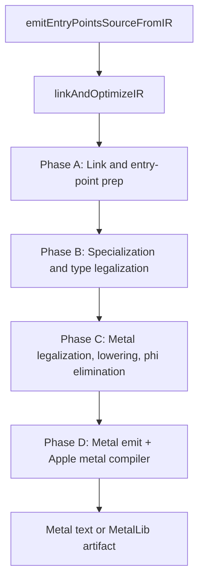
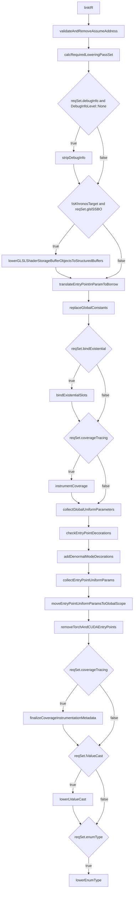
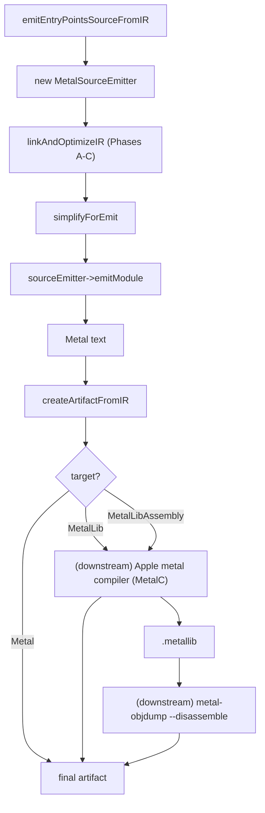

# Metal Target Pipeline

This page documents the ordered IR-pass and downstream-binary
sequence executed when Slang compiles for the Metal target family.
It is written for a compiler developer who needs to find where in
the Metal codegen pipeline a particular pass runs, what condition
selects it, and how `legalizeIRForMetal` and `MetalSourceEmitter`
cooperate. The corresponding `CodeGenTarget` values are `Metal`, `MetalLib`,
and `MetalLibAssembly`. All three share most of the Metal
legalization pipeline and differ mainly in the downstream tool
that consumes the emitted Metal text. On the normal public
emission path the IR pipeline is identical for all three: a
`MetalLibAssembly` request first emits an intermediate `MetalLib`,
and a `MetalLib` request first emits intermediate `Metal` source
(see `_getIntermediateTarget` at line 1077 and
`_getDefaultSourceForTarget` at line 253 of
[slang-code-gen.cpp](../../../../source/slang/slang-code-gen.cpp)),
so `linkAndOptimizeIR` always runs with `CodeGenTarget::Metal` and
the `Metal` / `MetalLib` switch arm — including
`wrapCBufferElementsForMetal` at
[slang-emit.cpp](../../../../source/slang/slang-emit.cpp)
line ~2007 — fires for every Metal output. The shared predicate
inside `linkAndOptimizeIR` is
`isMetalTarget(targetRequest)` (see
[slang-type-layout.cpp](../../../../source/slang/slang-type-layout.cpp)
line 3270, which forwards to the `CodeGenTarget` overload at line
3256). This page complements
[../pipeline/05-ir-passes.md](../pipeline/05-ir-passes.md), which
is an unordered topical catalog of every IR pass. Branches in
`linkAndOptimizeIR` gated on a sibling target (SPIR-V, HLSL,
WGSL, CUDA, CPU, GLSL, PyTorch) are filtered out of the diagrams
and tables below.

**The backend pipeline is not an unconditional ordered list.** A
large and growing fraction of the passes below run only when the
linked IR module actually contains the construct the pass handles.
The predicate is a `RequiredLoweringPassSet` (declared at
[slang-code-gen.h](../../../../source/slang/slang-code-gen.h)
line 52), computed by `calcRequiredLoweringPassSet`
([slang-emit.cpp](../../../../source/slang/slang-emit.cpp)
line 405) — a recursive walk over every instruction in the module
that sets one `bool` per lowering construct. `linkAndOptimizeIR`
resets the set and runs the walk twice: once immediately after
`linkIR` (line 1049) and again after specialization (line 1520).
The flags **accumulate** across the two scans; they are not reset
between them, so a construct seen by the first scan still gates a
pass that runs after the second. Each gate is only sound because
the flagged opcode has no producer between the last scan and the
gated call site; the source comments at each gate name the
producer and argue the flag cannot be a false-negative (see the
call-site comments at lines 1330-1336, 1579-1585, 1600-1605, and
1744-1752). A stale-true flag is harmless — the pass runs and
finds nothing. Every `Gate` column entry of the form
`reqSet.<flag>` in the phase tables below is one of these flags.

## Source

- [slang-emit.cpp](../../../../source/slang/slang-emit.cpp) —
  `linkAndOptimizeIR` (line ~970) is the orchestrator;
  `emitEntryPointsSourceFromIR` (line ~2746) constructs the
  `MetalSourceEmitter` and emits Metal text.
  `calcRequiredLoweringPassSet` (line ~405) computes the flag set
  that gates most of the pipeline.
- [slang-emit-metal.cpp](../../../../source/slang/slang-emit-metal.cpp)
  — `MetalSourceEmitter` implementation.
- [slang-emit-metal-prelude.cpp](../../../../source/slang/slang-emit-metal-prelude.cpp)
  — Metal-specific prelude emission.
- [slang-emit-c-like.cpp](../../../../source/slang/slang-emit-c-like.cpp)
  — shared C-like emitter base class.
- [slang-ir-metal-legalize.cpp](../../../../source/slang/slang-ir-metal-legalize.cpp)
  — `legalizeIRForMetal` (line ~408) is the central Metal
  legalization driver.
- [slang-ir-legalize-varying-params.cpp](../../../../source/slang/slang-ir-legalize-varying-params.cpp)
  — `legalizeEntryPointVaryingParamsForMetal`.
- [slang-ir-legalize-binary-operator.cpp](../../../../source/slang/slang-ir-legalize-binary-operator.cpp)
  — `legalizeLogicalAndOr` runs for Metal.
- [slang-target-program.h](../../../../source/slang/slang-target-program.h)
  / [slang-compiler-options.h](../../../../source/slang/slang-compiler-options.h)
  — gate sources.

## High-level phase diagram

```mermaid
flowchart TD
  entry[emitEntryPointsSourceFromIR]
  entry --> linkOpt[linkAndOptimizeIR]
  linkOpt --> phaseA["Phase A: Link and entry-point prep"]
  phaseA --> phaseB["Phase B: Specialization and type legalization"]
  phaseB --> phaseC["Phase C: Metal legalization, lowering, phi elimination"]
  phaseC --> phaseD["Phase D: Metal emit + Apple metal compiler"]
  phaseD --> artifact[Metal text or MetalLib artifact]
```

Metal takes the `default` arm of nearly every per-target switch in
Phases A and B, so most of what runs there is the shared shader
pipeline. Metal's divergence is concentrated in
Phase C (`legalizeIRForMetal`, `specializeAddressSpaceForMetal`,
the late `MetalPointerLowering` block) plus a handful of Phase-B
decisions that are Metal-only
(`wrapCBufferElementsForMetal`, the `legalizeEmptyTypes` Metal
arm, the `MetalParameterBlock` buffer-element policy) and the
coverage counter-width cap in Phase A.

## Phase A: Link and entry-point prep

Spans roughly lines 1005-1344 of
[slang-emit.cpp](../../../../source/slang/slang-emit.cpp). Metal
hits the `default` arm of every per-target switch in this phase.
Like WGSL, Metal is non-Khronos, so the
`!isKhronosTarget && reqSet.glslSSBO` gate lets
`lowerGLSLShaderStorageBufferObjectsToStructuredBuffers` fire.

```mermaid
flowchart TD
  linkIRn[linkIR]
  vaaa[validateAndRemoveAssumeAddress]
  reqSet1[calcRequiredLoweringPassSet]
  diGate{reqSet.debugInfo and DebugInfoLevel::None}
  stripDI[stripDebugInfo]
  ssboGate{"!isKhronosTarget and reqSet.glslSSBO"}
  ssbo[lowerGLSLShaderStorageBufferObjectsToStructuredBuffers]
  tEPInBorrow[translateEntryPointInParamToBorrow]
  rGC[replaceGlobalConstants]
  beGate{reqSet.bindExistential}
  bES[bindExistentialSlots]
  covGate{reqSet.coverageTracing}
  iC[instrumentCoverage]
  cGUP[collectGlobalUniformParameters]
  cEPD[checkEntryPointDecorations]
  aDMD[addDenormalModeDecorations]
  cEPUP[collectEntryPointUniformParams]
  mEPUP[moveEntryPointUniformParamsToGlobalScope]
  rTCEP[removeTorchAndCUDAEntryPoints]
  covGate2{reqSet.coverageTracing}
  fCIM[finalizeCoverageInstrumentationMetadata]
  lvcGate{reqSet.lValueCast}
  lLVC[lowerLValueCast]
  enumGate{reqSet.enumType}
  lET[lowerEnumType]

  linkIRn --> vaaa --> reqSet1 --> diGate
  diGate -->|true| stripDI --> ssboGate
  diGate -->|false| ssboGate
  ssboGate -->|true| ssbo --> tEPInBorrow
  ssboGate -->|false| tEPInBorrow
  tEPInBorrow --> rGC --> beGate
  beGate -->|true| bES --> covGate
  beGate -->|false| covGate
  covGate -->|true| iC --> cGUP
  covGate -->|false| cGUP
  cGUP --> cEPD --> aDMD --> cEPUP --> mEPUP --> rTCEP --> covGate2
  covGate2 -->|true| fCIM --> lvcGate
  covGate2 -->|false| lvcGate
  lvcGate -->|true| lLVC --> enumGate
  lvcGate -->|false| enumGate
  enumGate -->|true| lET
```

| # | Pass | File | Gate | Notes |
| --- | --- | --- | --- | --- |
| 1 | `linkIR` | [slang-ir-link.cpp](../../../../source/slang/slang-ir-link.cpp) | (always) | |
| 2 | `validateAndRemoveAssumeAddress` | [slang-ir-validate.cpp](../../../../source/slang/slang-ir-validate.cpp) | (always) | `validate=true` (Metal is non-CPU/CUDA). |
| 3 | `stripDebugInfo` | [slang-ir-strip-debug-info.cpp](../../../../source/slang/slang-ir-strip-debug-info.cpp) | `reqSet.debugInfo && DebugInfoLevel::None` | |
| 4 | `lowerGLSLShaderStorageBufferObjectsToStructuredBuffers` | [slang-ir-lower-glsl-ssbo-types.cpp](../../../../source/slang/slang-ir-lower-glsl-ssbo-types.cpp) | `!isKhronosTarget && reqSet.glslSSBO` | Metal is non-Khronos. |
| 5 | `translateEntryPointInParamToBorrow` | [slang-ir-transform-params-to-constref.cpp](../../../../source/slang/slang-ir-transform-params-to-constref.cpp) | (always) | |
| 6 | `replaceGlobalConstants` | [slang-ir-link.cpp](../../../../source/slang/slang-ir-link.cpp) | (always) | |
| 7 | `bindExistentialSlots` | [slang-ir-bind-existentials.cpp](../../../../source/slang/slang-ir-bind-existentials.cpp) | `reqSet.bindExistential` | |
| 8 | `instrumentCoverage` | [slang-ir-coverage-instrument.cpp](../../../../source/slang/slang-ir-coverage-instrument.cpp) | `reqSet.coverageTracing` | `SLANG_PASS` at line ~1216. Takes a `counterByteWidth` (default `kDefaultCoverageCounterByteWidth`, overridable via `CompilerOptionName::TraceCoverageCounterByteWidth`; must be 4 or 8 or the API path raises `Diagnostics::CoverageCounterWidthBytesInvalid` / `E45114`, the API-path counterpart to the CLI's `E45113`) and a `coverageBoolean` flag (`CompilerOptionName::TraceCoverageBoolean`, off by default). **Metal-specific**: lines 1210-1215 cap `counterByteWidth` to 4 for Metal targets — see [Metal caps coverage counters to 32 bits](#metal-caps-coverage-counters-to-32-bits). |
| 9 | `collectGlobalUniformParameters` | [slang-ir-collect-global-uniforms.cpp](../../../../source/slang/slang-ir-collect-global-uniforms.cpp) | (always) | |
| 10 | `checkEntryPointDecorations` | [slang-ir-entry-point-decorations.cpp](../../../../source/slang/slang-ir-entry-point-decorations.cpp) | (always) | |
| 11 | `addDenormalModeDecorations` | [slang-emit.cpp](../../../../source/slang/slang-emit.cpp) | (always) | Static helper defined at line ~756, called at line ~1240. |
| 12 | `collectEntryPointUniformParams` | [slang-ir-entry-point-uniforms.cpp](../../../../source/slang/slang-ir-entry-point-uniforms.cpp) | (always, Metal via `default` arm) | |
| 13 | `moveEntryPointUniformParamsToGlobalScope` | [slang-ir-entry-point-uniforms.cpp](../../../../source/slang/slang-ir-entry-point-uniforms.cpp) | (always, Metal via `default` arm) | |
| 14 | `removeTorchAndCUDAEntryPoints` | [slang-ir-pytorch-cpp-binding.cpp](../../../../source/slang/slang-ir-pytorch-cpp-binding.cpp) | (always, Metal via `default` arm) | |
| 15 | `finalizeCoverageInstrumentationMetadata` | [slang-ir-coverage-instrument.cpp](../../../../source/slang/slang-ir-coverage-instrument.cpp) | `reqSet.coverageTracing` | Runs after entry-point uniform packing; fills CPU/CUDA uniform-marshaling fields on the coverage `ArtifactPostEmitMetadata` produced by step 8. No-op for Metal in practice. |
| 16 | `lowerLValueCast` | [slang-ir-lower-l-value-cast.cpp](../../../../source/slang/slang-ir-lower-l-value-cast.cpp) | `reqSet.lValueCast` | Line ~1337. The flag is set by `kIROp_InOutImplicitCast` / `kIROp_OutImplicitCast`, both produced only by the front end, so the gate cannot be a false-negative. |
| 17 | `lowerEnumType` | [slang-ir-lower-enum-type.cpp](../../../../source/slang/slang-ir-lower-enum-type.cpp) | `reqSet.enumType` | Line ~1343. The flag is set by `kIROp_EnumType` **and** by the three surviving-cast opcodes `kIROp_CastEnumToInt` / `kIROp_CastIntToEnum` / `kIROp_EnumCast` (lines 457-473), so constant folding that eliminates the last live `IREnumType` while leaving a degenerate cast behind no longer strands that cast at emit. The `Constexpr*` cast variants are deliberately excluded. |

Filtered out for Metal in this phase: the CUDA / CUDAHeader arm
of the entry-point-param switch
(`collectOptiXEntryPointUniformParams`); the CPP / Host* arms.

## Phase B: Specialization and type legalization

Spans roughly lines 1346-2007 of `slang-emit.cpp`. Metal hits the
`default` arm at most decision points and runs
`lowerCooperativeVectors` (the `default` arm at line ~1695).
Metal-specific decisions:

- `lowerCombinedTextureSamplers` fires (Metal is in the
  HLSL / Metal / WGSL arm at lines 1764-1771), still subject to
  `reqSet.combinedTextureSamplers`.
- `lowerAppendConsumeStructuredBuffers` fires when the module
  contains one of those buffer types: the gate is now
  `target != HLSL && reqSet.appendConsumeStructuredBuffer`
  (line 1753).
- Inside the `shouldLegalizeExistentialAndResourceTypes` block,
  the `isMetalTarget(targetRequest)` arm runs an
  extra `lowerBufferElementTypeToStorageType` with
  `BufferElementTypeLoweringPolicyKind::MetalParameterBlock`
  (lines 1812-1814) to translate resource-typed fields inside
  parameter blocks into descriptor handles before the general
  resource legalization.
- `legalizeEmptyTypes` runs in two places for Metal:
  - The Metal arm of the inner switch at line ~1901 (after
    `legalizeResourceTypes`, under
    `shouldLegalizeExistentialAndResourceTypes`).
  - The unconditional invocation later in Phase C (line 2542).
- `wrapCBufferElementsForMetal` fires (line ~2007).
  The case list contains only `Metal` and
  `MetalLib`, but `MetalLibAssembly` is never seen here directly:
  on the public emission path it is produced by disassembling an
  intermediate `MetalLib` artifact, so `linkAndOptimizeIR` runs
  with `CodeGenTarget::Metal` and this pass always fires.

```mermaid
flowchart TD
  s1[simplifyIR default]
  vuGate{"getBoolOption(ValidateUniformity)"}
  vu[validateUniformity]
  sML[specializeMatrixLayout]
  fscGate{"!shouldPerformMinimumOptimizations"}
  fSC[fuseCallsToSaturatedCooperation]
  adGate{reqSet.autodiff}
  cAP[checkAutodiffPatterns]
  dCC[diagnoseCircularConformances]
  sdGate{"!isSpecializationDisabled()"}
  sM[specializeModule]
  hofGate{reqSet.higherOrderFunc}
  sHOP[specializeHigherOrderParameters]
  adGate2{reqSet.autodiff}
  fADP[finalizeAutoDiffPass]
  sADD[stripAutoDiffDecorations]
  mssGate{reqSet.matrixSwizzleStore}
  lMSS[lowerMatrixSwizzleStores]
  dce1[eliminateDeadCode]
  fS[finalizeSpecialization]
  adGate3{reqSet.autodiff}
  lDTI[lowerDiffTypeInfoInsts]
  ctGate{reqSet.conditionalType}
  lCT[lowerConditionalType]
  roGate{reqSet.optionalType}
  lRO[lowerReinterpretOptional]
  nevGate1{shouldRunNonEssentialValidation}
  cONU[checkForOptionalNoneUsage]
  otGate{reqSet.optionalType}
  lOT[lowerOptionalType]
  rtGate{reqSet.resultType}
  lRT[lowerResultType]
  reqSet2[calcRequiredLoweringPassSet]
  dUR[detectUninitializedResources]
  raidGate{removeAvailableInDownstreamIR}
  rAIDD[removeAvailableInDownstreamModuleDecorations]
  nevGate2{shouldRunNonEssentialValidation}
  cRT[checkForRecursiveTypes]
  cRF[checkForRecursiveFunctions]
  cOBA[checkForOutOfBoundAccess]
  mrGate{reqSet.missingReturn}
  cMR[checkForMissingReturns]
  cISPT[checkForInvalidShaderParameterType]
  iAVS[inferAnyValueSizeWhereNecessary]
  uPWT[unpinWitnessTables]
  svmGate{reqSet.sumVectorMatrix}
  lSVMI[lowerSumVectorMatrixInsts]
  minOptGate1{"!minimalOptimization"}
  s2a[simplifyIR fast]
  genGate{reqSet.generics}
  dceGen[eliminateDeadCode]
  tuGate{reqSet.taggedUnion}
  lTUT[lowerTaggedUnionTypes]
  lUUT[lowerUntaggedUnionTypes]
  reinterpretGate{reqSet.reinterpret}
  lR[lowerReinterpret]
  lSIDC[lowerSequentialIDTagCasts]
  lTI[lowerTagInsts]
  lTT[lowerTagTypes]
  dce3[eliminateDeadCode]
  lE[lowerExistentials]
  rWUI[removeWeakUseInsts]
  pTIN[performTypeInlining]
  nevGate3{shouldRunNonEssentialValidation}
  cGSHI[checkGetStringHashInsts]
  dce4[eliminateDeadCode]
  lTu[lowerTuples]
  gAVMF[generateAnyValueMarshallingFunctions]
  ssGate{reqSet.specializeStageSwitch}
  sSS[specializeStageSwitch]
  lCV[lowerCooperativeVectors]
  pFI1[performForceInlining]
  minOptGate2{minimalOptimization}
  aSCCP[applySparseConditionalConstantPropagation]
  dceScp[eliminateDeadCode]
  s2b[simplifyIR default]
  acsbGate{"target != HLSL and reqSet.appendConsumeStructuredBuffer"}
  lACSB[lowerAppendConsumeStructuredBuffers]
  ctsGate{reqSet.combinedTextureSamplers}
  lCTS[lowerCombinedTextureSamplers]
  vERGate{getBoolOption VulkanEmitReflection}
  aUTHD[addUserTypeHintDecorations]
  lEA[legalizeEmptyArray]
  lVT[legalizeVectorTypes]
  existGate{shouldLegalizeExistentialAndResourceTypes}
  iGC[inlineGlobalConstantsForLegalization]
  lBETST_Metal["lowerBufferElementTypeToStorageType<br/>(MetalParameterBlock policy)"]
  etlGate{reqSet.existentialTypeLayout}
  lETL[legalizeExistentialTypeLayout]
  vSBRT[validateStructuredBufferResourceTypes]
  lRTR[legalizeResourceTypes]
  lET_Metal["legalizeEmptyTypes (Metal arm)"]
  lET_else["legalizeEmptyTypes (else path)"]
  lMT[legalizeMatrixTypes]
  minOptGate3{"!minimalOptimization"}
  s2c[simplifyIR fast]
  dceMin3[eliminateDeadCode]
  urhGate{reqSet.untypedResourceHandle}
  lURH[lowerUntypedResourceHandleToUInt]
  drhGate{reqSet.dynamicResourceHeap}
  lDRH[lowerDynamicResourceHeap]
  sRU[specializeResourceUsage]
  sFBLA1[specializeFuncsForBufferLoadArgs]
  dBL[deferBufferLoad]
  sAP[specializeArrayParameters]
  cSA[checkStaticAssert]
  wCBE[wrapCBufferElementsForMetal]

  s1 --> vuGate
  vuGate -->|true| vu --> sML
  vuGate -->|false| sML
  sML --> fscGate
  fscGate -->|true| fSC --> adGate
  fscGate -->|false| adGate
  adGate -->|true| cAP --> dCC
  adGate -->|false| dCC
  dCC --> sdGate
  sdGate -->|true| sM --> hofGate
  sdGate -->|false| hofGate
  hofGate -->|true| sHOP --> adGate2
  hofGate -->|false| adGate2
  adGate2 -->|true| fADP --> mssGate
  adGate2 -->|false| sADD --> mssGate
  mssGate -->|true| lMSS --> dce1
  mssGate -->|false| dce1
  dce1 --> fS --> adGate3
  adGate3 -->|true| lDTI --> ctGate
  adGate3 -->|false| ctGate
  ctGate -->|true| lCT --> roGate
  ctGate -->|false| roGate
  roGate -->|true| lRO --> nevGate1
  roGate -->|false| nevGate1
  nevGate1 -->|true| cONU --> otGate
  nevGate1 -->|false| otGate
  otGate -->|true| lOT --> rtGate
  otGate -->|false| rtGate
  rtGate -->|true| lRT --> reqSet2
  rtGate -->|false| reqSet2
  reqSet2 --> dUR --> raidGate
  raidGate -->|true| rAIDD --> nevGate2
  raidGate -->|false| nevGate2
  nevGate2 -->|true| cRT --> cRF --> cOBA --> mrGate
  nevGate2 -->|false| iAVS
  mrGate -->|true| cMR --> cISPT
  mrGate -->|false| cISPT
  cISPT --> iAVS
  iAVS --> uPWT --> svmGate
  svmGate -->|true| lSVMI --> minOptGate1
  svmGate -->|false| minOptGate1
  minOptGate1 -->|true| s2a --> tuGate
  minOptGate1 -->|false| genGate
  genGate -->|true| dceGen --> tuGate
  genGate -->|false| tuGate
  tuGate -->|true| lTUT --> lUUT
  tuGate -->|false| lUUT
  lUUT --> reinterpretGate
  reinterpretGate -->|true| lR --> lSIDC
  reinterpretGate -->|false| lSIDC
  lSIDC --> lTI --> lTT --> dce3 --> lE --> rWUI --> pTIN --> nevGate3
  nevGate3 -->|true| cGSHI --> dce4
  nevGate3 -->|false| dce4
  dce4 --> lTu --> gAVMF --> ssGate
  ssGate -->|true| sSS --> lCV
  ssGate -->|false| lCV
  lCV --> pFI1 --> minOptGate2
  minOptGate2 -->|true| aSCCP --> dceScp --> acsbGate
  minOptGate2 -->|false| s2b --> acsbGate
  acsbGate -->|true| lACSB --> ctsGate
  acsbGate -->|false| ctsGate
  ctsGate -->|true| lCTS --> vERGate
  ctsGate -->|false| vERGate
  vERGate -->|true| aUTHD --> lEA
  vERGate -->|false| lEA
  lEA --> lVT --> existGate
  existGate -->|true| iGC --> lBETST_Metal --> etlGate
  etlGate -->|true| lETL --> vSBRT
  etlGate -->|false| vSBRT
  vSBRT --> lRTR --> lET_Metal --> lMT
  existGate -->|false| lET_else --> lMT
  lMT --> minOptGate3
  minOptGate3 -->|true| s2c --> urhGate
  minOptGate3 -->|false| dceMin3 --> urhGate
  urhGate -->|true| lURH --> drhGate
  urhGate -->|false| drhGate
  drhGate -->|true| lDRH --> sRU
  drhGate -->|false| sRU
  sRU --> sFBLA1 --> dBL --> sAP --> cSA --> wCBE
```

Diamonds are conditional gates: the `true` arm runs the gated pass
and the `false` arm falls through. Target-constant gates that are
always taken for Metal (e.g. `isMetalTarget`, `target != HLSL`,
`!isCpuLikeTarget`, the Metal arms of the legalization switches) are
drawn as unconditional nodes, per the filtered-branch convention for
target-pipeline diagrams. The companion table below lists every pass
with its exact gate expression.

| # | Pass | File | Gate | Notes |
| --- | --- | --- | --- | --- |
| 1 | `simplifyIR` | [slang-ir-ssa-simplification.cpp](../../../../source/slang/slang-ir-ssa-simplification.cpp) | (always) | `defaultIRSimplificationOptions`. |
| 2 | `validateUniformity` | [slang-ir-uniformity.cpp](../../../../source/slang/slang-ir-uniformity.cpp) | `getBoolOption(ValidateUniformity)` | |
| 3 | `specializeMatrixLayout` | [slang-ir-specialize-matrix-layout.cpp](../../../../source/slang/slang-ir-specialize-matrix-layout.cpp) | (always) | |
| 4 | `fuseCallsToSaturatedCooperation` | [slang-ir-fuse-satcoop.cpp](../../../../source/slang/slang-ir-fuse-satcoop.cpp) | `!shouldPerformMinimumOptimizations` | |
| 5 | `checkAutodiffPatterns` | [slang-ir-check-differentiability.cpp](../../../../source/slang/slang-ir-check-differentiability.cpp) | `reqSet.autodiff` | |
| 6 | `diagnoseCircularConformances` | [slang-ir-any-value-inference.cpp](../../../../source/slang/slang-ir-any-value-inference.cpp) | (always) | |
| 7 | `specializeModule` | [slang-ir-specialize.cpp](../../../../source/slang/slang-ir-specialize.cpp) | `!isSpecializationDisabled()` | |
| 8 | `specializeHigherOrderParameters` | [slang-ir-defunctionalization.cpp](../../../../source/slang/slang-ir-defunctionalization.cpp) | `reqSet.higherOrderFunc` | |
| 9 | `finalizeAutoDiffPass` | [slang-ir-autodiff.cpp](../../../../source/slang/slang-ir-autodiff.cpp) | `reqSet.autodiff` (line 1446) | Builds an `AutoDiffSharedContext` over the whole module; skipped when no autodiff IR is present. Exactly one of this row and the next runs. |
| 10 | `stripAutoDiffDecorations` | [slang-ir-autodiff.cpp](../../../../source/slang/slang-ir-autodiff.cpp) | `!reqSet.autodiff` (the `else` arm at line 1452) | Still has to strip the `Export`/`HLSLExport`/`KeepAlive` pins that the core module's `[__AutoDiffBuiltin]` types (e.g. `NullDifferential`) carry, or the DCE two rows below could not drop them. |
| 11 | `lowerMatrixSwizzleStores` | [slang-ir-lower-matrix-swizzle-store.cpp](../../../../source/slang/slang-ir-lower-matrix-swizzle-store.cpp) | `reqSet.matrixSwizzleStore` | |
| 12 | `eliminateDeadCode` | [slang-ir-dce.cpp](../../../../source/slang/slang-ir-dce.cpp) | (always) | |
| 13 | `finalizeSpecialization` | [slang-ir-specialize.cpp](../../../../source/slang/slang-ir-specialize.cpp) | (always) | |
| 14 | `lowerDiffTypeInfoInsts` | [slang-ir-autodiff.cpp](../../../../source/slang/slang-ir-autodiff.cpp) | `reqSet.autodiff` | Direct call, not a `SLANG_PASS` (line 1466). |
| 15 | `lowerConditionalType` | [slang-ir-lower-conditional-type.cpp](../../../../source/slang/slang-ir-lower-conditional-type.cpp) | `reqSet.conditionalType` | |
| 16 | `lowerReinterpretOptional` | [slang-ir-lower-reinterpret.cpp](../../../../source/slang/slang-ir-lower-reinterpret.cpp) | `reqSet.optionalType` | |
| 17 | `checkForOptionalNoneUsage` | [slang-ir-check-optional-none-usage.cpp](../../../../source/slang/slang-ir-check-optional-none-usage.cpp) | `shouldRunNonEssentialValidation()` | |
| 18 | `lowerOptionalType` | [slang-ir-lower-optional-type.cpp](../../../../source/slang/slang-ir-lower-optional-type.cpp) | `reqSet.optionalType` | |
| 19 | `lowerResultType` | [slang-ir-lower-result-type.cpp](../../../../source/slang/slang-ir-lower-result-type.cpp) | `reqSet.resultType` | Now runs **after** `lowerOptionalType`: depends on accurate `getAnyValueSize()` results, which requires Optional lowering first. |
| 20 | `detectUninitializedResources` | [slang-ir-detect-uninitialized-resources.cpp](../../../../source/slang/slang-ir-detect-uninitialized-resources.cpp) | (always) | |
| 21 | `removeAvailableInDownstreamModuleDecorations` | [slang-ir-redundancy-removal.cpp](../../../../source/slang/slang-ir-redundancy-removal.cpp) | `removeAvailableInDownstreamIR` | |
| 22 | `checkForRecursiveTypes` | [slang-ir-check-recursion.cpp](../../../../source/slang/slang-ir-check-recursion.cpp) | `shouldRunNonEssentialValidation()` | |
| 23 | `checkForRecursiveFunctions` | [slang-ir-check-recursion.cpp](../../../../source/slang/slang-ir-check-recursion.cpp) | `shouldRunNonEssentialValidation()` | |
| 24 | `checkForOutOfBoundAccess` | [slang-check-out-of-bound-access.cpp](../../../../source/slang/slang-check-out-of-bound-access.cpp) | `shouldRunNonEssentialValidation()` | |
| 25 | `checkForMissingReturns` | [slang-ir-missing-return.cpp](../../../../source/slang/slang-ir-missing-return.cpp) | `reqSet.missingReturn` | |
| 26 | `checkForInvalidShaderParameterType` | [slang-ir-check-shader-parameter-type.cpp](../../../../source/slang/slang-ir-check-shader-parameter-type.cpp) | `shouldRunNonEssentialValidation()` | |
| 27 | `inferAnyValueSizeWhereNecessary` | [slang-ir-any-value-inference.cpp](../../../../source/slang/slang-ir-any-value-inference.cpp) | (always) | |
| 28 | `unpinWitnessTables` | [slang-ir-strip-legalization-insts.cpp](../../../../source/slang/slang-ir-strip-legalization-insts.cpp) | (always) | |
| 29 | `lowerSumVectorMatrixInsts` | [slang-emit.cpp](../../../../source/slang/slang-emit.cpp) | `reqSet.sumVectorMatrix` | Static helper; gated at line 1586. `kIROp_SumVectorElements` / `kIROp_SumMatrixElements` are produced only by the autodiff transpose pass reached through row 9, which runs before the second `calcRequiredLoweringPassSet` scan. |
| 30 | `simplifyIR` | [slang-ir-ssa-simplification.cpp](../../../../source/slang/slang-ir-ssa-simplification.cpp) | `!minimalOptimization` | `fastIRSimplificationOptions`. |
| 31 | `eliminateDeadCode` | [slang-ir-dce.cpp](../../../../source/slang/slang-ir-dce.cpp) | `minimalOptimization && reqSet.generics` | `else if` arm of the simplify gate (line ~1593); replaces row 30 on the minimal-optimization path. |
| 32 | `lowerTaggedUnionTypes` | [slang-ir-lower-dynamic-dispatch-insts.cpp](../../../../source/slang/slang-ir-lower-dynamic-dispatch-insts.cpp) | `reqSet.taggedUnion` | Line 1606. This is the one gate whose pass **feeds back into the flag set**: when the pass reports it changed something, the call site sets `reqSet.reinterpret = true` (line 1609) because tagged-union lowering synthesizes reinterpret instructions that row 33 must then lower. |
| 33 | `lowerUntaggedUnionTypes` | [slang-ir-lower-dynamic-dispatch-insts.cpp](../../../../source/slang/slang-ir-lower-dynamic-dispatch-insts.cpp) | (always) | |
| 34 | `lowerReinterpret` | [slang-ir-lower-reinterpret.cpp](../../../../source/slang/slang-ir-lower-reinterpret.cpp) | `reqSet.reinterpret` | |
| 35 | `lowerSequentialIDTagCasts` | [slang-ir-lower-dynamic-dispatch-insts.cpp](../../../../source/slang/slang-ir-lower-dynamic-dispatch-insts.cpp) | (always) | |
| 36 | `lowerTagInsts` | [slang-ir-lower-dynamic-dispatch-insts.cpp](../../../../source/slang/slang-ir-lower-dynamic-dispatch-insts.cpp) | (always) | |
| 37 | `lowerTagTypes` | [slang-ir-lower-dynamic-dispatch-insts.cpp](../../../../source/slang/slang-ir-lower-dynamic-dispatch-insts.cpp) | (always) | |
| 38 | `eliminateDeadCode` | [slang-ir-dce.cpp](../../../../source/slang/slang-ir-dce.cpp) | (always) | |
| 39 | `lowerExistentials` | [slang-ir-lower-dynamic-dispatch-insts.cpp](../../../../source/slang/slang-ir-lower-dynamic-dispatch-insts.cpp) | (always) | |
| 40 | `removeWeakUseInsts` | [slang-ir-redundancy-removal.cpp](../../../../source/slang/slang-ir-redundancy-removal.cpp) | (always) | |
| 41 | `performTypeInlining` | [slang-ir-inline.cpp](../../../../source/slang/slang-ir-inline.cpp) | `!isCpuLikeTarget` (true for Metal) | |
| 42 | `checkGetStringHashInsts` | [slang-ir-string-hash.cpp](../../../../source/slang/slang-ir-string-hash.cpp) | `!isCpuLikeTarget && shouldRunNonEssentialValidation()` | |
| 43 | `eliminateDeadCode` | [slang-ir-dce.cpp](../../../../source/slang/slang-ir-dce.cpp) | (always) | Direct call at line 1654, not a `SLANG_PASS`; uses `fastIRSimplificationOptions.deadCodeElimOptions`. |
| 44 | `lowerTuples` | [slang-ir-lower-tuple-types.cpp](../../../../source/slang/slang-ir-lower-tuple-types.cpp) | (always) | |
| 45 | `generateAnyValueMarshallingFunctions` | [slang-ir-any-value-marshalling.cpp](../../../../source/slang/slang-ir-any-value-marshalling.cpp) | (always) | |
| 46 | `specializeStageSwitch` | [slang-ir-specialize-stage-switch.cpp](../../../../source/slang/slang-ir-specialize-stage-switch.cpp) | `reqSet.specializeStageSwitch` | |
| 47 | `lowerCooperativeVectors` | [slang-ir-lower-coopvec.cpp](../../../../source/slang/slang-ir-lower-coopvec.cpp) | (always, Metal via `default` arm at line ~1695) | |
| 48 | `performForceInlining` | [slang-ir-inline.cpp](../../../../source/slang/slang-ir-inline.cpp) | (always) | |
| 49 | `applySparseConditionalConstantPropagation` | [slang-ir-sccp.cpp](../../../../source/slang/slang-ir-sccp.cpp) | `minimalOptimization` | Minimal-optimization arm (line ~1712); cleans up dead branches revealed by force-inlining. |
| 50 | `eliminateDeadCode` | [slang-ir-dce.cpp](../../../../source/slang/slang-ir-dce.cpp) | `minimalOptimization` | Paired with the SCCP pass (line ~1717). |
| 51 | `simplifyIR` | [slang-ir-ssa-simplification.cpp](../../../../source/slang/slang-ir-ssa-simplification.cpp) | `!minimalOptimization` | `else` arm (line ~1721); `defaultIRSimplificationOptions`. |
| 52 | `lowerAppendConsumeStructuredBuffers` | [slang-ir-lower-append-consume-structured-buffer.cpp](../../../../source/slang/slang-ir-lower-append-consume-structured-buffer.cpp) | `target != HLSL && reqSet.appendConsumeStructuredBuffer` | Line 1753. `AppendStructuredBuffer` / `ConsumeStructuredBuffer` come only from the front end, so the flag cannot be a false-negative; a stale-true flag (buffer dead-code-eliminated after a scan) just makes the walk a no-op. |
| 53 | `lowerCombinedTextureSamplers` | [slang-ir-lower-combined-texture-sampler.cpp](../../../../source/slang/slang-ir-lower-combined-texture-sampler.cpp) | `reqSet.combinedTextureSamplers` (Metal arm) | |
| 54 | `addUserTypeHintDecorations` | [slang-ir-user-type-hint.cpp](../../../../source/slang/slang-ir-user-type-hint.cpp) | `getBoolOption(VulkanEmitReflection)` (line 1774) | Not target-gated, so it is reachable on a Metal compile whenever the option is set; it carries no Metal-specific behavior. |
| 55 | `legalizeEmptyArray` | [slang-ir-legalize-empty-array.cpp](../../../../source/slang/slang-ir-legalize-empty-array.cpp) | (always) | |
| 56 | `legalizeVectorTypes` | [slang-ir-legalize-vector-types.cpp](../../../../source/slang/slang-ir-legalize-vector-types.cpp) | (always) | |
| 57 | `inlineGlobalConstantsForLegalization` | [slang-ir-legalize-global-values.cpp](../../../../source/slang/slang-ir-legalize-global-values.cpp) | `shouldLegalizeExistentialAndResourceTypes` (default `true` for Metal) | |
| 58 | `lowerBufferElementTypeToStorageType` | [slang-ir-lower-buffer-element-type.cpp](../../../../source/slang/slang-ir-lower-buffer-element-type.cpp) | `isMetalTarget` | Inside the existential/resource block at lines 1812-1814; `loweringPolicyKind = MetalParameterBlock`. **Metal-only first invocation.** |
| 59 | `legalizeExistentialTypeLayout` | [slang-ir-legalize-types.cpp](../../../../source/slang/slang-ir-legalize-types.cpp) | `reqSet.existentialTypeLayout` | |
| 60 | `validateStructuredBufferResourceTypes` | [slang-ir-validate.cpp](../../../../source/slang/slang-ir-validate.cpp) | (always) | Direct call. |
| 61 | `legalizeResourceTypes` | [slang-ir-legalize-types.cpp](../../../../source/slang/slang-ir-legalize-types.cpp) | (always) | |
| 62 | `legalizeEmptyTypes` (Metal arm) | [slang-ir-legalize-types.cpp](../../../../source/slang/slang-ir-legalize-types.cpp) | `case Metal / MetalLib / MetalLibAssembly` (lines 1896-1903) | **Metal-only**; the `true` arm of `shouldLegalizeExistentialAndResourceTypes`. Runs again unconditionally later. |
| 63 | `legalizeEmptyTypes` (else path) | [slang-ir-legalize-types.cpp](../../../../source/slang/slang-ir-legalize-types.cpp) | `!shouldLegalizeExistentialAndResourceTypes` | `else` branch (line ~1911); the only pass on the false arm, which skips rows 57-62 and rejoins before `legalizeMatrixTypes`. |
| 64 | `legalizeMatrixTypes` | [slang-ir-legalize-matrix-types.cpp](../../../../source/slang/slang-ir-legalize-matrix-types.cpp) | (always) | |
| 65 | `eliminateDeadCode` | [slang-ir-dce.cpp](../../../../source/slang/slang-ir-dce.cpp) | `minimalOptimization` (the `if` arm at line 1938) | `deadCodeEliminationOptions`. Exactly one of this row and the next runs. |
| 66 | `simplifyIR` | [slang-ir-ssa-simplification.cpp](../../../../source/slang/slang-ir-ssa-simplification.cpp) | `!minimalOptimization` (the `else` arm at line 1941) | `fastIRSimplificationOptions`. |
| 67 | `lowerUntypedResourceHandleToUInt` | [slang-ir-lower-dynamic-resource-heap.cpp](../../../../source/slang/slang-ir-lower-dynamic-resource-heap.cpp) | `reqSet.untypedResourceHandle` | Line 1949; defined at line 96 of the linked file. Guarantees no untyped `ResourceDescriptorHeap[i]` / `SamplerDescriptorHeap[j]` handle reaches emit; lowers any the peephole did not already collapse to its `uint` index. |
| 68 | `lowerDynamicResourceHeap` | [slang-ir-lower-dynamic-resource-heap.cpp](../../../../source/slang/slang-ir-lower-dynamic-resource-heap.cpp) | `reqSet.dynamicResourceHeap` | Line 1952. |
| 69 | `specializeResourceUsage` | [slang-ir-specialize-resources.cpp](../../../../source/slang/slang-ir-specialize-resources.cpp) | (always) | |
| 70 | `specializeFuncsForBufferLoadArgs` | [slang-ir-specialize-buffer-load-arg.cpp](../../../../source/slang/slang-ir-specialize-buffer-load-arg.cpp) | (always) | |
| 71 | `deferBufferLoad` | [slang-ir-defer-buffer-load.cpp](../../../../source/slang/slang-ir-defer-buffer-load.cpp) | (always) | |
| 72 | `specializeArrayParameters` | [slang-ir-specialize-arrays.cpp](../../../../source/slang/slang-ir-specialize-arrays.cpp) | (always) | Line 1980. |
| 73 | `checkStaticAssert` | [slang-emit.cpp](../../../../source/slang/slang-emit.cpp) | (always) | Direct helper call (line ~1986), not a `SLANG_PASS`; evaluates `static_assert` after specialization. |
| 74 | `wrapCBufferElementsForMetal` | [slang-ir-wrap-cbuffer-element.cpp](../../../../source/slang/slang-ir-wrap-cbuffer-element.cpp) | `target == Metal \|\| target == MetalLib` (line ~2007) | **`MetalLibAssembly` is omitted from the case list.** Definition at line 127 of the linked file. |

Filtered out for Metal in this phase: the
`CUDASource / CUDAHeader / PyTorchCppBinding` derivative-wrapper
arm; CUDA / PyTorch passes; the
`legalizeNonVectorCompositeSelect` HLSL-only arm; the CPP/Host
CPP `lowerComInterfaces` / `generateDllImportFuncs` /
`generateDllExportFuncs` arms; the HostVM early return; the
HLSL `wrapStructuredBuffersOfMatrices` arm; the SPIR-V / HLSL /
D3D `legalizeEmptyRayPayloadsForHLSL` arm; the HLSL
`legalizeNonStructParameterToStructForHLSL` arm; the
`validateBarrierFlagsForHLSL` call at line 1735, whose gate is
`(target == HLSL || isD3DTarget) && reqSet.barrierFlagValidation`;
and the `isCPUTargetViaLLVM` `lowerBufferElementTypeToStorageType`
at line 1925 (policy `LLVM`), which is **not** one of Metal's
three invocations.

## Phase C: Metal legalization, lowering, phi elimination

Spans roughly lines 2017-2740 of `slang-emit.cpp`. Metal's
central legalizer is `legalizeIRForMetal` (line ~2232, defined at
line ~408 of
[slang-ir-metal-legalize.cpp](../../../../source/slang/slang-ir-metal-legalize.cpp)).
Metal's parameter handling at lines 2333-2359 is more elaborate than
the other shader targets: Metal goes through `undoParameterCopy`,
then (because `isMetalTarget` is true) `transformParamsToConstRef`,
then **falls through** to the
`ShaderLLVMIR / ShaderObjectCode / ShaderHostCallable` arm which
runs `moveGlobalVarInitializationToEntryPoints` and
`introduceExplicitGlobalContext`.

```mermaid
flowchart TD
  babbGate{reqSet.byteAddressBuffer}
  lBABOps["legalizeByteAddressBufferOps<br/>(Metal options)"]
  vAO[validateAtomicOperations]
  gvvGate{reqSet.globalVaryingVar}
  tGVV[translateGlobalVaryingVar]
  rvirGate{reqSet.resolveVaryingInputRef}
  rvir[resolveVaryingInputRef]
  fEPC[fixEntryPointCallsites]
  lIRMetal[legalizeIRForMetal]
  fNRI[floatNonUniformResourceIndex]
  lLAO[legalizeLogicalAndOr]
  lISub[legalizeImageSubscript]
  uPC[undoParameterCopy]
  tPCRef[transformParamsToConstRef]
  mGVI[moveGlobalVarInitializationToEntryPoints]
  iEGC[introduceExplicitGlobalContext]
  sLOI[stripLegalizationOnlyInstructions]
  vVAM[validateVectorsAndMatrices]
  dce7[eliminateDeadCode]
  lrcGate{reqSet.lateRequireCapability}
  pLRC[processLateRequireCapabilityInsts]
  cUV[cleanUpVoidType]
  bqGate{reqSet.bindingQuery}
  lBQ[lowerBindingQueries]
  meshGate{reqSet.meshOutput}
  lMO[legalizeMeshOutputTypes]
  bcGate{reqSet.bitcast}
  lBC[lowerBitCast]
  lBETST_def["lowerBufferElementTypeToStorageType<br/>(Metal policy)"]
  sASMetal[specializeAddressSpaceForMetal]
  pFI2[performForceInlining]
  eMB[eliminateMultiLevelBreak]
  s2d[simplifyIR with removeTrivialSingleIterationLoops]
  lET2[legalizeEmptyTypes]
  livenessStartGate{shouldTrackLiveness}
  lStart["LivenessUtil::addVariableRangeStarts"]
  ePhi["eliminatePhis (default options)"]
  livenessEndGate{shouldTrackLiveness}
  lEnd["LivenessUtil::addRangeEnds"]
  sNSIR[simplifyNonSSAIR]
  lBETSTmp["lowerBufferElementTypeToStorageType<br/>(MetalPointerLowering policy)"]
  pFI3[performForceInlining]
  ePhi2["eliminatePhis (LivenessMode::Disabled)"]
  sNSIR2[simplifyNonSSAIR]
  aVSC[applyVariableScopeCorrection]
  cCM[collectCooperativeMetadata]
  uNEI[unexportNonEmbeddableIR]
  cM[collectMetadata]
  cUI[checkUnsupportedInst]

  babbGate -->|true| lBABOps --> vAO
  babbGate -->|false| vAO
  vAO --> gvvGate
  gvvGate -->|true| tGVV --> rvirGate
  gvvGate -->|false| rvirGate
  rvirGate -->|true| rvir --> fEPC
  rvirGate -->|false| fEPC
  fEPC --> lIRMetal --> fNRI --> lLAO --> lISub --> uPC --> tPCRef --> mGVI --> iEGC --> sLOI --> vVAM --> dce7 --> lrcGate
  lrcGate -->|true| pLRC --> cUV
  lrcGate -->|false| cUV
  cUV --> bqGate
  bqGate -->|true| lBQ --> meshGate
  bqGate -->|false| meshGate
  meshGate -->|true| lMO --> bcGate
  meshGate -->|false| bcGate
  bcGate -->|true| lBC --> lBETST_def
  bcGate -->|false| lBETST_def
  lBETST_def --> sASMetal --> pFI2 --> eMB --> s2d --> lET2 --> livenessStartGate
  livenessStartGate -->|true| lStart --> ePhi
  livenessStartGate -->|false| ePhi
  ePhi --> livenessEndGate
  livenessEndGate -->|true| lEnd --> sNSIR
  livenessEndGate -->|false| sNSIR
  sNSIR --> lBETSTmp --> pFI3 --> ePhi2 --> sNSIR2 --> aVSC --> cCM --> uNEI --> cM --> cUI
```

| # | Pass | File | Gate | Notes |
| --- | --- | --- | --- | --- |
| 1 | `legalizeByteAddressBufferOps` | [slang-ir-byte-address-legalize.cpp](../../../../source/slang/slang-ir-byte-address-legalize.cpp) | `reqSet.byteAddressBuffer` | Metal options: `scalarizeVectorLoadStore=true`, `treatGetEquivalentStructuredBufferAsGetThis=true`, `translateToStructuredBufferOps=false`, `lowerBasicTypeOps=true`. |
| 2 | `validateAtomicOperations` | [slang-ir-validate.cpp](../../../../source/slang/slang-ir-validate.cpp) | `target != SPIRV && target != SPIRVAssembly` | `skipFuncParamValidation = true`. |
| 3 | `translateGlobalVaryingVar` | [slang-ir-translate-global-varying-var.cpp](../../../../source/slang/slang-ir-translate-global-varying-var.cpp) | `reqSet.globalVaryingVar` | Runs after specialization, not in Phase A. |
| 4 | `resolveVaryingInputRef` | [slang-ir-resolve-varying-input-ref.cpp](../../../../source/slang/slang-ir-resolve-varying-input-ref.cpp) | `reqSet.resolveVaryingInputRef` | |
| 5 | `fixEntryPointCallsites` | [slang-ir-fix-entrypoint-callsite.cpp](../../../../source/slang/slang-ir-fix-entrypoint-callsite.cpp) | (always) | |
| 6 | `legalizeIRForMetal` | [slang-ir-metal-legalize.cpp](../../../../source/slang/slang-ir-metal-legalize.cpp) | (`Metal` / `MetalLib` / `MetalLibAssembly` arm at line ~2232) | The central Metal legalizer. |
| 7 | `floatNonUniformResourceIndex` | [slang-ir-float-non-uniform-resource-index.cpp](../../../../source/slang/slang-ir-float-non-uniform-resource-index.cpp) | `!isSPIRV(target)` (true for Metal, line ~2272) | `NonUniformResourceIndexFloatMode::Textual`. |
| 8 | `legalizeLogicalAndOr` | [slang-ir-legalize-binary-operator.cpp](../../../../source/slang/slang-ir-legalize-binary-operator.cpp) | `isMetalTarget` (line ~2277) | |
| 9 | `legalizeImageSubscript` | [slang-ir-legalize-image-subscript.cpp](../../../../source/slang/slang-ir-legalize-image-subscript.cpp) | (`Metal` / `MetalLib` / `MetalLibAssembly` / `GLSL` / `SPIRV` / `SPIRVAssembly` arm at line ~2293) | Metal needs this because MSL uses Metal-specific texture access patterns. |
| 10 | `undoParameterCopy` | [slang-ir-undo-param-copy.cpp](../../../../source/slang/slang-ir-undo-param-copy.cpp) | (`Metal` / CPP / CUDA arm at line ~2340) | Only `CodeGenTarget::Metal` appears in the case list — `MetalLib` / `MetalLibAssembly` never reach `linkAndOptimizeIR`. |
| 11 | `transformParamsToConstRef` | [slang-ir-transform-params-to-constref.cpp](../../../../source/slang/slang-ir-transform-params-to-constref.cpp) | `isCPUTarget \|\| isCUDATarget \|\| isMetalTarget` (line ~2345) | |
| 12 | `moveGlobalVarInitializationToEntryPoints` | [slang-ir-explicit-global-init.cpp](../../../../source/slang/slang-ir-explicit-global-init.cpp) | (via `[[fallthrough]]` from the Metal arm into the ShaderLLVMIR arm at line ~2352) | |
| 13 | `introduceExplicitGlobalContext` | [slang-ir-explicit-global-context.cpp](../../../../source/slang/slang-ir-explicit-global-context.cpp) | (same fallthrough) | `target = Metal`. |
| 14 | `stripLegalizationOnlyInstructions` | [slang-ir-strip-legalization-insts.cpp](../../../../source/slang/slang-ir-strip-legalization-insts.cpp) | (always) | |
| 15 | `validateVectorsAndMatrices` | [slang-ir-validate.cpp](../../../../source/slang/slang-ir-validate.cpp) | (always) | |
| 16 | `eliminateDeadCode` | [slang-ir-dce.cpp](../../../../source/slang/slang-ir-dce.cpp) | (always) | |
| 17 | `processLateRequireCapabilityInsts` | [slang-ir-late-require-capability.cpp](../../../../source/slang/slang-ir-late-require-capability.cpp) | `reqSet.lateRequireCapability` | Line 2415. `kIROp_LateRequireCapability` is produced only by the front end, and the pass diagnoses only from those insts, so skipping it when the flag is false drops no diagnostic. |
| 18 | `cleanUpVoidType` | [slang-ir-cleanup-void.cpp](../../../../source/slang/slang-ir-cleanup-void.cpp) | (always) | |
| 19 | `lowerBindingQueries` | [slang-ir-lower-binding-query.cpp](../../../../source/slang/slang-ir-lower-binding-query.cpp) | `reqSet.bindingQuery` | |
| 20 | `legalizeMeshOutputTypes` | [slang-ir-legalize-mesh-outputs.cpp](../../../../source/slang/slang-ir-legalize-mesh-outputs.cpp) | `reqSet.meshOutput` | |
| 21 | `lowerBitCast` | [slang-ir-lower-bit-cast.cpp](../../../../source/slang/slang-ir-lower-bit-cast.cpp) | `reqSet.bitcast` | |
| 22 | `lowerBufferElementTypeToStorageType` | [slang-ir-lower-buffer-element-type.cpp](../../../../source/slang/slang-ir-lower-buffer-element-type.cpp) | (always) (line 2476) | The call is unconditional; `isMetalTarget` (lines 2470-2472) only selects `BufferElementTypeLoweringPolicyKind::Metal` for it. `loweringPolicyKind = Metal` (the `MetalBufferElementTypeLoweringPolicy`) lowers matrices in `device` buffers to arrays of `packed_T<N>` (`IRMetalPackedVectorType`, catalogued on [../ir-reference/types.md](../ir-reference/types.md)) using Metal's natural scalar-aligned layout. |
| 23 | `specializeAddressSpaceForMetal` | [slang-ir-specialize-address-space.cpp](../../../../source/slang/slang-ir-specialize-address-space.cpp) | `isMetalTarget` (line ~2489) | |
| 24 | `performForceInlining` | [slang-ir-inline.cpp](../../../../source/slang/slang-ir-inline.cpp) | (always) | |
| 25 | `eliminateMultiLevelBreak` | [slang-ir-eliminate-multilevel-break.cpp](../../../../source/slang/slang-ir-eliminate-multilevel-break.cpp) | (always) | |
| 26 | `simplifyIR` | [slang-ir-ssa-simplification.cpp](../../../../source/slang/slang-ir-ssa-simplification.cpp) | `!minimalOptimization` | With `removeTrivialSingleIterationLoops = true`. |
| 27 | `legalizeEmptyTypes` | [slang-ir-legalize-types.cpp](../../../../source/slang/slang-ir-legalize-types.cpp) | (always; for AD 2.0) | Second invocation (line ~2542); first ran in Phase B. |
| 28 | `LivenessUtil::addVariableRangeStarts` | [slang-ir-liveness.cpp](../../../../source/slang/slang-ir-liveness.cpp) | `codeGenContext->shouldTrackLiveness()` | Inserts `IRLiveRangeStart` markers immediately before `eliminatePhis` ([slang-emit.cpp line ~2566](../../../../source/slang/slang-emit.cpp)). |
| 29 | `eliminatePhis` | [slang-ir-eliminate-phis.cpp](../../../../source/slang/slang-ir-eliminate-phis.cpp) | (always) | Line ~2576; **default options** (contrast with SPIR-V). |
| 30 | `LivenessUtil::addRangeEnds` | [slang-ir-liveness.cpp](../../../../source/slang/slang-ir-liveness.cpp) | `codeGenContext->shouldTrackLiveness()` | Inserts `IRLiveRangeEnd` markers after phi elimination. |
| 31 | `simplifyNonSSAIR` | [slang-ir-ssa-simplification.cpp](../../../../source/slang/slang-ir-ssa-simplification.cpp) | (always) | |
| 32 | `lowerBufferElementTypeToStorageType` | [slang-ir-lower-buffer-element-type.cpp](../../../../source/slang/slang-ir-lower-buffer-element-type.cpp) | `isMetalTarget` (line ~2656) | **Metal-only late block** (lines 2651-2688). `loweringPolicyKind = MetalPointerLowering`; converts pointer fields to `UIntPtr`. |
| 33 | `performForceInlining` | [slang-ir-inline.cpp](../../../../source/slang/slang-ir-inline.cpp) | `isMetalTarget` (line ~2664) | Materializes the `[ForceInline]` pack/unpack helpers created by row 32. |
| 34 | `eliminatePhis` | [slang-ir-eliminate-phis.cpp](../../../../source/slang/slang-ir-eliminate-phis.cpp) | `isMetalTarget` (line ~2677) | Second invocation; `LivenessMode::Disabled`, default options; removes phis introduced by the array pack/unpack loops. |
| 35 | `simplifyNonSSAIR` | [slang-ir-ssa-simplification.cpp](../../../../source/slang/slang-ir-ssa-simplification.cpp) | `isMetalTarget` (line ~2686) | Second invocation; `fastIRSimplificationOptions`; leaves IR non-SSA for emit. |
| 36 | `applyVariableScopeCorrection` | [slang-ir-variable-scope-correction.cpp](../../../../source/slang/slang-ir-variable-scope-correction.cpp) | `target != SPIRV && target != SPIRVAssembly` (line ~2703) | |
| 37 | `collectCooperativeMetadata` | [slang-ir-metadata.cpp](../../../../source/slang/slang-ir-metadata.cpp) | `targetCaps implies cooperative_matrix or cooperative_vector` | |
| 38 | `unexportNonEmbeddableIR` | [slang-emit.cpp](../../../../source/slang/slang-emit.cpp) | `EmbedDownstreamIR` | |
| 39 | `collectMetadata` | [slang-ir-metadata.cpp](../../../../source/slang/slang-ir-metadata.cpp) | (always) | Takes `targetProgram` (line ~2736). When `targetCaps` implies `descriptor_handle`, `linkAndOptimizeIR` first forces `targetProgram->getOrCreateLayout(sink)` so the layout exists before metadata collection. |
| 40 | `checkUnsupportedInst` | [slang-ir-check-unsupported-inst.cpp](../../../../source/slang/slang-ir-check-unsupported-inst.cpp) | `!shouldPerformMinimumOptimizations()` | |

Filtered out for Metal in this phase: `lowerCPUResourceTypes`
(CPU LLVM only); `synthesizeActiveMask` (CUDA only);
`resolveTextureFormat` (GLSL / SPIR-V / WGSL only);
`legalizeEntryPointsForGLSL` (GLSL/SPIR-V only);
`legalizeEntryPointVaryingParamsForCPU` /
`legalizeEntryPointVaryingParamsForCUDA` / `legalizeIRForWGSL`
(their respective targets); `legalizeDynamicResourcesForGLSL`
(Khronos only); `performGLSLResourceReturnFunctionInlining`
(Khronos only, line 2425); `legalizeConstantBufferLoadForGLSL` /
`legalizeDispatchMeshPayloadForGLSL` (GLSL/SPIR-V only);
`legalizeUniformBufferLoad` / `invertYOfPositionOutput` /
`rcpWOfPositionInput` (Khronos / HLSL only);
`legalizeArrayReturnType` (`!isMetalTarget && !isSPIRV` excludes
Metal); `specializeFuncsForBufferLoadArgs` second invocation
(SPIR-V direct emit only); `lowerImmutableBufferLoadForCUDA`
(CUDA only); `performIntrinsicFunctionInlining` (SPIR-V direct
emit only);
`legalizeModesOfNonCopyableOpaqueTypedParamsForGLSL` (via-GLSL
only); `applyGLSLLiveness` (Khronos only);
`replaceLocationIntrinsicsWithRaytracingObject` (SPIR-V only);
`convertEntryPointPtrParamsToRawPtrs` (CPP only).

## Phase D: Metal emit and downstream tools

Phase D begins immediately after `linkAndOptimizeIR` returns to
`emitEntryPointsSourceFromIR`. The `MetalSourceEmitter`
(constructed at line ~2846 of `slang-emit.cpp`) walks the IR and
produces Metal text. `MetalSourceEmitter::emitFuncParamLayoutImpl`
(line ~136 of
[slang-emit-metal.cpp](../../../../source/slang/slang-emit-metal.cpp))
unwraps `IRDescriptorHandleType` before the per-resource-kind
attribute selection, so bindless `DescriptorHandle<T>`-wrapped
buffer / texture / sampler parameters still receive their
`[[buffer(N)]]` / `[[texture(N)]]` / `[[sampler(N)]]` MSL
attribute (otherwise they would render as plain pointer arguments
with no binding slot, even though their layout record carries one).
For an unlayout-decorated parameter that carries a
`TargetSystemValueDecoration`, `emitFuncParamLayoutImpl` now falls
through to `maybeEmitSystemSemantic`, which is what emits the
`[[color(N)]]` attribute for the fragment parameters
synthesized by `legalizeSubpassInputsForMetal`.
`MetalSourceEmitter::emitSimpleTypeImpl` (line ~1257) renders the
`kIROp_MetalPackedVectorType` introduced by the Phase-C `Metal`
buffer-element policy as MSL `packed_T<N>` (e.g. `packed_float3`)
at line ~1313. `tryEmitInstStmtImpl` (line ~402) rejects any
surviving `kIROp_SubpassLoad`
with `SLANG_DIAGNOSE_UNEXPECTED("SubpassLoad should have been
lowered before Metal emission")` at line ~446 — by the time emit
runs, every `SubpassLoad` should already have been replaced by the
lowering pass above.

Three emitter behaviors are worth calling out because they change
what valid Slang produces on Metal specifically:

- **`printf` becomes MSL shader logging.** `tryEmitInstExprImpl`
  handles `kIROp_Printf` at line ~903 by emitting
  `os_log_default.log(...)` and pulling in `<metal_logging>`
  through `ensurePrelude(kMetalBuiltinPreludeLogging)`. That
  prelude string is defined at line 85 of
  [slang-emit-metal-prelude.cpp](../../../../source/slang/slang-emit-metal-prelude.cpp)
  and is included on demand rather than in the front matter,
  because the header only exists from MSL 3.2 onward. Metal has no
  `printf`, and the
  call was previously dropped entirely. Because the logging
  facility only exists from MSL 3.2 onward, the emitter records
  the requirement on the shared `MetalExtensionTracker`
  ([slang-emit-metal.h](../../../../source/slang/slang-emit-metal.h)
  line 9) via `requireMetalLanguageVersion(SemanticVersion(3, 2))`
  and `requireLogging()`. The emitter no longer owns that tracker:
  it is obtained from `codeGenContext->getExtensionTracker()` so
  the downstream compile step can read it back. The corresponding
  capability atom `metallib_3_2` is described on
  [../cross-cutting/targets.md](../cross-cutting/targets.md).
- **`precise` is dropped with a warning.**
  `MetalSourceEmitter::emitTempModifiers` (line ~201) overrides
  the shared `CLikeSourceEmitter::emitTempModifiers`
  ([slang-emit-c-like.cpp](../../../../source/slang/slang-emit-c-like.cpp)
  line 4683) so that a `precise` local does not emit the HLSL/GLSL
  keyword into MSL, which the Metal compiler rejects. When an
  `IRPreciseDecoration` is present the emitter instead reports
  `Diagnostics::PreciseQualifierUnsupportedOnTarget` (warning
  `56005`, defined in
  [slang-diagnostics.lua](../../../../source/slang/slang-diagnostics.lua)),
  naming the target, and emits nothing.
- **Half and float literals get an explicit suffix.**
  `MetalSourceEmitter::emitSimpleValueImpl` (line ~1163) appends
  `h` for `BaseType::Half` and `f` for `BaseType::Float` to finite
  floating-point literals, because MSL otherwise types a bare
  decimal as `double` and breaks constructs such as
  `as_type<ushort>(h)`. NaN / infinity and `BaseType::Double`
  literals are still emitted bare; the source notes non-finite
  half/float as a known remaining gap.

The bare `Metal` target stops at this text artifact.
For `MetalLib`, the text is handed to Apple's `metal` command-line
compiler (the `Metal` → `MetalLib` `MetalC` transition) to produce
a `.metallib`. For `MetalLibAssembly`, Slang first produces an
intermediate `MetalLib` and then disassembles it with
`metal-objdump --disassemble` (the `MetalLib` → `MetalLibAssembly`
transition); see `_emitEntryPoints` in
[slang-code-gen.cpp](../../../../source/slang/slang-code-gen.cpp)
and the disassembler in
[slang-metal-compiler.cpp](../../../../source/compiler-core/slang-metal-compiler.cpp).

```mermaid
flowchart TD
  ent[emitEntryPointsSourceFromIR]
  newEmit[new MetalSourceEmitter]
  linkOpt2["linkAndOptimizeIR (Phases A-C)"]
  simpForEmit[simplifyForEmit]
  emitModule[sourceEmitter->emitModule]
  textOut[Metal text]
  artifact[createArtifactFromIR]
  libGate{"target?"}
  metalCC["(downstream) Apple metal compiler (MetalC)"]
  objdump["(downstream) metal-objdump --disassemble"]
  lib[".metallib"]
  done[final artifact]

  ent --> newEmit --> linkOpt2 --> simpForEmit --> emitModule --> textOut --> artifact --> libGate
  libGate -->|Metal| done
  libGate -->|MetalLib| metalCC --> done
  libGate -->|MetalLibAssembly| metalCC --> lib --> objdump --> done
```

| # | Pass / step | File | Gate | Notes |
| --- | --- | --- | --- | --- |
| 1 | `emitEntryPointsSourceFromIR` | [slang-emit.cpp](../../../../source/slang/slang-emit.cpp) | (entry point) | |
| 2 | `new MetalSourceEmitter` | [slang-emit-metal.cpp](../../../../source/slang/slang-emit-metal.cpp) | `case SourceLanguage::Metal` | Constructed at line ~2846; takes its `MetalExtensionTracker` from `codeGenContext->getExtensionTracker()` rather than allocating its own. |
| 3 | `sourceEmitter->init` | [slang-emit-c-like.cpp](../../../../source/slang/slang-emit-c-like.cpp) | (always) | |
| 4 | `linkAndOptimizeIR` | [slang-emit.cpp](../../../../source/slang/slang-emit.cpp) | (always) | Runs Phases A-C. |
| 5 | `simplifyForEmit` | [slang-ir-ssa-simplification.cpp](../../../../source/slang/slang-ir-ssa-simplification.cpp) | (always) | |
| 6 | `sourceEmitter->emitModule` | [slang-emit-c-like.cpp](../../../../source/slang/slang-emit-c-like.cpp) (+ overrides in `slang-emit-metal.cpp`) | (always) | Walks IR and writes Metal text; Metal prelude comes from `slang-emit-metal-prelude.cpp`. |
| 7 | `createArtifactFromIR` | [slang-emit.cpp](../../../../source/slang/slang-emit.cpp) | (always) | Wraps the Metal text as an `IArtifact`. |
| 8 | `compile` (Apple `metal`, `MetalC`) | (downstream) | `target == MetalLib \|\| target == MetalLibAssembly` | `Metal` → `MetalLib` transition; compiles the Metal text into a `.metallib`. Command-line construction lives in [slang-gcc-compiler-util.cpp](../../../../source/compiler-core/slang-gcc-compiler-util.cpp) lines 972-994 — see [Downstream Apple `metal` compiler](#downstream-apple-metal-compiler) for the `-std=metal*` / `-fmetal-enable-logging` selection. |
| 9 | `metal-objdump --disassemble` | [slang-metal-compiler.cpp](../../../../source/compiler-core/slang-metal-compiler.cpp) | `target == MetalLibAssembly` | `MetalLib` → `MetalLibAssembly` transition; disassembles the intermediate `.metallib`. |

The bare `Metal` target stops at the text artifact; `MetalLib`
adds the Apple `metal` compile step, and `MetalLibAssembly` adds a
further `metal-objdump --disassemble` step on the intermediate
`.metallib`.

## Conditional gates

### `requiredLoweringPassSet.*` flags

Every flag below is a `bool` on `RequiredLoweringPassSet`
([slang-code-gen.h](../../../../source/slang/slang-code-gen.h)
lines 52-88). The struct declares 34 flags at `source_commit`; the
30 listed here gate at least one pass on the Metal path, and the
other four are called out underneath.

| Gate | Passes it controls |
| --- | --- |
| `debugInfo` | `stripDebugInfo` (Phase A) with `DebugInfoLevel::None`. |
| `glslSSBO` | `lowerGLSLShaderStorageBufferObjectsToStructuredBuffers` (Phase A) — fires for Metal (non-Khronos). |
| `globalVaryingVar` | `translateGlobalVaryingVar`. |
| `resolveVaryingInputRef` | `resolveVaryingInputRef`. |
| `bindExistential` | `bindExistentialSlots`. |
| `coverageTracing` | `instrumentCoverage` and `finalizeCoverageInstrumentationMetadata` (Phase A). |
| `lValueCast` | `lowerLValueCast` (Phase A). Set by `kIROp_InOutImplicitCast` / `kIROp_OutImplicitCast`. |
| `enumType` | `lowerEnumType`. Set by `kIROp_EnumType` and by the surviving-cast opcodes `kIROp_CastEnumToInt` / `kIROp_CastIntToEnum` / `kIROp_EnumCast`. |
| `autodiff` | `checkAutodiffPatterns`; `finalizeAutoDiffPass` (whose `else` arm runs `stripAutoDiffDecorations`); `lowerDiffTypeInfoInsts`. |
| `higherOrderFunc` | `specializeHigherOrderParameters`. |
| `matrixSwizzleStore` | `lowerMatrixSwizzleStores`. |
| `resultType` | `lowerResultType`. |
| `conditionalType` | `lowerConditionalType`. |
| `optionalType` | `lowerReinterpretOptional`, `lowerOptionalType`. |
| `missingReturn` | `checkForMissingReturns`. |
| `sumVectorMatrix` | `lowerSumVectorMatrixInsts`. Set by `kIROp_SumVectorElements` / `kIROp_SumMatrixElements`, produced only by the autodiff transpose pass. |
| `generics` | The `eliminateDeadCode` that replaces `simplifyIR` on the minimal-optimization path (Phase B row 31). |
| `taggedUnion` | `lowerTaggedUnionTypes`. |
| `reinterpret` | `lowerReinterpret`. Uniquely, this flag can be **set during** the pipeline: `lowerTaggedUnionTypes` sets it when it reports a change. |
| `specializeStageSwitch` | `specializeStageSwitch`. |
| `appendConsumeStructuredBuffer` | `lowerAppendConsumeStructuredBuffers` (together with `target != HLSL`). |
| `existentialTypeLayout` | `legalizeExistentialTypeLayout`. |
| `combinedTextureSamplers` | `lowerCombinedTextureSamplers`. |
| `untypedResourceHandle` | `lowerUntypedResourceHandleToUInt`. |
| `dynamicResourceHeap` | `lowerDynamicResourceHeap`. |
| `byteAddressBuffer` | `legalizeByteAddressBufferOps`. |
| `lateRequireCapability` | `processLateRequireCapabilityInsts` (Phase C). |
| `bindingQuery` | `lowerBindingQueries`. |
| `meshOutput` | `legalizeMeshOutputTypes`. |
| `bitcast` | `lowerBitCast`. |

Flags that exist but **never gate a Metal pass**:
`nonVectorCompositeSelect` (HLSL only),
`derivativePyBindWrapper` (PyTorch),
`dynamicResource` (Khronos only),
`barrierFlagValidation` (`validateBarrierFlagsForHLSL`, HLSL / D3D
only).

### Option-set toggles

| Gate | Passes it controls |
| --- | --- |
| `shouldEmitSeparateDebugInfo()` | Emit `IRBuildIdentifier`. |
| `getBoolOption(ValidateUniformity)` | `validateUniformity`. |
| `getBoolOption(PreserveParameters)` | DCE keep-alive option. |
| `getBoolOption(EmbedDownstreamIR)` | `unexportNonEmbeddableIR`. |
| `getBoolOption(EnableExperimentalPasses)` | (would gate `introduceExplicitGlobalContext` for SPIR-V; **Metal already runs the pass via fallthrough**). |
| `getBoolOption(VulkanEmitReflection)` | `addUserTypeHintDecorations` (Phase B, line 1777). Not target-gated, so technically reachable on a Metal compile. |
| `TraceCoverageCounterByteWidth` / `TraceCoverageBoolean` | Configure `instrumentCoverage`; Metal caps the counter width (see below). |
| `shouldRunNonEssentialValidation()` | `checkForOptionalNoneUsage`, `checkForRecursive*`, `checkForOutOfBoundAccess`, `checkForInvalidShaderParameterType`, `checkGetStringHashInsts`. |
| `shouldPerformMinimumOptimizations()` | Gates `fuseCallsToSaturatedCooperation` and `checkUnsupportedInst`. |
| `fastIRSimplificationOptions.minimalOptimization` | Selects between full `simplifyIR` and minimal SCCP+DCE. |

### Context predicates and capability gates

| Gate | Passes it controls |
| --- | --- |
| `!codeGenContext->isSpecializationDisabled()` | `specializeModule`. |
| `codeGenContext->shouldTrackLiveness()` | `LivenessUtil::addVariableRangeStarts/addRangeEnds`. |
| `codeGenContext->removeAvailableInDownstreamIR` | `removeAvailableInDownstreamModuleDecorations`. |
| `targetCaps` implies `cooperative_matrix` or `cooperative_vector` | `collectCooperativeMetadata`. Metal supports cooperative matrices under specific extensions. |

### Metal-specific runtime predicates

| Gate | Where evaluated | Effect |
| --- | --- | --- |
| `isMetalTarget(targetRequest)` | Multiple sites (lines ~1210, ~1812, ~2277, ~2345, ~2451, ~2470, ~2489, ~2651) | Selects Metal-specific arms: the coverage counter-width cap, `lowerBufferElementTypeToStorageType` with `MetalParameterBlock` policy in Phase B, `legalizeLogicalAndOr`, `transformParamsToConstRef`, suppression of `legalizeArrayReturnType`, the `Metal` buffer-element policy, `specializeAddressSpaceForMetal`, and the late `MetalPointerLowering` block. |
| `target == Metal / MetalLib` (line ~2007) | `wrapCBufferElementsForMetal` switch | Fires for every Metal output: `MetalLibAssembly` is produced from an intermediate `MetalLib`, which compiles intermediate `Metal` source, so `linkAndOptimizeIR` always sees `CodeGenTarget::Metal`. |
| `target == Metal / MetalLib / MetalLibAssembly` (lines 1896-1903) | `legalizeEmptyTypes` Metal arm inside existential/resource block | Distinct from the unconditional `legalizeEmptyTypes` later. |
| `target == Metal` (line 2333) | The `undoParameterCopy` / `transformParamsToConstRef` / fallthrough arm | The case list names only bare `Metal`, which is sufficient because `MetalLib` / `MetalLibAssembly` never reach `linkAndOptimizeIR`. |
| `MetalExtensionTracker::getRequiredMetalLanguageVersion()` / `getRequiresLogging()` | `CodeGenContext` → downstream `MetalC` options ([slang-code-gen.cpp](../../../../source/slang/slang-code-gen.cpp) lines 786-804) | Emitter-driven, not IR-driven: what the Metal emitter actually emitted decides the `-std=metal*` and `-fmetal-enable-logging` flags. |
| `target == MetalLib / MetalLibAssembly` | Downstream compile | Triggers the Apple `metal` (`MetalC`) compile to `.metallib`; `MetalLibAssembly` additionally runs `metal-objdump --disassemble` on that intermediate. |

## Loops in the pipeline

Metal has **no iterative passes** in `linkAndOptimizeIR`: no pass
on the Metal path is invoked inside a fixed-point or
bounded-repeat loop, in contrast to SPIR-V's
`simplifyIRForSpirvLegalization`. Like WGSL, the central
`legalizeIRForMetal` driver is single-pass — the only loops in
[slang-ir-metal-legalize.cpp](../../../../source/slang/slang-ir-metal-legalize.cpp)
are `for` loops that walk instruction and field lists once, with no
`while` loop and no re-run-until-stable construct.

Two passes do run twice on the Metal path, but as distinct
call sites rather than as a loop: `eliminatePhis` (Phase C rows 29
and 34) and `simplifyNonSSAIR` (rows 31 and 35), both because the
late `MetalPointerLowering` block introduces new phis after the
main elimination. `legalizeEmptyTypes` and
`lowerBufferElementTypeToStorageType` likewise appear more than
once with different configurations; see their callouts below.

The downstream Apple `metal` compiler may run its own
optimization loops, but those are out of scope.

## Notable passes

### `legalizeIRForMetal`

The single Metal-only legalization driver, defined at line ~408
of
[slang-ir-metal-legalize.cpp](../../../../source/slang/slang-ir-metal-legalize.cpp).
It walks the module once and performs:

- **Subpass-input lowering for frame-buffer fetch** via
  `legalizeSubpassInputsForMetal` (defined in the same file).
  Each `IRGlobalParam` of type `IRSubpassInputType` is turned
  into an entry-point fragment parameter with a
  `[[color(N)]]` system-value decoration (where `N` is the
  `InputAttachmentIndex` from the layout decoration), and every
  `kIROp_SubpassLoad` use is rewritten into a direct reference
  to that new parameter. Subpass inputs reachable from a
  non-fragment entry point produce
  `Diagnostics::SubpassInputUsedOutsideEntryPoint`;
  multisampled subpass loads produce
  `Diagnostics::MultisampledSubpassInputNotSupportedOnMetal`.
  Metal does not have a native `subpassLoad` intrinsic; instead
  Slang maps the construct onto Metal's frame-buffer-fetch
  feature (the per-fragment `[[color(N)]]` input).
- Entry-point varying-param legalization via
  `legalizeEntryPointVaryingParamsForMetal` (line ~5136 of
  [slang-ir-legalize-varying-params.cpp](../../../../source/slang/slang-ir-legalize-varying-params.cpp)).
  Metal models stage outputs as fields of the entry point's return
  struct (`[[color(N)]]`, `[[position]]`, ...), so a pointer-typed
  `out` / `inout` parameter cannot survive to emit.
  `legalizeShaderOutputParamsForMetal` (line ~5090) rewrites those
  parameters into a return struct and builds a wrapper that becomes
  the new entry point; the downstream
  `wrapReturnValueInStruct` / `fixFieldSemanticsOfFlatStruct` path
  then maps each field's semantic to the Metal attribute (for
  example `SV_Target` to `[[color(N)]]`).

  The trigger differs by stage, and getting this wrong was a real
  crash. The dispatch at line ~5149 now calls the function for
  **both** `Stage::Vertex` and `Stage::Fragment` (it previously ran
  for vertex only), because a fragment entry point that writes its
  color through `out float4 : SV_Target` otherwise reached emit as
  a pointer with an unmapped address space and failed with
  "Unknown addressspace encountered". Inside the function, an
  `out` / `inout` parameter triggers the lowering on either stage,
  but a by-value struct return triggers it only for vertex: a
  fragment that already returns its outputs by value is handled
  correctly downstream, and re-wrapping it here would strip the
  field semantics.

  Because global `uniform` params
  hoisted in Phase A carry an `IREntryPointParamDecoration` naming
  the *original* function, the wrapper-swap calls
  `retargetEntryPointParamDecorations(oldFunc, newFunc)` (line
  ~5065) to
  re-point those decorations at the wrapper. Without this,
  `introduceExplicitGlobalContext` (which binds a global uniform
  to an entry point only when the decoration names it) silently
  drops the uniform, so a `uniform T*` parameter would receive no
  `[[buffer(N)]]` argument and read uninitialized memory.
- Restructuring of `[[buffer(N)]]`, `[[texture(N)]]`,
  `[[sampler(N)]]`, and `[[stage_in]]` annotations to match
  MSL conventions.
- Synthesizing the per-entry-point parameter struct that
  MetalSourceEmitter expects.
- Fix-ups for cross-thread-group memory access patterns and
  argument-buffer layout.

### `specializeAddressSpaceForMetal`

Runs at line ~2491 of `slang-emit.cpp`. Metal has explicit
address spaces (`device`, `constant`, `threadgroup`, `thread`)
that must annotate IR pointers before emit. Like WGSL, Metal does
this in `linkAndOptimizeIR`, whereas SPIR-V defers it to
`legalizeIRForSPIRV`. The driver is `MetalAddressSpaceAssigner` in
[slang-ir-metal-legalize.cpp](../../../../source/slang/slang-ir-metal-legalize.cpp);
its `getAddressSpaceFromVarType` maps the abstract
`AddressSpace::StorageBuffer` (carried by buffer-element pointers
created by `lowerBufferElementTypeToStorageType`) to
`AddressSpace::Global`, because Metal has no distinct
storage-buffer address space — such pointers live in `device`
memory, which the emitter renders as `device*`.

### Metal's three `lowerBufferElementTypeToStorageType` invocations

Metal buffer-element-type lowering is split across **three**
`lowerBufferElementTypeToStorageType` calls, each with a distinct
`BufferElementTypeLoweringPolicyKind`
([slang-ir-lower-buffer-element-type.h](../../../../source/slang/slang-ir-lower-buffer-element-type.h)).
They target orthogonal field kinds within the same buffer-element
struct types and so compose without conflict:

1. **`MetalParameterBlock`** — inside the
   `shouldLegalizeExistentialAndResourceTypes` block at
   lines 1812-1814 (Phase B), Metal alone runs this **before** the
   general `legalizeResourceTypes`. It pre-translates
   resource-typed fields inside parameter blocks into descriptor
   handles so the subsequent resource legalization does not
   disturb them. Metal is modeled as "bindful for constant
   buffers, bindless for parameter blocks", and this implements
   the bindless half (`MetalParameterBlockElementTypeLoweringPolicy`).
2. **`Metal`** — the main invocation at line ~2476 (Phase C),
   whose policy is chosen by the `else if (isMetalTarget(...))`
   arm at lines 2470-2472.
   It selects `BufferElementTypeLoweringPolicyKind::Metal` (where
   a target with no dedicated policy gets plain `Default`). The
   `MetalBufferElementTypeLoweringPolicy` lowers matrices stored
   in `device` buffers into arrays of *packed* vectors —
   `IRMetalPackedVectorType`, emitted as MSL `packed_T<N>` (e.g.
   `packed_float3`, 12 bytes / 4-byte alignment) — and inserts
   pack/unpack conversion helpers so loads and stores convert
   between the native `float3` working form and the tightly
   packed storage form. This realizes Metal's natural
   (scalar-aligned) device-buffer layout, which the generic
   `Default` policy does not produce.
3. **`MetalPointerLowering`** — the late Metal-only block at
   lines 2651-2688 (Phase C). It converts pointer fields inside buffer
   pointee types to `UIntPtr`, because Metal rejects
   pointer-to-pointer (`device T* device*`) in buffer element
   types.

### `wrapCBufferElementsForMetal`

Metal disallows
`constant T*` where `T` is a `StructuredBuffer<U>` directly
(among other restrictions on constant-buffer element types).
This pass wraps such elements into a separate `struct` so that
the emitted MSL is valid.
The pass itself lives in
[slang-ir-wrap-cbuffer-element.cpp](../../../../source/slang/slang-ir-wrap-cbuffer-element.cpp)
(line 127), not in the Metal legalization file.
**Note**: the case list at line ~2007 includes `Metal` and
`MetalLib` but not `MetalLibAssembly`. This is not a gap on the
public path: `MetalLibAssembly` is produced by disassembling an
intermediate `MetalLib`, which is itself emitted from intermediate
`Metal` source, so `linkAndOptimizeIR` always runs with
`CodeGenTarget::Metal` and the wrapper is always applied.

### `legalizeEmptyTypes` runs twice

Once at line ~1901 inside the
`shouldLegalizeExistentialAndResourceTypes` block (Metal-only
arm), and again at line ~2542 unconditionally (added for AD 2.0
empty types). Both invocations are real; the second is a
safety-net for empty types introduced by Phase-C passes.

### `undoParameterCopy` + `transformParamsToConstRef`

Metal is in the CPP / CUDA / Metal arm at line ~2333 because the
downstream Apple `metal` compiler benefits from pass-by-pointer
patterns familiar to C++. `undoParameterCopy` removes the
explicit copy-in/copy-out wrappers Slang introduced for `inout`
parameters in the front end, and `transformParamsToConstRef`
converts struct parameters to const-references for performance.

### `legalizeImageSubscript`

Runs at line ~2293 in the Metal / GLSL / SPIR-V arm. MSL uses
`texture2d<T>::read(uint2)` rather than a generic subscript
operator; this pass rewrites IR-level `imageSubscript` into the
target-appropriate texture-access form before emit.

### `eliminatePhis` with default options

Metal accepts the default `PhiEliminationOptions`. The emitted
MSL uses explicit per-branch assignments to function-local
variables, which is what the default elimination produces.

### `DescriptorHandle<T>` parameter-binding emission

`MetalSourceEmitter::emitFuncParamLayoutImpl` (line ~136 of
[slang-emit-metal.cpp](../../../../source/slang/slang-emit-metal.cpp))
unwraps `IRDescriptorHandleType` before the per-resource-kind
type tests. `DescriptorHandle<T>` is Slang's bindless wrapper for
resource types: on Metal it is laid out as if it were `T` and
must take the same `[[buffer(N)]]` / `[[texture(N)]]` /
`[[sampler(N)]]` attribute as `T` would. Without this unwrap,
the per-kind `as<IRPtrTypeBase>` / `as<IRHLSLStructuredBufferTypeBase>`
checks would fall through, the `if` body would not fire, and the
parameter would be emitted without any binding-slot annotation —
which the Apple `metal` compiler then rejects (or silently
mis-binds). The fix preserves every other entry-point layout
decision; bindless `DescriptorHandle` parameters now look
identical to their bindful equivalents in the emitted MSL.

### Metal caps coverage counters to 32 bits

Coverage instrumentation (`instrumentCoverage`, Phase A row 8) is
target-agnostic, but its counter width is not. Counting mode
increments each slot with a 64-bit atomic fetch-add by default,
and MSL has no 64-bit atomic fetch-add — its
`_valid_fetch_add_type` constraint rejects
`device atomic_ulong*`, so the Apple `metal` compiler fails every
counter increment with "no matching function for call to
`atomic_fetch_add_explicit`". Lines 1210-1215 of
[slang-emit.cpp](../../../../source/slang/slang-emit.cpp)
therefore clamp `counterByteWidth` to 4 when
`isMetalTarget(targetRequest)` holds, the width exceeds 4, and
boolean mode is off.

Two details distinguish this from the validation block just above
it (lines 1181-1187), which *rejects* out-of-contract widths with
`Diagnostics::CoverageCounterWidthBytesInvalid`. First, the cap
adjusts a *valid* width to a platform limit rather than reporting
a caller bug, so the uncapped default of 8 is clamped silently
while an explicitly requested 8 produces the warning
`Diagnostics::CoverageCounterWidthCappedForMetal` (code `45115`,
defined in
[slang-diagnostics.lua](../../../../source/slang/slang-diagnostics.lua))
so a caller who spelled out `-trace-coverage-counter-width 64`
learns their choice was not honored. Second, boolean mode
(`-trace-coverage-boolean`) is exempt: it writes plain non-atomic
stores, which MSL accepts at either width.

### Where the Metal-specific opcodes come from

Five value/resource opcodes in the IR are Metal-only — the four
declared together at lines 1379-1382 of
[slang-ir-insts.lua](../../../../source/slang/slang-ir-insts.lua)
plus `MetalAtomicCast` at line 1679 — and it is worth being precise
about which of them the pipeline can actually see, because each
arrives by a different route and only four have a producer at this
commit. The opcode catalog is
[../ir-reference/resources-and-atomics.md](../ir-reference/resources-and-atomics.md).

The three mesh-output writes — `metalSetVertex`,
`metalSetPrimitive`, and `metalSetIndices` — are produced from the
core module, not from an IR pass. `OutputVertices`,
`OutputIndices`, and `OutputPrimitives` in
[core.meta.slang](../../../../source/slang/core.meta.slang) each
declare an `__intrinsic_op($(kIROp_MetalSet...))` static helper
(lines 2649, 2689, 2727) and call it from the `case metal:` arm of
the type's `__subscript` setter (lines 2667, 2706, 2741), so a
mesh-shader assignment such as `verts[i] = v` lowers directly to
the corresponding opcode on Metal.
`MetalSourceEmitter::tryEmitInstExprImpl` then maps all three to
`_slang_mesh.set_vertex` / `set_primitive` / `set_index` (lines
~1025, ~1035, ~1045).

`MetalCastToDepthTexture` arrives the same way, from an
`__intrinsic_op` declaration in
[hlsl.meta.slang](../../../../source/slang/hlsl.meta.slang) line
1121, and is consumed both by `legalizeIRForMetal` (line ~242 of
[slang-ir-metal-legalize.cpp](../../../../source/slang/slang-ir-metal-legalize.cpp))
and by the emitter.

`MetalAtomicCast` is the exception: nothing produces it at
`source_commit`. It is handled by
`MetalSourceEmitter::tryEmitInstStmtImpl` (line ~451) and by
`CLikeSourceEmitter` (line ~3261 of
[slang-emit-c-like.cpp](../../../../source/slang/slang-emit-c-like.cpp)),
but no `__intrinsic_op` declaration, `IRBuilder` method, or IR pass
creates it, so those two emitter arms are unreachable today.

Separately, the `IRBuilder` factories `emitMetalSetVertex`,
`emitMetalSetPrimitive`, and `emitMetalSetIndices` (lines
6158-6184 of
[slang-ir.cpp](../../../../source/slang/slang-ir.cpp)) have no
callers; the `__intrinsic_op` route above is what the compiler
actually uses.

### Downstream Apple `metal` compiler

For `MetalLib`, Slang's downstream compile path invokes Apple's
`metal` command-line tool (`PassThroughMode::MetalC`) to translate
the emitted Metal text into a `.metallib`. For `MetalLibAssembly`,
that `.metallib` is produced first and then disassembled with
`metal-objdump --disassemble` (implemented in
[slang-metal-compiler.cpp](../../../../source/compiler-core/slang-metal-compiler.cpp)).
Slang does not validate the Metal source it emits; all MSL grammar
checking and optimization is delegated to the Apple tool.

The language-standard flag is chosen from two independent inputs
while `CodeGenContext::emitWithDownstreamForEntryPoints` builds the
downstream `CompileOptions`
([slang-code-gen.cpp](../../../../source/slang/slang-code-gen.cpp)
lines 786-804). The target's capability set contributes a floor —
`metallib_4_0` implies `-std=metal4.0` — and the
`MetalExtensionTracker` contributes whatever the emitter actually
needed, taking the maximum of the two. When neither is set,
[slang-gcc-compiler-util.cpp](../../../../source/compiler-core/slang-gcc-compiler-util.cpp)
falls back to `-std=metal3.1` (lines 985-988) so no existing
Metal compile changes behavior. The same block adds
`-fmetal-enable-logging` when the tracker recorded
`requireLogging()`; without that flag the `.metallib` carries no
logging metadata and `os_log_default.log` calls are dropped at
runtime, so `printf` support depends on both halves being present.
The capability atoms involved (`metallib_3_1`, `metallib_3_2`,
`metallib_4_0`) are described on
[../cross-cutting/targets.md](../cross-cutting/targets.md).

## See also

- [../pipeline/04-ast-to-ir.md](../pipeline/04-ast-to-ir.md) —
  AST → IR lowering.
- [../pipeline/05-ir-passes.md](../pipeline/05-ir-passes.md) —
  unordered topical catalog of IR passes.
- [../pipeline/06-emit.md](../pipeline/06-emit.md) — backend emit
  overview.
- [../cross-cutting/targets.md](../cross-cutting/targets.md) —
  per-target options, capability sets, and target predicates.
- [../ir-reference/index.md](../ir-reference/index.md) —
  per-opcode catalog.
- [../../../user-guide/a2-02-metal-target-specific.md](../../../user-guide/a2-02-metal-target-specific.md)
  — user-facing Metal target documentation.
- [spirv.md](spirv.md), [hlsl.md](hlsl.md), [wgsl.md](wgsl.md),
  [cuda.md](cuda.md) — peer per-target pipeline pages.
- [index.md](index.md) — cross-target navigation hub.
