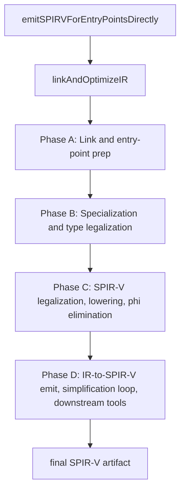

# SPIR-V Target Pipeline

This page documents the ordered IR-pass and downstream-binary sequence
executed when Slang compiles for the SPIR-V target via the
direct-emit path. The corresponding `CodeGenTarget` values are
`CodeGenTarget::SPIRV` and `CodeGenTarget::SPIRVAssembly`, and the
precondition is `targetProgram->shouldEmitSPIRVDirectly() == true`.
The legacy via-GLSL path (`isKhronosTarget && !emitSpirvDirectly`)
is not the subject of this page: it diverges at line ~2286 of
[slang-emit.cpp](../../../../source/slang/slang-emit.cpp) where
`legalizeModesOfNonCopyableOpaqueTypedParamsForGLSL` runs only in
that mode, and the rest of the via-GLSL flow belongs to the
forthcoming GLSL target-pipeline page.

This page complements
[../pipeline/05-ir-passes.md](../pipeline/05-ir-passes.md), which is
an unordered topical catalog of every IR pass. The catalog answers
"what does pass `X` do?"; this page answers "when does pass `X` run
for SPIR-V, what gates it, and what loops iterate it?". Branches in
`linkAndOptimizeIR` gated on a sibling target (HLSL, GLSL, Metal,
WGSL, CUDA, CPU, PyTorch) are filtered out of the diagrams and
tables below; that filter is documented per-phase.

## Source

- [slang-emit.cpp](../../../../source/slang/slang-emit.cpp)
  — `linkAndOptimizeIR` (line ~895) is the orchestrator;
  `emitSPIRVForEntryPointsDirectly` (line ~3198) is the SPIR-V
  entry point; `createArtifactFromIR` (line ~3033) wraps the
  post-emit downstream chain (spirv-link, spirv-val,
  `optimizeSPIRV` currently disabled by `#if 0`).
- [slang-emit-spirv.cpp](../../../../source/slang/slang-emit-spirv.cpp)
  — `emitSPIRVFromIR` (line ~11387) calls `legalizeIRForSPIRV`,
  iterates the forward-declared-pointer fixup loop, and emits the
  SPIR-V words.
- [slang-ir-spirv-legalize.cpp](../../../../source/slang/slang-ir-spirv-legalize.cpp)
  — `legalizeIRForSPIRV` (line 3104) is the top-level legalizer;
  `legalizeSPIRV` (line 2865) drives `SPIRVLegalizationContext::processModule`;
  `simplifyIRForSpirvLegalization` (line 2878) is the iterative
  simplification loop (outer bound 8, inner bound 16);
  `removeUnreachableCodeAfterDiscardForOpKill` and
  `insertFragmentShaderInterlock` are SPIR-V-specific finalization
  steps.
- [slang-ir-glsl-legalize.cpp](../../../../source/slang/slang-ir-glsl-legalize.cpp)
  — `legalizeEntryPointsForGLSL` is called for SPIR-V too despite
  its name (it predates the SPIR-V direct-emit path).
- [slang-ir-legalize-binary-operator.cpp](../../../../source/slang/slang-ir-legalize-binary-operator.cpp)
  — used by `legalizeLogicalAndOr` for Khronos targets.
- [slang-ir-spirv-snippet.cpp](../../../../source/slang/slang-ir-spirv-snippet.cpp)
  — referenced by `legalizeSPIRV` for inline-asm snippet handling.
- [slang-target-program.h](../../../../source/slang/slang-target-program.h)
  — declares `TargetProgram::shouldEmitSPIRVDirectly` and the
  `OptionSet` accessors that gate many of the conditional passes
  below.

## High-level phase diagram



All four `Phase *` nodes are bodies of `linkAndOptimizeIR` except
for Phase D, which starts inside `linkAndOptimizeIR`
(`collectMetadata` / `checkUnsupportedInst`) and continues through
`createArtifactFromIR` and the SPIR-V backend.

## Phase A: Link and entry-point prep

Spans roughly lines 931-1208 of
[slang-emit.cpp](../../../../source/slang/slang-emit.cpp). The phase
takes the just-linked IR module, runs structural validators, and
prepares the entry-point shape: global varying variables, coverage
instrumentation, layout, uniform-parameter collection, and the
post-packing coverage-metadata finalize. SPIR-V is reached via the
`default` arm of every per-target switch in this phase.

```mermaid
flowchart TD
  linkIRn[linkIR]
  dbgGate{shouldEmitSeparateDebugInfo?}
  emitBuildId["emit IRBuildIdentifier"]
  vaaa[validateAndRemoveAssumeAddress]
  reqSet1["calcRequiredLoweringPassSet (build gate set)"]
  diGate{"reqSet.debugInfo and DebugInfoLevel::None"}
  stripDI[stripDebugInfo]
  tEPInBorrow[translateEntryPointInParamToBorrow]
  gvvGate{reqSet.globalVaryingVar}
  tGVV[translateGlobalVaryingVar]
  rvirGate{reqSet.resolveVaryingInputRef}
  rvir[resolveVaryingInputRef]
  fEPC[fixEntryPointCallsites]
  rGC[replaceGlobalConstants]
  beGate{reqSet.bindExistential}
  bES[bindExistentialSlots]
  covGate{reqSet.coverageTracing}
  iC[instrumentCoverage]
  cGUP[collectGlobalUniformParameters]
  cEPD[checkEntryPointDecorations]
  aDMD[addDenormalModeDecorations]
  cEPUP[collectEntryPointUniformParams]
  mEPUP[moveEntryPointUniformParamsToGlobalScope]
  rTCEP[removeTorchAndCUDAEntryPoints]
  covGate2{reqSet.coverageTracing}
  fCIM[finalizeCoverageInstrumentationMetadata]
  lLVC[lowerLValueCast]
  enumGate{reqSet.enumType}
  lET[lowerEnumType]

  linkIRn --> dbgGate
  dbgGate -->|true| emitBuildId --> vaaa
  dbgGate -->|false| vaaa
  vaaa --> reqSet1 --> diGate
  diGate -->|true| stripDI --> tEPInBorrow
  diGate -->|false| tEPInBorrow
  tEPInBorrow --> gvvGate
  gvvGate -->|true| tGVV --> rvirGate
  gvvGate -->|false| rvirGate
  rvirGate -->|true| rvir --> fEPC
  rvirGate -->|false| fEPC
  fEPC --> rGC --> beGate
  beGate -->|true| bES --> covGate
  beGate -->|false| covGate
  covGate -->|true| iC --> cGUP
  covGate -->|false| cGUP
  cGUP --> cEPD --> aDMD --> cEPUP --> mEPUP --> rTCEP --> covGate2
  covGate2 -->|true| fCIM --> lLVC
  covGate2 -->|false| lLVC
  lLVC --> enumGate
  enumGate -->|true| lET
```



Validation calls `validateIRModuleIfEnabled` run after most
`SLANG_PASS` calls but are omitted from the diagram for legibility.

| # | Pass | File | Gate | Notes |
| --- | --- | --- | --- | --- |
| 1 | `linkIR` | [slang-ir-link.cpp](../../../../source/slang/slang-ir-link.cpp) | (always) | Direct call (not `SLANG_PASS`); pulls in IR for imported modules. |
| 2 | `validateAndRemoveAssumeAddress` | [slang-ir-validate.cpp](../../../../source/slang/slang-ir-validate.cpp) | (always for SPIR-V) | `validate=true` (since `!isCPUTarget && !isCUDATarget`). |
| 3 | `stripDebugInfo` | [slang-ir-strip-debug-info.cpp](../../../../source/slang/slang-ir-strip-debug-info.cpp) | `reqSet.debugInfo && getDebugInfoLevel() == DebugInfoLevel::None` | Drops debug instructions when `-g0`. |
| 4 | `translateEntryPointInParamToBorrow` | [slang-ir-transform-params-to-constref.cpp](../../../../source/slang/slang-ir-transform-params-to-constref.cpp) | (always) | |
| 5 | `translateGlobalVaryingVar` | [slang-ir-translate-global-varying-var.cpp](../../../../source/slang/slang-ir-translate-global-varying-var.cpp) | `reqSet.globalVaryingVar` | |
| 6 | `resolveVaryingInputRef` | [slang-ir-resolve-varying-input-ref.cpp](../../../../source/slang/slang-ir-resolve-varying-input-ref.cpp) | `reqSet.resolveVaryingInputRef` | |
| 7 | `fixEntryPointCallsites` | [slang-ir-fix-entrypoint-callsite.cpp](../../../../source/slang/slang-ir-fix-entrypoint-callsite.cpp) | (always) | |
| 8 | `replaceGlobalConstants` | [slang-ir-link.cpp](../../../../source/slang/slang-ir-link.cpp) | (always) | |
| 9 | `bindExistentialSlots` | [slang-ir-bind-existentials.cpp](../../../../source/slang/slang-ir-bind-existentials.cpp) | `reqSet.bindExistential` | |
| 10 | `instrumentCoverage` | [slang-ir-coverage-instrument.cpp](../../../../source/slang/slang-ir-coverage-instrument.cpp) | `reqSet.coverageTracing` | Writes coverage metadata via the `ArtifactPostEmitMetadata` pointer created in line ~944. |
| 11 | `collectGlobalUniformParameters` | [slang-ir-collect-global-uniforms.cpp](../../../../source/slang/slang-ir-collect-global-uniforms.cpp) | (always) | |
| 12 | `checkEntryPointDecorations` | [slang-ir-entry-point-decorations.cpp](../../../../source/slang/slang-ir-entry-point-decorations.cpp) | (always) | |
| 13 | `addDenormalModeDecorations` | [slang-emit.cpp](../../../../source/slang/slang-emit.cpp) | (always) | Static helper inside `slang-emit.cpp` (line ~681). |
| 14 | `collectEntryPointUniformParams` | [slang-ir-entry-point-uniforms.cpp](../../../../source/slang/slang-ir-entry-point-uniforms.cpp) | (always, SPIR-V via `default` arm) | |
| 15 | `moveEntryPointUniformParamsToGlobalScope` | [slang-ir-entry-point-uniforms.cpp](../../../../source/slang/slang-ir-entry-point-uniforms.cpp) | (always, SPIR-V via `default` arm) | |
| 16 | `removeTorchAndCUDAEntryPoints` | [slang-ir-pytorch-cpp-binding.cpp](../../../../source/slang/slang-ir-pytorch-cpp-binding.cpp) | (always, SPIR-V via `default` arm) | |
| 17 | `finalizeCoverageInstrumentationMetadata` | [slang-ir-coverage-instrument.cpp](../../../../source/slang/slang-ir-coverage-instrument.cpp) | `reqSet.coverageTracing` | Runs after entry-point uniform packing so the post-packing `globalScopeVarLayout` can fill in the CPU/CUDA uniform-marshaling fields on the coverage `ArtifactPostEmitMetadata` produced by step 10. Effectively a no-op on SPIR-V (no CPU/CUDA marshaling), but the call site is shared. |
| 18 | `lowerLValueCast` | [slang-ir-lower-l-value-cast.cpp](../../../../source/slang/slang-ir-lower-l-value-cast.cpp) | (always) | |
| 19 | `lowerEnumType` | [slang-ir-lower-enum-type.cpp](../../../../source/slang/slang-ir-lower-enum-type.cpp) | `reqSet.enumType` | Runs early so enum casts don't block specialization. |

Filtered out for SPIR-V in this phase: the
`!isKhronosTarget && reqSet.glslSSBO` branch (line 983,
`lowerGLSLShaderStorageBufferObjectsToStructuredBuffers`); the
`CUDASource` / `CUDAHeader` arm of the entry-point-param switch
(`collectOptiXEntryPointUniformParams`).

## Phase B: Specialization and type legalization

Spans roughly lines 1210-1752 of
[slang-emit.cpp](../../../../source/slang/slang-emit.cpp). The phase
runs the main simplification pass, drives generic / existential
specialization, finalizes autodiff, lowers high-level types
(`Result`, `Optional`, `Conditional`, tagged unions, existentials,
tuples), and then performs resource and matrix legalization plus
several rounds of resource-usage specialization. Phase B ends just
before byte-address-buffer legalization.

```mermaid
flowchart TD
  s1[simplifyIR default]
  vuGate{getBoolOption ValidateUniformity}
  vu[validateUniformity]
  sML[specializeMatrixLayout]
  fscGate{not shouldPerformMinimumOptimizations}
  fSC[fuseCallsToSaturatedCooperation]
  adGate{reqSet.autodiff}
  cAP[checkAutodiffPatterns]
  dCC[diagnoseCircularConformances]
  sdGate{not isSpecializationDisabled}
  sM[specializeModule]
  hofGate{reqSet.higherOrderFunc}
  sHOP[specializeHigherOrderParameters]
  fADP[finalizeAutoDiffPass]
  mssGate{reqSet.matrixSwizzleStore}
  lMSS[lowerMatrixSwizzleStores]
  dce1[eliminateDeadCode]
  fS[finalizeSpecialization]
  lDTI["lowerDiffTypeInfoInsts (direct call)"]
  rtGate{reqSet.resultType}
  lRT[lowerResultType]
  ctGate{reqSet.conditionalType}
  lCT[lowerConditionalType]
  otGate1{reqSet.optionalType}
  lRO[lowerReinterpretOptional]
  nevGate{shouldRunNonEssentialValidation}
  cONU[checkForOptionalNoneUsage]
  otGate2{reqSet.optionalType}
  lOT[lowerOptionalType]
  reqSet2["calcRequiredLoweringPassSet (rebuild gates)"]
  dUR[detectUninitializedResources]
  raidGate{removeAvailableInDownstreamIR}
  rAIDD[removeAvailableInDownstreamModuleDecorations]
  nevGate2{shouldRunNonEssentialValidation}
  cRT[checkForRecursiveTypes]
  cRF[checkForRecursiveFunctions]
  cOBA[checkForOutOfBoundAccess]
  mrGate{reqSet.missingReturn}
  cMR[checkForMissingReturns]
  cISPT[checkForInvalidShaderParameterType]
  iAVS[inferAnyValueSizeWhereNecessary]
  uPWT[unpinWitnessTables]
  lSVMI[lowerSumVectorMatrixInsts]
  minOptGate{not minimalOptimization}
  s2a[simplifyIR fast]
  genGate{reqSet.generics}
  dce2[eliminateDeadCode]
  lTUT[lowerTaggedUnionTypes]
  lUUT[lowerUntaggedUnionTypes]
  reinterpretGate{reqSet.reinterpret}
  lR[lowerReinterpret]
  lSIDC[lowerSequentialIDTagCasts]
  lTI[lowerTagInsts]
  lTT[lowerTagTypes]
  dce3[eliminateDeadCode]
  lE[lowerExistentials]
  rWUI[removeWeakUseInsts]
  cTD["clearTranslationDictionary (direct call)"]
  pTIN[performTypeInlining]
  nevGate3{shouldRunNonEssentialValidation}
  cGSHI[checkGetStringHashInsts]
  dce4["eliminateDeadCode (direct call)"]
  lTu[lowerTuples]
  gAVMF[generateAnyValueMarshallingFunctions]
  ssGate{reqSet.specializeStageSwitch}
  sSS[specializeStageSwitch]
  pFI1[performForceInlining]
  minOpt2{minimalOptimization}
  aSCCP[applySparseConditionalConstantPropagation]
  dce5[eliminateDeadCode]
  s2b[simplifyIR default]
  cpiGate{shouldReportCheckpointIntermediates}
  rCI["reportCheckpointIntermediates (direct call)"]
  lACSB[lowerAppendConsumeStructuredBuffers]
  vrGate{getBoolOption VulkanEmitReflection}
  aUTHD[addUserTypeHintDecorations]
  lEA[legalizeEmptyArray]
  lVT[legalizeVectorTypes]
  iGC[inlineGlobalConstantsForLegalization]
  lERPF[legalizeEmptyRayPayloadsForHLSL]
  etlGate{reqSet.existentialTypeLayout}
  lETL[legalizeExistentialTypeLayout]
  vSBRT["validateStructuredBufferResourceTypes (returns SLANG_FAIL on error)"]
  lRTR[legalizeResourceTypes]
  lMT[legalizeMatrixTypes]
  minOpt3{minimalOptimization}
  dce6[eliminateDeadCode]
  s2c[simplifyIR fast]
  drhGate{reqSet.dynamicResourceHeap}
  lDRH[lowerDynamicResourceHeap]
  sRU[specializeResourceUsage]
  sFBLA1[specializeFuncsForBufferLoadArgs]
  dBL[deferBufferLoad]
  sAP[specializeArrayParameters]
  cSA["checkStaticAssert (direct call)"]

  s1 --> vuGate
  vuGate -->|true| vu --> sML
  vuGate -->|false| sML
  sML --> fscGate
  fscGate -->|true| fSC --> adGate
  fscGate -->|false| adGate
  adGate -->|true| cAP --> dCC
  adGate -->|false| dCC
  dCC --> sdGate
  sdGate -->|true| sM --> hofGate
  sdGate -->|false| hofGate
  hofGate -->|true| sHOP --> fADP
  hofGate -->|false| fADP
  fADP --> mssGate
  mssGate -->|true| lMSS --> dce1
  mssGate -->|false| dce1
  dce1 --> fS --> lDTI --> ctGate
  ctGate -->|true| lCT --> otGate1
  ctGate -->|false| otGate1
  otGate1 -->|true| lRO --> nevGate
  otGate1 -->|false| nevGate
  nevGate -->|true| cONU --> otGate2
  nevGate -->|false| otGate2
  otGate2 -->|true| lOT --> rtGate
  otGate2 -->|false| rtGate
  rtGate -->|true| lRT --> reqSet2
  rtGate -->|false| reqSet2
  reqSet2 --> dUR --> raidGate
  raidGate -->|true| rAIDD --> nevGate2
  raidGate -->|false| nevGate2
  nevGate2 -->|true| cRT --> cRF --> cOBA --> mrGate
  nevGate2 -->|false| iAVS
  mrGate -->|true| cMR --> cISPT
  mrGate -->|false| cISPT
  cISPT --> iAVS
  iAVS --> uPWT --> lSVMI --> minOptGate
  minOptGate -->|true| s2a --> lTUT
  minOptGate -->|false| genGate
  genGate -->|true| dce2 --> lTUT
  genGate -->|false| lTUT
  lTUT --> lUUT --> reinterpretGate
  reinterpretGate -->|true| lR --> lSIDC
  reinterpretGate -->|false| lSIDC
  lSIDC --> lTI --> lTT --> dce3 --> lE --> rWUI --> cTD --> pTIN --> nevGate3
  nevGate3 -->|true| cGSHI --> dce4
  nevGate3 -->|false| dce4
  dce4 --> lTu --> gAVMF --> ssGate
  ssGate -->|true| sSS --> pFI1
  ssGate -->|false| pFI1
  pFI1 --> minOpt2
  minOpt2 -->|true| aSCCP --> dce5 --> cpiGate
  minOpt2 -->|false| s2b --> cpiGate
  cpiGate -->|true| rCI --> lACSB
  cpiGate -->|false| lACSB
  lACSB --> vrGate
  vrGate -->|true| aUTHD --> lEA
  vrGate -->|false| lEA
  lEA --> lVT --> iGC --> lERPF --> etlGate
  etlGate -->|true| lETL --> vSBRT
  etlGate -->|false| vSBRT
  vSBRT --> lRTR --> lMT --> minOpt3
  minOpt3 -->|true| dce6 --> drhGate
  minOpt3 -->|false| s2c --> drhGate
  drhGate -->|true| lDRH --> sRU
  drhGate -->|false| sRU
  sRU --> sFBLA1 --> dBL --> sAP --> cSA
```



| # | Pass | File | Gate | Notes |
| --- | --- | --- | --- | --- |
| 1 | `simplifyIR` | [slang-ir-ssa-simplification.cpp](../../../../source/slang/slang-ir-ssa-simplification.cpp) | (always) | `defaultIRSimplificationOptions`. |
| 2 | `validateUniformity` | [slang-ir-uniformity.cpp](../../../../source/slang/slang-ir-uniformity.cpp) | `getBoolOption(ValidateUniformity)` | Aborts the pipeline on error. |
| 3 | `specializeMatrixLayout` | [slang-ir-specialize-matrix-layout.cpp](../../../../source/slang/slang-ir-specialize-matrix-layout.cpp) | (always) | |
| 4 | `fuseCallsToSaturatedCooperation` | [slang-ir-fuse-satcoop.cpp](../../../../source/slang/slang-ir-fuse-satcoop.cpp) | `!shouldPerformMinimumOptimizations` | Must run before defunctionalization. |
| 5 | `checkAutodiffPatterns` | [slang-ir-check-differentiability.cpp](../../../../source/slang/slang-ir-check-differentiability.cpp) | `reqSet.autodiff` | |
| 6 | `diagnoseCircularConformances` | [slang-ir-any-value-inference.cpp](../../../../source/slang/slang-ir-any-value-inference.cpp) | (always) | Aborts before specialization on error. |
| 7 | `specializeModule` | [slang-ir-specialize.cpp](../../../../source/slang/slang-ir-specialize.cpp) | `!isSpecializationDisabled()` | With `specOptions.lowerWitnessLookups = true`. |
| 8 | `specializeHigherOrderParameters` | [slang-ir-defunctionalization.cpp](../../../../source/slang/slang-ir-defunctionalization.cpp) | `reqSet.higherOrderFunc` | |
| 9 | `finalizeAutoDiffPass` | [slang-ir-autodiff.cpp](../../../../source/slang/slang-ir-autodiff.cpp) | (always) | |
| 10 | `lowerMatrixSwizzleStores` | [slang-ir-lower-matrix-swizzle-store.cpp](../../../../source/slang/slang-ir-lower-matrix-swizzle-store.cpp) | `reqSet.matrixSwizzleStore` | |
| 11 | `eliminateDeadCode` | [slang-ir-dce.cpp](../../../../source/slang/slang-ir-dce.cpp) | (always) | |
| 12 | `finalizeSpecialization` | [slang-ir-specialize.cpp](../../../../source/slang/slang-ir-specialize.cpp) | (always) | |
| 13 | `lowerDiffTypeInfoInsts` | [slang-ir-autodiff.cpp](../../../../source/slang/slang-ir-autodiff.cpp) | (always) | Direct call (`DiffTypeInfo` is hoistable, must run after specialization). |
| 14 | `lowerConditionalType` | [slang-ir-lower-conditional-type.cpp](../../../../source/slang/slang-ir-lower-conditional-type.cpp) | `reqSet.conditionalType` | |
| 15 | `lowerReinterpretOptional` | [slang-ir-lower-reinterpret.cpp](../../../../source/slang/slang-ir-lower-reinterpret.cpp) | `reqSet.optionalType` | |
| 16 | `checkForOptionalNoneUsage` | [slang-ir-check-optional-none-usage.cpp](../../../../source/slang/slang-ir-check-optional-none-usage.cpp) | `shouldRunNonEssentialValidation()` | Must run after `simplifyIR` but before `lowerOptionalType`. |
| 17 | `lowerOptionalType` | [slang-ir-lower-optional-type.cpp](../../../../source/slang/slang-ir-lower-optional-type.cpp) | `reqSet.optionalType` | |
| 18 | `lowerResultType` | [slang-ir-lower-result-type.cpp](../../../../source/slang/slang-ir-lower-result-type.cpp) | `reqSet.resultType` | Now runs **after** `lowerOptionalType`: `lowerResultType` depends on accurate `getAnyValueSize()` results, which requires Optional types to be lowered first (so that a throwing function returning `Optional<T>` keeps the result-struct shape stable). |
| 19 | `detectUninitializedResources` | [slang-ir-detect-uninitialized-resources.cpp](../../../../source/slang/slang-ir-detect-uninitialized-resources.cpp) | (always) | After `calcRequiredLoweringPassSet` rebuilds gates. |
| 20 | `removeAvailableInDownstreamModuleDecorations` | [slang-ir-strip.cpp](../../../../source/slang/slang-ir-strip.cpp) | `codeGenContext->removeAvailableInDownstreamIR` | |
| 21 | `checkForRecursiveTypes` | [slang-ir-check-recursion.cpp](../../../../source/slang/slang-ir-check-recursion.cpp) | `shouldRunNonEssentialValidation()` | |
| 22 | `checkForRecursiveFunctions` | [slang-ir-check-recursion.cpp](../../../../source/slang/slang-ir-check-recursion.cpp) | `shouldRunNonEssentialValidation()` | |
| 23 | `checkForOutOfBoundAccess` | [slang-check-out-of-bound-access.cpp](../../../../source/slang/slang-check-out-of-bound-access.cpp) | `shouldRunNonEssentialValidation()` | |
| 24 | `checkForMissingReturns` | [slang-ir-missing-return.cpp](../../../../source/slang/slang-ir-missing-return.cpp) | `reqSet.missingReturn` (under non-essential validation) | |
| 25 | `checkForInvalidShaderParameterType` | [slang-ir-check-shader-parameter-type.cpp](../../../../source/slang/slang-ir-check-shader-parameter-type.cpp) | `shouldRunNonEssentialValidation()` | |
| 26 | `inferAnyValueSizeWhereNecessary` | [slang-ir-any-value-inference.cpp](../../../../source/slang/slang-ir-any-value-inference.cpp) | (always) | |
| 27 | `unpinWitnessTables` | [slang-ir-strip-legalization-insts.cpp](../../../../source/slang/slang-ir-strip-legalization-insts.cpp) | (always) | |
| 28 | `lowerSumVectorMatrixInsts` | [slang-emit.cpp](../../../../source/slang/slang-emit.cpp) | (always) | Static helper at line ~804. |
| 29 | `simplifyIR` | [slang-ir-ssa-simplification.cpp](../../../../source/slang/slang-ir-ssa-simplification.cpp) | `!fastIRSimplificationOptions.minimalOptimization` | `fastIRSimplificationOptions`. |
| 30 | `eliminateDeadCode` | [slang-ir-dce.cpp](../../../../source/slang/slang-ir-dce.cpp) | `minimalOptimization && reqSet.generics` | Alternative to pass 29 in minimal-opt mode. |
| 31 | `lowerTaggedUnionTypes` | [slang-ir-lower-dynamic-dispatch-insts.cpp](../../../../source/slang/slang-ir-lower-dynamic-dispatch-insts.cpp) | (always) | Sets `reqSet.reinterpret = true` if it returns `true`. |
| 32 | `lowerUntaggedUnionTypes` | [slang-ir-lower-dynamic-dispatch-insts.cpp](../../../../source/slang/slang-ir-lower-dynamic-dispatch-insts.cpp) | (always) | |
| 33 | `lowerReinterpret` | [slang-ir-lower-reinterpret.cpp](../../../../source/slang/slang-ir-lower-reinterpret.cpp) | `reqSet.reinterpret` | |
| 34 | `lowerSequentialIDTagCasts` | [slang-ir-lower-dynamic-dispatch-insts.cpp](../../../../source/slang/slang-ir-lower-dynamic-dispatch-insts.cpp) | (always) | |
| 35 | `lowerTagInsts` | [slang-ir-lower-dynamic-dispatch-insts.cpp](../../../../source/slang/slang-ir-lower-dynamic-dispatch-insts.cpp) | (always) | |
| 36 | `lowerTagTypes` | [slang-ir-lower-dynamic-dispatch-insts.cpp](../../../../source/slang/slang-ir-lower-dynamic-dispatch-insts.cpp) | (always) | |
| 37 | `eliminateDeadCode` | [slang-ir-dce.cpp](../../../../source/slang/slang-ir-dce.cpp) | (always) | |
| 38 | `lowerExistentials` | [slang-ir-lower-dynamic-dispatch-insts.cpp](../../../../source/slang/slang-ir-lower-dynamic-dispatch-insts.cpp) | (always) | |
| 39 | `removeWeakUseInsts` | [slang-ir-strip.cpp](../../../../source/slang/slang-ir-strip.cpp) | (always) | |
| 40 | `performTypeInlining` | [slang-ir-inline.cpp](../../../../source/slang/slang-ir-inline.cpp) | `!isCpuLikeTarget(artifactDesc)` (true for SPIR-V) | Returns `SLANG_FAIL` if inlining fails. |
| 41 | `checkGetStringHashInsts` | [slang-ir-string-hash.cpp](../../../../source/slang/slang-ir-string-hash.cpp) | `!isCpuLikeTarget && shouldRunNonEssentialValidation()` | |
| 42 | `lowerTuples` | [slang-ir-lower-tuple-types.cpp](../../../../source/slang/slang-ir-lower-tuple-types.cpp) | (always) | |
| 43 | `generateAnyValueMarshallingFunctions` | [slang-ir-any-value-marshalling.cpp](../../../../source/slang/slang-ir-any-value-marshalling.cpp) | (always) | |
| 44 | `specializeStageSwitch` | [slang-ir-specialize-stage-switch.cpp](../../../../source/slang/slang-ir-specialize-stage-switch.cpp) | `reqSet.specializeStageSwitch` | |
| 45 | `performForceInlining` | [slang-ir-inline.cpp](../../../../source/slang/slang-ir-inline.cpp) | (always) | Inlines `[__unsafeInlineEarly]` / `[ForceInline]`. |
| 46 | `applySparseConditionalConstantPropagation` | [slang-ir-sccp.cpp](../../../../source/slang/slang-ir-sccp.cpp) | `minimalOptimization` | Plus `eliminateDeadCode`. |
| 47 | `eliminateDeadCode` | [slang-ir-dce.cpp](../../../../source/slang/slang-ir-dce.cpp) | `minimalOptimization` | |
| 48 | `simplifyIR` | [slang-ir-ssa-simplification.cpp](../../../../source/slang/slang-ir-ssa-simplification.cpp) | `!minimalOptimization` | `defaultIRSimplificationOptions`. |
| 49 | `lowerAppendConsumeStructuredBuffers` | [slang-ir-lower-append-consume-structured-buffer.cpp](../../../../source/slang/slang-ir-lower-append-consume-structured-buffer.cpp) | `target != HLSL` (true for SPIR-V) | |
| 50 | `addUserTypeHintDecorations` | [slang-ir-user-type-hint.cpp](../../../../source/slang/slang-ir-user-type-hint.cpp) | `getBoolOption(VulkanEmitReflection)` | |
| 51 | `legalizeEmptyArray` | [slang-ir-legalize-empty-array.cpp](../../../../source/slang/slang-ir-legalize-empty-array.cpp) | (always) | |
| 52 | `legalizeVectorTypes` | [slang-ir-legalize-vector-types.cpp](../../../../source/slang/slang-ir-legalize-vector-types.cpp) | (always) | Splits oversized / non-power-of-two vectors. |
| 53 | `inlineGlobalConstantsForLegalization` | [slang-ir-legalize-global-values.cpp](../../../../source/slang/slang-ir-legalize-global-values.cpp) | `shouldLegalizeExistentialAndResourceTypes` (default `true` for SPIR-V) | |
| 54 | `legalizeEmptyRayPayloadsForHLSL` | [slang-ir-hlsl-legalize.cpp](../../../../source/slang/slang-ir-hlsl-legalize.cpp) | `isSPIRV(target)` (despite the name) | Adds dummy fields to empty ray payloads. |
| 55 | `legalizeExistentialTypeLayout` | [slang-ir-legalize-types.cpp](../../../../source/slang/slang-ir-legalize-types.cpp) | `reqSet.existentialTypeLayout` | |
| 56 | `validateStructuredBufferResourceTypes` | [slang-ir-validate.cpp](../../../../source/slang/slang-ir-validate.cpp) | (always) | Direct call; returns `SLANG_FAIL` if invalid. |
| 57 | `legalizeResourceTypes` | [slang-ir-legalize-types.cpp](../../../../source/slang/slang-ir-legalize-types.cpp) | `shouldLegalizeExistentialAndResourceTypes` | Splits structs containing resource fields. |
| 58 | `legalizeMatrixTypes` | [slang-ir-legalize-matrix-types.cpp](../../../../source/slang/slang-ir-legalize-matrix-types.cpp) | (always) | |
| 59 | `eliminateDeadCode` | [slang-ir-dce.cpp](../../../../source/slang/slang-ir-dce.cpp) | `minimalOptimization` | |
| 60 | `simplifyIR` | [slang-ir-ssa-simplification.cpp](../../../../source/slang/slang-ir-ssa-simplification.cpp) | `!minimalOptimization` | `fastIRSimplificationOptions`. |
| 61 | `lowerDynamicResourceHeap` | [slang-ir-lower-dynamic-resource-heap.cpp](../../../../source/slang/slang-ir-lower-dynamic-resource-heap.cpp) | `reqSet.dynamicResourceHeap` | |
| 62 | `specializeResourceUsage` | [slang-ir-specialize-resources.cpp](../../../../source/slang/slang-ir-specialize-resources.cpp) | (always) | |
| 63 | `specializeFuncsForBufferLoadArgs` | [slang-ir-specialize-buffer-load-arg.cpp](../../../../source/slang/slang-ir-specialize-buffer-load-arg.cpp) | (always, first invocation) | See Notable passes for the second SPIR-V-only invocation in Phase C. |
| 64 | `deferBufferLoad` | [slang-ir-defer-buffer-load.cpp](../../../../source/slang/slang-ir-defer-buffer-load.cpp) | (always) | |
| 65 | `specializeArrayParameters` | [slang-ir-specialize-arrays.cpp](../../../../source/slang/slang-ir-specialize-arrays.cpp) | (always) | |

Filtered out for SPIR-V in this phase: the
`CUDASource / CUDAHeader / PyTorchCppBinding` arm of the derivative-
wrapper switch; the `case CodeGenTarget::HLSL` arm of
`legalizeNonVectorCompositeSelect`; the `CPPSource` /
`CPPHeader` / `HostCPPSource` COM / DLL emit arms;
`generateHostFunctionsForAutoBindCuda`, `removeTorchKernels`,
`generatePyTorchCppBinding`, `handleAutoBindNames`,
`lowerBuiltinTypesForKernelEntryPoints`; the early-return at
`target == HostVM`; `lowerCooperativeVectors`; the
CPU/Metal/CUDA/PyTorch `undoParameterCopy` /
`transformParamsToConstRef` arms;
`legalizeNonStructParameterToStructForHLSL`;
`generateDerivativeWrappers`. The
`legalizeEmptyTypes` for Metal is skipped (SPIR-V hits the
`shouldLegalizeExistentialAndResourceTypes`-true branch but not the
Metal switch arm).

## Phase C: SPIR-V legalization, lowering, phi elimination

Spans roughly lines 1897-2483 of
[slang-emit.cpp](../../../../source/slang/slang-emit.cpp). The phase
runs the byte-address-buffer legalization (with SPIR-V-specific
options), the entry-point parameter rewriting shared with GLSL,
SPIR-V-only fix-ups (global-var initialization motion,
`transformParamsToConstRef`, `removeRawDefaultConstructors`), and
finally `eliminatePhis` with SPIR-V-specific configuration. The
phase ends with `simplifyNonSSAIR`, `collectMetadata`, and
`checkUnsupportedInst`.

```mermaid
flowchart TD
  babbGate{reqSet.byteAddressBuffer}
  lBABOps[legalizeByteAddressBufferOps]
  rTF[resolveTextureFormat]
  lEPG[legalizeEntryPointsForGLSL]
  lLAO[legalizeLogicalAndOr]
  drGate{"reqSet.dynamicResource (Khronos)"}
  lDRG[legalizeDynamicResourcesForGLSL]
  lIS[legalizeImageSubscript]
  lCBL[legalizeConstantBufferLoadForGLSL]
  lDMP[legalizeDispatchMeshPayloadForGLSL]
  mGVI[moveGlobalVarInitializationToEntryPoints]
  expGate{getBoolOption EnableExperimentalPasses}
  iEGC[introduceExplicitGlobalContext]
  tPCR[transformParamsToConstRef]
  sLOI[stripLegalizationOnlyInstructions]
  ssdGate{shouldEmitSPIRVDirectly}
  rRDC[removeRawDefaultConstructors]
  vVAM[validateVectorsAndMatrices]
  dce7[eliminateDeadCode]
  pLRC[processLateRequireCapabilityInsts]
  cUV[cleanUpVoidType]
  pGRRFI[performGLSLResourceReturnFunctionInlining]
  bqGate{reqSet.bindingQuery}
  lBQ[lowerBindingQueries]
  meshGate{reqSet.meshOutput}
  lMO[legalizeMeshOutputTypes]
  bcGate{reqSet.bitcast}
  lBC[lowerBitCast]
  lUBL[legalizeUniformBufferLoad]
  invYGate{getBoolOption VulkanInvertY}
  iYOP[invertYOfPositionOutput]
  posWGate{getBoolOption VulkanUseDxPositionW}
  rcpW[rcpWOfPositionInput]
  lBETST[lowerBufferElementTypeToStorageType]
  sFBLA2[specializeFuncsForBufferLoadArgs]
  pFI2[performForceInlining]
  pIFI[performIntrinsicFunctionInlining]
  eMB[eliminateMultiLevelBreak]
  minOpt4{not minimalOptimization}
  s2d[simplifyIR with removeTrivialSingleIterationLoops]
  lET2[legalizeEmptyTypes]
  livGate{shouldTrackLiveness}
  lvAvrs["LivenessUtil::addVariableRangeStarts"]
  ePhi[eliminatePhis]
  livGate2{shouldTrackLiveness}
  lvAre["LivenessUtil::addRangeEnds"]
  liveKhrGate{shouldTrackLiveness AND isKhronosTarget}
  aGL[applyGLSLLiveness]
  rLIRO[replaceLocationIntrinsicsWithRaytracingObject]
  sNSIR[simplifyNonSSAIR]
  coopGate{cooperative_matrix or cooperative_vector capability}
  cCM[collectCooperativeMetadata]
  ediGate{getBoolOption EmbedDownstreamIR}
  uNEI[unexportNonEmbeddableIR]
  cM[collectMetadata]
  minOpt5{not shouldPerformMinimumOptimizations}
  cUI[checkUnsupportedInst]

  babbGate -->|true| lBABOps --> rTF
  babbGate -->|false| rTF
  rTF --> lEPG --> lLAO --> drGate
  drGate -->|true| lDRG --> lIS
  drGate -->|false| lIS
  lIS --> lCBL --> lDMP --> mGVI --> expGate
  expGate -->|true| iEGC --> tPCR
  expGate -->|false| tPCR
  tPCR --> sLOI --> ssdGate
  ssdGate -->|true| rRDC --> vVAM
  ssdGate -->|false| vVAM
  vVAM --> dce7 --> pLRC --> cUV --> pGRRFI --> bqGate
  bqGate -->|true| lBQ --> meshGate
  bqGate -->|false| meshGate
  meshGate -->|true| lMO --> bcGate
  meshGate -->|false| bcGate
  bcGate -->|true| lBC --> lUBL
  bcGate -->|false| lUBL
  lUBL --> invYGate
  invYGate -->|true| iYOP --> posWGate
  invYGate -->|false| posWGate
  posWGate -->|true| rcpW --> lBETST
  posWGate -->|false| lBETST
  lBETST --> sFBLA2 --> pFI2 --> pIFI --> eMB --> minOpt4
  minOpt4 -->|true| s2d --> lET2
  minOpt4 -->|false| lET2
  lET2 --> livGate
  livGate -->|true| lvAvrs --> ePhi
  livGate -->|false| ePhi
  ePhi --> livGate2
  livGate2 -->|true| lvAre --> liveKhrGate
  livGate2 -->|false| liveKhrGate
  liveKhrGate -->|true| aGL --> rLIRO
  liveKhrGate -->|false| rLIRO
  rLIRO --> sNSIR --> coopGate
  coopGate -->|true| cCM --> ediGate
  coopGate -->|false| ediGate
  ediGate -->|true| uNEI --> cM
  ediGate -->|false| cM
  cM --> minOpt5
  minOpt5 -->|true| cUI
```



| # | Pass | File | Gate | Notes |
| --- | --- | --- | --- | --- |
| 1 | `legalizeByteAddressBufferOps` | [slang-ir-byte-address-legalize.cpp](../../../../source/slang/slang-ir-byte-address-legalize.cpp) | `reqSet.byteAddressBuffer` | For SPIR-V: `scalarizeVectorLoadStore=false`, `translateToStructuredBufferOps=true` (the `case CodeGenTarget::GLSL` / `SPIRV` / `SPIRVAssembly` arm). |
| 2 | `resolveTextureFormat` | [slang-ir-resolve-texture-format.cpp](../../../../source/slang/slang-ir-resolve-texture-format.cpp) | (always for SPIR-V; matches `GLSL` / `SPIRV` / `WGSL`) | |
| 3 | `legalizeEntryPointsForGLSL` | [slang-ir-glsl-legalize.cpp](../../../../source/slang/slang-ir-glsl-legalize.cpp) | (always for SPIR-V) | Shared with GLSL; the name predates SPIR-V direct emit. |
| 4 | `legalizeLogicalAndOr` | [slang-ir-legalize-binary-operator.cpp](../../../../source/slang/slang-ir-legalize-binary-operator.cpp) | `isD3DTarget || isKhronosTarget || isWGPUTarget || isMetalTarget` | True for SPIR-V. |
| 5 | `legalizeDynamicResourcesForGLSL` | [slang-ir-glsl-legalize.cpp](../../../../source/slang/slang-ir-glsl-legalize.cpp) | `reqSet.dynamicResource && isKhronosTarget` | |
| 6 | `legalizeImageSubscript` | [slang-ir-legalize-image-subscript.cpp](../../../../source/slang/slang-ir-legalize-image-subscript.cpp) | (Khronos / Metal / GLSL / SPIR-V arm) | |
| 7 | `legalizeConstantBufferLoadForGLSL` | [slang-ir-legalize-uniform-buffer-load.cpp](../../../../source/slang/slang-ir-legalize-uniform-buffer-load.cpp) | (`GLSL` / `SPIRV` / `SPIRVAssembly` arm) | |
| 8 | `legalizeDispatchMeshPayloadForGLSL` | [slang-ir-legalize-mesh-outputs.cpp](../../../../source/slang/slang-ir-legalize-mesh-outputs.cpp) | (`GLSL` / `SPIRV` / `SPIRVAssembly` arm) | |
| 9 | `moveGlobalVarInitializationToEntryPoints` | [slang-ir-explicit-global-init.cpp](../../../../source/slang/slang-ir-explicit-global-init.cpp) | (`SPIRV` / `SPIRVAssembly` arm) | |
| 10 | `introduceExplicitGlobalContext` | [slang-ir-explicit-global-context.cpp](../../../../source/slang/slang-ir-explicit-global-context.cpp) | `getBoolOption(EnableExperimentalPasses)` | Only fires under the experimental flag for SPIR-V. |
| 11 | `transformParamsToConstRef` | [slang-ir-transform-params-to-constref.cpp](../../../../source/slang/slang-ir-transform-params-to-constref.cpp) | (`SPIRV` / `SPIRVAssembly` arm) | |
| 12 | `stripLegalizationOnlyInstructions` | [slang-ir-strip-legalization-insts.cpp](../../../../source/slang/slang-ir-strip-legalization-insts.cpp) | (always) | |
| 13 | `removeRawDefaultConstructors` | [slang-ir-strip-default-construct.cpp](../../../../source/slang/slang-ir-strip-default-construct.cpp) | `shouldEmitSPIRVDirectly()` | |
| 14 | `validateVectorsAndMatrices` | [slang-ir-validate.cpp](../../../../source/slang/slang-ir-validate.cpp) | (always) | |
| 15 | `eliminateDeadCode` | [slang-ir-dce.cpp](../../../../source/slang/slang-ir-dce.cpp) | (always) | After specialization. |
| 16 | `processLateRequireCapabilityInsts` | [slang-ir-late-require-capability.cpp](../../../../source/slang/slang-ir-late-require-capability.cpp) | (always) | |
| 17 | `cleanUpVoidType` | [slang-ir-cleanup-void.cpp](../../../../source/slang/slang-ir-cleanup-void.cpp) | (always) | |
| 18 | `performGLSLResourceReturnFunctionInlining` | [slang-ir-glsl-legalize.cpp](../../../../source/slang/slang-ir-glsl-legalize.cpp) | `isKhronosTarget` | Fallback inliner for resource returns. |
| 19 | `lowerBindingQueries` | [slang-ir-lower-binding-query.cpp](../../../../source/slang/slang-ir-lower-binding-query.cpp) | `reqSet.bindingQuery` | |
| 20 | `legalizeMeshOutputTypes` | [slang-ir-legalize-mesh-outputs.cpp](../../../../source/slang/slang-ir-legalize-mesh-outputs.cpp) | `reqSet.meshOutput` | |
| 21 | `lowerBitCast` | [slang-ir-lower-bit-cast.cpp](../../../../source/slang/slang-ir-lower-bit-cast.cpp) | `reqSet.bitcast` | |
| 22 | `legalizeUniformBufferLoad` | [slang-ir-legalize-uniform-buffer-load.cpp](../../../../source/slang/slang-ir-legalize-uniform-buffer-load.cpp) | `isKhronosTarget || target == HLSL` | |
| 23 | `invertYOfPositionOutput` | [slang-ir-vk-invert-y.cpp](../../../../source/slang/slang-ir-vk-invert-y.cpp) | `getBoolOption(VulkanInvertY)` | |
| 24 | `rcpWOfPositionInput` | [slang-ir-vk-invert-y.cpp](../../../../source/slang/slang-ir-vk-invert-y.cpp) | `getBoolOption(VulkanUseDxPositionW)` | |
| 25 | `lowerBufferElementTypeToStorageType` | [slang-ir-lower-buffer-element-type.cpp](../../../../source/slang/slang-ir-lower-buffer-element-type.cpp) | (always) | `loweringPolicyKind = KhronosTarget`. |
| 26 | `specializeFuncsForBufferLoadArgs` | [slang-ir-specialize-buffer-load-arg.cpp](../../../../source/slang/slang-ir-specialize-buffer-load-arg.cpp) | `isKhronosTarget && emitSpirvDirectly` | Second invocation; see Notable passes. |
| 27 | `performForceInlining` | [slang-ir-inline.cpp](../../../../source/slang/slang-ir-inline.cpp) | (always) | |
| 28 | `performIntrinsicFunctionInlining` | [slang-ir-inline.cpp](../../../../source/slang/slang-ir-inline.cpp) | `emitSpirvDirectly` | |
| 29 | `eliminateMultiLevelBreak` | [slang-ir-eliminate-multilevel-break.cpp](../../../../source/slang/slang-ir-eliminate-multilevel-break.cpp) | (always) | |
| 30 | `simplifyIR` | [slang-ir-ssa-simplification.cpp](../../../../source/slang/slang-ir-ssa-simplification.cpp) | `!minimalOptimization` | With `removeTrivialSingleIterationLoops = true`. |
| 31 | `legalizeEmptyTypes` | [slang-ir-legalize-empty-array.cpp](../../../../source/slang/slang-ir-legalize-empty-array.cpp) | (always; required for AD 2.0) | |
| 32 | `LivenessUtil::addVariableRangeStarts` | [slang-ir-liveness.cpp](../../../../source/slang/slang-ir-liveness.cpp) | `shouldTrackLiveness()` | Liveness mode gating. |
| 33 | `eliminatePhis` | [slang-ir-eliminate-phis.cpp](../../../../source/slang/slang-ir-eliminate-phis.cpp) | (always) | SPIR-V-specific: `eliminateCompositeTypedPhiOnly = false`, `useRegisterAllocation = true`. |
| 34 | `LivenessUtil::addRangeEnds` | [slang-ir-liveness.cpp](../../../../source/slang/slang-ir-liveness.cpp) | `shouldTrackLiveness()` | |
| 35 | `applyGLSLLiveness` | [slang-ir-glsl-liveness.cpp](../../../../source/slang/slang-ir-glsl-liveness.cpp) | `shouldTrackLiveness() && isKhronosTarget(targetRequest)` ([slang-emit.cpp lines 2355-2360](../../../../source/slang/slang-emit.cpp)) | Khronos-targets-only pass that translates the `IRLiveRangeStart`/`IRLiveRangeEnd` markers from the previous two rows into the GLSL/SPIR-V liveness encoding. SPIR-V direct-emit and SPIR-V via-GLSL both reach this row because the gate is `isKhronosTarget`, not the direct-emit predicate. |
| 36 | `replaceLocationIntrinsicsWithRaytracingObject` | [slang-ir-early-raytracing-intrinsic-simplification.cpp](../../../../source/slang/slang-ir-early-raytracing-intrinsic-simplification.cpp) | `isKhronosTarget && emitSpirvDirectly` | |
| 37 | `simplifyNonSSAIR` | [slang-ir-ssa-simplification.cpp](../../../../source/slang/slang-ir-ssa-simplification.cpp) | (always) | After phi elimination. |
| 38 | `collectCooperativeMetadata` | [slang-ir-metadata.cpp](../../../../source/slang/slang-ir-metadata.cpp) | `targetCaps implies cooperative_matrix or cooperative_vector` | Captures cooperative types that survive lowering. |
| 39 | `unexportNonEmbeddableIR` | [slang-emit.cpp](../../../../source/slang/slang-emit.cpp) | `getBoolOption(EmbedDownstreamIR)` | Static helper at line ~633. |
| 40 | `collectMetadata` | [slang-ir-metadata.cpp](../../../../source/slang/slang-ir-metadata.cpp) | (always) | Final pass that fills binding / exported-function fields on `metadata`. |
| 41 | `checkUnsupportedInst` | [slang-ir-check-unsupported-inst.cpp](../../../../source/slang/slang-ir-check-unsupported-inst.cpp) | `!shouldPerformMinimumOptimizations()` | Last `SLANG_PASS` in `linkAndOptimizeIR`. |

Filtered out for SPIR-V in this phase: the CUDA `__ldg` immutable-
load lowering; `synthesizeActiveMask` (CUDA / PTX);
`legalizeIRForMetal`, `legalizeEntryPointVaryingParamsForCPU`,
`legalizeEntryPointVaryingParamsForCUDA`, `legalizeIRForWGSL`;
the `case CodeGenTarget::HLSL: wrapStructuredBuffersOfMatrices`
and `Metal: wrapCBufferElementsForMetal` arms;
`floatNonUniformResourceIndex` (only runs `!isSPIRV`);
`legalizeArrayReturnType` (skipped for SPIR-V);
`specializeAddressSpace` (GLSL), `specializeAddressSpaceForMetal`,
`specializeAddressSpaceForWGSL` (SPIR-V defers address-space
propagation to its legalization pass);
`legalizeModesOfNonCopyableOpaqueTypedParamsForGLSL` (only fires
on the via-GLSL path);
`applyVariableScopeCorrection` (SPIR-V is in the `!=` arm of the
`(target != SPIRV) && (target != SPIRVAssembly)` test);
`validateAtomicOperations` (called elsewhere for SPIR-V, namely
inside `legalizeIRForSPIRV`); the `CPPSource` /
`HostCPPSource` branches for `lowerComInterfaces` /
`generateDllImportFuncs` / `generateDllExportFuncs`.

## Phase D: IR-to-SPIR-V emit, simplification loop, downstream tools

Starts immediately after `linkAndOptimizeIR` returns to
`emitSPIRVForEntryPointsDirectly` (line ~3198 of
[slang-emit.cpp](../../../../source/slang/slang-emit.cpp)). The
SPIR-V backend in `emitSPIRVFromIR` (line ~11387 of
[slang-emit-spirv.cpp](../../../../source/slang/slang-emit-spirv.cpp))
calls the top-level `legalizeIRForSPIRV` (line 3104 of
[slang-ir-spirv-legalize.cpp](../../../../source/slang/slang-ir-spirv-legalize.cpp))
which runs the SPIR-V-specific IR passes and the iterative
`simplifyIRForSpirvLegalization` loop. After SPIR-V word emission
the artifact passes through the optional downstream chain in
`createArtifactFromIR` (line ~3033): `spirv-link` for embedded-
module merging and `spirv-val` for validation.

```mermaid
flowchart TD
  ent[emitSPIRVForEntryPointsDirectly]
  cAFIR[createArtifactFromIR]
  eFR[emitSPIRVFromIR]
  lIRSPV[legalizeIRForSPIRV]
  lSPV[legalizeSPIRV processModule]
  simpHead{"simplifyIRForSpirvLegalization while changed and i<8"}
  sccpG[applySparseConditionalConstantPropagationForGlobalScope]
  peepG[peepholeOptimizeGlobalScope]
  funcLoop{"per-function loop while funcChanged and j<16"}
  sccpF[applySparseConditionalConstantPropagation]
  peepF[peepholeOptimize]
  redF[removeRedundancyInFunc]
  cfgF[simplifyCFG]
  dceF[eliminateDeadCode]
  discardGate{not shouldEmitDiscardAsDemote}
  rURDOK[removeUnreachableCodeAfterDiscardForOpKill]
  dceL[eliminateDeadCode]
  bEPRG[buildEntryPointReferenceGraph]
  iFSI[insertFragmentShaderInterlock]
  rADMD[removeAvailableInDownstreamModuleDecorations]
  emitDebug["emit IRDebugSource / IRDebugBuildIdentifier / IRDebugCompilationUnit"]
  emitParams["emit IRGlobalParam if PreserveParameters"]
  emitWholeProgram["emit IRFunc with IRDownstreamModuleExportDecoration if GenerateWholeProgram"]
  emitOpSource["emit OpSource"]
  emitEPs["emit irEntryPoints"]
  fwdHead{forward-declared pointers?}
  fwdFix[fix up forward-declared pointers]
  emitExtCap[emitSPIRVAnyExtension / emitSPIRVAnyCapabilities]
  emitFront[emitFrontMatter]
  emitPhys[emitPhysicalLayout]
  spvOutDone[SPIR-V bytes done]
  skipLinkGate{"!isPrecompilation and !shouldSkipDownstreamLinking"}
  collectFiles["collect SPIR-V files from IREmbeddedDownstreamIR"]
  multiFile{spirvFiles.getCount > 1}
  spirvLink["(downstream) compiler->link spirv-link"]
  valGate{shouldRunSPIRVValidation}
  spirvVal["(downstream) compiler->validate spirv-val"]
  optDisabled["(downstream) optimizeSPIRV [disabled]"]
  artifactDone[final SPIR-V artifact]

  ent --> cAFIR --> eFR --> lIRSPV --> lSPV --> simpHead
  simpHead -->|"changed and i<8"| sccpG --> peepG --> funcLoop
  funcLoop -->|"funcChanged and j<16"| sccpF --> peepF --> redF --> cfgF --> dceF --> funcLoop
  funcLoop -->|done| simpHead
  simpHead -->|"!changed or i==8"| discardGate
  discardGate -->|true| rURDOK --> dceL
  discardGate -->|false| dceL
  dceL --> bEPRG --> iFSI --> rADMD --> emitDebug --> emitParams --> emitWholeProgram --> emitOpSource --> emitEPs --> fwdHead
  fwdHead -->|yes| fwdFix --> fwdHead
  fwdHead -->|no| emitExtCap --> emitFront --> emitPhys --> spvOutDone --> skipLinkGate
  skipLinkGate -->|true| collectFiles --> multiFile
  skipLinkGate -->|false| valGate
  multiFile -->|yes| spirvLink --> valGate
  multiFile -->|no| valGate
  valGate -->|true| spirvVal --> optDisabled
  valGate -->|false| optDisabled
  optDisabled --> artifactDone
```



| # | Pass / step | File | Gate | Notes |
| --- | --- | --- | --- | --- |
| 1 | `emitSPIRVForEntryPointsDirectly` | [slang-emit.cpp](../../../../source/slang/slang-emit.cpp) | (entry point) | Wraps `linkAndOptimizeIR` + `createArtifactFromIR`. |
| 2 | `emitSPIRVFromIR` | [slang-emit-spirv.cpp](../../../../source/slang/slang-emit-spirv.cpp) | (always) | The SPIR-V backend. |
| 3 | `legalizeIRForSPIRV` | [slang-ir-spirv-legalize.cpp](../../../../source/slang/slang-ir-spirv-legalize.cpp) | (always) | Calls the inner three steps below. |
| 4 | `legalizeSPIRV` → `SPIRVLegalizationContext::processModule` | [slang-ir-spirv-legalize.cpp](../../../../source/slang/slang-ir-spirv-legalize.cpp) | (always) | The main SPIR-V legalization driver. |
| 5 | `simplifyIRForSpirvLegalization` | [slang-ir-spirv-legalize.cpp](../../../../source/slang/slang-ir-spirv-legalize.cpp) | (always) | Outer loop bound 8, inner per-function loop bound 16; see the Loops section. |
| 5a | `applySparseConditionalConstantPropagationForGlobalScope` | [slang-ir-sccp.cpp](../../../../source/slang/slang-ir-sccp.cpp) | (each outer iteration) | Global-scope SCCP. |
| 5b | `peepholeOptimizeGlobalScope` | [slang-ir-peephole.cpp](../../../../source/slang/slang-ir-peephole.cpp) | (each outer iteration) | |
| 5c | `applySparseConditionalConstantPropagation` | [slang-ir-sccp.cpp](../../../../source/slang/slang-ir-sccp.cpp) | (each inner iteration) | Per-function SCCP. |
| 5d | `peepholeOptimize` | [slang-ir-peephole.cpp](../../../../source/slang/slang-ir-peephole.cpp) | (each inner iteration) | |
| 5e | `removeRedundancyInFunc` | [slang-ir-redundancy-removal.cpp](../../../../source/slang/slang-ir-redundancy-removal.cpp) | (each inner iteration) | |
| 5f | `simplifyCFG` | [slang-ir-simplify-cfg.cpp](../../../../source/slang/slang-ir-simplify-cfg.cpp) | (each inner iteration) | `removeTrivialSingleIterationLoops = true`, `removeSideEffectFreeLoops = false`. |
| 5g | `eliminateDeadCode` | [slang-ir-dce.cpp](../../../../source/slang/slang-ir-dce.cpp) | (each inner iteration) | |
| 6 | `removeUnreachableCodeAfterDiscardForOpKill` | [slang-ir-spirv-legalize.cpp](../../../../source/slang/slang-ir-spirv-legalize.cpp) | `!context->shouldEmitDiscardAsDemote()` | Needed for SPIR-V < 1.6 without `SPV_EXT_demote_to_helper_invocation`. |
| 7 | `eliminateDeadCode` | [slang-ir-dce.cpp](../../../../source/slang/slang-ir-dce.cpp) | (always) | Cleans up after step 6. |
| 8 | `buildEntryPointReferenceGraph` | [slang-ir-spirv-legalize.cpp](../../../../source/slang/slang-ir-spirv-legalize.cpp) | (always) | Populates `m_referencingEntryPoints`. |
| 9 | `insertFragmentShaderInterlock` | [slang-ir-spirv-legalize.cpp](../../../../source/slang/slang-ir-spirv-legalize.cpp) | (always; only acts on raster-ordered resources in fragment entry points) | |
| 10 | `removeAvailableInDownstreamModuleDecorations` | [slang-ir-strip.cpp](../../../../source/slang/slang-ir-strip.cpp) | (always) | Direct call inside `emitSPIRVFromIR`. |
| 11 | SPIR-V word emission | [slang-emit-spirv.cpp](../../../../source/slang/slang-emit-spirv.cpp) | (always) | Sources: `IRDebugSource` / `IRDebugBuildIdentifier` / `IRDebugCompilationUnit` first; then optional `IRGlobalParam`s under `PreserveParameters`; then optional `IRFunc`s with `IRDownstreamModuleExportDecoration` under `GenerateWholeProgram`; then the `OpSource` instruction; then every entry point. |
| 12 | Forward-declared pointer fixup loop | [slang-emit-spirv.cpp](../../../../source/slang/slang-emit-spirv.cpp) | (always; loop body when `m_forwardDeclaredPointers != 0`) | See the Loops section. |
| 13 | `emitSPIRVAnyExtension` / `emitSPIRVAnyCapabilities` | [slang-emit-spirv.cpp](../../../../source/slang/slang-emit-spirv.cpp) | (always) | Emit deferred-choice extensions and capabilities. |
| 14 | `emitFrontMatter` | [slang-emit-spirv.cpp](../../../../source/slang/slang-emit-spirv.cpp) | (always) | |
| 15 | `emitPhysicalLayout` | [slang-emit-spirv.cpp](../../../../source/slang/slang-emit-spirv.cpp) | (always) | Produces the final word stream. |
| 16 | `optimizeSPIRV` | [slang-emit-spirv.cpp](../../../../source/slang/slang-emit-spirv.cpp) | `#if 0` (currently disabled) | Inline spirv-opt invocation; left in for documentation, never executes. |
| 17 | `compiler->link` (spirv-link) | (downstream tool) | `!isPrecompilation && !shouldSkipDownstreamLinking && spirvFiles.getCount() > 1` | Merges the freshly emitted SPIR-V with every `IREmbeddedDownstreamIR` of `CodeGenTarget::SPIRV` found in the program's IR modules. |
| 18 | `compiler->validate` (spirv-val) | (downstream tool) | `shouldRunSPIRVValidation(codeGenContext)` | True when `-validate-spirv` is set or `SLANG_RUN_SPIRV_VALIDATION` env var is non-empty (and `SkipSPIRVValidation` is off). |
| 19 | downstream `compile` (spirv-opt) | (downstream tool) | always invoked, but options-dependent whether it changes anything | Uses `downstreamOptions.targetType = SLANG_SPIRV`. |
| 20 | `addAssociated(metadata)` | [slang-emit.cpp](../../../../source/slang/slang-emit.cpp) | (always) | The `ArtifactPostEmitMetadata` produced in Phase A flows into the final artifact. |

Filtered out for SPIR-V in this phase: every non-Khronos backend
in `emitEntryPointsSourceFromIR`; the LLVM / VM / Slang / WGSL
artifact paths.

## Conditional gates

The diagrams above reference the following gates. Each gate
fires once per `linkAndOptimizeIR` call (or per
`createArtifactFromIR` call for Phase D); none are evaluated
inside a loop.

### `requiredLoweringPassSet.*` flags

The flags are filled in by `calcRequiredLoweringPassSet` (called
twice, at the start of Phase A and again at the start of Phase B
after `lowerOptionalType`). Only the flags that gate at least one
pass on the SPIR-V path are listed.

| Gate | Passes it controls |
| --- | --- |
| `debugInfo` | `stripDebugInfo` (Phase A) when combined with `DebugInfoLevel::None`. |
| `globalVaryingVar` | `translateGlobalVaryingVar`. |
| `resolveVaryingInputRef` | `resolveVaryingInputRef`. |
| `bindExistential` | `bindExistentialSlots`. |
| `coverageTracing` | `instrumentCoverage` (Phase A step 10) **and** `finalizeCoverageInstrumentationMetadata` (Phase A step 17). |
| `enumType` | `lowerEnumType`. |
| `autodiff` | `checkAutodiffPatterns`. |
| `higherOrderFunc` | `specializeHigherOrderParameters`. |
| `matrixSwizzleStore` | `lowerMatrixSwizzleStores`. |
| `resultType` | `lowerResultType`. |
| `conditionalType` | `lowerConditionalType`. |
| `optionalType` | `lowerReinterpretOptional`, `lowerOptionalType`. |
| `missingReturn` | `checkForMissingReturns` (under non-essential validation). |
| `generics` | `eliminateDeadCode` (in the minimal-optimization arm). |
| `reinterpret` | `lowerReinterpret`. |
| `specializeStageSwitch` | `specializeStageSwitch`. |
| `existentialTypeLayout` | `legalizeExistentialTypeLayout`. |
| `dynamicResource` | `legalizeDynamicResourcesForGLSL` (Khronos). |
| `dynamicResourceHeap` | `lowerDynamicResourceHeap`. |
| `byteAddressBuffer` | `legalizeByteAddressBufferOps`. |
| `bindingQuery` | `lowerBindingQueries`. |
| `meshOutput` | `legalizeMeshOutputTypes`. |
| `bitcast` | `lowerBitCast`. |

Flags that exist in `RequiredLoweringPassSet` but **never gate a
pass for SPIR-V**: `glslSSBO` (only fires for non-Khronos),
`nonVectorCompositeSelect` (only HLSL),
`derivativePyBindWrapper` (PyTorch),
`combinedTextureSamplers` (HLSL / Metal / WGSL / CPU only).

### Option-set toggles

| Gate | Passes it controls |
| --- | --- |
| `targetCompilerOptions.shouldEmitSeparateDebugInfo()` | Emits an `IRDebugBuildIdentifier` after linking and again as a SPIR-V instruction at emit. |
| `targetCompilerOptions.getDebugInfoLevel() == DebugInfoLevel::None` | Together with `reqSet.debugInfo` gates `stripDebugInfo`. |
| `getBoolOption(ValidateUniformity)` | `validateUniformity`. |
| `getBoolOption(PreserveParameters)` | Phase A: changes the DCE keep-alive option; Phase D: emits unreferenced `IRGlobalParam`s into the SPIR-V module. |
| `getBoolOption(GenerateWholeProgram)` | Phase D: emits every `IRFunc` with `IRDownstreamModuleExportDecoration`. |
| `getBoolOption(EnableExperimentalPasses)` | `introduceExplicitGlobalContext` (Phase C). |
| `getBoolOption(VulkanEmitReflection)` | `addUserTypeHintDecorations`. |
| `getBoolOption(VulkanInvertY)` | `invertYOfPositionOutput`. |
| `getBoolOption(VulkanUseDxPositionW)` | `rcpWOfPositionInput`. |
| `getBoolOption(EmbedDownstreamIR)` | `unexportNonEmbeddableIR` (Phase C); `isPrecompilation` predicate at Phase D's `spirv-link` gate. |
| `shouldRunNonEssentialValidation()` | `checkForOptionalNoneUsage`, `checkForRecursiveTypes`, `checkForRecursiveFunctions`, `checkForOutOfBoundAccess`, `checkForInvalidShaderParameterType`, `checkGetStringHashInsts`. |
| `shouldPerformMinimumOptimizations()` | Negated: gates `fuseCallsToSaturatedCooperation`; negated again at the end gates `checkUnsupportedInst`. |
| `fastIRSimplificationOptions.minimalOptimization` | Selects between the post-`unpinWitnessTables` `simplifyIR` and an `eliminateDeadCode`, between the post-`performForceInlining` `simplifyIR` and an `applySCCP` + `eliminateDeadCode`, between the post-`legalizeMatrixTypes` `simplifyIR` and an `eliminateDeadCode`, and between Phase C's `simplifyIR` with `removeTrivialSingleIterationLoops = true` and no simplification. |
| `getBoolOption(SkipSPIRVValidation)` | Negated factor of `shouldRunSPIRVValidation`. |
| Environment `SLANG_RUN_SPIRV_VALIDATION` | Factor of `shouldRunSPIRVValidation`. |

### Context predicates and capability gates

| Gate | Passes it controls |
| --- | --- |
| `!codeGenContext->isSpecializationDisabled()` | `specializeModule`. |
| `codeGenContext->shouldReportCheckpointIntermediates()` | `reportCheckpointIntermediates` (direct call, prints diagnostic info). |
| `codeGenContext->shouldTrackLiveness()` | `LivenessUtil::addVariableRangeStarts`, `LivenessUtil::addRangeEnds`, and on every Khronos target (SPIR-V direct-emit and via-GLSL) `applyGLSLLiveness`. |
| `codeGenContext->removeAvailableInDownstreamIR` | `removeAvailableInDownstreamModuleDecorations`. |
| `codeGenContext->shouldSkipDownstreamLinking()` | Negated factor of the spirv-link gate. |
| `spirvFiles.getCount() > 1` | spirv-link invocation. |
| `targetCaps` implies `cooperative_matrix` or `cooperative_vector` | `collectCooperativeMetadata`. |
| `shouldRunSPIRVValidation(codeGenContext)` | spirv-val invocation. |

### SPIR-V-specific runtime predicates

| Gate | Where evaluated | Effect |
| --- | --- | --- |
| `SPIRVEmitSharedContext::shouldEmitDiscardAsDemote()` | `legalizeIRForSPIRV` | Negated: gates `removeUnreachableCodeAfterDiscardForOpKill`. Returns `true` for SPIR-V ≥ 1.6 or when `SPV_EXT_demote_to_helper_invocation` is in use; in those cases `discard` lowers to `OpDemoteToHelperInvocation` (not a terminator) and the fix-up is unnecessary. |
| `SPIRVEmitSharedContext::isSpirv16OrLater()` | `insertFragmentShaderInterlock` | Selects which terminator opcodes trigger the inserted `OpEndInvocationInterlockEXT`. |

## Loops in the pipeline

Two iterative passes execute in the SPIR-V pipeline. No other
`SLANG_PASS` is iterated to a fixed point.

### `simplifyIRForSpirvLegalization` (Phase D, step 5)

Defined at line 2878 of
[slang-ir-spirv-legalize.cpp](../../../../source/slang/slang-ir-spirv-legalize.cpp).

- Outer loop: `while (changed && iterationCounter < kMaxIterations)`
  with `kMaxIterations = 8`. Each iteration runs
  `applySparseConditionalConstantPropagationForGlobalScope` then
  `peepholeOptimizeGlobalScope`, then the inner per-function loop
  below. The outer loop also breaks immediately if `sink->getErrorCount() != 0`.
- Inner per-function loop:
  `while (funcChanged && funcIterationCount < kMaxFuncIterations)`
  with `kMaxFuncIterations = 16`. Each iteration runs, in order,
  `applySparseConditionalConstantPropagation`, `peepholeOptimize`,
  `removeRedundancyInFunc(func, /*aggressive=*/false)`,
  `simplifyCFG` (with `removeTrivialSingleIterationLoops = true`
  and `removeSideEffectFreeLoops = false`), and `eliminateDeadCode`.
- Fixed-point condition: each pass returns `bool` indicating whether
  it modified the IR; `changed` / `funcChanged` are the disjunction
  of those returns. The loops terminate when no pass reports a
  change in a full iteration, or when the bound is reached.

The worst-case total inner-pass count is `8 * 16 = 128` per-function
sub-passes plus `8 * 2 = 16` global sub-passes, but in practice the
loops settle within 2-3 outer iterations.

### Forward-declared pointer fixup (Phase D, step 12)

Defined around line 11550 of
[slang-emit-spirv.cpp](../../../../source/slang/slang-emit-spirv.cpp).

- Form: `do { ... } while (context.m_forwardDeclaredPointers.getCount() != 0)`.
- Each iteration drains `m_forwardDeclaredPointers`, calls
  `ensureInst` on each pointee type (which can introduce *new*
  forward-declared pointer types), and moves the pointer
  instructions to the end of their parent so that the SPIR-V
  module ends with all forward pointer declarations.
- Fixed-point condition: the set becomes empty.
- No explicit bound; relies on the type graph being finite.

## Notable passes

### `legalizeIRForSPIRV`

The single SPIR-V-only entry point inside `emitSPIRVFromIR`,
defined at line 3104 of
[slang-ir-spirv-legalize.cpp](../../../../source/slang/slang-ir-spirv-legalize.cpp).
It is *not* a single pass: it sequences `legalizeSPIRV`
(`SPIRVLegalizationContext::processModule`) followed by the
iterative `simplifyIRForSpirvLegalization`, then
`removeUnreachableCodeAfterDiscardForOpKill` (under the
`shouldEmitDiscardAsDemote` gate), `eliminateDeadCode`,
`buildEntryPointReferenceGraph`, and `insertFragmentShaderInterlock`.
Each of these is an IR pass in its own right and appears as a
distinct row in the Phase D table.

### `eliminatePhis` with SPIR-V-specific options

At line ~2321 of [slang-emit.cpp](../../../../source/slang/slang-emit.cpp)
the construction of `PhiEliminationOptions` checks
`isKhronosTarget(targetRequest) && emitSpirvDirectly` and sets
`eliminateCompositeTypedPhiOnly = false` and
`useRegisterAllocation = true`. SPIR-V is the only backend that
flips both knobs: most other backends accept the defaults. The
`useRegisterAllocation` mode invokes the
[slang-ir-ssa-register-allocate.cpp](../../../../source/slang/slang-ir-ssa-register-allocate.cpp)
pass implicitly to coalesce SSA values into named temporaries
before lowering.

### `specializeFuncsForBufferLoadArgs` (invoked twice)

The first invocation (Phase B, step 63) is unconditional and
specializes functions whose arguments are values loaded from an
immutable location. The second invocation (Phase C, step 26) runs
only when `isKhronosTarget && emitSpirvDirectly`, and runs *after*
`lowerBufferElementTypeToStorageType`. The rationale, captured in
the comment at line ~2257 of `slang-emit.cpp`, is the SPIR-V rule
2.16.1 that disallows passing an access chain as a function
argument when the `VariablePointer` capability is not declared. The
second invocation eliminates any access-chain arguments that arose
from buffer-element-type lowering.

### Deferred address-space propagation

At lines ~2238-2246 of `slang-emit.cpp` the address-space
specialization runs for GLSL, Metal, and WGSL, but `not` for
SPIR-V:

```cpp
if (target == CodeGenTarget::GLSL)            specializeAddressSpace(...);
else if (isMetalTarget(targetRequest))        specializeAddressSpaceForMetal();
else if (isWGPUTarget(targetRequest))         specializeAddressSpaceForWGSL();
```

SPIR-V defers this work to `legalizeIRForSPIRV` (Phase D), which
runs after the post-emit `linkAndOptimizeIR` would otherwise have
discarded address-space information. The deferral lets the SPIR-V
legalizer produce `Storage*` pointer types directly rather than
having to undo a GLSL-style legalization first.

### `legalizeEntryPointsForGLSL` despite the name

Phase C step 3 runs `legalizeEntryPointsForGLSL` for SPIR-V too
(line ~1984 of `slang-emit.cpp` selects on `case GLSL` /
`case SPIRV` / `case SPIRVAssembly`). The name reflects history:
when the only Khronos path was via GLSL, the pass lived under that
namespace; SPIR-V direct emit reuses it because the entry-point
shape it produces is what the backend expects in both modes. The
pass updates the `ShaderExtensionTracker` for either GLSL or
SPIR-V depending on `target`.

### `transformParamsToConstRef` on the SPIR-V arm

The same pass is reached via two different switch arms in
`linkAndOptimizeIR`. The SPIR-V arm (line ~2094) runs it
unconditionally; the CUDA / Metal / CPU arm (line ~2108) runs it
only when the target is CPU, CUDA, or Metal. For SPIR-V it
ensures that struct-typed parameters are passed by const reference,
which avoids unnecessary copies in the emitted code.

### Downstream spirv-link / spirv-val / spirv-opt chain

`createArtifactFromIR` (line ~3033 of `slang-emit.cpp`) wires up
three downstream tools:

- **spirv-link** runs only when there is more than one input
  SPIR-V module — the freshly emitted module plus any
  `IREmbeddedDownstreamIR` whose `target` equals
  `CodeGenTarget::SPIRV`. Slang enumerates all IR modules in the
  program and pulls the embedded SPIR-V blob out of each
  matching instruction.
- **spirv-val** runs when `shouldRunSPIRVValidation` returns true
  (driven by the `SLANG_RUN_SPIRV_VALIDATION` environment variable
  or the `-validate-spirv` command-line flag, and disabled by
  `-skip-spirv-validation`). On validation failure the SPIR-V is
  disassembled and a `SpirvValidationFailed` diagnostic is
  emitted, but the artifact is still returned.
- **spirv-opt** is invoked via the generic downstream-compile
  path (`downstreamOptions.targetType = SLANG_SPIRV`,
  `downstreamOptions.sourceLanguage = SLANG_SOURCE_LANGUAGE_SPIRV`).
  The earlier in-source `optimizeSPIRV` call at line 3055
  is currently inside a `#if 0` block and never executes — it is
  shown in Phase D's diagram for documentation only.

The in-source `optimizeSPIRV` block is the only known piece of the
SPIR-V pipeline that ever ran but no longer does; future readers
investigating "why doesn't spirv-opt run inline?" should
re-enable that block to recover the original behavior.

## See also

- [../pipeline/04-ast-to-ir.md](../pipeline/04-ast-to-ir.md) — how
  the AST lowers into the IR that this pipeline consumes.
- [../pipeline/05-ir-passes.md](../pipeline/05-ir-passes.md) — the
  unordered topical catalog of every IR pass; the natural follow-up
  for "what does pass `X` do?".
- [../pipeline/06-emit.md](../pipeline/06-emit.md) — overview of
  the emit stage across all targets.
- [../cross-cutting/targets.md](../cross-cutting/targets.md) —
  per-target options, capability sets, and the `TargetProgram` /
  `TargetRequest` machinery.
- [../ir-reference/index.md](../ir-reference/index.md) — the
  per-opcode catalog; the legalization passes in Phase C / D
  transform many of the opcodes catalogued there.
- [../../../user-guide/a2-01-spirv-target-specific.md](../../../user-guide/a2-01-spirv-target-specific.md)
  — user-facing notes on the SPIR-V target (command-line flags,
  capability requirements, extensions).
