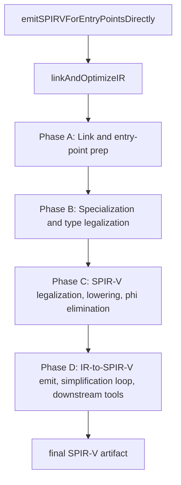

# SPIR-V Target Pipeline

This page documents the ordered IR-pass and downstream-binary sequence
executed when Slang compiles for the SPIR-V target via the
direct-emit path. It is written for a compiler developer who needs to
locate where in the SPIR-V direct-emit pipeline a particular pass runs,
what condition selects it, and which iterative passes loop until fixed
point — for example, when debugging or modifying that pipeline. The
direct-emit entry point
`emitSPIRVForEntryPointsDirectly` is invoked only from the
`CodeGenTarget::SPIRV` case of `CodeGenContext::_emitEntryPoints`
([slang-code-gen.cpp lines 1184-1189](../../../../source/slang/slang-code-gen.cpp)),
and only when the precondition
`getTargetProgram()->getOptionSet().shouldEmitSPIRVDirectly()`
holds — the `OptionSet` accessor at line 340 of
[slang-compiler-options.h](../../../../source/slang/slang-compiler-options.h).
(`TargetProgram::shouldEmitSPIRVDirectly` at line 113 of
[slang-target-program.h](../../../../source/slang/slang-target-program.h)
is the same option conjoined with `isSPIRV(target)`; the switch arm
has already established the target, so the two agree here.)
`CodeGenTarget::SPIRVAssembly` reuses this same pipeline only
indirectly: `_emitEntryPoints` first compiles an intermediate
`CodeGenTarget::SPIRV` artifact and then disassembles it
([slang-code-gen.cpp lines 1119-1183](../../../../source/slang/slang-code-gen.cpp)),
so this page is written from the `CodeGenTarget::SPIRV` perspective.
The legacy via-GLSL path (`isKhronosTarget && !emitSpirvDirectly`)
is not the subject of this page: it diverges at line 2535 of
[slang-emit.cpp](../../../../source/slang/slang-emit.cpp) where
`legalizeModesOfNonCopyableOpaqueTypedParamsForGLSL` runs only in
that mode, and the rest of the via-GLSL flow belongs to the
forthcoming GLSL target-pipeline page.

This page complements
[../pipeline/05-ir-passes.md](../pipeline/05-ir-passes.md), which is
an unordered topical catalog of every IR pass. The catalog answers
"what does pass `X` do?"; this page answers "when does pass `X` run
for SPIR-V, what gates it, and what loops iterate it?". Branches in
`linkAndOptimizeIR` gated on a sibling target (HLSL, GLSL, Metal,
WGSL, CUDA, CPU, PyTorch) are filtered out of the diagrams and
tables below; that filter is documented per-phase.

A second filter matters just as much and is easy to miss: **the
backend pipeline is not an unconditional ordered list.** Before the
first pass runs, `calcRequiredLoweringPassSet` (line 405 of
[slang-emit.cpp](../../../../source/slang/slang-emit.cpp)) walks the
whole linked module once and records, in a
`RequiredLoweringPassSet` (line 52 of
[slang-code-gen.h](../../../../source/slang/slang-code-gen.h)),
which categories of construct the IR actually contains. Most passes
in `linkAndOptimizeIR` are then guarded by the matching flag, so a
module that contains no tagged union never pays for
`lowerTaggedUnionTypes`, a module with no autodiff IR never runs
`finalizeAutoDiffPass`, and so on. The tables below give the flag in
the **Gate** column; `(always)` means genuinely unconditional. The
walk runs **twice** — once after `linkIR` (line 1049) and once again
mid-Phase-B after the optional/result-type lowerings (line 1520) —
and the flags **accumulate**: they are not cleared between scans.
That asymmetry is deliberate and is the safety argument for gating:
a flag can be *stale-true* (the construct was dead-code-eliminated
after a scan, so the pass runs and finds nothing — a harmless no-op
walk), but it can never be *false-negative*, because every gated
construct is either produced by the front end or produced by a pass
that runs before the last scan. Several gates carry that argument
verbatim as a source comment; see for example lines 1743-1753
(`appendConsumeStructuredBuffer`) and lines 1598-1606
(`taggedUnion`).

## Source

- [slang-emit.cpp](../../../../source/slang/slang-emit.cpp)
  — `linkAndOptimizeIR` (line 970) is the orchestrator;
  `calcRequiredLoweringPassSet` (line 405) computes the
  `RequiredLoweringPassSet` predicate that gates most of the
  pipeline (see [Conditional gates](#conditional-gates));
  `emitSPIRVForEntryPointsDirectly` (line 3500) is the SPIR-V
  entry point; `createArtifactFromIR` (line 3292) wraps the
  post-emit downstream chain (spirv-link, spirv-val,
  `optimizeSPIRV` currently disabled by `#if 0`).
- [slang-code-gen.h](../../../../source/slang/slang-code-gen.h)
  — declares `struct RequiredLoweringPassSet` (line 52), the
  34-flag record whose fields name the gates in the tables below.
- [slang-emit-spirv.cpp](../../../../source/slang/slang-emit-spirv.cpp)
  — `emitSPIRVFromIR` (line 12092) calls `legalizeIRForSPIRV`,
  iterates the forward-declared-pointer fixup loop, and emits the
  SPIR-V words.
- [slang-ir-spirv-legalize.cpp](../../../../source/slang/slang-ir-spirv-legalize.cpp)
  — `legalizeIRForSPIRV` (line 3347) is the top-level legalizer;
  `legalizeSPIRV` (line 3108) drives `SPIRVLegalizationContext::processModule`;
  `simplifyIRForSpirvLegalization` (line 3121) is the iterative
  simplification loop (it declares outer / inner bound constants 8 /
  16 but never increments their counters, so it iterates to a fixed
  point — see the Loops section);
  `removeUnreachableCodeAfterDiscardForOpKill` and
  `insertFragmentShaderInterlock` are SPIR-V-specific finalization
  steps.
- [slang-ir-glsl-legalize.cpp](../../../../source/slang/slang-ir-glsl-legalize.cpp)
  — `legalizeEntryPointsForGLSL` is called for SPIR-V too despite
  its name (it predates the SPIR-V direct-emit path).
- [slang-ir-legalize-binary-operator.cpp](../../../../source/slang/slang-ir-legalize-binary-operator.cpp)
  — used by `legalizeLogicalAndOr` for Khronos targets.
- [slang-ir-spirv-snippet.cpp](../../../../source/slang/slang-ir-spirv-snippet.cpp)
  — referenced by `legalizeSPIRV` for inline-asm snippet handling.
- [slang-target-program.h](../../../../source/slang/slang-target-program.h)
  — declares the forwarding `TargetProgram::shouldEmitSPIRVDirectly`
  (line 113), which combines `isSPIRV(...)` with the option-set
  predicate of the same name.
- [slang-compiler-options.h](../../../../source/slang/slang-compiler-options.h)
  — declares the `CompilerOptionSet` accessors that gate many of the
  conditional passes below, including `shouldEmitSPIRVDirectly`
  (line 340) and `shouldIncludeSourceInDebugInfo` (line 380).

## High-level phase diagram


```mermaid
flowchart TD
  entry[emitSPIRVForEntryPointsDirectly]
  entry --> linkOpt[linkAndOptimizeIR]
  linkOpt --> phaseA["Phase A: Link and entry-point prep"]
  phaseA --> phaseB["Phase B: Specialization and type legalization"]
  phaseB --> phaseC["Phase C: SPIR-V legalization, lowering, phi elimination"]
  phaseC --> phaseD["Phase D: IR-to-SPIR-V emit, simplification loop, downstream tools"]
  phaseD --> artifact[final SPIR-V artifact]
```

All four `Phase *` nodes are bodies of `linkAndOptimizeIR` except
for Phase D, which starts inside `linkAndOptimizeIR`
(`collectMetadata` / `checkUnsupportedInst`) and continues through
`createArtifactFromIR` and the SPIR-V backend.

## Phase A: Link and entry-point prep

Spans roughly lines 1005-1345 of
[slang-emit.cpp](../../../../source/slang/slang-emit.cpp). The phase
takes the just-linked IR module, runs structural validators, and
prepares the entry-point shape: coverage instrumentation, layout,
uniform-parameter collection, and the post-packing coverage-metadata
finalize. The global-varying / entry-point-callsite passes that used
to be shown here actually run later in Phase C (after
`resolveTextureFormat`). SPIR-V is reached via the
`default` arm of every per-target switch in this phase.


```mermaid
flowchart TD
  linkIRn[linkIR]
  dbgGate{shouldEmitSeparateDebugInfo?}
  emitBuildId["emit IRBuildIdentifier"]
  vaaa[validateAndRemoveAssumeAddress]
  reqSet1["calcRequiredLoweringPassSet (build gate set)"]
  diGate{"reqSet.debugInfo and DebugInfoLevel::None"}
  stripDI[stripDebugInfo]
  tEPInBorrow[translateEntryPointInParamToBorrow]
  rGC[replaceGlobalConstants]
  beGate{reqSet.bindExistential}
  bES[bindExistentialSlots]
  covGate{reqSet.coverageTracing}
  iC[instrumentCoverage]
  cGUP[collectGlobalUniformParameters]
  cEPD[checkEntryPointDecorations]
  aDMD[addDenormalModeDecorations]
  cEPUP[collectEntryPointUniformParams]
  mEPUP[moveEntryPointUniformParamsToGlobalScope]
  rTCEP[removeTorchAndCUDAEntryPoints]
  covGate2{reqSet.coverageTracing}
  fCIM[finalizeCoverageInstrumentationMetadata]
  lvcGate{reqSet.lValueCast}
  lLVC[lowerLValueCast]
  enumGate{reqSet.enumType}
  lET[lowerEnumType]

  linkIRn --> dbgGate
  dbgGate -->|true| emitBuildId --> vaaa
  dbgGate -->|false| vaaa
  vaaa --> reqSet1 --> diGate
  diGate -->|true| stripDI --> tEPInBorrow
  diGate -->|false| tEPInBorrow
  tEPInBorrow --> rGC --> beGate
  beGate -->|true| bES --> covGate
  beGate -->|false| covGate
  covGate -->|true| iC --> cGUP
  covGate -->|false| cGUP
  cGUP --> cEPD --> aDMD --> cEPUP --> mEPUP --> rTCEP --> covGate2
  covGate2 -->|true| fCIM --> lvcGate
  covGate2 -->|false| lvcGate
  lvcGate -->|true| lLVC --> enumGate
  lvcGate -->|false| enumGate
  enumGate -->|true| lET
```

Validation calls `validateIRModuleIfEnabled` run after most
`SLANG_PASS` calls but are omitted from the diagram for legibility.

| # | Pass | File | Gate | Notes |
| --- | --- | --- | --- | --- |
| 1 | `linkIR` | [slang-ir-link.cpp](../../../../source/slang/slang-ir-link.cpp) | (always) | Direct call (not `SLANG_PASS`); pulls in IR for imported modules. |
| 2 | `validateAndRemoveAssumeAddress` | [slang-ir-validate.cpp](../../../../source/slang/slang-ir-validate.cpp) | (always for SPIR-V) | `validate=true` (since `!isCPUTarget && !isCUDATarget`). |
| 3 | `stripDebugInfo` | [slang-ir-strip-debug-info.cpp](../../../../source/slang/slang-ir-strip-debug-info.cpp) | `reqSet.debugInfo && getDebugInfoLevel() == DebugInfoLevel::None` | Drops debug instructions when `-g0`. |
| 4 | `translateEntryPointInParamToBorrow` | [slang-ir-transform-params-to-constref.cpp](../../../../source/slang/slang-ir-transform-params-to-constref.cpp) | (always) | |
| 5 | `replaceGlobalConstants` | [slang-ir-link.cpp](../../../../source/slang/slang-ir-link.cpp) | (always) | |
| 6 | `bindExistentialSlots` | [slang-ir-bind-existentials.cpp](../../../../source/slang/slang-ir-bind-existentials.cpp) | `reqSet.bindExistential` | |
| 7 | `instrumentCoverage` | [slang-ir-coverage-instrument.cpp](../../../../source/slang/slang-ir-coverage-instrument.cpp) | `reqSet.coverageTracing` | Writes coverage metadata via the `ArtifactPostEmitMetadata` pointer created at line 1019. Now also passed a `counterByteWidth` (default `kDefaultCoverageCounterByteWidth`, overridable to 4 via `TraceCoverageCounterByteWidth`; the API path re-validates 4/8 and fails with `CoverageCounterWidthBytesInvalid` otherwise) and a `coverageBoolean` flag (from `TraceCoverageBoolean`, off by default). |
| 8 | `collectGlobalUniformParameters` | [slang-ir-collect-global-uniforms.cpp](../../../../source/slang/slang-ir-collect-global-uniforms.cpp) | (always) | |
| 9 | `checkEntryPointDecorations` | [slang-ir-entry-point-decorations.cpp](../../../../source/slang/slang-ir-entry-point-decorations.cpp) | (always) | |
| 10 | `addDenormalModeDecorations` | [slang-emit.cpp](../../../../source/slang/slang-emit.cpp) | (always) | Static helper inside `slang-emit.cpp` (line 756). |
| 11 | `collectEntryPointUniformParams` | [slang-ir-entry-point-uniforms.cpp](../../../../source/slang/slang-ir-entry-point-uniforms.cpp) | (always, SPIR-V via `default` arm) | |
| 12 | `moveEntryPointUniformParamsToGlobalScope` | [slang-ir-entry-point-uniforms.cpp](../../../../source/slang/slang-ir-entry-point-uniforms.cpp) | (always, SPIR-V via `default` arm) | |
| 13 | `removeTorchAndCUDAEntryPoints` | [slang-ir-pytorch-cpp-binding.cpp](../../../../source/slang/slang-ir-pytorch-cpp-binding.cpp) | (always, SPIR-V via `default` arm) | |
| 14 | `finalizeCoverageInstrumentationMetadata` | [slang-ir-coverage-instrument.cpp](../../../../source/slang/slang-ir-coverage-instrument.cpp) | `reqSet.coverageTracing` | Runs after entry-point uniform packing so the post-packing `globalScopeVarLayout` can fill in the CPU/CUDA uniform-marshaling fields on the coverage `ArtifactPostEmitMetadata` produced by step 7. Effectively a no-op on SPIR-V (no CPU/CUDA marshaling), but the call site is shared. |
| 15 | `lowerLValueCast` | [slang-ir-lower-l-value-cast.cpp](../../../../source/slang/slang-ir-lower-l-value-cast.cpp) | `reqSet.lValueCast` | Gate added by #11917/#12088; the flag is set by `kIROp_InOutImplicitCast` / `kIROp_OutImplicitCast`, which only the front end produces. |
| 16 | `lowerEnumType` | [slang-ir-lower-enum-type.cpp](../../../../source/slang/slang-ir-lower-enum-type.cpp) | `reqSet.enumType` | Runs early so enum casts don't block specialization. Since #12050 the flag is set by `kIROp_CastEnumToInt` / `kIROp_CastIntToEnum` / `kIROp_EnumCast` as well as by `kIROp_EnumType`, so a degenerate cast that outlives the last `IREnumType` still selects the pass. |

Filtered out for SPIR-V in this phase: the
`!isKhronosTarget && reqSet.glslSSBO` branch (line 1057,
`lowerGLSLShaderStorageBufferObjectsToStructuredBuffers`); the
`CUDASource` / `CUDAHeader` arm of the entry-point-param switch
(`collectOptiXEntryPointUniformParams`).

## Phase B: Specialization and type legalization

Spans roughly lines 1347-1986 of
[slang-emit.cpp](../../../../source/slang/slang-emit.cpp). The phase
runs the main simplification pass, drives generic / existential
specialization, finalizes autodiff, lowers high-level types
(`Result`, `Optional`, `Conditional`, tagged unions, existentials,
tuples), and then performs resource and matrix legalization plus
several rounds of resource-usage specialization. Phase B ends just
before byte-address-buffer legalization.


```mermaid
flowchart TD
  s1[simplifyIR default]
  vuGate{getBoolOption ValidateUniformity}
  vu[validateUniformity]
  sML[specializeMatrixLayout]
  fscGate{not shouldPerformMinimumOptimizations}
  fSC[fuseCallsToSaturatedCooperation]
  adGate{reqSet.autodiff}
  cAP[checkAutodiffPatterns]
  dCC[diagnoseCircularConformances]
  sdGate{not isSpecializationDisabled}
  sM[specializeModule]
  hofGate{reqSet.higherOrderFunc}
  sHOP[specializeHigherOrderParameters]
  adGate2{reqSet.autodiff}
  fADP[finalizeAutoDiffPass]
  sADD[stripAutoDiffDecorations]
  mssGate{reqSet.matrixSwizzleStore}
  lMSS[lowerMatrixSwizzleStores]
  dce1[eliminateDeadCode]
  fS[finalizeSpecialization]
  adGate3{reqSet.autodiff}
  lDTI["lowerDiffTypeInfoInsts (direct call)"]
  rtGate{reqSet.resultType}
  lRT[lowerResultType]
  ctGate{reqSet.conditionalType}
  lCT[lowerConditionalType]
  otGate1{reqSet.optionalType}
  lRO[lowerReinterpretOptional]
  nevGate{shouldRunNonEssentialValidation}
  cONU[checkForOptionalNoneUsage]
  otGate2{reqSet.optionalType}
  lOT[lowerOptionalType]
  reqSet2["calcRequiredLoweringPassSet (rebuild gates)"]
  dUR[detectUninitializedResources]
  raidGate{removeAvailableInDownstreamIR}
  rAIDD[removeAvailableInDownstreamModuleDecorations]
  nevGate2{shouldRunNonEssentialValidation}
  cRT[checkForRecursiveTypes]
  cRF[checkForRecursiveFunctions]
  cOBA[checkForOutOfBoundAccess]
  mrGate{reqSet.missingReturn}
  cMR[checkForMissingReturns]
  cISPT[checkForInvalidShaderParameterType]
  iAVS[inferAnyValueSizeWhereNecessary]
  uPWT[unpinWitnessTables]
  svmGate{reqSet.sumVectorMatrix}
  lSVMI[lowerSumVectorMatrixInsts]
  minOptGate{not minimalOptimization}
  s2a[simplifyIR fast]
  genGate{reqSet.generics}
  dce2[eliminateDeadCode]
  tuGate{reqSet.taggedUnion}
  lTUT[lowerTaggedUnionTypes]
  lUUT[lowerUntaggedUnionTypes]
  reinterpretGate{reqSet.reinterpret}
  lR[lowerReinterpret]
  lSIDC[lowerSequentialIDTagCasts]
  lTI[lowerTagInsts]
  lTT[lowerTagTypes]
  dce3[eliminateDeadCode]
  lE[lowerExistentials]
  rWUI[removeWeakUseInsts]
  cTD["clearTranslationDictionary (direct call)"]
  pTIN[performTypeInlining]
  nevGate3{shouldRunNonEssentialValidation}
  cGSHI[checkGetStringHashInsts]
  dce4["eliminateDeadCode (direct call)"]
  lTu[lowerTuples]
  gAVMF[generateAnyValueMarshallingFunctions]
  ssGate{reqSet.specializeStageSwitch}
  sSS[specializeStageSwitch]
  pFI1[performForceInlining]
  minOpt2{minimalOptimization}
  aSCCP[applySparseConditionalConstantPropagation]
  dce5[eliminateDeadCode]
  s2b[simplifyIR default]
  cpiGate{shouldReportCheckpointIntermediates}
  rCI["reportCheckpointIntermediates (direct call)"]
  acsbGate{reqSet.appendConsumeStructuredBuffer}
  lACSB[lowerAppendConsumeStructuredBuffers]
  vrGate{getBoolOption VulkanEmitReflection}
  aUTHD[addUserTypeHintDecorations]
  lEA[legalizeEmptyArray]
  lVT[legalizeVectorTypes]
  iGC[inlineGlobalConstantsForLegalization]
  lERPF[legalizeEmptyRayPayloadsForHLSL]
  etlGate{reqSet.existentialTypeLayout}
  lETL[legalizeExistentialTypeLayout]
  vSBRT["validateStructuredBufferResourceTypes (returns SLANG_FAIL on error)"]
  lRTR[legalizeResourceTypes]
  lMT[legalizeMatrixTypes]
  minOpt3{minimalOptimization}
  dce6[eliminateDeadCode]
  s2c[simplifyIR fast]
  urhGate{reqSet.untypedResourceHandle}
  lURH[lowerUntypedResourceHandleToUInt]
  drhGate{reqSet.dynamicResourceHeap}
  lDRH[lowerDynamicResourceHeap]
  sRU[specializeResourceUsage]
  sFBLA1[specializeFuncsForBufferLoadArgs]
  dBL[deferBufferLoad]
  sAP[specializeArrayParameters]
  cSA["checkStaticAssert (direct call)"]

  s1 --> vuGate
  vuGate -->|true| vu --> sML
  vuGate -->|false| sML
  sML --> fscGate
  fscGate -->|true| fSC --> adGate
  fscGate -->|false| adGate
  adGate -->|true| cAP --> dCC
  adGate -->|false| dCC
  dCC --> sdGate
  sdGate -->|true| sM --> hofGate
  sdGate -->|false| hofGate
  hofGate -->|true| sHOP --> adGate2
  hofGate -->|false| adGate2
  adGate2 -->|true| fADP --> mssGate
  adGate2 -->|false| sADD --> mssGate
  mssGate -->|true| lMSS --> dce1
  mssGate -->|false| dce1
  dce1 --> fS --> adGate3
  adGate3 -->|true| lDTI --> ctGate
  adGate3 -->|false| ctGate
  ctGate -->|true| lCT --> otGate1
  ctGate -->|false| otGate1
  otGate1 -->|true| lRO --> nevGate
  otGate1 -->|false| nevGate
  nevGate -->|true| cONU --> otGate2
  nevGate -->|false| otGate2
  otGate2 -->|true| lOT --> rtGate
  otGate2 -->|false| rtGate
  rtGate -->|true| lRT --> reqSet2
  rtGate -->|false| reqSet2
  reqSet2 --> dUR --> raidGate
  raidGate -->|true| rAIDD --> nevGate2
  raidGate -->|false| nevGate2
  nevGate2 -->|true| cRT --> cRF --> cOBA --> mrGate
  nevGate2 -->|false| iAVS
  mrGate -->|true| cMR --> cISPT
  mrGate -->|false| cISPT
  cISPT --> iAVS
  iAVS --> uPWT --> svmGate
  svmGate -->|true| lSVMI --> minOptGate
  svmGate -->|false| minOptGate
  minOptGate -->|true| s2a --> tuGate
  minOptGate -->|false| genGate
  genGate -->|true| dce2 --> tuGate
  genGate -->|false| tuGate
  tuGate -->|true| lTUT --> lUUT
  tuGate -->|false| lUUT
  lUUT --> reinterpretGate
  reinterpretGate -->|true| lR --> lSIDC
  reinterpretGate -->|false| lSIDC
  lSIDC --> lTI --> lTT --> dce3 --> lE --> rWUI --> cTD --> pTIN --> nevGate3
  nevGate3 -->|true| cGSHI --> dce4
  nevGate3 -->|false| dce4
  dce4 --> lTu --> gAVMF --> ssGate
  ssGate -->|true| sSS --> pFI1
  ssGate -->|false| pFI1
  pFI1 --> minOpt2
  minOpt2 -->|true| aSCCP --> dce5 --> cpiGate
  minOpt2 -->|false| s2b --> cpiGate
  cpiGate -->|true| rCI --> acsbGate
  cpiGate -->|false| acsbGate
  acsbGate -->|true| lACSB --> vrGate
  acsbGate -->|false| vrGate
  vrGate -->|true| aUTHD --> lEA
  vrGate -->|false| lEA
  lEA --> lVT --> iGC --> lERPF --> etlGate
  etlGate -->|true| lETL --> vSBRT
  etlGate -->|false| vSBRT
  vSBRT --> lRTR --> lMT --> minOpt3
  minOpt3 -->|true| dce6 --> urhGate
  minOpt3 -->|false| s2c --> urhGate
  urhGate -->|true| lURH --> drhGate
  urhGate -->|false| drhGate
  drhGate -->|true| lDRH --> sRU
  drhGate -->|false| sRU
  sRU --> sFBLA1 --> dBL --> sAP --> cSA
```

| # | Pass | File | Gate | Notes |
| --- | --- | --- | --- | --- |
| 1 | `simplifyIR` | [slang-ir-ssa-simplification.cpp](../../../../source/slang/slang-ir-ssa-simplification.cpp) | (always) | `defaultIRSimplificationOptions`. |
| 2 | `validateUniformity` | [slang-ir-uniformity.cpp](../../../../source/slang/slang-ir-uniformity.cpp) | `getBoolOption(ValidateUniformity)` | Aborts the pipeline on error. |
| 3 | `specializeMatrixLayout` | [slang-ir-specialize-matrix-layout.cpp](../../../../source/slang/slang-ir-specialize-matrix-layout.cpp) | (always) | |
| 4 | `fuseCallsToSaturatedCooperation` | [slang-ir-fuse-satcoop.cpp](../../../../source/slang/slang-ir-fuse-satcoop.cpp) | `!shouldPerformMinimumOptimizations` | Must run before defunctionalization. |
| 5 | `checkAutodiffPatterns` | [slang-ir-check-differentiability.cpp](../../../../source/slang/slang-ir-check-differentiability.cpp) | `reqSet.autodiff` | |
| 6 | `diagnoseCircularConformances` | [slang-ir-any-value-inference.cpp](../../../../source/slang/slang-ir-any-value-inference.cpp) | (always) | Aborts before specialization on error. |
| 7 | `specializeModule` | [slang-ir-specialize.cpp](../../../../source/slang/slang-ir-specialize.cpp) | `!isSpecializationDisabled()` | With `specOptions.lowerWitnessLookups = true`. |
| 8 | `specializeHigherOrderParameters` | [slang-ir-defunctionalization.cpp](../../../../source/slang/slang-ir-defunctionalization.cpp) | `reqSet.higherOrderFunc` | |
| 9a | `finalizeAutoDiffPass` | [slang-ir-autodiff.cpp](../../../../source/slang/slang-ir-autodiff.cpp) | `reqSet.autodiff` (line 1446) | Builds an `AutoDiffSharedContext`; skipped entirely for modules with no autodiff IR. Mutually exclusive with row 9b since #11476. |
| 9b | `stripAutoDiffDecorations` | [slang-ir-autodiff.cpp](../../../../source/slang/slang-ir-autodiff.cpp) | `!reqSet.autodiff` (`else` arm, line 1452) | Runs *instead of* row 9a. A module with no autodiff constructs nonetheless links the `[__AutoDiffBuiltin]` core-module types, whose `Export` / `KeepAlive` decorations would otherwise pin them past the `eliminateDeadCode` in row 11. |
| 10 | `lowerMatrixSwizzleStores` | [slang-ir-lower-matrix-swizzle-store.cpp](../../../../source/slang/slang-ir-lower-matrix-swizzle-store.cpp) | `reqSet.matrixSwizzleStore` | |
| 11 | `eliminateDeadCode` | [slang-ir-dce.cpp](../../../../source/slang/slang-ir-dce.cpp) | (always) | |
| 12 | `finalizeSpecialization` | [slang-ir-specialize.cpp](../../../../source/slang/slang-ir-specialize.cpp) | (always) | |
| 13 | `lowerDiffTypeInfoInsts` | [slang-ir-autodiff.cpp](../../../../source/slang/slang-ir-autodiff.cpp) | `reqSet.autodiff` | Direct call (`DiffTypeInfo` is hoistable, must run after specialization). Gated since #11476: `kIROp_DiffTypeInfo` is itself one of the opcodes that sets the flag. |
| 14 | `lowerConditionalType` | [slang-ir-lower-conditional-type.cpp](../../../../source/slang/slang-ir-lower-conditional-type.cpp) | `reqSet.conditionalType` | |
| 15 | `lowerReinterpretOptional` | [slang-ir-lower-reinterpret.cpp](../../../../source/slang/slang-ir-lower-reinterpret.cpp) | `reqSet.optionalType` | |
| 16 | `checkForOptionalNoneUsage` | [slang-ir-check-optional-none-usage.cpp](../../../../source/slang/slang-ir-check-optional-none-usage.cpp) | `shouldRunNonEssentialValidation()` | Must run after `simplifyIR` but before `lowerOptionalType`. |
| 17 | `lowerOptionalType` | [slang-ir-lower-optional-type.cpp](../../../../source/slang/slang-ir-lower-optional-type.cpp) | `reqSet.optionalType` | |
| 18 | `lowerResultType` | [slang-ir-lower-result-type.cpp](../../../../source/slang/slang-ir-lower-result-type.cpp) | `reqSet.resultType` | Now runs **after** `lowerOptionalType`: `lowerResultType` depends on accurate `getAnyValueSize()` results, which requires Optional types to be lowered first (so that a throwing function returning `Optional<T>` keeps the result-struct shape stable). |
| 19 | `detectUninitializedResources` | [slang-ir-detect-uninitialized-resources.cpp](../../../../source/slang/slang-ir-detect-uninitialized-resources.cpp) | (always) | After `calcRequiredLoweringPassSet` rebuilds gates. |
| 20 | `removeAvailableInDownstreamModuleDecorations` | [slang-ir-strip.cpp](../../../../source/slang/slang-ir-strip.cpp) | `codeGenContext->removeAvailableInDownstreamIR` | |
| 21 | `checkForRecursiveTypes` | [slang-ir-check-recursion.cpp](../../../../source/slang/slang-ir-check-recursion.cpp) | `shouldRunNonEssentialValidation()` | |
| 22 | `checkForRecursiveFunctions` | [slang-ir-check-recursion.cpp](../../../../source/slang/slang-ir-check-recursion.cpp) | `shouldRunNonEssentialValidation()` | |
| 23 | `checkForOutOfBoundAccess` | [slang-check-out-of-bound-access.cpp](../../../../source/slang/slang-check-out-of-bound-access.cpp) | `shouldRunNonEssentialValidation()` | |
| 24 | `checkForMissingReturns` | [slang-ir-missing-return.cpp](../../../../source/slang/slang-ir-missing-return.cpp) | `reqSet.missingReturn` (under non-essential validation) | |
| 25 | `checkForInvalidShaderParameterType` | [slang-ir-check-shader-parameter-type.cpp](../../../../source/slang/slang-ir-check-shader-parameter-type.cpp) | `shouldRunNonEssentialValidation()` | |
| 26 | `inferAnyValueSizeWhereNecessary` | [slang-ir-any-value-inference.cpp](../../../../source/slang/slang-ir-any-value-inference.cpp) | (always) | |
| 27 | `unpinWitnessTables` | [slang-ir-strip-legalization-insts.cpp](../../../../source/slang/slang-ir-strip-legalization-insts.cpp) | (always) | |
| 28 | `lowerSumVectorMatrixInsts` | [slang-emit.cpp](../../../../source/slang/slang-emit.cpp) | `reqSet.sumVectorMatrix` | Helper at line 879. Gate added by #11917/#12088; `kIROp_SumVectorElements` / `kIROp_SumMatrixElements` are produced only by the autodiff transpose pass, which runs before the second `calcRequiredLoweringPassSet` scan. |
| 29 | `simplifyIR` | [slang-ir-ssa-simplification.cpp](../../../../source/slang/slang-ir-ssa-simplification.cpp) | `!fastIRSimplificationOptions.minimalOptimization` | `fastIRSimplificationOptions`. |
| 30 | `eliminateDeadCode` | [slang-ir-dce.cpp](../../../../source/slang/slang-ir-dce.cpp) | `minimalOptimization && reqSet.generics` | Alternative to pass 29 in minimal-opt mode. |
| 31 | `lowerTaggedUnionTypes` | [slang-ir-lower-dynamic-dispatch-insts.cpp](../../../../source/slang/slang-ir-lower-dynamic-dispatch-insts.cpp) | `reqSet.taggedUnion` | Sets `reqSet.reinterpret = true` if it returns `true`; when the gate is false the pass would create no reinterpret insts, so leaving `reinterpret` untouched is correct (#11961). |
| 32 | `lowerUntaggedUnionTypes` | [slang-ir-lower-dynamic-dispatch-insts.cpp](../../../../source/slang/slang-ir-lower-dynamic-dispatch-insts.cpp) | (always) | |
| 33 | `lowerReinterpret` | [slang-ir-lower-reinterpret.cpp](../../../../source/slang/slang-ir-lower-reinterpret.cpp) | `reqSet.reinterpret` | |
| 34 | `lowerSequentialIDTagCasts` | [slang-ir-lower-dynamic-dispatch-insts.cpp](../../../../source/slang/slang-ir-lower-dynamic-dispatch-insts.cpp) | (always) | |
| 35 | `lowerTagInsts` | [slang-ir-lower-dynamic-dispatch-insts.cpp](../../../../source/slang/slang-ir-lower-dynamic-dispatch-insts.cpp) | (always) | |
| 36 | `lowerTagTypes` | [slang-ir-lower-dynamic-dispatch-insts.cpp](../../../../source/slang/slang-ir-lower-dynamic-dispatch-insts.cpp) | (always) | |
| 37 | `eliminateDeadCode` | [slang-ir-dce.cpp](../../../../source/slang/slang-ir-dce.cpp) | (always) | |
| 38 | `lowerExistentials` | [slang-ir-lower-dynamic-dispatch-insts.cpp](../../../../source/slang/slang-ir-lower-dynamic-dispatch-insts.cpp) | (always) | |
| 39 | `removeWeakUseInsts` | [slang-ir-strip.cpp](../../../../source/slang/slang-ir-strip.cpp) | (always) | |
| 40 | `performTypeInlining` | [slang-ir-inline.cpp](../../../../source/slang/slang-ir-inline.cpp) | `!isCpuLikeTarget(artifactDesc)` (true for SPIR-V) | Returns `SLANG_FAIL` if inlining fails. |
| 41 | `checkGetStringHashInsts` | [slang-ir-string-hash.cpp](../../../../source/slang/slang-ir-string-hash.cpp) | `!isCpuLikeTarget && shouldRunNonEssentialValidation()` | |
| 42 | `lowerTuples` | [slang-ir-lower-tuple-types.cpp](../../../../source/slang/slang-ir-lower-tuple-types.cpp) | (always) | |
| 43 | `generateAnyValueMarshallingFunctions` | [slang-ir-any-value-marshalling.cpp](../../../../source/slang/slang-ir-any-value-marshalling.cpp) | (always) | |
| 44 | `specializeStageSwitch` | [slang-ir-specialize-stage-switch.cpp](../../../../source/slang/slang-ir-specialize-stage-switch.cpp) | `reqSet.specializeStageSwitch` | |
| 45 | `performForceInlining` | [slang-ir-inline.cpp](../../../../source/slang/slang-ir-inline.cpp) | (always) | Inlines `[__unsafeInlineEarly]` / `[ForceInline]`. |
| 46 | `applySparseConditionalConstantPropagation` | [slang-ir-sccp.cpp](../../../../source/slang/slang-ir-sccp.cpp) | `minimalOptimization` | Plus `eliminateDeadCode`. |
| 47 | `eliminateDeadCode` | [slang-ir-dce.cpp](../../../../source/slang/slang-ir-dce.cpp) | `minimalOptimization` | |
| 48 | `simplifyIR` | [slang-ir-ssa-simplification.cpp](../../../../source/slang/slang-ir-ssa-simplification.cpp) | `!minimalOptimization` | `defaultIRSimplificationOptions`. |
| 49 | `lowerAppendConsumeStructuredBuffers` | [slang-ir-lower-append-consume-structured-buffer.cpp](../../../../source/slang/slang-ir-lower-append-consume-structured-buffer.cpp) | `target != HLSL && reqSet.appendConsumeStructuredBuffer` | Second conjunct added by #11920; the flag is set by `kIROp_HLSLAppendStructuredBufferType` / `kIROp_HLSLConsumeStructuredBufferType`, which only the front end produces. |
| 50 | `addUserTypeHintDecorations` | [slang-ir-user-type-hint.cpp](../../../../source/slang/slang-ir-user-type-hint.cpp) | `getBoolOption(VulkanEmitReflection)` | |
| 51 | `legalizeEmptyArray` | [slang-ir-legalize-empty-array.cpp](../../../../source/slang/slang-ir-legalize-empty-array.cpp) | (always) | |
| 52 | `legalizeVectorTypes` | [slang-ir-legalize-vector-types.cpp](../../../../source/slang/slang-ir-legalize-vector-types.cpp) | (always) | Splits oversized / non-power-of-two vectors. |
| 53 | `inlineGlobalConstantsForLegalization` | [slang-ir-legalize-global-values.cpp](../../../../source/slang/slang-ir-legalize-global-values.cpp) | `shouldLegalizeExistentialAndResourceTypes` (default `true` for SPIR-V) | |
| 54 | `legalizeEmptyRayPayloadsForHLSL` | [slang-ir-hlsl-legalize.cpp](../../../../source/slang/slang-ir-hlsl-legalize.cpp) | `isSPIRV(target)` (despite the name) | Adds dummy fields to empty ray payloads. |
| 55 | `legalizeExistentialTypeLayout` | [slang-ir-legalize-types.cpp](../../../../source/slang/slang-ir-legalize-types.cpp) | `reqSet.existentialTypeLayout` | |
| 56 | `validateStructuredBufferResourceTypes` | [slang-ir-validate.cpp](../../../../source/slang/slang-ir-validate.cpp) | (always) | Direct call; returns `SLANG_FAIL` if invalid. |
| 57 | `legalizeResourceTypes` | [slang-ir-legalize-types.cpp](../../../../source/slang/slang-ir-legalize-types.cpp) | `shouldLegalizeExistentialAndResourceTypes` | Splits structs containing resource fields. |
| 58 | `legalizeMatrixTypes` | [slang-ir-legalize-matrix-types.cpp](../../../../source/slang/slang-ir-legalize-matrix-types.cpp) | (always) | |
| 59 | `eliminateDeadCode` | [slang-ir-dce.cpp](../../../../source/slang/slang-ir-dce.cpp) | `minimalOptimization` | |
| 60 | `simplifyIR` | [slang-ir-ssa-simplification.cpp](../../../../source/slang/slang-ir-ssa-simplification.cpp) | `!minimalOptimization` | `fastIRSimplificationOptions`. |
| 61 | `lowerUntypedResourceHandleToUInt` | [slang-ir-lower-dynamic-resource-heap.cpp](../../../../source/slang/slang-ir-lower-dynamic-resource-heap.cpp) | `reqSet.untypedResourceHandle` | Line 1950; defined alongside `lowerDynamicResourceHeap` in the same file. |
| 62 | `lowerDynamicResourceHeap` | [slang-ir-lower-dynamic-resource-heap.cpp](../../../../source/slang/slang-ir-lower-dynamic-resource-heap.cpp) | `reqSet.dynamicResourceHeap` | |
| 63 | `specializeResourceUsage` | [slang-ir-specialize-resources.cpp](../../../../source/slang/slang-ir-specialize-resources.cpp) | (always) | |
| 64 | `specializeFuncsForBufferLoadArgs` | [slang-ir-specialize-buffer-load-arg.cpp](../../../../source/slang/slang-ir-specialize-buffer-load-arg.cpp) | (always, first invocation, line 1973) | See Notable passes for the second SPIR-V-only invocation in Phase C. |
| 65 | `deferBufferLoad` | [slang-ir-defer-buffer-load.cpp](../../../../source/slang/slang-ir-defer-buffer-load.cpp) | (always) | |
| 66 | `specializeArrayParameters` | [slang-ir-specialize-arrays.cpp](../../../../source/slang/slang-ir-specialize-arrays.cpp) | (always, line 1980) | |

Filtered out for SPIR-V in this phase: the
`CUDASource / CUDAHeader / PyTorchCppBinding` arm of the derivative-
wrapper switch; the `case CodeGenTarget::HLSL` arm of
`legalizeNonVectorCompositeSelect`; the `CPPSource` /
`CPPHeader` / `HostCPPSource` COM / DLL emit arms;
`generateHostFunctionsForAutoBindCuda`, `removeTorchKernels`,
`generatePyTorchCppBinding`, `handleAutoBindNames`,
`lowerBuiltinTypesForKernelEntryPoints`; the early-return at
`target == HostVM`; `lowerCooperativeVectors`; the
CPU/Metal/CUDA/PyTorch `undoParameterCopy` /
`transformParamsToConstRef` arms;
`legalizeNonStructParameterToStructForHLSL`;
`generateDerivativeWrappers`. The
`legalizeEmptyTypes` for Metal is skipped (SPIR-V hits the
`shouldLegalizeExistentialAndResourceTypes`-true branch but not the
Metal switch arm).

## Phase C: SPIR-V legalization, lowering, phi elimination

Spans roughly lines 2128-2739 of
[slang-emit.cpp](../../../../source/slang/slang-emit.cpp). The phase
runs the byte-address-buffer legalization (with SPIR-V-specific
options), global-varying translation and entry-point callsite
fix-ups, the entry-point parameter rewriting shared with GLSL,
SPIR-V-only fix-ups (global-var initialization motion,
`transformParamsToConstRef`, `removeRawDefaultConstructors`), and
finally `eliminatePhis` with SPIR-V-specific configuration. The
phase ends with `simplifyNonSSAIR`, an optional
`getOrCreateLayout` (when the target capabilities imply
`descriptor_handle`), `collectMetadata`, and `checkUnsupportedInst`.


```mermaid
flowchart TD
  babbGate{reqSet.byteAddressBuffer}
  lBABOps[legalizeByteAddressBufferOps]
  rTF[resolveTextureFormat]
  gvvGate{reqSet.globalVaryingVar}
  tGVV[translateGlobalVaryingVar]
  rvirGate{reqSet.resolveVaryingInputRef}
  rvir[resolveVaryingInputRef]
  fEPC[fixEntryPointCallsites]
  lEPG[legalizeEntryPointsForGLSL]
  lBS[legalizeBoolSwitchForTargetsRequiringIntSwitch]
  lLAO[legalizeLogicalAndOr]
  drGate{"reqSet.dynamicResource (Khronos)"}
  lDRG[legalizeDynamicResourcesForGLSL]
  lIS[legalizeImageSubscript]
  lCBL[legalizeConstantBufferLoadForGLSL]
  lDMP[legalizeDispatchMeshPayloadForGLSL]
  mGVI[moveGlobalVarInitializationToEntryPoints]
  expGate{getBoolOption EnableExperimentalPasses}
  iEGC[introduceExplicitGlobalContext]
  tPCR[transformParamsToConstRef]
  sLOI[stripLegalizationOnlyInstructions]
  ssdGate{shouldEmitSPIRVDirectly}
  rRDC[removeRawDefaultConstructors]
  vVAM[validateVectorsAndMatrices]
  dce7[eliminateDeadCode]
  lrcGate{reqSet.lateRequireCapability}
  pLRC[processLateRequireCapabilityInsts]
  cUV[cleanUpVoidType]
  pGRRFI[performGLSLResourceReturnFunctionInlining]
  bqGate{reqSet.bindingQuery}
  lBQ[lowerBindingQueries]
  meshGate{reqSet.meshOutput}
  lMO[legalizeMeshOutputTypes]
  bcGate{reqSet.bitcast}
  lBC[lowerBitCast]
  lUBL[legalizeUniformBufferLoad]
  invYGate{getBoolOption VulkanInvertY}
  iYOP[invertYOfPositionOutput]
  posWGate{getBoolOption VulkanUseDxPositionW}
  rcpW[rcpWOfPositionInput]
  lBETST[lowerBufferElementTypeToStorageType]
  sFBLA2[specializeFuncsForBufferLoadArgs]
  pFI2[performForceInlining]
  pIFI[performIntrinsicFunctionInlining]
  eMB[eliminateMultiLevelBreak]
  minOpt4{not minimalOptimization}
  s2d[simplifyIR with removeTrivialSingleIterationLoops]
  lET2[legalizeEmptyTypes]
  livGate{shouldTrackLiveness}
  lvAvrs["LivenessUtil::addVariableRangeStarts"]
  ePhi[eliminatePhis]
  livGate2{shouldTrackLiveness}
  lvAre["LivenessUtil::addRangeEnds"]
  liveKhrGate{shouldTrackLiveness AND isKhronosTarget}
  aGL[applyGLSLLiveness]
  rLIRO[replaceLocationIntrinsicsWithRaytracingObject]
  sNSIR[simplifyNonSSAIR]
  coopGate{cooperative_matrix or cooperative_vector capability}
  cCM[collectCooperativeMetadata]
  ediGate{getBoolOption EmbedDownstreamIR}
  uNEI[unexportNonEmbeddableIR]
  descHandleGate{"target implies descriptor_handle and not PyTorch"}
  gOCL["targetProgram->getOrCreateLayout (returns SLANG_FAIL on null)"]
  cM["collectMetadata(targetProgram, metadata)"]
  minOpt5{not shouldPerformMinimumOptimizations}
  cUI[checkUnsupportedInst]

  babbGate -->|true| lBABOps --> rTF
  babbGate -->|false| rTF
  rTF --> gvvGate
  gvvGate -->|true| tGVV --> rvirGate
  gvvGate -->|false| rvirGate
  rvirGate -->|true| rvir --> fEPC
  rvirGate -->|false| fEPC
  fEPC --> lEPG --> lBS --> lLAO --> drGate
  drGate -->|true| lDRG --> lIS
  drGate -->|false| lIS
  lIS --> lCBL --> lDMP --> mGVI --> expGate
  expGate -->|true| iEGC --> tPCR
  expGate -->|false| tPCR
  tPCR --> sLOI --> ssdGate
  ssdGate -->|true| rRDC --> vVAM
  ssdGate -->|false| vVAM
  vVAM --> dce7 --> lrcGate
  lrcGate -->|true| pLRC --> cUV
  lrcGate -->|false| cUV
  cUV --> pGRRFI --> bqGate
  bqGate -->|true| lBQ --> meshGate
  bqGate -->|false| meshGate
  meshGate -->|true| lMO --> bcGate
  meshGate -->|false| bcGate
  bcGate -->|true| lBC --> lUBL
  bcGate -->|false| lUBL
  lUBL --> invYGate
  invYGate -->|true| iYOP --> posWGate
  invYGate -->|false| posWGate
  posWGate -->|true| rcpW --> lBETST
  posWGate -->|false| lBETST
  lBETST --> sFBLA2 --> pFI2 --> pIFI --> eMB --> minOpt4
  minOpt4 -->|true| s2d --> lET2
  minOpt4 -->|false| lET2
  lET2 --> livGate
  livGate -->|true| lvAvrs --> ePhi
  livGate -->|false| ePhi
  ePhi --> livGate2
  livGate2 -->|true| lvAre --> liveKhrGate
  livGate2 -->|false| liveKhrGate
  liveKhrGate -->|true| aGL --> rLIRO
  liveKhrGate -->|false| rLIRO
  rLIRO --> sNSIR --> coopGate
  coopGate -->|true| cCM --> ediGate
  coopGate -->|false| ediGate
  ediGate -->|true| uNEI --> descHandleGate
  ediGate -->|false| descHandleGate
  descHandleGate -->|true| gOCL --> cM
  descHandleGate -->|false| cM
  cM --> minOpt5
  minOpt5 -->|true| cUI
```

| # | Pass | File | Gate | Notes |
| --- | --- | --- | --- | --- |
| 1 | `legalizeByteAddressBufferOps` | [slang-ir-byte-address-legalize.cpp](../../../../source/slang/slang-ir-byte-address-legalize.cpp) | `reqSet.byteAddressBuffer` | For SPIR-V: `scalarizeVectorLoadStore=false`, `translateToStructuredBufferOps=true` (the `case CodeGenTarget::GLSL` / `SPIRV` / `SPIRVAssembly` arm). |
| 2 | `resolveTextureFormat` | [slang-ir-resolve-texture-format.cpp](../../../../source/slang/slang-ir-resolve-texture-format.cpp) | (always for SPIR-V; matches `GLSL` / `SPIRV` / `WGSL`) | |
| 3 | `translateGlobalVaryingVar` | [slang-ir-translate-global-varying-var.cpp](../../../../source/slang/slang-ir-translate-global-varying-var.cpp) | `reqSet.globalVaryingVar` | Runs after specialization (line 2188), not in Phase A. |
| 4 | `resolveVaryingInputRef` | [slang-ir-resolve-varying-input-ref.cpp](../../../../source/slang/slang-ir-resolve-varying-input-ref.cpp) | `reqSet.resolveVaryingInputRef` | |
| 5 | `fixEntryPointCallsites` | [slang-ir-fix-entrypoint-callsite.cpp](../../../../source/slang/slang-ir-fix-entrypoint-callsite.cpp) | (always) | |
| 6 | `legalizeEntryPointsForGLSL` | [slang-ir-glsl-legalize.cpp](../../../../source/slang/slang-ir-glsl-legalize.cpp) | (always for SPIR-V) | Shared with GLSL; the name predates SPIR-V direct emit. |
| 7 | `legalizeBoolSwitchForTargetsRequiringIntSwitch` | [slang-ir-glsl-legalize.cpp](../../../../source/slang/slang-ir-glsl-legalize.cpp) | (`SPIRV` / `SPIRVAssembly` arm, line 2223) | Added by #12254. GLSL and SPIR-V both require an integer `switch` selector, and a `switch` on a `bool` reaches here unchanged, so this rewrites it to an integer switch. #12275 extended it to a `switch` on an enum whose tag type is `bool`. The WGSL arm runs the same pass; the HLSL / Metal / CUDA / CPU arms do not. |
| 8 | `legalizeLogicalAndOr` | [slang-ir-legalize-binary-operator.cpp](../../../../source/slang/slang-ir-legalize-binary-operator.cpp) | `isD3DTarget \|\| isKhronosTarget \|\| isWGPUTarget \|\| isMetalTarget` | True for SPIR-V. |
| 9 | `legalizeDynamicResourcesForGLSL` | [slang-ir-glsl-legalize.cpp](../../../../source/slang/slang-ir-glsl-legalize.cpp) | `reqSet.dynamicResource && isKhronosTarget` | |
| 10 | `legalizeImageSubscript` | [slang-ir-legalize-image-subscript.cpp](../../../../source/slang/slang-ir-legalize-image-subscript.cpp) | (Khronos / Metal / GLSL / SPIR-V arm) | |
| 11 | `legalizeConstantBufferLoadForGLSL` | [slang-ir-legalize-uniform-buffer-load.cpp](../../../../source/slang/slang-ir-legalize-uniform-buffer-load.cpp) | (`GLSL` / `SPIRV` / `SPIRVAssembly` arm) | |
| 12 | `legalizeDispatchMeshPayloadForGLSL` | [slang-ir-legalize-mesh-outputs.cpp](../../../../source/slang/slang-ir-legalize-mesh-outputs.cpp) | (`GLSL` / `SPIRV` / `SPIRVAssembly` arm) | |
| 13 | `moveGlobalVarInitializationToEntryPoints` | [slang-ir-explicit-global-init.cpp](../../../../source/slang/slang-ir-explicit-global-init.cpp) | (`SPIRV` / `SPIRVAssembly` arm) | |
| 14 | `introduceExplicitGlobalContext` | [slang-ir-explicit-global-context.cpp](../../../../source/slang/slang-ir-explicit-global-context.cpp) | `getBoolOption(EnableExperimentalPasses)` | Only fires under the experimental flag for SPIR-V (line 2330). |
| 15 | `transformParamsToConstRef` | [slang-ir-transform-params-to-constref.cpp](../../../../source/slang/slang-ir-transform-params-to-constref.cpp) | (`SPIRV` / `SPIRVAssembly` arm, line 2331) | |
| 16 | `stripLegalizationOnlyInstructions` | [slang-ir-strip-legalization-insts.cpp](../../../../source/slang/slang-ir-strip-legalization-insts.cpp) | (always) | |
| 17 | `removeRawDefaultConstructors` | [slang-ir-strip-default-construct.cpp](../../../../source/slang/slang-ir-strip-default-construct.cpp) | `shouldEmitSPIRVDirectly()` | Line 2374. |
| 18 | `validateVectorsAndMatrices` | [slang-ir-validate.cpp](../../../../source/slang/slang-ir-validate.cpp) | (always) | |
| 19 | `eliminateDeadCode` | [slang-ir-dce.cpp](../../../../source/slang/slang-ir-dce.cpp) | (always) | After specialization. |
| 20 | `processLateRequireCapabilityInsts` | [slang-ir-late-require-capability.cpp](../../../../source/slang/slang-ir-late-require-capability.cpp) | `reqSet.lateRequireCapability` | Gate added by #11917/#12088; the flag is set by `kIROp_LateRequireCapability`. |
| 21 | `cleanUpVoidType` | [slang-ir-cleanup-void.cpp](../../../../source/slang/slang-ir-cleanup-void.cpp) | (always) | |
| 22 | `performGLSLResourceReturnFunctionInlining` | [slang-ir-glsl-legalize.cpp](../../../../source/slang/slang-ir-glsl-legalize.cpp) | `isKhronosTarget` | Fallback inliner for resource returns. |
| 23 | `lowerBindingQueries` | [slang-ir-lower-binding-query.cpp](../../../../source/slang/slang-ir-lower-binding-query.cpp) | `reqSet.bindingQuery` | |
| 24 | `legalizeMeshOutputTypes` | [slang-ir-legalize-mesh-outputs.cpp](../../../../source/slang/slang-ir-legalize-mesh-outputs.cpp) | `reqSet.meshOutput` | |
| 25 | `lowerBitCast` | [slang-ir-lower-bit-cast.cpp](../../../../source/slang/slang-ir-lower-bit-cast.cpp) | `reqSet.bitcast` | |
| 26 | `legalizeUniformBufferLoad` | [slang-ir-legalize-uniform-buffer-load.cpp](../../../../source/slang/slang-ir-legalize-uniform-buffer-load.cpp) | `isKhronosTarget \|\| target == HLSL` | |
| 27 | `invertYOfPositionOutput` | [slang-ir-vk-invert-y.cpp](../../../../source/slang/slang-ir-vk-invert-y.cpp) | `getBoolOption(VulkanInvertY)` | |
| 28 | `rcpWOfPositionInput` | [slang-ir-vk-invert-y.cpp](../../../../source/slang/slang-ir-vk-invert-y.cpp) | `getBoolOption(VulkanUseDxPositionW)` | |
| 29 | `lowerBufferElementTypeToStorageType` | [slang-ir-lower-buffer-element-type.cpp](../../../../source/slang/slang-ir-lower-buffer-element-type.cpp) | (always) | `loweringPolicyKind = KhronosTarget`; line 2477. |
| 30 | `specializeFuncsForBufferLoadArgs` | [slang-ir-specialize-buffer-load-arg.cpp](../../../../source/slang/slang-ir-specialize-buffer-load-arg.cpp) | `isKhronosTarget && emitSpirvDirectly` | Second invocation, line 2507; see Notable passes. |
| 31 | `performForceInlining` | [slang-ir-inline.cpp](../../../../source/slang/slang-ir-inline.cpp) | (always) | |
| 32 | `performIntrinsicFunctionInlining` | [slang-ir-inline.cpp](../../../../source/slang/slang-ir-inline.cpp) | `emitSpirvDirectly` | |
| 33 | `eliminateMultiLevelBreak` | [slang-ir-eliminate-multilevel-break.cpp](../../../../source/slang/slang-ir-eliminate-multilevel-break.cpp) | (always) | |
| 34 | `simplifyIR` | [slang-ir-ssa-simplification.cpp](../../../../source/slang/slang-ir-ssa-simplification.cpp) | `!minimalOptimization` | With `removeTrivialSingleIterationLoops = true`; line 2530. |
| 35 | `legalizeEmptyTypes` | [slang-ir-legalize-types.cpp](../../../../source/slang/slang-ir-legalize-types.cpp) | (always; required for AD 2.0) | |
| 36 | `LivenessUtil::addVariableRangeStarts` | [slang-ir-liveness.cpp](../../../../source/slang/slang-ir-liveness.cpp) | `shouldTrackLiveness()` | Liveness mode gating. |
| 37 | `eliminatePhis` | [slang-ir-eliminate-phis.cpp](../../../../source/slang/slang-ir-eliminate-phis.cpp) | (always) | Line 2576. SPIR-V-specific: `eliminateCompositeTypedPhiOnly = false`, `useRegisterAllocation = true`. |
| 38 | `LivenessUtil::addRangeEnds` | [slang-ir-liveness.cpp](../../../../source/slang/slang-ir-liveness.cpp) | `shouldTrackLiveness()` | |
| 39 | `applyGLSLLiveness` | [slang-ir-glsl-liveness.cpp](../../../../source/slang/slang-ir-glsl-liveness.cpp) | `shouldTrackLiveness() && isKhronosTarget(targetRequest)` ([slang-emit.cpp line 2608](../../../../source/slang/slang-emit.cpp)) | Khronos-targets-only pass that translates the `IRLiveRangeStart`/`IRLiveRangeEnd` markers from the previous two rows into the GLSL/SPIR-V liveness encoding. SPIR-V direct-emit and SPIR-V via-GLSL both reach this row because the gate is `isKhronosTarget`, not the direct-emit predicate. |
| 40 | `replaceLocationIntrinsicsWithRaytracingObject` | [slang-ir-early-raytracing-intrinsic-simplification.cpp](../../../../source/slang/slang-ir-early-raytracing-intrinsic-simplification.cpp) | `isKhronosTarget && emitSpirvDirectly` | |
| 41 | `simplifyNonSSAIR` | [slang-ir-ssa-simplification.cpp](../../../../source/slang/slang-ir-ssa-simplification.cpp) | (always) | After phi elimination; line 2620. |
| 42 | `collectCooperativeMetadata` | [slang-ir-metadata.cpp](../../../../source/slang/slang-ir-metadata.cpp) | `targetCaps implies cooperative_matrix or cooperative_vector` | Captures cooperative types that survive lowering. |
| 43 | `unexportNonEmbeddableIR` | [slang-emit.cpp](../../../../source/slang/slang-emit.cpp) | `getBoolOption(EmbedDownstreamIR)` | Static helper at line 708, invoked at line 2723. |
| 44 | `targetProgram->getOrCreateLayout` | [slang-target-program.h](../../../../source/slang/slang-target-program.h) | `target != PyTorchCppBinding && targetCaps imply descriptor_handle` | Direct call ([slang-emit.cpp line 2732](../../../../source/slang/slang-emit.cpp)); returns `SLANG_FAIL` on null. Ensures the `ProgramLayout` exists so `collectMetadata` can read `bindlessSpaceIndex` and detect bindless-resource-heap use. The Vulkan / SPIR-V `descriptor_handle` capability set selects this on the SPIR-V path. |
| 45 | `collectMetadata` | [slang-ir-metadata.cpp](../../../../source/slang/slang-ir-metadata.cpp) | (always) | Now takes `targetProgram` (line 276) and reads `targetProgram->getExistingLayout()` to set `usesBindlessResourceHeap`; fills binding / exported-function fields on `metadata`. `getExistingLayout` no longer asserts the layout exists — it returns `nullptr` when no layout was built, so the bindless scan is simply skipped. |
| 46 | `checkUnsupportedInst` | [slang-ir-check-unsupported-inst.cpp](../../../../source/slang/slang-ir-check-unsupported-inst.cpp) | `!shouldPerformMinimumOptimizations()` | Last `SLANG_PASS` in `linkAndOptimizeIR`, line 2739. |

Filtered out for SPIR-V in this phase: the CUDA `__ldg` immutable-
load lowering; `synthesizeActiveMask` (CUDA / PTX);
`legalizeIRForMetal`, `legalizeEntryPointVaryingParamsForCPU`,
`legalizeEntryPointVaryingParamsForCUDA`, `legalizeIRForWGSL`;
the `case CodeGenTarget::HLSL: wrapStructuredBuffersOfMatrices`
and `Metal: wrapCBufferElementsForMetal` arms;
`floatNonUniformResourceIndex` (only runs `!isSPIRV`);
`legalizeArrayReturnType` (skipped for SPIR-V);
`specializeAddressSpace` (GLSL), `specializeAddressSpaceForMetal`,
`specializeAddressSpaceForWGSL` (SPIR-V defers address-space
propagation to its legalization pass);
`legalizeModesOfNonCopyableOpaqueTypedParamsForGLSL` (only fires
on the via-GLSL path);
`applyVariableScopeCorrection` (SPIR-V is in the `!=` arm of the
`(target != SPIRV) && (target != SPIRVAssembly)` test);
`validateAtomicOperations` (called elsewhere for SPIR-V, namely
inside `legalizeIRForSPIRV`); the `CPPSource` /
`HostCPPSource` branches for `lowerComInterfaces` /
`generateDllImportFuncs` / `generateDllExportFuncs`.

## Phase D: IR-to-SPIR-V emit, simplification loop, downstream tools

Starts immediately after `linkAndOptimizeIR` returns to
`emitSPIRVForEntryPointsDirectly` (line 3500 of
[slang-emit.cpp](../../../../source/slang/slang-emit.cpp)). The
SPIR-V backend in `emitSPIRVFromIR` (line 12092 of
[slang-emit-spirv.cpp](../../../../source/slang/slang-emit-spirv.cpp))
calls the top-level `legalizeIRForSPIRV` (line 3347 of
[slang-ir-spirv-legalize.cpp](../../../../source/slang/slang-ir-spirv-legalize.cpp))
which runs the SPIR-V-specific IR passes and the iterative
`simplifyIRForSpirvLegalization` loop. After SPIR-V word emission
the artifact passes through the optional downstream chain in
`createArtifactFromIR` (line 3292): `spirv-link` for embedded-
module merging and `spirv-val` for validation.


```mermaid
flowchart TD
  ent[emitSPIRVForEntryPointsDirectly]
  cAFIR[createArtifactFromIR]
  eFR[emitSPIRVFromIR]
  lIRSPV[legalizeIRForSPIRV]
  lSPV[legalizeSPIRV processModule]
  simpHead{"simplifyIRForSpirvLegalization while changed (iterationCounter never incremented; i<8 guard inert)"}
  sccpG[applySparseConditionalConstantPropagationForGlobalScope]
  peepG[peepholeOptimizeGlobalScope]
  funcLoop{"per-function loop while funcChanged (funcIterationCount never incremented; j<16 guard inert)"}
  sccpF[applySparseConditionalConstantPropagation]
  peepF[peepholeOptimize]
  redF[removeRedundancyInFunc]
  cfgF[simplifyCFG]
  dceF[eliminateDeadCode]
  discardGate{not shouldEmitDiscardAsDemote}
  rURDOK[removeUnreachableCodeAfterDiscardForOpKill]
  dceL[eliminateDeadCode]
  bEPRG[buildEntryPointReferenceGraph]
  iFSI[insertFragmentShaderInterlock]
  rADMD[removeAvailableInDownstreamModuleDecorations]
  emitDebug["emit IRDebugSource / IRDebugBuildIdentifier / IRDebugCompilationUnit"]
  emitParams["emit IRGlobalParam if PreserveParameters"]
  emitWholeProgram["emit IRFunc with IRDownstreamModuleExportDecoration if GenerateWholeProgram"]
  emitOpSource["emit OpSource"]
  emitEPs["emit irEntryPoints"]
  fwdHead{forward-declared pointers?}
  fwdFix[fix up forward-declared pointers]
  diagStride[diagnoseConflictingDescriptorHeapStrideOptions]
  emitExtCap[emitSPIRVAnyExtension / emitSPIRVAnyCapabilities]
  emitFront[emitFrontMatter]
  emitPhys[emitPhysicalLayout]
  spvOutDone[SPIR-V bytes done]
  optDisabled["(downstream) optimizeSPIRV [disabled]"]
  compilerGate{compiler loaded?}
  skipLinkGate{"!isPrecompilation and !shouldSkipDownstreamLinking"}
  collectFiles["collect SPIR-V files from IREmbeddedDownstreamIR"]
  multiFile{spirvFiles.getCount > 1}
  spirvLink["(downstream) compiler->link spirv-link"]
  valGate{shouldRunSPIRVValidation}
  spirvVal["(downstream) compiler->validate spirv-val"]
  spirvOpt["(downstream) compiler->compile spirv-opt"]
  artifactDone[final SPIR-V artifact]

  ent --> cAFIR --> eFR --> lIRSPV --> lSPV --> simpHead
  simpHead -->|"changed"| sccpG --> peepG --> funcLoop
  funcLoop -->|"funcChanged"| sccpF --> peepF --> redF --> cfgF --> dceF --> funcLoop
  funcLoop -->|"!funcChanged"| simpHead
  simpHead -->|"!changed (or error)"| discardGate
  discardGate -->|true| rURDOK --> dceL
  discardGate -->|false| dceL
  dceL --> bEPRG --> iFSI --> rADMD --> emitDebug --> emitParams --> emitWholeProgram --> emitOpSource --> emitEPs --> fwdHead
  fwdHead -->|yes| fwdFix --> fwdHead
  fwdHead -->|no| diagStride --> emitExtCap --> emitFront --> emitPhys --> spvOutDone --> optDisabled
  optDisabled --> compilerGate
  compilerGate -->|false| artifactDone
  compilerGate -->|true| skipLinkGate
  skipLinkGate -->|true| collectFiles --> multiFile
  skipLinkGate -->|false| valGate
  multiFile -->|yes| spirvLink --> valGate
  multiFile -->|no| valGate
  valGate -->|true| spirvVal --> spirvOpt
  valGate -->|false| spirvOpt
  spirvOpt --> artifactDone
```

| # | Pass / step | File | Gate | Notes |
| --- | --- | --- | --- | --- |
| 1 | `emitSPIRVForEntryPointsDirectly` | [slang-emit.cpp](../../../../source/slang/slang-emit.cpp) | (entry point) | Wraps `linkAndOptimizeIR` + `createArtifactFromIR`. |
| 2 | `emitSPIRVFromIR` | [slang-emit-spirv.cpp](../../../../source/slang/slang-emit-spirv.cpp) | (always) | The SPIR-V backend. |
| 3 | `legalizeIRForSPIRV` | [slang-ir-spirv-legalize.cpp](../../../../source/slang/slang-ir-spirv-legalize.cpp) | (always) | Calls the inner three steps below. |
| 4 | `legalizeSPIRV` → `SPIRVLegalizationContext::processModule` | [slang-ir-spirv-legalize.cpp](../../../../source/slang/slang-ir-spirv-legalize.cpp) | (always) | The main SPIR-V legalization driver. Per-inst dispatch now includes `processAbort` for `kIROp_Abort`: it packs the format string into a `uint` array, builds an explicitly-laid-out `AbortMessage` struct (cached per payload signature in `m_abortMessageTypes`), rewrites the inst to `Abort(message)`, and ends the block with `unreachable` (the abort is a block terminator). It also rewrites descriptor-heap `ConstantBuffer<T>` loads to untyped-`Uniform` pointers and, uniquely, drains its work list a second time afterwards. See Notable passes. |
| 5 | `simplifyIRForSpirvLegalization` | [slang-ir-spirv-legalize.cpp](../../../../source/slang/slang-ir-spirv-legalize.cpp) | (always) | Outer / inner loops carry `kMaxIterations = 8` / `kMaxFuncIterations = 16` guards, but the counters are never incremented, so termination is fixed-point-only; see the Loops section. |
| 5a | `applySparseConditionalConstantPropagationForGlobalScope` | [slang-ir-sccp.cpp](../../../../source/slang/slang-ir-sccp.cpp) | (each outer iteration) | Global-scope SCCP. |
| 5b | `peepholeOptimizeGlobalScope` | [slang-ir-peephole.cpp](../../../../source/slang/slang-ir-peephole.cpp) | (each outer iteration) | |
| 5c | `applySparseConditionalConstantPropagation` | [slang-ir-sccp.cpp](../../../../source/slang/slang-ir-sccp.cpp) | (each inner iteration) | Per-function SCCP. |
| 5d | `peepholeOptimize` | [slang-ir-peephole.cpp](../../../../source/slang/slang-ir-peephole.cpp) | (each inner iteration) | |
| 5e | `removeRedundancyInFunc` | [slang-ir-redundancy-removal.cpp](../../../../source/slang/slang-ir-redundancy-removal.cpp) | (each inner iteration) | |
| 5f | `simplifyCFG` | [slang-ir-simplify-cfg.cpp](../../../../source/slang/slang-ir-simplify-cfg.cpp) | (each inner iteration) | `removeTrivialSingleIterationLoops = true`, `removeSideEffectFreeLoops = false`. |
| 5g | `eliminateDeadCode` | [slang-ir-dce.cpp](../../../../source/slang/slang-ir-dce.cpp) | (each inner iteration) | |
| 6 | `removeUnreachableCodeAfterDiscardForOpKill` | [slang-ir-spirv-legalize.cpp](../../../../source/slang/slang-ir-spirv-legalize.cpp) | `!context->shouldEmitDiscardAsDemote()` | Needed for SPIR-V < 1.6 without `SPV_EXT_demote_to_helper_invocation`. |
| 7 | `eliminateDeadCode` | [slang-ir-dce.cpp](../../../../source/slang/slang-ir-dce.cpp) | (always) | Cleans up after step 6. |
| 8 | `buildEntryPointReferenceGraph` | [slang-ir-spirv-legalize.cpp](../../../../source/slang/slang-ir-spirv-legalize.cpp) | (always) | Populates `m_referencingEntryPoints`. |
| 9 | `insertFragmentShaderInterlock` | [slang-ir-spirv-legalize.cpp](../../../../source/slang/slang-ir-spirv-legalize.cpp) | (always; only acts on raster-ordered resources in fragment entry points) | |
| 10 | `removeAvailableInDownstreamModuleDecorations` | [slang-ir-strip.cpp](../../../../source/slang/slang-ir-strip.cpp) | (always) | Direct call inside `emitSPIRVFromIR`. |
| 11 | SPIR-V word emission | [slang-emit-spirv.cpp](../../../../source/slang/slang-emit-spirv.cpp) | (always) | Sources: `IRDebugSource` / `IRDebugBuildIdentifier` / `IRDebugCompilationUnit` first; then optional `IRGlobalParam`s under `PreserveParameters`; then optional `IRFunc`s with `IRDownstreamModuleExportDecoration` under `GenerateWholeProgram`; then the `OpSource` instruction (via `emitSource`, line 2167 — see Notable passes for `-debug-info-include-source`); then every entry point. `kIROp_Abort` emits via `emitAbort` (line 4921): it declares `SPV_KHR_abort` / `SpvCapabilityAbortKHR` and emits `OpAbortKHR` with the packed message struct as its single operand, and is treated as a block terminator (no further insts in the block are emitted). |
| 12 | Forward-declared pointer fixup loop | [slang-emit-spirv.cpp](../../../../source/slang/slang-emit-spirv.cpp) | (always; loop body when `m_forwardDeclaredPointers != 0`) | See the Loops section. |
| 13 | `diagnoseConflictingDescriptorHeapStrideOptions` | [slang-emit-spirv.cpp](../../../../source/slang/slang-emit-spirv.cpp) | (always; only diagnoses on conflict) | Direct call after the forward-pointer loop ([slang-emit-spirv.cpp line 12268](../../../../source/slang/slang-emit-spirv.cpp); the member is defined at line 7509). Re-checks the compile-API path for the `SPIRVUnifiedDescriptorHeapStride` + non-zero `SPIRVResourceHeapStride` conflict the CLI rejects at option-parse time; emits `SpirvConflictingDescriptorHeapStrideOptions`. See Notable passes. |
| 14 | `emitSPIRVAnyExtension` / `emitSPIRVAnyCapabilities` | [slang-emit-spirv.cpp](../../../../source/slang/slang-emit-spirv.cpp) | (always) | Emit deferred-choice extensions and capabilities. |
| 15 | `emitFrontMatter` | [slang-emit-spirv.cpp](../../../../source/slang/slang-emit-spirv.cpp) | (always) | |
| 16 | `emitPhysicalLayout` | [slang-emit-spirv.cpp](../../../../source/slang/slang-emit-spirv.cpp) | (always) | Produces the final word stream. |
| 17 | `optimizeSPIRV` | [slang-emit.cpp](../../../../source/slang/slang-emit.cpp) | `#if 0` (currently disabled) | Inline spirv-opt invocation inside `createArtifactFromIR` (lines 3312-3319), positioned before the downstream link/validate chain; left in for documentation, never executes. |
| 18 | `compiler->link` (spirv-link) | (downstream tool) | `!isPrecompilation && !shouldSkipDownstreamLinking && spirvFiles.getCount() > 1` | Merges the freshly emitted SPIR-V with every `IREmbeddedDownstreamIR` of `CodeGenTarget::SPIRV` found in the program's IR modules. |
| 19 | `compiler->validate` (spirv-val) | (downstream tool) | `shouldRunSPIRVValidation(codeGenContext)` | True only when neither `SkipSPIRVValidation` nor `IncompleteLibrary` is set and the `SLANG_RUN_SPIRV_VALIDATION` env var equals exactly `"1"` (`shouldRunSPIRVValidation`, [slang-emit.cpp line 3265](../../../../source/slang/slang-emit.cpp)). |
| 20 | downstream `compile` (spirv-opt) | (downstream tool) | `compiler != nullptr` (line 3404) — i.e. `needsDownstreamCompiler` was true and `getOrLoadDownstreamCompiler(PassThroughMode::SpirvOpt, ...)` succeeded | `needsDownstreamCompiler` is the disjunction `needsLink \|\| needsOptimization \|\| needsValidation \|\| needsSeparateDebugInfo` (lines 3393-3394 of [slang-emit.cpp](../../../../source/slang/slang-emit.cpp)), so `needsOptimization` is only one of four reasons the compiler gets loaded — it is not itself the gate on the call. `compiler->compile` at line 3473 uses `downstreamOptions.targetType = SLANG_SPIRV`. See Notable passes for the `-Xspirv-opt` passthrough. |
| 21 | `addAssociated(metadata)` | [slang-emit.cpp](../../../../source/slang/slang-emit.cpp) | (always) | The `ArtifactPostEmitMetadata` produced in Phase A flows into the final artifact. |

Filtered out for SPIR-V in this phase: every non-Khronos backend
in `emitEntryPointsSourceFromIR`; the LLVM / VM / Slang / WGSL
artifact paths.

## Conditional gates

The diagrams above reference the following gates. Each gate
fires once per `linkAndOptimizeIR` call (or per
`createArtifactFromIR` call for Phase D); none are evaluated
inside a loop.

### `requiredLoweringPassSet.*` flags

The flags are filled in by `calcRequiredLoweringPassSet` (line 405 of
[slang-emit.cpp](../../../../source/slang/slang-emit.cpp)), called
twice: once at the start of Phase A (line 1049) and once mid-Phase-B
after `lowerOptionalType` (line 1520). The second call **adds** to the
first — the `RequiredLoweringPassSet` is not reset — so a flag set by
either scan stays set. Only the flags that gate at least one pass on
the SPIR-V path are listed.

| Gate | Passes it controls |
| --- | --- |
| `debugInfo` | `stripDebugInfo` (Phase A) when combined with `DebugInfoLevel::None`. |
| `lValueCast` | `lowerLValueCast` (Phase A step 15). |
| `globalVaryingVar` | `translateGlobalVaryingVar`. |
| `resolveVaryingInputRef` | `resolveVaryingInputRef`. |
| `bindExistential` | `bindExistentialSlots`. |
| `coverageTracing` | `instrumentCoverage` (Phase A step 7) **and** `finalizeCoverageInstrumentationMetadata` (Phase A step 14). |
| `enumType` | `lowerEnumType`. |
| `autodiff` | `checkAutodiffPatterns`, `finalizeAutoDiffPass` (with `stripAutoDiffDecorations` on the false arm), and `lowerDiffTypeInfoInsts`. Set by `IRTranslateBase`, `IRTranslatedTypeBase`, `IRDifferentialPairTypeBase`, `IRMakeDifferentialPairBase`, `IRDifferentialPairGetDifferentialBase`, `IRDifferentialPairGetPrimalBase`, an `IRAttributedType` carrying `IRNoDiffAttr`, and the `kIROp_Annotation` / `kIROp_DetachDerivative` / `kIROp_DiffTypeInfo` opcodes — i.e. direct `DifferentialPair` or `no_diff` use counts, not just `fwd_diff` / `bwd_diff`. |
| `sumVectorMatrix` | `lowerSumVectorMatrixInsts`. |
| `taggedUnion` | `lowerTaggedUnionTypes` (and, transitively, whether that pass can set `reinterpret`). |
| `untypedResourceHandle` | `lowerUntypedResourceHandleToUInt`. |
| `appendConsumeStructuredBuffer` | `lowerAppendConsumeStructuredBuffers` (conjoined with `target != HLSL`). |
| `lateRequireCapability` | `processLateRequireCapabilityInsts` (Phase C). |
| `higherOrderFunc` | `specializeHigherOrderParameters`. |
| `matrixSwizzleStore` | `lowerMatrixSwizzleStores`. |
| `resultType` | `lowerResultType`. |
| `conditionalType` | `lowerConditionalType`. |
| `optionalType` | `lowerReinterpretOptional`, `lowerOptionalType`. |
| `missingReturn` | `checkForMissingReturns` (under non-essential validation). |
| `generics` | `eliminateDeadCode` (in the minimal-optimization arm). |
| `reinterpret` | `lowerReinterpret`. |
| `specializeStageSwitch` | `specializeStageSwitch`. |
| `existentialTypeLayout` | `legalizeExistentialTypeLayout`. |
| `dynamicResource` | `legalizeDynamicResourcesForGLSL` (Khronos). |
| `dynamicResourceHeap` | `lowerDynamicResourceHeap`. |
| `byteAddressBuffer` | `legalizeByteAddressBufferOps`. |
| `bindingQuery` | `lowerBindingQueries`. |
| `meshOutput` | `legalizeMeshOutputTypes`. |
| `bitcast` | `lowerBitCast`. |

Flags that exist in `RequiredLoweringPassSet` but **never gate a
pass for SPIR-V**: `glslSSBO` (only fires for non-Khronos),
`nonVectorCompositeSelect` (only HLSL),
`derivativePyBindWrapper` (PyTorch),
`combinedTextureSamplers` (HLSL / Metal / WGSL / CPU only),
`barrierFlagValidation` (`validateBarrierFlagsForHLSL`, guarded by
`target == CodeGenTarget::HLSL || isD3DTarget(targetRequest)` at
line 1733).

The struct declares 34 flags in total; the union of the table above
and this paragraph accounts for all of them that appear in a gate
expression inside `linkAndOptimizeIR`.

### Option-set toggles

| Gate | Passes it controls |
| --- | --- |
| `targetCompilerOptions.shouldEmitSeparateDebugInfo()` | Emits an `IRDebugBuildIdentifier` after linking and again as a SPIR-V instruction at emit. |
| `targetCompilerOptions.getDebugInfoLevel() == DebugInfoLevel::None` | Together with `reqSet.debugInfo` gates `stripDebugInfo`. |
| `shouldIncludeSourceInDebugInfo()` (`-debug-info-include-source`) | Conjoined with `getDebugInfoLevel() == DebugInfoLevel::Minimal`, selects the per-file `OpSource` form in `emitSource`. See [Embedding source at `-g1`](#embedding-source-at--g1). |
| `getDownstreamArgs("spirv-opt")` non-empty | Forces `needsOptimization`, so the spirv-opt downstream compile runs even at `-O0`. |
| `getBoolOption(ValidateUniformity)` | `validateUniformity`. |
| `getBoolOption(PreserveParameters)` | Phase A: changes the DCE keep-alive option; Phase D: emits unreferenced `IRGlobalParam`s into the SPIR-V module. |
| `getBoolOption(GenerateWholeProgram)` | Phase D: emits every `IRFunc` with `IRDownstreamModuleExportDecoration`. |
| `getBoolOption(EnableExperimentalPasses)` | `introduceExplicitGlobalContext` (Phase C). |
| `getBoolOption(VulkanEmitReflection)` | `addUserTypeHintDecorations`. |
| `getBoolOption(VulkanInvertY)` | `invertYOfPositionOutput`. |
| `getBoolOption(VulkanUseDxPositionW)` | `rcpWOfPositionInput`. |
| `getBoolOption(EmbedDownstreamIR)` | `unexportNonEmbeddableIR` (Phase C); `isPrecompilation` predicate at Phase D's `spirv-link` gate. |
| `shouldRunNonEssentialValidation()` | `checkForOptionalNoneUsage`, `checkForRecursiveTypes`, `checkForRecursiveFunctions`, `checkForOutOfBoundAccess`, `checkForInvalidShaderParameterType`, `checkGetStringHashInsts`. |
| `shouldPerformMinimumOptimizations()` | Negated: gates `fuseCallsToSaturatedCooperation`; negated again at the end gates `checkUnsupportedInst`. |
| `getBoolOption(SkipSPIRVValidation)` | Negated factor of `shouldRunSPIRVValidation`. |
| Environment `SLANG_RUN_SPIRV_VALIDATION` | Factor of `shouldRunSPIRVValidation`. |

### Context predicates and capability gates

| Gate | Passes it controls |
| --- | --- |
| `!codeGenContext->isSpecializationDisabled()` | `specializeModule`. |
| `codeGenContext->shouldReportCheckpointIntermediates()` | `reportCheckpointIntermediates` (direct call, prints diagnostic info). |
| `codeGenContext->shouldTrackLiveness()` | `LivenessUtil::addVariableRangeStarts`, `LivenessUtil::addRangeEnds`, and on every Khronos target (SPIR-V direct-emit and via-GLSL) `applyGLSLLiveness`. |
| `codeGenContext->removeAvailableInDownstreamIR` | `removeAvailableInDownstreamModuleDecorations`. |
| `codeGenContext->shouldSkipDownstreamLinking()` | Negated factor of the spirv-link gate. |
| `spirvFiles.getCount() > 1` | spirv-link invocation. |
| `targetCaps` implies `cooperative_matrix` or `cooperative_vector` | `collectCooperativeMetadata`. |
| `shouldRunSPIRVValidation(codeGenContext)` | spirv-val invocation. |
| `target != CodeGenTarget::PyTorchCppBinding && targetCaps.atLeastOneSetImpliedInOther(CapabilitySet(CapabilityName::descriptor_handle)) == ImpliesReturnFlags::Implied` (lines 2728-2730) | Phase C's `targetProgram->getOrCreateLayout(sink)` direct call. True on the SPIR-V path, whose capability set implies `descriptor_handle`. |
| `compiler != nullptr` (line 3404), i.e. `needsDownstreamCompiler` held and `getOrLoadDownstreamCompiler(PassThroughMode::SpirvOpt, ...)` succeeded | The whole Phase D downstream block: `compiler->link` (spirv-link), `compiler->validate` (spirv-val), and `compiler->compile` (spirv-opt) at line 3473. `needsDownstreamCompiler` is `needsLink \|\| needsOptimization \|\| needsValidation \|\| needsSeparateDebugInfo` (lines 3393-3394). |

### Simplification-mode predicates

| Gate | Passes it controls |
| --- | --- |
| `fastIRSimplificationOptions.minimalOptimization` | Selects between the post-`unpinWitnessTables` `simplifyIR` and an `eliminateDeadCode`, between the post-`performForceInlining` `simplifyIR` and an `applySparseConditionalConstantPropagation` + `eliminateDeadCode`, between the post-`legalizeMatrixTypes` `simplifyIR` and an `eliminateDeadCode`, and between Phase C's `simplifyIR` with `removeTrivialSingleIterationLoops = true` and no simplification. |

### SPIR-V-specific runtime predicates

| Gate | Where evaluated | Effect |
| --- | --- | --- |
| `SPIRVEmitSharedContext::shouldEmitDiscardAsDemote()` | `legalizeIRForSPIRV` | Negated: gates `removeUnreachableCodeAfterDiscardForOpKill`. Returns `true` for SPIR-V ≥ 1.6 or when `SPV_EXT_demote_to_helper_invocation` is in use; in those cases `discard` lowers to `OpDemoteToHelperInvocation` (not a terminator) and the fix-up is unnecessary. |
| `SPIRVEmitSharedContext::isSpirv16OrLater()` | `insertFragmentShaderInterlock` | Selects which terminator opcodes trigger the inserted `OpEndInvocationInterlockEXT`. |

## Loops in the pipeline

Two iterative passes execute in the SPIR-V pipeline. No other
`SLANG_PASS` is iterated to a fixed point.

### `simplifyIRForSpirvLegalization` (Phase D, step 5)

Defined at line 3121 of
[slang-ir-spirv-legalize.cpp](../../../../source/slang/slang-ir-spirv-legalize.cpp).

- Outer loop: `while (changed && iterationCounter < kMaxIterations)`
  with `kMaxIterations = 8` and `iterationCounter` initialized to `0`.
  Each iteration runs
  `applySparseConditionalConstantPropagationForGlobalScope` then
  `peepholeOptimizeGlobalScope`, then the inner per-function loop
  below. The outer loop also breaks immediately if `sink->getErrorCount() != 0`.
- Inner per-function loop:
  `while (funcChanged && funcIterationCount < kMaxFuncIterations)`
  with `kMaxFuncIterations = 16` and `funcIterationCount` initialized
  to `0`. Each iteration runs, in order,
  `applySparseConditionalConstantPropagation`, `peepholeOptimize`,
  `removeRedundancyInFunc(func, /*aggressive=*/false)`,
  `simplifyCFG` (with `removeTrivialSingleIterationLoops = true`
  and `removeSideEffectFreeLoops = false`), and `eliminateDeadCode`.
- Fixed-point condition: each pass returns `bool` indicating whether
  it modified the IR; `changed` / `funcChanged` are the disjunction
  of those returns. At this source commit **neither `iterationCounter`
  nor `funcIterationCount` is incremented in the loop body**
  ([slang-ir-spirv-legalize.cpp lines 3128-3158](../../../../source/slang/slang-ir-spirv-legalize.cpp)),
  so the `< kMaxIterations` / `< kMaxFuncIterations` guards never
  actually bound the loops — each loop terminates solely when its
  pass set reports no change (and the outer loop additionally on a
  raised error count). The `kMaxIterations = 8` / `kMaxFuncIterations
  = 16` constants are present but inert until the counters are
  advanced.

Because the bound expressions are never reached, there is no
finite worst-case sub-pass count enforced by the source; both loops
rely entirely on reaching a fixed point.

### Forward-declared pointer fixup (Phase D, step 12)

Defined at lines 12250-12266 of
[slang-emit-spirv.cpp](../../../../source/slang/slang-emit-spirv.cpp).

- Form: `do { ... } while (context.m_forwardDeclaredPointers.getCount() != 0)`.
- Each iteration drains `m_forwardDeclaredPointers`, calls
  `ensureInst` on each pointee type (which can introduce *new*
  forward-declared pointer types), and moves the pointer
  instructions to the end of their parent so that the SPIR-V
  module ends with all forward pointer declarations.
- Fixed-point condition: the set becomes empty.
- No explicit bound; relies on the type graph being finite.

## Notable passes

### `legalizeIRForSPIRV`

The single SPIR-V-only entry point inside `emitSPIRVFromIR`,
defined at line 3347 of
[slang-ir-spirv-legalize.cpp](../../../../source/slang/slang-ir-spirv-legalize.cpp).
It is *not* a single pass: it sequences `legalizeSPIRV`
(`SPIRVLegalizationContext::processModule`) followed by the
iterative `simplifyIRForSpirvLegalization`, then
`removeUnreachableCodeAfterDiscardForOpKill` (under the
`shouldEmitDiscardAsDemote` gate), `eliminateDeadCode`,
`buildEntryPointReferenceGraph`, and `insertFragmentShaderInterlock`.
Each of these is an IR pass in its own right and appears as a
distinct row in the Phase D table.

### `eliminatePhis` with SPIR-V-specific options

At lines 2573-2574 of [slang-emit.cpp](../../../../source/slang/slang-emit.cpp)
the construction of `PhiEliminationOptions` checks
`isKhronosTarget(targetRequest) && emitSpirvDirectly` and sets
`eliminateCompositeTypedPhiOnly = false` and
`useRegisterAllocation = true`. SPIR-V is the only backend that
flips both knobs: most other backends accept the defaults. The
`useRegisterAllocation` mode invokes the
[slang-ir-ssa-register-allocate.cpp](../../../../source/slang/slang-ir-ssa-register-allocate.cpp)
pass implicitly to coalesce SSA values into named temporaries
before lowering.

### `specializeFuncsForBufferLoadArgs` (invoked twice)

The first invocation (Phase B, step 64) is unconditional and
specializes functions whose arguments are values loaded from an
immutable location. The second invocation (Phase C, step 30) runs
only when `isKhronosTarget && emitSpirvDirectly`, and runs *after*
`lowerBufferElementTypeToStorageType`. The rationale, captured in
the comment at lines 2504-2506 of `slang-emit.cpp`, is the SPIR-V rule
2.16.1 that disallows passing an access chain as a function
argument when the `VariablePointer` capability is not declared. The
second invocation eliminates any access-chain arguments that arose
from buffer-element-type lowering.

### Deferred address-space propagation

At lines 2484-2496 of `slang-emit.cpp` the address-space
specialization runs for GLSL, Metal, and WGSL, but `not` for
SPIR-V:

```cpp
if (target == CodeGenTarget::GLSL)            specializeAddressSpace(...);
else if (isMetalTarget(targetRequest))        specializeAddressSpaceForMetal();
else if (isWGPUTarget(targetRequest))         specializeAddressSpaceForWGSL();
```

SPIR-V defers this work to `legalizeIRForSPIRV` (Phase D), which
runs after the post-emit `linkAndOptimizeIR` would otherwise have
discarded address-space information. The deferral lets the SPIR-V
legalizer produce `Storage*` pointer types directly rather than
having to undo a GLSL-style legalization first.

### `legalizeEntryPointsForGLSL` despite the name

Phase C step 6 runs `legalizeEntryPointsForGLSL` for SPIR-V too
(line 2215 of `slang-emit.cpp` selects on `case GLSL` /
`case SPIRV` / `case SPIRVAssembly`). The name reflects history:
when the only Khronos path was via GLSL, the pass lived under that
namespace; SPIR-V direct emit reuses it because the entry-point
shape it produces is what the backend expects in both modes. The
pass updates the `ShaderExtensionTracker` for either GLSL or
SPIR-V depending on `target`.

### `transformParamsToConstRef` on the SPIR-V arm

The same pass is reached via two different switch arms in
`linkAndOptimizeIR`. The SPIR-V arm (line 2331) runs it
unconditionally; the CUDA / Metal / CPU arm (line 2345) runs it
only when the target is CPU, CUDA, or Metal. For SPIR-V it
ensures that struct-typed parameters are passed by const reference,
which avoids unnecessary copies in the emitted code.

### `Abort` lowering (`processAbort` + `emitAbort`)

`kIROp_Abort` reaches the SPIR-V path with a string-literal format
operand followed by variadic arguments. The lowering is split across
two stages so the message type goes through the normal deduplicated
type-emission path. In Phase D step 4, `SPIRVLegalizationContext::processAbort`
([slang-ir-spirv-legalize.cpp lines 2143-2277](../../../../source/slang/slang-ir-spirv-legalize.cpp))
packs the format string (with its null terminator) into a `uint` array
with an explicit stride, widens `bool` argument values to `uint`
(`OpTypeBool` has no physical size), and builds an explicitly-laid-out
`AbortMessage` struct — cached per payload signature in
`m_abortMessageTypes` so identical signatures share one nominal struct
type. It rewrites the inst to `Abort(message)`, strips the trailing
unreachable code, and terminates the block with `unreachable` because
`OpAbortKHR` is itself a block terminator (mirroring the `discard` /
`OpKill` treatment). At emit time (step 11), `emitAbort`
([slang-emit-spirv.cpp line 4921](../../../../source/slang/slang-emit-spirv.cpp))
declares `SPV_KHR_abort` and `SpvCapabilityAbortKHR` and emits
`OpAbortKHR` with the prepared message struct as its single operand.

### Descriptor-heap `ConstantBuffer` and the second work-list drain

`SPIRVLegalizationContext::processModule` gained a step that is worth
calling out because it is the one place the legalizer drains its work
list twice. `processConstantBufferDescriptorHeapLoads` (line 1339 of
[slang-ir-spirv-legalize.cpp](../../../../source/slang/slang-ir-spirv-legalize.cpp))
rewrites every `IRSPIRVLoadDescriptorFromHeap` whose type is an
`IRConstantBufferType` so the fetched pointer becomes an
`IRSPIRVUntypedPtrType` in `AddressSpace::Uniform`, marking the
element struct with `kIROp_SPIRVBlockDecoration`. The `Uniform`
storage class preserves the uniform-buffer descriptor kind the
application actually binds into the heap slot, and the untyped pointer
lets nested members be reached with `OpUntypedAccessChainKHR` off the
block layout decorations instead of a typed pointer that would need a
pointer-type `ArrayStride`.

Ordering is load-bearing in both directions. The rewrite runs at line
2901, *after* `wrapRemainingConstantBufferElementTypes` (line 2896),
because a scalar, vector, or matrix element is not yet a block struct
before wrapping — the per-load helper asserts the element is an
`IRStructType` for exactly this reason. And because the rewrite
requeues each load's derived field- and element-address pointers,
which are produced after the first `processWorkList()` (line 2891) has
already finished, a second `processWorkList()` follows at line 2905 to
carry the untyped-Uniform flavor down those derived pointers.

The pointer-flavor propagation itself is why the element- and
field-address handlers no longer compare address spaces alone: an
element pointer of an untyped base is itself untyped, and that
typed-to-untyped transition happens *at the same* `Uniform` address
space, so both handlers now also compare the pointer opcode
(`as<IRSPIRVUntypedPtrType>(ptrType) ? kIROp_SPIRVUntypedPtrType :
oldResultType->getOp()`) before deciding a new pointer type is needed.

### Descriptor-heap array stride and the unified-stride option

`getDescriptorRuntimeArrayType`
([slang-emit-spirv.cpp line 7449](../../../../source/slang/slang-emit-spirv.cpp))
keys its cache on (element type, stride) rather than element type
alone, and takes a caller-chosen stride. `getDescriptorHeapArrayStride`
(line 7381) selects `SPIRVSamplerHeapStride` for sampler heaps and
`SPIRVResourceHeapStride` for texture / buffer resource heaps;
acceleration-structure heap entries are lowered to `uint64` elements
with a fixed minimum-8-byte stride (`getAccelerationStructureDescriptorHeapStride`).
When `-spirv-unified-descriptor-heap-stride` is set, every resource
descriptor-heap runtime array shares a single fixed
`max(sizeof(image descriptor), sizeof(buffer descriptor))` stride
(`getUnifiedResourceHeapStride`, emitted as an `OpSpecConstantOp` chain).
The `diagnoseConflictingDescriptorHeapStrideOptions` call (Phase D step
13) re-checks the compile-API path for the conflict between that option
and a non-zero `SPIRVResourceHeapStride` that the CLI parser already
rejects.

### `legalizeEntryPointsForGLSL`: FragDepth and geometry-primitive refinements

Beyond running for SPIR-V despite its name, this pass (Phase C step 6)
now records the `SV_DepthGreaterEqual` / `SV_DepthLessEqual` semantics as
`FragDepthGreater` / `FragDepthLess` system-value kinds (gated on
`LayoutResourceKind::VaryingOutput`) and attaches
`kIROp_GLSLFragDepthGreaterDecoration` /
`kIROp_GLSLFragDepthLessDecoration` to the *entry point* rather than the
`gl_FragDepth` var (a conservative-depth execution mode). For SPIR-V
direct emit the decoration is inert — the SPIR-V emitter derives the
mode independently — but the pass is shared with the via-GLSL path. The
geometry-shader default-input-primitive (`triangle`) fallback also moved
from `legalizeEntryPointParameterForGLSL` to the end of
`legalizeEntryPointForGLSL` so it runs only after all parameters are
processed and cannot clash with a real primitive qualifier.

### Debug levels and `-debug-info-include-source`

The debug-info shape emitted in Phase D is chosen by
`getDebugInfoLevel()`, and the choice is made partly in IR
generation and partly in the emitter (the mapping is spelled out in
the comment at lines 12138-12147 of
[slang-emit-spirv.cpp](../../../../source/slang/slang-emit-spirv.cpp)).
At `None` (`-g0`) the IR carries no debug instructions at all. At
`Minimal` (`-g1`) it carries `IRDebugSource` and `IRDebugLine`, and
the emitter produces the standard SPIR-V debug instructions
`OpString`, `OpLine`, and `OpSource`. At `Standard` (`-g2`) and
`Maximal` (`-g3`) the module additionally carries `IRDebugVar` for
local variables and the emitter switches to the NonSemantic debug-info
extension; SPIR-V emit treats `Standard` and `Maximal` identically.

`-debug-info-include-source` (accessor
`shouldIncludeSourceInDebugInfo()` at line 380 of
[slang-compiler-options.h](../../../../source/slang/slang-compiler-options.h),
wrapping `CompilerOptionName::DebugInfoIncludeSource`) is an
orthogonal switch that embeds the full source text in
`IRDebugSource` **without** promoting the debug level. Its effect on
the SPIR-V side lives in `emitSource` (line 2167): when the level is
exactly `Minimal` *and* the option is set, the emitter walks every
global `IRDebugSource` that has non-empty content and emits one
File+Source form `OpSource` per file — matching what `-g2`/`-g3`
already do through per-file `DebugSource`. Otherwise it emits a
single bare language/version `OpSource`. The two forms are mutually
exclusive, so a tool extracting embedded source never sees a
spurious file-less record alongside the per-file ones.

At `-g2`/`-g3` the NonSemantic `DebugEntryPoint` instruction records
the command line that produced the entry point. That string is built
by `getDebugInfoCommandLineArgumentForEntryPoint` (line 4065), which
emits `-target spirv`, then the option set's own
`writeCommandLineArgs` rendering, then `-stage <stage>` from the
`IREntryPointDecoration`'s profile, and finally `-entry <name>` when
the parent function has a name. Deriving the stage and entry name
from the decoration rather than from ambient state is what makes the
recorded command line correct for each entry point in a
multi-entry-point module (#12220). The instruction is emitted at line
4356, with the producer string `"slangc"`.

### Capabilities and extensions decided at emit time

Several SPIR-V capabilities are not implied by the target profile
but are requested by the emitter when it sees a particular
construct. These are behavioral decisions owned by this page;
[../cross-cutting/targets.md](../cross-cutting/targets.md) owns the
declaration of the atoms themselves.

- **`ImageGatherExtended` is requested only for a non-constant
  offset.** In the `Gather` emit path the emitter tests
  `isConstantGatherOffset(offset)` (line 5946). A constant offset
  uses `SpvImageOperandsConstOffsetMask` and needs no extra
  capability; only the dynamic-offset case falls through to
  `SpvImageOperandsOffsetMask` and
  `requireSPIRVCapability(SpvCapabilityImageGatherExtended)` at line
  5953. Before this split, every `Gather` with an offset dragged the
  capability in.
- **Shader-invocation reorder works from SPIR-V 1.4.**
  `requireShaderInvocationReorderExtension` (line 1884) picks the
  NVIDIA variant when the target capabilities imply
  `spvShaderInvocationReorderNV` and the cross-vendor
  `SPV_EXT_shader_invocation_reorder` otherwise, returning which one
  it chose so the caller can emit the matching `HitObject` type
  (line 2875). The 1.4 dependency on a physical-storage-buffer
  extension is handled centrally rather than at each call site:
  `requireSPIRVCapability` (line 11810) notices either reorder
  capability and calls `ensureExtensionDeclarationBeforeSpv15` for
  `SPV_KHR_physical_storage_buffer`, so every path funnelling through
  it picks the dependency up uniformly. This is a plain `OpExtension`
  only; it does **not** switch the addressing model, which stays
  `Logical GLSL450`. Contrast `requirePhysicalStorageAddressing`
  (line 2118), which does move the module to
  `SpvAddressingModelPhysicalStorageBuffer64`. At SPIR-V 1.5 and
  later the guarded call emits nothing, since the feature is core.
- **`[Shader64BitIndexing]`** lowers to a
  `kIROp_Shader64BitIndexingDecoration`, which the decoration emitter
  (line 6562) turns into an `SPV_EXT_shader_64bit_indexing`
  extension declaration, the `SpvCapabilityShader64BitIndexingEXT`
  capability, and an `SpvExecutionModeShader64BitIndexingEXT`
  execution mode on the entry point.
- **`NoContraction` under `-fp-mode precise`.**
  `maybeEmitNoContraction` (line 10425) decorates the emitted result
  when precise mode is in effect, but only when the *emitted opcode*
  is one of `OpFAdd`, `OpFSub`, `OpFMul`, `OpFDiv`, `OpFRem`,
  `OpFNegate`, or `OpVectorTimesScalar`. Gating on the emitted
  opcode rather than the IR instruction matters because integer,
  bitwise, logical, and floating-point-comparison operations all
  travel the same IR arithmetic path yet emit opcodes on which
  `NoContraction` is invalid. For a matrix operation the per-row
  results are decorated individually (line 10484); the
  `OpCompositeConstruct` that reassembles the matrix is not a valid
  target and is left undecorated.

### `Flat` decoration for integral fragment inputs

SPIR-V requires integral fragment-stage inputs to be flat-qualified.
`needFlatDecorationForBuiltinVar` (line 7205 of
[slang-emit-spirv.cpp](../../../../source/slang/slang-emit-spirv.cpp))
decides this. It accepts `kIROp_GlobalVar`, `kIROp_GlobalParam`, and
`kIROp_SPIRVAsmOperandBuiltinVar`, and derives the value type two
ways: for a pointer-typed instruction it requires the address space
to be `Input` or `BuiltinInput` and takes the pointee; for a
non-pointer instruction — the shape a built-in variable referenced
from a `spirv_asm` block has — it uses the instruction's own data
type. The decoration is applied when that value type is an integral
scalar or composite and the instruction is used in `Stage::Fragment`.
Accepting the `spirv_asm` built-in-var shape is what restores the
decoration for wave built-ins such as `SubgroupLocalInvocationId`,
which reach the emitter that way rather than as a global parameter
(#12064).

### `OpSwitch` case literals follow the selector width

A SPIR-V `OpSwitch` case literal must occupy the same number of
words as the selector's type. The `kIROp_Switch` emit path (line
5426 of
[slang-emit-spirv.cpp](../../../../source/slang/slang-emit-spirv.cpp))
therefore reads `getIntTypeInfo(m_targetRequest,
switchInst->getCondition()->getDataType())` and emits each case
literal via `SpvLiteralInteger::from64` when the selector is wider
than 32 bits and `from32` otherwise. Emitting a one-word literal for
a 64-bit selector produced structurally invalid SPIR-V (#12240).
Note that this is the value-switch path; the loop-lowering code also
emits an `OpSwitch` (line 8179) as a breakable region for a loop
with no back edge, and that one always uses a 32-bit zero selector.

### Emitting untyped pointers for descriptor-heap access

This is the emitter-side counterpart of the legalizer work described
under "Descriptor-heap `ConstantBuffer` and the second work-list
drain" above: the legalizer decides that a descriptor-heap
`ConstantBuffer` load yields an `IRSPIRVUntypedPtrType`, and the
emitter turns that type into actual SPIR-V.
`kIROp_SPIRVUntypedPtrType` maps to a storage class via
`addressSpaceToStorageClass` and is release-asserted to be either
`Uniform` or `StorageBuffer` (line 2498) — a `ConstantBuffer` fetched
from a descriptor heap must land on `Uniform`, i.e. a uniform-buffer
descriptor, rather than being treated as a storage buffer (#12226).
Because the pointee is still accessed through that pointer using
`OpUntypedAccessChainKHR`, the emitter calls
`requireCapabilitiesForType(untypedPtrType->getValueType(),
storageClass)` so the same 8-/16-bit storage capabilities a typed
pointer would have required are still declared. The untyped pointer
type itself is created once per storage class by
`ensureUntypedPointerType` (line 7308). Since an untyped pointer
carries no pointee type, the field-address emit path passes the
struct being indexed as an explicit Base Type operand to
`OpUntypedAccessChainKHR`.

### Float-to-bool casts

The float-to-bool cast path (line 9501 of
[slang-emit-spirv.cpp](../../../../source/slang/slang-emit-spirv.cpp))
builds the comparison against a zero constant of the *source* type.
It uses `builder.getFloatValue(fromType, 0.0)`; constructing the
zero with `getIntValue` produced an integer constant of a
floating-point type, which is not a well-formed IR value and led to
invalid SPIR-V (#12019).

### Downstream spirv-link / spirv-val / spirv-opt chain

`createArtifactFromIR` (line 3292 of `slang-emit.cpp`) wires up
three downstream tools. All three share one `IDownstreamCompiler`,
loaded from `PassThroughMode::SpirvOpt`, and that load is itself
conditional: `needsDownstreamCompiler` (line 3393) is the disjunction
of `needsLink`, `needsOptimization`, `needsValidation`, and
`needsSeparateDebugInfo`, and when it is false `compiler` stays
`nullptr` and the whole block at line 3404 is skipped. The point of
that predicate is to keep a plain `-O0` compile from loading
`slang-glslang` at all (the source cites issue #11662). The same
condition also decides whether the emitted words are copied into the
artifact or moved into it (`ListBlob::create` versus
`ListBlob::moveCreate`, line 3396).

- **spirv-link** runs only when there is more than one input
  SPIR-V module — the freshly emitted module plus any
  `IREmbeddedDownstreamIR` whose `target` equals
  `CodeGenTarget::SPIRV`. Slang enumerates all IR modules in the
  program and pulls the embedded SPIR-V blob out of each
  matching instruction.
- **spirv-val** runs when `shouldRunSPIRVValidation` returns true.
  At this commit that requires the `SLANG_RUN_SPIRV_VALIDATION`
  environment variable to equal exactly `"1"`, with both the
  `SkipSPIRVValidation` (the `-skip-spirv-validation` flag) and the
  `IncompleteLibrary` options off; there is no `-validate-spirv`
  command-line flag. Even when `spirv-link` has replaced
  `artifact` with the linked module, `spirv-val` validates the
  freshly emitted `spirv` buffer (`compiler->validate(
  (uint32_t*)spirv.getBuffer(), ...)` at line 3433), not the linked
  artifact. On validation failure the SPIR-V is disassembled and a
  `SpirvValidationFailed` diagnostic is emitted, but the artifact is
  still returned.
- **spirv-opt** is invoked via the generic downstream-compile
  path (`downstreamOptions.targetType = SLANG_SPIRV`,
  `downstreamOptions.sourceLanguage = SLANG_SOURCE_LANGUAGE_SPIRV`)
  at line 3473. The earlier in-source `optimizeSPIRV` call is inside
  a `#if 0` block opening at line 3312 and never executes — it is
  shown in Phase D's diagram for documentation only, and inline
  spirv-opt is therefore not part of the active pipeline.

### `-Xspirv-opt` passthrough

`createArtifactFromIR` collects `getDownstreamArgs("spirv-opt")`
into `spirvOptArgs` at line 3385 of
[slang-emit.cpp](../../../../source/slang/slang-emit.cpp) and folds
it into `needsOptimization` at line 3387. Two consequences follow.
First, `-Xspirv-opt <flag>` names individual optimizer passes
explicitly, so the optimizer must run even at `-O0`, where the preset
pass list would otherwise be empty; the `spirvOptArgs.getCount() != 0`
disjunct is what makes that happen. Second, computing the predicate
here keeps a plain `-O0` compile — no `-Xspirv-opt`, no link, no
validation, no separate debug info — from loading the `slang-glslang`
downstream library at all, because `needsDownstreamCompiler` stays
false and `compiler` stays null (issue #11662). The arguments are
forwarded into `downstreamOptions` at line 3446.

## See also

- [../pipeline/04-ast-to-ir.md](../pipeline/04-ast-to-ir.md) — how
  the AST lowers into the IR that this pipeline consumes.
- [../pipeline/05-ir-passes.md](../pipeline/05-ir-passes.md) — the
  unordered topical catalog of every IR pass; the natural follow-up
  for "what does pass `X` do?".
- [../pipeline/06-emit.md](../pipeline/06-emit.md) — overview of
  the emit stage across all targets.
- [../cross-cutting/targets.md](../cross-cutting/targets.md) —
  per-target options, capability sets, and the `TargetProgram` /
  `TargetRequest` machinery.
- [../ir-reference/index.md](../ir-reference/index.md) — the
  per-opcode catalog; the legalization passes in Phase C / D
  transform many of the opcodes catalogued there.
- [../../../user-guide/a2-01-spirv-target-specific.md](../../../user-guide/a2-01-spirv-target-specific.md)
  — user-facing notes on the SPIR-V target (command-line flags,
  capability requirements, extensions).
