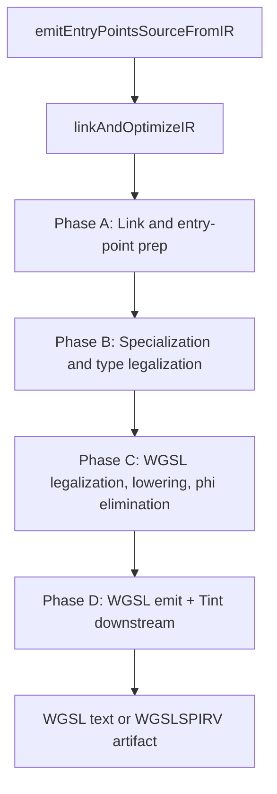
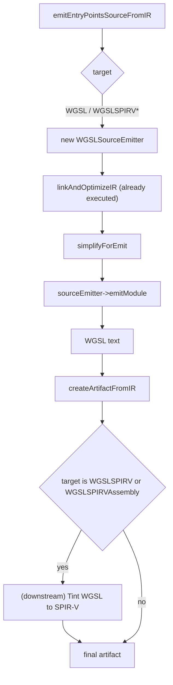

# WGSL Target Pipeline

This page documents the ordered IR-pass and downstream-binary
sequence executed when Slang compiles for the WGSL target family.
The corresponding `CodeGenTarget` values are
`CodeGenTarget::WGSL`, `CodeGenTarget::WGSLSPIRV`, and
`CodeGenTarget::WGSLSPIRVAssembly`. The three targets share the
WGSL **source** pipeline because the back-end's source-target
mapping reduces both to source target `WGSL` in two steps:
`WGSLSPIRVAssembly` first maps to `WGSLSPIRV`
(`source/slang/slang-code-gen.cpp:1059-1060`), and `WGSLSPIRV` then
maps to `WGSL` (`source/slang/slang-code-gen.cpp:271-272`); WGSL is
emitted first, then handed to Tint to translate to SPIR-V for the
`WGSLSPIRV*` arms. Inside `linkAndOptimizeIR` the shared predicate
is `isWGPUTarget(targetRequest)`, but several individual switch
arms list only `CodeGenTarget::WGSL` (for example
`slang-emit.cpp:1947-1949` and `slang-emit.cpp:2082-2086`); those
arms still fire for the `WGSLSPIRV*` variants because of the
source-target reduction, not because the arm's case label mentions
them.

This page complements
[../pipeline/05-ir-passes.md](../pipeline/05-ir-passes.md), which
is an unordered topical catalog of every IR pass. Branches in
`linkAndOptimizeIR` gated on a sibling target (SPIR-V, HLSL,
Metal, CUDA, CPU, GLSL, PyTorch) are filtered out of the diagrams
and tables below.

## Source

- [slang-emit.cpp](../../../../source/slang/slang-emit.cpp) —
  `linkAndOptimizeIR` (line ~895) is the orchestrator;
  `emitEntryPointsSourceFromIR` (line ~2487) constructs the
  `WGSLSourceEmitter` and emits WGSL text.
- [slang-emit-wgsl.cpp](../../../../source/slang/slang-emit-wgsl.cpp)
  — `WGSLSourceEmitter` implementation.
- [slang-emit-c-like.cpp](../../../../source/slang/slang-emit-c-like.cpp)
  — shared C-like emitter base class for `simplifyForEmit` and
  `emitModule`.
- [slang-ir-wgsl-legalize.cpp](../../../../source/slang/slang-ir-wgsl-legalize.cpp)
  — `legalizeIRForWGSL` (line ~215) is the central WGSL
  legalization driver.
- [slang-ir-legalize-varying-params.cpp](../../../../source/slang/slang-ir-legalize-varying-params.cpp)
  — `legalizeEntryPointVaryingParamsForWGSL` (line ~4829).
- [slang-ir-legalize-binary-operator.cpp](../../../../source/slang/slang-ir-legalize-binary-operator.cpp)
  — `legalizeLogicalAndOr` runs for WGSL (line ~2040 of
  `slang-emit.cpp`).
- [slang-target-program.h](../../../../source/slang/slang-target-program.h)
  / [slang-compiler-options.h](../../../../source/slang/slang-compiler-options.h)
  — gate sources.

## High-level phase diagram

Phase A and Phase B are nearly identical to the corresponding
phases on the SPIR-V page; the divergence is concentrated in
Phase C.

## Phase A: Link and entry-point prep

Spans roughly lines 931-1208 of
[slang-emit.cpp](../../../../source/slang/slang-emit.cpp). WGSL hits
the `default` arm of every per-target switch in this phase. One
WGSL-relevant difference from SPIR-V: WGSL is non-Khronos, so the
`!isKhronosTarget && reqSet.glslSSBO` gate at line 983 lets
`lowerGLSLShaderStorageBufferObjectsToStructuredBuffers` fire for
WGSL.

```mermaid
flowchart TD
  linkIRn[linkIR]
  dbgGate{shouldEmitSeparateDebugInfo?}
  emitBuildId["emit IRBuildIdentifier"]
  vaaa[validateAndRemoveAssumeAddress]
  reqSet1["calcRequiredLoweringPassSet"]
  diGate{"reqSet.debugInfo and DebugInfoLevel::None"}
  stripDI[stripDebugInfo]
  ssboGate{"!isKhronosTarget and reqSet.glslSSBO"}
  ssbo[lowerGLSLShaderStorageBufferObjectsToStructuredBuffers]
  tEPInBorrow[translateEntryPointInParamToBorrow]
  rGC[replaceGlobalConstants]
  beGate{reqSet.bindExistential}
  bES[bindExistentialSlots]
  covGate{reqSet.coverageTracing}
  iC[instrumentCoverage]
  cGUP[collectGlobalUniformParameters]
  cEPD[checkEntryPointDecorations]
  aDMD[addDenormalModeDecorations]
  cEPUP[collectEntryPointUniformParams]
  mEPUP[moveEntryPointUniformParamsToGlobalScope]
  rTCEP[removeTorchAndCUDAEntryPoints]
  covGate2{reqSet.coverageTracing}
  fCIM[finalizeCoverageInstrumentationMetadata]
  lLVC[lowerLValueCast]
  enumGate{reqSet.enumType}
  lET[lowerEnumType]

  linkIRn --> dbgGate
  dbgGate -->|true| emitBuildId --> vaaa
  dbgGate -->|false| vaaa
  vaaa --> reqSet1 --> diGate
  diGate -->|true| stripDI --> ssboGate
  diGate -->|false| ssboGate
  ssboGate -->|true| ssbo --> tEPInBorrow
  ssboGate -->|false| tEPInBorrow
  tEPInBorrow --> rGC --> beGate
  beGate -->|true| bES --> covGate
  beGate -->|false| covGate
  covGate -->|true| iC --> cGUP
  covGate -->|false| cGUP
  cGUP --> cEPD --> aDMD --> cEPUP --> mEPUP --> rTCEP --> covGate2
  covGate2 -->|true| fCIM --> lLVC
  covGate2 -->|false| lLVC
  lLVC --> enumGate
  enumGate -->|true| lET
```

| # | Pass | File | Gate | Notes |
| --- | --- | --- | --- | --- |
| 1 | `linkIR` | [slang-ir-link.cpp](../../../../source/slang/slang-ir-link.cpp) | (always) | Direct call. |
| 2 | `validateAndRemoveAssumeAddress` | [slang-ir-validate.cpp](../../../../source/slang/slang-ir-validate.cpp) | (always for WGSL) | `validate=true` (WGSL is non-CPU/CUDA). |
| 3 | `stripDebugInfo` | [slang-ir-strip-debug-info.cpp](../../../../source/slang/slang-ir-strip-debug-info.cpp) | `reqSet.debugInfo && getDebugInfoLevel() == DebugInfoLevel::None` | |
| 4 | `lowerGLSLShaderStorageBufferObjectsToStructuredBuffers` | [slang-ir-lower-glsl-ssbo-types.cpp](../../../../source/slang/slang-ir-lower-glsl-ssbo-types.cpp) | `!isKhronosTarget && reqSet.glslSSBO` | WGSL is non-Khronos so this fires; SPIR-V skips it. |
| 5 | `translateEntryPointInParamToBorrow` | [slang-ir-transform-params-to-constref.cpp](../../../../source/slang/slang-ir-transform-params-to-constref.cpp) | (always) | |
| 6 | `replaceGlobalConstants` | [slang-ir-link.cpp](../../../../source/slang/slang-ir-link.cpp) | (always) | |
| 7 | `bindExistentialSlots` | [slang-ir-bind-existentials.cpp](../../../../source/slang/slang-ir-bind-existentials.cpp) | `reqSet.bindExistential` | |
| 8 | `instrumentCoverage` | [slang-ir-coverage-instrument.cpp](../../../../source/slang/slang-ir-coverage-instrument.cpp) | `reqSet.coverageTracing` | |
| 9 | `collectGlobalUniformParameters` | [slang-ir-collect-global-uniforms.cpp](../../../../source/slang/slang-ir-collect-global-uniforms.cpp) | (always) | |
| 10 | `checkEntryPointDecorations` | [slang-ir-entry-point-decorations.cpp](../../../../source/slang/slang-ir-entry-point-decorations.cpp) | (always) | |
| 11 | `addDenormalModeDecorations` | [slang-emit.cpp](../../../../source/slang/slang-emit.cpp) | (always) | Static helper at line ~681. |
| 12 | `collectEntryPointUniformParams` | [slang-ir-entry-point-uniforms.cpp](../../../../source/slang/slang-ir-entry-point-uniforms.cpp) | (always, WGSL via `default` arm) | |
| 13 | `moveEntryPointUniformParamsToGlobalScope` | [slang-ir-entry-point-uniforms.cpp](../../../../source/slang/slang-ir-entry-point-uniforms.cpp) | (always, WGSL via `default` arm) | |
| 14 | `removeTorchAndCUDAEntryPoints` | [slang-ir-pytorch-cpp-binding.cpp](../../../../source/slang/slang-ir-pytorch-cpp-binding.cpp) | (always, WGSL via `default` arm) | |
| 15 | `finalizeCoverageInstrumentationMetadata` | [slang-ir-coverage-instrument.cpp](../../../../source/slang/slang-ir-coverage-instrument.cpp) | `reqSet.coverageTracing` | Post-packing pass that fills CPU/CUDA uniform-marshaling fields on the coverage `ArtifactPostEmitMetadata`. No-op for WGSL. |
| 16 | `lowerLValueCast` | [slang-ir-lower-l-value-cast.cpp](../../../../source/slang/slang-ir-lower-l-value-cast.cpp) | (always) | |
| 17 | `lowerEnumType` | [slang-ir-lower-enum-type.cpp](../../../../source/slang/slang-ir-lower-enum-type.cpp) | `reqSet.enumType` | |

Filtered out for WGSL in this phase: the CUDA / CUDAHeader arm of
the entry-point-param switch
(`collectOptiXEntryPointUniformParams`); the CPP / Host* arms.

## Phase B: Specialization and type legalization

Spans roughly lines 1210-1752 of `slang-emit.cpp`. WGSL is in the
`default` arm for most decision points; it diverges from SPIR-V at
`lowerCooperativeVectors` (which runs for WGSL), the
HLSL-or-SPIR-V byte-address-buffer arms (which don't apply), and
the various HLSL/Metal struct-wrapping passes (which don't fire).

```mermaid
flowchart TD
  s1[simplifyIR default]
  vuGate{ValidateUniformity}
  vu[validateUniformity]
  sML[specializeMatrixLayout]
  fscGate{not shouldPerformMinimumOptimizations}
  fSC[fuseCallsToSaturatedCooperation]
  adGate{reqSet.autodiff}
  cAP[checkAutodiffPatterns]
  dCC[diagnoseCircularConformances]
  sdGate{not isSpecializationDisabled}
  sM[specializeModule]
  hofGate{reqSet.higherOrderFunc}
  sHOP[specializeHigherOrderParameters]
  fADP[finalizeAutoDiffPass]
  mssGate{reqSet.matrixSwizzleStore}
  lMSS[lowerMatrixSwizzleStores]
  dce1[eliminateDeadCode]
  fS[finalizeSpecialization]
  lDTI["lowerDiffTypeInfoInsts (direct call)"]
  ctGate{reqSet.conditionalType}
  lCT[lowerConditionalType]
  otGate1{reqSet.optionalType}
  lRO[lowerReinterpretOptional]
  nevGate{shouldRunNonEssentialValidation}
  cONU[checkForOptionalNoneUsage]
  otGate2{reqSet.optionalType}
  lOT[lowerOptionalType]
  rtGate{reqSet.resultType}
  lRT[lowerResultType]
  reqSet2[calcRequiredLoweringPassSet]
  dUR[detectUninitializedResources]
  raidGate{removeAvailableInDownstreamIR}
  rAIDD[removeAvailableInDownstreamModuleDecorations]
  nevGate2{shouldRunNonEssentialValidation}
  cRT[checkForRecursiveTypes]
  cRF[checkForRecursiveFunctions]
  cOBA[checkForOutOfBoundAccess]
  mrGate{reqSet.missingReturn}
  cMR[checkForMissingReturns]
  cISPT[checkForInvalidShaderParameterType]
  iAVS[inferAnyValueSizeWhereNecessary]
  uPWT[unpinWitnessTables]
  lSVMI[lowerSumVectorMatrixInsts]
  minOptGate{not minimalOptimization}
  s2a[simplifyIR fast]
  genGate{reqSet.generics}
  dce2[eliminateDeadCode]
  lTUT[lowerTaggedUnionTypes]
  lUUT[lowerUntaggedUnionTypes]
  reinterpretGate{reqSet.reinterpret}
  lR[lowerReinterpret]
  lSIDC[lowerSequentialIDTagCasts]
  lTI[lowerTagInsts]
  lTT[lowerTagTypes]
  dce3[eliminateDeadCode]
  lE[lowerExistentials]
  rWUI[removeWeakUseInsts]
  cTD["clearTranslationDictionary (direct call)"]
  pTIN[performTypeInlining]
  nevGate3{shouldRunNonEssentialValidation}
  cGSHI[checkGetStringHashInsts]
  dce4["eliminateDeadCode (direct call)"]
  lTu[lowerTuples]
  gAVMF[generateAnyValueMarshallingFunctions]
  ssGate{reqSet.specializeStageSwitch}
  sSS[specializeStageSwitch]
  lCV[lowerCooperativeVectors]
  pFI1[performForceInlining]
  minOpt2{minimalOptimization}
  aSCCP[applySparseConditionalConstantPropagation]
  dce5[eliminateDeadCode]
  s2b[simplifyIR default]
  cpiGate{shouldReportCheckpointIntermediates}
  rCI["reportCheckpointIntermediates (direct call)"]
  lACSB[lowerAppendConsumeStructuredBuffers]
  ctsGate{reqSet.combinedTextureSamplers}
  lCTS[lowerCombinedTextureSamplers]
  vrGate{VulkanEmitReflection}
  aUTHD[addUserTypeHintDecorations]
  lEA[legalizeEmptyArray]
  lVT[legalizeVectorTypes]
  iGC[inlineGlobalConstantsForLegalization]
  etlGate{reqSet.existentialTypeLayout}
  lETL[legalizeExistentialTypeLayout]
  vSBRT[validateStructuredBufferResourceTypes]
  lRTR[legalizeResourceTypes]
  lMT[legalizeMatrixTypes]
  minOpt3{minimalOptimization}
  dce6[eliminateDeadCode]
  s2c[simplifyIR fast]
  drhGate{reqSet.dynamicResourceHeap}
  lDRH[lowerDynamicResourceHeap]
  sRU[specializeResourceUsage]
  sFBLA1[specializeFuncsForBufferLoadArgs]
  dBL[deferBufferLoad]
  sAP[specializeArrayParameters]
  cSA["checkStaticAssert (direct call)"]

  s1 --> vuGate
  vuGate -->|true| vu --> sML
  vuGate -->|false| sML
  sML --> fscGate
  fscGate -->|true| fSC --> adGate
  fscGate -->|false| adGate
  adGate -->|true| cAP --> dCC
  adGate -->|false| dCC
  dCC --> sdGate
  sdGate -->|true| sM --> hofGate
  sdGate -->|false| hofGate
  hofGate -->|true| sHOP --> fADP
  hofGate -->|false| fADP
  fADP --> mssGate
  mssGate -->|true| lMSS --> dce1
  mssGate -->|false| dce1
  dce1 --> fS --> lDTI --> ctGate
  ctGate -->|true| lCT --> otGate1
  ctGate -->|false| otGate1
  otGate1 -->|true| lRO --> nevGate
  otGate1 -->|false| nevGate
  nevGate -->|true| cONU --> otGate2
  nevGate -->|false| otGate2
  otGate2 -->|true| lOT --> rtGate
  otGate2 -->|false| rtGate
  rtGate -->|true| lRT --> reqSet2
  rtGate -->|false| reqSet2
  reqSet2 --> dUR --> raidGate
  raidGate -->|true| rAIDD --> nevGate2
  raidGate -->|false| nevGate2
  nevGate2 -->|true| cRT --> cRF --> cOBA --> mrGate
  nevGate2 -->|false| iAVS
  mrGate -->|true| cMR --> cISPT
  mrGate -->|false| cISPT
  cISPT --> iAVS
  iAVS --> uPWT --> lSVMI --> minOptGate
  minOptGate -->|true| s2a --> lTUT
  minOptGate -->|false| genGate
  genGate -->|true| dce2 --> lTUT
  genGate -->|false| lTUT
  lTUT --> lUUT --> reinterpretGate
  reinterpretGate -->|true| lR --> lSIDC
  reinterpretGate -->|false| lSIDC
  lSIDC --> lTI --> lTT --> dce3 --> lE --> rWUI --> cTD --> pTIN --> nevGate3
  nevGate3 -->|true| cGSHI --> dce4
  nevGate3 -->|false| dce4
  dce4 --> lTu --> gAVMF --> ssGate
  ssGate -->|true| sSS --> lCV
  ssGate -->|false| lCV
  lCV --> pFI1 --> minOpt2
  minOpt2 -->|true| aSCCP --> dce5 --> cpiGate
  minOpt2 -->|false| s2b --> cpiGate
  cpiGate -->|true| rCI --> lACSB
  cpiGate -->|false| lACSB
  lACSB --> ctsGate
  ctsGate -->|true| lCTS --> vrGate
  ctsGate -->|false| vrGate
  vrGate -->|true| aUTHD --> lEA
  vrGate -->|false| lEA
  lEA --> lVT --> iGC --> etlGate
  etlGate -->|true| lETL --> vSBRT
  etlGate -->|false| vSBRT
  vSBRT --> lRTR --> lMT --> minOpt3
  minOpt3 -->|true| dce6 --> drhGate
  minOpt3 -->|false| s2c --> drhGate
  drhGate -->|true| lDRH --> sRU
  drhGate -->|false| sRU
  sRU --> sFBLA1 --> dBL --> sAP --> cSA
```

| # | Pass | File | Gate | Notes |
| --- | --- | --- | --- | --- |
| 1 | `simplifyIR` | [slang-ir-ssa-simplification.cpp](../../../../source/slang/slang-ir-ssa-simplification.cpp) | (always) | `defaultIRSimplificationOptions`. |
| 2 | `validateUniformity` | [slang-ir-uniformity.cpp](../../../../source/slang/slang-ir-uniformity.cpp) | `getBoolOption(ValidateUniformity)` | |
| 3 | `specializeMatrixLayout` | [slang-ir-specialize-matrix-layout.cpp](../../../../source/slang/slang-ir-specialize-matrix-layout.cpp) | (always) | |
| 4 | `fuseCallsToSaturatedCooperation` | [slang-ir-fuse-satcoop.cpp](../../../../source/slang/slang-ir-fuse-satcoop.cpp) | `!shouldPerformMinimumOptimizations` | |
| 5 | `checkAutodiffPatterns` | [slang-ir-check-differentiability.cpp](../../../../source/slang/slang-ir-check-differentiability.cpp) | `reqSet.autodiff` | |
| 6 | `diagnoseCircularConformances` | [slang-ir-any-value-inference.cpp](../../../../source/slang/slang-ir-any-value-inference.cpp) | (always) | |
| 7 | `specializeModule` | [slang-ir-specialize.cpp](../../../../source/slang/slang-ir-specialize.cpp) | `!isSpecializationDisabled()` | `specOptions.lowerWitnessLookups = true`. |
| 8 | `specializeHigherOrderParameters` | [slang-ir-defunctionalization.cpp](../../../../source/slang/slang-ir-defunctionalization.cpp) | `reqSet.higherOrderFunc` | |
| 9 | `finalizeAutoDiffPass` | [slang-ir-autodiff.cpp](../../../../source/slang/slang-ir-autodiff.cpp) | (always) | |
| 10 | `lowerMatrixSwizzleStores` | [slang-ir-lower-matrix-swizzle-store.cpp](../../../../source/slang/slang-ir-lower-matrix-swizzle-store.cpp) | `reqSet.matrixSwizzleStore` | |
| 11 | `eliminateDeadCode` | [slang-ir-dce.cpp](../../../../source/slang/slang-ir-dce.cpp) | (always) | |
| 12 | `finalizeSpecialization` | [slang-ir-specialize.cpp](../../../../source/slang/slang-ir-specialize.cpp) | (always) | |
| 13 | `lowerDiffTypeInfoInsts` | [slang-ir-autodiff.cpp](../../../../source/slang/slang-ir-autodiff.cpp) | (always) | Direct call. |
| 14 | `lowerConditionalType` | [slang-ir-lower-conditional-type.cpp](../../../../source/slang/slang-ir-lower-conditional-type.cpp) | `reqSet.conditionalType` | |
| 15 | `lowerReinterpretOptional` | [slang-ir-lower-reinterpret.cpp](../../../../source/slang/slang-ir-lower-reinterpret.cpp) | `reqSet.optionalType` | |
| 16 | `checkForOptionalNoneUsage` | [slang-ir-check-optional-none-usage.cpp](../../../../source/slang/slang-ir-check-optional-none-usage.cpp) | `shouldRunNonEssentialValidation()` | |
| 17 | `lowerOptionalType` | [slang-ir-lower-optional-type.cpp](../../../../source/slang/slang-ir-lower-optional-type.cpp) | `reqSet.optionalType` | |
| 18 | `lowerResultType` | [slang-ir-lower-result-type.cpp](../../../../source/slang/slang-ir-lower-result-type.cpp) | `reqSet.resultType` | Now runs **after** `lowerOptionalType`: depends on accurate `getAnyValueSize()` results. |
| 19 | `detectUninitializedResources` | [slang-ir-detect-uninitialized-resources.cpp](../../../../source/slang/slang-ir-detect-uninitialized-resources.cpp) | (always) | |
| 20 | `removeAvailableInDownstreamModuleDecorations` | [slang-ir-redundancy-removal.cpp](../../../../source/slang/slang-ir-redundancy-removal.cpp) | `codeGenContext->removeAvailableInDownstreamIR` | |
| 21 | `checkForRecursiveTypes` | [slang-ir-check-recursion.cpp](../../../../source/slang/slang-ir-check-recursion.cpp) | `shouldRunNonEssentialValidation()` | |
| 22 | `checkForRecursiveFunctions` | [slang-ir-check-recursion.cpp](../../../../source/slang/slang-ir-check-recursion.cpp) | `shouldRunNonEssentialValidation()` | |
| 23 | `checkForOutOfBoundAccess` | [slang-check-out-of-bound-access.cpp](../../../../source/slang/slang-check-out-of-bound-access.cpp) | `shouldRunNonEssentialValidation()` | |
| 24 | `checkForMissingReturns` | [slang-ir-missing-return.cpp](../../../../source/slang/slang-ir-missing-return.cpp) | `reqSet.missingReturn` (under non-essential validation) | |
| 25 | `checkForInvalidShaderParameterType` | [slang-ir-check-shader-parameter-type.cpp](../../../../source/slang/slang-ir-check-shader-parameter-type.cpp) | `shouldRunNonEssentialValidation()` | |
| 26 | `inferAnyValueSizeWhereNecessary` | [slang-ir-any-value-inference.cpp](../../../../source/slang/slang-ir-any-value-inference.cpp) | (always) | |
| 27 | `unpinWitnessTables` | [slang-ir-strip-legalization-insts.cpp](../../../../source/slang/slang-ir-strip-legalization-insts.cpp) | (always) | |
| 28 | `lowerSumVectorMatrixInsts` | [slang-emit.cpp](../../../../source/slang/slang-emit.cpp) | (always) | Static helper at line ~804. |
| 29 | `simplifyIR` | [slang-ir-ssa-simplification.cpp](../../../../source/slang/slang-ir-ssa-simplification.cpp) | `!minimalOptimization` | `fastIRSimplificationOptions`. |
| 30 | `eliminateDeadCode` | [slang-ir-dce.cpp](../../../../source/slang/slang-ir-dce.cpp) | `minimalOptimization && reqSet.generics` | Alternative to row 29. |
| 31 | `lowerTaggedUnionTypes` | [slang-ir-lower-dynamic-dispatch-insts.cpp](../../../../source/slang/slang-ir-lower-dynamic-dispatch-insts.cpp) | (always) | Sets `reqSet.reinterpret = true` on success. |
| 32 | `lowerUntaggedUnionTypes` | [slang-ir-lower-dynamic-dispatch-insts.cpp](../../../../source/slang/slang-ir-lower-dynamic-dispatch-insts.cpp) | (always) | |
| 33 | `lowerReinterpret` | [slang-ir-lower-reinterpret.cpp](../../../../source/slang/slang-ir-lower-reinterpret.cpp) | `reqSet.reinterpret` | |
| 34 | `lowerSequentialIDTagCasts` | [slang-ir-lower-dynamic-dispatch-insts.cpp](../../../../source/slang/slang-ir-lower-dynamic-dispatch-insts.cpp) | (always) | |
| 35 | `lowerTagInsts` | [slang-ir-lower-dynamic-dispatch-insts.cpp](../../../../source/slang/slang-ir-lower-dynamic-dispatch-insts.cpp) | (always) | |
| 36 | `lowerTagTypes` | [slang-ir-lower-dynamic-dispatch-insts.cpp](../../../../source/slang/slang-ir-lower-dynamic-dispatch-insts.cpp) | (always) | |
| 37 | `eliminateDeadCode` | [slang-ir-dce.cpp](../../../../source/slang/slang-ir-dce.cpp) | (always) | |
| 38 | `lowerExistentials` | [slang-ir-lower-dynamic-dispatch-insts.cpp](../../../../source/slang/slang-ir-lower-dynamic-dispatch-insts.cpp) | (always) | |
| 39 | `removeWeakUseInsts` | [slang-ir-redundancy-removal.cpp](../../../../source/slang/slang-ir-redundancy-removal.cpp) | (always) | |
| 40 | `performTypeInlining` | [slang-ir-inline.cpp](../../../../source/slang/slang-ir-inline.cpp) | `!isCpuLikeTarget(artifactDesc)` (true for WGSL) | |
| 41 | `checkGetStringHashInsts` | [slang-ir-string-hash.cpp](../../../../source/slang/slang-ir-string-hash.cpp) | `!isCpuLikeTarget && shouldRunNonEssentialValidation()` | |
| 42 | `lowerTuples` | [slang-ir-lower-tuple-types.cpp](../../../../source/slang/slang-ir-lower-tuple-types.cpp) | (always) | |
| 43 | `generateAnyValueMarshallingFunctions` | [slang-ir-any-value-marshalling.cpp](../../../../source/slang/slang-ir-any-value-marshalling.cpp) | (always) | |
| 44 | `specializeStageSwitch` | [slang-ir-specialize-stage-switch.cpp](../../../../source/slang/slang-ir-specialize-stage-switch.cpp) | `reqSet.specializeStageSwitch` | |
| 45 | `lowerCooperativeVectors` | [slang-ir-lower-coopvec.cpp](../../../../source/slang/slang-ir-lower-coopvec.cpp) | (always, WGSL via `default` arm at line ~1506) | |
| 46 | `performForceInlining` | [slang-ir-inline.cpp](../../../../source/slang/slang-ir-inline.cpp) | (always) | |
| 47 | `applySparseConditionalConstantPropagation` | [slang-ir-sccp.cpp](../../../../source/slang/slang-ir-sccp.cpp) | `minimalOptimization` | Plus `eliminateDeadCode`. |
| 48 | `eliminateDeadCode` | [slang-ir-dce.cpp](../../../../source/slang/slang-ir-dce.cpp) | `minimalOptimization` | |
| 49 | `simplifyIR` | [slang-ir-ssa-simplification.cpp](../../../../source/slang/slang-ir-ssa-simplification.cpp) | `!minimalOptimization` | `defaultIRSimplificationOptions`. |
| 50 | `lowerAppendConsumeStructuredBuffers` | [slang-ir-lower-append-consume-structured-buffer.cpp](../../../../source/slang/slang-ir-lower-append-consume-structured-buffer.cpp) | `target != HLSL` (true for WGSL) | |
| 51 | `lowerCombinedTextureSamplers` | [slang-ir-lower-combined-texture-sampler.cpp](../../../../source/slang/slang-ir-lower-combined-texture-sampler.cpp) | `reqSet.combinedTextureSamplers` (WGSL is in the HLSL / Metal / WGSL arm at line ~1563) | |
| 52 | `addUserTypeHintDecorations` | [slang-ir-user-type-hint.cpp](../../../../source/slang/slang-ir-user-type-hint.cpp) | `getBoolOption(VulkanEmitReflection)` | Rare for WGSL. |
| 53 | `legalizeEmptyArray` | [slang-ir-legalize-empty-array.cpp](../../../../source/slang/slang-ir-legalize-empty-array.cpp) | (always) | |
| 54 | `legalizeVectorTypes` | [slang-ir-legalize-vector-types.cpp](../../../../source/slang/slang-ir-legalize-vector-types.cpp) | (always) | |
| 55 | `inlineGlobalConstantsForLegalization` | [slang-ir-legalize-global-values.cpp](../../../../source/slang/slang-ir-legalize-global-values.cpp) | `shouldLegalizeExistentialAndResourceTypes` (default `true` for WGSL) | |
| 56 | `legalizeExistentialTypeLayout` | [slang-ir-legalize-types.cpp](../../../../source/slang/slang-ir-legalize-types.cpp) | `reqSet.existentialTypeLayout` | |
| 57 | `validateStructuredBufferResourceTypes` | [slang-ir-validate.cpp](../../../../source/slang/slang-ir-validate.cpp) | (always) | Direct call. |
| 58 | `legalizeResourceTypes` | [slang-ir-legalize-types.cpp](../../../../source/slang/slang-ir-legalize-types.cpp) | `shouldLegalizeExistentialAndResourceTypes` | |
| 59 | `legalizeMatrixTypes` | [slang-ir-legalize-matrix-types.cpp](../../../../source/slang/slang-ir-legalize-matrix-types.cpp) | (always) | |
| 60 | `eliminateDeadCode` | [slang-ir-dce.cpp](../../../../source/slang/slang-ir-dce.cpp) | `minimalOptimization` | |
| 61 | `simplifyIR` | [slang-ir-ssa-simplification.cpp](../../../../source/slang/slang-ir-ssa-simplification.cpp) | `!minimalOptimization` | `fastIRSimplificationOptions`. |
| 62 | `lowerDynamicResourceHeap` | [slang-ir-lower-dynamic-resource-heap.cpp](../../../../source/slang/slang-ir-lower-dynamic-resource-heap.cpp) | `reqSet.dynamicResourceHeap` | |
| 63 | `specializeResourceUsage` | [slang-ir-specialize-resources.cpp](../../../../source/slang/slang-ir-specialize-resources.cpp) | (always) | |
| 64 | `specializeFuncsForBufferLoadArgs` | [slang-ir-specialize-buffer-load-arg.cpp](../../../../source/slang/slang-ir-specialize-buffer-load-arg.cpp) | (always, first invocation) | |
| 65 | `deferBufferLoad` | [slang-ir-defer-buffer-load.cpp](../../../../source/slang/slang-ir-defer-buffer-load.cpp) | (always) | |
| 66 | `specializeArrayParameters` | [slang-ir-specialize-arrays.cpp](../../../../source/slang/slang-ir-specialize-arrays.cpp) | (always) | |

Filtered out for WGSL in this phase: the
`CUDASource / CUDAHeader / PyTorchCppBinding` derivative-wrapper
arm; the CUDA/PyTorch passes
(`generateHostFunctionsForAutoBindCuda`, `generatePyTorchCppBinding`,
`handleAutoBindNames`, `lowerBuiltinTypesForKernelEntryPoints`,
`removeTorchKernels`); the `legalizeNonVectorCompositeSelect`
HLSL-only arm; the CPP/Host CPP / `lowerComInterfaces` /
`generateDllImportFuncs` / `generateDllExportFuncs` arms; the
HostVM early return; the CUDA `lowerCooperativeVectors`
conditional arm; the `legalizeEmptyTypes` Metal-only arm; the
`isMetalTarget` `lowerBufferElementTypeToStorageType` Metal
parameter-block arm; the `isCPUTargetViaLLVM` LLVM arm; the HLSL
`wrapStructuredBuffersOfMatrices` arm; the Metal
`wrapCBufferElementsForMetal` arm; the SPIR-V / HLSL / D3D
`legalizeEmptyRayPayloadsForHLSL` arm; the HLSL
`legalizeNonStructParameterToStructForHLSL` arm.

## Phase C: WGSL legalization, lowering, phi elimination

Spans roughly lines 1897-2483 of `slang-emit.cpp`. WGSL's central
legalizer is `legalizeIRForWGSL` (line ~2021, defined in
[slang-ir-wgsl-legalize.cpp](../../../../source/slang/slang-ir-wgsl-legalize.cpp)),
which is treated as a single node in the diagram below.

```mermaid
flowchart TD
  babbGate{reqSet.byteAddressBuffer}
  lBABOps["legalizeByteAddressBufferOps<br/>(WGSL options)"]
  vAO[validateAtomicOperations]
  rTF[resolveTextureFormat]
  gvvGate{reqSet.globalVaryingVar}
  tGVV[translateGlobalVaryingVar]
  rvirGate{reqSet.resolveVaryingInputRef}
  rvir[resolveVaryingInputRef]
  fEPC[fixEntryPointCallsites]
  lIRWGSL[legalizeIRForWGSL]
  fNRI[floatNonUniformResourceIndex]
  lLAO[legalizeLogicalAndOr]
  mGVI[moveGlobalVarInitializationToEntryPoints]
  sLOI[stripLegalizationOnlyInstructions]
  vVAM[validateVectorsAndMatrices]
  dce7[eliminateDeadCode]
  pLRC[processLateRequireCapabilityInsts]
  cUV[cleanUpVoidType]
  bqGate{reqSet.bindingQuery}
  lBQ[lowerBindingQueries]
  meshGate{reqSet.meshOutput}
  lMO[legalizeMeshOutputTypes]
  bcGate{reqSet.bitcast}
  lBC[lowerBitCast]
  lART[legalizeArrayReturnType]
  lBETST["lowerBufferElementTypeToStorageType<br/>(loweringPolicyKind=WGSL)"]
  sAS[specializeAddressSpaceForWGSL]
  pFI2[performForceInlining]
  eMB[eliminateMultiLevelBreak]
  minOpt4{not minimalOptimization}
  s2d[simplifyIR with removeTrivialSingleIterationLoops]
  lET2[legalizeEmptyTypes]
  livGate{shouldTrackLiveness}
  lvAvrs["LivenessUtil::addVariableRangeStarts"]
  ePhi["eliminatePhis (default options)"]
  livGate2{shouldTrackLiveness}
  lvAre["LivenessUtil::addRangeEnds"]
  sNSIR[simplifyNonSSAIR]
  aVSC[applyVariableScopeCorrection]
  coopGate{cooperative_matrix or cooperative_vector capability}
  cCM[collectCooperativeMetadata]
  ediGate{EmbedDownstreamIR}
  uNEI[unexportNonEmbeddableIR]
  cM[collectMetadata]
  minOpt5{not shouldPerformMinimumOptimizations}
  cUI[checkUnsupportedInst]

  babbGate -->|true| lBABOps --> vAO
  babbGate -->|false| vAO
  vAO --> rTF --> gvvGate
  gvvGate -->|true| tGVV --> rvirGate
  gvvGate -->|false| rvirGate
  rvirGate -->|true| rvir --> fEPC
  rvirGate -->|false| fEPC
  fEPC --> lIRWGSL --> fNRI --> lLAO --> mGVI --> sLOI --> vVAM --> dce7 --> pLRC --> cUV --> bqGate
  bqGate -->|true| lBQ --> meshGate
  bqGate -->|false| meshGate
  meshGate -->|true| lMO --> bcGate
  meshGate -->|false| bcGate
  bcGate -->|true| lBC --> lART
  bcGate -->|false| lART
  lART --> lBETST --> sAS --> pFI2 --> eMB --> minOpt4
  minOpt4 -->|true| s2d --> lET2
  minOpt4 -->|false| lET2
  lET2 --> livGate
  livGate -->|true| lvAvrs --> ePhi
  livGate -->|false| ePhi
  ePhi --> livGate2
  livGate2 -->|true| lvAre --> sNSIR
  livGate2 -->|false| sNSIR
  sNSIR --> aVSC --> coopGate
  coopGate -->|true| cCM --> ediGate
  coopGate -->|false| ediGate
  ediGate -->|true| uNEI --> cM
  ediGate -->|false| cM
  cM --> minOpt5
  minOpt5 -->|true| cUI
```

| # | Pass | File | Gate | Notes |
| --- | --- | --- | --- | --- |
| 1 | `legalizeByteAddressBufferOps` | [slang-ir-byte-address-legalize.cpp](../../../../source/slang/slang-ir-byte-address-legalize.cpp) | `reqSet.byteAddressBuffer` | WGSL options: `scalarizeVectorLoadStore=true`, `treatGetEquivalentStructuredBufferAsGetThis=true`, `translateToStructuredBufferOps=false`, `lowerBasicTypeOps=true`, `useBitCastFromUInt=true`. |
| 2 | `validateAtomicOperations` | [slang-ir-validate.cpp](../../../../source/slang/slang-ir-validate.cpp) | `target != SPIRV && target != SPIRVAssembly` (true for WGSL) | `skipFuncParamValidation = true`. |
| 3 | `resolveTextureFormat` | [slang-ir-resolve-texture-format.cpp](../../../../source/slang/slang-ir-resolve-texture-format.cpp) | (`GLSL` / `SPIRV` / `WGSL` arm) | |
| 4 | `translateGlobalVaryingVar` | [slang-ir-translate-global-varying-var.cpp](../../../../source/slang/slang-ir-translate-global-varying-var.cpp) | `reqSet.globalVaryingVar` | Runs after specialization (line ~1956), not in Phase A. |
| 5 | `resolveVaryingInputRef` | [slang-ir-resolve-varying-input-ref.cpp](../../../../source/slang/slang-ir-resolve-varying-input-ref.cpp) | `reqSet.resolveVaryingInputRef` | |
| 6 | `fixEntryPointCallsites` | [slang-ir-fix-entrypoint-callsite.cpp](../../../../source/slang/slang-ir-fix-entrypoint-callsite.cpp) | (always) | |
| 7 | `legalizeIRForWGSL` | [slang-ir-wgsl-legalize.cpp](../../../../source/slang/slang-ir-wgsl-legalize.cpp) | (`WGSL` / `WGSLSPIRV` / `WGSLSPIRVAssembly` arm) | The central WGSL legalizer; runs `legalizeEntryPointVaryingParamsForWGSL` and struct/varying fix-ups. |
| 8 | `floatNonUniformResourceIndex` | [slang-ir-float-non-uniform-resource-index.cpp](../../../../source/slang/slang-ir-float-non-uniform-resource-index.cpp) | `!isSPIRV(target)` (true for WGSL) | `NonUniformResourceIndexFloatMode::Textual`. |
| 9 | `legalizeLogicalAndOr` | [slang-ir-legalize-binary-operator.cpp](../../../../source/slang/slang-ir-legalize-binary-operator.cpp) | `isD3DTarget || isKhronosTarget || isWGPUTarget || isMetalTarget` (true for WGSL) | |
| 10 | `moveGlobalVarInitializationToEntryPoints` | [slang-ir-explicit-global-init.cpp](../../../../source/slang/slang-ir-explicit-global-init.cpp) | (`HLSL` / `GLSL` / `WGSL` arm) | |
| 11 | `stripLegalizationOnlyInstructions` | [slang-ir-strip-legalization-insts.cpp](../../../../source/slang/slang-ir-strip-legalization-insts.cpp) | (always) | |
| 12 | `validateVectorsAndMatrices` | [slang-ir-validate.cpp](../../../../source/slang/slang-ir-validate.cpp) | (always) | |
| 13 | `eliminateDeadCode` | [slang-ir-dce.cpp](../../../../source/slang/slang-ir-dce.cpp) | (always) | |
| 14 | `processLateRequireCapabilityInsts` | [slang-ir-late-require-capability.cpp](../../../../source/slang/slang-ir-late-require-capability.cpp) | (always) | |
| 15 | `cleanUpVoidType` | [slang-ir-cleanup-void.cpp](../../../../source/slang/slang-ir-cleanup-void.cpp) | (always) | |
| 16 | `lowerBindingQueries` | [slang-ir-lower-binding-query.cpp](../../../../source/slang/slang-ir-lower-binding-query.cpp) | `reqSet.bindingQuery` | |
| 17 | `legalizeMeshOutputTypes` | [slang-ir-legalize-mesh-outputs.cpp](../../../../source/slang/slang-ir-legalize-mesh-outputs.cpp) | `reqSet.meshOutput` | |
| 18 | `lowerBitCast` | [slang-ir-lower-bit-cast.cpp](../../../../source/slang/slang-ir-lower-bit-cast.cpp) | `reqSet.bitcast` | |
| 19 | `legalizeArrayReturnType` | [slang-ir-legalize-array-return-type.cpp](../../../../source/slang/slang-ir-legalize-array-return-type.cpp) | `!isMetalTarget && !isSPIRV` (true for WGSL) | |
| 20 | `lowerBufferElementTypeToStorageType` | [slang-ir-lower-buffer-element-type.cpp](../../../../source/slang/slang-ir-lower-buffer-element-type.cpp) | (always) | `loweringPolicyKind = WGSL`. |
| 21 | `specializeAddressSpaceForWGSL` | [slang-ir-specialize-address-space.cpp](../../../../source/slang/slang-ir-specialize-address-space.cpp) | `isWGPUTarget` | |
| 22 | `performForceInlining` | [slang-ir-inline.cpp](../../../../source/slang/slang-ir-inline.cpp) | (always) | |
| 23 | `eliminateMultiLevelBreak` | [slang-ir-eliminate-multilevel-break.cpp](../../../../source/slang/slang-ir-eliminate-multilevel-break.cpp) | (always) | |
| 24 | `simplifyIR` | [slang-ir-ssa-simplification.cpp](../../../../source/slang/slang-ir-ssa-simplification.cpp) | `!minimalOptimization` | With `removeTrivialSingleIterationLoops = true`. |
| 25 | `legalizeEmptyTypes` | [slang-ir-legalize-types.cpp](../../../../source/slang/slang-ir-legalize-types.cpp) | (always; for AD 2.0) | |
| 26 | `LivenessUtil::addVariableRangeStarts` | [slang-ir-liveness.cpp](../../../../source/slang/slang-ir-liveness.cpp) | `shouldTrackLiveness()` | |
| 27 | `eliminatePhis` | [slang-ir-eliminate-phis.cpp](../../../../source/slang/slang-ir-eliminate-phis.cpp) | (always) | **Default options** (no register allocation; contrast with SPIR-V). |
| 28 | `LivenessUtil::addRangeEnds` | [slang-ir-liveness.cpp](../../../../source/slang/slang-ir-liveness.cpp) | `shouldTrackLiveness()` | |
| 29 | `simplifyNonSSAIR` | [slang-ir-ssa-simplification.cpp](../../../../source/slang/slang-ir-ssa-simplification.cpp) | (always) | |
| 30 | `applyVariableScopeCorrection` | [slang-ir-variable-scope-correction.cpp](../../../../source/slang/slang-ir-variable-scope-correction.cpp) | `target != SPIRV && target != SPIRVAssembly` (true for WGSL) | |
| 31 | `collectCooperativeMetadata` | [slang-ir-metadata.cpp](../../../../source/slang/slang-ir-metadata.cpp) | `targetCaps implies cooperative_matrix or cooperative_vector` | Rare for WGSL. |
| 32 | `unexportNonEmbeddableIR` | [slang-emit.cpp](../../../../source/slang/slang-emit.cpp) | `getBoolOption(EmbedDownstreamIR)` | Static helper. |
| 33 | `collectMetadata` | [slang-ir-metadata.cpp](../../../../source/slang/slang-ir-metadata.cpp) | (always) | |
| 34 | `checkUnsupportedInst` | [slang-ir-check-unsupported-inst.cpp](../../../../source/slang/slang-ir-check-unsupported-inst.cpp) | `!shouldPerformMinimumOptimizations()` | |

Filtered out for WGSL in this phase: `lowerCPUResourceTypes` (CPU
LLVM only); `synthesizeActiveMask` (CUDA only);
`legalizeEntryPointsForGLSL` (GLSL/SPIR-V only);
`legalizeIRForMetal` (Metal only);
`legalizeEntryPointVaryingParamsForCPU` and
`legalizeEntryPointVaryingParamsForCUDA` (their respective
targets); `legalizeDynamicResourcesForGLSL` (Khronos only);
`legalizeImageSubscript` (Metal/GLSL/SPIR-V only);
`legalizeConstantBufferLoadForGLSL` and
`legalizeDispatchMeshPayloadForGLSL` (GLSL/SPIR-V only);
`introduceExplicitGlobalContext` (SPIR-V experimental and CPU);
`transformParamsToConstRef` (SPIR-V / CPU / CUDA / Metal arms);
`removeRawDefaultConstructors` (SPIR-V direct emit / CPU LLVM);
`performGLSLResourceReturnFunctionInlining` (Khronos only);
`legalizeUniformBufferLoad`, `invertYOfPositionOutput`,
`rcpWOfPositionInput` (Khronos / HLSL only);
`specializeAddressSpace` and `specializeAddressSpaceForMetal`
(GLSL / Metal arms); `specializeFuncsForBufferLoadArgs` second
invocation (SPIR-V direct emit only);
`lowerImmutableBufferLoadForCUDA` (CUDA only);
`performIntrinsicFunctionInlining` (SPIR-V direct emit only);
`legalizeModesOfNonCopyableOpaqueTypedParamsForGLSL`
(via-GLSL only); `applyGLSLLiveness` (Khronos liveness only);
`replaceLocationIntrinsicsWithRaytracingObject` (SPIR-V direct
emit only).

## Phase D: WGSL emit and downstream tools

Phase D begins immediately after `linkAndOptimizeIR` returns to
`emitEntryPointsSourceFromIR` (line ~2487 of `slang-emit.cpp`).
The `WGSLSourceEmitter` (constructed at line ~2592) walks the IR
and produces WGSL text. After
`createArtifactFromIR` packages the artifact, the optional
downstream chain (Tint, for `WGSLSPIRV` / `WGSLSPIRVAssembly`)
runs.

| # | Pass / step | File | Gate | Notes |
| --- | --- | --- | --- | --- |
| 1 | `emitEntryPointsSourceFromIR` | [slang-emit.cpp](../../../../source/slang/slang-emit.cpp) | (entry point) | Sets `LineDirectiveMode::None` for WGSL (line ~2520) because WGSL has no `#line` directive. |
| 2 | `new WGSLSourceEmitter` | [slang-emit-wgsl.cpp](../../../../source/slang/slang-emit-wgsl.cpp) | `case SourceLanguage::WGSL` | Constructed at line ~2592 of `slang-emit.cpp`. |
| 3 | `sourceEmitter->init` | [slang-emit-c-like.cpp](../../../../source/slang/slang-emit-c-like.cpp) | (always) | |
| 4 | `linkAndOptimizeIR` | [slang-emit.cpp](../../../../source/slang/slang-emit.cpp) | (always) | Runs Phases A-C. |
| 5 | `simplifyForEmit` | [slang-ir-ssa-simplification.cpp](../../../../source/slang/slang-ir-ssa-simplification.cpp) | (always) | Final pre-emit simplification. |
| 6 | `sourceEmitter->emitModule` | [slang-emit-c-like.cpp](../../../../source/slang/slang-emit-c-like.cpp) (+ WGSL overrides in `slang-emit-wgsl.cpp`) | (always) | Walks IR and writes WGSL text. |
| 7 | `createArtifactFromIR` | [slang-emit.cpp](../../../../source/slang/slang-emit.cpp) | (always) | Wraps the WGSL text as an `IArtifact`. |
| 8 | `compile` (Tint) | (downstream) | `target == WGSLSPIRV || target == WGSLSPIRVAssembly` | The downstream-compile path hands the WGSL text to Tint (the Dawn / Chromium WGSL implementation) which produces SPIR-V. |

The bare `WGSL` target stops at the text artifact; no validation
is performed inside Slang. Tint enforces WGSL's grammar and
semantic rules when invoked.

## Conditional gates

### `requiredLoweringPassSet.*` flags

| Gate | Passes it controls |
| --- | --- |
| `debugInfo` | `stripDebugInfo` (Phase A) when combined with `DebugInfoLevel::None`. |
| `glslSSBO` | `lowerGLSLShaderStorageBufferObjectsToStructuredBuffers` (Phase A) — fires for WGSL (non-Khronos). |
| `globalVaryingVar` | `translateGlobalVaryingVar`. |
| `resolveVaryingInputRef` | `resolveVaryingInputRef`. |
| `bindExistential` | `bindExistentialSlots`. |
| `coverageTracing` | `instrumentCoverage` and `finalizeCoverageInstrumentationMetadata` (Phase A). |
| `enumType` | `lowerEnumType`. |
| `autodiff` | `checkAutodiffPatterns`. |
| `higherOrderFunc` | `specializeHigherOrderParameters`. |
| `matrixSwizzleStore` | `lowerMatrixSwizzleStores`. |
| `resultType` | `lowerResultType`. |
| `conditionalType` | `lowerConditionalType`. |
| `optionalType` | `lowerReinterpretOptional`, `lowerOptionalType`. |
| `missingReturn` | `checkForMissingReturns`. |
| `generics` | `eliminateDeadCode` (in minimal-optimization arm). |
| `reinterpret` | `lowerReinterpret`. |
| `specializeStageSwitch` | `specializeStageSwitch`. |
| `existentialTypeLayout` | `legalizeExistentialTypeLayout`. |
| `combinedTextureSamplers` | `lowerCombinedTextureSamplers`. |
| `dynamicResourceHeap` | `lowerDynamicResourceHeap`. |
| `byteAddressBuffer` | `legalizeByteAddressBufferOps`. |
| `bindingQuery` | `lowerBindingQueries`. |
| `meshOutput` | `legalizeMeshOutputTypes`. |
| `bitcast` | `lowerBitCast`. |

Flags that exist but **never gate a WGSL pass**:
`nonVectorCompositeSelect` (HLSL only),
`derivativePyBindWrapper` (PyTorch),
`dynamicResource` (Khronos only — `legalizeDynamicResourcesForGLSL`).

### Option-set toggles

| Gate | Passes it controls |
| --- | --- |
| `shouldEmitSeparateDebugInfo()` | Emit `IRBuildIdentifier`. |
| `getDebugInfoLevel() == DebugInfoLevel::None` | With `reqSet.debugInfo` gates `stripDebugInfo`. |
| `getBoolOption(ValidateUniformity)` | `validateUniformity`. |
| `getBoolOption(PreserveParameters)` | DCE keep-alive option. |
| `getBoolOption(VulkanEmitReflection)` | `addUserTypeHintDecorations` (rare for WGSL — usually paired with Vulkan/SPIR-V). |
| `getBoolOption(EmbedDownstreamIR)` | `unexportNonEmbeddableIR`. |
| `shouldRunNonEssentialValidation()` | `checkForOptionalNoneUsage`, `checkForRecursiveTypes`, `checkForRecursiveFunctions`, `checkForOutOfBoundAccess`, `checkForInvalidShaderParameterType`, `checkGetStringHashInsts`. |
| `shouldPerformMinimumOptimizations()` | Negated: gates `fuseCallsToSaturatedCooperation`; negated again at the end gates `checkUnsupportedInst`. |
| `fastIRSimplificationOptions.minimalOptimization` | Selects between full `simplifyIR` and minimal `SCCP + DCE` at three points. |

### Context predicates and capability gates

| Gate | Passes it controls |
| --- | --- |
| `!codeGenContext->isSpecializationDisabled()` | `specializeModule`. |
| `codeGenContext->shouldReportCheckpointIntermediates()` | `reportCheckpointIntermediates` (diagnostic only). |
| `codeGenContext->shouldTrackLiveness()` | `LivenessUtil::addVariableRangeStarts`, `LivenessUtil::addRangeEnds`. The Khronos-only `applyGLSLLiveness` does **not** apply to WGSL. |
| `codeGenContext->removeAvailableInDownstreamIR` | `removeAvailableInDownstreamModuleDecorations`. |
| `targetCaps` implies `cooperative_matrix` or `cooperative_vector` | `collectCooperativeMetadata`. |

### WGSL-specific runtime predicates

| Gate | Where evaluated | Effect |
| --- | --- | --- |
| `isWGPUTarget(targetRequest)` | Multiple sites (line 2039, 2218, 2244) | Selects WGSL-specific arms: `legalizeLogicalAndOr`, `specializeAddressSpaceForWGSL`, `lowerBufferElementTypeToStorageType` policy = `WGSL`. |
| `target == WGSL` / `WGSLSPIRV` / `WGSLSPIRVAssembly` (byte-address switch) | Line ~1852-1860 | Selects the WGSL `legalizeByteAddressBufferOps` options (`scalarizeVectorLoadStore`, `treatGetEquivalentStructuredBufferAsGetThis`, `translateToStructuredBufferOps=false`, `lowerBasicTypeOps`, `useBitCastFromUInt`). |
| `target == CodeGenTarget::WGSL` (vs `WGSLSPIRV*`) | `emitEntryPointsSourceFromIR` line ~2515-2520 | Selects `LineDirectiveMode::None` and the source-only artifact path. |
| `target == CodeGenTarget::WGSLSPIRV` / `WGSLSPIRVAssembly` | Downstream compile | Triggers the Tint downstream invocation. |

## Loops in the pipeline

WGSL has **no iterative passes** in `linkAndOptimizeIR`. Unlike
the SPIR-V path, there is no `simplifyIRForSpirvLegalization`
loop and no forward-declared-pointer fixup loop. The
`legalizeIRForWGSL` driver in
[slang-ir-wgsl-legalize.cpp](../../../../source/slang/slang-ir-wgsl-legalize.cpp)
runs each of its sub-passes once and returns; ripgrep finds no
`while` or `do { ... } while` loops in that file. The downstream
Tint compiler has its own optimization loops, but those are out of
scope.

## Notable passes

### `legalizeIRForWGSL`

The single WGSL-only legalization driver, defined at line ~215
of
[slang-ir-wgsl-legalize.cpp](../../../../source/slang/slang-ir-wgsl-legalize.cpp).
Unlike `legalizeIRForSPIRV`, it is not a multi-stage iterative
process; it walks the module once and performs varying-param
legalization (via `legalizeEntryPointVaryingParamsForWGSL`),
struct unpacking, and several WGSL-specific fix-ups. Notable
sub-tasks: marking storage-buffer access correctly,
disambiguating `var<storage>` vs `var<uniform>` annotations, and
producing the per-stage entry-point shapes that WGSL requires
(each shader stage's entry function returns a struct of
`@location`-tagged outputs).

### `specializeAddressSpaceForWGSL`

Runs at line ~2246 of `slang-emit.cpp`. WGSL has explicit address
spaces (`function`, `private`, `storage`, `uniform`,
`workgroup`, `push_constant`) that the IR must annotate before
emit. Unlike SPIR-V (which defers address-space propagation to
`legalizeIRForSPIRV`), WGSL must do it here so that the
`WGSLSourceEmitter` can write the `var<X>` qualifier when
emitting global variables.

### `legalizeLogicalAndOr`

Runs at line ~2040. WGSL is in the
`isD3DTarget || isKhronosTarget || isWGPUTarget || isMetalTarget`
arm. The pass rewrites short-circuit `&&` and `||` over vector
operands into element-wise selects, because WGSL (like the other
shader languages in that arm) only allows the C short-circuit
operators on scalars.

### `floatNonUniformResourceIndex`

Runs at line ~2035 for every `!isSPIRV` target. WGSL needs to
preserve a textual representation of `NonUniformResourceIndex(...)`
because Tint forwards the marker to the SPIR-V `NonUniform`
decoration. WGSL's surface syntax does not have a keyword for the
marker, so the pass keeps it as an opaque intrinsic call.

### `legalizeByteAddressBufferOps` with WGSL options

WGSL is the only target that combines all four flags:
`scalarizeVectorLoadStore=true`,
`treatGetEquivalentStructuredBufferAsGetThis=true`,
`translateToStructuredBufferOps=false`, `lowerBasicTypeOps=true`,
and additionally `useBitCastFromUInt=true`. WGSL has no
byte-address buffer concept, so every byte-address operation
must be lowered to either a typed structured-buffer access or a
sequence of `uint` loads/stores with explicit bit-casts.

### `eliminatePhis` with default options

WGSL accepts the default `PhiEliminationOptions`
(`eliminateCompositeTypedPhiOnly = true`,
`useRegisterAllocation = false`). Contrast with SPIR-V which sets
both to their non-default values. WGSL's lack of a textual phi
construct means the emitted output uses explicit per-branch
assignments to a function-local variable, which is what the
default elimination produces.

### Downstream Tint

For `WGSLSPIRV` and `WGSLSPIRVAssembly`, the Slang downstream
compile path invokes Tint with `sourceLanguage = WGSL` and
`targetType = SPIRV`. Slang does not validate the WGSL it emits;
all WGSL grammar and semantic checking is delegated to Tint, and
the resulting SPIR-V module is what client code consumes.

## See also

- [../pipeline/04-ast-to-ir.md](../pipeline/04-ast-to-ir.md) —
  AST → IR lowering.
- [../pipeline/05-ir-passes.md](../pipeline/05-ir-passes.md) —
  unordered topical catalog of IR passes.
- [../pipeline/06-emit.md](../pipeline/06-emit.md) — backend emit
  overview.
- [../cross-cutting/targets.md](../cross-cutting/targets.md) —
  per-target options, capability sets, and target predicates.
- [../ir-reference/index.md](../ir-reference/index.md) —
  per-opcode catalog.
- [spirv.md](spirv.md), [hlsl.md](hlsl.md), [metal.md](metal.md),
  [cuda.md](cuda.md) — peer per-target pipeline pages.
- [index.md](index.md) — cross-target navigation hub.
