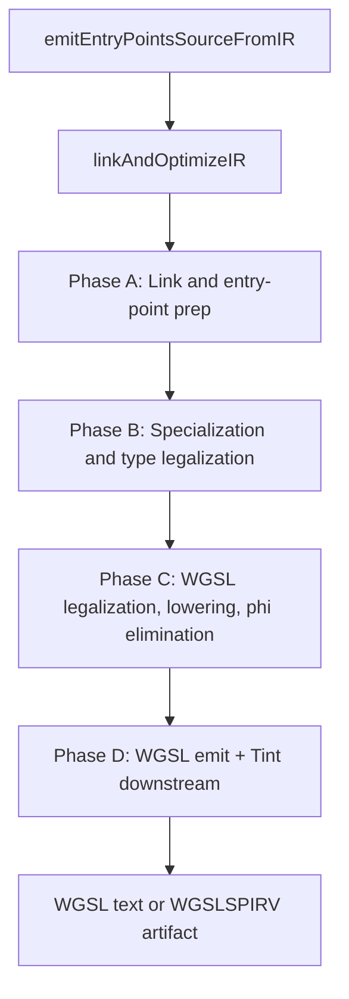
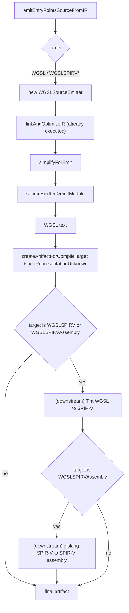

# WGSL Target Pipeline

This page documents the ordered IR-pass and downstream-binary
sequence executed when Slang compiles for the WGSL target family.
It is written for a compiler developer who needs to find where in
the WGSL codegen pipeline a particular pass runs, what condition
selects it, and how `legalizeIRForWGSL` and `WGSLSourceEmitter`
cooperate. The corresponding `CodeGenTarget` values are
`CodeGenTarget::WGSL`, `CodeGenTarget::WGSLSPIRV`, and
`CodeGenTarget::WGSLSPIRVAssembly`. The three targets share the
WGSL **source** pipeline because the back-end's source-target
mapping reduces both to source target `WGSL` in two steps:
`WGSLSPIRVAssembly` first maps to `WGSLSPIRV`
(`source/slang/slang-code-gen.cpp:1089-1090`), and `WGSLSPIRV` then
maps to `WGSL` (`source/slang/slang-code-gen.cpp:278-279`); WGSL is
emitted first, then handed to Tint to translate to SPIR-V for the
`WGSLSPIRV*` arms. Inside `linkAndOptimizeIR` the `target` local is
`codeGenContext->getTargetFormat()` (line 989) and the shared
predicate is `isWGPUTarget(targetRequest)`, but several individual
switch arms list only `CodeGenTarget::WGSL` among the WGSL family
(for example `slang-emit.cpp:1768` and `slang-emit.cpp:2178`); those
arms still fire for the `WGSLSPIRV*` variants because of the
source-target reduction, not because the arm's case label mentions
them.

Compared with sibling target pages, the WGSL pipeline is
distinguished less by having many WGSL-only passes — there are only
four (`legalizeIRForWGSL`, `specializeAddressSpaceForWGSL`, the WGSL
arm of `legalizeBoolSwitchForTargetsRequiringIntSwitch`, and the
`BufferElementTypeLoweringPolicyKind::WGSL` configuration of
`lowerBufferElementTypeToStorageType`) — than by which of the shared
passes it opts into. Most gates below are shared with other targets.

This page complements
[../pipeline/05-ir-passes.md](../pipeline/05-ir-passes.md), which
is an unordered topical catalog of every IR pass. Branches in
`linkAndOptimizeIR` gated on a sibling target (SPIR-V, HLSL,
Metal, CUDA, CPU, GLSL, PyTorch) are filtered out of the diagrams
and tables below.

## Source

- [slang-emit.cpp](../../../../source/slang/slang-emit.cpp) —
  `linkAndOptimizeIR` (line 970) is the orchestrator;
  `CodeGenContext::emitEntryPointsSourceFromIR` (line 2746)
  constructs the `WGSLSourceEmitter` and emits WGSL text.
  `calcRequiredLoweringPassSet` (line 405) computes the
  `RequiredLoweringPassSet` predicate that gates most of the
  pipeline.
- [slang-emit-wgsl.cpp](../../../../source/slang/slang-emit-wgsl.cpp)
  — `WGSLSourceEmitter` implementation.
- [slang-emit-wgsl.h](../../../../source/slang/slang-emit-wgsl.h)
  — the `WGSLSourceEmitter` class declaration, including the
  emitter-policy overrides (`supportsSwitchFallThrough`,
  `shouldEmitSwitchCaseTerminatingBreak`, `emitTempModifiers`).
- [slang-emit-c-like.cpp](../../../../source/slang/slang-emit-c-like.cpp)
  / [slang-emit-c-like.h](../../../../source/slang/slang-emit-c-like.h)
  — shared C-like emitter base class for `simplifyForEmit` and
  `emitModule`, and the declaration site of the virtual policy
  hooks WGSL overrides.
- [slang-ir-wgsl-legalize.cpp](../../../../source/slang/slang-ir-wgsl-legalize.cpp)
  — `legalizeIRForWGSL` (line 243) is the central WGSL
  legalization driver; `specializeAddressSpaceForWGSL` (line 352)
  and its `WGSLAddressSpaceAssigner` (line 271) live in the same
  file.
- [slang-ir-legalize-varying-params.cpp](../../../../source/slang/slang-ir-legalize-varying-params.cpp)
  — `legalizeEntryPointVaryingParamsForWGSL` (line 5165), declared
  in
  [slang-ir-legalize-varying-params.h](../../../../source/slang/slang-ir-legalize-varying-params.h)
  (line 35).
- [slang-ir-legalize-binary-operator.cpp](../../../../source/slang/slang-ir-legalize-binary-operator.cpp)
  — `legalizeLogicalAndOr` runs for WGSL (call site at line 2277 of
  `slang-emit.cpp`).
- [slang-ir-glsl-legalize.cpp](../../../../source/slang/slang-ir-glsl-legalize.cpp)
  — despite the name, `legalizeBoolSwitchForTargetsRequiringIntSwitch`
  (line 5135) is shared by the GLSL/SPIR-V and WGSL arms.
- [slang-target-program.h](../../../../source/slang/slang-target-program.h)
  / [slang-compiler-options.h](../../../../source/slang/slang-compiler-options.h)
  — gate sources.

## High-level phase diagram

```mermaid
flowchart TD
  entry[emitEntryPointsSourceFromIR]
  entry --> linkOpt[linkAndOptimizeIR]
  linkOpt --> phaseA["Phase A: Link and entry-point prep"]
  phaseA --> phaseB["Phase B: Specialization and type legalization"]
  phaseB --> phaseC["Phase C: WGSL legalization, lowering, phi elimination"]
  phaseC --> phaseD["Phase D: WGSL emit + Tint downstream"]
  phaseD --> artifact[WGSL text or WGSLSPIRV artifact]
```

Phase A and Phase B are nearly identical to the corresponding
phases on the SPIR-V page; the divergence is concentrated in
Phase C.

## Phase A: Link and entry-point prep

Spans roughly lines 1005-1344 of
[slang-emit.cpp](../../../../source/slang/slang-emit.cpp) (the
`linkIR` call through `lowerEnumType`). WGSL hits the `default` arm
of every per-target switch in this phase. One WGSL-relevant
difference from SPIR-V: WGSL is non-Khronos, so the
`!isKhronosTarget && reqSet.glslSSBO` gate at line 1057 lets
`lowerGLSLShaderStorageBufferObjectsToStructuredBuffers` fire for
WGSL.

The first `calcRequiredLoweringPassSet` scan happens at line 1049,
immediately after `validateAndRemoveAssumeAddress`, and every
`reqSet.*` gate in this phase reads the result of that scan.

```mermaid
flowchart TD
  linkIRn[linkIR]
  dbgGate{shouldEmitSeparateDebugInfo?}
  emitBuildId["emit IRBuildIdentifier"]
  vaaa[validateAndRemoveAssumeAddress]
  reqSet1["calcRequiredLoweringPassSet"]
  diGate{"reqSet.debugInfo and DebugInfoLevel::None"}
  stripDI[stripDebugInfo]
  ssboGate{"!isKhronosTarget and reqSet.glslSSBO"}
  ssbo[lowerGLSLShaderStorageBufferObjectsToStructuredBuffers]
  tEPInBorrow[translateEntryPointInParamToBorrow]
  rGC[replaceGlobalConstants]
  beGate{reqSet.bindExistential}
  bES[bindExistentialSlots]
  covGate{reqSet.coverageTracing}
  iC[instrumentCoverage]
  cGUP[collectGlobalUniformParameters]
  cEPD[checkEntryPointDecorations]
  aDMD[addDenormalModeDecorations]
  cEPUP[collectEntryPointUniformParams]
  mEPUP[moveEntryPointUniformParamsToGlobalScope]
  rTCEP[removeTorchAndCUDAEntryPoints]
  covGate2{reqSet.coverageTracing}
  fCIM[finalizeCoverageInstrumentationMetadata]
  lvcGate{reqSet.lValueCast}
  lLVC[lowerLValueCast]
  enumGate{reqSet.enumType}
  lET[lowerEnumType]

  linkIRn --> dbgGate
  dbgGate -->|true| emitBuildId --> vaaa
  dbgGate -->|false| vaaa
  vaaa --> reqSet1 --> diGate
  diGate -->|true| stripDI --> ssboGate
  diGate -->|false| ssboGate
  ssboGate -->|true| ssbo --> tEPInBorrow
  ssboGate -->|false| tEPInBorrow
  tEPInBorrow --> rGC --> beGate
  beGate -->|true| bES --> covGate
  beGate -->|false| covGate
  covGate -->|true| iC --> cGUP
  covGate -->|false| cGUP
  cGUP --> cEPD --> aDMD --> cEPUP --> mEPUP --> rTCEP --> covGate2
  covGate2 -->|true| fCIM --> lvcGate
  covGate2 -->|false| lvcGate
  lvcGate -->|true| lLVC --> enumGate
  lvcGate -->|false| enumGate
  enumGate -->|true| lET
```

| # | Pass | File | Gate | Notes |
| --- | --- | --- | --- | --- |
| 1 | `linkIR` | [slang-ir-link.cpp](../../../../source/slang/slang-ir-link.cpp) | (always) | Direct call. |
| 2 | `IRBuilder::emitDebugBuildIdentifier` | [slang-ir.cpp](../../../../source/slang/slang-ir.cpp) | `shouldEmitSeparateDebugInfo()` | Not a pass: an inline `IRBuilder` call at line 1032 of `slang-emit.cpp` that records a hash of the source and compile options as an `IRBuildIdentifier` on the module inst. |
| 3 | `validateAndRemoveAssumeAddress` | [slang-ir-validate.cpp](../../../../source/slang/slang-ir-validate.cpp) | (always for WGSL) | `validate=true` (WGSL is non-CPU/CUDA). |
| 4 | `stripDebugInfo` | [slang-ir-strip-debug-info.cpp](../../../../source/slang/slang-ir-strip-debug-info.cpp) | `reqSet.debugInfo && getDebugInfoLevel() == DebugInfoLevel::None` | |
| 5 | `lowerGLSLShaderStorageBufferObjectsToStructuredBuffers` | [slang-ir-lower-glsl-ssbo-types.cpp](../../../../source/slang/slang-ir-lower-glsl-ssbo-types.cpp) | `!isKhronosTarget && reqSet.glslSSBO` | WGSL is non-Khronos so this fires; SPIR-V skips it. |
| 6 | `translateEntryPointInParamToBorrow` | [slang-ir-transform-params-to-constref.cpp](../../../../source/slang/slang-ir-transform-params-to-constref.cpp) | (always) | |
| 7 | `replaceGlobalConstants` | [slang-ir-link.cpp](../../../../source/slang/slang-ir-link.cpp) | (always) | |
| 8 | `bindExistentialSlots` | [slang-ir-bind-existentials.cpp](../../../../source/slang/slang-ir-bind-existentials.cpp) | `reqSet.bindExistential` | |
| 9 | `instrumentCoverage` | [slang-ir-coverage-instrument.cpp](../../../../source/slang/slang-ir-coverage-instrument.cpp) | `reqSet.coverageTracing` | |
| 10 | `collectGlobalUniformParameters` | [slang-ir-collect-global-uniforms.cpp](../../../../source/slang/slang-ir-collect-global-uniforms.cpp) | (always) | |
| 11 | `checkEntryPointDecorations` | [slang-ir-entry-point-decorations.cpp](../../../../source/slang/slang-ir-entry-point-decorations.cpp) | (always) | |
| 12 | `addDenormalModeDecorations` | [slang-emit.cpp](../../../../source/slang/slang-emit.cpp) | (always) | Static helper at line 756. |
| 13 | `collectEntryPointUniformParams` | [slang-ir-entry-point-uniforms.cpp](../../../../source/slang/slang-ir-entry-point-uniforms.cpp) | (always, WGSL via `default` arm) | |
| 14 | `moveEntryPointUniformParamsToGlobalScope` | [slang-ir-entry-point-uniforms.cpp](../../../../source/slang/slang-ir-entry-point-uniforms.cpp) | (always, WGSL via `default` arm) | |
| 15 | `removeTorchAndCUDAEntryPoints` | [slang-ir-pytorch-cpp-binding.cpp](../../../../source/slang/slang-ir-pytorch-cpp-binding.cpp) | (always, WGSL via `default` arm) | |
| 16 | `finalizeCoverageInstrumentationMetadata` | [slang-ir-coverage-instrument.cpp](../../../../source/slang/slang-ir-coverage-instrument.cpp) | `reqSet.coverageTracing` | Post-packing pass that fills CPU/CUDA uniform-marshaling fields on the coverage `ArtifactPostEmitMetadata`. No-op for WGSL. |
| 17 | `lowerLValueCast` | [slang-ir-lower-l-value-cast.cpp](../../../../source/slang/slang-ir-lower-l-value-cast.cpp) | `reqSet.lValueCast` | Newly gated (line 1337); `kIROp_InOutImplicitCast` / `kIROp_OutImplicitCast` are front-end-only, so the flag cannot be a false negative. |
| 18 | `lowerEnumType` | [slang-ir-lower-enum-type.cpp](../../../../source/slang/slang-ir-lower-enum-type.cpp) | `reqSet.enumType` | |

Filtered out for WGSL in this phase: the CUDA / CUDAHeader arm of
the entry-point-param switch
(`collectOptiXEntryPointUniformParams`); the CPP / Host* arms.

## Phase B: Specialization and type legalization

Spans roughly lines 1357-1986 of `slang-emit.cpp` (the first
`simplifyIR` through `checkStaticAssert`). WGSL is in the `default`
arm for most decision points; it diverges from SPIR-V at
`lowerCooperativeVectors` (which runs for WGSL via the `default` arm
at line 1695), the HLSL-or-SPIR-V byte-address-buffer arms (which
don't apply), and the various HLSL/Metal struct-wrapping passes
(which don't fire).

A second `calcRequiredLoweringPassSet` scan runs at line 1520, after
specialization and the optional/result/conditional-type lowerings.
Flags **accumulate** across the two scans — the set is cleared only
once, at line 1048 — so a flag set by the first scan stays set even
if the construct that set it has since been lowered away. That makes
every `reqSet.*` gate conservatively safe (it can be stale-true,
producing a harmless no-op walk, but not false-negative), which is
the invariant the gating commits rely on.

```mermaid
flowchart TD
  s1[simplifyIR default]
  vuGate{ValidateUniformity}
  vu[validateUniformity]
  sML[specializeMatrixLayout]
  fscGate{not shouldPerformMinimumOptimizations}
  fSC[fuseCallsToSaturatedCooperation]
  adGate{reqSet.autodiff}
  cAP[checkAutodiffPatterns]
  dCC[diagnoseCircularConformances]
  sdGate{not isSpecializationDisabled}
  sM[specializeModule]
  hofGate{reqSet.higherOrderFunc}
  sHOP[specializeHigherOrderParameters]
  adGate2{reqSet.autodiff}
  fADP[finalizeAutoDiffPass]
  sADD[stripAutoDiffDecorations]
  mssGate{reqSet.matrixSwizzleStore}
  lMSS[lowerMatrixSwizzleStores]
  dce1[eliminateDeadCode]
  fS[finalizeSpecialization]
  adGate3{reqSet.autodiff}
  lDTI["lowerDiffTypeInfoInsts (direct call)"]
  ctGate{reqSet.conditionalType}
  lCT[lowerConditionalType]
  otGate1{reqSet.optionalType}
  lRO[lowerReinterpretOptional]
  nevGate{shouldRunNonEssentialValidation}
  cONU[checkForOptionalNoneUsage]
  otGate2{reqSet.optionalType}
  lOT[lowerOptionalType]
  rtGate{reqSet.resultType}
  lRT[lowerResultType]
  reqSet2[calcRequiredLoweringPassSet]
  dUR[detectUninitializedResources]
  raidGate{removeAvailableInDownstreamIR}
  rAIDD[removeAvailableInDownstreamModuleDecorations]
  nevGate2{shouldRunNonEssentialValidation}
  cRT[checkForRecursiveTypes]
  cRF[checkForRecursiveFunctions]
  cOBA[checkForOutOfBoundAccess]
  mrGate{reqSet.missingReturn}
  cMR[checkForMissingReturns]
  cISPT[checkForInvalidShaderParameterType]
  iAVS[inferAnyValueSizeWhereNecessary]
  uPWT[unpinWitnessTables]
  svmGate{reqSet.sumVectorMatrix}
  lSVMI[lowerSumVectorMatrixInsts]
  minOptGate{not minimalOptimization}
  s2a[simplifyIR fast]
  genGate{reqSet.generics}
  dce2[eliminateDeadCode]
  tuGate{reqSet.taggedUnion}
  lTUT[lowerTaggedUnionTypes]
  lUUT[lowerUntaggedUnionTypes]
  reinterpretGate{reqSet.reinterpret}
  lR[lowerReinterpret]
  lSIDC[lowerSequentialIDTagCasts]
  lTI[lowerTagInsts]
  lTT[lowerTagTypes]
  dce3[eliminateDeadCode]
  lE[lowerExistentials]
  rWUI[removeWeakUseInsts]
  cTD["clearTranslationDictionary (direct call)"]
  pTIN[performTypeInlining]
  nevGate3{shouldRunNonEssentialValidation}
  cGSHI[checkGetStringHashInsts]
  dce4["eliminateDeadCode (direct call)"]
  lTu[lowerTuples]
  gAVMF[generateAnyValueMarshallingFunctions]
  ssGate{reqSet.specializeStageSwitch}
  sSS[specializeStageSwitch]
  lCV[lowerCooperativeVectors]
  pFI1[performForceInlining]
  minOpt2{minimalOptimization}
  aSCCP[applySparseConditionalConstantPropagation]
  dce5[eliminateDeadCode]
  s2b[simplifyIR default]
  cpiGate{shouldReportCheckpointIntermediates}
  rCI["reportCheckpointIntermediates (direct call)"]
  acsbGate{reqSet.appendConsumeStructuredBuffer}
  lACSB[lowerAppendConsumeStructuredBuffers]
  ctsGate{reqSet.combinedTextureSamplers}
  lCTS[lowerCombinedTextureSamplers]
  vrGate{VulkanEmitReflection}
  aUTHD[addUserTypeHintDecorations]
  lEA[legalizeEmptyArray]
  lVT[legalizeVectorTypes]
  iGC[inlineGlobalConstantsForLegalization]
  etlGate{reqSet.existentialTypeLayout}
  lETL[legalizeExistentialTypeLayout]
  vSBRT[validateStructuredBufferResourceTypes]
  lRTR[legalizeResourceTypes]
  lMT[legalizeMatrixTypes]
  minOpt3{minimalOptimization}
  dce6[eliminateDeadCode]
  s2c[simplifyIR fast]
  urhGate{reqSet.untypedResourceHandle}
  lURH[lowerUntypedResourceHandleToUInt]
  drhGate{reqSet.dynamicResourceHeap}
  lDRH[lowerDynamicResourceHeap]
  sRU[specializeResourceUsage]
  sFBLA1[specializeFuncsForBufferLoadArgs]
  dBL[deferBufferLoad]
  sAP[specializeArrayParameters]
  cSA["checkStaticAssert (direct call)"]

  s1 --> vuGate
  vuGate -->|true| vu --> sML
  vuGate -->|false| sML
  sML --> fscGate
  fscGate -->|true| fSC --> adGate
  fscGate -->|false| adGate
  adGate -->|true| cAP --> dCC
  adGate -->|false| dCC
  dCC --> sdGate
  sdGate -->|true| sM --> hofGate
  sdGate -->|false| hofGate
  hofGate -->|true| sHOP --> adGate2
  hofGate -->|false| adGate2
  adGate2 -->|true| fADP --> mssGate
  adGate2 -->|false| sADD --> mssGate
  mssGate -->|true| lMSS --> dce1
  mssGate -->|false| dce1
  dce1 --> fS --> adGate3
  adGate3 -->|true| lDTI --> ctGate
  adGate3 -->|false| ctGate
  ctGate -->|true| lCT --> otGate1
  ctGate -->|false| otGate1
  otGate1 -->|true| lRO --> nevGate
  otGate1 -->|false| nevGate
  nevGate -->|true| cONU --> otGate2
  nevGate -->|false| otGate2
  otGate2 -->|true| lOT --> rtGate
  otGate2 -->|false| rtGate
  rtGate -->|true| lRT --> reqSet2
  rtGate -->|false| reqSet2
  reqSet2 --> dUR --> raidGate
  raidGate -->|true| rAIDD --> nevGate2
  raidGate -->|false| nevGate2
  nevGate2 -->|true| cRT --> cRF --> cOBA --> mrGate
  nevGate2 -->|false| iAVS
  mrGate -->|true| cMR --> cISPT
  mrGate -->|false| cISPT
  cISPT --> iAVS
  iAVS --> uPWT --> svmGate
  svmGate -->|true| lSVMI --> minOptGate
  svmGate -->|false| minOptGate
  minOptGate -->|true| s2a --> tuGate
  minOptGate -->|false| genGate
  genGate -->|true| dce2 --> tuGate
  genGate -->|false| tuGate
  tuGate -->|true| lTUT --> lUUT
  tuGate -->|false| lUUT
  lUUT --> reinterpretGate
  reinterpretGate -->|true| lR --> lSIDC
  reinterpretGate -->|false| lSIDC
  lSIDC --> lTI --> lTT --> dce3 --> lE --> rWUI --> cTD --> pTIN --> nevGate3
  nevGate3 -->|true| cGSHI --> dce4
  nevGate3 -->|false| dce4
  dce4 --> lTu --> gAVMF --> ssGate
  ssGate -->|true| sSS --> lCV
  ssGate -->|false| lCV
  lCV --> pFI1 --> minOpt2
  minOpt2 -->|true| aSCCP --> dce5 --> cpiGate
  minOpt2 -->|false| s2b --> cpiGate
  cpiGate -->|true| rCI --> acsbGate
  cpiGate -->|false| acsbGate
  acsbGate -->|true| lACSB --> ctsGate
  acsbGate -->|false| ctsGate
  ctsGate -->|true| lCTS --> vrGate
  ctsGate -->|false| vrGate
  vrGate -->|true| aUTHD --> lEA
  vrGate -->|false| lEA
  lEA --> lVT --> iGC --> etlGate
  etlGate -->|true| lETL --> vSBRT
  etlGate -->|false| vSBRT
  vSBRT --> lRTR --> lMT --> minOpt3
  minOpt3 -->|true| dce6 --> urhGate
  minOpt3 -->|false| s2c --> urhGate
  urhGate -->|true| lURH --> drhGate
  urhGate -->|false| drhGate
  drhGate -->|true| lDRH --> sRU
  drhGate -->|false| sRU
  sRU --> sFBLA1 --> dBL --> sAP --> cSA
```

| # | Pass | File | Gate | Notes |
| --- | --- | --- | --- | --- |
| 1 | `simplifyIR` | [slang-ir-ssa-simplification.cpp](../../../../source/slang/slang-ir-ssa-simplification.cpp) | (always) | `defaultIRSimplificationOptions`. |
| 2 | `validateUniformity` | [slang-ir-uniformity.cpp](../../../../source/slang/slang-ir-uniformity.cpp) | `getBoolOption(ValidateUniformity)` | |
| 3 | `specializeMatrixLayout` | [slang-ir-specialize-matrix-layout.cpp](../../../../source/slang/slang-ir-specialize-matrix-layout.cpp) | (always) | |
| 4 | `fuseCallsToSaturatedCooperation` | [slang-ir-fuse-satcoop.cpp](../../../../source/slang/slang-ir-fuse-satcoop.cpp) | `!shouldPerformMinimumOptimizations` | |
| 5 | `checkAutodiffPatterns` | [slang-ir-check-differentiability.cpp](../../../../source/slang/slang-ir-check-differentiability.cpp) | `reqSet.autodiff` | |
| 6 | `diagnoseCircularConformances` | [slang-ir-any-value-inference.cpp](../../../../source/slang/slang-ir-any-value-inference.cpp) | (always) | |
| 7 | `specializeModule` | [slang-ir-specialize.cpp](../../../../source/slang/slang-ir-specialize.cpp) | `!isSpecializationDisabled()` | `specOptions.lowerWitnessLookups = true`. |
| 8 | `specializeHigherOrderParameters` | [slang-ir-defunctionalization.cpp](../../../../source/slang/slang-ir-defunctionalization.cpp) | `reqSet.higherOrderFunc` | |
| 9 | `finalizeAutoDiffPass` | [slang-ir-autodiff.cpp](../../../../source/slang/slang-ir-autodiff.cpp) | `reqSet.autodiff` | Newly gated (line 1446). Typical WGSL shaders use no autodiff, so this is normally **skipped**. |
| 10 | `stripAutoDiffDecorations` | [slang-ir-autodiff.cpp](../../../../source/slang/slang-ir-autodiff.cpp) | `!reqSet.autodiff` (else arm at line 1452) | Runs on the skip path so the `Export` / `KeepAlive` pins on core-module `[__AutoDiffBuiltin]` types are removed and the following `eliminateDeadCode` can drop them. |
| 11 | `lowerMatrixSwizzleStores` | [slang-ir-lower-matrix-swizzle-store.cpp](../../../../source/slang/slang-ir-lower-matrix-swizzle-store.cpp) | `reqSet.matrixSwizzleStore` | |
| 12 | `eliminateDeadCode` | [slang-ir-dce.cpp](../../../../source/slang/slang-ir-dce.cpp) | (always) | |
| 13 | `finalizeSpecialization` | [slang-ir-specialize.cpp](../../../../source/slang/slang-ir-specialize.cpp) | (always) | |
| 14 | `lowerDiffTypeInfoInsts` | [slang-emit.cpp](../../../../source/slang/slang-emit.cpp) | `reqSet.autodiff` | Direct call (not `SLANG_PASS`); newly gated at line 1465. Defined as a file-local helper at line 852 of `slang-emit.cpp`, not in `slang-ir-autodiff.cpp`. |
| 15 | `lowerConditionalType` | [slang-ir-lower-conditional-type.cpp](../../../../source/slang/slang-ir-lower-conditional-type.cpp) | `reqSet.conditionalType` | |
| 16 | `lowerReinterpretOptional` | [slang-ir-lower-reinterpret.cpp](../../../../source/slang/slang-ir-lower-reinterpret.cpp) | `reqSet.optionalType` | |
| 17 | `checkForOptionalNoneUsage` | [slang-ir-check-optional-none-usage.cpp](../../../../source/slang/slang-ir-check-optional-none-usage.cpp) | `shouldRunNonEssentialValidation()` | |
| 18 | `lowerOptionalType` | [slang-ir-lower-optional-type.cpp](../../../../source/slang/slang-ir-lower-optional-type.cpp) | `reqSet.optionalType` | |
| 19 | `lowerResultType` | [slang-ir-lower-result-type.cpp](../../../../source/slang/slang-ir-lower-result-type.cpp) | `reqSet.resultType` | Now runs **after** `lowerOptionalType`: depends on accurate `getAnyValueSize()` results. |
| 20 | `detectUninitializedResources` | [slang-ir-detect-uninitialized-resources.cpp](../../../../source/slang/slang-ir-detect-uninitialized-resources.cpp) | (always) | |
| 21 | `removeAvailableInDownstreamModuleDecorations` | [slang-ir-redundancy-removal.cpp](../../../../source/slang/slang-ir-redundancy-removal.cpp) | `codeGenContext->removeAvailableInDownstreamIR` | |
| 22 | `checkForRecursiveTypes` | [slang-ir-check-recursion.cpp](../../../../source/slang/slang-ir-check-recursion.cpp) | `shouldRunNonEssentialValidation()` | |
| 23 | `checkForRecursiveFunctions` | [slang-ir-check-recursion.cpp](../../../../source/slang/slang-ir-check-recursion.cpp) | `shouldRunNonEssentialValidation()` | |
| 24 | `checkForOutOfBoundAccess` | [slang-check-out-of-bound-access.cpp](../../../../source/slang/slang-check-out-of-bound-access.cpp) | `shouldRunNonEssentialValidation()` | |
| 25 | `checkForMissingReturns` | [slang-ir-missing-return.cpp](../../../../source/slang/slang-ir-missing-return.cpp) | `reqSet.missingReturn` (under non-essential validation) | |
| 26 | `checkForInvalidShaderParameterType` | [slang-ir-check-shader-parameter-type.cpp](../../../../source/slang/slang-ir-check-shader-parameter-type.cpp) | `shouldRunNonEssentialValidation()` | |
| 27 | `inferAnyValueSizeWhereNecessary` | [slang-ir-any-value-inference.cpp](../../../../source/slang/slang-ir-any-value-inference.cpp) | (always) | |
| 28 | `unpinWitnessTables` | [slang-ir-strip-legalization-insts.cpp](../../../../source/slang/slang-ir-strip-legalization-insts.cpp) | (always) | |
| 29 | `lowerSumVectorMatrixInsts` | [slang-emit.cpp](../../../../source/slang/slang-emit.cpp) | `reqSet.sumVectorMatrix` | Newly gated (line 1586). Helper at line 879. `kIROp_SumVectorElements` / `kIROp_SumMatrixElements` come only from the autodiff transpose pass, so this is normally skipped for WGSL. |
| 30 | `simplifyIR` | [slang-ir-ssa-simplification.cpp](../../../../source/slang/slang-ir-ssa-simplification.cpp) | `!minimalOptimization` | `fastIRSimplificationOptions`. |
| 31 | `eliminateDeadCode` | [slang-ir-dce.cpp](../../../../source/slang/slang-ir-dce.cpp) | `minimalOptimization && reqSet.generics` | Alternative to row 29. |
| 32 | `lowerTaggedUnionTypes` | [slang-ir-lower-dynamic-dispatch-insts.cpp](../../../../source/slang/slang-ir-lower-dynamic-dispatch-insts.cpp) | `reqSet.taggedUnion` | Newly gated (line 1606). Sets `reqSet.reinterpret = true` on success, so gating it also gates row 34 transitively; the tagged-union opcodes are produced only by typeflow specialization, before the line-1520 scan. |
| 33 | `lowerUntaggedUnionTypes` | [slang-ir-lower-dynamic-dispatch-insts.cpp](../../../../source/slang/slang-ir-lower-dynamic-dispatch-insts.cpp) | (always) | |
| 34 | `lowerReinterpret` | [slang-ir-lower-reinterpret.cpp](../../../../source/slang/slang-ir-lower-reinterpret.cpp) | `reqSet.reinterpret` | |
| 35 | `lowerSequentialIDTagCasts` | [slang-ir-lower-dynamic-dispatch-insts.cpp](../../../../source/slang/slang-ir-lower-dynamic-dispatch-insts.cpp) | (always) | |
| 36 | `lowerTagInsts` | [slang-ir-lower-dynamic-dispatch-insts.cpp](../../../../source/slang/slang-ir-lower-dynamic-dispatch-insts.cpp) | (always) | |
| 37 | `lowerTagTypes` | [slang-ir-lower-dynamic-dispatch-insts.cpp](../../../../source/slang/slang-ir-lower-dynamic-dispatch-insts.cpp) | (always) | |
| 38 | `eliminateDeadCode` | [slang-ir-dce.cpp](../../../../source/slang/slang-ir-dce.cpp) | (always) | |
| 39 | `lowerExistentials` | [slang-ir-lower-dynamic-dispatch-insts.cpp](../../../../source/slang/slang-ir-lower-dynamic-dispatch-insts.cpp) | (always) | |
| 40 | `removeWeakUseInsts` | [slang-ir-redundancy-removal.cpp](../../../../source/slang/slang-ir-redundancy-removal.cpp) | (always) | |
| 41 | `clearTranslationDictionary` | [slang-ir-translate.cpp](../../../../source/slang/slang-ir-translate.cpp) | (always) | Direct call at line 1628, not a `SLANG_PASS`; drops the translation dictionary left on the module inst. |
| 42 | `performTypeInlining` | [slang-ir-inline.cpp](../../../../source/slang/slang-ir-inline.cpp) | `!isCpuLikeTarget(artifactDesc)` (true for WGSL) | |
| 43 | `checkGetStringHashInsts` | [slang-ir-string-hash.cpp](../../../../source/slang/slang-ir-string-hash.cpp) | `!isCpuLikeTarget && shouldRunNonEssentialValidation()` | |
| 44 | `eliminateDeadCode` | [slang-ir-dce.cpp](../../../../source/slang/slang-ir-dce.cpp) | (always) | Direct call at line 1654, not a `SLANG_PASS`; uses `fastIRSimplificationOptions.deadCodeElimOptions`. |
| 45 | `lowerTuples` | [slang-ir-lower-tuple-types.cpp](../../../../source/slang/slang-ir-lower-tuple-types.cpp) | (always) | |
| 46 | `generateAnyValueMarshallingFunctions` | [slang-ir-any-value-marshalling.cpp](../../../../source/slang/slang-ir-any-value-marshalling.cpp) | (always) | |
| 47 | `specializeStageSwitch` | [slang-ir-specialize-stage-switch.cpp](../../../../source/slang/slang-ir-specialize-stage-switch.cpp) | `reqSet.specializeStageSwitch` | |
| 48 | `lowerCooperativeVectors` | [slang-ir-lower-coopvec.cpp](../../../../source/slang/slang-ir-lower-coopvec.cpp) | (always, WGSL via `default` arm at line 1695) | |
| 49 | `performForceInlining` | [slang-ir-inline.cpp](../../../../source/slang/slang-ir-inline.cpp) | (always) | |
| 50 | `applySparseConditionalConstantPropagation` | [slang-ir-sccp.cpp](../../../../source/slang/slang-ir-sccp.cpp) | `minimalOptimization` | Plus `eliminateDeadCode`. |
| 51 | `eliminateDeadCode` | [slang-ir-dce.cpp](../../../../source/slang/slang-ir-dce.cpp) | `minimalOptimization` | |
| 52 | `simplifyIR` | [slang-ir-ssa-simplification.cpp](../../../../source/slang/slang-ir-ssa-simplification.cpp) | `!minimalOptimization` | `defaultIRSimplificationOptions`. |
| 53 | `reportCheckpointIntermediates` | [slang-emit.cpp](../../../../source/slang/slang-emit.cpp) | `codeGenContext->shouldReportCheckpointIntermediates()` (line 1725) | Direct call at line 1727 to the static helper defined at line 226; diagnostic only, it reports autodiff checkpointing information and does not transform the IR. |
| 54 | `lowerAppendConsumeStructuredBuffers` | [slang-ir-lower-append-consume-structured-buffer.cpp](../../../../source/slang/slang-ir-lower-append-consume-structured-buffer.cpp) | `target != HLSL && reqSet.appendConsumeStructuredBuffer` (line 1753) | The `reqSet` conjunct is new; the `target != HLSL` half is unchanged and true for WGSL. |
| 55 | `lowerCombinedTextureSamplers` | [slang-ir-lower-combined-texture-sampler.cpp](../../../../source/slang/slang-ir-lower-combined-texture-sampler.cpp) | `reqSet.combinedTextureSamplers` (WGSL is in the HLSL / Metal / WGSL arm at line 1768) | |
| 56 | `addUserTypeHintDecorations` | [slang-ir-user-type-hint.cpp](../../../../source/slang/slang-ir-user-type-hint.cpp) | `getBoolOption(VulkanEmitReflection)` | Rare for WGSL. |
| 57 | `legalizeEmptyArray` | [slang-ir-legalize-empty-array.cpp](../../../../source/slang/slang-ir-legalize-empty-array.cpp) | (always) | |
| 58 | `legalizeVectorTypes` | [slang-ir-legalize-vector-types.cpp](../../../../source/slang/slang-ir-legalize-vector-types.cpp) | (always) | |
| 59 | `inlineGlobalConstantsForLegalization` | [slang-ir-legalize-global-values.cpp](../../../../source/slang/slang-ir-legalize-global-values.cpp) | `shouldLegalizeExistentialAndResourceTypes` (default `true` for WGSL) | |
| 60 | `legalizeExistentialTypeLayout` | [slang-ir-legalize-types.cpp](../../../../source/slang/slang-ir-legalize-types.cpp) | `reqSet.existentialTypeLayout` | |
| 61 | `validateStructuredBufferResourceTypes` | [slang-ir-validate.cpp](../../../../source/slang/slang-ir-validate.cpp) | (always) | Direct call. |
| 62 | `legalizeResourceTypes` | [slang-ir-legalize-types.cpp](../../../../source/slang/slang-ir-legalize-types.cpp) | `shouldLegalizeExistentialAndResourceTypes` | |
| 63 | `legalizeMatrixTypes` | [slang-ir-legalize-matrix-types.cpp](../../../../source/slang/slang-ir-legalize-matrix-types.cpp) | (always) | |
| 64 | `eliminateDeadCode` | [slang-ir-dce.cpp](../../../../source/slang/slang-ir-dce.cpp) | `minimalOptimization` | |
| 65 | `simplifyIR` | [slang-ir-ssa-simplification.cpp](../../../../source/slang/slang-ir-ssa-simplification.cpp) | `!minimalOptimization` | `fastIRSimplificationOptions`. |
| 66 | `lowerUntypedResourceHandleToUInt` | [slang-ir-lower-dynamic-resource-heap.cpp](../../../../source/slang/slang-ir-lower-dynamic-resource-heap.cpp) | `reqSet.untypedResourceHandle` (line 1949) | Defined at line 96 of the same file as row 67. New since the previous revision of this page — there was no call site at the old `source_commit`. |
| 67 | `lowerDynamicResourceHeap` | [slang-ir-lower-dynamic-resource-heap.cpp](../../../../source/slang/slang-ir-lower-dynamic-resource-heap.cpp) | `reqSet.dynamicResourceHeap` (line 1952) | |
| 68 | `specializeResourceUsage` | [slang-ir-specialize-resources.cpp](../../../../source/slang/slang-ir-specialize-resources.cpp) | (always) | |
| 69 | `specializeFuncsForBufferLoadArgs` | [slang-ir-specialize-buffer-load-arg.cpp](../../../../source/slang/slang-ir-specialize-buffer-load-arg.cpp) | (always, first invocation) | |
| 70 | `deferBufferLoad` | [slang-ir-defer-buffer-load.cpp](../../../../source/slang/slang-ir-defer-buffer-load.cpp) | (always) | |
| 71 | `specializeArrayParameters` | [slang-ir-specialize-arrays.cpp](../../../../source/slang/slang-ir-specialize-arrays.cpp) | (always) | |
| 72 | `checkStaticAssert` | [slang-emit.cpp](../../../../source/slang/slang-emit.cpp) | (always) | Direct call at line 1986 (helper at line 655); runs after specialization so static-assert info is available. |

Filtered out for WGSL in this phase: the
`CUDASource / CUDAHeader / PyTorchCppBinding` derivative-wrapper
arm; the CUDA/PyTorch passes
(`generateHostFunctionsForAutoBindCuda`, `generatePyTorchCppBinding`,
`handleAutoBindNames`, `lowerBuiltinTypesForKernelEntryPoints`,
`removeTorchKernels`); the `legalizeNonVectorCompositeSelect`
HLSL-only arm; the CPP/Host CPP / `lowerComInterfaces` /
`generateDllImportFuncs` / `generateDllExportFuncs` arms; the
HostVM early return; the CUDA `lowerCooperativeVectors`
conditional arm; both non-WGSL `legalizeEmptyTypes` call sites in
this region — the Metal-only arm at line 1901 and the CPU/CUDA
`else` arm at line 1911 (WGSL takes the
`shouldLegalizeExistentialAndResourceTypes` branch, and its own
`legalizeEmptyTypes` run is Phase C row 26); the
`isMetalTarget` `lowerBufferElementTypeToStorageType` Metal
parameter-block arm; the `isCPUTargetViaLLVM` LLVM arm; the HLSL
`wrapStructuredBuffersOfMatrices` arm; the Metal
`wrapCBufferElementsForMetal` arm; the SPIR-V / HLSL / D3D
`legalizeEmptyRayPayloadsForHLSL` arm; the HLSL
`legalizeNonStructParameterToStructForHLSL` arm.

## Phase C: WGSL legalization, lowering, phi elimination

Spans roughly lines 2017-2739 of `slang-emit.cpp` (the
byte-address-buffer switch through `checkUnsupportedInst`, the last
statement of `linkAndOptimizeIR`). WGSL's central legalizer is
`legalizeIRForWGSL` (call site at line 2262, defined at line 243 of
[slang-ir-wgsl-legalize.cpp](../../../../source/slang/slang-ir-wgsl-legalize.cpp)),
which is treated as a single node in the diagram below. The
per-target `switch` that selects it (line 2202) now runs
`legalizeBoolSwitchForTargetsRequiringIntSwitch` first, in the same
WGSL arm.

```mermaid
flowchart TD
  babbGate{reqSet.byteAddressBuffer}
  lBABOps["legalizeByteAddressBufferOps<br/>(WGSL options)"]
  vAO[validateAtomicOperations]
  rTF[resolveTextureFormat]
  gvvGate{reqSet.globalVaryingVar}
  tGVV[translateGlobalVaryingVar]
  rvirGate{reqSet.resolveVaryingInputRef}
  rvir[resolveVaryingInputRef]
  fEPC[fixEntryPointCallsites]
  lBSW[legalizeBoolSwitchForTargetsRequiringIntSwitch]
  lIRWGSL[legalizeIRForWGSL]
  fNRI[floatNonUniformResourceIndex]
  lLAO[legalizeLogicalAndOr]
  mGVI[moveGlobalVarInitializationToEntryPoints]
  sLOI[stripLegalizationOnlyInstructions]
  vVAM[validateVectorsAndMatrices]
  dce7[eliminateDeadCode]
  lrcGate{reqSet.lateRequireCapability}
  pLRC[processLateRequireCapabilityInsts]
  cUV[cleanUpVoidType]
  bqGate{reqSet.bindingQuery}
  lBQ[lowerBindingQueries]
  meshGate{reqSet.meshOutput}
  lMO[legalizeMeshOutputTypes]
  bcGate{reqSet.bitcast}
  lBC[lowerBitCast]
  lART[legalizeArrayReturnType]
  lBETST["lowerBufferElementTypeToStorageType<br/>(loweringPolicyKind=WGSL)"]
  sAS[specializeAddressSpaceForWGSL]
  pFI2[performForceInlining]
  eMB[eliminateMultiLevelBreak]
  minOpt4{not minimalOptimization}
  s2d[simplifyIR with removeTrivialSingleIterationLoops]
  lET2[legalizeEmptyTypes]
  livGate{shouldTrackLiveness}
  lvAvrs["LivenessUtil::addVariableRangeStarts"]
  ePhi["eliminatePhis (default options)"]
  livGate2{shouldTrackLiveness}
  lvAre["LivenessUtil::addRangeEnds"]
  sNSIR[simplifyNonSSAIR]
  aVSC[applyVariableScopeCorrection]
  coopGate{cooperative_matrix or cooperative_vector capability}
  cCM[collectCooperativeMetadata]
  ediGate{EmbedDownstreamIR}
  uNEI[unexportNonEmbeddableIR]
  dhGate{"descriptor_handle implied and target != PyTorchCppBinding"}
  gocl[getOrCreateLayout]
  cM["collectMetadata(targetProgram)"]
  minOpt5{not shouldPerformMinimumOptimizations}
  cUI[checkUnsupportedInst]

  babbGate -->|true| lBABOps --> vAO
  babbGate -->|false| vAO
  vAO --> rTF --> gvvGate
  gvvGate -->|true| tGVV --> rvirGate
  gvvGate -->|false| rvirGate
  rvirGate -->|true| rvir --> fEPC
  rvirGate -->|false| fEPC
  fEPC --> lBSW --> lIRWGSL --> fNRI --> lLAO --> mGVI --> sLOI --> vVAM --> dce7 --> lrcGate
  lrcGate -->|true| pLRC --> cUV
  lrcGate -->|false| cUV
  cUV --> bqGate
  bqGate -->|true| lBQ --> meshGate
  bqGate -->|false| meshGate
  meshGate -->|true| lMO --> bcGate
  meshGate -->|false| bcGate
  bcGate -->|true| lBC --> lART
  bcGate -->|false| lART
  lART --> lBETST --> sAS --> pFI2 --> eMB --> minOpt4
  minOpt4 -->|true| s2d --> lET2
  minOpt4 -->|false| lET2
  lET2 --> livGate
  livGate -->|true| lvAvrs --> ePhi
  livGate -->|false| ePhi
  ePhi --> livGate2
  livGate2 -->|true| lvAre --> sNSIR
  livGate2 -->|false| sNSIR
  sNSIR --> aVSC --> coopGate
  coopGate -->|true| cCM --> ediGate
  coopGate -->|false| ediGate
  ediGate -->|true| uNEI --> dhGate
  ediGate -->|false| dhGate
  dhGate -->|true| gocl --> cM
  dhGate -->|false| cM
  cM --> minOpt5
  minOpt5 -->|true| cUI
```

| # | Pass | File | Gate | Notes |
| --- | --- | --- | --- | --- |
| 1 | `legalizeByteAddressBufferOps` | [slang-ir-byte-address-legalize.cpp](../../../../source/slang/slang-ir-byte-address-legalize.cpp) | `reqSet.byteAddressBuffer` | WGSL options: `scalarizeVectorLoadStore=true`, `treatGetEquivalentStructuredBufferAsGetThis=true`, `translateToStructuredBufferOps=false`, `lowerBasicTypeOps=true`, `useBitCastFromUInt=true`. |
| 2 | `validateAtomicOperations` | [slang-ir-validate.cpp](../../../../source/slang/slang-ir-validate.cpp) | `target != SPIRV && target != SPIRVAssembly` (true for WGSL, line 2151) | `skipFuncParamValidation = true`. |
| 3 | `resolveTextureFormat` | [slang-ir-resolve-texture-format.cpp](../../../../source/slang/slang-ir-resolve-texture-format.cpp) | (`GLSL` / `SPIRV` / `WGSL` arm, line 2178) | |
| 4 | `translateGlobalVaryingVar` | [slang-ir-translate-global-varying-var.cpp](../../../../source/slang/slang-ir-translate-global-varying-var.cpp) | `reqSet.globalVaryingVar` | Runs after specialization (line 2187), not in Phase A. |
| 5 | `resolveVaryingInputRef` | [slang-ir-resolve-varying-input-ref.cpp](../../../../source/slang/slang-ir-resolve-varying-input-ref.cpp) | `reqSet.resolveVaryingInputRef` | |
| 6 | `fixEntryPointCallsites` | [slang-ir-fix-entrypoint-callsite.cpp](../../../../source/slang/slang-ir-fix-entrypoint-callsite.cpp) | (always) | |
| 7 | `legalizeBoolSwitchForTargetsRequiringIntSwitch` | [slang-ir-glsl-legalize.cpp](../../../../source/slang/slang-ir-glsl-legalize.cpp) | (`WGSL` / `WGSLSPIRV` / `WGSLSPIRVAssembly` arm, line 2261) | New for WGSL; rewrites a `switch` whose selector is `bool` into an integer switch. |
| 8 | `legalizeIRForWGSL` | [slang-ir-wgsl-legalize.cpp](../../../../source/slang/slang-ir-wgsl-legalize.cpp) | (`WGSL` / `WGSLSPIRV` / `WGSLSPIRVAssembly` arm, line 2262) | The central WGSL legalizer; runs `legalizeEntryPointVaryingParamsForWGSL` and struct/varying fix-ups. |
| 9 | `floatNonUniformResourceIndex` | [slang-ir-float-non-uniform-resource-index.cpp](../../../../source/slang/slang-ir-float-non-uniform-resource-index.cpp) | `!isSPIRV(target)` (true for WGSL, line 2270) | `NonUniformResourceIndexFloatMode::Textual`. |
| 10 | `legalizeLogicalAndOr` | [slang-ir-legalize-binary-operator.cpp](../../../../source/slang/slang-ir-legalize-binary-operator.cpp) | `isD3DTarget \|\| isKhronosTarget \|\| isWGPUTarget \|\| isMetalTarget` (true for WGSL, lines 2275-2277) | |
| 11 | `moveGlobalVarInitializationToEntryPoints` | [slang-ir-explicit-global-init.cpp](../../../../source/slang/slang-ir-explicit-global-init.cpp) | (`HLSL` / `GLSL` / `WGSL` arm, line 2321) | |
| 12 | `stripLegalizationOnlyInstructions` | [slang-ir-strip-legalization-insts.cpp](../../../../source/slang/slang-ir-strip-legalization-insts.cpp) | (always) | |
| 13 | `validateVectorsAndMatrices` | [slang-ir-validate.cpp](../../../../source/slang/slang-ir-validate.cpp) | (always) | |
| 14 | `eliminateDeadCode` | [slang-ir-dce.cpp](../../../../source/slang/slang-ir-dce.cpp) | (always) | |
| 15 | `processLateRequireCapabilityInsts` | [slang-ir-late-require-capability.cpp](../../../../source/slang/slang-ir-late-require-capability.cpp) | `reqSet.lateRequireCapability` | Newly gated (line 2415); `kIROp_LateRequireCapability` is lowered at AST→IR time, so any instance was seen by the line-1520 scan. |
| 16 | `cleanUpVoidType` | [slang-ir-cleanup-void.cpp](../../../../source/slang/slang-ir-cleanup-void.cpp) | (always) | |
| 17 | `lowerBindingQueries` | [slang-ir-lower-binding-query.cpp](../../../../source/slang/slang-ir-lower-binding-query.cpp) | `reqSet.bindingQuery` | |
| 18 | `legalizeMeshOutputTypes` | [slang-ir-legalize-mesh-outputs.cpp](../../../../source/slang/slang-ir-legalize-mesh-outputs.cpp) | `reqSet.meshOutput` | |
| 19 | `lowerBitCast` | [slang-ir-lower-bit-cast.cpp](../../../../source/slang/slang-ir-lower-bit-cast.cpp) | `reqSet.bitcast` | |
| 20 | `legalizeArrayReturnType` | [slang-ir-legalize-array-return-type.cpp](../../../../source/slang/slang-ir-legalize-array-return-type.cpp) | `!isMetalTarget && !isSPIRV` (true for WGSL) | |
| 21 | `lowerBufferElementTypeToStorageType` | [slang-ir-lower-buffer-element-type.cpp](../../../../source/slang/slang-ir-lower-buffer-element-type.cpp) | (always; line 2476) | `loweringPolicyKind = BufferElementTypeLoweringPolicyKind::WGSL`, selected at lines 2464-2466. |
| 22 | `specializeAddressSpaceForWGSL` | [slang-ir-wgsl-legalize.cpp](../../../../source/slang/slang-ir-wgsl-legalize.cpp) | `isWGPUTarget` (line 2493) | Defined at line 352 of the WGSL legalizer, **not** in `slang-ir-specialize-address-space.cpp`; it constructs a `WGSLAddressSpaceAssigner` and delegates to the shared `specializeAddressSpace`. |
| 23 | `performForceInlining` | [slang-ir-inline.cpp](../../../../source/slang/slang-ir-inline.cpp) | (always) | |
| 24 | `eliminateMultiLevelBreak` | [slang-ir-eliminate-multilevel-break.cpp](../../../../source/slang/slang-ir-eliminate-multilevel-break.cpp) | (always) | |
| 25 | `simplifyIR` | [slang-ir-ssa-simplification.cpp](../../../../source/slang/slang-ir-ssa-simplification.cpp) | `!minimalOptimization` | With `removeTrivialSingleIterationLoops = true`. |
| 26 | `legalizeEmptyTypes` | [slang-ir-legalize-types.cpp](../../../../source/slang/slang-ir-legalize-types.cpp) | (always; for AD 2.0) | |
| 27 | `LivenessUtil::addVariableRangeStarts` | [slang-ir-liveness.cpp](../../../../source/slang/slang-ir-liveness.cpp) | `shouldTrackLiveness()` | |
| 28 | `eliminatePhis` | [slang-ir-eliminate-phis.cpp](../../../../source/slang/slang-ir-eliminate-phis.cpp) | (always) | **Default options**: `eliminateCompositeTypedPhiOnly = false`, `useRegisterAllocation = true` (member initializers in `slang-ir-eliminate-phis.h`, lines 13-14). |
| 29 | `LivenessUtil::addRangeEnds` | [slang-ir-liveness.cpp](../../../../source/slang/slang-ir-liveness.cpp) | `shouldTrackLiveness()` | |
| 30 | `simplifyNonSSAIR` | [slang-ir-ssa-simplification.cpp](../../../../source/slang/slang-ir-ssa-simplification.cpp) | (always) | |
| 31 | `applyVariableScopeCorrection` | [slang-ir-variable-scope-correction.cpp](../../../../source/slang/slang-ir-variable-scope-correction.cpp) | `target != SPIRV && target != SPIRVAssembly` (true for WGSL, line 2695) | |
| 32 | `collectCooperativeMetadata` | [slang-ir-metadata.cpp](../../../../source/slang/slang-ir-metadata.cpp) | `targetCaps implies cooperative_matrix or cooperative_vector` | Rare for WGSL. |
| 33 | `unexportNonEmbeddableIR` | [slang-emit.cpp](../../../../source/slang/slang-emit.cpp) | `getBoolOption(EmbedDownstreamIR)` | Static helper. |
| 34 | `getOrCreateLayout` | [slang-emit.cpp](../../../../source/slang/slang-emit.cpp) (call site; defined in [slang-parameter-binding.cpp](../../../../source/slang/slang-parameter-binding.cpp)) | `target != PyTorchCppBinding && targetCaps imply descriptor_handle` (lines 2728-2730) | Forces the program layout to exist so `collectMetadata` can read it; returns `SLANG_FAIL` if layout creation fails. WGSL only hits this when its capability set implies `descriptor_handle`. |
| 35 | `collectMetadata` | [slang-ir-metadata.cpp](../../../../source/slang/slang-ir-metadata.cpp) | (always) | Takes `targetProgram` (line 2736); reads the layout populated above when collecting descriptor-handle metadata. |
| 36 | `checkUnsupportedInst` | [slang-ir-check-unsupported-inst.cpp](../../../../source/slang/slang-ir-check-unsupported-inst.cpp) | `!shouldPerformMinimumOptimizations()` | |

Filtered out for WGSL in this phase: `lowerCPUResourceTypes` (CPU
LLVM only); `synthesizeActiveMask` (CUDA only);
`legalizeEntryPointsForGLSL` (GLSL/SPIR-V only);
`legalizeIRForMetal` (Metal only);
`legalizeEntryPointVaryingParamsForCPU` and
`legalizeEntryPointVaryingParamsForCUDA` (their respective
targets); `legalizeDynamicResourcesForGLSL` (Khronos only);
`legalizeImageSubscript` (Metal/GLSL/SPIR-V only);
`legalizeConstantBufferLoadForGLSL` and
`legalizeDispatchMeshPayloadForGLSL` (GLSL/SPIR-V only);
`introduceExplicitGlobalContext` (SPIR-V experimental and CPU);
`transformParamsToConstRef` (SPIR-V / CPU / CUDA / Metal arms);
`removeRawDefaultConstructors` (SPIR-V direct emit / CPU LLVM);
`performGLSLResourceReturnFunctionInlining` (Khronos only);
`legalizeUniformBufferLoad`, `invertYOfPositionOutput`,
`rcpWOfPositionInput` (Khronos / HLSL only);
`specializeAddressSpace` and `specializeAddressSpaceForMetal`
(GLSL / Metal arms); `specializeFuncsForBufferLoadArgs` second
invocation (SPIR-V direct emit only);
`lowerImmutableBufferLoadForCUDA` (CUDA only);
`performIntrinsicFunctionInlining` (SPIR-V direct emit only);
`legalizeModesOfNonCopyableOpaqueTypedParamsForGLSL`
(via-GLSL only); `applyGLSLLiveness` (Khronos liveness only);
`replaceLocationIntrinsicsWithRaytracingObject` (SPIR-V direct
emit only).

## Phase D: WGSL emit and downstream tools

Phase D begins immediately after `linkAndOptimizeIR` returns to
`CodeGenContext::emitEntryPointsSourceFromIR` (line 2746 of
`slang-emit.cpp`). The `WGSLSourceEmitter` (constructed at line
2851) walks the IR and produces WGSL text. After
`ArtifactUtil::createArtifactForCompileTarget` packages the
artifact (line 2972), the optional
downstream chain (Tint, for `WGSLSPIRV` / `WGSLSPIRVAssembly`)
runs.

```mermaid
flowchart TD
  ent[emitEntryPointsSourceFromIR]
  selectEmit{target}
  newEmit[new WGSLSourceEmitter]
  linkOpt2["linkAndOptimizeIR (already executed)"]
  simpForEmit[simplifyForEmit]
  emitModule[sourceEmitter->emitModule]
  textOut[WGSL text]
  artifact["createArtifactForCompileTarget + addRepresentationUnknown"]
  spirvGate{target is WGSLSPIRV or WGSLSPIRVAssembly}
  tint["(downstream) Tint WGSL to SPIR-V"]
  asmGate{target is WGSLSPIRVAssembly}
  glslang["(downstream) glslang SPIR-V to SPIR-V assembly"]
  done[final artifact]

  ent --> selectEmit
  selectEmit -->|"WGSL / WGSLSPIRV*"| newEmit
  newEmit --> linkOpt2 --> simpForEmit --> emitModule --> textOut --> artifact --> spirvGate
  spirvGate -->|yes| tint --> asmGate
  spirvGate -->|no| done
  asmGate -->|yes| glslang --> done
  asmGate -->|no| done
```

| # | Pass | File | Gate | Notes |
| --- | --- | --- | --- | --- |
| 1 | `emitEntryPointsSourceFromIR` | [slang-emit.cpp](../../../../source/slang/slang-emit.cpp) | (entry point) | Sets `LineDirectiveMode::None` for all three WGSL targets (lines 2774-2777) because WGSL has no `#line` directive. |
| 2 | `new WGSLSourceEmitter` | [slang-emit-wgsl.cpp](../../../../source/slang/slang-emit-wgsl.cpp) | `case SourceLanguage::WGSL` | Constructed at line 2851 of `slang-emit.cpp`. |
| 3 | `sourceEmitter->init` | [slang-emit-c-like.cpp](../../../../source/slang/slang-emit-c-like.cpp) | (always) | |
| 4 | `linkAndOptimizeIR` | [slang-emit.cpp](../../../../source/slang/slang-emit.cpp) | (always) | Runs Phases A-C. |
| 5 | `simplifyForEmit` | [slang-ir-ssa-simplification.cpp](../../../../source/slang/slang-ir-ssa-simplification.cpp) | (always) | Final pre-emit simplification. |
| 6 | `sourceEmitter->emitModule` | [slang-emit-c-like.cpp](../../../../source/slang/slang-emit-c-like.cpp) (+ WGSL overrides in `slang-emit-wgsl.cpp`) | (always) | Walks IR and writes WGSL text. |
| 7 | `ArtifactUtil::createArtifactForCompileTarget` + `addRepresentationUnknown` | [slang-emit.cpp](../../../../source/slang/slang-emit.cpp) | (always) | Lines 2972-2973 of `emitEntryPointsSourceFromIR` build the textual artifact and attach the emitted WGSL string. `createArtifactFromIR` (defined at line 3292) is **not** on this path; its only call, at line 3523, belongs to direct SPIR-V emission. |
| 8 | `compile` (Tint) | (downstream) | `target == WGSLSPIRV \|\| target == WGSLSPIRVAssembly` | The downstream-compile path hands the WGSL text to Tint (the Dawn / Chromium WGSL implementation) which produces SPIR-V. |
| 9 | `dissassembleWithDownstream` (glslang) | (downstream) | `target == WGSLSPIRVAssembly` | Disassembles the intermediate `WGSLSPIRV` module to SPIR-V assembly via glslang. |

The bare `WGSL` target stops at the text artifact; no validation
is performed inside Slang. Tint enforces WGSL's grammar and
semantic rules when invoked.

## Conditional gates

### `requiredLoweringPassSet.*` flags

The backend pipeline is **not** an unconditional ordered list. Most
of it is gated on a `RequiredLoweringPassSet` bitfield computed by
`calcRequiredLoweringPassSet` (line 405 of
[slang-emit.cpp](../../../../source/slang/slang-emit.cpp)), which
walks the whole module and records which constructs are present; a
pass whose construct is absent is skipped entirely. The scan runs
twice for WGSL — at line 1049 (post-link) and line 1520
(post-specialization) — and the flags accumulate, so a gate can be
stale-true (a harmless no-op walk) but never false-negative.

The `autodiff` flag is worth calling out because it is the flag most
often false for a WGSL shader. It is set when the walk sees any
`IRTranslateBase`, `IRTranslatedTypeBase`,
`IRDifferentialPairTypeBase`, `IRMakeDifferentialPairBase`,
`IRDifferentialPairGetDifferentialBase`, or
`IRDifferentialPairGetPrimalBase` (lines 419-422), or an
`IRAttributedType` carrying an `IRNoDiffAttr`, or one of the
single-opcode autodiff insts in the switch below it — so direct
`DifferentialPair` or `no_diff` use counts, not just
`fwd_diff` / `bwd_diff`.

| Gate | Passes it controls |
| --- | --- |
| `debugInfo` | `stripDebugInfo` (Phase A) when combined with `DebugInfoLevel::None`. |
| `glslSSBO` | `lowerGLSLShaderStorageBufferObjectsToStructuredBuffers` (Phase A) — fires for WGSL (non-Khronos). |
| `globalVaryingVar` | `translateGlobalVaryingVar`. |
| `resolveVaryingInputRef` | `resolveVaryingInputRef`. |
| `bindExistential` | `bindExistentialSlots`. |
| `coverageTracing` | `instrumentCoverage` and `finalizeCoverageInstrumentationMetadata` (Phase A). |
| `lValueCast` | `lowerLValueCast` (`slang-emit.cpp:1337`). |
| `enumType` | `lowerEnumType` (`slang-emit.cpp:1343`). |
| `autodiff` | `checkAutodiffPatterns`, plus the autodiff finalization steps and the `DiffTypeInfo` walk (`slang-emit.cpp:1390`, `1446`, `1465`). |
| `higherOrderFunc` | `specializeHigherOrderParameters`. |
| `matrixSwizzleStore` | `lowerMatrixSwizzleStores`. |
| `resultType` | `lowerResultType`. |
| `conditionalType` | `lowerConditionalType`. |
| `optionalType` | `lowerReinterpretOptional`, `lowerOptionalType`. |
| `missingReturn` | `checkForMissingReturns`. |
| `sumVectorMatrix` | `lowerSumVectorMatrixInsts` (`slang-emit.cpp:1586`). |
| `generics` | `eliminateDeadCode` (in minimal-optimization arm). |
| `taggedUnion` | `lowerTaggedUnionTypes` (`slang-emit.cpp:1606`). |
| `reinterpret` | `lowerReinterpret`. |
| `specializeStageSwitch` | `specializeStageSwitch`. |
| `appendConsumeStructuredBuffer` | `lowerAppendConsumeStructuredBuffers` (`slang-emit.cpp:1753`), which for WGSL is additionally gated on `target != CodeGenTarget::HLSL` — true for WGSL. |
| `existentialTypeLayout` | `legalizeExistentialTypeLayout`. |
| `combinedTextureSamplers` | `lowerCombinedTextureSamplers`. |
| `untypedResourceHandle` | `lowerUntypedResourceHandleToUInt` (`slang-emit.cpp:1949`). |
| `dynamicResourceHeap` | `lowerDynamicResourceHeap`. |
| `byteAddressBuffer` | `legalizeByteAddressBufferOps`. |
| `lateRequireCapability` | `processLateRequireCapabilityInsts` (`slang-emit.cpp:2415`). |
| `bindingQuery` | `lowerBindingQueries`. |
| `meshOutput` | `legalizeMeshOutputTypes`. |
| `bitcast` | `lowerBitCast`. |

Flags that exist but **never gate a WGSL pass**:
`nonVectorCompositeSelect` (HLSL only),
`derivativePyBindWrapper` (PyTorch),
`dynamicResource` (Khronos only — `legalizeDynamicResourcesForGLSL`),
`barrierFlagValidation` (gates `validateBarrierFlagsForHLSL`, whose
arm additionally requires `target == CodeGenTarget::HLSL ||
isD3DTarget(targetRequest)`, `slang-emit.cpp:1732-1733`).

#### How these gates are computed, and why WGSL sees more of them now

Each flag is a field of `RequiredLoweringPassSet`, populated by
`calcRequiredLoweringPassSet` (`slang-emit.cpp:405`) — a walk of the
whole module that records which opcodes and types actually occur.
The two scan sites and their accumulation behavior are described
under Phase A and Phase B above.

The gate list above has grown considerably since the previous
revision of this page, and the growth is not WGSL-specific work: it
is a sustained campaign to make backend passes skip their
whole-module walks when the module contains no IR that needs them
(`lowerTaggedUnionTypes`, `lowerAppendConsumeStructuredBuffers`,
`lowerLValueCast`, `lowerSumVectorMatrixInsts`,
`lowerUntypedResourceHandleToUInt`,
`processLateRequireCapabilityInsts`, and the autodiff finalization
steps). WGSL inherits all of it because these gates sit on
target-independent arms of `linkAndOptimizeIR`.

The correctness argument each gate carries in its comment is a
*false-negative* argument: the gated opcodes must be produced only
by the front end or by a pass that runs **before** the last
`calcRequiredLoweringPassSet` scan, so a flag can never be falsely
`false`. A stale-*true* flag (the IR was dead-code-eliminated after
a scan) is harmless — the pass walks and does nothing. One gate had
to be widened after the fact: `enumType` is now also set when only
an enum *cast* survives, because gating solely on enum-typed values
skipped `lowerEnumType` for a module whose enum declarations had
already been folded away.

The one place the gates interact rather than acting independently is
tagged unions: `lowerTaggedUnionTypes` synthesizes `reinterpret`
instructions, so when that pass reports it changed the module it
sets `requiredLoweringPassSet.reinterpret = true` itself, arming the
downstream `lowerReinterpret` gate (`slang-emit.cpp:1606-1615`).

### Option-set toggles

| Gate | Passes it controls |
| --- | --- |
| `shouldEmitSeparateDebugInfo()` | Emit `IRBuildIdentifier`. |
| `getDebugInfoLevel() == DebugInfoLevel::None` | With `reqSet.debugInfo` gates `stripDebugInfo`. |
| `getBoolOption(ValidateUniformity)` | `validateUniformity`. |
| `getBoolOption(PreserveParameters)` | DCE keep-alive option. |
| `getBoolOption(VulkanEmitReflection)` | `addUserTypeHintDecorations` (rare for WGSL — usually paired with Vulkan/SPIR-V). |
| `getBoolOption(EmbedDownstreamIR)` | `unexportNonEmbeddableIR`. |
| `shouldRunNonEssentialValidation()` | `checkForOptionalNoneUsage`, `checkForRecursiveTypes`, `checkForRecursiveFunctions`, `checkForOutOfBoundAccess`, `checkForInvalidShaderParameterType`, `checkGetStringHashInsts`. |
| `shouldPerformMinimumOptimizations()` | Negated: gates `fuseCallsToSaturatedCooperation`; negated again at the end gates `checkUnsupportedInst`. |
| `fastIRSimplificationOptions.minimalOptimization` | Selects between full `simplifyIR` and minimal `SCCP + DCE` at three points. |

### Context predicates and capability gates

| Gate | Passes it controls |
| --- | --- |
| `!codeGenContext->isSpecializationDisabled()` | `specializeModule`. |
| `codeGenContext->shouldReportCheckpointIntermediates()` | `reportCheckpointIntermediates` (diagnostic only). |
| `codeGenContext->shouldTrackLiveness()` | `LivenessUtil::addVariableRangeStarts`, `LivenessUtil::addRangeEnds`. The Khronos-only `applyGLSLLiveness` does **not** apply to WGSL. |
| `codeGenContext->removeAvailableInDownstreamIR` | `removeAvailableInDownstreamModuleDecorations`. |
| `targetCaps` implies `cooperative_matrix` or `cooperative_vector` | `collectCooperativeMetadata`. |
| `targetCaps` imply `descriptor_handle` (and `target != PyTorchCppBinding`) | Forces `targetProgram->getOrCreateLayout(sink)` immediately before `collectMetadata` so descriptor-handle metadata has a layout to read. |

### WGSL-specific runtime predicates

| Gate | Where evaluated | Effect |
| --- | --- | --- |
| `isWGPUTarget(targetRequest)` | Three sites: line 2276 (`legalizeLogicalAndOr`, shared with D3D / Khronos / Metal), line 2464 (`BufferElementTypeLoweringPolicyKind::WGSL`), line 2493 (`specializeAddressSpaceForWGSL`) | The only predicate that treats all three WGSL `CodeGenTarget` values uniformly by name. |
| `target == WGSL` / `WGSLSPIRV` / `WGSLSPIRVAssembly` (byte-address switch) | Lines 2083-2091 | Selects the WGSL `legalizeByteAddressBufferOps` options (`scalarizeVectorLoadStore`, `treatGetEquivalentStructuredBufferAsGetThis`, `translateToStructuredBufferOps=false`, `lowerBasicTypeOps`, `useBitCastFromUInt`). |
| `WGSL` / `WGSLSPIRV` / `WGSLSPIRVAssembly` (line-directive switch) | `emitEntryPointsSourceFromIR` line 2774-2780 | Selects `LineDirectiveMode::None`, because WGSL has no `#line` directive ([gpuweb#606](https://github.com/gpuweb/gpuweb/issues/606)). All three WGSL targets share this arm — it is **not** a `WGSL`-versus-`WGSLSPIRV*` discriminator. |
| `target == CodeGenTarget::WGSLSPIRV` / `WGSLSPIRVAssembly` | Downstream compile | Triggers the Tint downstream invocation (`WGSL -> WGSLSPIRV`, registered at `slang-global-session.cpp:218`). For `WGSLSPIRVAssembly`, the target reduces to the `WGSLSPIRV` intermediate first (`slang-code-gen.cpp:1089-1090`), then glslang disassembles that intermediate to SPIR-V assembly (`slang-global-session.cpp:222-225`). |

## Loops in the pipeline

WGSL has **no iterative passes** in `linkAndOptimizeIR`. Unlike
the SPIR-V path, there is no `simplifyIRForSpirvLegalization`
loop and no forward-declared-pointer fixup loop. The
`legalizeIRForWGSL` driver in
[slang-ir-wgsl-legalize.cpp](../../../../source/slang/slang-ir-wgsl-legalize.cpp)
runs each of its sub-passes once and returns; ripgrep finds no
`while` or `do { ... } while` loops in that file. The downstream
Tint compiler has its own optimization loops, but those are out of
scope.

## Notable passes

### `legalizeIRForWGSL`

The central WGSL-only legalization driver, defined at line 243 of
[slang-ir-wgsl-legalize.cpp](../../../../source/slang/slang-ir-wgsl-legalize.cpp).
Unlike `legalizeIRForSPIRV`, it is not a multi-stage iterative
process. It runs three steps in order:

1. Collect every global `IRFunc` carrying an
   `IREntryPointDecoration` into a list of `EntryPointInfo`
   (lines 245-259).
2. Call `legalizeEntryPointVaryingParamsForWGSL(module, sink,
   entryPoints)` (line 261), which produces the per-stage
   entry-point shapes WGSL requires — each stage's entry function
   takes and returns structs of `@location`/`@builtin`-tagged
   fields. This is the WGSL entry point into
   [slang-ir-legalize-varying-params.cpp](../../../../source/slang/slang-ir-legalize-varying-params.cpp)
   (line 5165), a file shared by the Metal, CUDA/OptiX, CPU, and
   Khronos varying-parameter legalizers; most churn in that file
   belongs to the other targets' arms and does not reach the WGSL
   one.
3. Walk the module once with `processInst` (line 264, recursing
   from the module inst) and dispatch on opcode, then inline and
   drop global-scope insts that WGSL cannot express at module scope
   via `GlobalInstInliningContext().inlineGlobalValuesAndRemoveIfUnused`
   (line 268) — most importantly global-scope function calls, which
   have no WGSL equivalent.

The `processInst` switch (line 154) handles three kinds of inst:

- `kIROp_Call` → `legalizeCall` (see below).
- `kIROp_Switch` → `legalizeSwitch` (line 126), which supplies the
  default case WGSL requires. When a switch's default label equals
  its break label — the IR spelling of "no default" — the pass
  synthesizes an empty block that branches straight to the break
  label, rebuilds the `switch` with that block as its default, and
  transfers the original decorations onto the replacement.
- the binary arithmetic/comparison/bitwise opcodes → the shared
  `legalizeBinaryOp` from
  [slang-ir-legalize-binary-operator.cpp](../../../../source/slang/slang-ir-legalize-binary-operator.cpp),
  which equalizes the vector-ness and matrix-ness of the two
  operands.

#### `legalizeCall` and the `ptr<function, T>` address-space rule

WGSL cannot form a pointer to a sub-part of a composite value, so
`legalizeCall` (line 29) bridges such an argument through a local
temporary: it emits a `Var` in `AddressSpace::Function`, copies the
argument in, passes the temporary, and copies back after the call.

Which arguments need bridging was tightened at HEAD, because the
original rule looked only at the argument's *opcode* and exempted
`Var`, `Param`, `GlobalVar`, and `GlobalParam` wholesale. That
exemption was wrong for a module-scope object passed to an
`out`/`inout` parameter: a `GlobalVar` (or a `Var` outside a block)
lives in a module-scope address space such as `private`, and handing
it directly to a `ptr<function, T>` parameter is exactly the
address-space mismatch WGSL rejects (issue #12173). The rule is now:

| Argument | Treatment |
| --- | --- |
| `Param` | Passed directly — a by-ref `Param` is already in the `function` space. |
| `Var` whose parent is an `IRBlock` | Passed directly — a block-local `Var` is already in the `function` space. |
| `Var` outside a block, `GlobalVar`, `GlobalParam` | Bridged through the temporary **only if** the callee's corresponding parameter has copy-in/out semantics; otherwise passed directly. |
| anything else (e.g. a pointer to `s.x`) | Bridged unconditionally, as before. |

The copy-in/out test is the helper `paramHasCopyInOutSemantics`
(line 20): it fetches the callee's `IRFuncType` and asks whether the
parameter at that index is an `IROutParamType` or an
`IRBorrowInOutParamType`. The distinction matters because a
`ref`/borrow parameter must *alias* the caller's real object rather
than a copy — `workgroupUniformLoad` on groupshared memory is the
motivating case, and bridging it through a `function`-space temporary
would both change semantics and put the value in the wrong address
space. When the callee's signature is unavailable the helper returns
`false`, leaving an argument of unknown mode untouched.

### `specializeAddressSpaceForWGSL`

Runs at line 2495 of `slang-emit.cpp`. WGSL has explicit address
spaces (`function`, `private`, `storage`, `uniform`,
`workgroup`) that the IR must annotate before
emit. Unlike SPIR-V (which defers address-space propagation to
`legalizeIRForSPIRV`), WGSL must do it here so that the
`WGSLSourceEmitter` can write the `var<X>` qualifier when
emitting global variables.

### `legalizeLogicalAndOr`

Runs at line 2277. WGSL is in the
`isD3DTarget || isKhronosTarget || isWGPUTarget || isMetalTarget`
arm. The pass legalizes the operand and result types of vector and
array logical `And` / `Or`: it casts non-boolean vector operands and
results to `vector<bool,N>` and rebuilds the `And` / `Or`, and for
array-lowered matrices loops over the array elements emitting a
per-element `And` / `Or` and reassembling the array.

### `floatNonUniformResourceIndex`

Runs at line 2272 for every `!isSPIRV` target in
`NonUniformResourceIndexFloatMode::Textual`. In textual mode the
pass only repositions the `NonUniformResourceIndex(...)` wrapper
onto the index expression and emits no decoration. For WGSL there
is nothing to carry: WGSL/WebGPU has no non-uniform-resource-index
annotation, so the `CLikeSourceEmitter` base drops the wrapper at
emit time (it emits operand 0). The full decoration machinery in
[slang-ir-float-non-uniform-resource-index.cpp](../../../../source/slang/slang-ir-float-non-uniform-resource-index.cpp)
is SPIR-V-only.

### `legalizeByteAddressBufferOps` with WGSL options

WGSL shares its first four flags with the Metal arm
(`scalarizeVectorLoadStore=true`,
`treatGetEquivalentStructuredBufferAsGetThis=true`,
`translateToStructuredBufferOps=false`, `lowerBasicTypeOps=true`;
lines 2075-2082 of `slang-emit.cpp`) and is the only arm that adds
`useBitCastFromUInt=true` on top of them (lines 2083-2091). WGSL has no
byte-address buffer concept, so every byte-address operation
must be lowered to either a typed structured-buffer access or a
sequence of `uint` loads/stores with explicit bit-casts.

### `eliminatePhis` with default options

WGSL accepts the default `PhiEliminationOptions`
(`eliminateCompositeTypedPhiOnly = false`,
`useRegisterAllocation = true`, from the member initializers at
lines 13-14 of
[slang-ir-eliminate-phis.h](../../../../source/slang/slang-ir-eliminate-phis.h)),
and passes the default-constructed object through unchanged. The
`isKhronosTarget && emitSpirvDirectly` branch at lines 2571-2575 of
`slang-emit.cpp` assigns those same two values, so at this commit
there is no behavioral contrast with direct SPIR-V here. WGSL's
lack of a textual phi
construct means the emitted output uses explicit per-branch
assignments to a function-local variable, which is what the
default elimination produces.

### `WGSLSourceEmitter` module-scope array constants

The Phase-D emitter applies two WGSL-specific rules to module-scope
constants in
[slang-emit-wgsl.cpp](../../../../source/slang/slang-emit-wgsl.cpp).
First, `emitVarKeywordImpl` emits a `static const` *array* as
`var<private>` rather than `const`
(`emitModuleScopeArrayConstAsPrivateVar`): a WGSL `const` array may
only be indexed by a const-expression, so a constant array indexed
by a runtime value would be rejected by the validator, whereas an
addressable `var<private>` with the same initializer is
runtime-indexable. The matching `<private>` address space is emitted
by the same function's storage-space chain, so the keyword and
address space stay in lockstep (a module-scope `var` without an
address space is invalid WGSL). A `kIROp_GlobalParam` array is
excluded so descriptor arrays keep their own address space. Second,
`shouldFoldInstIntoUseSites` folds a module-scope `MakeArray` /
`MakeStruct` / `MakeArrayFromElement` inline when it is used only as
a constituent of another aggregate, so a nested `static const`
(e.g. `int g[2][3]`) does not emit its inner arrays as separate
named decls that the outer array's `var<private>` initializer would
illegally reference.

### `WGSLSourceEmitter` policy overrides and bool-conditioned values

Three emitter-level decisions are WGSL-specific and worth reading
together, because all three exist because WGSL (or its validators)
rejects something the shared C-like emitter would otherwise produce.
Two are one-line policy overrides in
[slang-emit-wgsl.h](../../../../source/slang/slang-emit-wgsl.h); the
third is a `tryEmitInstExprImpl` arm.

**No fall-through, and no trailing `break` either.**
`supportsSwitchFallThrough()` returns `false` (line 36 of the
header), which is consumed by `generateRegionTreeForFunc`
(`slang-emit-c-like.cpp:3832`) so the region tree never builds a
fall-through edge. Separately,
`shouldEmitSwitchCaseTerminatingBreak()` returns `false` (line 40).
Slang places a `break` at the tail of every switch case; on WGSL that
break is redundant, because reaching the end of a case already exits
the switch, and older `naga` validators reject a `break` outside a
loop. The shared emitter honors the override in `emitRegion`: when
the hook is `false` it calls `findSwitchCaseTerminatingBreak`
(`slang-emit-c-like.cpp:3593`) to locate that one trailing break
region and passes it as `emitRegion`'s `breakRegionToOmit` argument
(`slang-emit-c-like.cpp:3773-3785`). Because break regions are
leaves, only the single trailing break can match, so genuine early
breaks inside a case body are still emitted. The two hooks are
deliberately independent rather than one derived from the other:
HLSL also lacks switch fall-through, yet FXC for SM 5.x *errors* on a
case that lacks a terminating break, so it needs
`shouldEmitSwitchCaseTerminatingBreak() == true` alongside
`supportsSwitchFallThrough() == false`.

**`precise` is dropped with a diagnostic.** WGSL has no `precise`
keyword. The base `CLikeSourceEmitter::emitTempModifiers`
(`slang-emit-c-like.cpp:4683`) emits `precise ` for any inst carrying
an `IRPreciseDecoration`, so `WGSLSourceEmitter` overrides it
(`slang-emit-wgsl.cpp:63`) to emit nothing and instead
`diagnose(Diagnostics::PreciseQualifierUnsupportedOnTarget)`, naming
the target via
`TypeTextUtil::getCompileTargetName`. This is a shared
diagnostic rather than a WGSL invention — the Metal
(`slang-emit-metal.cpp:206`) and CPU/C++
(`slang-emit-cpp.cpp:1311`) emitters use the same one for the same
reason. Note this is a *warning-style* report of a silently dropped
qualifier, not an error: compilation continues and the emitted WGSL
simply has no precision guarantee.

**Bool-to-int casts use `select`.** WGSL will not implicitly convert
a `bool` to an integer, and a `T(cond)` constructor call is not
valid for that conversion either, so the `kIROp_IntCast` arm of
`tryEmitInstExprImpl` (`slang-emit-wgsl.cpp:1528`) special-cases a
boolean operand and emits `select(T(0), T(1), cond)`, which maps
`false` to 0 and `true` to 1. The operand test uses
`getVectorElementType(operand->getDataType())`, so the same arm
covers a component-wise `vector<bool,N>` → `vector<int,N>` cast
(WGSL's `select` is component-wise when its condition is a vector).
For a non-boolean operand the arm returns `false` and the shared
default cast emission takes over. This reuses the emitter's existing
idiom for bool-conditioned values — the `And` / `Or` arms in the same
function already lower to `select`.

### Downstream Tint

For `WGSLSPIRV` and `WGSLSPIRVAssembly`, the Slang downstream
compile path invokes Tint with `sourceLanguage = WGSL` and
`targetType = SPIRV`. Slang does not validate the WGSL it emits;
all WGSL grammar and semantic checking is delegated to Tint. For
`WGSLSPIRV` the resulting SPIR-V module is what client code
consumes. For `WGSLSPIRVAssembly`,
`CodeGenContext::_emitEntryPoints` (`slang-code-gen.cpp:1114`) first
compiles the `WGSLSPIRV` intermediate through a nested
`_emitEntryPoints` call (`slang-code-gen.cpp:1131`, with the
`WGSLSPIRVAssembly → WGSLSPIRV` reduction at
`slang-code-gen.cpp:1089-1090`) and then disassembles it to SPIR-V
assembly through glslang. Both downstream transitions are registered
in the pass-through map: `WGSL → WGSLSPIRV` via
`PassThroughMode::Tint` (`slang-global-session.cpp:218`) and
`WGSLSPIRV → WGSLSPIRVAssembly` via `PassThroughMode::Glslang`
(`slang-global-session.cpp:222-225`), so the assembly target adds a
second downstream transition after Tint.

## See also

- [../pipeline/04-ast-to-ir.md](../pipeline/04-ast-to-ir.md) —
  AST → IR lowering.
- [../pipeline/05-ir-passes.md](../pipeline/05-ir-passes.md) —
  unordered topical catalog of IR passes.
- [../pipeline/06-emit.md](../pipeline/06-emit.md) — backend emit
  overview.
- [../cross-cutting/targets.md](../cross-cutting/targets.md) —
  per-target options, capability sets, and target predicates.
- [../../../user-guide/a2-03-wgsl-target-specific.md](../../../user-guide/a2-03-wgsl-target-specific.md) —
  user-facing WGSL target-specific documentation.
- [../ir-reference/index.md](../ir-reference/index.md) —
  per-opcode catalog.
- [spirv.md](spirv.md), [hlsl.md](hlsl.md), [metal.md](metal.md),
  [cuda.md](cuda.md) — peer per-target pipeline pages.
- [index.md](index.md) — cross-target navigation hub.
