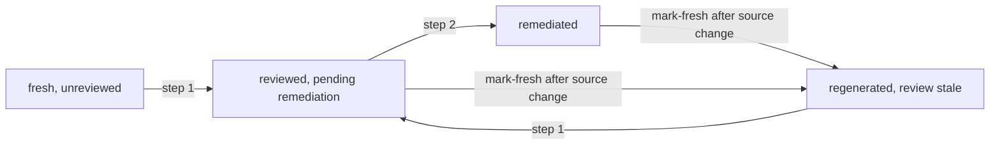

# Regeneration Workflow

This document describes how to (re)generate the LLM-authored documents
under `docs/llm-generated/`. The pipeline is deliberately **operator-driven**:
the driver script tracks state, but document generation itself is an
out-of-band agent invocation that the operator performs.

## Prerequisites

- A Python 3.9+ interpreter (no third-party packages are required; PyYAML
  is used if available but is not mandatory).
- A working `git` and a clean checkout (`git status` should show no
  unintended changes).
- An AI agent capable of reading files in the workspace and writing a
  single markdown document. The pipeline is intentionally model-agnostic:
  any agent that can be pointed at the watched paths and the prompt
  template can be used.

## The driver

All commands run from the repository root.

```bash
python3 docs/llm-generated/_meta/regenerate.py <subcommand> [args...]
```

| Subcommand | Purpose |
| --- | --- |
| `list` | Print every doc in the manifest |
| `list-stale [--include-review]` | Classify each doc as `missing`, `stale`, or `fresh`; with the flag, annotate each row with its review/remediation status |
| `digest <doc>` | Compute the current digest of a doc's watched paths |
| `show <doc>` | Show the manifest entry plus the resolved source files |
| `mark-fresh <doc> [--commit SHA] [--model NAME]` | Record a fresh entry |
| `lint [<doc>...]` | Structural linter (front-matter, link resolution, size cap; also lints every review and remediation report) |
| `review-status [<doc>...] [--show-counts]` | Per-doc review/remediation freshness (see "Review and remediation workflow" below) |
| `mark-reviewed <doc> [--report PATH]` | Record a review entry from a review report (see below) |
| `mark-remediated <doc> [--report PATH]` | Record a remediation entry from a remediation report (see below) |

`<doc>` is the manifest key (e.g. `pipeline/05-ir-passes.md`), not the full
workspace path.

## Operator loop

### One-shot bootstrap (Phase 2)

When `docs/llm-generated/` is empty, every doc is `missing`:

```bash
python3 docs/llm-generated/_meta/regenerate.py list-stale
```

Run the agent once per doc, in dependency order (a doc that lists
`depends_on` other docs should be regenerated *after* its dependencies, so
that the agent can read them as additional context). For each doc:

1. Open the prompt template at
   `docs/llm-generated/_meta/<prompt-path>` (the path is shown by
   `regenerate.py show <doc>`).
2. Show the agent the watched files (use `regenerate.py show <doc>` to
   list them) plus any `depends_on` documents that have already been
   generated.
3. Ask the agent to produce the target document, including the front-matter
   block exactly as specified in the prompt template. The `source_commit`
   value should be the current `HEAD`. Compute
   `watched_paths_digest` with `regenerate.py digest <doc>`.
4. Save the agent's output to `docs/llm-generated/<doc>`.
5. Run `regenerate.py lint <doc>`. Fix structural issues (front-matter
   keys, broken links, size cap) by re-prompting the agent — never by
   hand-editing the doc.
6. Once lint passes, run
   `regenerate.py mark-fresh <doc> --model <model-id>` to update
   `freshness.json`.

### Incremental refresh (Phase 4)

When the source tree has moved on:

```bash
python3 docs/llm-generated/_meta/regenerate.py list-stale
```

For each doc reported as `stale`:

1. Optionally show the agent the previous version of the doc and a
   `git diff` of the watched paths since the recorded `source_commit` so
   that it can do a focused refresh rather than a full rewrite.
2. Regenerate the doc, lint, and `mark-fresh` exactly as in the bootstrap
   loop.

If multiple docs are stale, regenerate them in dependency order
(architecture docs before pipeline docs; primary docs before docs that
depend on them).

### Cross-link pass (Phase 3)

After every doc has been generated at least once, do a second pass over
the whole tree where each agent invocation also gets the previously
generated peer docs as context. This typically:

- aligns terminology (e.g. consistent use of "translation unit",
  "module", "compile request");
- inserts cross-references (`[parser pipeline](../pipeline/02-parse-ast.md)`);
- prunes redundant explanations that another doc already covers.

The cross-link pass is just a regular regeneration of every doc with an
expanded context, followed by `lint` and `mark-fresh`.

## Review and remediation workflow

Generated docs are subject to a two-stage independent-review process
intended to catch drift, hallucination, and contract violations:

1. **Review** — performed by an agent from a **different** model family
   than the one used for generation (the operator's choice; the
   reference flow uses a GPT model). Produces a structured report under
   [reviews/](reviews/) (one report per doc).
2. **Remediation** — performed by an agent from the **same** model family
   that generated the docs (Anthropic Claude). Acts on every finding in
   the review report by editing the target doc, recording a rationale to
   reject the finding, deferring it, or escalating it to a human.
   Produces a structured report under [remediations/](remediations/).

The driver does not call any agent for either stage. It supplies the
prompt templates and bookkeeping; the operator runs the agent
out-of-band, just like for generation.

### Refusal mechanism (soft, three layers)

- **Prompt banner.** The first lines of
  [prompts/_review.md](prompts/_review.md) tell a Claude-family model to
  output `REFUSED: Claude model detected; the review step requires a
  different model family` and stop. The first lines of
  [prompts/_remediate.md](prompts/_remediate.md) tell a non-Claude model
  to output `REFUSED: non-Claude model detected; the remediation step
  requires the same model family that generated the docs` and stop.
- **Bookkeeping gate.** `mark-reviewed` refuses to record a review whose
  `reviewer_model` looks like Claude/Anthropic; `mark-remediated`
  refuses to record a remediation whose `remediator_model` does not.
- **Runbook.** This file's per-stage instructions name the expected
  family.

This is intentionally not a hard gate (the tool does not call a model
API and cannot verify identity directly); the goal is to prevent
accidental misuse, not to defend against an adversary.

### Step 1 — Review (non-Claude agent)

Pick a doc that needs reviewing. Documents that have never been
reviewed, and documents whose `watched_paths_digest` has changed since
the last review, are listed by:

```bash
python3 docs/llm-generated/_meta/regenerate.py review-status
```

Each row prints one of `unreviewed`, `review-stale`,
`reviewed-pending-remediation`, or `remediated`.

For each doc that needs review:

1. Open the review prompt at [prompts/_review.md](prompts/_review.md).
2. Show the agent: the target document (with its front-matter), the
   doc's per-page prompt (the path is in the manifest entry; obtain via
   `regenerate.py show <doc>`), [prompts/_common.md](prompts/_common.md),
   the resolved watched files at the doc's recorded `source_commit`,
   and any `depends_on` documents.
3. Ask the agent to produce a single review report exactly matching the
   contract in `_review.md`.
4. Save the report to `_meta/reviews/<doc>.review.md` — preserving the
   manifest-key directory hierarchy (e.g.
   `_meta/reviews/pipeline/05-ir-passes.md.review.md`).
5. Run `regenerate.py lint <doc>`. Fix structural issues by
   re-prompting the agent — never by hand-editing the report.
6. Record the review:

   ```bash
   python3 docs/llm-generated/_meta/regenerate.py mark-reviewed <doc>
   ```

   `mark-reviewed` reads the default report path
   (`_meta/reviews/<doc>.review.md`); pass `--report PATH` to override.
   It refuses to record the entry if `reviewer_model` contains
   `claude` or `anthropic`.

### Step 2 — Remediation (Claude agent)

Documents needing remediation are listed by the same `review-status`
output as `reviewed-pending-remediation`.

For each doc:

1. Open the remediation prompt at
   [prompts/_remediate.md](prompts/_remediate.md).
2. Show the agent: the target document, the review report from Step 1,
   the doc's per-page prompt + [prompts/_common.md](prompts/_common.md),
   and the resolved watched files at the current `HEAD`.
3. The agent edits the target document where appropriate and produces
   a remediation report at
   `_meta/remediations/<doc>.remediation.md` matching the contract in
   `_remediate.md`.
4. If the document was edited:

   ```bash
   python3 docs/llm-generated/_meta/regenerate.py mark-fresh <doc> \
       --model <model-id>
   ```

   so the doc's `watched_paths_digest` is refreshed. (If the doc was
   not edited — every action was a rejection / deferral / escalation —
   skip `mark-fresh`.)
5. Lint and record the remediation:

   ```bash
   python3 docs/llm-generated/_meta/regenerate.py lint <doc>
   python3 docs/llm-generated/_meta/regenerate.py mark-remediated <doc>
   ```

   `mark-remediated` reads the default report path; pass `--report
   PATH` to override. It refuses to record the entry if
   `remediator_model` does not contain `claude` or `anthropic`.

### Example session

A complete cycle for one doc:

```bash
# 0. See which docs need review.
python3 docs/llm-generated/_meta/regenerate.py review-status

# 1. Run the review agent (non-Claude). Save its output to
#    _meta/reviews/pipeline/06-emit.md.review.md, then:
python3 docs/llm-generated/_meta/regenerate.py lint pipeline/06-emit.md
python3 docs/llm-generated/_meta/regenerate.py mark-reviewed pipeline/06-emit.md

# 2. Run the remediation agent (Claude). It may edit
#    docs/llm-generated/pipeline/06-emit.md. It writes the report to
#    _meta/remediations/pipeline/06-emit.md.remediation.md, then:
python3 docs/llm-generated/_meta/regenerate.py mark-fresh pipeline/06-emit.md \
    --model claude-opus-4.7
python3 docs/llm-generated/_meta/regenerate.py lint pipeline/06-emit.md
python3 docs/llm-generated/_meta/regenerate.py mark-remediated pipeline/06-emit.md

# 3. Verify the cycle closed.
python3 docs/llm-generated/_meta/regenerate.py review-status pipeline/06-emit.md
# expected: "remediated  pipeline/06-emit.md"
```

### Ledger and freshness

The two-stage state is recorded in
[review-state.json](review-state.json) (sibling of `freshness.json`).
A document is computed as:

- **review-fresh** iff `last_reviewed.target_doc_watched_paths_digest`
  equals the doc's current front-matter `watched_paths_digest` — i.e.
  the doc has not been regenerated since the last review.
- **remediation-fresh** iff review-fresh **and**
  `last_remediated.review_report_ref` points at the same review report
  that is currently in `last_reviewed`.

These are not stored; they are derived on the fly by `review-status`
and by `list-stale --include-review`. When a doc is regenerated and
`mark-fresh` runs, the next `review-status` will report `review-stale`
for that doc, prompting the next review cycle.

### Lifecycle



### Out of scope

- A whole-tree integrity review (cross-doc consistency check) — the
  per-doc reviews already verify each doc's outgoing links via lint.
- A self-review by the generating model before the external reviewer.
- Reviewing the reports themselves (recursion).
- Hard refusal via an HTTP / API gate — the driver does not call a
  model, so identity cannot be enforced beyond the soft layers above.

## Linter exit codes and policy

`lint` exits non-zero if any document has a structural **error**:

- Missing or malformed YAML front-matter
- Required front-matter keys missing (`generated`, `model`,
  `generated_at`, `source_commit`, `watched_paths_digest`, `warning`)
- A markdown link `[text](path)` whose path does not resolve

`lint` also walks every review and remediation report under
[reviews/](reviews/) and [remediations/](remediations/) and validates:

- The report front-matter against
  [schema/review-report.schema.json](schema/review-report.schema.json) /
  [schema/remediation-report.schema.json](schema/remediation-report.schema.json):
  required keys present, sentinel field `true`, severity / action
  counts non-negative and consistent with the body.
- The model fields against the soft refusal rule
  (`reviewer_model` must not be Claude/Anthropic; `remediator_model`
  must be).
- The `## Findings` table (review) and `## Actions` table
  (remediation): well-formed columns, unique IDs, allowed severity /
  action values, mandatory cells populated.
- Cross-consistency: every finding ID in the linked review's
  `## Findings` table appears exactly once in the remediation's
  `## Actions` table, with no extras.

`lint` reports **warnings** (currently only "size exceeds cap") without
failing. A warning is a hint to either tighten the prompt to produce a
shorter doc, or to raise the cap deliberately in the manifest.

## Lessons from the first end-to-end exercise

The first time the loop is exercised end-to-end it tends to surface
**manifest gaps**: a doc was authored against information drawn from a
file that the manifest does not actually watch, so a real change to that
file does not flag the doc as stale. The recommended response is:

1. Add the missing path to the doc's `watched_paths` in `manifest.yaml`.
2. Re-run `regenerate.py list-stale`. The doc will now be flagged stale
   because the watched-paths digest changed.
3. If the doc's existing content still accurately reflects the file,
   `mark-fresh` it; otherwise regenerate first, then mark fresh.

A concrete example surfaced during the Phase 4 exercise: a temporary
edit to [source/compiler-core/slang-token-defs.h](../../../source/compiler-core/slang-token-defs.h)
flagged only `architecture/module-map.md` (whose `source/compiler-core/slang-*.h`
glob caught it). Both `pipeline/01-lex-preprocess.md` and
`syntax-reference/tokens.md` reverse-engineer their token catalogues from
that file, so the manifest was extended to watch it explicitly. The
expansion is recorded as a manifest entry, not as a hand-edit to the
generated doc.

## What the driver intentionally does NOT do

- It does not call any agent or LLM. Generation, review, and
  remediation are all operator-driven.
- It does not commit or push changes.
- It does not auto-edit generated documents, review reports, or
  remediation reports. If lint fails, the operator re-runs the agent
  with the lint output included in the prompt context.
- It does not enforce reviewer / remediator identity beyond a soft
  string check on the `reviewer_model` / `remediator_model` fields in
  the report front-matter.

## Continuous integration

Wiring this into CI is a deliberate Phase 4 follow-up that has not been
enabled yet. The intended attachment point is a new workflow under
[../../../.github/workflows/](../../../.github/workflows/) that runs
`regenerate.py list-stale` on every PR touching watched paths and posts
a soft warning (not a hard failure) listing stale documents. The warning
should remind the PR author to schedule a documentation refresh, not
block the PR.

The reason for the soft-warning policy is that documentation drift is a
*reviewable* property of a change, not a *blocking* one — most source
changes do not warrant a same-PR doc refresh, especially if the change is
self-contained or temporary. Hard-failing PRs on doc staleness would
either incentivize hand-editing the generated docs (defeating the
experiment) or burn out reviewers with mechanical churn.

### Reference workflow (not enabled — for future hookup)

The existing
[../../../.github/workflows/check-toc.yml](../../../.github/workflows/check-toc.yml)
is the model: a non-blocking docs-hygiene check on PRs. A future
`check-llm-generated-docs.yml` would follow the same shape:

```yaml
# .github/workflows/check-llm-generated-docs.yml  -- NOT YET ENABLED
name: Check LLM-generated docs freshness (advisory only)
on:
  pull_request:
    branches: [master]
    paths:
      - 'source/**'
      - 'prelude/**'
      - 'include/**'
      - 'docs/llm-generated/**'
jobs:
  check-llm-doc-freshness:
    if: github.event.pull_request.draft != true
    runs-on: ubuntu-latest
    continue-on-error: true   # advisory: never blocks the PR
    steps:
      - uses: actions/checkout@v4
        with: { fetch-depth: 0 }
      - name: List stale LLM-generated docs
        run: |
          python3 docs/llm-generated/_meta/regenerate.py list-stale || true
      - name: Lint LLM-generated docs
        run: |
          python3 docs/llm-generated/_meta/regenerate.py lint
```

Notes for whoever enables this later:

- `continue-on-error: true` plus a non-zero exit from `list-stale` is
  what makes the check advisory rather than blocking. Removing that flag
  would convert it to a hard gate; do not do that without revisiting the
  policy above.
- The `lint` step *should* be a hard gate, because lint failures
  indicate structurally invalid docs (broken links, missing front-matter)
  rather than drift. It runs without `|| true`.
- The workflow does not regenerate anything. Regeneration remains
  operator-driven; CI only reports.
- No additional secrets or runners are needed; the driver has no
  third-party Python dependencies.
