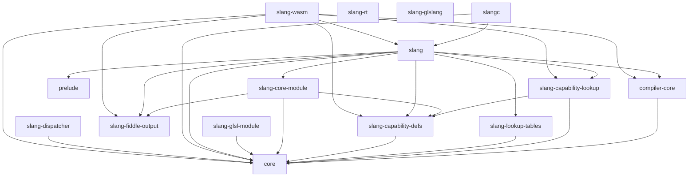

# Dependency Graph

This document captures the static link dependencies among the major
subsystems of the Slang source tree, derived from the
`slang_add_target(... LINK_WITH_PRIVATE ...)` and
`LINK_WITH_PUBLIC` clauses in the per-directory
[CMakeLists.txt](../../../source/) files. The granularity is
**subsystem level** (one node per `source/<subsystem>/`), not file
level; for the file-level inventory consult
[module-map.md](module-map.md).

The intended reader wants to predict what is at risk when changing a
specific subsystem.

## Edges (intra-project only)

External dependencies (`miniz`, `lz4_static`, `Threads::Threads`,
`unordered_dense`, `SPIRV-Headers`, `SPIRV-Tools-opt`, `SPIRV-Tools-link`,
`SPIRV`, `glslang`, `${CMAKE_DL_LIBS}`) are omitted from the diagram
to keep it focused on internal structure. They are listed in the
notes per node.

External dependencies (visible in
[CMakeLists.txt](../../../source/core/CMakeLists.txt) and friends but
not shown in the diagram):

- `coreLib` (`core`): `miniz`, `lz4_static`, `Threads::Threads`,
  `unordered_dense`, `${CMAKE_DL_LIBS}`.
- `slangLib` (`slang`) and `slang-wasm`: `SPIRV-Headers`, plus
  `miniz` / `lz4_static` for the wasm target.
- `slang-rt`: `miniz`, `lz4_static`, `Threads`, `unordered_dense`,
  `${CMAKE_DL_LIBS}` — note the absence of any internal Slang library
  dependency. `slang-rt` is shipped alongside the compiler but does
  not consume the compiler's own code (cite
  [source/slang-rt/CMakeLists.txt](../../../source/slang-rt/CMakeLists.txt)).
- `slang-glslang`: `glslang`, `SPIRV`, `SPIRV-Tools-opt`,
  `SPIRV-Tools-link` (cite
  [source/slang-glslang/CMakeLists.txt](../../../source/slang-glslang/CMakeLists.txt)).
- `slang-lookup-tables`: `SPIRV-Headers`.

## Notable invariants

The layering above implies several invariants. Each is justified by a
specific build file.

- **`source/core/` does not depend on any other internal subsystem.**
  Its `slang_add_target(... LINK_WITH_PRIVATE miniz lz4_static
  Threads::Threads ...)` block in
  [source/core/CMakeLists.txt](../../../source/core/CMakeLists.txt)
  lists only external libraries.
- **`source/compiler-core/` may depend on `source/core/` but not on
  `source/slang/`.** The corresponding block in
  [source/compiler-core/CMakeLists.txt](../../../source/compiler-core/CMakeLists.txt)
  contains `LINK_WITH_PRIVATE core` only.
- **`source/slang/` (the main `slang` library) is the only target that
  pulls in the AST/IR/emit/check sources.** Every other binary that
  needs compilation services (such as `slangc`,
  [source/slangc/CMakeLists.txt](../../../source/slangc/CMakeLists.txt))
  links against `slang` rather than reaching into individual files.
- **The capability subsystem is split into two libraries.**
  `slang-capability-defs` is the generated header library and
  `slang-capability-lookup` is the generated source library; the main
  `slang` target consumes both
  ([source/slang/CMakeLists.txt](../../../source/slang/CMakeLists.txt)).
- **The core module is linked optionally.** The choice between
  `slang-embedded-core-module` and `slang-no-embedded-core-module` is
  controlled by the CMake option `SLANG_EMBED_CORE_MODULE` and
  expressed as a generator expression in
  [source/slang/CMakeLists.txt](../../../source/slang/CMakeLists.txt).
- **`slang-rt` does not depend on the compiler.** The runtime is
  shipped alongside emitted CPU-target output, and its
  `LINK_WITH_PRIVATE` list contains no compiler internals.
- **Public headers in [include/](../../../include/) must not include
  private headers from [source/](../../../source/).** This is not a
  build-system constraint but a project rule (see
  [CLAUDE.md](../../../CLAUDE.md)); preserving it is what allows
  downstream users to consume only `include/slang.h`.

## Cycles and known irregularities

No link-level cycles are observed in the per-directory CMake files.
The closest thing to an irregularity is the `slang-common-objects`
indirection in
[source/slang/CMakeLists.txt](../../../source/slang/CMakeLists.txt):
when configured in some modes the same source files are compiled into
an object library and then re-linked into both
`slang-without-embedded-core-module` and the main `slang` library,
which is a build-system convenience for shipping a "compiler with no
embedded core module" generator alongside the user-facing `slang`.

## Where to go next

- For the file-level breakdown of each subsystem, see
  [module-map.md](module-map.md).
- For runtime data flow rather than build dependencies, follow the
  pipeline starting at [../pipeline/overview.md](../pipeline/overview.md).
