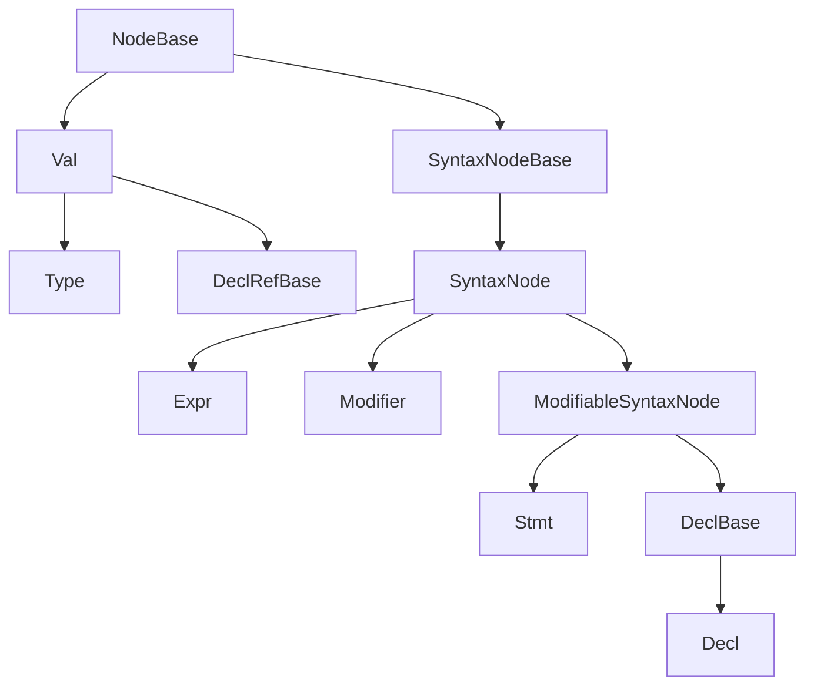

# AST Base Reference

This page describes the abstract roots of the Slang AST hierarchy: the
classes that every concrete AST node ultimately derives from. The
per-family pages ([declarations.md](declarations.md),
[expressions.md](expressions.md), [statements.md](statements.md),
[types.md](types.md), [modifiers.md](modifiers.md),
[values.md](values.md)) assume the reader already knows what
`NodeBase`, `SyntaxNode`, `Decl`, `Expr`, `Stmt`, `Modifier`, `Val`,
and `Type` are. This page is the place to learn that.

Audience: a developer who has read
[../pipeline/02-parse-ast.md](../pipeline/02-parse-ast.md) and wants
the per-class facts before drilling into a family page.

## Source

The abstract root hierarchy is declared in
[slang-ast-base.h](../../../source/slang/slang-ast-base.h). Two
supporting headers belong to this layer:

- [slang-ast-forward-declarations.h](../../../source/slang/slang-ast-forward-declarations.h)
  is FIDDLE-generated and defines the `ASTNodeType` enum that gives
  every concrete `NodeBase` subclass a stable integer tag used by the
  `as<T>()` / `dynamicCast<T>()` infrastructure.
- [slang-ast-support-types.h](../../../source/slang/slang-ast-support-types.h)
  defines the non-node helper types that the AST API exposes
  (`DeclRef<T>`, `LookupResult`, `Modifiers`, `QualType`,
  `SubstitutionSet`, ...).

## Root hierarchy

Notes on the diagram:

- `NodeBase` is the root of every AST node. It carries an
  `astNodeType` tag and a back-pointer to the owning `ASTBuilder`.
- The diagram shows the relationships in
  [slang-ast-base.h](../../../source/slang/slang-ast-base.h) only.
  All other abstract intermediates (`ContainerDecl`, `OperatorExpr`,
  `LoopStmt`, ...) live in the per-family headers and are documented
  in the corresponding family page's hierarchy diagram.
- `Scope` is a concrete `NodeBase` (not abstract). It is not a syntax
  node and does not appear in the parsed AST; it is the runtime
  data structure used by name lookup.

## Roots

### NodeBase

The root of the entire AST hierarchy.

- Carries the `ASTNodeType astNodeType` discriminator and a pointer
  back to the `ASTBuilder` that allocated this node.
- The `astNodeType` enum is FIDDLE-generated in
  [slang-ast-forward-declarations.h](../../../source/slang/slang-ast-forward-declarations.h);
  every subclass receives a stable tag at build time. This is what
  powers `as<T>()` / `dynamicCast<T>()` on AST nodes.
- Not a syntax node — it has no source location. Subclasses that
  represent textual syntax derive from `SyntaxNodeBase` instead.

Fields declared at this level:

- `astNodeType: ASTNodeType` — discriminator tag set by the
  `ASTBuilder` at construction.
- `_astBuilder: ASTBuilder*` (private) — the AST builder this node
  belongs to.

Family page: (no dedicated family page)

### SyntaxNodeBase (NodeBase)

The abstract base for nodes that correspond to actual source text and
therefore carry a `SourceLoc`. It is the common ancestor of every
parsed AST node.

Fields declared at this level:

- `loc: SourceLoc` — primary source location for the node.

Family page: (no dedicated family page)

### SyntaxNode (SyntaxNodeBase)

A second-level abstract base used to group syntax nodes that are *not*
modifiable by modifiers (the main split is below at
`ModifiableSyntaxNode`). `Expr` and `Modifier` derive directly from
`SyntaxNode`; `ModifiableSyntaxNode` adds modifier storage on top.

Fields declared at this level:

- (no additional state)

Family page: (no dedicated family page)

### Modifier (SyntaxNode)

The abstract base for every modifier and attribute node. Modifiers
form an intrusive linked list attached to a `ModifiableSyntaxNode`.

Fields declared at this level:

- `next: Modifier*` — next modifier in the linked list on the same
  piece of syntax.
- `keywordName: Name*` — the keyword (or attribute name) that
  introduced this modifier.

Family page: [modifiers.md](modifiers.md)

### ModifiableSyntaxNode (SyntaxNode)

The abstract base for syntax nodes that can carry modifiers (`Stmt`
and `DeclBase`). Owns a `Modifiers` list and exposes
`findModifier<T>()` / `hasModifier<T>()` filters.

Fields declared at this level:

- `modifiers: Modifiers` — the linked list of modifiers attached to
  this node.

Family page: (no dedicated family page)

### DeclBase (ModifiableSyntaxNode)

An intermediate that represents either a single declaration or a
group of declarations. Concrete subclasses are `Decl` and
declaration-group nodes such as `DeclGroup`.

Fields declared at this level:

- (no additional state)

Family page: [declarations.md](declarations.md)

### Decl (DeclBase)

The abstract base for every single declaration (function, variable,
type, parameter, generic parameter, ...). Carries a name, the parent
`ContainerDecl`, a check state, and capability requirements.

Fields declared at this level:

- `parentDecl: ContainerDecl*` — containing declaration, set during
  parsing.
- `nameAndLoc: NameLoc` — the declared name and its source location.
- `inferredCapabilityRequirements: CapabilitySetVal*` — capability set
  inferred during checking.
- `checkState: DeclCheckStateExt` — tracks which checking phases have
  completed for this declaration.

Family page: [declarations.md](declarations.md)

### Stmt (ModifiableSyntaxNode)

The abstract base for every statement node.

Fields declared at this level:

- (no additional state)

Family page: [statements.md](statements.md)

### Expr (SyntaxNode)

The abstract base for every expression node. Carries a `QualType`
that is filled in by semantic checking.

Fields declared at this level:

- `type: QualType` — the type assigned to the expression by the
  checker; null on freshly-parsed expressions.
- `checked: bool` — flag set when the checker has finished with this
  expression.

Family page: [expressions.md](expressions.md)

### Val (NodeBase)

The abstract base for compile-time *values*. `Val`s are deduplicated
(hash-consed) by the `ASTBuilder`, are not syntax nodes (no
`SourceLoc`), and use a generic operand list (`m_operands`) rather
than per-class fields. `Val` subclasses include `Type`, `DeclRefBase`,
the `IntVal` family, and the `Witness` family.

Fields declared at this level:

- `m_operands: List<ValNodeOperand>` — generic operand list used by
  the `Val` deduplication and substitution machinery.

Family page: [values.md](values.md) (covers the non-Type subhierarchy)

### Type (Val)

The abstract base for every type-as-Val. Every Slang type the front
end works with is a `Type`, including resolved type references,
arithmetic types, generic-parameter types, and function types.

Fields declared at this level:

- `m_astBuilderForReflection: ASTBuilder*` — kept for the reflection
  API only; not used for semantic checking.

Family page: [types.md](types.md)

### DeclRefBase (Val)

A reference to a declaration, possibly with generic substitutions.
`DeclRefBase` is itself a `Val` so that decl-refs can be hash-consed.
The user-facing template `DeclRef<T>` (declared in
[slang-ast-support-types.h](../../../source/slang/slang-ast-support-types.h))
is a thin typed wrapper around a `DeclRefBase*`.

Fields declared at this level:

- (operands carry the referenced `Decl` and any substitutions; see
  `Val::m_operands`)

Family page: (no dedicated family page; covered alongside the
witness and IntVal families in [values.md](values.md))

## Support types

These non-node types are declared in
[slang-ast-support-types.h](../../../source/slang/slang-ast-support-types.h)
and appear pervasively in the AST API. They are not `NodeBase`
subclasses; they are helpers that wrap or describe nodes.

| Name | Header | Purpose |
| --- | --- | --- |
| `DeclRef<T>` | [slang-ast-support-types.h](../../../source/slang/slang-ast-support-types.h) | Typed wrapper around `DeclRefBase*`; the API uses `DeclRef<FuncDecl>`, `DeclRef<StructDecl>`, etc. |
| `Modifiers` | [slang-ast-support-types.h](../../../source/slang/slang-ast-support-types.h) | Intrusive linked list of modifiers attached to a `ModifiableSyntaxNode`. |
| `QualType` | [slang-ast-support-types.h](../../../source/slang/slang-ast-support-types.h) | A `Type*` together with l-value/r-value and qualifier information; the type carried by `Expr`. |
| `SubstitutionSet` | [slang-ast-support-types.h](../../../source/slang/slang-ast-support-types.h) | The set of generic / existential substitutions used to specialize a `Val`. |
| `LookupResult`, `LookupResultItem` | [slang-ast-support-types.h](../../../source/slang/slang-ast-support-types.h) | Result of a name lookup; can hold zero, one, or several decl-refs together with how each was reached. |
| `TypeExp` | [slang-ast-support-types.h](../../../source/slang/slang-ast-support-types.h) | A type expression as written by the user (an `Expr` plus the resolved `Type*`). |
| `WitnessTable` | [slang-ast-support-types.h](../../../source/slang/slang-ast-support-types.h) | A compile-time table of interface-requirement-to-implementation mappings; see the entry in [../glossary.md](../glossary.md). |
| `SyntaxClass<T>` | [slang-ast-support-types.h](../../../source/slang/slang-ast-support-types.h) | Reflection-style handle to a concrete AST class, used by the visitor and `as<T>()` infrastructure. |
| `Scope` | [slang-ast-base.h](../../../source/slang/slang-ast-base.h) | Runtime data structure for name lookup; technically a `NodeBase` but used as a helper, not parsed. |

## See also

- [../pipeline/02-parse-ast.md](../pipeline/02-parse-ast.md) — how the
  parser builds an AST from these roots.
- [../pipeline/03-semantic-check.md](../pipeline/03-semantic-check.md)
  — how the checker fills in `QualType`, `checkState`, decl-refs.
- [declarations.md](declarations.md), [expressions.md](expressions.md),
  [statements.md](statements.md), [types.md](types.md),
  [modifiers.md](modifiers.md), [values.md](values.md) — concrete leaf
  nodes grouped by family root.
- [../glossary.md](../glossary.md) — short definitions for `ASTBuilder`,
  `decl-ref`, `source-loc`, `witness table`, etc.
