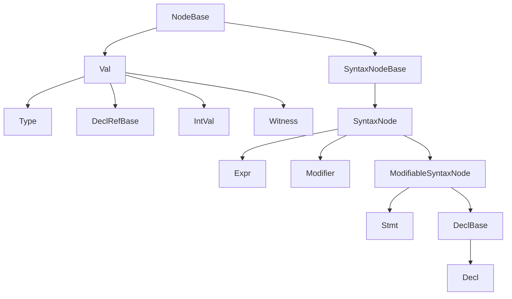

# AST Reference

This subtree of `docs/llm-generated/` provides a per-class reference
for every concrete AST node in the Slang compiler, grouped by family.
Each family page tabulates the concrete classes in one of the AST
roots and calls out a handful of "notable" nodes that need more
context than a row in a table can provide.

The pages here are intentionally narrow in scope: they describe
*shape* (parent class, fields, grammar source) rather than *behaviour*.
For how the AST is built, see
[../pipeline/02-parse-ast.md](../pipeline/02-parse-ast.md); for what
the checker does to it, see
[../pipeline/03-semantic-check.md](../pipeline/03-semantic-check.md);
for how it lowers to IR, see
[../pipeline/04-ast-to-ir.md](../pipeline/04-ast-to-ir.md). The
surface language those nodes represent is documented in
[../syntax-reference/grammar.md](../syntax-reference/grammar.md).

## Family taxonomy

The diagram below mirrors the abstract-root hierarchy declared in
[../../source/slang/slang-ast-base.h](../../../source/slang/slang-ast-base.h);
the per-family pages cover the concrete leaves under each root.

Pointers from each root to its dedicated family page:

- `NodeBase`, `SyntaxNode`, `Val`, `Type`, `Decl`, `Expr`, `Stmt`,
  `Modifier` (the abstract roots themselves): [base.md](base.md).
- `Decl` (concrete leaves): [declarations.md](declarations.md).
- `Expr` (concrete leaves): [expressions.md](expressions.md).
- `Stmt` (concrete leaves): [statements.md](statements.md).
- `Type` (concrete leaves): [types.md](types.md).
- `Modifier` (concrete leaves, including the `Attribute` family):
  [modifiers.md](modifiers.md).
- `Val` (non-Type leaves: `DeclRefBase` family, `IntVal` family,
  `Witness` family, `ModifierVal` family, `DifferentiateVal` family,
  `UIntSetVal`): [values.md](values.md).

## Pages

| Page | Family root | Owning header | Approx. concrete classes |
| --- | --- | --- | --- |
| [base.md](base.md) | abstract roots | [slang-ast-base.h](../../../source/slang/slang-ast-base.h) | (abstract roots only) |
| [declarations.md](declarations.md) | `Decl` / `DeclBase` | [slang-ast-decl.h](../../../source/slang/slang-ast-decl.h) | ~60 |
| [expressions.md](expressions.md) | `Expr` | [slang-ast-expr.h](../../../source/slang/slang-ast-expr.h) | ~90 |
| [statements.md](statements.md) | `Stmt` | [slang-ast-stmt.h](../../../source/slang/slang-ast-stmt.h) | ~30 |
| [types.md](types.md) | `Type` | [slang-ast-type.h](../../../source/slang/slang-ast-type.h) | ~120 |
| [values.md](values.md) | `Val` (non-Type) | [slang-ast-val.h](../../../source/slang/slang-ast-val.h) | ~60 |
| [modifiers.md](modifiers.md) | `Modifier` (+ `Attribute`) | [slang-ast-modifier.h](../../../source/slang/slang-ast-modifier.h) | ~255 |

Counts are approximate (rounded to the nearest five at the
`source_commit` recorded in this file's front-matter); they reflect
classes declared with FIDDLE(...) at non-abstract granularity in the
listed header. The exact count drifts as classes are added or
removed, and the regeneration pipeline will surface mismatches as
staleness.

## Cross-cutting topics

The AST is touched by every front-end document in
`docs/llm-generated/`. The following peer pages are the most direct
companions of this subtree:

- [../pipeline/02-parse-ast.md](../pipeline/02-parse-ast.md) — how
  the parser produces these AST nodes (two-stage parsing,
  `parseDecl`, `parseStatement`, `parseExpression`).
- [../pipeline/03-semantic-check.md](../pipeline/03-semantic-check.md)
  — how the checker resolves names, fills in `QualType`, builds
  witnesses, and rewrites unresolved nodes (e.g. `OverloadedExpr`,
  `UncheckedAttribute`) into their resolved forms.
- [../pipeline/04-ast-to-ir.md](../pipeline/04-ast-to-ir.md) — how
  AST nodes lower to Slang IR (which retires most of them).
- [../syntax-reference/grammar.md](../syntax-reference/grammar.md) —
  the surface grammar that maps onto these nodes.
- [../syntax-reference/keywords-and-builtins.md](../syntax-reference/keywords-and-builtins.md)
  — how Slang's syntax-as-declaration model (via `SyntaxDecl` and
  `AttributeDecl`) maps keywords and attributes to AST node classes.
- [../cross-cutting/diagnostics.md](../cross-cutting/diagnostics.md)
  — `SourceLoc`-bearing AST nodes are the carriers of most
  diagnostics.
- [../cross-cutting/ir-instructions.md](../cross-cutting/ir-instructions.md)
  — IR opcodes that consume AST witnesses and decl-refs.
- [../glossary.md](../glossary.md) — short definitions of `decl-ref`,
  `hash-consing`, `witness table`, `existential type`, `source-loc`,
  `ASTBuilder`, and related terms used throughout the AST pages.

## How to navigate

Start with [base.md](base.md) if you are new to the AST: it
introduces the abstract roots that every family page assumes you
already know. From there, jump straight to the family page for the
class you care about (`Decl` to [declarations.md](declarations.md),
`Expr` to [expressions.md](expressions.md), and so on).

Each family page contains a single `## Nodes` table (sometimes split
into sub-tables by category, in pages where the family is very large)
listing every concrete class declared in the owning header.
Abstract intermediate classes (those declared with
`FIDDLE(abstract)`) do *not* appear in those tables; they show up
in each page's `## Family hierarchy` diagram instead.

The `Grammar` column in every `## Nodes` table links into
[../syntax-reference/grammar.md](../syntax-reference/grammar.md);
classes that are synthesized rather than parsed are marked `(none)`
with a short note in the `Summary` column. Notable nodes whose
behaviour cannot be captured in a single row have a short
`## Notable nodes` callout further down the page.
