# Modifiers and Attributes Reference

The reference for every concrete `Modifier` subclass in the Slang
AST. `Modifier` itself is documented in
[base.md](base.md#modifier-syntaxnode).

Slang draws a deliberate distinction between two related families of
syntax:

- **Modifiers** are keyword-like markers without an argument list:
  `in`, `out`, `inout`, `const`, `static`, `uniform`,
  `globallycoherent`, `noperspective`, ... Each one is its own
  `Modifier` subclass.
- **Attributes** use the `[name(args)]` syntax and derive from
  `AttributeBase` (which itself derives from `Modifier`). Concrete
  attribute classes (`UnrollAttribute`, `NumThreadsAttribute`, ...)
  hold parsed arguments and any post-checking metadata.

Both are linked off `ModifiableSyntaxNode::modifiers` and walked with
`findModifier<T>()` / `hasModifier<T>()`.

Audience: a contributor working in the parser, checker, or backend
emit who needs to know which class a particular `[attr]` or keyword
becomes, and where its semantic checking lives.

## Source

Modifier classes are declared in
[slang-ast-modifier.h](../../../source/slang/slang-ast-modifier.h).
Parsing happens in
[slang-parser.cpp](../../../source/slang/slang-parser.cpp);
attributes are dispatched through the `AttributeDecl` table
documented in
[../syntax-reference/keywords-and-builtins.md](../syntax-reference/keywords-and-builtins.md).

## Family hierarchy

```mermaid
flowchart TD
  Modifier --> VisibilityModifier
  Modifier --> InModifier
  Modifier --> OutModifier
  Modifier --> ConstModifier
  Modifier --> InlineModifier
  Modifier --> BuiltinModifier
  Modifier --> AttributeBase
  Modifier --> HLSLSemantic
  Modifier --> InterpolationModeModifier
  Modifier --> MatrixLayoutModifier
  Modifier --> SimpleModifier
  Modifier --> TypeModifier
  Modifier --> GLSLLayoutModifierGroupMarker
  Modifier --> GLSLPreprocessorDirective
  Modifier --> HLSLGeometryShaderInputPrimitiveTypeModifier
  Modifier --> HLSLMeshShaderOutputModifier
  Modifier --> OtherModifier["IntrinsicOpModifier, TargetIntrinsicModifier, BuiltinTypeModifier, ..."]
  OutModifier --> InOutModifier
  VisibilityModifier --> PublicModifier
  VisibilityModifier --> PrivateModifier
  VisibilityModifier --> InternalModifier
  AttributeBase --> Attribute
  AttributeBase --> UncheckedAttribute
  AttributeBase --> UncheckedGLSLLayoutAttribute
  AttributeBase --> GLSLImplicitOffsetLayoutAttribute
  Attribute --> DifferentiableAttribute
  Attribute --> InheritanceControlAttribute
  Attribute --> GLSLSimpleIntegerLayoutAttribute
  Attribute --> OtherAttr["UnrollAttribute, NumThreadsAttribute, EntryPointAttribute, ..."]
  DifferentiableAttribute --> UserDefinedDerivativeAttribute
  DifferentiableAttribute --> DerivativeOfAttribute
  DifferentiableAttribute --> OtherDiff["TreatAsDifferentiableAttribute, ForwardDifferentiableAttribute, BackwardDifferentiableAttribute, ..."]
  HLSLSemantic --> HLSLLayoutSemantic
  HLSLSemantic --> HLSLSimpleSemantic
  HLSLSemantic --> RayPayloadAccessSemantic
  HLSLLayoutSemantic --> HLSLRegisterSemantic
  HLSLLayoutSemantic --> HLSLPackOffsetSemantic
  RayPayloadAccessSemantic --> RayPayloadReadSemantic
  RayPayloadAccessSemantic --> RayPayloadWriteSemantic
  TypeModifier --> WrappingTypeModifier
  TypeModifier --> ResourceElementFormatModifier
  TypeModifier --> NoDiffModifier
  ResourceElementFormatModifier --> UNormModifier
  ResourceElementFormatModifier --> SNormModifier
  MatrixLayoutModifier --> RowMajorLayoutModifier
  MatrixLayoutModifier --> ColumnMajorLayoutModifier
  HLSLGeometryShaderInputPrimitiveTypeModifier --> HLSLPointModifier
  HLSLGeometryShaderInputPrimitiveTypeModifier --> HLSLLineModifier
  HLSLGeometryShaderInputPrimitiveTypeModifier --> HLSLTriangleModifier
  HLSLGeometryShaderInputPrimitiveTypeModifier --> HLSLLineAdjModifier
  HLSLGeometryShaderInputPrimitiveTypeModifier --> HLSLTriangleAdjModifier
  HLSLMeshShaderOutputModifier --> HLSLVerticesModifier
  HLSLMeshShaderOutputModifier --> HLSLIndicesModifier
  HLSLMeshShaderOutputModifier --> HLSLPrimitivesModifier
```

Abstract intermediates: `VisibilityModifier`,
`GLSLLayoutModifierGroupMarker`, `HLSLSemantic`,
`MatrixLayoutModifier`, `RowMajorLayoutModifier`,
`ColumnMajorLayoutModifier`, `InterpolationModeModifier`,
`AttributeBase`, `InheritanceControlAttribute`.

## Nodes

### Parameter-direction and storage-class modifiers

| Class | Parent | Key fields | Grammar | Summary |
| --- | --- | --- | --- | --- |
| `InModifier` | `Modifier` | (no additional state) | [parameter modifier](../syntax-reference/grammar.md#modifiers-and-attributes) | `in` parameter direction. |
| `OutModifier` | `Modifier` | (no additional state) | [parameter modifier](../syntax-reference/grammar.md#modifiers-and-attributes) | `out` parameter direction. |
| `InOutModifier` | `OutModifier` | (no additional state) | [parameter modifier](../syntax-reference/grammar.md#modifiers-and-attributes) | `inout` parameter direction (a refinement of `out`). |
| `RefModifier` | `Modifier` | (no additional state) | [parameter modifier](../syntax-reference/grammar.md#modifiers-and-attributes) | `ref` parameter passing mode. |
| `BorrowModifier` | `Modifier` | (no additional state) | [parameter modifier](../syntax-reference/grammar.md#modifiers-and-attributes) | `borrow` parameter passing mode. |
| `ConstModifier` | `Modifier` | (no additional state) | [storage class](../syntax-reference/grammar.md#modifiers-and-attributes) | `const`. |
| `InlineModifier` | `Modifier` | (no additional state) | [storage class](../syntax-reference/grammar.md#modifiers-and-attributes) | `inline`. |
| `ParamModifier` | `Modifier` | (no additional state) | (none) | Internal marker on synthesized parameters. |
| `ConstExprModifier` | `Modifier` | (no additional state) | [storage class](../syntax-reference/grammar.md#modifiers-and-attributes) | `constexpr`. |
| `ExternModifier` | `Modifier` | (no additional state) | [storage class](../syntax-reference/grammar.md#modifiers-and-attributes) | `extern` (link-time declaration). |
| `DynModifier` | `Modifier` | (no additional state) | (none) | Marks a dynamic-dispatch context. |
| `ExternCppModifier` | `Modifier` | (no additional state) | (none) | Marks `extern "C++"` mapping for record/replay. |

### Visibility modifiers

| Class | Parent | Key fields | Grammar | Summary |
| --- | --- | --- | --- | --- |
| `PublicModifier` | `VisibilityModifier` | (no additional state) | [visibility](../syntax-reference/grammar.md#modifiers-and-attributes) | `public`. |
| `PrivateModifier` | `VisibilityModifier` | (no additional state) | [visibility](../syntax-reference/grammar.md#modifiers-and-attributes) | `private`. |
| `InternalModifier` | `VisibilityModifier` | (no additional state) | [visibility](../syntax-reference/grammar.md#modifiers-and-attributes) | `internal` (default in modern Slang). |

### Override / require / export / import boilerplate

| Class | Parent | Key fields | Grammar | Summary |
| --- | --- | --- | --- | --- |
| `OverrideModifier` | `Modifier` | (no additional state) | (none) | `override` for interface-default overrides. |
| `IsOverridingModifier` | `Modifier` | (no additional state) | (none) | Internal flag set by checking once an override is bound. |
| `RequireModifier` | `Modifier` | (no additional state) | (none) | `require` (interface requirement marker). |
| `BuiltinModifier` | `Modifier` | (no additional state) | (none) | Marks a declaration as part of the core module. |
| `HLSLExportModifier` | `Modifier` | (no additional state) | (none) | HLSL-style `export` keyword. |
| `ExportedModifier` | `Modifier` | (no additional state) | (none) | Marks an exported declaration. |
| `TransparentModifier` | `Modifier` | (no additional state) | (none) | Marks a member as transparent for name lookup. |
| `FromCoreModuleModifier` | `Modifier` | (no additional state) | (none) | Marks decls imported from the core module. |
| `PrefixModifier` | `Modifier` | (no additional state) | (none) | Marks an operator as prefix-arity. |
| `PostfixModifier` | `Modifier` | (no additional state) | (none) | Marks an operator as postfix-arity. |

### Compatibility and HLSL storage-class modifiers

| Class | Parent | Key fields | Grammar | Summary |
| --- | --- | --- | --- | --- |
| `HLSLEffectSharedModifier` | `Modifier` | (no additional state) | (none) | HLSL `shared` (effect-shared variable). |
| `HLSLGroupSharedModifier` | `Modifier` | (no additional state) | [HLSL storage](../syntax-reference/grammar.md#modifiers-and-attributes) | `groupshared`. |
| `HLSLStaticModifier` | `Modifier` | (no additional state) | [HLSL storage](../syntax-reference/grammar.md#modifiers-and-attributes) | `static`. |
| `HLSLUniformModifier` | `Modifier` | (no additional state) | [HLSL storage](../syntax-reference/grammar.md#modifiers-and-attributes) | `uniform`. |
| `HLSLVolatileModifier` | `Modifier` | (no additional state) | (none) | `volatile`. |
| `PreciseModifier` | `Modifier` | (no additional state) | (none) | `precise`. |

### Interpolation modes

| Class | Parent | Key fields | Grammar | Summary |
| --- | --- | --- | --- | --- |
| `HLSLNoInterpolationModifier` | `InterpolationModeModifier` | (no additional state) | [interpolation](../syntax-reference/grammar.md#modifiers-and-attributes) | `nointerpolation`. |
| `HLSLNoPerspectiveModifier` | `InterpolationModeModifier` | (no additional state) | [interpolation](../syntax-reference/grammar.md#modifiers-and-attributes) | `noperspective`. |
| `HLSLLinearModifier` | `InterpolationModeModifier` | (no additional state) | [interpolation](../syntax-reference/grammar.md#modifiers-and-attributes) | `linear`. |
| `HLSLSampleModifier` | `InterpolationModeModifier` | (no additional state) | [interpolation](../syntax-reference/grammar.md#modifiers-and-attributes) | `sample`. |
| `HLSLCentroidModifier` | `InterpolationModeModifier` | (no additional state) | [interpolation](../syntax-reference/grammar.md#modifiers-and-attributes) | `centroid`. |
| `PerVertexModifier` | `InterpolationModeModifier` | (no additional state) | [interpolation](../syntax-reference/grammar.md#modifiers-and-attributes) | `pervertex`. |

### Matrix layout modifiers

| Class | Parent | Key fields | Grammar | Summary |
| --- | --- | --- | --- | --- |
| `HLSLRowMajorLayoutModifier` | `RowMajorLayoutModifier` | (no additional state) | [matrix layout](../syntax-reference/grammar.md#modifiers-and-attributes) | HLSL `row_major`. |
| `HLSLColumnMajorLayoutModifier` | `ColumnMajorLayoutModifier` | (no additional state) | [matrix layout](../syntax-reference/grammar.md#modifiers-and-attributes) | HLSL `column_major`. |
| `GLSLRowMajorLayoutModifier` | `ColumnMajorLayoutModifier` | (no additional state) | [matrix layout](../syntax-reference/grammar.md#modifiers-and-attributes) | GLSL `row_major` (intentionally maps to *column* in Slang's convention). |
| `GLSLColumnMajorLayoutModifier` | `RowMajorLayoutModifier` | (no additional state) | [matrix layout](../syntax-reference/grammar.md#modifiers-and-attributes) | GLSL `column_major` (intentionally maps to *row* in Slang's convention). |

### HLSL geometry-shader input-primitive modifiers

| Class | Parent | Key fields | Grammar | Summary |
| --- | --- | --- | --- | --- |
| `HLSLGeometryShaderInputPrimitiveTypeModifier` | `Modifier` | (no additional state) | (none) | Common base for the geometry-shader input-primitive markers below. |
| `HLSLPointModifier` | `HLSLGeometryShaderInputPrimitiveTypeModifier` | (no additional state) | (none) | `point` (GS input). |
| `HLSLLineModifier` | `HLSLGeometryShaderInputPrimitiveTypeModifier` | (no additional state) | (none) | `line`. |
| `HLSLTriangleModifier` | `HLSLGeometryShaderInputPrimitiveTypeModifier` | (no additional state) | (none) | `triangle`. |
| `HLSLLineAdjModifier` | `HLSLGeometryShaderInputPrimitiveTypeModifier` | (no additional state) | (none) | `lineadj`. |
| `HLSLTriangleAdjModifier` | `HLSLGeometryShaderInputPrimitiveTypeModifier` | (no additional state) | (none) | `triangleadj`. |

### HLSL mesh-shader output / payload modifiers

| Class | Parent | Key fields | Grammar | Summary |
| --- | --- | --- | --- | --- |
| `HLSLMeshShaderOutputModifier` | `Modifier` | (no additional state) | (none) | Common base for the mesh-shader output-array markers below. |
| `HLSLVerticesModifier` | `HLSLMeshShaderOutputModifier` | (no additional state) | (none) | `vertices` (mesh shader). |
| `HLSLIndicesModifier` | `HLSLMeshShaderOutputModifier` | (no additional state) | (none) | `indices`. |
| `HLSLPrimitivesModifier` | `HLSLMeshShaderOutputModifier` | (no additional state) | (none) | `primitives`. |
| `HLSLPayloadModifier` | `Modifier` | (no additional state) | (none) | `payload` (amplification-shader payload). |

### HLSL semantics (`: SV_*`)

| Class | Parent | Key fields | Grammar | Summary |
| --- | --- | --- | --- | --- |
| `HLSLLayoutSemantic` | `HLSLSemantic` | register name, component mask | (none) | Base class for HLSL semantics that affect layout (register / packoffset). |
| `RayPayloadAccessSemantic` | `HLSLSemantic` | stage-name tokens | (none) | Base class for ray-payload read/write access semantics. |
| `HLSLSimpleSemantic` | `HLSLSemantic` | semantic name | [semantic](../syntax-reference/grammar.md#declarations) | `: NAME` (no parenthesized arguments). |
| `HLSLRegisterSemantic` | `HLSLLayoutSemantic` | register class, index | [register binding](../syntax-reference/grammar.md#modifiers-and-attributes) | `: register(...)`. |
| `HLSLPackOffsetSemantic` | `HLSLLayoutSemantic` | offset, element | [pack offset](../syntax-reference/grammar.md#modifiers-and-attributes) | `: packoffset(...)`. |
| `RayPayloadReadSemantic` | `RayPayloadAccessSemantic` | (no additional state) | (none) | `: read(...)` ray-payload semantic. |
| `RayPayloadWriteSemantic` | `RayPayloadAccessSemantic` | (no additional state) | (none) | `: write(...)` ray-payload semantic. |

### GLSL preprocessor / layout / format

| Class | Parent | Key fields | Grammar | Summary |
| --- | --- | --- | --- | --- |
| `GLSLPrecisionModifier` | `Modifier` | (no additional state) | (none) | GLSL precision qualifier. |
| `GLSLModuleModifier` | `Modifier` | (no additional state) | (none) | Marker for GLSL-module-origin declarations. |
| `GLSLPreprocessorDirective` | `Modifier` | (no additional state) | (none) | Base class for GLSL preprocessor directives preserved in the AST. |
| `GLSLVersionDirective` | `GLSLPreprocessorDirective` | version `Token` | (none) | `#version` preprocessor directive carried as AST. |
| `GLSLExtensionDirective` | `GLSLPreprocessorDirective` | extension name, behavior | (none) | `#extension` directive. |
| `GLSLLayoutModifierGroupBegin` | `GLSLLayoutModifierGroupMarker` | (no additional state) | (none) | Start marker of a `layout(...)` group. |
| `GLSLLayoutModifierGroupEnd` | `GLSLLayoutModifierGroupMarker` | (no additional state) | (none) | End marker of a `layout(...)` group. |
| `GLSLUnparsedLayoutModifier` | `Modifier` | text `Token` | (none) | Raw text of a layout qualifier deferred to later parsing. |
| `GLSLBufferDataLayoutModifier` | `Modifier` | (no additional state) | (none) | Base for buffer-layout modifiers. |
| `GLSLStd140Modifier` | `GLSLBufferDataLayoutModifier` | (no additional state) | [layout(std140)](../syntax-reference/grammar.md#modifiers-and-attributes) | `std140`. |
| `GLSLStd430Modifier` | `GLSLBufferDataLayoutModifier` | (no additional state) | [layout(std430)](../syntax-reference/grammar.md#modifiers-and-attributes) | `std430`. |
| `GLSLScalarModifier` | `GLSLBufferDataLayoutModifier` | (no additional state) | (none) | `scalar` layout. |
| `GLSLBufferModifier` | `WrappingTypeModifier` | (no additional state) | (none) | `buffer` modifier on a type. |
| `GLSLWriteOnlyModifier` | `SimpleModifier` | (no additional state) | (none) | `writeonly`. |
| `GLSLReadOnlyModifier` | `SimpleModifier` | (no additional state) | (none) | `readonly`. |
| `GLSLVolatileModifier` | `SimpleModifier` | (no additional state) | (none) | GLSL `volatile`. |
| `GLSLRestrictModifier` | `SimpleModifier` | (no additional state) | (none) | `restrict`. |
| `GLSLPatchModifier` | `SimpleModifier` | (no additional state) | (none) | `patch` (tess input). |
| `GloballyCoherentModifier` | `SimpleModifier` | (no additional state) | (none) | `globallycoherent`. |
| `SimpleModifier` | `Modifier` | (no additional state) | (none) | Base for keyword-only modifiers parsed via the generic SimpleModifier path. |
| `MemoryQualifierSetModifier` | `Modifier` | bitmask of memory qualifiers | (none) | Aggregated GLSL memory qualifiers (`coherent`, `volatile`, etc.) on a single decl. |

### Type modifiers (wrapping the type rather than the declaration)

| Class | Parent | Key fields | Grammar | Summary |
| --- | --- | --- | --- | --- |
| `TypeModifier` | `Modifier` | (no additional state) | (none) | Base for modifiers that semantically attach to a type. |
| `WrappingTypeModifier` | `TypeModifier` | (no additional state) | (none) | Type modifier that wraps a child type. |
| `ResourceElementFormatModifier` | `TypeModifier` | (no additional state) | (none) | Base for resource-element format modifiers. |
| `UNormModifier` | `ResourceElementFormatModifier` | (no additional state) | [unorm](../syntax-reference/grammar.md#modifiers-and-attributes) | `unorm`. |
| `SNormModifier` | `ResourceElementFormatModifier` | (no additional state) | [snorm](../syntax-reference/grammar.md#modifiers-and-attributes) | `snorm`. |
| `NoDiffModifier` | `TypeModifier` | (no additional state) | [no_diff](../syntax-reference/grammar.md#modifiers-and-attributes) | `no_diff` type modifier. |
| `BitFieldModifier` | `Modifier` | bit width | (none) | C-style bitfield specification on a member variable. |
| `DynamicUniformModifier` | `Modifier` | (no additional state) | (none) | Marks a parameter as dynamic-uniform. |

### Internal / synthesized modifiers

| Class | Parent | Key fields | Grammar | Summary |
| --- | --- | --- | --- | --- |
| `ToBeSynthesizedModifier` | `Modifier` | (no additional state) | (none) | Placeholder marking a decl that the checker should synthesize. |
| `SynthesizedModifier` | `Modifier` | (no additional state) | (none) | Marks decls produced by checker synthesis. |
| `SynthesizedStaticLambdaFuncModifier` | `Modifier` | (no additional state) | (none) | Marks the static-lambda function synthesized for `LambdaDecl`. |
| `ExplicitlyDeclaredCapabilityModifier` | `Modifier` | (no additional state) | (none) | Marks capability sets that were written by the user. |
| `LocalTempVarModifier` | `Modifier` | (no additional state) | (none) | Marks compiler-introduced local temporaries. |
| `ExistentialOpenedOnVarModifier` | `Modifier` | (no additional state) | (none) | Marks a variable as the result of opening an existential. |
| `VarReassignedModifier` | `Modifier` | (no additional state) | (none) | Marks a variable that has been re-assigned (data-flow info). |
| `ExtensionExternVarModifier` | `Modifier` | (no additional state) | (none) | Marks variables surfaced from an extension via `extern`. |
| `ActualGlobalModifier` | `Modifier` | (no additional state) | (none) | Marks the real backing decl behind a global generic. |
| `IgnoreForLookupModifier` | `Modifier` | (no additional state) | (none) | Hides a decl from ordinary name lookup. |
| `OptionalConstraintModifier` | `Modifier` | (no additional state) | (none) | Marks a constraint as optional during inference. |

### Intrinsic and target-binding modifiers

| Class | Parent | Key fields | Grammar | Summary |
| --- | --- | --- | --- | --- |
| `IntrinsicOpModifier` | `Modifier` | `opcode: int`, `irOp: uint32_t` | (none) | Binds a decl to a Slang IR opcode (core-module intrinsics). |
| `TargetIntrinsicModifier` | `Modifier` | target name, definition text, predicate | (none) | Binds a decl to a target-backend intrinsic. |
| `SpecializedForTargetModifier` | `Modifier` | target token | (none) | Marks a decl as specialized for a target. |
| `RequiredGLSLExtensionModifier` | `Modifier` | extension name | (none) | Marks a required GLSL extension. |
| `RequiredGLSLVersionModifier` | `Modifier` | minimum GLSL version | (none) | Marks the minimum GLSL version a decl requires. |
| `RequiredSPIRVVersionModifier` | `Modifier` | SemanticVersion | (none) | Marks the minimum SPIRV version. |
| `RequiredWGSLExtensionModifier` | `Modifier` | extension name | (none) | Required WGSL extension. |
| `RequiredCUDASMVersionModifier` | `Modifier` | SM version | (none) | Required CUDA SM version. |
| `NVAPIMagicModifier` | `Modifier` | (no additional state) | (none) | NVAPI-magic binding flag. |
| `NVAPISlotModifier` | `Modifier` | slot info | (none) | NVAPI slot binding. |
| `BuiltinTypeModifier` | `Modifier` | tag | (none) | Tags a decl as the canonical declaration of a built-in type. |
| `MagicTypeModifier` | `Modifier` | tag | (none) | Tags a decl as a magic type known to checker/IR-lowering. |
| `BuiltinRequirementModifier` | `Modifier` | requirement kind | (none) | Tags interface requirements known to the compiler. |
| `IntrinsicTypeModifier` | `Modifier` | tag | (none) | Tags a decl as an intrinsic type. |
| `ImplicitConversionModifier` | `Modifier` | conversion rank | (none) | Marks an implicit conversion constructor. |
| `AttributeTargetModifier` | `Modifier` | target syntax class | (none) | Internal modifier produced by `[AttributeUsage(...)]`. |

### Implicit parameter-group machinery

| Class | Parent | Key fields | Grammar | Summary |
| --- | --- | --- | --- | --- |
| `ImplicitParameterGroupVariableModifier` | `Modifier` | (no additional state) | (none) | Internal marker on auto-introduced parameter-group variables. |
| `ImplicitParameterGroupElementTypeModifier` | `Modifier` | (no additional state) | (none) | Internal marker on auto-introduced element types. |
| `ParameterGroupReflectionName` | `Modifier` | name | (none) | Carries the reflection name for an implicit parameter group. |
| `SharedModifiers` | `Modifier` | (no additional state) | (none) | Aggregates modifiers shared between several decls (e.g. multiple declarators in one declaration). |
| `HasInterfaceDefaultImplModifier` | `Modifier` | (no additional state) | (none) | Marks an interface as having default-implementation requirements. |

### Attributes (`AttributeBase` and `UncheckedAttribute`)

| Class | Parent | Key fields | Grammar | Summary |
| --- | --- | --- | --- | --- |
| `UncheckedAttribute` | `AttributeBase` | raw token list | [attribute](../syntax-reference/grammar.md#modifiers-and-attributes) | Attribute as parsed before checking has resolved it to a concrete subclass. |
| `Attribute` | `AttributeBase` | argument expressions, parsed values | [attribute](../syntax-reference/grammar.md#modifiers-and-attributes) | Base for all checker-resolved attribute classes. |
| `UserDefinedAttribute` | `Attribute` | bound `AttributeDecl` | [user attribute](../syntax-reference/grammar.md#modifiers-and-attributes) | A user-declared attribute (introduced via `__attribute_syntax__`). |
| `AttributeUsageAttribute` | `Attribute` | target syntax class | [AttributeUsage](../syntax-reference/grammar.md#modifiers-and-attributes) | `[AttributeUsage(...)]` declaring where an attribute may be applied. |

### Compile-time hint attributes (loops / branches / opt levels)

| Class | Parent | Key fields | Grammar | Summary |
| --- | --- | --- | --- | --- |
| `UnrollAttribute` | `Attribute` | optional unroll count | [unroll](../syntax-reference/grammar.md#modifiers-and-attributes) | `[unroll(N)]`. |
| `ForceUnrollAttribute` | `Attribute` | optional unroll count | (none) | `[ForceUnroll]`. |
| `MaxItersAttribute` | `Attribute` | iteration count | (none) | `[MaxIters(N)]`. |
| `InferredMaxItersAttribute` | `Attribute` | inferred count | (none) | Inferred iteration bound. |
| `LoopAttribute` | `Attribute` | (no additional state) | (none) | `[loop]`. |
| `FastOptAttribute` | `Attribute` | (no additional state) | (none) | `[fastopt]`. |
| `AllowUAVConditionAttribute` | `Attribute` | (no additional state) | (none) | `[allow_uav_condition]`. |
| `BranchAttribute` | `Attribute` | (no additional state) | (none) | `[branch]`. |
| `FlattenAttribute` | `Attribute` | (no additional state) | (none) | `[flatten]`. |
| `ForceCaseAttribute` | `Attribute` | (no additional state) | (none) | `[forcecase]`. |
| `CallAttribute` | `Attribute` | (no additional state) | (none) | `[call]`. |
| `UnscopedEnumAttribute` | `Attribute` | (no additional state) | (none) | `[UnscopedEnum]`. |
| `FlagsAttribute` | `Attribute` | (no additional state) | (none) | `[Flags]`. |
| `NonDynamicUniformAttribute` | `Attribute` | (no additional state) | (none) | `[NonDynamicUniform]`. |
| `UnsafeForceInlineEarlyAttribute` | `Attribute` | (no additional state) | (none) | `[UnsafeForceInlineEarly]`. |
| `ForceInlineAttribute` | `Attribute` | (no additional state) | [ForceInline](../syntax-reference/grammar.md#modifiers-and-attributes) | `[ForceInline]`. |
| `NoInlineAttribute` | `Attribute` | (no additional state) | (none) | `[NoInline]`. |
| `NoRefInlineAttribute` | `Attribute` | (no additional state) | (none) | `[NoRefInline]`. |
| `PreferRecomputeAttribute` | `Attribute` | (no additional state) | (none) | `[PreferRecompute]`. |
| `PreferCheckpointAttribute` | `Attribute` | (no additional state) | (none) | `[PreferCheckpoint]`. |
| `AlwaysFoldIntoUseSiteAttribute` | `Attribute` | (no additional state) | (none) | `[AlwaysFoldIntoUseSite]`. |
| `OverloadRankAttribute` | `Attribute` | rank | (none) | `[OverloadRank(N)]`. |
| `SpecializeAttribute` | `Attribute` | argument list | (none) | `[__specialize(...)]`. |
| `KnownBuiltinAttribute` | `Attribute` | name | (none) | Internal: marks a decl as a known builtin. |
| `ReadNoneAttribute` | `Attribute` | (no additional state) | (none) | `[ReadNone]`. |
| `MaximallyReconvergesAttribute` | `Attribute` | (no additional state) | (none) | `[MaximallyReconverges]`. |
| `QuadDerivativesAttribute` | `Attribute` | (no additional state) | (none) | `[QuadDerivatives]`. |
| `RequireFullQuadsAttribute` | `Attribute` | (no additional state) | (none) | `[RequireFullQuads]`. |
| `DeprecatedAttribute` | `Attribute` | message | (none) | `[deprecated]`. |
| `RemovedSinceAttribute` | `Attribute` | version | (none) | `[RemovedSince]`. |
| `NonCopyableTypeAttribute` | `Attribute` | (no additional state) | (none) | `[NonCopyableType]`. |
| `NoSideEffectAttribute` | `Attribute` | (no additional state) | (none) | `[NoSideEffect]`. |
| `BuiltinAttribute` | `Attribute` | (no additional state) | (none) | `[builtin]`. |
| `AutoDiffBuiltinAttribute` | `Attribute` | (no additional state) | (none) | Internal: marks an autodiff builtin. |

### Capability / target attributes

| Class | Parent | Key fields | Grammar | Summary |
| --- | --- | --- | --- | --- |
| `RequireCapabilityAttribute` | `Attribute` | capability atoms | [require_capability](../syntax-reference/grammar.md#modifiers-and-attributes) | `[require_capability(...)]`; ties to the capability system in [../cross-cutting/targets.md](../cross-cutting/targets.md). |
| `RequiresNVAPIAttribute` | `Attribute` | (no additional state) | (none) | `[RequiresNVAPI]`. |
| `RequirePreludeAttribute` | `Attribute` | prelude string | (none) | `[RequirePrelude]`. |
| `AllowAttribute` | `Attribute` | (no additional state) | (none) | `[allow]` (capability allow). |
| `FormatAttribute` | `Attribute` | format token | (none) | `[format(...)]`. |
| `ExternAttribute` | `Attribute` | (no additional state) | (none) | `[extern]`. |
| `ComInterfaceAttribute` | `Attribute` | UUID, options | (none) | `[ComInterface(...)]`. |

### Layout / binding attributes

| Class | Parent | Key fields | Grammar | Summary |
| --- | --- | --- | --- | --- |
| `PushConstantAttribute` | `Attribute` | (no additional state) | (none) | `[push_constant]`. |
| `SpecializationConstantAttribute` | `Attribute` | (no additional state) | (none) | `[SpecializationConstant]`. |
| `VkConstantIdAttribute` | `Attribute` | constant id | (none) | `[vk::constant_id(...)]`. |
| `ShaderRecordAttribute` | `Attribute` | (no additional state) | (none) | `[shader_record]`. |
| `GLSLBindingAttribute` | `Attribute` | binding, set | (none) | `[vk::binding(...)]`. |
| `VkAliasedPointerAttribute` | `Attribute` | (no additional state) | (none) | `[vk::aliased_pointer]`. |
| `VkRestrictPointerAttribute` | `Attribute` | (no additional state) | (none) | `[vk::restrict_pointer]`. |
| `GLSLOffsetLayoutAttribute` | `Attribute` | offset | (none) | `[layout(offset=...)]`. |
| `GLSLImplicitOffsetLayoutAttribute` | `AttributeBase` | (no additional state) | (none) | Implicit-offset placeholder. |
| `GLSLSimpleIntegerLayoutAttribute` | `Attribute` | value | (none) | Base for integer-valued GLSL layout attributes. |
| `GLSLInputAttachmentIndexLayoutAttribute` | `Attribute` | attachment index | (none) | `[vk::input_attachment_index(...)]`. |
| `GLSLLocationAttribute` | `GLSLSimpleIntegerLayoutAttribute` | location | (none) | `[vk::location(...)]`. |
| `GLSLIndexAttribute` | `GLSLSimpleIntegerLayoutAttribute` | index | (none) | `[vk::index(...)]`. |
| `VkStructOffsetAttribute` | `GLSLSimpleIntegerLayoutAttribute` | offset | (none) | `[vk_offset(...)]`. |
| `SPIRVInstructionOpAttribute` | `Attribute` | opcode | (none) | `[__spv_instruction(...)]`. |
| `SPIRVTargetEnv13Attribute` | `Attribute` | (no additional state) | (none) | `[__spv_target_env_1_3]`. |
| `DisableArrayFlatteningAttribute` | `Attribute` | (no additional state) | (none) | `[__disable_array_flattening]`. |
| `GLSLLayoutLocalSizeAttribute` | `Attribute` | x/y/z dims | (none) | `layout(local_size_*)` workgroup size. |
| `GLSLLayoutDerivativeGroupQuadAttribute` | `Attribute` | (no additional state) | (none) | `derivative_group_quadsNV` layout. |
| `GLSLLayoutDerivativeGroupLinearAttribute` | `Attribute` | (no additional state) | (none) | `derivative_group_linearNV` layout. |
| `GLSLRequireShaderInputParameterAttribute` | `Attribute` | input parameter | (none) | Internal: marks a required shader input. |

### Unchecked GLSL layout attributes

| Class | Parent | Key fields | Grammar | Summary |
| --- | --- | --- | --- | --- |
| `UncheckedGLSLLayoutAttribute` | `AttributeBase` | raw arguments | (none) | Base for unchecked GLSL layout(...) entries. |
| `UncheckedGLSLBindingLayoutAttribute` | `UncheckedGLSLLayoutAttribute` | binding | (none) | `layout(binding=N)`. |
| `UncheckedGLSLSetLayoutAttribute` | `UncheckedGLSLLayoutAttribute` | set | (none) | `layout(set=N)`. |
| `UncheckedGLSLOffsetLayoutAttribute` | `UncheckedGLSLLayoutAttribute` | offset | (none) | `layout(offset=N)`. |
| `UncheckedGLSLInputAttachmentIndexLayoutAttribute` | `UncheckedGLSLLayoutAttribute` | attachment index | (none) | `layout(input_attachment_index=N)`. |
| `UncheckedGLSLLocationLayoutAttribute` | `UncheckedGLSLLayoutAttribute` | location | (none) | `layout(location=N)`. |
| `UncheckedGLSLIndexLayoutAttribute` | `UncheckedGLSLLayoutAttribute` | index | (none) | `layout(index=N)`. |
| `UncheckedGLSLConstantIdAttribute` | `UncheckedGLSLLayoutAttribute` | id | (none) | `layout(constant_id=N)`. |
| `UncheckedGLSLRayPayloadAttribute` | `UncheckedGLSLLayoutAttribute` | (no additional state) | (none) | `layout(ray_payload)`. |
| `UncheckedGLSLRayPayloadInAttribute` | `UncheckedGLSLLayoutAttribute` | (no additional state) | (none) | `layout(ray_payload_in)`. |
| `UncheckedGLSLHitObjectAttributesAttribute` | `UncheckedGLSLLayoutAttribute` | (no additional state) | (none) | `layout(hit_object_attributes)`. |
| `UncheckedGLSLCallablePayloadAttribute` | `UncheckedGLSLLayoutAttribute` | (no additional state) | (none) | `layout(callable_payload)`. |
| `UncheckedGLSLCallablePayloadInAttribute` | `UncheckedGLSLLayoutAttribute` | (no additional state) | (none) | `layout(callable_payload_in)`. |

### Stage-specific entry-point attributes

| Class | Parent | Key fields | Grammar | Summary |
| --- | --- | --- | --- | --- |
| `MaxTessFactorAttribute` | `Attribute` | max | (none) | `[maxtessfactor(...)]`. |
| `OutputControlPointsAttribute` | `Attribute` | count | (none) | `[outputcontrolpoints(...)]`. |
| `OutputTopologyAttribute` | `Attribute` | topology | (none) | `[outputtopology(...)]`. |
| `PartitioningAttribute` | `Attribute` | partitioning | (none) | `[partitioning(...)]`. |
| `PatchConstantFuncAttribute` | `Attribute` | function name | (none) | `[patchconstantfunc(...)]`. |
| `DomainAttribute` | `Attribute` | domain | (none) | `[domain(...)]`. |
| `EarlyDepthStencilAttribute` | `Attribute` | (no additional state) | (none) | `[earlydepthstencil]`. |
| `NumThreadsAttribute` | `Attribute` | x, y, z | [numthreads](../syntax-reference/grammar.md#modifiers-and-attributes) | `[numthreads(x,y,z)]`. |
| `WaveSizeAttribute` | `Attribute` | preferred, min, max | (none) | `[WaveSize(...)]`. |
| `MaxVertexCountAttribute` | `Attribute` | count | (none) | `[maxvertexcount(...)]`. |
| `InstanceAttribute` | `Attribute` | (no additional state) | (none) | `[instance(...)]`. |
| `EntryPointAttribute` | `Attribute` | stage | [shader](../syntax-reference/grammar.md#modifiers-and-attributes) | `[shader("stage")]`. |
| `ExperimentalModuleAttribute` | `Attribute` | (no additional state) | (none) | `[ExperimentalModule]`. |
| `FunctionInterfaceAttribute` | `Attribute` | (no additional state) | (none) | `[FunctionInterface]`. |

### Ray-tracing attributes

| Class | Parent | Key fields | Grammar | Summary |
| --- | --- | --- | --- | --- |
| `VulkanRayPayloadAttribute` | `Attribute` | location | (none) | `[vk::ray_payload(...)]`. |
| `VulkanRayPayloadInAttribute` | `Attribute` | location | (none) | `[vk::ray_payload_in(...)]`. |
| `VulkanCallablePayloadAttribute` | `Attribute` | location | (none) | `[vk::callable_payload(...)]`. |
| `VulkanCallablePayloadInAttribute` | `Attribute` | location | (none) | `[vk::callable_payload_in(...)]`. |
| `VulkanHitAttributesAttribute` | `Attribute` | (no additional state) | (none) | `[vk::hit_attributes]`. |
| `VulkanHitObjectAttributesAttribute` | `Attribute` | (no additional state) | (none) | `[vk::hit_object_attributes(...)]`. |
| `RayPayloadAttribute` | `Attribute` | location | (none) | Older HLSL `[raypayload]`. |

### Mutability / autodiff annotations

| Class | Parent | Key fields | Grammar | Summary |
| --- | --- | --- | --- | --- |
| `MutatingAttribute` | `Attribute` | (no additional state) | (none) | `[mutating]`. |
| `NonmutatingAttribute` | `Attribute` | (no additional state) | (none) | `[nonmutating]`. |
| `ConstRefAttribute` | `Attribute` | (no additional state) | (none) | `[ConstRef]`. |
| `RefAttribute` | `Attribute` | (no additional state) | (none) | `[Ref]`. |
| `AnyValueSizeAttribute` | `Attribute` | size | (none) | `[AnyValueSize(...)]`. |

### Differentiability attributes

| Class | Parent | Key fields | Grammar | Summary |
| --- | --- | --- | --- | --- |
| `DifferentiableAttribute` | `Attribute` | mode | [Differentiable](../syntax-reference/grammar.md#modifiers-and-attributes) | `[Differentiable]` / `[Differentiable(...)]`. |
| `TreatAsDifferentiableAttribute` | `DifferentiableAttribute` | (no additional state) | (none) | `[TreatAsDifferentiable]`. |
| `HasTrivialForwardDerivativeAttribute` | `DifferentiableAttribute` | (no additional state) | (none) | `[HasTrivialForwardDerivative]`. |
| `ForwardDifferentiableAttribute` | `DifferentiableAttribute` | (no additional state) | (none) | `[ForwardDifferentiable]`. |
| `UserDefinedDerivativeAttribute` | `DifferentiableAttribute` | derivative function expr | (none) | Base for explicit-derivative attributes. |
| `ForwardDerivativeAttribute` | `UserDefinedDerivativeAttribute` | derivative function expr | (none) | `[ForwardDerivative(fn)]`. |
| `DerivativeOfAttribute` | `DifferentiableAttribute` | primal function expr | (none) | Base for "X is the derivative of Y" attributes. |
| `ForwardDerivativeOfAttribute` | `DerivativeOfAttribute` | primal function expr | (none) | `[ForwardDerivativeOf(fn)]`. |
| `BackwardDifferentiableAttribute` | `DifferentiableAttribute` | (no additional state) | (none) | `[BackwardDifferentiable]`. |
| `BackwardDerivativeAttribute` | `UserDefinedDerivativeAttribute` | derivative function expr | (none) | `[BackwardDerivative(fn)]`. |
| `BackwardDerivativeOfAttribute` | `DerivativeOfAttribute` | primal function expr | (none) | `[BackwardDerivativeOf(fn)]`. |
| `PrimalSubstituteAttribute` | `Attribute` | substitute expr | (none) | `[PrimalSubstitute(fn)]`. |
| `PrimalSubstituteOfAttribute` | `Attribute` | primal expr | (none) | `[PrimalSubstituteOf(fn)]`. |
| `NoDiffThisAttribute` | `Attribute` | (no additional state) | (none) | `[NoDiffThis]`. |
| `DerivativeMemberAttribute` | `Attribute` | member name | (none) | `[DerivativeMember(...)]`. |
| `MaybeDifferentiableAttribute` | `Attribute` | (no additional state) | (none) | `[MaybeDifferentiable]`. |

### Inheritance-control attributes

| Class | Parent | Key fields | Grammar | Summary |
| --- | --- | --- | --- | --- |
| `OpenAttribute` | `InheritanceControlAttribute` | (no additional state) | (none) | `[open]`. |
| `SealedAttribute` | `InheritanceControlAttribute` | (no additional state) | (none) | `[sealed]`. |

### CUDA / Python / FFI attributes

| Class | Parent | Key fields | Grammar | Summary |
| --- | --- | --- | --- | --- |
| `DllImportAttribute` | `Attribute` | library | (none) | `[DllImport(...)]`. |
| `DllExportAttribute` | `Attribute` | (no additional state) | (none) | `[DllExport]`. |
| `TorchEntryPointAttribute` | `Attribute` | (no additional state) | (none) | `[TorchEntryPoint]`. |
| `CudaDeviceExportAttribute` | `Attribute` | (no additional state) | (none) | `[CudaDeviceExport]`. |
| `CudaKernelAttribute` | `Attribute` | (no additional state) | (none) | `[CudaKernel]`. |
| `CudaHostAttribute` | `Attribute` | (no additional state) | (none) | `[CudaHost]`. |
| `AutoPyBindCudaAttribute` | `Attribute` | options | (none) | `[AutoPyBindCuda]`. |
| `PyExportAttribute` | `Attribute` | name | (none) | `[PyExport]`. |
| `DerivativeGroupQuadAttribute` | `Attribute` | (no additional state) | (none) | `[DerivativeGroupQuad]`. |
| `DerivativeGroupLinearAttribute` | `Attribute` | (no additional state) | (none) | `[DerivativeGroupLinear]`. |

## Notable nodes

### Modifiers vs Attributes

The split is by syntax: a *modifier* is a bare keyword that the
parser knows by name and immediately constructs the appropriate
`Modifier` subclass for; an *attribute* is an `[ident(args)]`
construct that the parser builds as an `UncheckedAttribute` and that
the checker then resolves to a concrete `Attribute` subclass by
looking up an `AttributeDecl` (see
[declarations.md](declarations.md)). Both ultimately end up linked
off `ModifiableSyntaxNode::modifiers`, so most consumer code does
not need to distinguish.

### IntrinsicOpModifier and the core module binding

`IntrinsicOpModifier` is the bridge between a Slang function
declaration in the core module and the Slang IR opcode it will lower
to. For example, the declaration of `sin` in
[core.meta.slang](../../../source/slang/core.meta.slang) carries an
`IntrinsicOpModifier` whose `irOp` is the IR opcode for `sin`; the
IR-lowering pass uses this modifier to emit the right opcode without
the lowering pass needing to know the function by name. See
[../cross-cutting/core-module.md](../cross-cutting/core-module.md).

### TargetIntrinsicModifier and SpecializedForTargetModifier

`TargetIntrinsicModifier` binds a function declaration to a textual
intrinsic on a specific backend (e.g. `"fma"` on HLSL,
`"OpExtInst ..."` on SPIRV). It can carry a predicate expression so
that the binding is only applied when a capability is in effect.
`SpecializedForTargetModifier` is a per-target marker placed on
function declarations that are specifically intended for a target
backend; the checker prefers them when emitting.

### LayoutModifier / GLSLLayout*Modifier family

GLSL's `layout(...)` qualifier compiles to a chain of layout
modifiers: a `GLSLLayoutModifierGroupBegin`, one entry per
qualifier (each a concrete subclass like
`UncheckedGLSLBindingLayoutAttribute`,
`UncheckedGLSLLocationLayoutAttribute`, etc.), and a
`GLSLLayoutModifierGroupEnd`. The "Unchecked" prefix denotes the
parser-time representation; the checker resolves each entry to an
`Attribute`-rooted equivalent (e.g.
`GLSLBindingAttribute`, `GLSLLocationAttribute`).

### Visibility modifiers and language version

Whether a decl is `public`, `internal`, or `private` is encoded as a
`VisibilityModifier` subclass attached to the declaration. The
default depends on the module's `ModuleDecl::languageVersion` and
`defaultVisibility`: legacy Slang treats everything as `public`, the
modern language defaults to `internal`. See [declarations.md](declarations.md)
for `ModuleDecl` and
[../pipeline/03-semantic-check.md](../pipeline/03-semantic-check.md)
for visibility resolution.

### RequireCapabilityAttribute

`[require_capability(...)]` ties a declaration to one or more
capability atoms; the checker uses these to verify that calls into
this declaration are well-formed under the surrounding capability
set. See [../cross-cutting/targets.md](../cross-cutting/targets.md)
for the capability system.

### Differentiable attribute family

The differentiability attributes form a small hierarchy under
`DifferentiableAttribute`: marker attributes
(`[ForwardDifferentiable]`, `[BackwardDifferentiable]`) describe
*that* a function is differentiable, `UserDefinedDerivativeAttribute`
subclasses (`[ForwardDerivative(fn)]`, `[BackwardDerivative(fn)]`)
bind a derivative function explicitly, and the `DerivativeOf`
subclasses (`[ForwardDerivativeOf(fn)]`, etc.) declare a function as
the derivative of another. The checker uses this hierarchy to drive
the autodiff IR pipeline; see
[../pipeline/05-ir-passes.md](../pipeline/05-ir-passes.md).

### HLSL semantics

HLSL semantics (`: SV_Target`, `: register(t0)`, `: packoffset(c0)`)
are modeled as a small hierarchy under `HLSLSemantic`. The simple
form (`HLSLSimpleSemantic`) just stores a name; the layout-bearing
forms (`HLSLRegisterSemantic`, `HLSLPackOffsetSemantic`) carry a
register class, index, or offset. Ray-payload accessor semantics
(`RayPayloadReadSemantic`, `RayPayloadWriteSemantic`) sit alongside
the standard variants under `RayPayloadAccessSemantic`.

### Synthesized modifiers and checker state

Several modifiers carry no user-visible state and exist purely to
let the checker tag declarations with derived properties:
`ToBeSynthesizedModifier`, `SynthesizedModifier`,
`IgnoreForLookupModifier`, `VarReassignedModifier`, and
`ExistentialOpenedOnVarModifier` are examples. These never come from
user syntax; they are added by the checker and inspected later.

### MemoryQualifierSetModifier and GLSL memory qualifiers

GLSL allows several memory qualifiers (`coherent`, `volatile`,
`readonly`, `writeonly`, `restrict`) to be applied to the same
declaration. Rather than carrying each as a separate modifier, the
checker may aggregate them into a single `MemoryQualifierSetModifier`
with a bitmask of flags. The individual GLSL-prefixed modifiers
(`GLSLReadOnlyModifier`, `GLSLWriteOnlyModifier`, etc.) still exist
and may appear at parse time; checking merges them into the
aggregated form when convenient.

## See also

- [base.md](base.md) — `Modifier` base class.
- [declarations.md](declarations.md) — declarations that carry
  modifiers; `AttributeDecl` for attribute declarations.
- [expressions.md](expressions.md) — `ModifiedTypeExpr` carries an
  inline `Modifiers` list.
- [types.md](types.md) — `ModifiedType` Val that wraps a type with
  modifiers.
- [values.md](values.md) — `ModifierVal` family used inside
  `ModifiedType`.
- [../syntax-reference/grammar.md#modifiers-and-attributes](../syntax-reference/grammar.md#modifiers-and-attributes)
  — surface syntax for modifiers and attributes.
- [../cross-cutting/targets.md](../cross-cutting/targets.md) —
  capability system that interprets `RequireCapabilityAttribute`,
  `TargetIntrinsicModifier`, etc.
- [../cross-cutting/core-module.md](../cross-cutting/core-module.md)
  — how `IntrinsicOpModifier`, `BuiltinTypeModifier`,
  `MagicTypeModifier` bind core-module declarations.
