# Types Reference

The reference for every concrete `Type` subclass in the Slang AST.

`Type` is internally a subclass of `Val`, not a direct child of
`NodeBase`; see [base.md](base.md#type-val) for the relationship. The
non-Type `Val` subhierarchy (witnesses, integer values, substitutions)
lives in [values.md](values.md).

Audience: a contributor reading checker or IR-lowering code that
inspects or constructs Slang types.

## Source

Concrete type classes are declared in
[slang-ast-type.h](../../../source/slang/slang-ast-type.h). The `Type`
and `Val` abstract bases are in
[slang-ast-base.h](../../../source/slang/slang-ast-base.h). Some
families are intimately tied to the core module
([core.meta.slang](../../../source/slang/core.meta.slang)) and to
GLSL/HLSL compatibility modules, which provide the conforming
declarations that `DeclRefType` references at the surface level.

## Family hierarchy

```mermaid
flowchart TD
  Val --> Type
  Type --> OverloadGroupType
  Type --> InitializerListType
  Type --> ErrorType
  Type --> BottomType
  Type --> DeclRefType
  Type --> TypeType
  Type --> NamedExpressionType
  Type --> FuncType
  Type --> AndType
  Type --> ModifiedType
  Type --> ThisType
  Type --> ExtractExistentialType
  Type --> ExistentialSpecializedType
  Type --> GenericDeclRefType
  Type --> NamespaceType
  Type --> PackTypeFamily["Pack / Each / Expand / FirstPackElement / ..."]
  DeclRefType --> ArithmeticExpressionType
  DeclRefType --> Fp8Type
  DeclRefType --> BFloat16Type
  DeclRefType --> BuiltinType
  DeclRefType --> ArrayExpressionType
  DeclRefType --> ConditionalType
  DeclRefType --> AtomicType
  DeclRefType --> TupleType
  ArithmeticExpressionType --> BasicExpressionType
  ArithmeticExpressionType --> VectorExpressionType
  ArithmeticExpressionType --> MatrixExpressionType
  ArithmeticExpressionType --> CoopVectorExpressionType
  ArithmeticExpressionType --> DifferentialPairType
  ArithmeticExpressionType --> DifferentialPtrPairType
  BuiltinType --> DataLayoutType
  BuiltinType --> ResourceType
  BuiltinType --> StringTypeBase
  BuiltinType --> PtrTypeBase
  BuiltinType --> OptionalType
  BuiltinType --> NativeRefType
  BuiltinType --> OtherBuiltins["IBufferDataLayoutType, FeedbackType, TensorViewType, DynamicType, ..."]
  ResourceType --> TextureTypeBase
  ResourceType --> SubpassInputType
  ResourceType --> SamplerStateType
  ResourceType --> BuiltinGenericType
  TextureTypeBase --> TextureType
  TextureTypeBase --> GLSLImageType
  BuiltinGenericType --> PointerLikeType
  BuiltinGenericType --> HLSLStructuredBufferTypeBase
  BuiltinGenericType --> HLSLStreamOutputType
  BuiltinGenericType --> MeshOutputType
  PointerLikeType --> DescriptorHandleType
  PointerLikeType --> ParameterGroupType
  PointerLikeType --> GLSLShaderStorageBufferType
  ParameterGroupType --> UniformParameterGroupType
  ParameterGroupType --> VaryingParameterGroupType
  UniformParameterGroupType --> ConstantBufferType
  UniformParameterGroupType --> TextureBufferType
  UniformParameterGroupType --> ParameterBlockType
  PtrTypeBase --> PtrType
  PtrTypeBase --> ExplicitRefType
  PtrTypeBase --> ParamPassingModeType
  ParamPassingModeType --> OutParamTypeBase
  ParamPassingModeType --> RefParamType
  ParamPassingModeType --> BorrowInParamType
  OutParamTypeBase --> OutParamType
  OutParamTypeBase --> BorrowInOutParamType
```

Abstract intermediates: `ArithmeticExpressionType`, `Fp8Type`,
`BuiltinType`, `DataLayoutType`, `TextureShapeType`, `ResourceType`,
`TextureTypeBase`, `PointerLikeType`,
`HLSLStructuredBufferTypeBase`, `ParameterGroupType`,
`StringTypeBase`, `OutParamTypeBase`.

## Nodes

### General-purpose types

| Class | Parent | Key fields | Grammar | Summary |
| --- | --- | --- | --- | --- |
| `OverloadGroupType` | `Type` | (operand-encoded) | (none) | The pseudo-type of an unresolved overload set; collapsed by checking. |
| `InitializerListType` | `Type` | (operand-encoded) | (none) | The pseudo-type of an initializer list before it has been matched to a target type. |
| `ErrorType` | `Type` | (operand-encoded) | (none) | The type of expressions that failed checking; lets checking continue without cascading errors. |
| `BottomType` | `Type` | (operand-encoded) | (none) | Bottom type representing "no value"; used in the type lattice. |
| `DeclRefType` | `Type` | (declRef encoded as Val operand) | [type ref](../syntax-reference/grammar.md#types) | A type defined by reference to a declaration (`StructDecl`, `InterfaceDecl`, `EnumDecl`, ...). |
| `TypeType` | `Type` | (operand-encoded) | (none) | The type *of* a type expression (i.e. the "kind" `Type`). |
| `NamedExpressionType` | `Type` | (operand-encoded) | [typedef ref](../syntax-reference/grammar.md#types) | A typedef'd / typealias'd type that preserves the original name for diagnostics. |
| `NamespaceType` | `Type` | (operand-encoded) | (none) | The type of a namespace expression. |
| `GenericDeclRefType` | `Type` | (operand-encoded) | (none) | A reference to a generic declaration without its arguments applied. |
| `FuncType` | `Type` | (param-types, result-type, error-type operand-encoded) | [function type](../syntax-reference/grammar.md#types) | Function type with parameter types, return type, and optional error type. |

### Arithmetic types (scalar / vector / matrix)

| Class | Parent | Key fields | Grammar | Summary |
| --- | --- | --- | --- | --- |
| `BasicExpressionType` | `ArithmeticExpressionType` | (operand-encoded) | [basic type](../syntax-reference/grammar.md#types) | Scalar built-in type: `int`, `uint`, `float`, `bool`, `void`, etc. |
| `VectorExpressionType` | `ArithmeticExpressionType` | (element-type, count operand-encoded) | [vector type](../syntax-reference/grammar.md#types) | `vector<T,N>` / shorthand `float3`, `int4`, ... |
| `MatrixExpressionType` | `ArithmeticExpressionType` | (element-type, rows, cols, layout operand-encoded) | [matrix type](../syntax-reference/grammar.md#types) | `matrix<T,R,C>` / `floatRxC`. |
| `CoopVectorExpressionType` | `ArithmeticExpressionType` | (operand-encoded) | (none) | Cooperative-vector type (subgroup-cooperative math). |
| `DifferentialPairType` | `ArithmeticExpressionType` | (operand-encoded) | (none) | Differential pair `(primal, differential)` used by autodiff. |
| `DifferentialPtrPairType` | `ArithmeticExpressionType` | (operand-encoded) | (none) | Differential pair of pointers (for in-place gradients). |
| `FloatE4M3Type` | `Fp8Type` | (operand-encoded) | (none) | 8-bit float with 4 exponent / 3 mantissa bits. |
| `FloatE5M2Type` | `Fp8Type` | (operand-encoded) | (none) | 8-bit float with 5 exponent / 2 mantissa bits. |
| `BFloat16Type` | `DeclRefType` | (operand-encoded) | (none) | 16-bit `bfloat`. |

### Aggregate / collection types

| Class | Parent | Key fields | Grammar | Summary |
| --- | --- | --- | --- | --- |
| `ArrayExpressionType` | `DeclRefType` | (element-type, element-count operand-encoded) | [array type](../syntax-reference/grammar.md#types) | Sized or unsized array of elements. |
| `TupleType` | `DeclRefType` | (member-types operand-encoded) | [tuple type](../syntax-reference/grammar.md#types) | `(T1, T2, ...)` tuple. |
| `ConditionalType` | `DeclRefType` | (operand-encoded) | (none) | Compile-time conditional type. |
| `AtomicType` | `DeclRefType` | (operand-encoded) | (none) | Atomic wrapper type. |
| `OptionalType` | `BuiltinType` | (operand-encoded) | [optional type](../syntax-reference/grammar.md#types) | `Optional<T>`. |
| `NativeRefType` | `BuiltinType` | (operand-encoded) | (none) | Internal native-reference type used in low-level lowering. |
| `EnumTypeType` | `BuiltinType` | (operand-encoded) | (none) | The type of an `enum` type itself (its "kind"). |

### Pointer / reference / parameter-passing types

| Class | Parent | Key fields | Grammar | Summary |
| --- | --- | --- | --- | --- |
| `PtrTypeBase` | `BuiltinType` | (operand-encoded) | [pointer type](../syntax-reference/grammar.md#types) | Common base for raw pointer / reference families. |
| `PtrType` | `PtrTypeBase` | (operand-encoded) | [pointer type](../syntax-reference/grammar.md#types) | `T*` raw pointer. |
| `ExplicitRefType` | `PtrTypeBase` | (operand-encoded) | (none) | Explicit reference type. |
| `ParamPassingModeType` | `PtrTypeBase` | (operand-encoded) | (none) | Common base for parameter-passing modes. |
| `OutParamType` | `OutParamTypeBase` | (operand-encoded) | [out param](../syntax-reference/grammar.md#types) | `out T` parameter type. |
| `BorrowInOutParamType` | `OutParamTypeBase` | (operand-encoded) | [inout param](../syntax-reference/grammar.md#types) | `inout T` parameter type. |
| `RefParamType` | `ParamPassingModeType` | (operand-encoded) | (none) | `ref T` parameter type. |
| `BorrowInParamType` | `ParamPassingModeType` | (operand-encoded) | [in param](../syntax-reference/grammar.md#types) | `in T` parameter type. |
| `NullPtrType` | `BuiltinType` | (operand-encoded) | (none) | Type of `nullptr`. |
| `NoneType` | `BuiltinType` | (operand-encoded) | (none) | Type of `none`. |

### Resource / texture / sampler types

| Class | Parent | Key fields | Grammar | Summary |
| --- | --- | --- | --- | --- |
| `TextureType` | `TextureTypeBase` | (operand-encoded) | (none) | HLSL-flavor `Texture*<T>` (sampled). |
| `GLSLImageType` | `TextureTypeBase` | (operand-encoded) | (none) | GLSL-flavor `image*` (storage). |
| `TextureShape1DType` | `TextureShapeType` | (operand-encoded) | (none) | Marker for 1D shape. |
| `TextureShape2DType` | `TextureShapeType` | (operand-encoded) | (none) | Marker for 2D shape. |
| `TextureShape3DType` | `TextureShapeType` | (operand-encoded) | (none) | Marker for 3D shape. |
| `TextureShapeCubeType` | `TextureShapeType` | (operand-encoded) | (none) | Marker for cube shape. |
| `TextureShapeBufferType` | `TextureShapeType` | (operand-encoded) | (none) | Marker for buffer shape. |
| `SubpassInputType` | `BuiltinType` | (operand-encoded) | (none) | Vulkan subpass-input texture. |
| `SamplerStateType` | `BuiltinType` | (operand-encoded) | (none) | `SamplerState` / `SamplerComparisonState`. |
| `FeedbackType` | `BuiltinType` | (operand-encoded) | (none) | Sampler-feedback type. |
| `RaytracingAccelerationStructureType` | `UntypedBufferResourceType` | (operand-encoded) | (none) | `RaytracingAccelerationStructure`. |
| `GLSLInputAttachmentType` | `BuiltinType` | (operand-encoded) | (none) | GLSL input attachment. |
| `DynamicResourceType` | `BuiltinType` | (operand-encoded) | (none) | Bindless / dynamic-resource handle. |
| `DescriptorHandleType` | `PointerLikeType` | (operand-encoded) | (none) | Bindless descriptor handle (`DescriptorHandle<T>`). |
| `TensorViewType` | `BuiltinType` | (operand-encoded) | (none) | Cooperative-matrix tensor view. |

### Buffer types

| Class | Parent | Key fields | Grammar | Summary |
| --- | --- | --- | --- | --- |
| `HLSLStructuredBufferType` | `HLSLStructuredBufferTypeBase` | (operand-encoded) | (none) | `StructuredBuffer<T>`. |
| `HLSLRWStructuredBufferType` | `HLSLStructuredBufferTypeBase` | (operand-encoded) | (none) | `RWStructuredBuffer<T>`. |
| `HLSLRasterizerOrderedStructuredBufferType` | `HLSLStructuredBufferTypeBase` | (operand-encoded) | (none) | `RasterizerOrderedStructuredBuffer<T>`. |
| `HLSLAppendStructuredBufferType` | `HLSLStructuredBufferTypeBase` | (operand-encoded) | (none) | `AppendStructuredBuffer<T>`. |
| `HLSLConsumeStructuredBufferType` | `HLSLStructuredBufferTypeBase` | (operand-encoded) | (none) | `ConsumeStructuredBuffer<T>`. |
| `UntypedBufferResourceType` | `BuiltinType` | (operand-encoded) | (none) | Base for byte-address buffers and acceleration structures. |
| `HLSLByteAddressBufferType` | `UntypedBufferResourceType` | (operand-encoded) | (none) | `ByteAddressBuffer`. |
| `HLSLRWByteAddressBufferType` | `UntypedBufferResourceType` | (operand-encoded) | (none) | `RWByteAddressBuffer`. |
| `HLSLRasterizerOrderedByteAddressBufferType` | `UntypedBufferResourceType` | (operand-encoded) | (none) | `RasterizerOrderedByteAddressBuffer`. |
| `GLSLAtomicUintType` | `BuiltinType` | (operand-encoded) | (none) | GLSL atomic counter. |
| `GLSLShaderStorageBufferType` | `PointerLikeType` | (operand-encoded) | (none) | GLSL SSBO. |

### Parameter-group / constant-buffer types

| Class | Parent | Key fields | Grammar | Summary |
| --- | --- | --- | --- | --- |
| `UniformParameterGroupType` | `ParameterGroupType` | (operand-encoded) | (none) | Common base for `ConstantBuffer<T>` and friends. |
| `VaryingParameterGroupType` | `ParameterGroupType` | (operand-encoded) | (none) | Common base for GLSL input/output blocks. |
| `ConstantBufferType` | `UniformParameterGroupType` | (operand-encoded) | (none) | `ConstantBuffer<T>` / HLSL `cbuffer`. |
| `TextureBufferType` | `UniformParameterGroupType` | (operand-encoded) | (none) | HLSL `tbuffer`. |
| `ParameterBlockType` | `UniformParameterGroupType` | (operand-encoded) | (none) | Slang `ParameterBlock<T>`. |
| `GLSLInputParameterGroupType` | `VaryingParameterGroupType` | (operand-encoded) | (none) | GLSL input variable block. |
| `GLSLOutputParameterGroupType` | `VaryingParameterGroupType` | (operand-encoded) | (none) | GLSL output variable block. |

### Data layout types

| Class | Parent | Key fields | Grammar | Summary |
| --- | --- | --- | --- | --- |
| `IBufferDataLayoutType` | `BuiltinType` | (operand-encoded) | (none) | Layout-policy interface type. |
| `DefaultDataLayoutType` | `DataLayoutType` | (operand-encoded) | (none) | Slang default buffer layout. |
| `DefaultPushConstantDataLayoutType` | `DataLayoutType` | (operand-encoded) | (none) | Default push-constant layout. |
| `Std430DataLayoutType` | `DataLayoutType` | (operand-encoded) | (none) | GLSL std430 layout. |
| `Std140DataLayoutType` | `DataLayoutType` | (operand-encoded) | (none) | GLSL std140 layout. |
| `ScalarDataLayoutType` | `DataLayoutType` | (operand-encoded) | (none) | VK_KHR_relaxed_block_layout scalar layout. |
| `CDataLayoutType` | `DataLayoutType` | (operand-encoded) | (none) | C-style layout. |

### Geometry- and tessellation-shader IO types

| Class | Parent | Key fields | Grammar | Summary |
| --- | --- | --- | --- | --- |
| `HLSLPatchType` | `BuiltinType` | (operand-encoded) | (none) | Common base for HLSL patch types. |
| `HLSLInputPatchType` | `HLSLPatchType` | (operand-encoded) | (none) | `InputPatch<T,N>`. |
| `HLSLOutputPatchType` | `HLSLPatchType` | (operand-encoded) | (none) | `OutputPatch<T,N>`. |
| `HLSLStreamOutputType` | `BuiltinGenericType` | (operand-encoded) | (none) | Common base for geometry-shader stream outputs. |
| `HLSLPointStreamType` | `HLSLStreamOutputType` | (operand-encoded) | (none) | `PointStream<T>`. |
| `HLSLLineStreamType` | `HLSLStreamOutputType` | (operand-encoded) | (none) | `LineStream<T>`. |
| `HLSLTriangleStreamType` | `HLSLStreamOutputType` | (operand-encoded) | (none) | `TriangleStream<T>`. |
| `MeshOutputType` | `BuiltinGenericType` | (operand-encoded) | (none) | Common base for mesh-shader output types. |
| `VerticesType` | `MeshOutputType` | (operand-encoded) | (none) | Mesh-shader `vertices` output. |
| `IndicesType` | `MeshOutputType` | (operand-encoded) | (none) | Mesh-shader `indices` output. |
| `PrimitivesType` | `MeshOutputType` | (operand-encoded) | (none) | Mesh-shader `primitives` output. |

### String / dynamic / misc

| Class | Parent | Key fields | Grammar | Summary |
| --- | --- | --- | --- | --- |
| `StringType` | `StringTypeBase` | (operand-encoded) | (none) | The Slang `String` type. |
| `NativeStringType` | `StringTypeBase` | (operand-encoded) | (none) | Native `const char*`-style string. |
| `DynamicType` | `BuiltinType` | (operand-encoded) | (none) | Dynamic-dispatch erased type. |
| `BuiltinGenericType` | `BuiltinType` | (operand-encoded) | (none) | Common base for built-in generic resource families. |

### Existentials and "this" types

| Class | Parent | Key fields | Grammar | Summary |
| --- | --- | --- | --- | --- |
| `ThisType` | `DeclRefType` | (interface decl-ref encoded) | [This](../syntax-reference/grammar.md#types) | The `This` type of an interface or extension. |
| `ExtractExistentialType` | `Type` | (operand-encoded) | (none) | The "concrete inside" of an existential value, exposed after opening. |
| `ExistentialSpecializedType` | `Type` | (operand-encoded) | (none) | An existential specialized with concrete witnesses (mid-lowering). |
| `AndType` | `Type` | (operand-encoded) | [conjunction type](../syntax-reference/grammar.md#types) | `T & U` conformance-conjunction type. |
| `ModifiedType` | `Type` | (operand-encoded) | [type modifier](../syntax-reference/grammar.md#types) | A base type with modifiers applied. |

### Differentiable-function types

| Class | Parent | Key fields | Grammar | Summary |
| --- | --- | --- | --- | --- |
| `DifferentiableType` | `BuiltinType` | (operand-encoded) | (none) | Marker interface type for differentiable values. |
| `DifferentiablePtrType` | `BuiltinType` | (operand-encoded) | (none) | Marker for differentiable pointers. |
| `DefaultInitializableType` | `BuiltinType` | (operand-encoded) | (none) | Marker for types that have a default constructor. |
| `FunctionBaseType` | `BuiltinType` | (operand-encoded) | (none) | Common interface base for callable types. |
| `DifferentiableFuncBaseType` | `BuiltinType` | (operand-encoded) | (none) | Base for differentiable-function interfaces. |
| `ForwardDiffFuncInterfaceType` | `BuiltinType` | (operand-encoded) | (none) | Interface for forward-mode-differentiable functions. |
| `BwdCallableBaseType` | `BuiltinType` | (operand-encoded) | (none) | Base for backward-callable function types. |
| `BwdDiffFuncInterfaceType` | `BuiltinType` | (operand-encoded) | (none) | Interface for backward-mode-differentiable functions. |
| `LegacyBwdDiffFuncInterfaceType` | `BuiltinType` | (operand-encoded) | (none) | Legacy backward-mode-differentiable interface. |
| `FwdDiffFuncType` | `BuiltinType` | (operand-encoded) | (none) | Concrete forward-mode-derivative function type. |
| `BwdDiffFuncType` | `BuiltinType` | (operand-encoded) | (none) | Concrete backward-mode-derivative function type. |
| `BwdCallableFuncType` | `BuiltinType` | (operand-encoded) | (none) | Backward-callable function type used during checking. |
| `ApplyForBwdFuncType` | `BuiltinType` | (operand-encoded) | (none) | Helper applied-for-backward function type. |
| `RematFuncType` | `BuiltinType` | (operand-encoded) | (none) | Rematerialization-helper function type. |

### Pack / variadic types

| Class | Parent | Key fields | Grammar | Summary |
| --- | --- | --- | --- | --- |
| `EachType` | `Type` | (operand-encoded) | [each](../syntax-reference/grammar.md#types) | `each T` over a pack. |
| `ExpandType` | `Type` | (operand-encoded) | [expand](../syntax-reference/grammar.md#types) | `expand` of a pack. |
| `PackBranchType` | `Type` | (operand-encoded) | (none) | Pack-conditional type. |
| `FirstPackElementType` | `Type` | (operand-encoded) | (none) | First element of a pack. |
| `LastPackElementType` | `Type` | (operand-encoded) | (none) | Last element of a pack. |
| `TrimFirstTypePack` | `Type` | (operand-encoded) | (none) | Pack with the first element removed. |
| `TrimLastTypePack` | `Type` | (operand-encoded) | (none) | Pack with the last element removed. |
| `ConcreteTypePack` | `Type` | (operand-encoded) | (none) | Concrete (already-bound) type pack. |
| `ValuePackType` | `Type` | (operand-encoded) | (none) | Pack of values (rather than types). |

Note on "Key fields": `Type` is a `Val`, and `Val`s store their data
in the generic `m_operands: List<ValNodeOperand>` rather than as
per-class fields. Most concrete type classes therefore carry no
named C++ fields; their distinguishing data lives in their operand
list, accessed through `getOperand(i)` and helper methods. Where
the header declares additional named fields (rare), they are listed
explicitly.

## Notable nodes

### DeclRefType

By far the most common type. A `DeclRefType` carries a decl-ref to a
type declaration (`StructDecl`, `InterfaceDecl`, `EnumDecl`,
`TypeDefDecl`, `AssocTypeDecl`, ...) together with whatever generic
substitutions apply. Almost every user-declared type the front end
sees is a `DeclRefType`; the special-cased `Type` subclasses
(`FuncType`, `AndType`, `ThisType`, ...) exist only for shapes the
core module cannot express through ordinary declarations. See the
`decl-ref` entry in [../glossary.md](../glossary.md).

### BasicExpressionType, VectorExpressionType, MatrixExpressionType

The arithmetic-type leaves. They are `DeclRefType` descendants
because each is canonically introduced as a declaration in
[core.meta.slang](../../../source/slang/core.meta.slang); the
dedicated subclasses exist so that arithmetic-specific helper APIs
(scalar-type-of, element-count, layout) can be exposed without
crawling the decl-ref.

### ErrorType and BottomType

`ErrorType` is the type of any expression that failed to check, so
that downstream checking does not cascade. `BottomType` is the type
lattice's bottom element (semantically "no value"); it is used as
the result type of expressions that do not return (e.g. `throw`).
Both are singletons within an `ASTBuilder`.

### ThisType and AssocTypeDecl

`ThisType` is the type of the `this` value inside an interface or
extension. It is a `DeclRefType` referencing the interface's
synthetic `ThisTypeDecl` (see [declarations.md](declarations.md)).
The combination is what lets generic specialization treat `This`
uniformly with concrete type substitution.

### ExtractExistentialType / ExistentialSpecializedType

`ExtractExistentialType` is the type one sees after "opening" an
existential (`some IFoo`) — it is a fresh, scope-local type that
witnesses subtyping against the interface. `ExistentialSpecializedType`
is its specialized counterpart used during IR lowering. Both are
documented further in
[../cross-cutting/ir-instructions.md](../cross-cutting/ir-instructions.md)
where the IR existential opcodes are catalogued.

### FuncType

The functional-type leaf: holds parameter types, return type, and an
optional error type for `errorable` callables. Function-typed values
arise from `FuncTypeExpr`, from taking the address of a function, or
from higher-order expressions (see [expressions.md](expressions.md)).

### AndType

Represents an intersection of interface conformances: `T : IFoo & IBar`
yields an `AndType` of the two interface types. The checker uses
`AndType` to track conjunctive conformance requirements without
forcing the user to introduce a named composite interface.

### Resource and texture type families

The HLSL resource families (`TextureType`, `HLSLStructuredBufferType`
and its append/consume/RW variants, `ByteAddressBuffer` variants,
`ParameterBlockType`, `ConstantBufferType`) and the GLSL counterparts
(`GLSLImageType`, `GLSLShaderStorageBufferType`, the GLSL parameter
group types) are first-class types because each requires distinct
IR lowering and binding semantics on every backend. Most of them are
introduced through the core module and inherit from
`BuiltinGenericType` so that the generic-argument carrying machinery
is shared.

### Pack / variadic type family

`EachType`, `ExpandType`, `PackBranchType`,
`FirstPackElementType`/`LastPackElementType`,
`TrimFirstTypePack`/`TrimLastTypePack`, `ConcreteTypePack`,
`ValuePackType`: these together implement Slang's variadic /
type-pack support. They are mostly transient during checking; the
specialization machinery collapses them once a pack's arity becomes
known. The corresponding expression-level nodes live in
[expressions.md](expressions.md) (`ExpandExpr`, `EachExpr`,
`FirstExpr`/`LastExpr`/`TrimFirstExpr`/`TrimLastExpr`,
`ShapePackTransformExpr` family).

## See also

- [base.md](base.md) — `Val` / `Type` base classes and the operand
  encoding (`m_operands`).
- [values.md](values.md) — non-Type `Val`s (witnesses, integer
  values, substitutions) used in type operands.
- [declarations.md](declarations.md) — `StructDecl`, `InterfaceDecl`,
  `EnumDecl`, etc., that `DeclRefType` references.
- [expressions.md](expressions.md) — type-expression `Expr` nodes
  (`PointerTypeExpr`, `FuncTypeExpr`, ...) that resolve to types in
  this page.
- [modifiers.md](modifiers.md) — modifier nodes attached via
  `ModifiedType`.
- [../cross-cutting/ir-instructions.md](../cross-cutting/ir-instructions.md)
  — IR-level type opcodes and existential machinery.
- [../syntax-reference/grammar.md#types](../syntax-reference/grammar.md#types)
  — surface-syntax productions for types.
