# Values Reference

The reference for the **non-Type** `Val` subclasses in the Slang AST:
the `DeclRefBase` family, the `IntVal` family, the `Witness` family,
the `ModifierVal` family, the `DifferentiateVal` family, and a few
standalone Vals.

Audience: a contributor reading or writing checker / IR-lowering code
that touches compile-time values, conformance witnesses, or generic
specialization.

## Source

Non-Type `Val` classes are declared in
[slang-ast-val.h](../../../source/slang/slang-ast-val.h). The `Val`
and `DeclRefBase` abstract bases are in
[slang-ast-base.h](../../../source/slang/slang-ast-base.h). The
`Type` subhierarchy lives in [types.md](types.md); `Type` *is* a
`Val`, but its concrete classes are documented there to keep this
page focused on the non-Type Vals.

Recall from [base.md](base.md#val-nodebase) that `Val`s are
hash-consed by the `ASTBuilder`: any two `Val`s with the same
discriminator and operand list are the same `Val*`. The classes
listed below carry their data as generic
`m_operands: List<ValNodeOperand>`, not as per-class C++ fields; the
"Key fields" column therefore lists *operand slot* semantics rather
than declared C++ fields, except for the few classes that add named
state (rare).

## Family hierarchy

```mermaid
flowchart TD
  Val --> Type
  Val --> DeclRefBase
  Val --> IntVal
  Val --> Witness
  Val --> ModifierVal
  Val --> DifferentiateVal
  Val --> UIntSetVal
  Val --> PolynomialIntValFactor
  Val --> PolynomialIntValTerm
  DeclRefBase --> DirectDeclRef
  DeclRefBase --> MemberDeclRef
  DeclRefBase --> LookupDeclRef
  DeclRefBase --> GenericAppDeclRef
  IntVal --> ConstantIntVal
  IntVal --> DeclRefIntVal
  IntVal --> TypeCastIntVal
  IntVal --> FuncCallIntVal
  IntVal --> SizeOfLikeIntVal
  IntVal --> FirstIntVal
  IntVal --> LastIntVal
  IntVal --> ConcreteIntValPack
  IntVal --> TrimFirstIntValPack
  IntVal --> TrimLastIntValPack
  IntVal --> ShapeTransformIntValPack
  IntVal --> ExpandIntValPack
  IntVal --> EachIntVal
  IntVal --> WitnessLookupIntVal
  IntVal --> PolynomialIntVal
  IntVal --> ErrorIntVal
  SizeOfLikeIntVal --> SizeOfIntVal
  SizeOfLikeIntVal --> AlignOfIntVal
  SizeOfLikeIntVal --> CountOfIntVal
  ShapeTransformIntValPack --> ShapeConcatIntValPack
  ShapeTransformIntValPack --> ShapePermuteIntValPack
  ShapeTransformIntValPack --> ShapeSwapIntValPack
  ShapeTransformIntValPack --> ShapeReduceIntValPack
  Witness --> SubtypeWitness
  Witness --> TypeCoercionWitness
  Witness --> NoneWitness
  Witness --> HasDiffTypeInfoWitness
  Witness --> NonEmptyPackWitness
  SubtypeWitness --> TypePackSubtypeWitness
  SubtypeWitness --> EachSubtypeWitness
  SubtypeWitness --> FirstSubtypeWitness
  SubtypeWitness --> LastSubtypeWitness
  SubtypeWitness --> TrimFirstSubtypeWitness
  SubtypeWitness --> TrimLastSubtypeWitness
  SubtypeWitness --> PackBranchSubtypeWitness
  SubtypeWitness --> ExpandSubtypeWitness
  SubtypeWitness --> TypeEqualityWitness
  SubtypeWitness --> DeclaredSubtypeWitness
  SubtypeWitness --> DiffTypeInfoWitness
  SubtypeWitness --> HigherOrderDiffTypeTranslationWitness
  SubtypeWitness --> TransitiveSubtypeWitness
  SubtypeWitness --> ExtractExistentialSubtypeWitness
  SubtypeWitness --> DynamicSubtypeWitness
  TypeCoercionWitness --> BuiltinTypeCoercionWitness
  TypeCoercionWitness --> DeclRefTypeCoercionWitness
  ModifierVal --> TypeModifierVal
  TypeModifierVal --> ResourceFormatModifierVal
  TypeModifierVal --> NoDiffModifierVal
  ResourceFormatModifierVal --> UNormModifierVal
  ResourceFormatModifierVal --> SNormModifierVal
  DifferentiateVal --> ForwardDifferentiateVal
  DifferentiateVal --> BackwardDifferentiateVal
  DifferentiateVal --> BackwardDifferentiateIntermediateTypeVal
  DifferentiateVal --> BackwardDifferentiatePrimalVal
  DifferentiateVal --> BackwardDifferentiatePropagateVal
```

Abstract intermediates: `IntVal`, `SizeOfLikeIntVal`,
`ShapeTransformIntValPack`, `Witness`, `SubtypeWitness`,
`TypeCoercionWitness`.

## Nodes

### DeclRef family

`DeclRefBase` is the abstract base (declared in
[slang-ast-base.h](../../../source/slang/slang-ast-base.h)); its
concrete subclasses below realise the different shapes a decl-ref
can take. The user-facing API is the template `DeclRef<T>`, declared
in [slang-ast-support-types.h](../../../source/slang/slang-ast-support-types.h)
and described in [base.md](base.md#support-types).

| Class | Parent | Operand semantics | Grammar | Summary |
| --- | --- | --- | --- | --- |
| `DirectDeclRef` | `DeclRefBase` | `Decl* targetDecl` | (none) | A bare decl-ref to a `Decl` with no substitutions. |
| `MemberDeclRef` | `DeclRefBase` | `parent: DeclRefBase`, `member: Decl` | (none) | A decl-ref expressed relative to a parent decl-ref. |
| `LookupDeclRef` | `DeclRefBase` | `base: DeclRefBase`, `requirementKey`, witness operands | (none) | A decl-ref reached by lookup through a `SubtypeWitness` (used for interface-requirement satisfaction). |
| `GenericAppDeclRef` | `DeclRefBase` | `base: DeclRefBase`, generic-arg `Val` operands | (none) | A generic decl-ref with its arguments applied. |

### IntVal family

`IntVal` represents a compile-time integer value. Multiple kinds
exist because some forms (constants) are immediately reducible while
others (e.g. `DeclRefIntVal`) name an unsubstituted generic
parameter and only collapse to a constant after substitution.

| Class | Parent | Operand semantics | Grammar | Summary |
| --- | --- | --- | --- | --- |
| `ConstantIntVal` | `IntVal` | `value: int64_t`, `type: Type*` | (none) | A literal compile-time integer. |
| `DeclRefIntVal` | `IntVal` | `declRef: DeclRefBase` (to a value generic param) | (none) | An unsubstituted generic value parameter. |
| `TypeCastIntVal` | `IntVal` | `value: IntVal`, `targetType: Type` | (none) | An integer cast to a different integer type. |
| `FuncCallIntVal` | `IntVal` | `funcDecl: DeclRefBase`, arg `IntVal` operands | (none) | A compile-time call to an integer-returning function. |
| `SizeOfIntVal` | `SizeOfLikeIntVal` | `target type or expr` operand, optional layout operand | (none) | Compile-time `sizeof`. |
| `AlignOfIntVal` | `SizeOfLikeIntVal` | (same shape as `SizeOfIntVal`) | (none) | Compile-time `alignof`. |
| `CountOfIntVal` | `SizeOfLikeIntVal` | target-type operand | (none) | Compile-time `countof` (array length). |
| `FirstIntVal` | `IntVal` | pack-operand | (none) | First element of an `IntVal` pack. |
| `LastIntVal` | `IntVal` | pack-operand | (none) | Last element of an `IntVal` pack. |
| `ConcreteIntValPack` | `IntVal` | list of `IntVal` operands | (none) | An already-bound pack of integer values. |
| `TrimFirstIntValPack` | `IntVal` | pack-operand | (none) | Pack with the first element removed. |
| `TrimLastIntValPack` | `IntVal` | pack-operand | (none) | Pack with the last element removed. |
| `ShapeConcatIntValPack` | `ShapeTransformIntValPack` | list of pack operands | (none) | Concatenate `IntVal` packs. |
| `ShapePermuteIntValPack` | `ShapeTransformIntValPack` | pack + permutation operands | (none) | Permute an `IntVal` pack. |
| `ShapeSwapIntValPack` | `ShapeTransformIntValPack` | pack + swap-indices operands | (none) | Swap two entries in an `IntVal` pack. |
| `ShapeReduceIntValPack` | `ShapeTransformIntValPack` | pack + reduction-op operands | (none) | Reduce an `IntVal` pack with a fold operation. |
| `ExpandIntValPack` | `IntVal` | pack operands | (none) | `expand` of an `IntVal` pack. |
| `EachIntVal` | `IntVal` | pack operand | (none) | `each` over an `IntVal` pack. |
| `WitnessLookupIntVal` | `IntVal` | `witness: SubtypeWitness`, `requirementKey` | (none) | An integer value resolved through a witness-table lookup. |
| `PolynomialIntVal` | `IntVal` | constant term + list of `PolynomialIntValTerm` operands | (none) | A polynomial in unsubstituted generic value parameters. |
| `ErrorIntVal` | `IntVal` | (no operands) | (none) | Error placeholder; lets checking continue when an integer value cannot be computed. |

### Polynomial helpers

These are `Val`s (so they can be hash-consed) but are not `IntVal`s
themselves: they appear as operands of a `PolynomialIntVal`.

| Class | Parent | Operand semantics | Grammar | Summary |
| --- | --- | --- | --- | --- |
| `PolynomialIntValFactor` | `Val` | `param: DeclRefBase`, `power: int` | (none) | One factor `param^power` of a polynomial term. |
| `PolynomialIntValTerm` | `Val` | `coefficient: int64_t`, list of `PolynomialIntValFactor` operands | (none) | One term of a `PolynomialIntVal`: coefficient times a product of factors. |

### Witness family

`Witness`es are compile-time evidence that a subtyping relation
holds, that two types are equal, or that a coercion exists. They are
the things that get stored in `WitnessTable`s (see [base.md](base.md#support-types))
and that the checker passes around alongside generic substitutions.

#### Subtype witnesses

| Class | Parent | Operand semantics | Grammar | Summary |
| --- | --- | --- | --- | --- |
| `DeclaredSubtypeWitness` | `SubtypeWitness` | `sub: Type`, `sup: Type`, declaration that introduced the relation | (none) | Evidence reported by an `InheritanceDecl` on a user-declared type. |
| `TransitiveSubtypeWitness` | `SubtypeWitness` | composing witnesses (`A:B` and `B:C` -> `A:C`) | (none) | Subtype evidence obtained by composing two existing witnesses. |
| `TypeEqualityWitness` | `SubtypeWitness` | `lhs: Type`, `rhs: Type` | (none) | Evidence that two types are equal (a special case of subtyping that goes both ways). |
| `ExtractExistentialSubtypeWitness` | `SubtypeWitness` | existential decl operand | (none) | Evidence carried by an opened existential value. |
| `DynamicSubtypeWitness` | `SubtypeWitness` | dynamic-dispatch operands | (none) | Evidence used for `DynamicType` dispatch. |
| `TypePackSubtypeWitness` | `SubtypeWitness` | sub-pack, sup-pack, per-element witnesses | (none) | Element-wise pack subtyping. |
| `EachSubtypeWitness` | `SubtypeWitness` | pack-witness operand | (none) | `each` over a `TypePackSubtypeWitness`. |
| `FirstSubtypeWitness` | `SubtypeWitness` | pack-witness operand | (none) | First element of a pack-witness. |
| `LastSubtypeWitness` | `SubtypeWitness` | pack-witness operand | (none) | Last element of a pack-witness. |
| `TrimFirstSubtypeWitness` | `SubtypeWitness` | pack-witness operand | (none) | Pack-witness with the first element trimmed. |
| `TrimLastSubtypeWitness` | `SubtypeWitness` | pack-witness operand | (none) | Pack-witness with the last element trimmed. |
| `PackBranchSubtypeWitness` | `SubtypeWitness` | pack operand + empty / non-empty witnesses | (none) | Pack-conditional subtype witness. |
| `ExpandSubtypeWitness` | `SubtypeWitness` | pack-witness operand | (none) | `expand` of a pack-witness. |
| `DiffTypeInfoWitness` | `SubtypeWitness` | type operand | (none) | Evidence that a type has differential information. |
| `HigherOrderDiffTypeTranslationWitness` | `SubtypeWitness` | function-type operands | (none) | Evidence for higher-order differentiable-type translation. |

#### Type-coercion witnesses

| Class | Parent | Operand semantics | Grammar | Summary |
| --- | --- | --- | --- | --- |
| `BuiltinTypeCoercionWitness` | `TypeCoercionWitness` | from-type / to-type operands | (none) | Coercion evidence for built-in conversions. |
| `DeclRefTypeCoercionWitness` | `TypeCoercionWitness` | user-defined-conversion decl-ref | (none) | Coercion evidence backed by a user-defined conversion. |

#### Other witnesses

| Class | Parent | Operand semantics | Grammar | Summary |
| --- | --- | --- | --- | --- |
| `NoneWitness` | `Witness` | (no operands) | (none) | Empty / placeholder witness. |
| `HasDiffTypeInfoWitness` | `Witness` | type operand | (none) | Evidence for the `IDifferentiable` constraint. |
| `NonEmptyPackWitness` | `Witness` | pack operand | (none) | Evidence that a type pack is non-empty. |

### Modifier values

`ModifierVal` is a `Val` representation of a modifier that needs to
participate in deduplication (rather than the AST `Modifier`s that
live in [modifiers.md](modifiers.md)). Used primarily inside
`ModifiedType` and `ModifiedTypeExpr` to track type-level modifiers.

| Class | Parent | Operand semantics | Grammar | Summary |
| --- | --- | --- | --- | --- |
| `ModifierVal` | `Val` | (no operands) | (none) | Concrete base for type-level modifier values. |
| `TypeModifierVal` | `ModifierVal` | (no operands) | (none) | Modifier that adjusts a type. |
| `ResourceFormatModifierVal` | `TypeModifierVal` | (no operands) | (none) | Modifier that constrains the storage format of a resource. |
| `UNormModifierVal` | `ResourceFormatModifierVal` | (no operands) | (none) | `unorm` resource format. |
| `SNormModifierVal` | `ResourceFormatModifierVal` | (no operands) | (none) | `snorm` resource format. |
| `NoDiffModifierVal` | `TypeModifierVal` | (no operands) | (none) | `no_diff` type-level modifier. |

### Differentiation values

The `DifferentiateVal` family represents compile-time evidence of
how to differentiate a callable; the checker materializes them
alongside `ForwardDifferentiateExpr` / `BackwardDifferentiateExpr`
(see [expressions.md](expressions.md)).

| Class | Parent | Operand semantics | Grammar | Summary |
| --- | --- | --- | --- | --- |
| `DifferentiateVal` | `Val` | base function operand | (none) | Concrete base for differentiation Vals. |
| `ForwardDifferentiateVal` | `DifferentiateVal` | base function operand | (none) | Forward-mode derivative. |
| `BackwardDifferentiateVal` | `DifferentiateVal` | base function operand | (none) | Backward-mode derivative. |
| `BackwardDifferentiateIntermediateTypeVal` | `DifferentiateVal` | base function operand | (none) | Intermediate-type of a backward derivative. |
| `BackwardDifferentiatePrimalVal` | `DifferentiateVal` | base function operand | (none) | Primal companion of a backward derivative. |
| `BackwardDifferentiatePropagateVal` | `DifferentiateVal` | base function operand | (none) | Propagate-phase Val of a backward derivative. |

### Misc Vals

| Class | Parent | Operand semantics | Grammar | Summary |
| --- | --- | --- | --- | --- |
| `UIntSetVal` | `Val` | sequence of `ConstantIntVal` bitmasks | (none) | A hash-consed bitset used by the capability system. |

## Notable nodes

### IntVal and why integer values are first-class Vals

Integer values appear in many places where a static value is needed:
array sizes (`int[N]`), generic value arguments, `countof` /
`sizeof` / `alignof` expressions, and capability-system bitsets.
Some of those positions need to remain abstract until a generic is
specialized — i.e. you might have a type like `int[N]` where `N` is
a generic parameter, not yet known. Modeling integer values as
`Val`s gives Slang a single substitutable-and-hash-consable
representation for both "fully known" and "still-symbolic" integers.
`ConstantIntVal` is the leaf for a known constant;
`DeclRefIntVal`, `WitnessLookupIntVal`, `FuncCallIntVal`, and
`PolynomialIntVal` are the symbolic forms.

### PolynomialIntVal and polynomial canonicalization

`PolynomialIntVal` stores a polynomial in zero or more unsubstituted
integer parameters: a constant plus a list of `PolynomialIntValTerm`s,
each of which is a coefficient times a product of
`PolynomialIntValFactor`s. The checker uses this representation so
that equations like `2*N + 3 == 3 + 2*N` resolve to the same
hash-consed `PolynomialIntVal*`, which is essential for type
equality on dependent array types.

### Witness and witness-table evidence

A `Witness` is the "proof" portion of a conformance claim: whenever
the checker proves "`T : I`", it constructs a witness whose runtime
counterpart is an entry in a witness table. `DeclaredSubtypeWitness`
represents the proof carried by an `InheritanceDecl` on `T`;
`TransitiveSubtypeWitness` represents the composition of two such
proofs along an inheritance chain; `TypeEqualityWitness` represents
the special case where the subtype relation is two-way equality. See
the `witness table` entry in [../glossary.md](../glossary.md).

### SubtypeWitness across packs

`TypePackSubtypeWitness`, `EachSubtypeWitness`, the `First`/`Last`/
`TrimFirst`/`TrimLast` variants, `PackBranchSubtypeWitness`, and
`ExpandSubtypeWitness` mirror the type-pack operators (see
[types.md](types.md)) at the witness level. The checker carries
one witness per element of a type pack so that variadic generics can
be type-checked element-wise.

### ExtractExistentialSubtypeWitness

When an existential value is opened (e.g. inside a generic that takes
`some IFoo`), the checker manufactures an
`ExtractExistentialSubtypeWitness` proving that the freshly-introduced
opened-existential type conforms to the interface bound. The same
witness is later read by the IR existential opcodes documented in
[../cross-cutting/ir-instructions.md](../cross-cutting/ir-instructions.md).

### DeclRef family and the four shapes a decl-ref can take

A `DeclRef<T>` is more than "pointer to `Decl`": it also records
*how* the declaration was reached. `DirectDeclRef` is the simple
case. `MemberDeclRef` is "this member of this parent decl-ref".
`GenericAppDeclRef` wraps an existing decl-ref in generic-argument
substitutions. `LookupDeclRef` represents a decl found by
witness-table lookup — it carries a witness operand, so that
specializing the generic value also specializes the lookup. This
fan-out is why the user-facing `DeclRef<T>` template (in
[slang-ast-support-types.h](../../../source/slang/slang-ast-support-types.h))
is just a typed wrapper around a `DeclRefBase*`.

### Hash-consing and the ASTBuilder

Every `Val` (and therefore every class on this page) is
hash-consed by `ASTBuilder::getOrCreate*` (and its many specialized
helpers). Two `Val`s with the same dynamic class and the same
operand list are guaranteed to be the same `Val*`. This means the
checker can use pointer equality as type / value equality, but it
also means *all* operands must themselves be canonical — the
`Val::resolve()` machinery exists precisely to keep this invariant.
See the `ASTBuilder` and `hash-consing` entries in
[../glossary.md](../glossary.md).

## See also

- [base.md](base.md) — `Val`, `DeclRefBase`, `Type`, `m_operands`.
- [types.md](types.md) — the rest of the `Val` family (the `Type`
  subhierarchy is documented there).
- [declarations.md](declarations.md) — `InheritanceDecl::witnessTable`
  and `GenericTypeConstraintDecl::pathResolutionTable` are populated
  with `Witness` instances from this page.
- [expressions.md](expressions.md) — expressions that carry witness
  operands (`IsTypeExpr`, `AsTypeExpr`, `CastToSuperTypeExpr`,
  `ForwardDifferentiateExpr`, ...).
- [modifiers.md](modifiers.md) — AST modifiers (compare with the
  `ModifierVal` subhierarchy here).
- [../cross-cutting/ir-instructions.md](../cross-cutting/ir-instructions.md)
  — IR opcodes that consume witnesses (existential extract, generic
  specialization).
- [../glossary.md](../glossary.md) — definitions of `decl-ref`,
  `hash-consing`, `witness table`, `existential type`.
