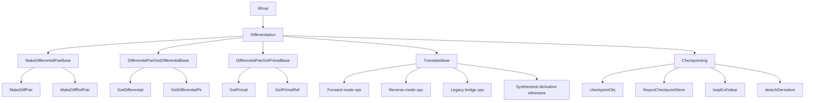

# Differentiation

This page is the per-opcode reference for the Slang IR opcodes used
by the automatic-differentiation passes: opcodes that construct and
project differential pairs, opcodes that turn a function value into
its forward or reverse-mode derivative, opcodes that thread the
reverse-mode primal context through the call graph, and opcodes that
support checkpointing and rematerialization.

The intended reader is a compiler engineer working on the autodiff
passes (`slang-ir-autodiff*.cpp`) or on emit paths that need to
understand a partially-differentiated IR.

## Source

The differential-pair construction / projection opcodes live in
their own three Lua intermediate groups around lines 900-931 of
[slang-ir-insts.lua](../../../source/slang/slang-ir-insts.lua):
`MakeDifferentialPairBase`, `DifferentialPairGetDifferentialBase`,
and `DifferentialPairGetPrimalBase`. The bulk of the
differentiation-operator opcodes (`ForwardDifferentiate`,
`BackwardDifferentiate`, the propagate / primal / remat variants,
and the legacy-bridge opcodes) live under the `TranslateBase`
hoistable group at line ~2561. Two additional opcodes that are
specific to checkpointing — `checkpointObj`,
`ReportCheckpointStore`, and `loopExitValue` — live in the
value-producing section (around lines 1448-1465). A handful of
related opcodes are documented in sibling pages: the differential
pair *types* are in [types.md](types.md); generic-annotation opcodes
that mark differentiable types (`DifferentiableTypeAnnotation`,
`DifferentiableTypeDictionaryItem`) are in [misc.md](misc.md).

C++ wrappers are declared in
[slang-ir-insts.h](../../../source/slang/slang-ir-insts.h). The
opcodes are introduced primarily by the autodiff IR passes
(`slang-ir-autodiff-fwd.cpp`, `slang-ir-autodiff-rev.cpp`,
`slang-ir-autodiff-unzip.cpp`,
`slang-ir-autodiff-transcribe.cpp`, and friends); a small number
are produced by
[slang-lower-to-ir.cpp](../../../source/slang/slang-lower-to-ir.cpp)
when lowering the user-facing `__fwd_diff` and `__bwd_diff`
syntactic forms.

## Family hierarchy

## Opcodes

### Differential-pair construction

`MakeDifferentialPairBase` groups the two opcodes that bundle a
primal value and its differential into a single pair value. The
opcodes have matching `*Ref` siblings for pair-of-pointers — used
when both halves of the pair need to remain addressable.

| Opcode | C++ wrapper | Operands | Flags | AST origin | Summary |
| --- | --- | --- | --- | --- | --- |
| `MakeDiffPair` | `MakeDifferentialPair` | `primal, differential` | | (synthesized) | Pairs a value-typed primal with its differential. |
| `MakeDiffRefPair` | `MakeDifferentialPtrPair` | `primal, differential` | | (synthesized) | Pairs a pointer-typed primal with its differential pointer. |

### Differential-pair projection

`DifferentialPairGetDifferentialBase` projects the differential
half; `DifferentialPairGetPrimalBase` projects the primal half. The
`*Ptr` / `*Ref` variants accept pair-of-pointer values.

| Opcode | C++ wrapper | Operands | Flags | AST origin | Summary |
| --- | --- | --- | --- | --- | --- |
| `GetDifferential` | `DifferentialPairGetDifferential` | `pair` | | (synthesized) | Reads the differential component of a `DiffPair`. |
| `GetDifferentialPtr` | `DifferentialPtrPairGetDifferential` | (variadic, `min=1`) | | (synthesized) | Reads the differential pointer of a `DiffRefPair`. |
| `GetPrimal` | `DifferentialPairGetPrimal` | `pair` | | (synthesized) | Reads the primal component of a `DiffPair`. |
| `GetPrimalRef` | `DifferentialPtrPairGetPrimal` | `ptrPair` | | (synthesized) | Reads the primal pointer of a `DiffRefPair`. |

### Differentiation operators

The `TranslateBase` group holds every opcode that *translates* a
function value (or witness table) into a differentiated form. All
are hoistable so identical translation requests dedupe to one IR
value.

#### Forward-mode

| Opcode | C++ wrapper | Operands | Flags | AST origin | Summary |
| --- | --- | --- | --- | --- | --- |
| `ForwardDifferentiate` | — | `baseFn` | H | `ForwardDifferentiateExpr` (`__fwd_diff(...)`) in `slang-lower-to-ir.cpp` | Translates a function value into its forward-mode derivative. |
| `ForwardDifferentiatePropagate` | — | (variadic, `min=1`) | H | (synthesized) | Forward-mode propagate variant produced during the unzip / transcribe pipeline. |
| `TrivialForwardDifferentiate` | — | (variadic, `min=1`) | H | (synthesized) | Forward derivative of a function known to be a no-op on derivatives (e.g. a non-differentiable helper). |

#### Reverse-mode

| Opcode | C++ wrapper | Operands | Flags | AST origin | Summary |
| --- | --- | --- | --- | --- | --- |
| `BackwardDifferentiate` | — | (variadic, `min=3`) | H | `BackwardDifferentiateExpr` (`__bwd_diff(...)`) in `slang-lower-to-ir.cpp` | Translates a function value into its reverse-mode adjoint. |
| `BackwardDifferentiatePrimal` | — | (variadic, `min=1`) | H | (synthesized) | Primal-only side of the reverse-mode pair, used to compute the values reverse mode needs to remember. |
| `BackwardDifferentiatePropagate` | — | (variadic, `min=1`) | H | (synthesized) | Backwards-propagation side of the reverse-mode pair; produces the adjoint update. |
| `BackwardRemat` | — | (variadic, `min=1`) | H | (synthesized) | Rematerialization variant: recomputes primal values rather than reading them from a checkpoint. |
| `TrivialBackwardDifferentiate` | — | (variadic, `min=1`) | H | (synthesized) | Trivial-adjoint counterpart of `TrivialForwardDifferentiate`. |
| `TrivialBackwardDifferentiatePrimal` | — | (variadic, `min=1`) | H | (synthesized) | Trivial primal side. |
| `TrivialBackwardDifferentiatePropagate` | — | (variadic, `min=1`) | H | (synthesized) | Trivial propagate side. |
| `TrivialBackwardRemat` | — | (variadic, `min=1`) | H | (synthesized) | Trivial remat side. |

#### Legacy bridge

These opcodes exist solely to map the historical "single function
bundles primal + propagate" representation onto the current
unzipped form. New code should not produce them; they are consumed
by the legacy-bridge pass and replaced with their non-legacy
counterparts.

| Opcode | C++ wrapper | Operands | Flags | AST origin | Summary |
| --- | --- | --- | --- | --- | --- |
| `LegacyBackwardDifferentiate` | — | (variadic, `min=3`) | H | (synthesized) | Old-style reverse-mode opcode kept for backward-compat IR loads. |
| `BackwardFromLegacyBwdDiffFunc` | — | (variadic, `min=2`) | H | (synthesized) | Wraps a legacy combined reverse function as the current form. |
| `BackwardPrimalFromLegacyBwdDiffFunc` | — | (variadic, `min=2`) | H | (synthesized) | Extracts the primal half from a legacy combined function. |
| `BackwardRematFromLegacyBwdDiffFunc` | — | (variadic, `min=2`) | H | (synthesized) | Extracts the remat half. |
| `BackwardPropagateFromLegacyBwdDiffFunc` | — | (variadic, `min=2`) | H | (synthesized) | Extracts the propagate half. |

#### Synthesized derivative witnesses

| Opcode | C++ wrapper | Operands | Flags | AST origin | Summary |
| --- | --- | --- | --- | --- | --- |
| `FunctionCopy` | — | (variadic, `min=1`) | H | (synthesized) | Produces a cloned copy of a function used as the seed for a synthesized derivative. |
| `SynthesizedForwardDerivativeWitnessTable` | — | (variadic, `min=1`) | H | (synthesized) | Witness table mapping `IDifferentiable.dAdd` etc. onto a synthesized forward derivative. |
| `SynthesizedBackwardDerivativeWitnessTable` | — | (variadic, `min=1`) | H | (synthesized) | Witness table for a synthesized reverse-mode derivative. |
| `MakeIDifferentiableWitness` | — | (variadic, `min=1`) | H | (synthesized) | Builds an `IDifferentiable` witness for a type that does not declare one. |
| `SynthesizedBackwardDerivativeWitnessTableFromLegacyBwdDiffFunc` | — | (variadic, `min=2`) | H | (synthesized) | Bridges legacy combined reverse functions into the modern witness form. |

### Checkpointing and rematerialization

Reverse-mode autodiff frequently needs to read primal values at
points where they no longer naturally live. The checkpointing
opcodes record candidate stores and a marker pass either keeps them
live or replaces them with rematerialized recomputations.

| Opcode | C++ wrapper | Operands | Flags | AST origin | Summary |
| --- | --- | --- | --- | --- | --- |
| `checkpointObj` | `CheckpointObject` | (variadic, `min=1`) | | (synthesized) | Marks an object value as a candidate for primal-side checkpointing. |
| `loopExitValue` | — | (variadic, `min=1`) | | (synthesized) | Records the value of an SSA variable at a loop-exit point so reverse mode can read it. |
| `ReportCheckpointStore` | — | `storedType, originalFunc, storeRef` | | (synthesized) | Diagnostic-style marker that a checkpoint store was inserted; `storeRef` becomes `Poison` if the store is later eliminated. |
| `detachDerivative` | — | `value` | | `DetachDerivativeExpr` (`detach(...)`) in `slang-lower-to-ir.cpp` | Returns the operand unchanged but blocks derivative propagation through it. |

## Notable opcodes

### `MakeDiffPair`

`MakeDiffPair` is the IR encoding of constructing a differential
pair `{primal, differential}`. Its result type is a
`DifferentialPairType` (see [types.md](types.md)). The autodiff
forward-mode pass inserts `MakeDiffPair` calls whenever a primal
flows alongside its derivative, and the reverse-mode pass uses it
when stitching back together values that were temporarily split.

### `ForwardDifferentiate`

`ForwardDifferentiate(baseFn)` produces a function value whose
behavior is the JVP (Jacobian-vector product) of `baseFn`. It is the
only differentiation opcode the user can directly produce from
source — the `__fwd_diff` syntactic form lowers to it.
Specialization replaces the opcode with the actual JVP function
once `baseFn` is fully known. The opcode is hoistable so that two
`__fwd_diff` references to the same function dedupe.

### `BackwardDifferentiate`

`BackwardDifferentiate` is the reverse-mode counterpart of
`ForwardDifferentiate`: it produces an adjoint function. Reverse
mode is split internally into primal, propagate, and remat phases —
the standalone `BackwardDifferentiate` opcode bundles all three for
the user-facing surface. The autodiff *unzip* pass converts each
`BackwardDifferentiate` into a triple of
`BackwardDifferentiatePrimal`, `BackwardDifferentiatePropagate`, and
`BackwardRemat` (or their trivial-variant counterparts) so that
later passes can rearrange the three phases independently.

### `BackwardDifferentiatePropagate`

The opcode that carries the reverse-mode adjoint update through the
call graph. Its result is a function whose signature accepts the
recorded primal-side state plus an output-adjoint and produces the
input-adjoints. The propagate-context family in [types.md](types.md)
defines the typed channels through which the state flows.

### `checkpointObj` and `ReportCheckpointStore`

`checkpointObj` marks an object value as a candidate for primal-side
checkpointing; the checkpoint pass either keeps the value live (via
ordinary use chains) or replaces it with a recomputation. The
companion `ReportCheckpointStore` records the *intent* to store —
its `storeRef` operand is a weak reference that becomes `Poison`
when the underlying store is optimized away, which the reporting
pass surfaces back to the user.

### `detachDerivative`

`detachDerivative(value)` is the IR form of the user-facing
`detach(...)` call. It returns its operand unchanged but blocks any
derivative-propagation pass from following the use; the value is
treated as a constant from the autodiff system's point of view.
Useful when the user wants to participate in differentiation only
through some operands of an expression.

## See also

- [../cross-cutting/ir-instructions.md](../cross-cutting/ir-instructions.md)
  — schema, op flags, hoistable / parent conventions.
- [types.md](types.md) — the `DifferentialPairTypeBase` and
  `TranslatedTypeBase` type families that these opcodes operate
  on, plus the `*FuncType` family for the differentiated function
  signatures.
- [values.md](values.md) — ordinary value-producing opcodes that
  the autodiff passes leave in place around the synthesized
  differentiation opcodes.
- [misc.md](misc.md) — `DifferentiableTypeAnnotation` and
  `DifferentiableTypeDictionaryItem`, the annotation-side opcodes
  that the autodiff passes attach to types.
- [../pipeline/05-ir-passes.md](../pipeline/05-ir-passes.md) — the
  forward / reverse / unzip / transcribe pass sequence and how each
  consumes and produces the opcodes documented here.
- [../../design/autodiff.md](../../design/autodiff.md) — design
  rationale for the split into primal / propagate / remat phases
  and for the checkpointing model.
- [../glossary.md](../glossary.md) — definitions of `differential
  pair`, `hoistable instruction`, `parent instruction`.
