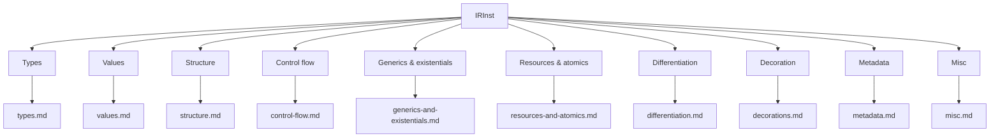

# IR Reference

This subtree of `docs/llm-generated/` is a per-family reference for the
Slang Intermediate Representation. Every opcode declared in
[../../../source/slang/slang-ir-insts.lua](../../../source/slang/slang-ir-insts.lua)
appears in exactly one family page below, tabulated with its C++ wrapper
struct (from [../../../source/slang/slang-ir-insts.h](../../../source/slang/slang-ir-insts.h)),
its operand shape, its op-flags (`H` hoistable, `P` parent, `G` global),
the AST node(s) that lower into it (sourced from
[../../../source/slang/slang-lower-to-ir.cpp](../../../source/slang/slang-lower-to-ir.cpp)),
and a one-line summary. Notable opcodes that carry semantics a table row
cannot convey have short call-outs further down each page.

The family pages are intentionally narrow: they describe *shape and
provenance*, not *behaviour of the passes that consume the IR*. For
the conventions every opcode obeys (schema, flag bits, hoistable/global
deduplication, module versioning, the workflow for adding a new opcode),
see [../cross-cutting/ir-instructions.md](../cross-cutting/ir-instructions.md).
For when AST nodes lower to IR and which lowering helpers run, see
[../pipeline/04-ast-to-ir.md](../pipeline/04-ast-to-ir.md). For what the
IR passes do afterwards, see
[../pipeline/05-ir-passes.md](../pipeline/05-ir-passes.md).

## Family taxonomy

## Pages

| Page | Family | Lua entry root | Approx. opcodes |
| --- | --- | --- | --- |
| [types.md](types.md) | Type instructions | `Type` (line ~20) | ~160 |
| [values.md](values.md) | Constants, arithmetic, conversions, memory, aggregate constructors | `Constant` (line ~838) and top-level value opcodes | ~110 |
| [structure.md](structure.md) | Module structure: functions, generics, globals, structs, interfaces, witness tables | `GlobalValueWithCode` (line ~787), `module` (line ~827) | ~20 |
| [control-flow.md](control-flow.md) | Block, parameters, branches, function exits | `TerminatorInst` (line ~1292) + `block` / `Param` at top level | ~20 |
| [generics-and-existentials.md](generics-and-existentials.md) | `specialize`, witness lookup, existential pack/unpack, RTTI | Top-level (e.g. `specialize` ~line 879, `lookupWitness` ~line 962) | ~30 |
| [resources-and-atomics.md](resources-and-atomics.md) | Image/buffer/sampler ops, shader IO, atomics, barriers, wave intrinsics, raytracing | `AtomicOperation` (line ~1071) + top-level resource opcodes | ~80 |
| [differentiation.md](differentiation.md) | Autodiff: differential pairs, forward/backward differentiate, reverse-mode contexts | `MakeDifferentialPairBase` (line ~901) + top-level autodiff opcodes | ~30 |
| [decorations.md](decorations.md) | Decoration family (metadata attached to instructions) | `Decoration` (line ~1592) | ~180 |
| [metadata.md](metadata.md) | `Layout`, `Attr`, `Debug*`, `SPIRVAsmOperand` | `Layout` (line ~2617), `Attr` (line ~2650), `Debug*` (line ~2714), `SPIRVAsmOperand` (line ~2754) | ~60 |
| [misc.md](misc.md) | Pack/expansion, type queries, size/alignment, liveness markers, descriptor heaps, kernel launch | Top-level miscellaneous opcodes | ~50 |

Counts are approximate, rounded to the nearest ten at the
`source_commit` recorded in this file's front-matter. They count
`struct_name = "..."` entries plus bare opcode entries that fall into
the family in
[../../../source/slang/slang-ir-insts.lua](../../../source/slang/slang-ir-insts.lua).
The exact count drifts as opcodes are added, removed, or moved between
families; the regeneration pipeline surfaces mismatches as staleness.

## How AST nodes lower to IR

The "AST origin" column on every family page identifies which AST node
classes lower into a given opcode. Those mappings come from the ~165
`visit*` member functions in
[../../../source/slang/slang-lower-to-ir.cpp](../../../source/slang/slang-lower-to-ir.cpp)
(for example, `visitVarDecl` emits `Var`, `visitInfixExpr` dispatches
to arithmetic opcodes such as `Add`, `Sub`, `Mul`). For the AST side
of that mapping see the [../ast-reference/](../ast-reference/) subtree,
in particular [../ast-reference/expressions.md](../ast-reference/expressions.md),
[../ast-reference/statements.md](../ast-reference/statements.md), and
[../ast-reference/declarations.md](../ast-reference/declarations.md).

Many opcodes have no direct AST source: they are produced by IR
passes (specialization, autodiff, generics legalization, address-space
inference, SPIR-V emit fix-ups) and may even be retired before code
emission. Such opcodes carry `(synthesized)` or `—` in the AST-origin
column on each family page.

## Cross-cutting topics

- [../pipeline/04-ast-to-ir.md](../pipeline/04-ast-to-ir.md) —
  AST-to-IR lowering pipeline; how `IRBuilder`, `IRGenContext`, and
  the `visit*` methods translate AST into IR.
- [../pipeline/05-ir-passes.md](../pipeline/05-ir-passes.md) —
  the IR passes that legalize, specialize, and optimize the IR.
- [../pipeline/06-emit.md](../pipeline/06-emit.md) — how target
  emitters consume legalized IR.
- [../cross-cutting/ir-instructions.md](../cross-cutting/ir-instructions.md)
  — IR schema, op-flag conventions, hoistable/global deduplication,
  module versioning, and the workflow for adding a new opcode.
- [../cross-cutting/serialization.md](../cross-cutting/serialization.md)
  — how IR modules are serialized.
- [../cross-cutting/diagnostics.md](../cross-cutting/diagnostics.md)
  — IR instructions carry `SourceLoc`s through the diagnostic system.
- [../glossary.md](../glossary.md) — definitions of `IRInst`, `IROp`,
  `IRBuilder`, `IRModule`, `parent instruction`, `terminator
  instruction`, `block parameter`, `decoration`, `hoistable
  instruction`, `target intrinsic`, `differential pair`, `witness
  table`, `existential type`, `specialization`, `single static
  assignment (SSA)`.

## How to navigate

Start at [../cross-cutting/ir-instructions.md](../cross-cutting/ir-instructions.md)
if you are new to the IR: it covers schema, op-flag bits, and module
versioning that every family page below assumes. Then jump straight
to the family page for the opcode you care about. Each family page
opens with a `## Source` paragraph that links to the relevant Lua
entry range and to the `slang-lower-to-ir.cpp` visitors that produce
opcodes in that family.

Within a family page, the `## Opcodes` table is the canonical index.
Abstract intermediate Lua entries (such as `BasicType`,
`MakeDifferentialPairBase`, `TerminatorInst`, the abstract `Decoration`
root) only appear in the `## Family hierarchy` diagrams; they do not
appear as table rows. Notable opcodes whose semantics cannot fit in a
row of the table have a short `## Notable opcodes` call-out further
down the page.

The `AST origin` column is sourced from
[../../../source/slang/slang-lower-to-ir.cpp](../../../source/slang/slang-lower-to-ir.cpp);
when it shows `(synthesized)` the opcode is produced by an IR pass
rather than by lowering, and when it shows `—` no AST mapping was
located in the watched paths.
