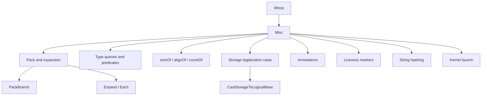

# Miscellaneous

This page is the catch-all reference for Slang IR opcodes that do
not naturally belong in any of the sibling `ir-reference/` family
pages: variadic-generic value-pack helpers, type-introspection
predicates, compile-time size/align/count queries, storage-type
legalization casts, generic annotation infrastructure, liveness
markers, string hashing, and CPU-side kernel launches.

The intended reader is a compiler engineer who needs to look up one
of these opcodes and could not find it in
[types.md](types.md), [values.md](values.md),
[control-flow.md](control-flow.md), [structure.md](structure.md),
[generics-and-existentials.md](generics-and-existentials.md),
[resources-and-atomics.md](resources-and-atomics.md),
[differentiation.md](differentiation.md),
[decorations.md](decorations.md), or [metadata.md](metadata.md).

## Source

The opcodes documented here are scattered throughout
[slang-ir-insts.lua](../../../source/slang/slang-ir-insts.lua) rather
than living in one named group. C++ wrappers (where they exist) are
declared in
[slang-ir-insts.h](../../../source/slang/slang-ir-insts.h), and the
infrastructure they rely on (`IRInst`, op-flag bitfield, `IRBuilder`)
is in
[slang-ir.h](../../../source/slang/slang-ir.h) and
[slang-ir.cpp](../../../source/slang/slang-ir.cpp). Lowering helpers
in
[slang-lower-to-ir.cpp](../../../source/slang/slang-lower-to-ir.cpp)
produce a handful of these opcodes from explicit AST nodes; the
majority are `(synthesized)` — they are introduced by IR passes such
as `slang-ir-lower-buffer-element-type.cpp`,
`slang-ir-autodiff*.cpp`, `slang-ir-liveness.cpp`, and others.

## Family hierarchy

## Opcodes

### Pack and expansion

These opcodes implement the runtime mechanics behind Slang's
variadic-generic value packs. The `MakeWitnessPack` / `makeValuePack`
constructors and the `Expand` / `Each` projection pair are the two
sides of pack manipulation; the `ExtractFirst` / `ExtractLast` /
`Trim*` / `Shape*` helpers manipulate pack shapes for tensor-style
indexing.

| Opcode | C++ wrapper | Operands | Flags | AST origin | Summary |
| --- | --- | --- | --- | --- | --- |
| `Expand` | — | `value` | | `ExpandExpr` (variadic generic expansion in `slang-lower-to-ir.cpp`) | Expands a value pack inline at the use site. |
| `Each` | — | `value` | H | (synthesized) | Iterates one slot of a value pack; pairs with `Expand` and is introduced by the variadic-generic lowering pass. |
| `MakeWitnessPack` | — | (variadic) | H | (synthesized) | Bundles a sequence of witness tables into a single witness pack value. |
| `makeValuePack` | — | (variadic) | H | (synthesized) | Bundles a sequence of values into a value pack. |
| `PackBranch` | — | `pack, emptyValue, nonEmptyValue` | H | (synthesized) | Selects between two values depending on whether the pack is empty; used to special-case the zero-element pack. |
| `ExtractFirstFromPack` | — | `pack, witness` | H | (synthesized) | Returns the first slot of a non-empty pack. |
| `ExtractLastFromPack` | — | `pack, witness` | H | (synthesized) | Returns the last slot of a non-empty pack. |
| `TrimFirstOfPack` | — | `pack, witness` | H | (synthesized) | Returns a pack with the first slot removed. |
| `TrimLastOfPack` | — | `pack, witness` | H | (synthesized) | Returns a pack with the last slot removed. |
| `ShapeConcat` | — | `leftPack, rightPack, axis` | H | (synthesized) | Concatenates two pack shapes along an axis. |
| `ShapePermute` | — | `pack, order` | H | (synthesized) | Permutes the dimensions of a pack shape. |
| `ShapeSwap` | — | `pack, dim0, dim1` | H | (synthesized) | Swaps two dimensions of a pack shape. |
| `ShapeReduce` | — | `pack, axis` | H | (synthesized) | Drops one axis from a pack shape. |
| `NonEmptyPackWitness` | — | `pack` | H | (synthesized) | Witness value proving a pack has at least one element. |
| `DiffTypeInfo` | — | (variadic) | H | (synthesized) | Holds witness tables for differential type info; lowered to `MakeTuple` after specialization. Also touched by [differentiation.md](differentiation.md). |

### Type queries and predicates

Compile-time inspection of an IR value's type, used both by
`slang-ir-specialize.cpp` and by user-level conditionally-typed
intrinsics.

| Opcode | C++ wrapper | Operands | Flags | AST origin | Summary |
| --- | --- | --- | --- | --- | --- |
| `IsType` | — | `value, valueWitness, typeOperand, targetWitness?` | | `IsTypeExpr` (the `is` operator) in `slang-lower-to-ir.cpp` | Tests whether a value's runtime type is (or conforms to) a given target type. |
| `TypeEquals` | — | `type1, type2` | | (synthesized) | Boolean test of structural type equality. |
| `IsInt` | — | `value` | | (synthesized) | True if the operand's type is one of the integer scalar types. |
| `IsBool` | — | `value` | | (synthesized) | True if the operand's type is `bool`. |
| `IsFloat` | — | `value` | | (synthesized) | True if the operand's type is a floating-point scalar. |
| `IsCoopFloat` | — | `value` | | (synthesized) | True if the operand's type is a floating-point or packed-FP type (`fp8`, `bf16`). |
| `IsHalf` | — | `value` | | (synthesized) | True if the operand's type is `half`. |
| `IsUnsignedInt` | — | `value` | | (synthesized) | True if the operand's type is an unsigned integer. |
| `IsSignedInt` | — | `value` | | (synthesized) | True if the operand's type is a signed integer. |
| `IsVector` | — | `value` | | (synthesized) | True if the operand's type is a vector. |

### Size, alignment, count

Compile-time queries on a type or array, evaluated during IR passes
and constant-folded before backend emission.

| Opcode | C++ wrapper | Operands | Flags | AST origin | Summary |
| --- | --- | --- | --- | --- | --- |
| `sizeOf` | — | `type, dataLayout?` | H | `SizeOfLikeExpr` in `slang-lower-to-ir.cpp` | Compile-time size in bytes of the operand type. |
| `alignOf` | — | `baseOp, dataLayout?` | H | `AlignOfExpr` in `slang-lower-to-ir.cpp` | Compile-time alignment of the operand type. |
| `countOf` | — | `type` | | `CountOfLikeExpr` in `slang-lower-to-ir.cpp` | Compile-time element count of a fixed-size array or vector type. |
| `GetArrayLength` | — | `array` | | `ArrayLengthExpr` (runtime path) in `slang-lower-to-ir.cpp` | Returns the length of a fixed or runtime-sized array. |

### Storage-type legalization casts

Introduced by the `slang-ir-lower-buffer-element-type.cpp` pass to
convert between user-declared types and the storage-layout types
required by buffer locations on each target. Descriptor-handle casts
let the legalizer move between opaque resource handles and the
`uint64_t` representation some targets use.

| Opcode | C++ wrapper | Operands | Flags | AST origin | Summary |
| --- | --- | --- | --- | --- | --- |
| `CastStorageToLogicalBase` | `CastStorageToLogicalBase` | (variadic, `min=2`) | | (synthesized) | Parent of the storage/logical cast pair; never instantiated directly. |
| `CastStorageToLogical` | `CastStorageToLogical` | (variadic, `min=2`) | | (synthesized) | Converts a value from its storage type to its logical type at a buffer boundary. |
| `CastStorageToLogicalDeref` | `CastStorageToLogicalDeref` | (variadic, `min=2`) | | (synthesized) | Same as `CastStorageToLogical` but consuming a pointer; produces a value of the logical type. |
| `MakeStorageTypeLoweringConfig` | — | `addressSpace, layoutRule, lowerToPhysicalType` | H | (synthesized) | Encodes the lowering policy used by the two casts above. Hoistable so identical policies dedupe to one inst. |
| `CastUInt64ToDescriptorHandle` | — | `value` | | (synthesized) | Reinterprets a `uint64_t` as an opaque descriptor handle. |
| `CastDescriptorHandleToUInt64` | — | `value` | | (synthesized) | Reverse of `CastUInt64ToDescriptorHandle`. |
| `CastDescriptorHandleToResource` | — | `handle` | | (synthesized) | No-op cast on targets where resource handles are already concrete types. |
| `CastResourceToDescriptorHandle` | — | `resource` | | (synthesized) | Reverse of `CastDescriptorHandleToResource`. |
| `TreatAsDynamicUniform` | — | `value` | | (synthesized) | Annotation cast marking a value as dynamically uniform; affects target legalization. |
| `GetLegalizedSPIRVGlobalParamAddr` | — | (variadic, `min=1`) | | (synthesized) | Returns the legalized address of a global parameter for the SPIR-V backend. |

### Annotations

Generic annotation opcodes used by IR passes to attach extra
information to other instructions without modifying them. Most are
introduced by the differentiation passes (see
[differentiation.md](differentiation.md)) but the underlying
mechanism is general.

| Opcode | C++ wrapper | Operands | Flags | AST origin | Summary |
| --- | --- | --- | --- | --- | --- |
| `Annotation` | — | (variadic, `min=2`) | H | (synthesized) | Generic annotation parent; subject inst plus annotation payload. |
| `WitnessTableAnnotation` | — | (variadic, `min=2`) | H | (synthesized) | Attaches a witness table to another inst; marked TODO in the Lua file. |
| `DifferentiableTypeAnnotation` | — | `baseType, witness` | H | (synthesized) | Annotates a type with a `IDifferentiable` witness, for run-time differentiable types. |
| `DifferentiableTypeDictionaryItem` | — | `concreteType, witness` | | (synthesized) | One entry in the differentiable-type dictionary used by autodiff. |

### Liveness markers

Introduced by the liveness pass to bracket the live range of a
value; used by later passes (autodiff rematerialization, register
allocation hints) to reason about lifetimes.

| Opcode | C++ wrapper | Operands | Flags | AST origin | Summary |
| --- | --- | --- | --- | --- | --- |
| `LiveRangeMarker` | — | — | | (synthesized) | Parent of the start / end pair; not instantiated directly. |
| `liveRangeStart` | — | (variadic, `min=2`) | | (synthesized) | Marks the beginning of a value's live range. |
| `liveRangeEnd` | — | — | | (synthesized) | Marks the end of a value's live range. |

### String hashing

| Opcode | C++ wrapper | Operands | Flags | AST origin | Summary |
| --- | --- | --- | --- | --- | --- |
| `getStringHash` | — | `stringLit: IRStringLit` | | `GetStringHashExpr` in `slang-lower-to-ir.cpp` | Compile-time stable hash of a string literal; used by reflection and capability code paths. |

### Kernel launch

CPU-side launch opcodes produced by the host-shader / CUDA backends.

| Opcode | C++ wrapper | Operands | Flags | AST origin | Summary |
| --- | --- | --- | --- | --- | --- |
| `DispatchKernel` | — | `baseFn, threadGroupSize, dispatchSize` | | (synthesized) | Generic kernel-dispatch op produced by the host-side lowering. |
| `CudaKernelLaunch` | — | `kernel, gridDimX, gridDimY, gridDimZ, blockDimX, blockDimY` | | (synthesized) | CUDA-specific kernel-launch op consumed by [slang-emit-cuda.cpp](../../../source/slang/slang-emit-cuda.cpp). |

## Notable opcodes

### `Each`

`Each` projects one slot of a value pack and is the dual of
`Expand`. The pair lets a generic body manipulate variadic parameters
without flattening the pack: `Expand` introduces an iteration scope
over a pack, and `Each` reads the per-slot value inside that scope.
The variadic-generic specialization pass replaces matched
`Expand`/`Each` pairs with one ordinary instruction per slot after
the pack length is known.

### `PackBranch`

`PackBranch` is a static three-way conditional on whether its
`pack` operand is empty: when the pack length is statically zero the
result is `emptyValue`, otherwise it is `nonEmptyValue`. The pass
that lowers variadic generics uses this opcode to emit one code path
for the zero-element pack and another for the non-empty case so that
later code never has to special-case `pack.length == 0` at runtime.

### `MakeWitnessPack`

The witness-pack analogue of `makeValuePack`: takes a sequence of
witness-table operands and produces a single witness-pack value of
the corresponding pack type. The IR passes that drive interface
dispatch through generics rely on witness packs to keep the
parameter list of a generic compact when several conformance witnesses
need to travel together.

### `IsType`

The IR encoding of the user-level `is` operator on existentials and
dynamic interfaces. The four-operand form (`value`, `valueWitness`,
`typeOperand`, optional `targetWitness`) carries enough information
that the pass that lowers existentials can either fold the test to a
constant (when the target type is statically known to match) or
emit a runtime tag comparison.

### `CastStorageToLogicalBase`

This base opcode (with its `CastStorageToLogical` and
`CastStorageToLogicalDeref` children) is the IR-level encoding of
the boundary between a buffer's *storage* layout (governed by target
data-layout rules) and the *logical* layout the user wrote. Both
children take a `MakeStorageTypeLoweringConfig` operand that pins
down the address space, layout rule, and whether the logical type
should be lowered to its physical form. The casts are introduced by
`slang-ir-lower-buffer-element-type.cpp` and consumed during emit;
intermediate passes treat them as opaque conversions.

### `CudaKernelLaunch`

The CUDA-specific kernel-launch opcode produced by the host-side
lowering when a Slang program targets CUDA. The operand list mirrors
the CUDA driver-API launch signature: kernel function, three grid
dimensions, and (currently) two block dimensions. The opcode is
consumed by
[slang-emit-cuda.cpp](../../../source/slang/slang-emit-cuda.cpp);
no IR pass introspects it.

### `Annotation`

`Annotation` is the generic two-operand annotation opcode (subject
inst plus payload). Subclasses such as `DifferentiableTypeAnnotation`
and `WitnessTableAnnotation` specialize the payload shape. Pass
authors who need to attach side-information without inventing a new
decoration use `Annotation` as a lightweight alternative.

## See also

- [../cross-cutting/ir-instructions.md](../cross-cutting/ir-instructions.md)
  — the schema, op flags, hoistable / global / parent conventions,
  and the "add an opcode" workflow.
- [types.md](types.md) — the type opcodes that some of the queries
  above operate on (`sizeOf`, `alignOf`, `IsType`, ...).
- [values.md](values.md) — ordinary value-producing opcodes that
  some misc opcodes look similar to but were sorted there for
  clarity.
- [generics-and-existentials.md](generics-and-existentials.md) — the
  generic / existential machinery the pack helpers cooperate with.
- [differentiation.md](differentiation.md) — the autodiff family
  that introduces most of the `Differentiable*Annotation` opcodes.
- [../pipeline/04-ast-to-ir.md](../pipeline/04-ast-to-ir.md) — the
  AST-to-IR step that produces the few non-synthesized opcodes here.
- [../pipeline/05-ir-passes.md](../pipeline/05-ir-passes.md) — the
  IR passes that introduce the `(synthesized)` opcodes.
- [../glossary.md](../glossary.md) — definitions of `parent
  instruction`, `hoistable instruction`, `value pack`,
  `target intrinsic`.
