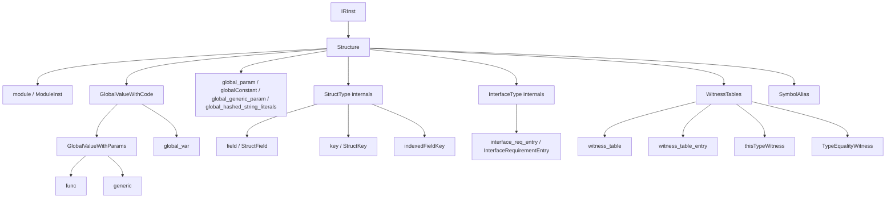

# Structure

This page is the per-opcode reference for IR opcodes that organize
the module: the module itself, functions and generics, global
variables and constants, struct / class / interface containers, and
the witness-table machinery that connects them.

The intended reader is a compiler engineer reading IR around a
function or type definition, or writing an IR pass that walks the
top-level structure of a module.

## Source

The structural opcodes live in two clusters of
[slang-ir-insts.lua](../../../source/slang/slang-ir-insts.lua):

- The `GlobalValueWithCode` group plus the module, struct-key,
  witness-table, and witness-fact opcodes occupy lines ~786-834
  (and overlap conceptually with the type-side `StructType` /
  `InterfaceType` / `ClassType` declarations around lines 645-666).
- The `param`, `field`, `call`, `witness_table_entry`,
  `interface_req_entry` opcodes, plus the structural body of a
  function, occupy lines ~1042-1056.

C++ wrappers are declared in
[slang-ir-insts.h](../../../source/slang/slang-ir-insts.h). The
infrastructure (`IRInst`, `IRBuilder::createFunc`,
`IRBuilder::createGeneric`, `IRBuilder::createModule`, ...) is in
[slang-ir.h](../../../source/slang/slang-ir.h) and
[slang-ir.cpp](../../../source/slang/slang-ir.cpp).

Lowering from the AST is in
[slang-lower-to-ir.cpp](../../../source/slang/slang-lower-to-ir.cpp):
`lowerProgram` (module), `lowerFuncDecl` and `lowerCallableDecl`
(functions), `lowerGenericDecl` (generics), `lowerStructDecl`
(struct types), `lowerInterfaceDecl` (interface types),
`lowerInheritanceDecl` (witness tables), `lowerGlobalVarDecl`
(global variables).

## Family hierarchy

## Opcodes

### Module

| Opcode | C++ wrapper | Operands | Flags | AST origin | Summary |
| --- | --- | --- | --- | --- | --- |
| `module` | `ModuleInst` | (variadic) | P | `ModuleDecl` lowering in `slang-lower-to-ir.cpp` | Top-level container; children are every other top-level instruction. |

### Functions and generics

| Opcode | C++ wrapper | Operands | Flags | AST origin | Summary |
| --- | --- | --- | --- | --- | --- |
| `func` | `IRFunc` | (variadic) | P | `FuncDecl`, `AccessorDecl`, lambda lowering in `slang-lower-to-ir.cpp` | Function; children are blocks. The first block's `Param`s are the function parameters; the function signature is on the `func` itself via its type. |
| `generic` | `IRGeneric` | (variadic) | P | `GenericDecl` in `slang-lower-to-ir.cpp` | Function-shaped instruction whose single block computes a type-level value; ends with `yield`. |
| `param` | `IRParam` | (variadic) | | `ParamDecl`, block-parameter introduction | Function or block parameter declared inside a `func`/`generic` or `block` parent. Documented in detail in [control-flow.md](control-flow.md). |
| `call` | — | `callee, args...` | | `InvokeExpr` in `slang-lower-to-ir.cpp` | Calls `callee` with the remaining operands as arguments; result type is the callee's return type. |

### Global state

| Opcode | C++ wrapper | Operands | Flags | AST origin | Summary |
| --- | --- | --- | --- | --- | --- |
| `global_var` | `IRGlobalVar` | (variadic) | G | `VarDecl` at module scope in `slang-lower-to-ir.cpp` | Module-scope mutable variable. |
| `global_param` | — | (variadic) | G | Entry-point and module-scope parameter declarations | Module-scope parameter (shader uniform, push-constant, ...). |
| `globalConstant` | — | (variadic) | G | `VarDecl` with `const`/`static const` at module scope | Module-scope constant value. |
| `global_generic_param` | — | — | G | `GenericTypeParamDecl` at module scope | Declares a generic parameter at module level. |
| `global_hashed_string_literals` | — | (variadic) | | (synthesized) | Container for the module's hashed-string-literal pool. |

### Struct internals

The `StructType` *type* opcode is documented as a type in
[types.md](types.md); here we describe its role as a parent
container that owns `field` and `key` children.

| Opcode | C++ wrapper | Operands | Flags | AST origin | Summary |
| --- | --- | --- | --- | --- | --- |
| `StructType` (parent) | `IRStructType` | (children: `field`, `key`) | P | `StructDecl` in `slang-lower-to-ir.cpp` | Owns the struct's field and key children. See [types.md](types.md) for its type-side semantics. |
| `ClassType` (parent) | `IRClassType` | (children: `field`, `key`) | P | `ClassDecl` in `slang-lower-to-ir.cpp` | Owns the class's field and key children; cross-linked to [types.md](types.md). |
| `field` | `StructField` | `key, fieldType` | | (synthesized as part of `StructDecl` lowering) | Declares one named member of a `StructType` parent. |
| `key` | `StructKey` | — | G | Member-name lowering in `slang-lower-to-ir.cpp` | Identity for a field or interface requirement; carries linkage so the field is addressable across compilation units. |
| `indexedFieldKey` | — | `baseType, index` | H | (synthesized) | Synthetic key for the *n*-th field of a tuple-like type when no named key exists. |

### Interface internals

The `InterfaceType` *type* opcode is documented in
[types.md](types.md); here we describe its role as a parent
container that owns `interface_req_entry` children.

| Opcode | C++ wrapper | Operands | Flags | AST origin | Summary |
| --- | --- | --- | --- | --- | --- |
| `InterfaceType` | `IRInterfaceType` | (children: `interface_req_entry`) | G | `InterfaceDecl` in `slang-lower-to-ir.cpp` | Interface declaration; children are the requirement entries. |
| `interface_req_entry` | `InterfaceRequirementEntry` | `requirementKey, requirementVal` | G | (synthesized as part of `InterfaceDecl` lowering) | One requirement slot of an interface. Cross-link to [generics-and-existentials.md](generics-and-existentials.md). |

### Witness tables and witness facts

`witness_table` and its companion opcodes are also documented from
the dispatch side in
[generics-and-existentials.md](generics-and-existentials.md); the
rows below describe their structural role.

| Opcode | C++ wrapper | Operands | Flags | AST origin | Summary |
| --- | --- | --- | --- | --- | --- |
| `witness_table` | — | (children: `witness_table_entry`) | H | `InheritanceDecl` lowering in `slang-lower-to-ir.cpp` | Maps each requirement key of an interface to the concrete implementation; hoistable so identical conformances dedupe. |
| `witness_table_entry` | — | `requirementKey, satisfyingVal` | | (synthesized) | One row of a `witness_table`. |
| `thisTypeWitness` | — | `type` | | (synthesized inside `InterfaceDecl` lowering) | Placeholder witness that `ThisType` implements the enclosing interface; only valid inside an interface definition. |
| `TypeEqualityWitness` | — | `subType, superType` | H | (synthesized) | Witness certifying two types are equal. |

### Symbol aliasing

| Opcode | C++ wrapper | Operands | Flags | AST origin | Summary |
| --- | --- | --- | --- | --- | --- |
| `SymbolAlias` | — | `symbol` | | (synthesized as part of linking) | Module-level alias of another symbol under a different mangled name. Must be eliminated by the linker — every use is replaced with the canonical symbol. |

## Notable opcodes

### `func`

`func` is a parent opcode that owns the blocks of a function body
and (via its result type, a `FuncType` instance) carries the
function signature. The first block in the body is the entry
block; its `Param` children are the function parameters in
declaration order. Function-level decorations (`NameHintDecoration`,
`KeepAliveDecoration`, `TargetIntrinsicDecoration`, ...) attach to
the `func` inst itself rather than to its body. After IR passes
have finished, every `func` has a single entry block, exactly the
function's `Param`s as that block's parameters, and only ordinary
`call` and `return_val` plumbing connecting them to the body.

### `generic`

`generic` is structurally the same as `func` — a parent opcode
that owns blocks — but its body is interpreted as type-level
computation. Each `generic` has a single block, and that block
ends with a `yield` (not a `return_val`) whose operand is the
result of the type-level computation. `specialize` (see
[generics-and-existentials.md](generics-and-existentials.md))
applies arguments to a `generic` value; the specialization pass
replaces matched applications with the concrete result of the
yield.

### `module` / `ModuleInst`

`module` is the IR-level root. Every other top-level instruction —
`func`, `generic`, `global_var`, `global_param`, `globalConstant`,
`witness_table`, `StructType`, `InterfaceType`, ... — is a child
of a `module`. The module's decorations carry import / export
information used by the linker; the module is also the unit that
serialization writes and reads (see
[../cross-cutting/serialization.md](../cross-cutting/serialization.md)).

### `key` / `StructKey`

`StructKey` is the identity of a struct field or an interface
requirement. Unlike a string name, a `StructKey` is a globally
linkable IR value: two `StructKey` instances for the same source-
level name in two different modules compare equal after linking.
Field access opcodes (`FieldAddress`, `FieldExtract`, see
[values.md](values.md)) use the key as their selector, which
makes structural reorganization (e.g. struct splitting) a
key-rewriting task rather than a string-rewriting task.

### `witness_table_entry` vs `interface_req_entry`

`interface_req_entry` lives inside an `InterfaceType` parent and
declares one requirement — the `requirementKey` (a `StructKey`)
plus the requirement's type (`requirementVal`).
`witness_table_entry` lives inside a `witness_table` parent and
*satisfies* a requirement — pairing the same `requirementKey` with
the concrete implementing function or value. The two opcodes are
the interface-side and implementation-side halves of the same
key-driven dispatch table.

### `SymbolAlias`

`SymbolAlias` records that one symbol should be linked as if it
were another — typically used when a module exports a value
under multiple mangled names. The linking pass walks every
`SymbolAlias`, replaces each use of the alias with a reference to
its `symbol` operand, and then deletes the alias. No
`SymbolAlias` should survive past linking; if one does, downstream
passes will assert.

## See also

- [../cross-cutting/ir-instructions.md](../cross-cutting/ir-instructions.md)
  — schema, op flags (notably `Parent` for `func` / `generic` /
  `module` / `StructType` / `InterfaceType`), and the hoistable /
  global conventions that determine which opcodes here are
  deduplicated.
- [types.md](types.md) — `StructType`, `ClassType`,
  `InterfaceType` as type opcodes (their type-system role
  complements the parent-container role documented here).
- [control-flow.md](control-flow.md) — `block`, `Param`, and the
  terminator family that populate a `func`'s body.
- [generics-and-existentials.md](generics-and-existentials.md) —
  `specialize`, `lookupWitness`, and the existential-extract
  opcodes that consume the witness tables documented here.
- [values.md](values.md) — `FieldAddress`, `FieldExtract`,
  `GetElementPtr`, and other opcodes that consume `StructField`
  and `StructKey`.
- [../pipeline/04-ast-to-ir.md](../pipeline/04-ast-to-ir.md) — how
  declarations lower into `func` / `generic` / `StructType` /
  `InterfaceType` / `witness_table`.
- [../pipeline/05-ir-passes.md](../pipeline/05-ir-passes.md) —
  linking, specialization, and the passes that eliminate
  `SymbolAlias` and inline `generic` bodies.
- [../../design/decl-refs.md](../../design/decl-refs.md) —
  rationale for keying members by `StructKey` rather than by name.
- [../glossary.md](../glossary.md) — definitions of `parent
  instruction`, `linkage`, `module`, `witness table`,
  `decl-ref`.
