# Types

This page is the per-opcode reference for the IR `Type` family —
the type system of the Slang intermediate representation. Slang IR
makes types first-class IR values: every `IRType` is just an
`IRInst` whose result type is one of the `Kind` opcodes. The type
opcodes documented here are the building blocks of those values.

The intended reader is a compiler engineer reading IR and needing
to identify a type opcode, or writing an IR pass or backend that
manipulates types.

## Source

The entire `Type` family lives under the top-level `Type` entry
at line ~19 of
[slang-ir-insts.lua](../../../source/slang/slang-ir-insts.lua) and
runs to the closing `},` around line ~784. The family is
intentionally large and hoistable throughout — identical types
deduplicate to one IR value, which lets the IR's type-equality
check be a pointer comparison.

C++ wrappers are declared in
[slang-ir-insts.h](../../../source/slang/slang-ir-insts.h). Builder
helpers (`IRBuilder::getXType`, `IRBuilder::getVectorType`, ...)
are in
[slang-ir.cpp](../../../source/slang/slang-ir.cpp). Lowering from
AST types is in
[slang-lower-to-ir.cpp](../../../source/slang/slang-lower-to-ir.cpp);
the `lowerType` family of helpers and the `getType*` builder
methods produce most of these opcodes from the AST-side `Type`
classes documented in [../ast-reference/types.md](../ast-reference/types.md).

## Family hierarchy

```mermaid
flowchart TD
  IRInst --> Type
  Type --> BasicType
  Type --> StringTypeBase
  Type --> PackedFloatType
  Type --> RawPointerTypeBase
  Type --> ArrayTypeBase
  Type --> Composite["Composite and parametric"]
  Type --> PtrTypeBase
  Type --> Resource["Resource family"]
  Type --> Diff["Differentiation types"]
  Type --> Existential["Existential / interface"]
  Type --> RatesKinds["Rates and kinds"]
  Type --> Aggregates["Struct / class / interface containers"]
  Type --> Tuples["Tuple / pack / target-tuple"]
  Type --> Sets["Set-theoretic types"]
  Composite --> Vec
  Composite --> Mat
  Composite --> FuncType[Func]
  Composite --> AtomicNode[Atomic]
  Composite --> ResultOptional["Result / Optional / Conditional / Enum"]
  PtrTypeBase --> PtrNode[Ptr]
  PtrTypeBase --> RefBorrow["RefParam / BorrowInParam / BorrowInOutParam"]
  PtrTypeBase --> PseudoPtrNode[PseudoPtr]
  Resource --> Sampler["Sampler family"]
  Resource --> TextureFamily["TextureTypeBase"]
  Resource --> Buffer["UntypedBufferResourceType"]
  Resource --> RayTrace["RayQuery / HitObject / RaytracingAccelerationStructure"]
  Resource --> Coop["CoopVector / CoopMatrix"]
  Resource --> PatchStream["HLSLPatch / HLSLStreamOutput / MeshOutput"]
  Resource --> ParamGroup["PointerLikeType / ParameterGroupType"]
  Diff --> DiffPairBase[DifferentialPairTypeBase]
  Diff --> TranslatedTypeBase
  Diff --> DiffFunc["ForwardDiffFuncType / BackwardDiffFuncType / RematFuncType / ..."]
  Existential --> BindExistentialsBase[BindExistentialsTypeBase]
  Existential --> DynamicTypeNode[DynamicType]
  Existential --> AnyValueTypeNode[AnyValueType]
  Existential --> RTTITypes["RTTIType / RTTIHandleType / RTTIPointerType"]
  Existential --> ThisAssoc["this_type / associated_type"]
  Existential --> WitnessTableTypeBase
  RatesKinds --> RateNode["Rate (ConstExpr / SpecConst / GroupShared / ActualGlobalRate)"]
  RatesKinds --> RateQualifiedNode[RateQualified]
  RatesKinds --> Kind["Kind (Type / TypeParameterPack / Rate / Generic)"]
  Sets --> UntaggedUnionTypeNode[UntaggedUnionType]
  Sets --> ElementOfSetTypeNode[ElementOfSetType]
  Sets --> SetTagTypeNode[SetTagType]
  Sets --> TaggedUnionTypeNode[TaggedUnionType]
```

## Opcodes

### Basic scalar types

All `BasicType` children are hoistable; one IR value per scalar
type per module.

| Opcode | C++ wrapper | Operands | Flags | AST origin | Summary |
| --- | --- | --- | --- | --- | --- |
| `Void` | `VoidType` | — | H | `BasicExpressionType(Void)` | The `void` type. |
| `Bool` | `BoolType` | — | H | `BasicExpressionType(Bool)` | `bool`. |
| `Int8` | `Int8Type` | — | H | `BasicExpressionType(Int8)` | 8-bit signed integer. |
| `Int16` | `Int16Type` | — | H | `BasicExpressionType(Int16)` | 16-bit signed integer. |
| `Int` | `IntType` | — | H | `BasicExpressionType(Int)` | Platform-default-width signed integer (always 32-bit currently). |
| `Int64` | `Int64Type` | — | H | `BasicExpressionType(Int64)` | 64-bit signed integer. |
| `UInt8` | `UInt8Type` | — | H | `BasicExpressionType(UInt8)` | 8-bit unsigned integer. |
| `UInt16` | `UInt16Type` | — | H | `BasicExpressionType(UInt16)` | 16-bit unsigned integer. |
| `UInt` | `UIntType` | — | H | `BasicExpressionType(UInt)` | 32-bit unsigned integer. |
| `UInt64` | `UInt64Type` | — | H | `BasicExpressionType(UInt64)` | 64-bit unsigned integer. |
| `Half` | `HalfType` | — | H | `BasicExpressionType(Half)` | 16-bit floating-point. |
| `Float` | `FloatType` | — | H | `BasicExpressionType(Float)` | 32-bit floating-point. |
| `Double` | `DoubleType` | — | H | `BasicExpressionType(Double)` | 64-bit floating-point. |
| `Char` | `CharType` | — | H | `BasicExpressionType(Char)` | Character type used by string-literal element type. |
| `IntPtr` | `IntPtrType` | — | H | `BasicExpressionType(IntPtr)` | Signed integer with pointer-equivalent width. |
| `UIntPtr` | `UIntPtrType` | — | H | `BasicExpressionType(UIntPtr)` | Unsigned integer with pointer-equivalent width. |

### Storage-only floating-point

| Opcode | C++ wrapper | Operands | Flags | AST origin | Summary |
| --- | --- | --- | --- | --- | --- |
| `FloatE4M3Type` | `FloatE4M3Type` | — | H | Core-module `_E4M3` type | 8-bit float (E4M3 layout); storage-only. |
| `FloatE5M2Type` | `FloatE5M2Type` | — | H | Core-module `_E5M2` type | 8-bit float (E5M2 layout); storage-only. |
| `BFloat16Type` | `BFloat16Type` | — | H | Core-module `BFloat16` type | bfloat16; storage-only on most targets. |

### Strings and dynamic types

| Opcode | C++ wrapper | Operands | Flags | AST origin | Summary |
| --- | --- | --- | --- | --- | --- |
| `String` | `StringType` | — | H | Core-module `String` type | Slang-language string. |
| `NativeString` | `NativeStringType` | — | H | Core-module `NativeString` type | Unowned raw C-style string. |
| `DynamicType` | — | — | H | (synthesized) | Type of values whose static type cannot be determined; consumed by the existential pass. |
| `AnyValueType` | — | `size` | H | (synthesized) | Type-erased value blob of a given size, used to marshal existential values across boundaries. |
| `CapabilitySet` | `CapabilitySetType` | — | H | (synthesized) | A set of capability atoms (target capabilities); used in declarations that name capability constraints. |

### Raw and RTTI pointers

| Opcode | C++ wrapper | Operands | Flags | AST origin | Summary |
| --- | --- | --- | --- | --- | --- |
| `RawPointerType` | — | — | H | Core-module raw-pointer types | Untyped pointer. |
| `RTTIPointerType` | — | `rTTIOperand` | H | (synthesized) | Pointer to a runtime type-info object; see [generics-and-existentials.md](generics-and-existentials.md). |

### Arrays

| Opcode | C++ wrapper | Operands | Flags | AST origin | Summary |
| --- | --- | --- | --- | --- | --- |
| `Array` | `ArrayType` | `elementType: IRType, elementCount, stride?` | H | `ArrayExpressionType` (with extent) | Fixed-size array. |
| `UnsizedArray` | `UnsizedArrayType` | `elementType: IRType, stride?` | H | `ArrayExpressionType` (extent unknown) | Runtime-sized array. |

### Functions and basic blocks

| Opcode | C++ wrapper | Operands | Flags | AST origin | Summary |
| --- | --- | --- | --- | --- | --- |
| `Func` | `FuncType` | `resultType: IRType, paramTypes: IRType...` | H | `FuncType` AST node | Function type; first operand is the result type, remaining operands are parameter types. |
| `BasicBlock` | `BasicBlockType` | — | H | (synthesized) | The type of an `IRBlock` value (i.e. of a branch target). |

### Vectors, matrices, and composite

| Opcode | C++ wrapper | Operands | Flags | AST origin | Summary |
| --- | --- | --- | --- | --- | --- |
| `Vec` | `VectorType` | `elementType: IRType, elementCount` | H | `VectorExpressionType` | Fixed-length vector. |
| `Mat` | `MatrixType` | `elementType: IRType, rowCount, columnCount, layout` | H | `MatrixExpressionType` | Fixed-shape matrix; `layout` is an int literal selecting row-major / column-major. |
| `Atomic` | `AtomicType` | `elementType: IRType` | H | Atomic-intrinsic lowering | Atomic-typed view of an element type. |
| `Result` | `ResultType` | `valueType: IRType, errorType: IRType` | H | `ResultType` (`Result<T, E>`) | Sum of a success value type and an error type. |
| `Optional` | `OptionalType` | `valueType: IRType` | H | `OptionalType` (`Optional<T>`) | Value-or-none. |
| `Conditional` | `ConditionalType` | `valueType: IRType, hasValue: IRInst` | H | (synthesized) | Static-condition-tagged optional; `hasValue` is an `IRInst`-valued condition. |
| `Enum` | `EnumType` | `tagType: IRType` (children declare cases) | P | `EnumDecl` lowering in `slang-lower-to-ir.cpp` | Enum type; children are the case declarations. |
| `Conjunction` | `ConjunctionType` | (variadic) | H | `AndType` AST node | Logical AND of types (used for combined interface constraints). |
| `Attributed` | `AttributedType` | `baseType: IRType, attr` | H | `Attributed` AST modifiers (`unorm`, `snorm`, `Aligned`, ...) | A base type with an attached `Attr` opcode (see [metadata.md](metadata.md)). |

### Differentiation types

| Opcode | C++ wrapper | Operands | Flags | AST origin | Summary |
| --- | --- | --- | --- | --- | --- |
| `DiffPair` | `DifferentialPairType` | `valueType: IRType, witnessTable` | H | `DifferentialPairType` AST node | Type of a `{primal, differential}` pair value. |
| `DiffRefPair` | `DifferentialPtrPairType` | `valueType: IRType, witnessTable` | H | `DifferentialPtrPairType` AST node | Type of a pair of pointer-typed primal and differential. |
| `BackwardDiffIntermediateContextType` | `BackwardDiffIntermediateContextType` | `func` | H | (synthesized) | Reverse-mode primal-side context channel for `func`. |
| `TrivialBackwardDiffIntermediateContextType` | `TrivialBackwardDiffIntermediateContextType` | `func` | H | (synthesized) | Trivial-context variant. |
| `BackwardContextFromLegacyBwdDiffFunc` | — | `func, legacyBwdDiffFunc` | H | (synthesized) | Bridges a legacy reverse-mode function to the current context channel. |
| `BackwardDiffMinimalContextType` | `BackwardDiffMinimalContextType` | `func` | H | (synthesized) | Minimal context channel used when only adjoints flow back. |
| `TrivialBackwardDiffMinimalContextType` | `TrivialBackwardDiffMinimalContextType` | `func` | H | (synthesized) | Trivial-minimal-context variant. |
| `BackwardMinimalContextFromLegacyBwdDiffFunc` | `BackwardMinimalContextFromLegacyBwdDiffFunc` | `func, legacyBwdDiffFunc` | H | (synthesized) | Bridges a legacy function to the minimal-context channel. |
| `ForwardDiffFuncType` | — | (variadic) | H | (synthesized) | Type of a forward-mode derivative function. |
| `BackwardDiffFuncType` | — | (variadic) | H | (synthesized) | Type of a reverse-mode adjoint function. |
| `ApplyForBwdFuncType` | — | (variadic) | H | (synthesized) | Type of a closure for reverse-mode application. |
| `BwdCallableFuncType` | — | (variadic) | H | (synthesized) | Callable-via-reverse-mode function type. |
| `RematFuncType` | — | (variadic) | H | (synthesized) | Rematerialization function type. |

### Tensor and torch-tensor types

| Opcode | C++ wrapper | Operands | Flags | AST origin | Summary |
| --- | --- | --- | --- | --- | --- |
| `TensorView` | `TensorViewType` | `elementType: IRType` | H | Tensor-API lowering | View of a tensor element type. |
| `TorchTensor` | `TorchTensorType` | — | H | Torch-tensor API lowering | PyTorch-style tensor handle. |
| `ArrayListVector` | `ArrayListType` | `elementType: IRType` | H | `ArrayList`-style lowering | Dynamic-array-like container. |
| `TensorAddressingTensorLayoutType` | — | `dimension, clampMode` | H | (synthesized) | Tensor-addressing layout descriptor. |
| `TensorAddressingTensorViewType` | — | `dimension, hasDimension` | H | (synthesized) | Tensor-addressing view descriptor. |
| `MakeTensorAddressingTensorLayout` | — | — | | (synthesized) | Helper that materializes a tensor layout (not strictly a type, but lives in the type subtree). |
| `MakeTensorAddressingTensorView` | — | — | | (synthesized) | Helper that materializes a tensor view. |

### Existentials and interfaces

| Opcode | C++ wrapper | Operands | Flags | AST origin | Summary |
| --- | --- | --- | --- | --- | --- |
| `BindExistentials` | `BindExistentialsType` | `baseType: IRType, args...` | H | (synthesized) | `BindExistentials<B, T0, w0, ...>`; binds each of `B`'s existential parameters. |
| `BoundInterface` | `BoundInterfaceType` | (variadic, `min=3`) | H | (synthesized) | Specialization for `BindExistentials<B, T0, w0>` where `B` is an interface. |
| `interface` | `InterfaceType` | (children: `interface_req_entry`) | G | `InterfaceDecl` (see [structure.md](structure.md)) | Interface type; documented here as a type and in [structure.md](structure.md) as a container. |
| `associated_type` | `AssociatedType` | `constraintTypes: IRInterfaceType...` | H | `AssocTypeDecl` lowering | Associated type of an interface. |
| `this_type` | — | `interfaceType: IRType` | H | `ThisType` AST node | The "self" type of an interface or extension. |
| `rtti_type` | `RTTIType` | — | H | (synthesized) | Type of `IRRTTIObject` values. |
| `rtti_handle_type` | `RTTIHandleType` | — | H | (synthesized) | Integer-keyed handle to an RTTI object. |

### Witness-table types

| Opcode | C++ wrapper | Operands | Flags | AST origin | Summary |
| --- | --- | --- | --- | --- | --- |
| `witness_table_t` | `WitnessTableType` | `baseType: IRType` | H | (synthesized) | Type of a `witness_table` value parameterized by interface. |
| `witness_table_id_t` | `WitnessTableIDType` | `baseType: IRType` | H | (synthesized) | Integer-id form of a witness-table type; used during dynamic-dispatch lowering before being replaced with `uint`. |

### Pointer types

| Opcode | C++ wrapper | Operands | Flags | AST origin | Summary |
| --- | --- | --- | --- | --- | --- |
| `Ptr` | `PtrType` | `valueType: IRType, accessQualifierOperand?: IRIntLit, addressSpaceOperand?: IRIntLit, dataLayout?: IRType` | H | `PtrType` AST node and pointer-emission paths | Pointer to a value of `valueType`; optional access-qualifier and address-space tag bits. |
| `RefParam` | `RefParamType` | (same as `Ptr`) | H | `RefType` AST node | Reference-typed function parameter. |
| `BorrowInParam` | `BorrowInParamType` | (same as `Ptr`) | H | `BorrowInType` AST node | Borrow-in-parameter type (read-only borrow). |
| `BorrowInOutParam` | `BorrowInOutParamType` | `valueType: IRType` | H | `BorrowInOutType` AST node | Borrow-inout-parameter type (read/write borrow). |
| `PseudoPtr` | `PseudoPtrType` | (same as `Ptr`) | H | (synthesized) | Logical pointer on targets that cannot represent real pointers; legalized away by lower-buffer-element passes. |
| `OutParam` | `OutParamType` | `valueType: IRType` | H | `OutType` AST node | `out` parameter type. |
| `ComPtr` | `ComPtrType` | `valueType: IRType` | H | `ComPtr<T>` AST type | COM reference-counted pointer. |
| `NativePtr` | `NativePtrType` | `valueType: IRType` | H | `NativePtr<T>` AST type | Native pointer to a managed resource. |
| `DescriptorHandle` | `DescriptorHandleType` | `resourceType: IRType` | H | `DescriptorHandle<T>` AST type | Bindless handle to an opaque resource. |

### Sampler and buffer-layout types

| Opcode | C++ wrapper | Operands | Flags | AST origin | Summary |
| --- | --- | --- | --- | --- | --- |
| `SamplerState` | `SamplerStateType` | — | H | `SamplerState` core-module type | Sampler state. |
| `SamplerComparisonState` | `SamplerComparisonStateType` | — | H | `SamplerComparisonState` core-module type | Comparison-style sampler state. |
| `GLSLAtomicUint` | `GLSLAtomicUintType` | — | H | `atomic_uint` core-module type | GLSL atomic-counter placeholder. |
| `DefaultLayout` | `DefaultBufferLayoutType` | — | H | (synthesized) | Default buffer-layout marker. |
| `DefaultPushConstantLayout` | `DefaultPushConstantBufferLayoutType` | — | H | (synthesized) | Default push-constant layout marker. |
| `Std140Layout` | `Std140BufferLayoutType` | — | H | (synthesized) | std140 layout marker. |
| `Std430Layout` | `Std430BufferLayoutType` | — | H | (synthesized) | std430 layout marker. |
| `ScalarLayout` | `ScalarBufferLayoutType` | — | H | (synthesized) | Scalar layout marker. |
| `CLayout` | `CBufferLayoutType` | — | H | (synthesized) | C-style buffer layout marker. |
| `D3DConstantBufferLayout` | `D3DConstantBufferLayoutType` | — | H | (synthesized) | D3D constant-buffer layout marker. |
| `MetalParameterBlockLayout` | `MetalParameterBlockLayoutType` | — | H | (synthesized) | Metal parameter-block layout marker. |
| `CUDALayout` | `CUDABufferLayoutType` | — | H | (synthesized) | CUDA buffer layout marker. |
| `LLVMLayout` | `LLVMBufferLayoutType` | — | H | (synthesized) | LLVM buffer layout marker. |

### Resource and texture types

| Opcode | C++ wrapper | Operands | Flags | AST origin | Summary |
| --- | --- | --- | --- | --- | --- |
| `SubpassInputType` | — | `elementType: IRType, isMultisampleInst` | H | `SubpassInput*` AST type | Vulkan subpass input type. |
| `TextureFootprintType` | — | `elementType` | H | (synthesized) | Texture footprint query result type. |
| `TextureShape1DType` | — | — | H | (synthesized) | Shape marker for `Texture1D`. |
| `TextureShape2DType` | `TextureShape2DType` | — | H | (synthesized) | Shape marker for `Texture2D`. |
| `TextureShape3DType` | `TextureShape3DType` | — | H | (synthesized) | Shape marker for `Texture3D`. |
| `TextureShapeCubeDType` | `TextureShapeCubeType` | — | H | (synthesized) | Shape marker for `TextureCube`. |
| `TextureShapeBufferType` | — | — | H | (synthesized) | Shape marker for `Buffer<T>`. |
| `TextureType` | — | `elementType: IRType, shape: IRInst, isArray, isMS, sampleCount, accessOperand, isShadow, isCombined, format` | H | `TextureType` AST node | Texture type; every attribute is a separate operand so the type is parametric. |
| `GLSLImageType` | — | (uses other) | H | (synthesized) | GLSL image-type counterpart of `TextureType`. |
| `ByteAddressBuffer` | `HLSLByteAddressBufferType` | — | H | `HLSLByteAddressBufferType` AST node | `ByteAddressBuffer`. |
| `RWByteAddressBuffer` | `HLSLRWByteAddressBufferType` | — | H | `HLSLRWByteAddressBufferType` AST node | `RWByteAddressBuffer`. |
| `RasterizerOrderedByteAddressBuffer` | `HLSLRasterizerOrderedByteAddressBufferType` | — | H | corresponding AST type | `RasterizerOrderedByteAddressBuffer`. |
| `RaytracingAccelerationStructure` | `RaytracingAccelerationStructureType` | — | H | `RaytracingAccelerationStructureType` AST node | Raytracing acceleration structure. |
| `InputPatch` | `HLSLInputPatchType` | `elementType: IRType, elementCount` | H | `HLSLInputPatchType` | HLSL `InputPatch<T,N>`. |
| `OutputPatch` | `HLSLOutputPatchType` | `elementType: IRType, elementCount` | H | `HLSLOutputPatchType` | HLSL `OutputPatch<T,N>`. |
| `GLSLInputAttachment` | `GLSLInputAttachmentType` | — | H | `GLSLInputAttachmentType` | GLSL input attachment. |
| `PointStream` | `HLSLPointStreamType` | `elementType: IRType` | H | corresponding AST type | HLSL geometry-shader point stream. |
| `LineStream` | `HLSLLineStreamType` | `elementType: IRType` | H | corresponding AST type | HLSL geometry-shader line stream. |
| `TriangleStream` | `HLSLTriangleStreamType` | `elementType: IRType` | H | corresponding AST type | HLSL geometry-shader triangle stream. |
| `Vertices` | `VerticesType` | `elementType: IRType, maxVertices` | H | mesh-shader vertex output | Mesh-shader vertex output array. |
| `Indices` | `IndicesType` | `elementType: IRType, maxIndices` | H | mesh-shader index output | Mesh-shader index output array. |
| `Primitives` | `PrimitivesType` | `elementType: IRType, maxPrimitives` | H | mesh-shader primitive output | Mesh-shader primitive output array. |
| `metal::mesh` | `MetalMeshType` | `verticesType, primitivesType, numVertices, numPrimitives, topology` | H | Metal mesh-shader lowering | Metal mesh-shader mesh-output type. |
| `mesh_grid_properties` | `MetalMeshGridPropertiesType` | — | H | Metal mesh-shader lowering | Metal mesh-grid-properties type. |
| `StructuredBuffer` | `HLSLStructuredBufferType` | — | H | `HLSLStructuredBufferType` | HLSL `StructuredBuffer<T>`. |
| `RWStructuredBuffer` | `HLSLRWStructuredBufferType` | — | H | corresponding AST type | HLSL `RWStructuredBuffer<T>`. |
| `RasterizerOrderedStructuredBuffer` | `HLSLRasterizerOrderedStructuredBufferType` | — | H | corresponding AST type | HLSL `RasterizerOrderedStructuredBuffer<T>`. |
| `AppendStructuredBuffer` | `HLSLAppendStructuredBufferType` | — | H | corresponding AST type | HLSL `AppendStructuredBuffer<T>`. |
| `ConsumeStructuredBuffer` | `HLSLConsumeStructuredBufferType` | — | H | corresponding AST type | HLSL `ConsumeStructuredBuffer<T>`. |
| `ConstantBuffer` | `ConstantBufferType` | `elementType: IRType, layoutType: IRType` | H | `ConstantBuffer<T>` AST type | `ConstantBuffer<T>`. |
| `TextureBuffer` | `TextureBufferType` | `elementType` | H | `TextureBuffer<T>` AST type | `TextureBuffer<T>`. |
| `ParameterBlock` | `ParameterBlockType` | (variadic, `min=1`) | H | `ParameterBlock<T>` AST type | `ParameterBlock<T>`. |
| `GLSLInputParameterGroup` | `GLSLInputParameterGroupType` | — | H | corresponding AST type | GLSL input parameter group. |
| `GLSLOutputParameterGroup` | `GLSLOutputParameterGroupType` | — | H | corresponding AST type | GLSL output parameter group. |
| `GLSLShaderStorageBuffer` | `GLSLShaderStorageBufferType` | `valueType: IRType, dataLayout?: IRType` | H | corresponding AST type | GLSL shader storage buffer. |
| `RayQuery` | `RayQueryType` | (variadic, `min=1`) | H | `RayQuery` AST node | Raytracing query state. |
| `HitObject` | `HitObjectType` | — | H | `HitObject` AST node | Raytracing hit object. |
| `CoopVectorType` | — | `elementType: IRType, elementCount` | H | core-module `CoopVector` type | Cooperative vector type. |
| `CoopMatrixType` | — | `elementType: IRType, scope, rowCount, columnCount, matrixUse` | H | core-module `CoopMatrix` type | Cooperative matrix type. |
| `DynamicResource` | `DynamicResourceType` | — | H | (synthesized) | Opaque resource type for dynamic resource casts. |

### Struct, class, interface containers

The struct / class / interface opcodes act both as types and as
parent containers for their member declarations. The container
side is documented in [structure.md](structure.md); the rows here
describe their role as types.

| Opcode | C++ wrapper | Operands | Flags | AST origin | Summary |
| --- | --- | --- | --- | --- | --- |
| `struct` | `StructType` | (children: `field`, `key`) | P | `StructDecl` lowering | User-defined struct type. |
| `class` | `ClassType` | (children: `field`, `key`) | P | `ClassDecl` lowering | User-defined class type. |
| `interface` | `InterfaceType` | (children: `interface_req_entry`) | G | `InterfaceDecl` lowering | Interface type; carries linkage. |

### Tuples, packs, and target tuples

| Opcode | C++ wrapper | Operands | Flags | AST origin | Summary |
| --- | --- | --- | --- | --- | --- |
| `tuple_type` | — | `types: IRType...` | H | `TupleExpressionType` | Heterogeneous tuple. |
| `TypePack` | — | `types: IRType...` | H | `TypePack` AST node | Variadic-generic type pack; satisfies a flattening identity. |
| `TargetTuple` | `TargetTupleType` | `types: IRType...` | H | (synthesized) | Tuple type that survives target-tuple lowering instead of being expanded to a struct. |
| `TupleName` | `TupleNameType` | `name: IRStringLit` | H | (synthesized) | Sentinel last operand of a `tuple_type` that carries a custom struct name for lowering. |
| `ValuePackType` | — | `elementType: IRType` | H | `EachExpr` lowering | Type of a variadic-generic value-pack parameter; see also [misc.md](misc.md). |
| `ExpandTypeOrVal` | — | `type` | H | `ExpandExpr` lowering | Type-side representation of an `Expand` over a pack. |

### SPIR-V literals and kinds

| Opcode | C++ wrapper | Operands | Flags | AST origin | Summary |
| --- | --- | --- | --- | --- | --- |
| `spirvLiteralType` | `SPIRVLiteralType` | `valueType: IRType` | H | `__intrinsic_asm` lowering | Wraps a value type that should be emitted as a SPIR-V literal operand. |
| `type_t` | `TypeType` | — | H | (synthesized) | Type of a type — represents `IRType`-valued operands (e.g. generic arguments). |
| `Type` | `TypeKind` | — | H | (synthesized) | Kind of ordinary types. |
| `TypeParameterPack` | `TypeParameterPackKind` | — | H | (synthesized) | Kind of type-parameter packs. |
| `Rate` | `RateKind` | — | H | (synthesized) | Kind of `Rate` values. |
| `Generic` | `GenericKind` | — | H | (synthesized) | Kind of generic values. |

### Rates and rate-qualified types

| Opcode | C++ wrapper | Operands | Flags | AST origin | Summary |
| --- | --- | --- | --- | --- | --- |
| `ConstExpr` | `ConstExprRate` | — | H | `ConstExpr` rate qualifier | Compile-time-constant rate. |
| `SpecConst` | `SpecConstRate` | — | H | `SpecConst` rate qualifier | Specialization-constant rate (Vulkan). |
| `GroupShared` | `GroupSharedRate` | — | H | `groupshared` modifier | Group-shared (workgroup) memory rate. |
| `ActualGlobalRate` | — | — | H | (synthesized) | The actual global rate; used to distinguish module-scope state. |
| `RateQualified` | `RateQualifiedType` | `rate: IRRate, valueType: IRType` | H | (synthesized) | A type plus a `Rate` qualifier. |

### Set-theoretic types

These types represent membership and tagging in sets of types or
witness tables; used by the existential-elimination pass to
specialize possibilities.

| Opcode | C++ wrapper | Operands | Flags | AST origin | Summary |
| --- | --- | --- | --- | --- | --- |
| `UntaggedUnionType` | — | (variadic) | H | (synthesized) | Type whose value is one of the operand types; union without a tag. |
| `ElementOfSetType` | — | (variadic) | H | (synthesized) | Type whose value must be an element of the operand set. |
| `SetTagType` | — | (variadic) | H | (synthesized) | Tag-type for a set; carries a runtime value picking one element of the set operand. |
| `TaggedUnionType` | — | (variadic) | H | (synthesized) | Tagged union of `typeSet` and `witnessTableSet` operands. |
| `OptionalNoneType` | — | — | H | (synthesized) | Optional value statically known to be `none`. |

## Notable opcodes

### `Vec` and `Mat`

`Vec(elementType, elementCount)` is the IR encoding of HLSL
`vector<T,N>`. `Mat(elementType, rowCount, columnCount, layout)`
adds two shape operands and a `layout` int literal that selects
the row-major / column-major convention. Both types are
hoistable, so the same vector type appears as a single IR value
across the module — which is why structural type-equality is
implemented as an `IRInst*` comparison.

### `Func`

`Func(resultType, paramTypes...)` is the IR's function-type
encoding. The result type is the leading operand; the remaining
operands are parameter types in declaration order. `Func` is
hoistable, so two functions with identical signatures share one
`FuncType` value. The wrapper class `IRFuncType` exposes
`getResultType()` and `getParamCount()` / `getParamType(i)` for
convenient access.

### `Array` vs `UnsizedArray`

`Array(elementType, elementCount, stride?)` represents a fixed-size
array; `elementCount` is typically an integer literal. `UnsizedArray`
omits the `elementCount` operand and represents an array of
runtime extent — the common form on the GPU side of variable-size
buffer access. The optional `stride` operand records the per-element
stride for layout purposes.

### `Ptr` and the access-qualifier / address-space operands

`Ptr(valueType, accessQualifier?, addressSpace?, dataLayout?)`
carries up to three optional `IRIntLit` operands beyond the
pointee type. `accessQualifier` distinguishes read-only / write-only /
read-write pointers; `addressSpace` records the target-specific
storage class (global, shared, constant, ...); `dataLayout`
points to a buffer-layout marker (`Std140Layout`,
`D3DConstantBufferLayout`, ...) when the pointer is into a
laid-out buffer.

### `AnyValueType`

`AnyValueType(size)` represents a fixed-size, type-erased value
blob. The `size` operand records the maximum size in bytes that
the blob must accommodate; the existential-elimination pass
chooses `size` from the union of concrete types that can flow
through the existential at a given point.

### `BindExistentialsType` / `BoundInterface`

`BindExistentials<B, T0, w0, T1, w1, ...>` binds each of `B`'s
existential type parameters to a `(concrete-type, witness-table)`
pair. `BoundInterface` is the specialized form where `B` is
known to be an interface type. Together they encode partial
specialization of a generic existential without committing to a
full replacement of the existential type.

### `RateQualified`

`RateQualifiedType(rate, valueType)` is the IR's encoding of
compile-time-vs-runtime distinctions. A value of type
`RateQualified(ConstExprRate, int)` is *the value* `int` known
at compile time; a value of type `RateQualified(SpecConstRate, int)`
is known at specialization time. The IR keeps the rate as a type
operand rather than a separate qualifier so that the deduplication
machinery treats two rate-equal types as identical IR values.

### `TextureType` (nine operands)

`TextureType` is the parametric texture-type opcode. Its operand
list is intentionally long
(`elementType, shape, isArray, isMS, sampleCount, accessOperand,
isShadow, isCombined, format`) so that every texture variant
collapses to one opcode. Backends inspect each operand
individually when emitting; lowering passes that need to know
whether something is "an array texture" or "a multisample
texture" read the corresponding operand rather than matching
against many distinct type opcodes.

### `BackwardDiffIntermediateContextType`

The reverse-mode autodiff pipeline threads recorded primal-side
state through the call graph via *context channels*. Each
function's context-channel type is one of the `*Context*` types
above, keyed by the function value. The choice between the
`Minimal`, ordinary, and `Trivial` variants is set by the
specialization pass based on whether the propagation strategy
needs full state, minimal state, or nothing.

## See also

- [../cross-cutting/ir-instructions.md](../cross-cutting/ir-instructions.md)
  — schema, op flags, hoistable / parent conventions; the
  hoistable flag explanation is especially relevant since nearly
  every type opcode here is hoistable.
- [values.md](values.md) — every value has one of the types
  documented here; the make/extract opcodes operate on these
  types.
- [structure.md](structure.md) — the container side of `struct`,
  `class`, and `interface`.
- [generics-and-existentials.md](generics-and-existentials.md) —
  `BindExistentials`, `BoundInterface`, `AnyValueType`,
  `DynamicType`, the `RTTI*` types, and the existential
  construction / destructuring opcodes that consume them.
- [resources-and-atomics.md](resources-and-atomics.md) — the
  opcodes that consume the resource and texture types above.
- [differentiation.md](differentiation.md) — opcodes that
  construct and project values of the differentiation types
  documented here.
- [metadata.md](metadata.md) — the `Attr` family that
  `AttributedType` attaches to a base type, and the layout
  opcodes referenced by `Ptr`'s `dataLayout` operand.
- [../ast-reference/types.md](../ast-reference/types.md) — the
  AST-side `Type` family that lowers to the opcodes here.
- [../pipeline/04-ast-to-ir.md](../pipeline/04-ast-to-ir.md) —
  how AST types lower to IR types.
- [../../design/ir.md](../../design/ir.md) — rationale for typing
  IR values, type-equality-by-pointer, and the hoistable-type
  hierarchy.
- [../glossary.md](../glossary.md) — definitions of `hoistable
  instruction`, `existential type`, `decl-ref`, `kind`, `rate`,
  `witness table`.
