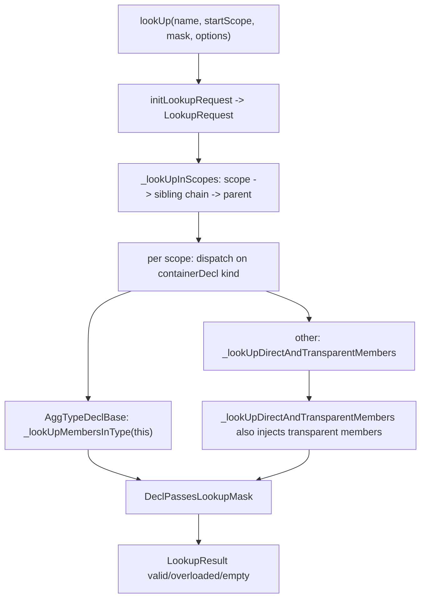

# Lookup

This document specifies Slang's name-lookup algorithm: the four entry
points, the request and result types, the per-step pipeline that
walks scopes, inheritance, and transparent members, and the shadowing
rules that decide which decls are visible at a given source location.

The intended reader is a developer modifying lookup behavior, a
contributor adding a new lookup-aware feature (a new modifier, a new
declaration kind, a new inheritance rule), or someone chasing an
ambiguous-reference diagnostic.

Visibility filtering on lookup results is described in
[visibility.md](visibility.md). Overload ranking that consumes a
multi-item `LookupResult` is described in
[overload-resolution.md](overload-resolution.md).

## Source

The four entry points and the helpers `AddToLookupResult` /
`refineLookup` are declared in
[slang-lookup.h](../../../source/slang/slang-lookup.h) and
implemented in
[slang-lookup.cpp](../../../source/slang/slang-lookup.cpp). The
data structures (`LookupMask`, `LookupOptions`, `LookupRequest`,
`LookupResult`, `LookupResultItem`, `LookupResultItem_Breadcrumb`)
live in
[slang-ast-support-types.h](../../../source/slang/slang-ast-support-types.h).
The per-decl `hiddenFromLookup` flag is on `Decl` in
[slang-ast-base.h](../../../source/slang/slang-ast-base.h); the
transparent-member modifier is in
[slang-ast-modifier.h](../../../source/slang/slang-ast-modifier.h).

## Concepts

- **Entry points.** Four functions in
  [slang-lookup.h](../../../source/slang/slang-lookup.h):
  - `lookUp` — unqualified name lookup starting from a `Scope*`.
  - `lookUpMember` — qualified lookup of `name` against a `Type*`.
  - `lookUpDirectAndTransparentMembers` — direct lookup in one
    `ContainerDecl`, with transparent-member injection but without
    inheritance or extension walks.
  - `refineLookup` — re-filter an existing `LookupResult` against a
    different `LookupMask`. The first three drive lookup; the last
    is a post-filter.
- `LookupRequest`
  ([slang-ast-support-types.h](../../../source/slang/slang-ast-support-types.h)
  line 1532) — the parameter bundle threaded through the lookup
  implementation: `semantics`, `scope`, `endScope`, `declToExclude`,
  `mask`, `options`. Built by `initLookupRequest`
  ([slang-lookup.cpp](../../../source/slang/slang-lookup.cpp) lines
  285-305), which also auto-sets the `Completion` option when the
  name being looked up matches the session's completion token.
- `LookupMask`
  ([slang-ast-support-types.h](../../../source/slang/slang-ast-support-types.h)
  lines 1277-1286) — a `uint8_t` bitset selecting which categories
  of decl pass the filter. The bits are:
  - `type = 0x1` — `AggTypeDecl` / `SimpleTypeDecl`.
  - `Function = 0x2` — `FunctionDeclBase` subclasses.
  - `Value = 0x4` — everything that is neither a type nor a function
    (variables, parameters, fields, ...).
  - `Attribute = 0x8` — `AttributeDecl`.
  - `SyntaxDecl = 0x10` — keyword-introducing `SyntaxDecl`.
  - `Semantic = 0x20` — `SemanticDecl`.
  - `Default = type | Function | Value | SyntaxDecl` — the mask the
    parser and most checker entry points use.
  Classification happens in `DeclPassesLookupMask`
  ([slang-lookup.cpp](../../../source/slang/slang-lookup.cpp) lines
  41-93); `FileDecl` is hard-coded never to pass.
- `LookupOptions`
  ([slang-ast-support-types.h](../../../source/slang/slang-ast-support-types.h)
  lines 1289-1304) — a `uint8_t` bitset of behavior flags:
  - `IgnoreBaseInterfaces` (1 << 0) — skip inherited interface
    members.
  - `Completion` (1 << 1) — return every applicable decl, do not
    short-circuit on the first hit; used by the language server.
  - `NoDeref` (1 << 2) — do not auto-dereference pointer-like types.
  - `ConsiderAllLocalNamesInScope` (1 << 3) — bypass the
    `hiddenFromLookup` shadowing check so that "is the keyword
    shadowed by a local of the same name" queries can succeed during
    parsing.
  - `IgnoreInheritance` (1 << 4) — return only direct members of a
    `struct` (plus `extension`s on the same type).
  - `IgnoreTransparentMembers` (1 << 5) — skip transparent-member
    injection.
- `LookupResultItem`
  ([slang-ast-support-types.h](../../../source/slang/slang-ast-support-types.h)
  lines 1395-1473) — one found decl plus an optional breadcrumb
  chain (`DeclRef<Decl> declRef`,
  `RefPtr<LookupResultItem_Breadcrumb> breadcrumbs`).
- `LookupResultItem_Breadcrumb`
  ([slang-ast-support-types.h](../../../source/slang/slang-ast-support-types.h)
  lines 1311-1392) — a navigation step recorded during lookup. Its
  `Kind` enum has four values:
  - `Member` — lookup saw a transparent in-scope decl and looked
    through it, so the final expression needs `obj.field`.
  - `Deref` — lookup auto-dereferenced a pointer-like type, so the
    final expression needs `(*obj)`.
  - `SuperType` — lookup walked from a sub-type to a super-type via
    a `subtypeWitness`, so the final expression must reflect that
    super-typing.
  - `This` — lookup considered an in-scope member of an enclosing
    type, so the final expression needs an implicit `this`/`This`.
    Breadcrumb instances chain via `RefPtr<Breadcrumb> next` and
    carry a `ThisParameterMode` describing whether `this` is
    immutable, mutable, or a type.
- `LookupResult`
  ([slang-ast-support-types.h](../../../source/slang/slang-ast-support-types.h)
  lines 1479-1526) — single-or-multi container for found items. A
  result is *valid* when its `item.declRef.getDecl()` is non-null,
  and *overloaded* when `items.getCount() > 1`. Items beyond the
  first are stored in `items`; the first item is also a member field
  for the common single-result case so no heap allocation is needed.

## Algorithm

### Unqualified lookup



`lookUp`
([slang-lookup.cpp](../../../source/slang/slang-lookup.cpp) lines
1062-1082) builds a `LookupRequest` and calls
`_lookUpInScopes`
([slang-lookup.cpp](../../../source/slang/slang-lookup.cpp) lines
777-1060). The implementation does the following, in order:

1. **Iterate over scopes.** The outer loop walks
   `request.scope` to `request.endScope` via the `parent` chain
   ([slang-lookup.cpp line
   792](../../../source/slang/slang-lookup.cpp)). `endScope` is
   usually null, so the walk terminates at the module root.
2. **Iterate over sibling scopes.** At each scope, the inner loop
   walks `nextSibling` from the current link so that sibling
   `NamespaceDecl`s and imported-module scopes are consulted at the
   same level
   ([slang-lookup.cpp line
   797](../../../source/slang/slang-lookup.cpp)).
3. **Skip dummy and re-visited file scopes.** A null
   `containerDecl` is a sentinel that links siblings; it is
   skipped. The first `FileDecl` encountered is remembered, and
   subsequent re-encounters of the same `FileDecl` are skipped to
   avoid duplicate hits when multiple includes converge on the same
   file
   ([slang-lookup.cpp lines
   810-820](../../../source/slang/slang-lookup.cpp)).
4. **Dispatch on container kind.** If the `containerDecl` is an
   `AggTypeDeclBase` — i.e. lookup is happening *inside* a type,
   `struct`, `interface`, or `extension` — the request is rewritten
   to perform member lookup against the corresponding `Type*`, with
   a `Breadcrumb::Kind::This` breadcrumb that records the implicit
   `this`/`This` of the enclosing decl
   ([slang-lookup.cpp lines
   842-921](../../../source/slang/slang-lookup.cpp)). Otherwise the
   request falls through to
   `_lookUpDirectAndTransparentMembers`
   ([slang-lookup.cpp lines
   922-936](../../../source/slang/slang-lookup.cpp)).
5. **Update `thisParameterMode`.** Before stepping to the parent
   scope, the loop updates `thisParameterMode` based on the
   container's modifiers — `[mutating]`, `[ref]`, `static`, and
   `__init` change the kind of `this` that any breadcrumb recorded
   in an outer scope must use
   ([slang-lookup.cpp lines
   967-1041](../../../source/slang/slang-lookup.cpp)).
6. **Short-circuit on a non-overloadable hit.** After visiting one
   scope and its siblings, if the result is valid and either
   non-overloaded or not overloadable, lookup stops walking
   outwards
   ([slang-lookup.cpp lines
   1043-1056](../../../source/slang/slang-lookup.cpp)). Functions and
   generics are overloadable, so they continue to accumulate
   candidates from outer scopes; types and variables do not.
7. **Result.** The accumulated `LookupResult` is returned.

`_lookUpDirectAndTransparentMembers`
([slang-lookup.cpp](../../../source/slang/slang-lookup.cpp) lines
189-283) does the per-container work for the non-type branch:

- In completion mode it iterates *every* direct member; otherwise it
  iterates only members whose name matches `request.name`, using
  `ContainerDecl::getDirectMemberDeclsOfName` (declared in
  [slang-ast-decl.h](../../../source/slang/slang-ast-decl.h),
  defined in
  [slang-ast-decl.cpp](../../../source/slang/slang-ast-decl.cpp)
  line 326). The name-of-name list is threaded via
  `Decl::_prevInContainerWithSameName`
  ([slang-ast-base.h](../../../source/slang/slang-ast-base.h) line
  790).
- Each candidate is filtered through `_isUncheckedLocalVar` to
  enforce block-local shadowing (see "Shadowing rules" below).
- Each candidate is filtered through `DeclPassesLookupMask`. The
  filter also drops decls carrying `ExtensionExternVarModifier` and
  rejects `ExternModifier`-tagged members of extensions
  unconditionally
  ([slang-lookup.cpp lines
  41-54](../../../source/slang/slang-lookup.cpp)).
- After direct members, the function calls
  `ContainerDecl::getTransparentDirectMemberDecls` and recurses into
  each transparent value via `_lookUpMembersInValue`, recording a
  `Breadcrumb::Kind::Member` step. Transparent-member injection is
  skipped when the mask is `Attribute` (core-module attributes
  cannot recurse) or when `IgnoreTransparentMembers` is set
  ([slang-lookup.cpp lines
  249-282](../../../source/slang/slang-lookup.cpp)).

### Member lookup

`lookUpMember(astBuilder, semantics, name, type, sourceScope, mask,
options)`
([slang-lookup.cpp](../../../source/slang/slang-lookup.cpp) lines
1084-1097) is the entry point for `obj.name`. It calls
`_lookUpMembersInType`, which dispatches on the type shape:

- **`DeclRefType`.** Lookup recurses into the underlying decl
  via the inheritance walk (see below).
- **`EachType` / `FirstPackElementType` / `LastPackElementType` /
  `PackBranchType`.** Lookup uses the canonical type and re-enters
  the facets walk for the canonicalized form
  ([slang-lookup.cpp lines
  615-676](../../../source/slang/slang-lookup.cpp)).
- **`ModifiedType`.** Modifiers are transparent to lookup
  ([slang-lookup.cpp lines
  631-643](../../../source/slang/slang-lookup.cpp)).
- **`ExtractExistentialType`.** The implicit `ThisType` of the
  underlying interface is the target of lookup
  ([slang-lookup.cpp lines
  677-692](../../../source/slang/slang-lookup.cpp)).
- **`AndType`.** Unexpected at lookup time;
  `visitGenericTypeConstraintDecl` is supposed to have flattened it
  earlier.

**Inheritance walk.** When the target is a `DeclRefType`, lookup
delegates to `_lookupMembersInSuperTypeFacets`
([slang-lookup.cpp lines
393-566](../../../source/slang/slang-lookup.cpp)), which iterates the
`InheritanceInfo::facets` precomputed in
[slang-check-inheritance.cpp](../../../source/slang/slang-check-inheritance.cpp).
Each facet is a `(declRef, type, subtypeWitness)` tuple representing
one path from the source type to a super-type / extension / interface.
For each facet the function:

- Skips facets whose `subtypeWitness` carries
  `IgnoreForLookupModifier` (currently only the synthetic tag-type
  inheritance on enums — see
  [slang-lookup.cpp lines
  455-464](../../../source/slang/slang-lookup.cpp)).
- Skips inherited interfaces when `IgnoreBaseInterfaces` is set.
- Skips non-`Self` facets when `IgnoreInheritance` is set, with a
  special case that keeps extensions targeting the same type in
  scope.
- For non-`Self` facets, prepends a `Breadcrumb::Kind::SuperType`
  step carrying the `subtypeWitness`, so the final expression
  knows it walked a super-typing relation.
- Calls `_lookUpDirectAndTransparentMembers` on the facet's
  container.

**Pointer auto-dereference.** Before the per-type dispatch above,
`_lookUpMembersInSuperTypeImpl`
([slang-lookup.cpp lines
568-599](../../../source/slang/slang-lookup.cpp)) calls
`getPointedToTypeIfCanImplicitDeref(superType)`. If the type is a
pointer-like Slang type and `NoDeref` is not set, a `Deref`
breadcrumb is prepended and lookup recurses on the pointee. The
`_lookUpInScopes` dispatcher
([slang-lookup.cpp line
908](../../../source/slang/slang-lookup.cpp)) forces `NoDeref` when
the enclosing scope is an `ExtensionDecl` so that the extension's
`This` refers to the extension target itself, not the pointed-to
type.

**`ThisType` for interfaces.** When the enclosing scope is an
`InterfaceDecl`, lookup is rewritten to go through the interface's
`ThisTypeDecl` (the abstract self-type of the interface). The
breadcrumb is suppressed because the substitution already encodes
the navigation
([slang-lookup.cpp lines
880-895](../../../source/slang/slang-lookup.cpp)).
`InterfaceDefaultImplDecl` triggers a special path that looks up in
the explicit `This` parameter instead of the interface itself
([slang-lookup.cpp lines
938-965](../../../source/slang/slang-lookup.cpp)).

### Transparent members

A `TransparentModifier`
([slang-ast-modifier.h](../../../source/slang/slang-ast-modifier.h)
line 118) on a member of a `ContainerDecl` causes its own members to
be searched whenever the parent is searched. The canonical example
documented in
[slang-ast-support-types.h lines
1407-1450](../../../source/slang/slang-ast-support-types.h) is an
HLSL `cbuffer C { float4 f; }`: the compiler lowers this to

```
struct Anon0 { float4 f; };
__transparent ConstantBuffer<Anon0> anon1;
```

so that an unqualified reference to `f` resolves through
`anon1.f` via a chain of two breadcrumbs:

1. `Deref` — `ConstantBuffer<Anon0>` is pointer-like, so lookup
   dereferences it.
2. `Member` — `f` lives one struct member deep through `anon1`.

`ContainerDecl::getTransparentDirectMemberDecls`
([slang-ast-decl.h line
212](../../../source/slang/slang-ast-decl.h)) returns the cached
list of direct members carrying `TransparentModifier`. The lookup
side
([slang-lookup.cpp lines
258-282](../../../source/slang/slang-lookup.cpp)) walks that list,
prepends a `Member` breadcrumb, and recurses via
`_lookUpMembersInValue`. The recursion is short-circuited when:

- the request's `mask` includes `Attribute` (transparent-member
  recursion is forbidden for attributes to avoid infinite recursion
  on transparent types that themselves contain attribute members),
  or
- the request's `options` include `IgnoreTransparentMembers` (used,
  for example, when looking up an unscoped-enum's underlying type
  to break a similar cycle).

### Breadcrumbs

Each lookup result item carries a singly-linked list of
`LookupResultItem_Breadcrumb` nodes. The checker walks the list to
synthesize the canonical AST expression. For the `cbuffer` example
above, an unqualified `f` becomes the equivalent of `(*anon1).f`:

- `Deref` -> `Member` -> (decl `f`).

For an unqualified `g` defined on `Self` inside a method, the
breadcrumb is just `This`, marking that the rewritten expression
needs an implicit `this.g`. The `ThisParameterMode` field on the
breadcrumb records whether `this` is `ImmutableValue`,
`MutableValue`, or the `This` type — set per the enclosing
function's `[mutating]` / `[ref]` / `static` modifiers as described
in step 5 of "Unqualified lookup" above.

For lookup through an interface base via `subtypeWitness`, the
breadcrumb is `SuperType` and carries the witness as its `val`.

`CreateLookupResultItem`
([slang-lookup.cpp lines
146-165](../../../source/slang/slang-lookup.cpp)) reverses the
on-stack `BreadcrumbInfo` chain when constructing the heap-allocated
linked list so that the final order matches the navigation order
from the user's source expression to the found decl.

## Shadowing rules

### Block-local shadowing

Inside a `BlockStmt`, decls are temporarily hidden by setting
`Decl::hiddenFromLookup`
([slang-ast-base.h](../../../source/slang/slang-ast-base.h) line
803). The checker sets the flag before entering a block and clears
it once it passes each `DeclStmt`. The bookkeeping lives in
`SemanticsStmtVisitor::visitBlockStmt`
([slang-check-stmt.cpp](../../../source/slang/slang-check-stmt.cpp)
lines 82-117) and the per-`DeclStmt` clear is at lines 60-79.

Lookup honors the flag via `_isUncheckedLocalVar`
([slang-lookup.cpp](../../../source/slang/slang-lookup.cpp) lines
175-181), which combines `hiddenFromLookup` with `DeclCheckState`
to decide whether a local has "been declared yet" at the textual
point of the use.

`LookupOptions::ConsiderAllLocalNamesInScope` lets a caller bypass
this check; it is used during parsing when asking "is this keyword
shadowed by a local of the same name?", because at that point the
checker has not yet assigned check-state to the new declarations.

### Container-level overload accumulation

Decls with the same name inside one `ContainerDecl` do not shadow
each other; they accumulate into a `LookupResult` and become an
overload set. The chain is implemented by the
`Decl::_prevInContainerWithSameName` field
([slang-ast-base.h line
790](../../../source/slang/slang-ast-base.h)), populated at
`addDirectMemberDecl`
([slang-ast-decl.cpp line
285](../../../source/slang/slang-ast-decl.cpp)) and queried by
`ContainerDecl::getDirectMemberDeclsOfName`
([slang-ast-decl.cpp line
326](../../../source/slang/slang-ast-decl.cpp)). The lookup side
iterates this list at
[slang-lookup.cpp line
223](../../../source/slang/slang-lookup.cpp).

#### Deduplication: there isn't any at the `LookupResult` level

`AddToLookupResult`
([slang-lookup.cpp lines
95-125](../../../source/slang/slang-lookup.cpp)) appends each
incoming `LookupResultItem` to the result without comparing it
against previously-collected items. The same `DeclRef` reached
through two different lookup paths (e.g. via a transparent member
*and* directly from the enclosing scope, or via two different
inheritance edges in member lookup) will appear twice in the result.
Downstream code that needs uniqueness is responsible for filtering:
[overload-resolution.md](overload-resolution.md) does so via
`CompareLookupResultItems` during candidate ranking, and
visibility filtering in `TryCheckOverloadCandidateVisibility`
(see [visibility.md](visibility.md)) drops duplicates that point at
identical visible declarations. There is intentionally no
deduplication inside lookup itself — keeping every breadcrumb path
visible is what lets later phases produce accurate ambiguity
diagnostics.

### Module and namespace

Multiple `namespace Foo {}` declarations in the same module collapse
into the same `NamespaceDecl` — the parser explicitly reuses the
first one it finds in the parent via
`parentDecl->getDirectMemberDeclsOfName(name)`
([slang-parser.cpp lines
4075-4096](../../../source/slang/slang-parser.cpp)). Cross-module
sibling namespaces are linked into the lookup chain by
`addSiblingScopeForContainerDecl` during semantic checking
([slang-check-decl.cpp line
15598](../../../source/slang/slang-check-decl.cpp)). `UsingDecl`
captures the current scope at parse time and injects names at check
time via the same sibling-scope mechanism.

### Interface requirements vs default implementations

A user-provided extension member can shadow an interface default
implementation. The relevant special case is
`InterfaceDefaultImplDecl`
([slang-ast-decl.h line
926](../../../source/slang/slang-ast-decl.h)): when lookup is
performed from inside one, the algorithm skips the interface decl
itself and looks up in the explicit `This` parameter instead
([slang-lookup.cpp lines
938-965](../../../source/slang/slang-lookup.cpp)), so a witness
override on a conforming type wins over the default.

### Keyword vs identifier

Keywords are `SyntaxDecl`s registered in the core module; they
share the identifier namespace with user decls. The `LookupMask`
filter cleanly separates them: when the parser needs an identifier
(value or type) it asks with the default mask, which includes
`SyntaxDecl`; when it needs to verify that an identifier is *not*
a keyword (e.g. when the user redeclares one as a local) it asks
with `ConsiderAllLocalNamesInScope` set to look past
`hiddenFromLookup`, then checks whether the matching decl is a
`SyntaxDecl`.

### Generic parameters

Generic parameters live in the `GenericDecl`'s own scope and are
seen as direct members of that scope. A reference to `T` from
inside the generic's inner decl resolves through the inner scope's
parent (the `GenericDecl` scope), shadowing any same-named decl in
the enclosing scope. A reference to `T` from a sibling of the outer
decl never finds the generic parameter because that scope chain
does not pass through the `GenericDecl`.

## Edge cases and failure modes

- **`LookupResult` with multiple items matching the mask.** Returned
  as overloaded; ranking is deferred to
  [overload-resolution.md](overload-resolution.md). The first item
  is also stored in `LookupResult::item` so that callers checking
  for "any" result do not pay for the items list.
- **Ambiguous reference at use site.** When a non-overloadable
  result resolves to multiple decls (e.g. two types with the same
  name reachable via different sibling scopes), the checker emits
  diagnostic `ambiguous-reference` (`slang-diagnostics.lua` line
  3611, code 39999) at the use site.
- **Forward reference inside a `BlockStmt`.** Using `b` before its
  `DeclStmt` reaches the lookup with `hiddenFromLookup = true`;
  `_isUncheckedLocalVar` skips the decl, so lookup returns either
  the decl from an outer scope or empty. The checker's normal
  use-of-undeclared-identifier diagnostic takes over from there.
- **`FileDecl` returns no hits.** `DeclPassesLookupMask` rejects
  `FileDecl` unconditionally
  ([slang-lookup.cpp lines
  79-83](../../../source/slang/slang-lookup.cpp)) — its members are
  found through its sibling-linked module scope, not by directly
  looking up "the file" as a name.
- **`ExtensionExternVarModifier` and `ExternModifier` in
  extensions.** Both are filtered out at the very start of
  `DeclPassesLookupMask`
  ([slang-lookup.cpp lines
  43-54](../../../source/slang/slang-lookup.cpp)), so an `extern`
  member of an `extension` is never even considered a candidate.
- **Member lookup on `ErrorType`.** `_lookUpMembersInType` reaches
  the type-shape dispatch and falls through without adding any
  items — lookup silently returns empty so that a downstream error
  does not cascade into "unknown member" noise.
- **Transparent-member recursion when looking up an attribute.**
  Forbidden by the early return at
  [slang-lookup.cpp lines
  249-250](../../../source/slang/slang-lookup.cpp): otherwise a
  transparent member that is itself an attribute target could
  trigger infinite recursion.
- **`AndType` reaching the type dispatch.** Signals a constraint-
  flattening bug; `_lookUpMembersInSuperTypeImpl` triggers
  `SLANG_UNEXPECTED("AndType should have been flattened ...")`
  ([slang-lookup.cpp lines
  693-697](../../../source/slang/slang-lookup.cpp)).
- **`IgnoreForLookupModifier` on a base.** The synthetic tag-type
  inheritance on enums carries this modifier
  ([slang-check-decl.cpp line
  11436](../../../source/slang/slang-check-decl.cpp)) so the
  underlying integer type is not surfaced as a base interface when
  looking up enum members.

## See also

- [scopes.md](scopes.md) — the scope chain that lookup walks.
- [visibility.md](visibility.md) — visibility filtering applied to
  lookup results.
- [overload-resolution.md](overload-resolution.md) — ranking of
  the overloaded `LookupResult` lookup may return.
- [../ast-reference/base.md](../ast-reference/base.md) — reference
  for `Decl`, `Scope`, and the support types `DeclRef`,
  `LookupResult`.
- [../ast-reference/values.md](../ast-reference/values.md) —
  reference for `LookupDeclRef` and the witness-related `Val`
  family.
- [../ast-reference/modifiers.md](../ast-reference/modifiers.md) —
  reference for `TransparentModifier`, `IgnoreForLookupModifier`,
  and the extension/extern modifiers.
- [../pipeline/03-semantic-check.md](../pipeline/03-semantic-check.md)
  — pipeline-level overview of where lookup runs.
- [../glossary.md](../glossary.md) — entries for `lookup result`,
  `lookup mask`, `lookup options`, `lookup breadcrumb`,
  `transparent member`, `shadowing`.
