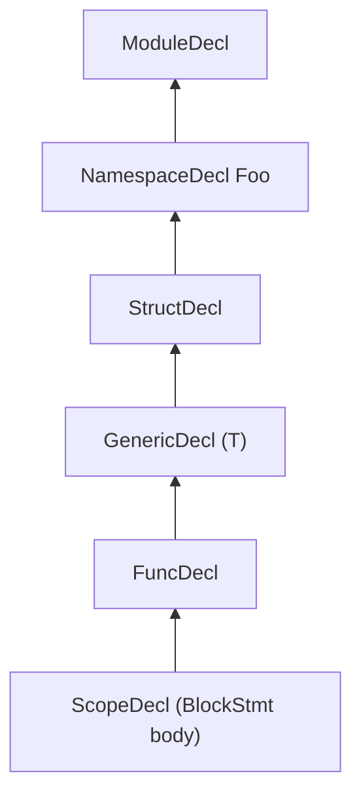

# Scopes

This document describes the `Scope` data structure that drives Slang's
name resolution, the AST node kinds that introduce a new scope, and how
the parser threads scopes through the AST as it builds it. The
intended reader is a developer modifying scope construction, adding a
new scope-bearing AST node, or trying to understand why a given
identifier is in scope at a particular source location.

For the lookup algorithm itself, see [lookup.md](lookup.md). For
visibility filtering, see [visibility.md](visibility.md). For how the
overall pipeline gets here, see
[../pipeline/02-parse-ast.md](../pipeline/02-parse-ast.md).

## Source

Scopes are declared in
[slang-ast-base.h](../../../source/slang/slang-ast-base.h). The
`Decl` subclasses that own scopes are declared in
[slang-ast-decl.h](../../../source/slang/slang-ast-decl.h), and the
`Stmt` subclasses that own scopes are declared in
[slang-ast-stmt.h](../../../source/slang/slang-ast-stmt.h). Scope
construction during parsing happens in
[slang-parser.cpp](../../../source/slang/slang-parser.cpp); the
`addSiblingScopeForContainerDecl` helper used by both the parser and
the checker is defined in
[slang-check-expr.cpp](../../../source/slang/slang-check-expr.cpp).

## Concepts

- `Scope` (lines 111-128 of
  [slang-ast-base.h](../../../source/slang/slang-ast-base.h)) — a
  three-field record:
  - `ContainerDecl* containerDecl` — the decl whose members are the
    contents of this scope.
  - `Scope* parent` — the next scope to consult when a name is not
    found in `containerDecl`.
  - `Scope* nextSibling` — the next scope to consult at the *same*
    level before falling through to `parent` (see "Sibling scopes"
    below). The comment in the header notes that `containerDecl` is
    deliberately an unowned pointer so a `Scope` cannot keep an AST
    node alive.
- `ContainerDecl` (abstract, declared in
  [slang-ast-decl.h](../../../source/slang/slang-ast-decl.h)) — the
  `Decl` subclass that has child decls. Every `ContainerDecl` carries
  an `ownedScope` field (line 141) whose `containerDecl` points back
  to the owning decl. This is the canonical way an AST node "owns"
  a scope.
- `ScopeDecl` (line 589 of
  [slang-ast-decl.h](../../../source/slang/slang-ast-decl.h)) — a
  synthetic `ContainerDecl` used to attach a scope to a statement.
  `ScopeDecl` instances do not appear in the surface syntax; they are
  created by the parser for any statement that introduces a local
  scope.
- `ScopeStmt` (abstract, lines 15-20 of
  [slang-ast-stmt.h](../../../source/slang/slang-ast-stmt.h)) — the
  abstract base of statements that own a scope. It carries a single
  `ScopeDecl* scopeDecl` field; the actual `Scope*` is
  `scopeDecl->ownedScope`.
- `BlockStmt` (lines 40-48 of
  [slang-ast-stmt.h](../../../source/slang/slang-ast-stmt.h)) — the
  concrete `{ ... }` block; the most common `ScopeStmt`.

## Rules

### Scope-bearing AST nodes

Every node listed below introduces a fresh `Scope` distinct from its
parent. Citations point at the concrete class in the header.

| Node kind | Header | How the scope is attached |
| --- | --- | --- |
| `ModuleDecl` | [slang-ast-decl.h](../../../source/slang/slang-ast-decl.h) (line 789) | `ContainerDecl::ownedScope` |
| `NamespaceDecl` | [slang-ast-decl.h](../../../source/slang/slang-ast-decl.h) (line 781) | `ContainerDecl::ownedScope` |
| `FileDecl` | [slang-ast-decl.h](../../../source/slang/slang-ast-decl.h) (line 836) | `ContainerDecl::ownedScope` |
| `AggTypeDecl` (and `StructDecl`, `ClassDecl`, `InterfaceDecl`, `EnumDecl`, ...) | [slang-ast-decl.h](../../../source/slang/slang-ast-decl.h) (lines 385-484) | `ContainerDecl::ownedScope` |
| `ExtensionDecl` | [slang-ast-decl.h](../../../source/slang/slang-ast-decl.h) (line 367) | `ContainerDecl::ownedScope` |
| `GenericDecl` | [slang-ast-decl.h](../../../source/slang/slang-ast-decl.h) (line 911) | `ContainerDecl::ownedScope`; the scope contains the generic parameters |
| `CallableDecl` (and `FuncDecl`, `ConstructorDecl`, `SubscriptDecl`, `AccessorDecl`, ...) | [slang-ast-decl.h](../../../source/slang/slang-ast-decl.h) (line 611 onward) | `ContainerDecl::ownedScope`; the scope contains the parameter decls |
| `PropertyDecl` | [slang-ast-decl.h](../../../source/slang/slang-ast-decl.h) (line 697) | `ContainerDecl::ownedScope` |
| `ScopeDecl` | [slang-ast-decl.h](../../../source/slang/slang-ast-decl.h) (line 589) | `ContainerDecl::ownedScope`; attached to a `ScopeStmt` |
| `BlockStmt` | [slang-ast-stmt.h](../../../source/slang/slang-ast-stmt.h) (line 41) | `ScopeStmt::scopeDecl` |
| `ForStmt`, `UnscopedForStmt` | [slang-ast-stmt.h](../../../source/slang/slang-ast-stmt.h) (lines 216-231) | `ScopeStmt::scopeDecl`; `UnscopedForStmt` reuses the parent scope for HLSL compatibility |
| `CompileTimeForStmt` | [slang-ast-stmt.h](../../../source/slang/slang-ast-stmt.h) (line 251) | `ScopeStmt::scopeDecl` |
| `GpuForeachStmt` | [slang-ast-stmt.h](../../../source/slang/slang-ast-stmt.h) (line 198) | `ScopeStmt::scopeDecl` |
| `BreakableStmt` subclasses (`SwitchStmt`, `TargetSwitchStmt`, `StageSwitchStmt`) | [slang-ast-stmt.h](../../../source/slang/slang-ast-stmt.h) (line 100 onward) | `ScopeStmt::scopeDecl` |
| `CatchStmt` (catch handler) | [slang-ast-stmt.h](../../../source/slang/slang-ast-stmt.h) (line 306); a fresh `ScopeDecl` is pushed in `Parser::ParseDoCatchStatement` | indirect, through the surrounding `ScopeDecl` the parser creates |
| `parseIfLetStatement` (synthetic) | [slang-parser.cpp](../../../source/slang/slang-parser.cpp) (line 6721) | a fresh `ScopeDecl` is pushed twice (outer + positive branch) |
| `LambdaDecl` (parameter scope) | [slang-ast-decl.h](../../../source/slang/slang-ast-decl.h) (line 681); the parser pushes `lambdaExpr->paramScopeDecl` | dedicated `ScopeDecl` for the parameter list |

Several AST nodes do *not* own a fresh scope even though syntactically
they look like they might:

- `IfStmt` and `WhileStmt` / `DoWhileStmt` do not own a scope; their
  block bodies parse as `BlockStmt`s that own one. `if (let x = ...)`
  is the exception: `Parser::parseIfLetStatement`
  ([slang-parser.cpp](../../../source/slang/slang-parser.cpp) line
  6721) synthesizes additional `ScopeDecl`s for the unwrapped
  variable.
- `SeqStmt`, `DeclStmt`, and other `Stmt` subclasses that are not
  `ScopeStmt` simply live inside the enclosing scope.

### Parser scope construction

The parser carries the current scope pointer as a member field:

- `Parser::currentScope`
  ([slang-parser.cpp](../../../source/slang/slang-parser.cpp) line
  117) — scope where new decl definitions are inserted.
- `Parser::currentLookupScope`
  ([slang-parser.cpp](../../../source/slang/slang-parser.cpp) line
  116) — scope where in-parser expression lookup starts (kept
  in sync with `currentScope` via `resetLookupScope`).
- `Parser::outerScope`
  ([slang-parser.cpp](../../../source/slang/slang-parser.cpp) line
  115) — the initial scope at the start of parsing.

Two helper methods push and pop scopes
([slang-parser.cpp](../../../source/slang/slang-parser.cpp) lines
138-164):

- `PushScope(ContainerDecl*)` — allocates a new `Scope`, links its
  `parent` to `currentScope`, writes itself back into
  `containerDecl->ownedScope`, and updates `currentScope`.
- `pushScopeAndSetParent(ContainerDecl*)` — same plus assigning
  `containerDecl->parentDecl = currentScope->containerDecl` before
  pushing. This is the helper most parsing code calls.
- `PopScope()` — restores `currentScope = currentScope->parent`.

A representative chain that arises in a Slang file is shown below.
Each box is the `ContainerDecl` referenced by a `Scope::containerDecl`,
and arrows point from a child scope to its `parent`.

The same parser-call chain that produces this looks roughly like:
`parseNamespaceDecl` -> `parseDeclBody`/`parseAggTypeDecl` ->
`parseOptGenericDecl` -> `parseFuncDecl` -> `parseBlockStatement`,
each calling `pushScopeAndSetParent` for the node it introduces and
matching `PopScope` on the way out.

### Sibling scopes

`Scope::nextSibling` lets one scope chain consult several containers
at the same nesting level. The constructor is the free function
`addSiblingScopeForContainerDecl` defined in
[slang-check-expr.cpp](../../../source/slang/slang-check-expr.cpp)
(lines 303-318); it allocates a fresh `Scope`, points it at the
secondary `ContainerDecl`, and splices it into the existing
`nextSibling` list of the destination scope.

Three concrete uses of sibling scopes are visible in the source:

1. **`FileDecl` per source file in a multi-file module.** A module
   that is split across multiple `__include`d files has one
   `ModuleDecl` plus one `FileDecl` per source file. Each `FileDecl`
   is attached to the module's scope as a sibling so that lookup
   inside the module sees the union of all files'
   members — see
   [slang-session.cpp](../../../source/slang/slang-session.cpp)
   line 2239 and
   [slang-check-decl.cpp](../../../source/slang/slang-check-decl.cpp)
   line 15217.
2. **Imported modules.** When module B imports module A, the
   checker adds A's scope as a sibling of B's scope so that names
   from A are reachable in B without explicit qualification — see
   [slang-check-decl.cpp](../../../source/slang/slang-check-decl.cpp)
   line 15251.
3. **Multiple `namespace Foo {}` declarations of the same logical
   namespace.** When the same namespace name reappears, the parser
   reuses the existing `NamespaceDecl`
   ([slang-parser.cpp](../../../source/slang/slang-parser.cpp) lines
   4075-4096) so that further declarations are inserted into the same
   container. The semantic checker links siblings in
   [slang-check-decl.cpp](../../../source/slang/slang-check-decl.cpp)
   line 15598 when more than one `NamespaceDecl` exists.

### Implicit scopes

A few intermediate scopes have no direct surface-syntax representation
but are still created at parse time:

- **Generic parameter list.** `parseOptGenericDecl`
  ([slang-parser.cpp](../../../source/slang/slang-parser.cpp) line
  1740) creates a `GenericDecl` and pushes its scope *before* parsing
  the inner decl. The generic parameters live in the `GenericDecl`'s
  scope; the inner decl's own scope is its child. The comment at line
  1731-1734 notes that a `GenericDecl` hijacks the inner decl's name
  for lookup purposes.
- **Extension body.** `ExtensionDecl` owns its own scope, but the
  members of the type it extends are *not* in the extension's scope
  chain; they are reached through member lookup at check time.
- **Interface requirement list.** `InterfaceDecl` owns a single scope
  for its requirements; the default-impl bodies parse against a
  derived `InterfaceDefaultImplDecl` ([slang-ast-decl.h line
  926](../../../source/slang/slang-ast-decl.h)) that is itself a
  `GenericDecl` subclass and thus has its own scope.
- **`if (let x = ...)` desugaring.** `parseIfLetStatement`
  ([slang-parser.cpp](../../../source/slang/slang-parser.cpp) line
  6721) creates two `ScopeDecl`s: one for the temporary `$OptVar`
  binding and one for the user-visible unwrapped variable inside the
  positive branch.

### Scope walking order during lookup

Lookup walks the chain in a fixed order, defined by the entry points
in [slang-lookup.h](../../../source/slang/slang-lookup.h):

1. Visit `currentScope` itself: its `containerDecl`'s direct members.
2. Walk `currentScope->nextSibling` until null, repeating step 1 for
   each sibling.
3. Move to `currentScope->parent` and repeat from step 1.
4. Stop when the parent chain reaches `nullptr`.

The detailed algorithm — masks, inheritance walks, transparent-member
injection, deduplication — lives in [lookup.md](lookup.md). This page
only states the order in which scopes are consulted.

## Edge cases and failure modes

- **Empty block scope.** A `BlockStmt` whose body contains zero
  declarations still has a fresh `ScopeDecl`. This matters because
  the per-decl `Decl::hiddenFromLookup` flag
  ([slang-ast-base.h](../../../source/slang/slang-ast-base.h) line
  803) is set on entry to the block; see
  [slang-check-stmt.cpp](../../../source/slang/slang-check-stmt.cpp)
  lines 82-117 for the entry/clear logic. The flag is cleared as the
  checker walks past each `DeclStmt`; the lookup-side check is in
  [slang-lookup.cpp](../../../source/slang/slang-lookup.cpp) line 179.
- **`UnscopedForStmt`.** When the source language is HLSL,
  `Parser::ParseForStatement`
  ([slang-parser.cpp](../../../source/slang/slang-parser.cpp) line
  6829) creates an `UnscopedForStmt` and *skips* the
  `pushScopeAndSetParent` call (lines 6856-6857), so the `for` loop's
  initialization variable leaks into the surrounding scope as HLSL
  semantics demand.
- **Multiple `namespace Foo {}` siblings.** `parseNamespaceDecl`
  reuses the first `NamespaceDecl` it finds in the parent
  ([slang-parser.cpp](../../../source/slang/slang-parser.cpp) lines
  4075-4080), so all subsequent declarations parse into the same
  `ContainerDecl`. Lookup still has to walk sibling-linked
  `NamespaceDecl`s across modules; that is what
  `addSiblingScopeForContainerDecl` is for.
- **`GenericDecl` parameter scope vs inner-decl scope.** A reference
  to a generic type parameter `T` inside the inner decl resolves
  through the inner scope's `parent`, which is the `GenericDecl`'s
  scope. A sibling of the outer decl that mentions `T` cannot reach
  it — its scope chain does not pass through the `GenericDecl`.
- **`ExtensionDecl` members are not in the extension's scope chain.**
  Lookup *into* a type that has an active extension must walk the
  extension's members explicitly; the extension scope is not
  configured as a sibling of the extended type's scope. The relevant
  helper is in [slang-lookup.cpp](../../../source/slang/slang-lookup.cpp)
  and is documented in [lookup.md](lookup.md).
- **`UsingDecl`.** A `using` declaration ([slang-ast-decl.h line
  843](../../../source/slang/slang-ast-decl.h)) captures
  `parser->currentScope` at parse time (see
  [slang-parser.cpp](../../../source/slang/slang-parser.cpp) line
  4130). The injection into the surrounding scope happens at check
  time, not at parse time. The current scope at parse time and the
  scope into which names are eventually injected may differ if the
  enclosing decl is later reorganized (e.g. by sibling-namespace
  collapse).
- **`UnparsedStmt`.** A function body left as an `UnparsedStmt` at
  parse time captures both `currentScope` and `outerScope` ([slang-
  ast-stmt.h](../../../source/slang/slang-ast-stmt.h) lines 53-61);
  these are restored when `parseUnparsedStmt` runs the deferred parse.
- **Empty parser scope.** Pushing a `Scope` whose `containerDecl`
  is null is not supported. `Parser::PushScope` requires the
  `ContainerDecl*` overload to allocate one; the bare-`Scope*`
  overload exists only for restoring a pre-built scope.

## See also

- [lookup.md](lookup.md) — the lookup algorithm that walks the
  scope chain.
- [visibility.md](visibility.md) — the visibility filter that runs
  on top of lookup.
- [overload-resolution.md](overload-resolution.md) — overload
  ranking that consumes filtered lookup results.
- [../ast-reference/base.md](../ast-reference/base.md) — the
  reference for `NodeBase`, `Decl`, `Scope`, and other base types.
- [../ast-reference/declarations.md](../ast-reference/declarations.md)
  — per-class reference for every `Decl` subclass.
- [../ast-reference/statements.md](../ast-reference/statements.md)
  — per-class reference for every `Stmt` subclass.
- [../pipeline/02-parse-ast.md](../pipeline/02-parse-ast.md) — the
  parsing-stage overview that drives scope construction.
- [../glossary.md](../glossary.md) — glossary entries for
  `scope`, `decl-ref`, `lookup result`, `name resolution`.
