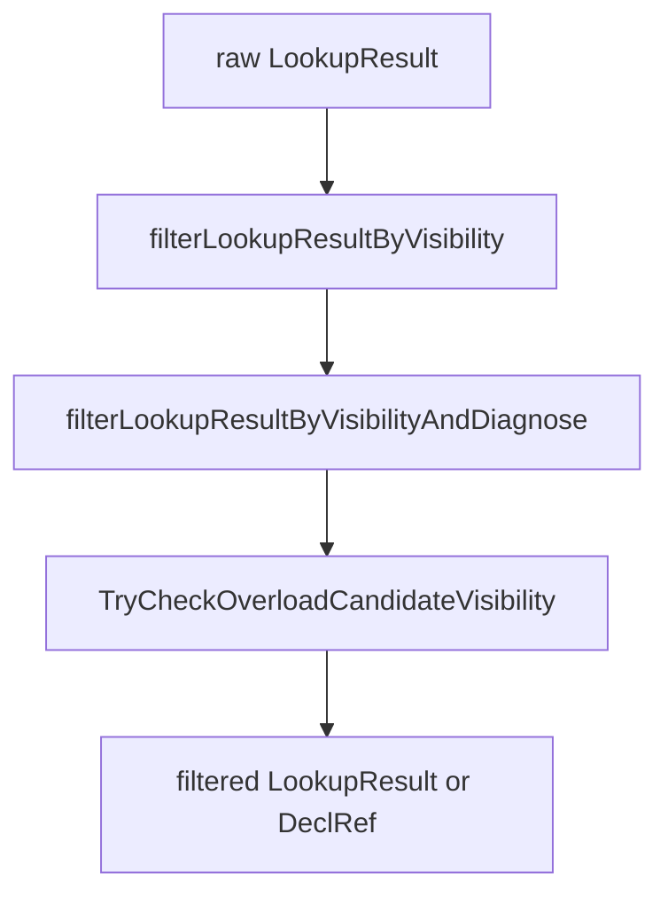

# Visibility

This document covers Slang's declaration visibility rules: which
`public` / `private` / `internal` keyword each decl carries, the
defaults per language version, and where in the resolution pipeline
visibility filtering happens. The intended reader is a developer
adding or modifying a visibility-related diagnostic, a language
designer reasoning about cross-module access, or anyone wondering why
a declaration in another module is or is not reachable.

Lookup itself is described in [lookup.md](lookup.md); overload-
resolution-time visibility filtering is described in
[overload-resolution.md](overload-resolution.md). This page is the
single source for *what* counts as visible.

## Source

Visibility modifiers are declared in
[slang-ast-modifier.h](../../../source/slang/slang-ast-modifier.h)
(lines 48-70). The `DeclVisibility` enum that the rest of the
compiler reasons about is in
[slang-ast-support-types.h](../../../source/slang/slang-ast-support-types.h)
(lines 1858-1864). The classification helper `getDeclVisibility` and
the per-module default-visibility setup live in
[slang-check-decl.cpp](../../../source/slang/slang-check-decl.cpp);
the visibility filter applied to lookup results and the
`isDeclVisibleFromScope` predicate live in
[slang-check-expr.cpp](../../../source/slang/slang-check-expr.cpp);
the overload-time check sits in
[slang-check-overload.cpp](../../../source/slang/slang-check-overload.cpp);
per-decl visibility validation is in
[slang-check-modifier.cpp](../../../source/slang/slang-check-modifier.cpp).

## Concepts

- `VisibilityModifier` (abstract,
  [slang-ast-modifier.h](../../../source/slang/slang-ast-modifier.h)
  line 49) — base class for visibility keywords. The three concrete
  subclasses are `PublicModifier` (line 55), `PrivateModifier`
  (line 61), and `InternalModifier` (line 67). Each is an empty
  marker class.
- `DeclVisibility`
  ([slang-ast-support-types.h](../../../source/slang/slang-ast-support-types.h)
  lines 1858-1864) — internal enum with values `Private`, `Internal`,
  `Public`, and the alias `Default = Internal`. The numeric order
  is `Private < Internal < Public`; `Math::Min` over visibility
  values is used throughout to compute the effective visibility of a
  composite (e.g. a parameterized type).
- `ModuleDecl::defaultVisibility`
  ([slang-ast-decl.h](../../../source/slang/slang-ast-decl.h) line
  817) — `DeclVisibility` field that records the default visibility
  applied to members of the module that carry no explicit modifier.
  Initialized to `DeclVisibility::Internal` at declaration time and
  overridden during semantic checking as described below.
- `SlangLanguageVersion`
  ([slang-ast-decl.h](../../../source/slang/slang-ast-decl.h) line
  815) — the per-module language-version field, set from the
  `module` declaration's version (or the linkage default). The
  legacy version constant `SLANG_LANGUAGE_VERSION_LEGACY` is
  `2018` in [slang.h](../../../include/slang.h); the same header
  defines `SLANG_LANGUAGE_VERSION_DEFAULT` as
  `SLANG_LANGUAGE_VERSION_LEGACY` (so the documented language
  default is still 2018), and `SessionDesc::minLanguageVersion`
  defaults to `SLANG_LANGUAGE_VERSION_2025`. New sessions therefore
  reject modules whose declared version is older than 2025 by
  default, but a host that overrides `minLanguageVersion` can still
  fall back to the 2018 default.
- `IgnoreForLookupModifier`
  ([slang-ast-modifier.h](../../../source/slang/slang-ast-modifier.h)
  line 248) — a separate modifier that hides a decl from lookup
  entirely. It is not part of the `Public` / `Internal` / `Private`
  classification but commonly mistaken for one; see
  "Interaction with `IgnoreForLookupModifier`" below.

## Rules

### Per-keyword semantics

The three keyword classifications map onto the `DeclVisibility`
levels:

- `public`: visible from any module that has imported the declaring
  module.
- `internal`: visible only inside the declaring module
  (including all of its files).
- `private`: visible only inside the declaring container — that is,
  the same aggregate type (`struct`, `class`, `interface`, ...) or
  the same namespace.

The mapping is implemented in `getDeclVisibility`
([slang-check-decl.cpp](../../../source/slang/slang-check-decl.cpp)
lines 19309-19362): the function walks `decl->modifiers` and returns
the first `VisibilityModifier` it finds.

`getDeclVisibility` also implements three structural fall-throughs:

- For an `AccessorDecl` or `EnumCaseDecl`, visibility is inherited
  from the enclosing decl (lines 19322-19329).
- For a `GenericDecl`, visibility is taken from its `inner` decl
  (lines 19320-19321).
- For a generic parameter (`isGenericParam` / `GenericTypeConstraintDecl`),
  visibility is the visibility of the generic decl's inner decl
  (lines 19311-19319).

If no visibility modifier is present and the decl is not inside an
interface, the visibility is the module's default (see below). If
the decl is inside an interface, it inherits the interface's
visibility (lines 19342-19346).

### Defaults by language version

`ModuleDecl::defaultVisibility` controls the implicit visibility for
members of the module that have no explicit modifier. The default
is computed in `getDeclVisibility`
([slang-check-decl.cpp](../../../source/slang/slang-check-decl.cpp)
lines 19347-19353):

```cpp
defaultVis = parentModule->languageVersion == SLANG_LANGUAGE_VERSION_LEGACY
                 ? DeclVisibility::Public
                 : parentModule->defaultVisibility;
```

The legacy language treats every unannotated decl as `public` — the
language predates the visibility system entirely, and existing code
relies on that behaviour. Modern versions default to `internal`
unless the module is marked `public` at the top:
`checkModule` flips the module-wide default to `public` when it
finds a `PublicModifier` on the `ModuleDecl`
([slang-check-decl.cpp](../../../source/slang/slang-check-decl.cpp)
lines 4954-4957).

`NamespaceDecl` is unconditionally `Public`
([slang-check-decl.cpp](../../../source/slang/slang-check-decl.cpp)
lines 19357-19360); restricting namespace visibility would be
meaningless because namespaces only group named members and do not
themselves carry behaviour.

### Where visibility is filtered



Visibility is consulted at two distinct points:

1. **Lookup boundary.** Most lookup call sites in the checker pass
   their result through `filterLookupResultByVisibilityAndDiagnose`
   ([slang-check-expr.cpp](../../../source/slang/slang-check-expr.cpp)
   lines 1222-1244). If lookup returned candidates but all are
   filtered out, the function emits diagnostic
   `decl-is-not-visible` (`Diagnostics::DeclIsNotVisible`,
   `slang-diagnostics.lua` 30600) and reports the *first* offending
   decl. In language-server mode it intentionally returns the
   unfiltered result so completion can keep operating.
2. **Overload resolution.** `TryCheckOverloadCandidateVisibility`
   ([slang-check-overload.cpp](../../../source/slang/slang-check-overload.cpp)
   lines 265-287) is invoked by the overload filter pipeline on
   every survivor of arity / type checks. In `JustTrying` mode it
   silently drops the candidate; in `ForReal` mode it emits the
   same `DeclIsNotVisible` diagnostic.

Both call sites delegate to the same predicate,
`SemanticsVisitor::isDeclVisibleFromScope(declRef, scope)`
([slang-check-expr.cpp](../../../source/slang/slang-check-expr.cpp)
lines 1079-1207). The predicate computes the decl's
`DeclVisibility` and dispatches:

- `Public` — always visible.
- `Internal` — visible iff `getModuleDecl(decl)` equals
  `getModuleDecl(scope)`; that is, the requesting scope is part of
  the same module.
- `Private` — visible iff one of the requesting scope's parents is
  the enclosing aggregate (or namespace) that owns the decl, or the
  scope is inside an `ExtensionDecl` whose target type matches.
- Any other value (the impossible `Default` after enum lookup) —
  not visible.

The private-access check walks the requesting scope's parent chain
looking for the parent aggregate (lines 1094-1107). When the
candidate decl lives in an `ExtensionDecl`, the predicate also
resolves the extension's target type and checks for type equality
with the enclosing aggregate of the requesting scope
(lines 1122-1204). This lets `extension S { private foo() {...} }`
work when called from inside `S` itself or from another extension on
`S` — even a generic extension that specializes to `S`.

### Container-level cap

`SemanticsVisitor::getTypeVisibility`
([slang-check-expr.cpp](../../../source/slang/slang-check-expr.cpp)
lines 1063-1077) computes the visibility of a `Type` by taking the
minimum of the underlying decl's visibility and the visibilities of
any generic type arguments. This is what makes
`HashMap<String, InternalKey>` effectively `internal` even if
`HashMap` is `public`.

`SemanticsVisitor::checkVisibility`
([slang-check-modifier.cpp](../../../source/slang/slang-check-modifier.cpp)
lines 2104-2168) enforces the converse: a decl cannot reference a
type that is *less* visible than itself. Violations produce
diagnostic `use-of-less-visible-type`
(`Diagnostics::UseOfLessVisibleType`, code 30604). The same
function also enforces that a decl's visibility cannot exceed its
parent container's; violations produce
`decl-cannot-have-higher-visibility` (code 30601).

### Generic parameters, accessors, and synthesized members

`getDeclVisibility` collapses the visibility of generic parameters
into the visibility of the generic's `inner` decl, so a generic
parameter is never independently more or less visible than the decl
it parameterizes. Similarly, `AccessorDecl` and `EnumCaseDecl` get
their visibility from their parent.

Synthesized members (default conformance witnesses, derivative
implementations, ...) are constructed without an explicit visibility
modifier and inherit the parent's default. A few synthesis sites
explicitly propagate the parent's visibility — see
`addVisibilityModifier(structDecl, getDeclVisibility(parent))` at
[slang-check-expr.cpp](../../../source/slang/slang-check-expr.cpp)
line 804 — so the synthesized declaration does not inadvertently
become more public than its parent.

### Interaction with `IgnoreForLookupModifier`

A decl that carries `IgnoreForLookupModifier`
([slang-ast-modifier.h](../../../source/slang/slang-ast-modifier.h)
line 248) is skipped by lookup before visibility filtering even
sees it. Today the only producer of this modifier is the tag-type
  inheritance decl on enums
  ([slang-check-decl.cpp](../../../source/slang/slang-check-decl.cpp)
  line 11601), which is excluded from lookup so the enum's tag type
does not appear as a base interface during member lookup
([slang-lookup.cpp](../../../source/slang/slang-lookup.cpp) line
462). Visibility rules therefore never apply to such a decl.

## Edge cases and failure modes

- **`public` inside an `internal` struct.** `checkVisibility`
  rejects this: the diagnostic `decl-cannot-have-higher-visibility`
  fires at the inner decl
  ([slang-check-modifier.cpp](../../../source/slang/slang-check-modifier.cpp)
  lines 2164-2168).
- **`private` outside an aggregate or namespace.** The diagnostic
  `invalid-use-of-private-visibility`
  (`slang-diagnostics.lua` 30603) fires when a top-level decl is
  marked `private`; private only makes sense inside a container.
- **Visibility modifier on a node that does not accept one.** The
  diagnostic `invalid-visibility-modifier-on-type-of-decl`
  (`slang-diagnostics.lua` 36005) fires when, for example, the user
  writes `public public ...` or attaches a visibility modifier to a
  statement / unsupported node kind.
- **Less-visible type in a more-visible signature.** A `public
  func foo(x: InternalT)` produces `use-of-less-visible-type`
  (code 30604).
- **A name found by lookup but filtered out.** `DeclIsNotVisible`
  (code 30600) is emitted by
  `filterLookupResultByVisibilityAndDiagnose` when the original
  `LookupResult` was non-empty but the filter removed every
  candidate; the diagnostic names the first removed decl. Language-
  server mode returns the unfiltered result so completion still
  shows the candidate.
- **Cross-language-version import.** A legacy-language module
  imports a modern-language module: the modern module's decls are
  still classified by their *own* `defaultVisibility`. The legacy
  caller's scope is checked by `getModuleDecl(scope)` for
  `Internal`-level access — being in a different module makes
  `internal` decls invisible, regardless of the caller's language
  version. The legacy module's *own* decls are seen as `public` by
  any caller because the legacy default is `public`.
- **`extension` on a generic type.** Private access from inside an
  extension to members declared on a different generic instantiation
  of the same type works because `isDeclVisibleFromScope` uses
  `applyExtensionToType` to align the candidate's container type
  with the requesting scope's container type
  ([slang-check-expr.cpp](../../../source/slang/slang-check-expr.cpp)
  lines 1182-1188).
- **Synthesized derivative members.** When auto-diff synthesizes a
  derivative as an `extension` on a function-as-type whose owner is
  itself a struct member, `isDeclVisibleFromScope` resolves the
  parent aggregate recursively so that the derivative inherits the
  ordinary member's visibility scope (lines 1139-1156).
- **`IgnoreForLookupModifier`.** A decl marked
  `IgnoreForLookupModifier` is invisible to lookup regardless of any
  visibility modifier; visibility analysis is therefore moot for
  such decls.

## See also

- [scopes.md](scopes.md) — the scope chain that
  `isDeclVisibleFromScope` walks.
- [lookup.md](lookup.md) — the lookup algorithm whose results are
  visibility-filtered.
- [overload-resolution.md](overload-resolution.md) — overload
  candidate filtering, which calls
  `TryCheckOverloadCandidateVisibility`.
- [../ast-reference/modifiers.md](../ast-reference/modifiers.md) —
  per-class reference for every modifier, including the visibility
  family.
- [../ast-reference/declarations.md](../ast-reference/declarations.md)
  — per-class reference for `ModuleDecl`, `NamespaceDecl`, and the
  aggregate-type decls.
- [../glossary.md](../glossary.md) — entries for
  `visibility modifier`, `decl-ref`, `name resolution`.
