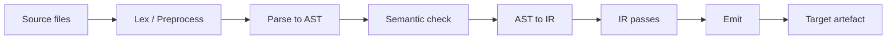

# Compilation Pipeline Overview

This document is the index to the per-stage pipeline documents under
[pipeline/](.). It traces the flow of data from a source buffer to an
emitted target artefact and points at the file(s) that drive each
stage. Readers who want depth should follow the per-stage links.

The intended reader knows what a compiler is in general but has not yet
mapped Slang's pipeline onto its source layout.

## End-to-end flow

The diagram is conceptual — actual control flow weaves checking and
parsing together (see [02-parse-ast.md](02-parse-ast.md) for the
two-stage parser) and the IR pass list is target-sensitive. The
ordering here reflects the dominant data hand-off, not strict
sequencing.

## Stages

### Lex / Preprocess

Reads source buffers and produces a flat array of `Token`. Lexing,
preprocessing, and `#include` resolution all complete before parsing
begins.

Driven by:

- [slang-lexer.cpp](../../../source/compiler-core/slang-lexer.cpp)
  (lexer)
- [slang-preprocessor.cpp](../../../source/slang/slang-preprocessor.cpp)
  (preprocessor and `#include`)
- [slang-include-system.cpp](../../../source/compiler-core/slang-include-system.cpp)
  (path resolution)

Detail: [01-lex-preprocess.md](01-lex-preprocess.md).

### Parse to AST

Recursive-descent parsing produces a strongly-typed AST. Slang uses a
two-stage strategy: at the decl-parsing stage function bodies are
captured as raw token lists; at the body-parsing stage they are
re-parsed lazily under the supervision of the semantic checker so that
generic / comparison disambiguation has type information to lean on.

Driven by:

- [slang-parser.cpp](../../../source/slang/slang-parser.cpp)
- the `slang-ast-*.h` headers under
  [source/slang/](../../../source/slang/) (AST data model)

Detail: [02-parse-ast.md](02-parse-ast.md).

### Semantic check

A family of `SemanticsVisitor` subclasses split across
`slang-check-*.cpp` resolves names, attaches types, validates
modifiers, performs overload resolution and conformance checking, and
synthesizes default conformance witnesses and generated members.

Driven by:

- [slang-check.cpp](../../../source/slang/slang-check.cpp)
- the per-concern files
  ([slang-check-decl.cpp](../../../source/slang/slang-check-decl.cpp),
  [slang-check-expr.cpp](../../../source/slang/slang-check-expr.cpp),
  [slang-check-stmt.cpp](../../../source/slang/slang-check-stmt.cpp),
  ..., [slang-check-shader.cpp](../../../source/slang/slang-check-shader.cpp))

Detail: [03-semantic-check.md](03-semantic-check.md).

### AST → IR lowering

The checked AST is walked by the lowering visitor, which emits Slang
IR via `IRBuilder`. Decls become `IRGlobalVar` / `IRFunc` /
`IRStructType` / `IRGeneric`; statements become basic blocks with
parameters; expressions become SSA value instructions.

Driven by:

- [slang-lower-to-ir.cpp](../../../source/slang/slang-lower-to-ir.cpp)
- [slang-ir.cpp](../../../source/slang/slang-ir.cpp) (`IRBuilder`,
  hoistable / global value deduplication)

Detail: [04-ast-to-ir.md](04-ast-to-ir.md).

### IR passes

The `linkAndOptimizeIR` function in
[slang-emit.cpp](../../../source/slang/slang-emit.cpp) (line 893 at
`source_commit`) drives a long, target-sensitive sequence of IR
transformations between lowering and emit. The
[source/slang/](../../../source/slang/) directory contains roughly 300
`slang-ir-*.cpp` files implementing analyses, validations,
specializations, legalizations, and target-specific lowerings.

Driven by:

- [slang-emit.cpp](../../../source/slang/slang-emit.cpp) (orchestrator)
- the `slang-ir-*` family (individual passes)

Detail: [05-ir-passes.md](05-ir-passes.md).

### Emit

`emitEntryPointsSourceFromIR`
([slang-emit.cpp](../../../source/slang/slang-emit.cpp) line 2418 at
`source_commit`) selects the right backend for each `TargetRequest`
and produces a target artefact: HLSL, GLSL, SPIR-V, Metal, WGSL, C++,
CUDA, Torch glue, LLVM IR / native via `slang-llvm`, or VM bytecode.

Driven by:

- [slang-emit.cpp](../../../source/slang/slang-emit.cpp) (dispatcher)
- one `slang-emit-<target>.cpp` per backend
  ([source/slang/](../../../source/slang/))

Detail: [06-emit.md](06-emit.md).

## Driver entry points

The high-level objects that orchestrate the stages above live in
[source/slang/](../../../source/slang/):

- [slang-compile-request.h](../../../source/slang/slang-compile-request.h)
  declares `FrontEndCompileRequest` / `CompileRequestBase`.
  `slang-end-to-end-request.cpp` declares `EndToEndCompileRequest`,
  which is what a single `slangc` invocation (or
  `slang::ICompileRequest`) becomes.
- [slang-module.h](../../../source/slang/slang-module.h) declares
  `Module`, the result object the front-end produces (AST + IR) and
  the implementation of `IModule` from
  [include/slang.h](../../../include/slang.h).
- [slang-emit.cpp](../../../source/slang/slang-emit.cpp) is the
  back-end dispatcher invoked once the front-end has produced a
  composite `IComponentType` for the targets to be generated.

The architecture-level introduction of these objects is in
[../architecture/overview.md](../architecture/overview.md).

## Cross-cutting concerns

Several concerns touch every stage. They live in
[../cross-cutting/](../cross-cutting/) instead of in any one stage doc:

- **Diagnostics** — every stage reports through `DiagnosticSink`. See
  [../cross-cutting/diagnostics.md](../cross-cutting/diagnostics.md).
- **IR instructions** — the opcode catalog
  ([../cross-cutting/ir-instructions.md](../cross-cutting/ir-instructions.md))
  is shared by lowering, every IR pass, and emit.
- **Targets and capabilities** — choices about target / profile shape
  what the back-end stages do
  ([../cross-cutting/targets.md](../cross-cutting/targets.md)).
- **Core module / preludes** — provide built-in types and intrinsics
  to the front-end and inject text into emitted code
  ([../cross-cutting/core-module.md](../cross-cutting/core-module.md)).
- **Serialization** — both AST and IR can be saved / loaded across
  pipeline stages
  ([../cross-cutting/serialization.md](../cross-cutting/serialization.md)).
