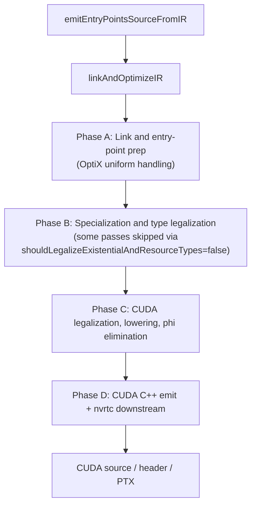
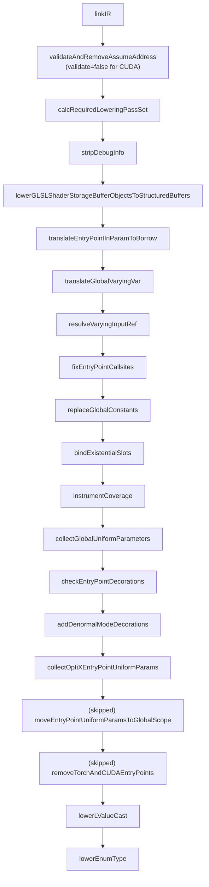
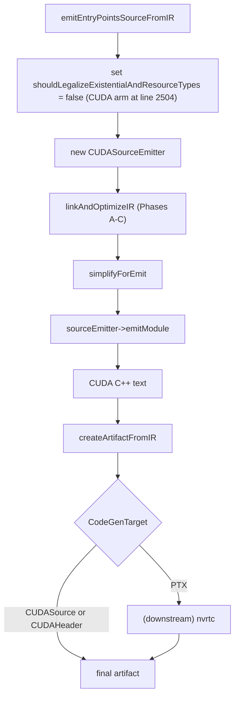

# CUDA Target Pipeline

This page documents the ordered IR-pass and downstream-binary
sequence executed when Slang compiles for the CUDA target family.
The corresponding `CodeGenTarget` values are `CUDASource`,
`CUDAHeader`, and `PTX`. All three share the same IR pipeline
inside `linkAndOptimizeIR` via `isCUDATarget(targetRequest)`. The
PTX target diverges only in `createArtifactFromIR` and the
downstream-compile dispatch, which hands the emitted CUDA C++
source to nvrtc (or the runtime CUDA compiler) for PTX
generation.

This page complements
[../pipeline/05-ir-passes.md](../pipeline/05-ir-passes.md), which
is an unordered topical catalog of every IR pass. Branches in
`linkAndOptimizeIR` gated on a sibling target (SPIR-V, HLSL,
Metal, WGSL, GLSL, pure CPP / Host) are filtered out of the
diagrams and tables below. CUDA shares a few arms with CPU /
Metal (`undoParameterCopy`, `transformParamsToConstRef`,
`introduceExplicitGlobalContext`); those passes are included
because they reach CUDA, but the other targets in those arms are
documented on their own pages.

## Source

- [slang-emit.cpp](../../../source/slang/slang-emit.cpp) —
  `linkAndOptimizeIR` (line ~892) is the orchestrator;
  `emitEntryPointsSourceFromIR` (line ~2365) constructs the
  `CUDASourceEmitter` and emits CUDA C++ text.
- [slang-emit-cuda.cpp](../../../source/slang/slang-emit-cuda.cpp)
  — `CUDASourceEmitter` implementation.
- [slang-emit-cpp.cpp](../../../source/slang/slang-emit-cpp.cpp)
  — `CPPSourceEmitter` base class that `CUDASourceEmitter`
  inherits from.
- [slang-emit-c-like.cpp](../../../source/slang/slang-emit-c-like.cpp)
  — shared C-like emitter base.
- [slang-ir-cuda-immutable-load.cpp](../../../source/slang/slang-ir-cuda-immutable-load.cpp)
  — `lowerImmutableBufferLoadForCUDA`.
- [slang-ir-legalize-varying-params.cpp](../../../source/slang/slang-ir-legalize-varying-params.cpp)
  — `legalizeEntryPointVaryingParamsForCUDA`.
- [slang-ir-optix-entry-point-uniforms.cpp](../../../source/slang/slang-ir-optix-entry-point-uniforms.cpp)
  — `collectOptiXEntryPointUniformParams`.
- [slang-ir-pytorch-cpp-binding.cpp](../../../source/slang/slang-ir-pytorch-cpp-binding.cpp)
  — `removeTorchAndCUDAEntryPoints`, `removeTorchKernels`,
  `lowerBuiltinTypesForKernelEntryPoints`, `handleAutoBindNames`.
- [slang-ir-synthesize-active-mask.cpp](../../../source/slang/slang-ir-synthesize-active-mask.cpp)
  — `synthesizeActiveMask`.
- [slang-target-program.h](../../../source/slang/slang-target-program.h)
  / [slang-compiler-options.h](../../../source/slang/slang-compiler-options.h)
  — gate sources.

## High-level phase diagram

A defining feature of the CUDA pipeline: at line 2504 of
`slang-emit.cpp`, `emitEntryPointsSourceFromIR` sets
`shouldLegalizeExistentialAndResourceTypes = false` for the CUDA
arm, which causes several Phase-B passes inside
`linkAndOptimizeIR` to take their `else` branches.

## Phase A: Link and entry-point prep

Spans roughly lines 927-1170 of
[slang-emit.cpp](../../../source/slang/slang-emit.cpp). CUDA has
two arms it hits in this phase that other shader targets do not:

- `collectOptiXEntryPointUniformParams` runs at line ~1099
  (`case CUDASource: case CUDAHeader:`) instead of
  `collectEntryPointUniformParams`. This handles OptiX's
  Shader Binding Table (SBT) entry-point uniform parameters
  through a CUDA/OptiX-specific scheme.
- `moveEntryPointUniformParamsToGlobalScope` is **skipped** for
  CUDA (line ~1117-1136: CUDA is in the explicit case list that
  breaks without running the pass).

CUDA is also in the explicit case list for the
`removeTorchAndCUDAEntryPoints` switch (line ~1140) and thus
**skips** that pass too — its entry points are valid CUDA
kernels.

| # | Pass | File | Gate | Notes |
| --- | --- | --- | --- | --- |
| 1 | `linkIR` | [slang-ir-link.cpp](../../../source/slang/slang-ir-link.cpp) | (always) | |
| 2 | `validateAndRemoveAssumeAddress` | [slang-ir-validate.cpp](../../../source/slang/slang-ir-validate.cpp) | (always) | **`validate = false` for CUDA** (line 960: `!isCPUTarget && !isCUDATarget`); contrast with HLSL / Metal / WGSL / SPIR-V which validate. |
| 3 | `stripDebugInfo` | [slang-ir-strip-debug-info.cpp](../../../source/slang/slang-ir-strip-debug-info.cpp) | `reqSet.debugInfo && DebugInfoLevel::None` | |
| 4 | `lowerGLSLShaderStorageBufferObjectsToStructuredBuffers` | [slang-ir-lower-glsl-ssbo-types.cpp](../../../source/slang/slang-ir-lower-glsl-ssbo-types.cpp) | `!isKhronosTarget && reqSet.glslSSBO` | CUDA is non-Khronos. |
| 5 | `translateEntryPointInParamToBorrow` | [slang-ir-transform-params-to-constref.cpp](../../../source/slang/slang-ir-transform-params-to-constref.cpp) | (always) | |
| 6 | `translateGlobalVaryingVar` | [slang-ir-translate-global-varying-var.cpp](../../../source/slang/slang-ir-translate-global-varying-var.cpp) | `reqSet.globalVaryingVar` | |
| 7 | `resolveVaryingInputRef` | [slang-ir-resolve-varying-input-ref.cpp](../../../source/slang/slang-ir-resolve-varying-input-ref.cpp) | `reqSet.resolveVaryingInputRef` | |
| 8 | `fixEntryPointCallsites` | [slang-ir-fix-entrypoint-callsite.cpp](../../../source/slang/slang-ir-fix-entrypoint-callsite.cpp) | (always) | |
| 9 | `replaceGlobalConstants` | [slang-ir-link.cpp](../../../source/slang/slang-ir-link.cpp) | (always) | |
| 10 | `bindExistentialSlots` | [slang-ir-bind-existentials.cpp](../../../source/slang/slang-ir-bind-existentials.cpp) | `reqSet.bindExistential` | |
| 11 | `instrumentCoverage` | [slang-ir-coverage-instrument.cpp](../../../source/slang/slang-ir-coverage-instrument.cpp) | `reqSet.coverageTracing` | The coverage buffer is packed into `GlobalParams` for CUDA. |
| 12 | `collectGlobalUniformParameters` | [slang-ir-collect-global-uniforms.cpp](../../../source/slang/slang-ir-collect-global-uniforms.cpp) | (always) | |
| 13 | `checkEntryPointDecorations` | [slang-ir-entry-point-decorations.cpp](../../../source/slang/slang-ir-entry-point-decorations.cpp) | (always) | |
| 14 | `addDenormalModeDecorations` | [slang-emit.cpp](../../../source/slang/slang-emit.cpp) | (always) | Static helper. |
| 15 | `collectOptiXEntryPointUniformParams` | [slang-ir-optix-entry-point-uniforms.cpp](../../../source/slang/slang-ir-optix-entry-point-uniforms.cpp) | `case CUDASource / CUDAHeader` (line ~1097) | **CUDA-only.** Replaces the `collectEntryPointUniformParams` that the other shader targets run. |
| - | *(skip)* `moveEntryPointUniformParamsToGlobalScope` | [slang-ir-entry-point-uniforms.cpp](../../../source/slang/slang-ir-entry-point-uniforms.cpp) | CUDA in the explicit skip list (line ~1126) | Other shader targets run this; CUDA's params remain on the entry point. |
| - | *(skip)* `removeTorchAndCUDAEntryPoints` | [slang-ir-pytorch-cpp-binding.cpp](../../../source/slang/slang-ir-pytorch-cpp-binding.cpp) | CUDA in the explicit skip list (line ~1140) | CUDA's entry points are valid CUDA kernels. |
| 16 | `lowerLValueCast` | [slang-ir-lower-l-value-cast.cpp](../../../source/slang/slang-ir-lower-l-value-cast.cpp) | (always) | |
| 17 | `lowerEnumType` | [slang-ir-lower-enum-type.cpp](../../../source/slang/slang-ir-lower-enum-type.cpp) | `reqSet.enumType` | |

Filtered out for CUDA in this phase: the HostCPPSource / HostVM /
HostLLVMIR / HostObjectCode / HostHostCallable arm of the
`collectEntryPointUniformParams` switch; the
CPPSource / CPPHeader / ShaderLLVMIR / ShaderObjectCode /
ShaderHostCallable arms (which run `collectEntryPointUniformParams`
with `alwaysCreateCollectedParam = true`).

## Phase B: Specialization and type legalization

Spans roughly lines 1172-1714 of `slang-emit.cpp`. CUDA's
divergence from the SPIR-V / Metal / WGSL / HLSL paths is most
visible here:

1. `generateDerivativeWrappers` runs at line ~1198 (CUDA /
   CUDAHeader / PyTorch arm) if `reqSet.derivativePyBindWrapper`.
2. `lowerCooperativeVectors` runs **only** if the target caps do
   not imply `optix_coopvec` (line ~1457-1462, `case CUDASource:`
   arm). On OptiX targets with hardware cooperative-vector
   support, Slang preserves the IR-level instruction.
3. `lowerBuiltinTypesForKernelEntryPoints`, `removeTorchKernels`,
   and `handleAutoBindNames` run for CUDA at line ~1318-1322
   (`case CUDASource: case CUDAHeader:` arm). These strip
   Slang-only shader types from kernel signatures, remove any
   PyTorch entry points that leaked in, and apply auto-bind
   name handling.
4. `inferAnyValueSizeWhereNecessary` and most of the standard
   Phase-B inventory run as usual.
5. `lowerCombinedTextureSamplers` runs for CUDA because it is in
   the CPU-like fallthrough arm at line ~1513 (the `default` arm
   `[[fallthrough]]`s when `isCpuLikeTarget`, and CUDA is
   CPU-like for the purposes of this switch).
6. The Slang-emit caller (`emitEntryPointsSourceFromIR`) sets
   `options.shouldLegalizeExistentialAndResourceTypes = false`
   for CUDA at line 2504. Inside `linkAndOptimizeIR`, this
   causes:
   - `legalizeExistentialTypeLayout` to skip.
   - `legalizeResourceTypes` to skip.
   - The Metal-only `legalizeEmptyTypes` arm inside the block
     does not apply.
   - The CPU/CUDA fallback `legalizeEmptyTypes` (line ~1648)
     runs instead.
7. `inlineGlobalConstantsForLegalization` runs unconditionally for
   CUDA at line ~1543 (an explicit CUDA-only short-circuit:
   `target == CUDASource ||
   (isCPUTarget && isKernelTarget) ||
   shouldLegalizeExistentialAndResourceTypes`).
8. `wrapStructuredBuffersOfMatrices` and
   `wrapCBufferElementsForMetal` are both **skipped** (HLSL /
   Metal only).

```mermaid
flowchart TD
  s1[simplifyIR default]
  vu[validateUniformity]
  sML[specializeMatrixLayout]
  fSC[fuseCallsToSaturatedCooperation]
  gDW["generateDerivativeWrappers (CUDA arm)"]
  cAP[checkAutodiffPatterns]
  dCC[diagnoseCircularConformances]
  sM[specializeModule]
  sHOP[specializeHigherOrderParameters]
  fADP[finalizeAutoDiffPass]
  lMSS[lowerMatrixSwizzleStores]
  dce1[eliminateDeadCode]
  fS[finalizeSpecialization]
  lDTI[lowerDiffTypeInfoInsts]
  lRT[lowerResultType]
  lCT[lowerConditionalType]
  lRO[lowerReinterpretOptional]
  cONU[checkForOptionalNoneUsage]
  lOT[lowerOptionalType]
  reqSet2[calcRequiredLoweringPassSet]
  lBTK["lowerBuiltinTypesForKernelEntryPoints (CUDA arm)"]
  rTK[removeTorchKernels]
  hABN[handleAutoBindNames]
  dUR[detectUninitializedResources]
  rAIDD[removeAvailableInDownstreamModuleDecorations]
  checks["checkForRecursive* checkForOutOfBoundAccess<br/>checkForMissingReturns checkForInvalidShaderParameterType"]
  iAVS[inferAnyValueSizeWhereNecessary]
  uPWT[unpinWitnessTables]
  lSVMI[lowerSumVectorMatrixInsts]
  s2a[simplifyIR fast]
  lTUT[lowerTaggedUnionTypes]
  lUUT[lowerUntaggedUnionTypes]
  lR[lowerReinterpret]
  lSIDC[lowerSequentialIDTagCasts]
  lTI[lowerTagInsts]
  lTT[lowerTagTypes]
  dce3[eliminateDeadCode]
  lE[lowerExistentials]
  rWUI[removeWeakUseInsts]
  pTIN["(skipped) performTypeInlining<br/>CUDA is CPU-like"]
  cGSHI[checkGetStringHashInsts]
  dce4[eliminateDeadCode]
  lTu[lowerTuples]
  gAVMF[generateAnyValueMarshallingFunctions]
  sSS[specializeStageSwitch]
  lCV["lowerCooperativeVectors (if !optix_coopvec)"]
  pFI1[performForceInlining]
  s2b[simplifyIR default]
  lACSB[lowerAppendConsumeStructuredBuffers]
  lCTS[lowerCombinedTextureSamplers]
  lEA[legalizeEmptyArray]
  lVT[legalizeVectorTypes]
  iGC["inlineGlobalConstantsForLegalization<br/>(CUDA always; line 1543)"]
  skipETL["(skipped) legalizeExistentialTypeLayout<br/>shouldLegalizeExistentialAndResourceTypes=false"]
  skipRT["(skipped) legalizeResourceTypes<br/>shouldLegalizeExistentialAndResourceTypes=false"]
  lET_cpu["legalizeEmptyTypes<br/>(CPU/CUDA else branch, line 1648)"]
  lMT[legalizeMatrixTypes]
  s2c[simplifyIR fast]
  lDRH[lowerDynamicResourceHeap]
  sRU[specializeResourceUsage]
  sFBLA1[specializeFuncsForBufferLoadArgs]
  dBL[deferBufferLoad]
  sAP[specializeArrayParameters]
  cSA[checkStaticAssert]

  s1 --> vu --> sML --> fSC --> gDW --> cAP --> dCC --> sM --> sHOP --> fADP --> lMSS --> dce1 --> fS --> lDTI --> lRT --> lCT --> lRO --> cONU --> lOT --> reqSet2 --> lBTK --> rTK --> hABN --> dUR --> rAIDD --> checks --> iAVS --> uPWT --> lSVMI --> s2a --> lTUT --> lUUT --> lR --> lSIDC --> lTI --> lTT --> dce3 --> lE --> rWUI --> pTIN --> cGSHI --> dce4 --> lTu --> gAVMF --> sSS --> lCV --> pFI1 --> s2b --> lACSB --> lCTS --> lEA --> lVT --> iGC --> skipETL --> skipRT --> lET_cpu --> lMT --> s2c --> lDRH --> sRU --> sFBLA1 --> dBL --> sAP --> cSA
```

(Conditional gates omitted from the diagram for readability;
see the conditional-gates table.)

| # | Pass | File | Gate | Notes |
| --- | --- | --- | --- | --- |
| 1 | `simplifyIR` | [slang-ir-ssa-simplification.cpp](../../../source/slang/slang-ir-ssa-simplification.cpp) | (always) | |
| 2 | `validateUniformity` | [slang-ir-uniformity.cpp](../../../source/slang/slang-ir-uniformity.cpp) | `getBoolOption(ValidateUniformity)` | |
| 3 | `specializeMatrixLayout` | [slang-ir-specialize-matrix-layout.cpp](../../../source/slang/slang-ir-specialize-matrix-layout.cpp) | (always) | |
| 4 | `fuseCallsToSaturatedCooperation` | [slang-ir-fuse-satcoop.cpp](../../../source/slang/slang-ir-fuse-satcoop.cpp) | `!shouldPerformMinimumOptimizations` | |
| 5 | `generateDerivativeWrappers` | [slang-ir-autodiff.cpp](../../../source/slang/slang-ir-autodiff.cpp) | `reqSet.derivativePyBindWrapper && case CUDASource / CUDAHeader / PyTorchCppBinding` (line ~1198) | **CUDA/PyTorch only.** |
| 6 | `checkAutodiffPatterns` | [slang-ir-check-differentiability.cpp](../../../source/slang/slang-ir-check-differentiability.cpp) | `reqSet.autodiff` | |
| 7 | `diagnoseCircularConformances` | [slang-ir-any-value-inference.cpp](../../../source/slang/slang-ir-any-value-inference.cpp) | (always) | |
| 8 | `specializeModule` | [slang-ir-specialize.cpp](../../../source/slang/slang-ir-specialize.cpp) | `!isSpecializationDisabled()` | |
| 9 | `specializeHigherOrderParameters` | [slang-ir-defunctionalization.cpp](../../../source/slang/slang-ir-defunctionalization.cpp) | `reqSet.higherOrderFunc` | |
| 10 | `finalizeAutoDiffPass` | [slang-ir-autodiff.cpp](../../../source/slang/slang-ir-autodiff.cpp) | (always) | |
| 11 | `lowerMatrixSwizzleStores` | [slang-ir-lower-matrix-swizzle-store.cpp](../../../source/slang/slang-ir-lower-matrix-swizzle-store.cpp) | `reqSet.matrixSwizzleStore` | |
| 12 | `eliminateDeadCode` | [slang-ir-dce.cpp](../../../source/slang/slang-ir-dce.cpp) | (always) | |
| 13 | `finalizeSpecialization` | [slang-ir-specialize.cpp](../../../source/slang/slang-ir-specialize.cpp) | (always) | |
| 14 | `lowerDiffTypeInfoInsts` | [slang-ir-autodiff.cpp](../../../source/slang/slang-ir-autodiff.cpp) | (always) | Direct call. |
| 15 | `lowerResultType` | [slang-ir-lower-result-type.cpp](../../../source/slang/slang-ir-lower-result-type.cpp) | `reqSet.resultType` | |
| 16 | `lowerConditionalType` | [slang-ir-lower-conditional-type.cpp](../../../source/slang/slang-ir-lower-conditional-type.cpp) | `reqSet.conditionalType` | |
| 17 | `lowerReinterpretOptional` | [slang-ir-lower-reinterpret.cpp](../../../source/slang/slang-ir-lower-reinterpret.cpp) | `reqSet.optionalType` | |
| 18 | `checkForOptionalNoneUsage` | [slang-ir-check-optional-none-usage.cpp](../../../source/slang/slang-ir-check-optional-none-usage.cpp) | `shouldRunNonEssentialValidation()` | |
| 19 | `lowerOptionalType` | [slang-ir-lower-optional-type.cpp](../../../source/slang/slang-ir-lower-optional-type.cpp) | `reqSet.optionalType` | |
| 20 | `lowerBuiltinTypesForKernelEntryPoints` | [slang-ir-pytorch-cpp-binding.cpp](../../../source/slang/slang-ir-pytorch-cpp-binding.cpp) | `case CUDASource / CUDAHeader` (line ~1320) | **CUDA-arm + PyTorch arm.** Strips Slang shader types from kernel signatures. |
| 21 | `removeTorchKernels` | [slang-ir-pytorch-cpp-binding.cpp](../../../source/slang/slang-ir-pytorch-cpp-binding.cpp) | `case CUDASource / CUDAHeader` (line ~1321) | Removes any PyTorch entry points still present. |
| 22 | `handleAutoBindNames` | [slang-ir-pytorch-cpp-binding.cpp](../../../source/slang/slang-ir-pytorch-cpp-binding.cpp) | `case CUDASource / CUDAHeader` (line ~1322) | |
| 23 | `detectUninitializedResources` | [slang-ir-detect-uninitialized-resources.cpp](../../../source/slang/slang-ir-detect-uninitialized-resources.cpp) | (always) | |
| 24 | `removeAvailableInDownstreamModuleDecorations` | [slang-ir-redundancy-removal.cpp](../../../source/slang/slang-ir-redundancy-removal.cpp) | `removeAvailableInDownstreamIR` | |
| 25 | `checkForRecursiveTypes` | [slang-ir-check-recursion.cpp](../../../source/slang/slang-ir-check-recursion.cpp) | `shouldRunNonEssentialValidation()` | |
| 26 | `checkForRecursiveFunctions` | [slang-ir-check-recursion.cpp](../../../source/slang/slang-ir-check-recursion.cpp) | `shouldRunNonEssentialValidation()` | |
| 27 | `checkForOutOfBoundAccess` | [slang-check-out-of-bound-access.cpp](../../../source/slang/slang-check-out-of-bound-access.cpp) | `shouldRunNonEssentialValidation()` | |
| 28 | `checkForMissingReturns` | [slang-ir-missing-return.cpp](../../../source/slang/slang-ir-missing-return.cpp) | `reqSet.missingReturn` | |
| 29 | `checkForInvalidShaderParameterType` | [slang-ir-check-shader-parameter-type.cpp](../../../source/slang/slang-ir-check-shader-parameter-type.cpp) | `shouldRunNonEssentialValidation()` | |
| 30 | `inferAnyValueSizeWhereNecessary` | [slang-ir-any-value-inference.cpp](../../../source/slang/slang-ir-any-value-inference.cpp) | (always) | |
| 31 | `unpinWitnessTables` | [slang-ir-strip-legalization-insts.cpp](../../../source/slang/slang-ir-strip-legalization-insts.cpp) | (always) | |
| 32 | `lowerSumVectorMatrixInsts` | [slang-emit.cpp](../../../source/slang/slang-emit.cpp) | (always) | Static helper. |
| 33 | `simplifyIR` | [slang-ir-ssa-simplification.cpp](../../../source/slang/slang-ir-ssa-simplification.cpp) | `!minimalOptimization` | |
| 34 | `lowerTaggedUnionTypes` | [slang-ir-lower-dynamic-dispatch-insts.cpp](../../../source/slang/slang-ir-lower-dynamic-dispatch-insts.cpp) | (always) | |
| 35 | `lowerUntaggedUnionTypes` | [slang-ir-lower-dynamic-dispatch-insts.cpp](../../../source/slang/slang-ir-lower-dynamic-dispatch-insts.cpp) | (always) | |
| 36 | `lowerReinterpret` | [slang-ir-lower-reinterpret.cpp](../../../source/slang/slang-ir-lower-reinterpret.cpp) | `reqSet.reinterpret` | |
| 37 | `lowerSequentialIDTagCasts` | [slang-ir-lower-dynamic-dispatch-insts.cpp](../../../source/slang/slang-ir-lower-dynamic-dispatch-insts.cpp) | (always) | |
| 38 | `lowerTagInsts` | [slang-ir-lower-dynamic-dispatch-insts.cpp](../../../source/slang/slang-ir-lower-dynamic-dispatch-insts.cpp) | (always) | |
| 39 | `lowerTagTypes` | [slang-ir-lower-dynamic-dispatch-insts.cpp](../../../source/slang/slang-ir-lower-dynamic-dispatch-insts.cpp) | (always) | |
| 40 | `eliminateDeadCode` | [slang-ir-dce.cpp](../../../source/slang/slang-ir-dce.cpp) | (always) | |
| 41 | `lowerExistentials` | [slang-ir-lower-dynamic-dispatch-insts.cpp](../../../source/slang/slang-ir-lower-dynamic-dispatch-insts.cpp) | (always) | |
| 42 | `removeWeakUseInsts` | [slang-ir-redundancy-removal.cpp](../../../source/slang/slang-ir-redundancy-removal.cpp) | (always) | |
| - | *(skip)* `performTypeInlining` | [slang-ir-inline.cpp](../../../source/slang/slang-ir-inline.cpp) | `!isCpuLikeTarget(artifactDesc)` (false for CUDA) | CUDA is CPU-like in `ArtifactDescUtil::isCpuLikeTarget`. |
| - | *(skip)* `checkGetStringHashInsts` | [slang-ir-string-hash.cpp](../../../source/slang/slang-ir-string-hash.cpp) | Skipped for CPU-like targets. | |
| 43 | `eliminateDeadCode` | [slang-ir-dce.cpp](../../../source/slang/slang-ir-dce.cpp) | (always, direct call) | |
| 44 | `lowerTuples` | [slang-ir-lower-tuple-types.cpp](../../../source/slang/slang-ir-lower-tuple-types.cpp) | (always) | |
| 45 | `generateAnyValueMarshallingFunctions` | [slang-ir-any-value-marshalling.cpp](../../../source/slang/slang-ir-any-value-marshalling.cpp) | (always) | |
| 46 | `specializeStageSwitch` | [slang-ir-specialize-stage-switch.cpp](../../../source/slang/slang-ir-specialize-stage-switch.cpp) | `reqSet.specializeStageSwitch` | |
| 47 | `lowerCooperativeVectors` | [slang-ir-lower-coopvec.cpp](../../../source/slang/slang-ir-lower-coopvec.cpp) | `case CUDASource && !targetCaps.implies(optix_coopvec)` (line ~1457-1462) | **Conditional**: only fires when OptiX hardware support is absent. |
| 48 | `performForceInlining` | [slang-ir-inline.cpp](../../../source/slang/slang-ir-inline.cpp) | (always) | |
| 49 | `simplifyIR` | [slang-ir-ssa-simplification.cpp](../../../source/slang/slang-ir-ssa-simplification.cpp) | `!minimalOptimization` | |
| 50 | `lowerAppendConsumeStructuredBuffers` | [slang-ir-lower-append-consume-structured-buffer.cpp](../../../source/slang/slang-ir-lower-append-consume-structured-buffer.cpp) | `target != HLSL` (true for CUDA) | |
| 51 | `lowerCombinedTextureSamplers` | [slang-ir-lower-combined-texture-sampler.cpp](../../../source/slang/slang-ir-lower-combined-texture-sampler.cpp) | `reqSet.combinedTextureSamplers` (CUDA reached via the `default` arm + `isCpuLikeTarget` fallthrough at line ~1513) | |
| 52 | `legalizeEmptyArray` | [slang-ir-legalize-empty-array.cpp](../../../source/slang/slang-ir-legalize-empty-array.cpp) | (always) | |
| 53 | `legalizeVectorTypes` | [slang-ir-legalize-vector-types.cpp](../../../source/slang/slang-ir-legalize-vector-types.cpp) | (always) | |
| 54 | `inlineGlobalConstantsForLegalization` | [slang-ir-legalize-global-values.cpp](../../../source/slang/slang-ir-legalize-global-values.cpp) | `target == CUDASource \|\| (isCPUTarget && isKernelTarget) \|\| shouldLegalizeExistentialAndResourceTypes` (line ~1543) | **CUDA always runs this** to avoid dynamic `__device__` initialization (rejected by nvrtc). |
| - | *(skip)* `legalizeExistentialTypeLayout` | [slang-ir-legalize-types.cpp](../../../source/slang/slang-ir-legalize-types.cpp) | `shouldLegalizeExistentialAndResourceTypes = false` | CUDA's C++ template system handles existentials. |
| - | *(skip)* `legalizeResourceTypes` | [slang-ir-legalize-types.cpp](../../../source/slang/slang-ir-legalize-types.cpp) | `shouldLegalizeExistentialAndResourceTypes = false` | CUDA's resource handles are direct CUDA types. |
| 55 | `legalizeEmptyTypes` | [slang-ir-legalize-types.cpp](../../../source/slang/slang-ir-legalize-types.cpp) | `!shouldLegalizeExistentialAndResourceTypes` (else branch at line ~1648) | Eliminates empty types not part of the public interface. |
| 56 | `legalizeMatrixTypes` | [slang-ir-legalize-matrix-types.cpp](../../../source/slang/slang-ir-legalize-matrix-types.cpp) | (always) | |
| 57 | `simplifyIR` | [slang-ir-ssa-simplification.cpp](../../../source/slang/slang-ir-ssa-simplification.cpp) | `!minimalOptimization` | |
| 58 | `lowerDynamicResourceHeap` | [slang-ir-lower-dynamic-resource-heap.cpp](../../../source/slang/slang-ir-lower-dynamic-resource-heap.cpp) | `reqSet.dynamicResourceHeap` | |
| 59 | `specializeResourceUsage` | [slang-ir-specialize-resources.cpp](../../../source/slang/slang-ir-specialize-resources.cpp) | (always) | |
| 60 | `specializeFuncsForBufferLoadArgs` | [slang-ir-specialize-buffer-load-arg.cpp](../../../source/slang/slang-ir-specialize-buffer-load-arg.cpp) | (always) | |
| 61 | `deferBufferLoad` | [slang-ir-defer-buffer-load.cpp](../../../source/slang/slang-ir-defer-buffer-load.cpp) | (always) | |
| 62 | `specializeArrayParameters` | [slang-ir-specialize-arrays.cpp](../../../source/slang/slang-ir-specialize-arrays.cpp) | (always) | |

Filtered out for CUDA in this phase: the
`legalizeNonVectorCompositeSelect` HLSL-only arm; the CPP /
HostCPP arms (`lowerComInterfaces`,
`generateDllImportFuncs`, `generateDllExportFuncs`); the
PyTorch-only arm
(`generateHostFunctionsForAutoBindCuda`, `generatePyTorchCppBinding`);
the HostVM early return; the HLSL
`wrapStructuredBuffersOfMatrices` arm; the Metal
`wrapCBufferElementsForMetal` arm; the HLSL / SPIR-V
`legalizeEmptyRayPayloadsForHLSL` arm; the HLSL
`legalizeNonStructParameterToStructForHLSL` arm; the Metal-only
`legalizeEmptyTypes` arm and the Metal-only
`lowerBufferElementTypeToStorageType (MetalParameterBlock)`
invocation; the CPU-LLVM
`lowerBufferElementTypeToStorageType (LLVM)` invocation.

## Phase C: CUDA legalization, lowering, phi elimination

Spans roughly lines 1745-2360 of `slang-emit.cpp`. CUDA has
**no single legalization driver** function; the target-specific
work is concentrated in three passes: `synthesizeActiveMask`
(line ~1890), `legalizeEntryPointVaryingParamsForCUDA` (line
~1962), and `lowerImmutableBufferLoadForCUDA` (line ~2210). CUDA
shares Phase-C arms with CPU and Metal at several places:
`undoParameterCopy` (line ~2048),
`transformParamsToConstRef` (line ~2050), and the fallthrough to
`moveGlobalVarInitializationToEntryPoints` +
`introduceExplicitGlobalContext` (line ~2057-2061).

```mermaid
flowchart TD
  babbGate{reqSet.byteAddressBuffer}
  lBABOps_cuda["legalizeByteAddressBufferOps<br/>(default options for CUDA)"]
  vAO[validateAtomicOperations]
  sAM[synthesizeActiveMask]
  rTF["(skipped) resolveTextureFormat<br/>GLSL/SPIRV/WGSL only"]
  lEPVPCUDA[legalizeEntryPointVaryingParamsForCUDA]
  fNRI_skip["(skipped) floatNonUniformResourceIndex<br/>CUDA not in any of the four arms"]
  lLAO_skip["(skipped) legalizeLogicalAndOr<br/>CUDA not in any arm"]
  lISub_skip["(skipped) legalizeImageSubscript<br/>Metal/GLSL/SPIRV only"]
  uPC[undoParameterCopy]
  tPCRef[transformParamsToConstRef]
  mGVI[moveGlobalVarInitializationToEntryPoints]
  iEGC[introduceExplicitGlobalContext]
  sLOI[stripLegalizationOnlyInstructions]
  vVAM[validateVectorsAndMatrices]
  dce7[eliminateDeadCode]
  pLRC[processLateRequireCapabilityInsts]
  cUV[cleanUpVoidType]
  bqGate{reqSet.bindingQuery}
  lBQ[lowerBindingQueries]
  meshGate{reqSet.meshOutput}
  lMO[legalizeMeshOutputTypes]
  bcGate{reqSet.bitcast}
  lBC[lowerBitCast]
  lART[legalizeArrayReturnType]
  lUBL_skip["(skipped) legalizeUniformBufferLoad<br/>Khronos/HLSL only"]
  lBETST_def["lowerBufferElementTypeToStorageType<br/>(Default policy)"]
  lIBLCUDA[lowerImmutableBufferLoadForCUDA]
  pFI2[performForceInlining]
  eMB[eliminateMultiLevelBreak]
  s2d[simplifyIR with removeTrivialSingleIterationLoops]
  lET2[legalizeEmptyTypes]
  ePhi["eliminatePhis (default options)"]
  sNSIR[simplifyNonSSAIR]
  aVSC[applyVariableScopeCorrection]
  cCM[collectCooperativeMetadata]
  uNEI[unexportNonEmbeddableIR]
  cM[collectMetadata]
  cUI[checkUnsupportedInst]

  babbGate -->|true| lBABOps_cuda --> vAO
  babbGate -->|false| vAO
  vAO --> sAM --> rTF --> lEPVPCUDA --> fNRI_skip --> lLAO_skip --> lISub_skip --> uPC --> tPCRef --> mGVI --> iEGC --> sLOI --> vVAM --> dce7 --> pLRC --> cUV --> bqGate
  bqGate -->|true| lBQ --> meshGate
  bqGate -->|false| meshGate
  meshGate -->|true| lMO --> bcGate
  meshGate -->|false| bcGate
  bcGate -->|true| lBC --> lART
  bcGate -->|false| lART
  lART --> lUBL_skip --> lBETST_def --> lIBLCUDA --> pFI2 --> eMB --> s2d --> lET2 --> ePhi --> sNSIR --> aVSC --> cCM --> uNEI --> cM --> cUI
```

| # | Pass | File | Gate | Notes |
| --- | --- | --- | --- | --- |
| 1 | `legalizeByteAddressBufferOps` | [slang-ir-byte-address-legalize.cpp](../../../source/slang/slang-ir-byte-address-legalize.cpp) | `reqSet.byteAddressBuffer` | CUDA uses **default** options (CUDA is in the `default` arm of both byte-address-buffer switches). |
| 2 | `validateAtomicOperations` | [slang-ir-validate.cpp](../../../source/slang/slang-ir-validate.cpp) | `target != SPIRV && target != SPIRVAssembly` | `skipFuncParamValidation = true`. |
| 3 | `synthesizeActiveMask` | [slang-ir-synthesize-active-mask.cpp](../../../source/slang/slang-ir-synthesize-active-mask.cpp) | `case CUDASource / CUDAHeader / PTX` (line ~1886-1893) | **CUDA-only.** Replaces implicit active-mask references with an explicit warp-mask parameter. |
| 4 | `legalizeEntryPointVaryingParamsForCUDA` | [slang-ir-legalize-varying-params.cpp](../../../source/slang/slang-ir-legalize-varying-params.cpp) | `case CUDASource / CUDAHeader` (line ~1959-1964) | **CUDA-only.** |
| 5 | `undoParameterCopy` | [slang-ir-undo-param-copy.cpp](../../../source/slang/slang-ir-undo-param-copy.cpp) | (CPU / CUDA / Metal arm at line ~2041) | Removes explicit `inout` copy-in / copy-out wrappers in favor of pass-by-pointer. |
| 6 | `transformParamsToConstRef` | [slang-ir-transform-params-to-constref.cpp](../../../source/slang/slang-ir-transform-params-to-constref.cpp) | `isCPUTarget \|\| isCUDATarget \|\| isMetalTarget` (line ~2050) | Struct parameters to const-ref for performance. |
| 7 | `moveGlobalVarInitializationToEntryPoints` | [slang-ir-explicit-global-init.cpp](../../../source/slang/slang-ir-explicit-global-init.cpp) | (Metal/CUDA/CPP arm fallthrough into ShaderLLVMIR arm at line ~2057-2060) | |
| 8 | `introduceExplicitGlobalContext` | [slang-ir-explicit-global-context.cpp](../../../source/slang/slang-ir-explicit-global-context.cpp) | (fallthrough to ShaderLLVMIR arm) | `target = CUDASource / CUDAHeader / PTX`. |
| 9 | `stripLegalizationOnlyInstructions` | [slang-ir-strip-legalization-insts.cpp](../../../source/slang/slang-ir-strip-legalization-insts.cpp) | (always) | |
| 10 | `validateVectorsAndMatrices` | [slang-ir-validate.cpp](../../../source/slang/slang-ir-validate.cpp) | (always) | |
| 11 | `eliminateDeadCode` | [slang-ir-dce.cpp](../../../source/slang/slang-ir-dce.cpp) | (always) | |
| 12 | `processLateRequireCapabilityInsts` | [slang-ir-late-require-capability.cpp](../../../source/slang/slang-ir-late-require-capability.cpp) | (always) | |
| 13 | `cleanUpVoidType` | [slang-ir-cleanup-void.cpp](../../../source/slang/slang-ir-cleanup-void.cpp) | (always) | |
| 14 | `lowerBindingQueries` | [slang-ir-lower-binding-query.cpp](../../../source/slang/slang-ir-lower-binding-query.cpp) | `reqSet.bindingQuery` | |
| 15 | `legalizeMeshOutputTypes` | [slang-ir-legalize-mesh-outputs.cpp](../../../source/slang/slang-ir-legalize-mesh-outputs.cpp) | `reqSet.meshOutput` | Rare for CUDA. |
| 16 | `lowerBitCast` | [slang-ir-lower-bit-cast.cpp](../../../source/slang/slang-ir-lower-bit-cast.cpp) | `reqSet.bitcast` | |
| 17 | `legalizeArrayReturnType` | [slang-ir-legalize-array-return-type.cpp](../../../source/slang/slang-ir-legalize-array-return-type.cpp) | `!isMetalTarget && !isSPIRV` (true for CUDA) | |
| 18 | `lowerBufferElementTypeToStorageType` | [slang-ir-lower-buffer-element-type.cpp](../../../source/slang/slang-ir-lower-buffer-element-type.cpp) | (always) | `loweringPolicyKind = Default` (CUDA is not WGPU or Khronos). |
| 19 | `lowerImmutableBufferLoadForCUDA` | [slang-ir-cuda-immutable-load.cpp](../../../source/slang/slang-ir-cuda-immutable-load.cpp) | `isCUDATarget` (line ~2208) | **CUDA-only.** Translates immutable buffer loads to use `__ldg` for cache-hint performance. |
| 20 | `performForceInlining` | [slang-ir-inline.cpp](../../../source/slang/slang-ir-inline.cpp) | (always) | |
| 21 | `eliminateMultiLevelBreak` | [slang-ir-eliminate-multilevel-break.cpp](../../../source/slang/slang-ir-eliminate-multilevel-break.cpp) | (always) | |
| 22 | `simplifyIR` | [slang-ir-ssa-simplification.cpp](../../../source/slang/slang-ir-ssa-simplification.cpp) | `!minimalOptimization` | With `removeTrivialSingleIterationLoops = true`. |
| 23 | `legalizeEmptyTypes` | [slang-ir-legalize-types.cpp](../../../source/slang/slang-ir-legalize-types.cpp) | (always; for AD 2.0) | Second invocation (the first ran in Phase B's else branch). |
| 24 | `eliminatePhis` | [slang-ir-eliminate-phis.cpp](../../../source/slang/slang-ir-eliminate-phis.cpp) | (always) | **Default options.** |
| 25 | `simplifyNonSSAIR` | [slang-ir-ssa-simplification.cpp](../../../source/slang/slang-ir-ssa-simplification.cpp) | (always) | |
| 26 | `applyVariableScopeCorrection` | [slang-ir-variable-scope-correction.cpp](../../../source/slang/slang-ir-variable-scope-correction.cpp) | `target != SPIRV && target != SPIRVAssembly` (true for CUDA) | |
| 27 | `collectCooperativeMetadata` | [slang-ir-metadata.cpp](../../../source/slang/slang-ir-metadata.cpp) | `targetCaps implies cooperative_matrix or cooperative_vector` | OptiX cooperative-vector capability fires this. |
| 28 | `unexportNonEmbeddableIR` | [slang-emit.cpp](../../../source/slang/slang-emit.cpp) | `EmbedDownstreamIR` | |
| 29 | `collectMetadata` | [slang-ir-metadata.cpp](../../../source/slang/slang-ir-metadata.cpp) | (always) | |
| 30 | `checkUnsupportedInst` | [slang-ir-check-unsupported-inst.cpp](../../../source/slang/slang-ir-check-unsupported-inst.cpp) | `!shouldPerformMinimumOptimizations()` | |

Filtered out for CUDA in this phase: `lowerCPUResourceTypes` (CPU
LLVM only); `resolveTextureFormat` (GLSL/SPIR-V/WGSL only);
`legalizeEntryPointsForGLSL` (GLSL/SPIR-V only);
`legalizeIRForMetal`, `legalizeIRForWGSL` (their respective
targets); `legalizeEntryPointVaryingParamsForCPU` (CPU only);
`floatNonUniformResourceIndex` (line 1980: gated `!isSPIRV`;
line 1983-1984 narrows the four-way arm to D3D / Khronos / WGPU /
Metal — CUDA is none of those, so the call **does not fire**);
`legalizeLogicalAndOr` (D3D / Khronos / WGPU / Metal only —
CUDA skips); `legalizeDynamicResourcesForGLSL` (Khronos only);
`legalizeImageSubscript` (Metal/GLSL/SPIR-V only);
`legalizeConstantBufferLoadForGLSL`,
`legalizeDispatchMeshPayloadForGLSL` (GLSL/SPIR-V only);
`convertEntryPointPtrParamsToRawPtrs` (CPP only);
`removeRawDefaultConstructors` (SPIR-V direct emit / CPU LLVM);
`performGLSLResourceReturnFunctionInlining` (Khronos only);
`legalizeUniformBufferLoad`, `invertYOfPositionOutput`,
`rcpWOfPositionInput` (Khronos / HLSL only);
`specializeAddressSpace*` (GLSL / Metal / WGSL arms);
`specializeFuncsForBufferLoadArgs` second invocation (SPIR-V
direct emit only); `performIntrinsicFunctionInlining` (SPIR-V
direct emit only);
`legalizeModesOfNonCopyableOpaqueTypedParamsForGLSL` (via-GLSL
only); `applyGLSLLiveness` (Khronos only);
`replaceLocationIntrinsicsWithRaytracingObject` (SPIR-V only).

## Phase D: CUDA emit and downstream tools

Phase D begins immediately after `linkAndOptimizeIR` returns. The
emitter dispatched here is `CUDASourceEmitter` (constructed at
line ~2459 of `slang-emit.cpp`), which inherits from
`CPPSourceEmitter` ([slang-emit-cpp.cpp](../../../source/slang/slang-emit-cpp.cpp))
because CUDA source is a superset of C++. The emitter walks the
IR and writes CUDA C++ text. For `PTX`, the downstream chain
hands the text to nvrtc (the NVIDIA runtime compiler) or the
runtime CUDA compiler to produce PTX assembly.

| # | Pass / step | File | Gate | Notes |
| --- | --- | --- | --- | --- |
| 1 | `emitEntryPointsSourceFromIR` | [slang-emit.cpp](../../../source/slang/slang-emit.cpp) | (entry point) | Sets `shouldLegalizeExistentialAndResourceTypes = false` for the CUDA arm at line ~2504. |
| 2 | `new CUDASourceEmitter` | [slang-emit-cuda.cpp](../../../source/slang/slang-emit-cuda.cpp) | `case SourceLanguage::CUDA` | Constructed at line ~2459. |
| 3 | `sourceEmitter->init` | [slang-emit-c-like.cpp](../../../source/slang/slang-emit-c-like.cpp) | (always) | |
| 4 | `linkAndOptimizeIR` | [slang-emit.cpp](../../../source/slang/slang-emit.cpp) | (always) | Runs Phases A-C. |
| 5 | `simplifyForEmit` | [slang-ir-ssa-simplification.cpp](../../../source/slang/slang-ir-ssa-simplification.cpp) | (always) | |
| 6 | `sourceEmitter->emitModule` | [slang-emit-cuda.cpp](../../../source/slang/slang-emit-cuda.cpp) (overriding `slang-emit-cpp.cpp` and `slang-emit-c-like.cpp`) | (always) | Walks IR and writes CUDA C++ text. |
| 7 | `createArtifactFromIR` | [slang-emit.cpp](../../../source/slang/slang-emit.cpp) | (always) | Wraps the CUDA C++ text as an `IArtifact`. |
| 8 | `compile` (nvrtc) | (downstream) | `target == PTX` | Downstream-compile path invokes nvrtc to translate the CUDA C++ source into PTX assembly. |

The `CUDASource` and `CUDAHeader` targets stop at the text
artifact; only `PTX` invokes nvrtc.

## Adjacent targets

Targets adjacent to CUDA that share some code paths but have
their own emit arms and are **out of scope** for this page:

- **`PyTorchCppBinding`** — shares the
  `generateDerivativeWrappers` arm at line ~1198 and runs its own
  cluster of passes
  (`generateHostFunctionsForAutoBindCuda`, `generatePyTorchCppBinding`,
  `lowerBuiltinTypesForKernelEntryPoints`, `removeTorchKernels`,
  `handleAutoBindNames`) in Phase B at line ~1311-1317. Emit arm
  is `CPPSourceEmitter` with the `TorchCppBinding` artifact
  style.
- **OptiX** — Strictly, OptiX runs through the CUDA targets
  (`CUDASource` / `CUDAHeader` / `PTX`) and is differentiated by
  the `optix_ray_tracing_pipeline` and `optix_coopvec`
  capabilities. `collectOptiXEntryPointUniformParams` in Phase A
  is the main divergence point. OptiX never uses a separate
  `CodeGenTarget` value.
- **`CPPSource` / `CPPHeader`** — emit the same C-like text but
  hit the explicit case list at line ~1295 in Phase B
  (`lowerComInterfaces`, `generateDllImportFuncs`,
  `generateDllExportFuncs`) and the
  `case CPPSource / CPPHeader / HostCPPSource` arm in the
  entry-point-uniform switch (line ~1103) with
  `alwaysCreateCollectedParam = true`. Emit arm is
  `CPPSourceEmitter`.
- **`HostVM`** — early-returns from `linkAndOptimizeIR` at line
  ~1436 after a final `performForceInlining` + `simplifyIR`. No
  Phase C or D in this page's sense.
- **`HostLLVMIR` / `HostObjectCode` / `HostHostCallable` /
  `ShaderLLVMIR` / `ShaderObjectCode` / `ShaderHostCallable` /
  `ShaderSharedLibrary` / `HostExecutable` / `HostSharedLibrary`**
  — go through the CPU/LLVM downstream path; shares the
  `isCPUTargetViaLLVM` early `lowerBufferElementTypeToStorageType
  (LLVM)` invocation in Phase B and `lowerCPUResourceTypes` in
  Phase C.

These adjacent targets are not drawn in the CUDA diagrams above.

## Conditional gates

### `requiredLoweringPassSet.*` flags

| Gate | Passes it controls |
| --- | --- |
| `debugInfo` | `stripDebugInfo` (Phase A) with `DebugInfoLevel::None`. |
| `glslSSBO` | `lowerGLSLShaderStorageBufferObjectsToStructuredBuffers`. |
| `globalVaryingVar` | `translateGlobalVaryingVar`. |
| `resolveVaryingInputRef` | `resolveVaryingInputRef`. |
| `bindExistential` | `bindExistentialSlots`. |
| `coverageTracing` | `instrumentCoverage`. |
| `enumType` | `lowerEnumType`. |
| `autodiff` | `checkAutodiffPatterns`. |
| `higherOrderFunc` | `specializeHigherOrderParameters`. |
| `matrixSwizzleStore` | `lowerMatrixSwizzleStores`. |
| `resultType` | `lowerResultType`. |
| `conditionalType` | `lowerConditionalType`. |
| `optionalType` | `lowerReinterpretOptional`, `lowerOptionalType`. |
| `missingReturn` | `checkForMissingReturns`. |
| `reinterpret` | `lowerReinterpret`. |
| `specializeStageSwitch` | `specializeStageSwitch`. |
| `combinedTextureSamplers` | `lowerCombinedTextureSamplers` (reached via the CPU-like fallthrough arm). |
| `dynamicResourceHeap` | `lowerDynamicResourceHeap`. |
| `byteAddressBuffer` | `legalizeByteAddressBufferOps`. |
| `bindingQuery` | `lowerBindingQueries`. |
| `meshOutput` | `legalizeMeshOutputTypes`. |
| `bitcast` | `lowerBitCast`. |
| `derivativePyBindWrapper` | `generateDerivativeWrappers` (Phase B). |

Flags that exist but **never gate a CUDA pass**:
`nonVectorCompositeSelect` (HLSL only),
`existentialTypeLayout` (skipped because
`shouldLegalizeExistentialAndResourceTypes = false`),
`dynamicResource` (Khronos only).

### Option-set toggles and emit-side options

| Gate | Passes it controls |
| --- | --- |
| `shouldEmitSeparateDebugInfo()` | Emit `IRBuildIdentifier`. |
| `getBoolOption(ValidateUniformity)` | `validateUniformity`. |
| `getBoolOption(PreserveParameters)` | DCE keep-alive option. |
| `getBoolOption(EmbedDownstreamIR)` | `unexportNonEmbeddableIR`. |
| `shouldRunNonEssentialValidation()` | `checkForOptionalNoneUsage`, `checkForRecursive*`, `checkForOutOfBoundAccess`, `checkForInvalidShaderParameterType`. |
| `shouldPerformMinimumOptimizations()` | Gates `fuseCallsToSaturatedCooperation` and `checkUnsupportedInst`. |
| `fastIRSimplificationOptions.minimalOptimization` | Selects between full `simplifyIR` and minimal SCCP+DCE. |
| **`options.shouldLegalizeExistentialAndResourceTypes`** | Set to `false` for CUDA at line ~2504 of `slang-emit.cpp`. Skips `legalizeExistentialTypeLayout`, `legalizeResourceTypes`, and the Metal-only `legalizeEmptyTypes` arm inside the conditional block; routes Phase B through the `else` branch which still runs `legalizeEmptyTypes`. |

### Context predicates and capability gates

| Gate | Passes it controls |
| --- | --- |
| `!codeGenContext->isSpecializationDisabled()` | `specializeModule`. |
| `codeGenContext->shouldTrackLiveness()` | `LivenessUtil::addVariableRangeStarts/addRangeEnds`. |
| `codeGenContext->removeAvailableInDownstreamIR` | `removeAvailableInDownstreamModuleDecorations`. |
| `targetCaps` implies `cooperative_matrix` or `cooperative_vector` | `collectCooperativeMetadata`. |
| `targetCaps` implies `optix_coopvec` | Negated: gates `lowerCooperativeVectors` for CUDA. |

### CUDA-specific runtime predicates

| Gate | Where evaluated | Effect |
| --- | --- | --- |
| `isCUDATarget(targetRequest)` | Multiple sites (line 960, 1543, 2050, 2208) | Selects CUDA-specific arms: skip of `validateAndRemoveAssumeAddress` validation, always-on `inlineGlobalConstantsForLegalization`, share `transformParamsToConstRef` with CPU/Metal, `lowerImmutableBufferLoadForCUDA`. |
| `target == CUDASource` (singled out) | Line 1457, 1543 | Gates the conditional `lowerCooperativeVectors` arm; gates the always-on `inlineGlobalConstantsForLegalization` short-circuit. |
| `target == CUDASource / CUDAHeader` | Line 1097, 1141, 1318, 1888, 1961 | Gates `collectOptiXEntryPointUniformParams`, the `removeTorchAndCUDAEntryPoints` skip, the `lowerBuiltinTypesForKernelEntryPoints / removeTorchKernels / handleAutoBindNames` cluster, `synthesizeActiveMask`, and `legalizeEntryPointVaryingParamsForCUDA`. |
| `target == PTX` (singled out) | `synthesizeActiveMask` switch (line 1888) | PTX also fires `synthesizeActiveMask`. |
| `target == PTX` | Downstream compile | Triggers nvrtc invocation. |

## Loops in the pipeline

CUDA has **no iterative passes** in `linkAndOptimizeIR`, and there
is no CUDA legalization driver function to host such a loop. Each
of `synthesizeActiveMask`,
`legalizeEntryPointVaryingParamsForCUDA`, and
`lowerImmutableBufferLoadForCUDA` runs once and returns. nvrtc /
the runtime CUDA compiler runs its own optimization loops, but
those are out of scope.

## Notable passes

### `collectOptiXEntryPointUniformParams`

Defined in
[slang-ir-optix-entry-point-uniforms.cpp](../../../source/slang/slang-ir-optix-entry-point-uniforms.cpp).
For OptiX programs, ray-tracing entry-point uniforms are bound
through the Shader Binding Table (SBT) rather than as ordinary
arguments. This pass rewrites the IR's entry-point parameter
shapes so they match OptiX's calling conventions; ordinary
kernel uniforms (without `[OptixSbt]` markers) remain on the
entry point. This call replaces the
`collectEntryPointUniformParams` call that the other shader
targets use; CUDA also skips
`moveEntryPointUniformParamsToGlobalScope` for the same reason.

### `synthesizeActiveMask`

Defined in
[slang-ir-synthesize-active-mask.cpp](../../../source/slang/slang-ir-synthesize-active-mask.cpp).
PTX subgroup intrinsics (e.g. `__shfl_sync`, `__ballot_sync`)
require an explicit thread-mask. This pass converts IR-level
"active mask" references into a synthesized mask parameter that
flows through call sites, so the emitter does not need to invent
mask values at code-gen time.

### `legalizeEntryPointVaryingParamsForCUDA`

Defined in
[slang-ir-legalize-varying-params.cpp](../../../source/slang/slang-ir-legalize-varying-params.cpp).
Restructures kernel-entry-point parameter shapes so they match
CUDA's calling convention: `gl_*` / `SV_*` semantic-bound
varying parameters become explicit kernel arguments where
applicable, and the rest are emitted as builtin references
(`threadIdx`, `blockIdx`, etc.).

### `lowerBuiltinTypesForKernelEntryPoints`, `removeTorchKernels`, `handleAutoBindNames`

Phase B, line ~1320-1322. `lowerBuiltinTypesForKernelEntryPoints`
strips Slang-only shader types (e.g. `Texture2D`, `SamplerState`)
from kernel signatures, replacing them with CUDA's primitive
counterparts (e.g. `cudaTextureObject_t`, `cudaSurfaceObject_t`).
`removeTorchKernels` removes any PyTorch entry points that
leaked in from cross-target compilation. `handleAutoBindNames`
processes `[CudaKernel]` / `[AutoBindEntry]` decorations to set
exported symbol names.

### `lowerImmutableBufferLoadForCUDA`

Phase C, line ~2210. Translates IR `load(immutableBuffer)`
instructions into `__ldg(...)` intrinsic calls so that the
loaded values are tagged for the read-only cache path on the
GPU — a significant performance optimization for shader
constants accessed in non-coalesced patterns.

### `undoParameterCopy` and `transformParamsToConstRef`

CUDA shares this arm with CPU and Metal (line ~2041). Slang's
front end emits explicit copy-in / copy-out wrappers for `inout`
parameters; `undoParameterCopy` rewrites them as pass-by-pointer
(which CUDA C++ accepts directly) and
`transformParamsToConstRef` converts struct parameters to
const-references for performance.

### Effect of `shouldLegalizeExistentialAndResourceTypes = false`

Line 2504 of `slang-emit.cpp`. CUDA's C++-based type system
handles existential (interface-typed) values and resource types
directly through templates and CUDA primitive types; Slang's
generic legalization (`legalizeExistentialTypeLayout`,
`legalizeResourceTypes`) would produce shapes that nvrtc does
not need and that the CUDA emitter is not prepared to handle.
The skipped passes are:

- `inlineGlobalConstantsForLegalization` — but CUDA runs this
  unconditionally via the `target == CUDASource` short-circuit
  at line 1543.
- `legalizeExistentialTypeLayout` — skipped.
- `legalizeResourceTypes` — skipped.
- The Metal-only `legalizeEmptyTypes` arm inside the conditional
  block — does not apply.
- The `validateStructuredBufferResourceTypes` call inside the
  block — does not run.

The `else` branch at line 1644-1649 runs `legalizeEmptyTypes`
to eliminate empty types not part of the public interface;
later, line ~2238 runs `legalizeEmptyTypes` again
unconditionally for AD 2.0 needs.

### `eliminatePhis` with default options

CUDA uses the default `PhiEliminationOptions`. The emitted CUDA
C++ uses explicit per-branch assignments to function-local
variables; nvrtc applies its own SSA optimizations downstream.

### `inlineGlobalConstantsForLegalization` for CUDA

Line 1543 contains an explicit CUDA-only short-circuit:
`target == CUDASource ||
(isCPUTarget && isKernelTarget) ||
shouldLegalizeExistentialAndResourceTypes`. CUDA always runs the
inline-global-constants pass because nvrtc rejects dynamic
initialization of `__device__` variables; the constants must be
inlined at every use site before emit.

### Downstream nvrtc

For `CodeGenTarget::PTX`, Slang's downstream compile path invokes
nvrtc (or the runtime CUDA compiler) with the emitted CUDA C++
source. Validation of the CUDA C++ is delegated entirely to
nvrtc; Slang does not check for nvrtc-specific syntax errors.

## See also

- [../pipeline/04-ast-to-ir.md](../pipeline/04-ast-to-ir.md) —
  AST → IR lowering.
- [../pipeline/05-ir-passes.md](../pipeline/05-ir-passes.md) —
  unordered topical catalog of IR passes.
- [../pipeline/06-emit.md](../pipeline/06-emit.md) — backend emit
  overview.
- [../cross-cutting/targets.md](../cross-cutting/targets.md) —
  per-target options, capability sets, and target predicates.
- [../ir-reference/index.md](../ir-reference/index.md) —
  per-opcode catalog.
- [spirv.md](spirv.md), [hlsl.md](hlsl.md), [metal.md](metal.md),
  [wgsl.md](wgsl.md) — peer per-target pipeline pages.
- [index.md](index.md) — cross-target navigation hub.
