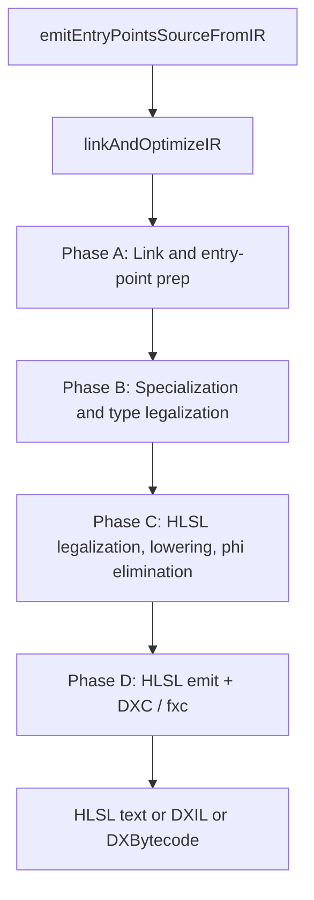
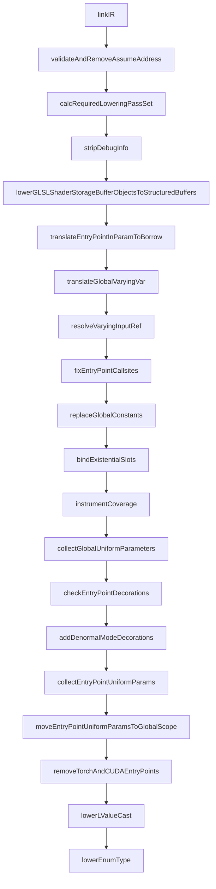
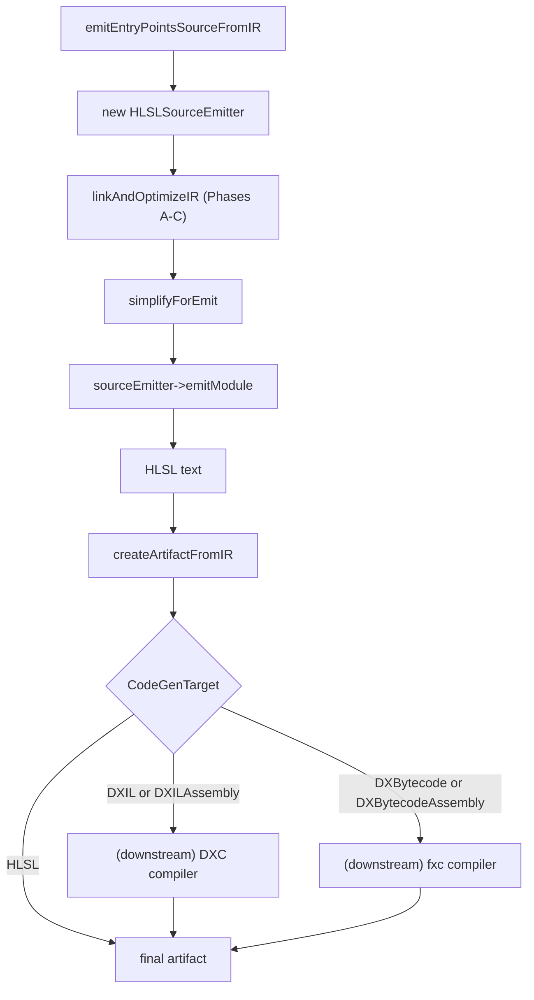

# HLSL Target Pipeline

This page documents the ordered IR-pass and downstream-binary
sequence executed when Slang compiles for the HLSL target. Inside
`linkAndOptimizeIR` the only target-enum that ever appears is
`CodeGenTarget::HLSL`; downstream binary requests
(`CodeGenTarget::DXIL` for DXC and `CodeGenTarget::DXBytecode` for
the legacy fxc compiler) ride the same IR path and diverge only
in `createArtifactFromIR` and the downstream-compile dispatch.
HLSL is detected via `isD3DTarget(targetRequest)` for several
internal predicate checks.

This page complements
[../pipeline/05-ir-passes.md](../pipeline/05-ir-passes.md), which
is an unordered topical catalog of every IR pass. Branches in
`linkAndOptimizeIR` gated on a sibling target (SPIR-V, Metal,
WGSL, CUDA, CPU, GLSL, PyTorch) are filtered out of the diagrams
and tables below.

## Source

- [slang-emit.cpp](../../../source/slang/slang-emit.cpp) —
  `linkAndOptimizeIR` (line ~892) is the orchestrator;
  `emitEntryPointsSourceFromIR` (line ~2365) constructs the
  `HLSLSourceEmitter` and emits HLSL text.
- [slang-emit-hlsl.cpp](../../../source/slang/slang-emit-hlsl.cpp)
  — `HLSLSourceEmitter` implementation.
- [slang-emit-hlsl-prelude.cpp](../../../source/slang/slang-emit-hlsl-prelude.cpp)
  — HLSL-specific prelude emission.
- [slang-emit-c-like.cpp](../../../source/slang/slang-emit-c-like.cpp)
  — shared C-like emitter base class.
- [slang-ir-hlsl-legalize.cpp](../../../source/slang/slang-ir-hlsl-legalize.cpp)
  — HLSL legalization helpers (notably
  `legalizeNonStructParameterToStructForHLSL` and
  `legalizeEmptyRayPayloadsForHLSL`).
- [slang-ir-legalize-binary-operator.cpp](../../../source/slang/slang-ir-legalize-binary-operator.cpp)
  — `legalizeLogicalAndOr` runs for HLSL.
- [slang-target-program.h](../../../source/slang/slang-target-program.h)
  / [slang-compiler-options.h](../../../source/slang/slang-compiler-options.h)
  — gate sources.

## High-level phase diagram

Unlike Metal and WGSL, HLSL has **no single legalization driver**
function. The HLSL-specific transformations are spread across
several individual `SLANG_PASS` calls in Phases B and C.

## Phase A: Link and entry-point prep

Spans roughly lines 927-1170 of
[slang-emit.cpp](../../../source/slang/slang-emit.cpp). HLSL hits
the `default` arm of every per-target switch in this phase. HLSL
is non-Khronos, so the `!isKhronosTarget && reqSet.glslSSBO` gate
at line 979 lets
`lowerGLSLShaderStorageBufferObjectsToStructuredBuffers` fire.

(Conditional gates are omitted from the diagram for readability;
see the conditional-gates table below for the full set.)

| # | Pass | File | Gate | Notes |
| --- | --- | --- | --- | --- |
| 1 | `linkIR` | [slang-ir-link.cpp](../../../source/slang/slang-ir-link.cpp) | (always) | |
| 2 | `validateAndRemoveAssumeAddress` | [slang-ir-validate.cpp](../../../source/slang/slang-ir-validate.cpp) | (always) | `validate=true` for HLSL. |
| 3 | `stripDebugInfo` | [slang-ir-strip-debug-info.cpp](../../../source/slang/slang-ir-strip-debug-info.cpp) | `reqSet.debugInfo && DebugInfoLevel::None` | |
| 4 | `lowerGLSLShaderStorageBufferObjectsToStructuredBuffers` | [slang-ir-lower-glsl-ssbo-types.cpp](../../../source/slang/slang-ir-lower-glsl-ssbo-types.cpp) | `!isKhronosTarget && reqSet.glslSSBO` | HLSL is non-Khronos. |
| 5 | `translateEntryPointInParamToBorrow` | [slang-ir-transform-params-to-constref.cpp](../../../source/slang/slang-ir-transform-params-to-constref.cpp) | (always) | |
| 6 | `translateGlobalVaryingVar` | [slang-ir-translate-global-varying-var.cpp](../../../source/slang/slang-ir-translate-global-varying-var.cpp) | `reqSet.globalVaryingVar` | |
| 7 | `resolveVaryingInputRef` | [slang-ir-resolve-varying-input-ref.cpp](../../../source/slang/slang-ir-resolve-varying-input-ref.cpp) | `reqSet.resolveVaryingInputRef` | |
| 8 | `fixEntryPointCallsites` | [slang-ir-fix-entrypoint-callsite.cpp](../../../source/slang/slang-ir-fix-entrypoint-callsite.cpp) | (always) | |
| 9 | `replaceGlobalConstants` | [slang-ir-link.cpp](../../../source/slang/slang-ir-link.cpp) | (always) | |
| 10 | `bindExistentialSlots` | [slang-ir-bind-existentials.cpp](../../../source/slang/slang-ir-bind-existentials.cpp) | `reqSet.bindExistential` | |
| 11 | `instrumentCoverage` | [slang-ir-coverage-instrument.cpp](../../../source/slang/slang-ir-coverage-instrument.cpp) | `reqSet.coverageTracing` | |
| 12 | `collectGlobalUniformParameters` | [slang-ir-collect-global-uniforms.cpp](../../../source/slang/slang-ir-collect-global-uniforms.cpp) | (always) | |
| 13 | `checkEntryPointDecorations` | [slang-ir-entry-point-decorations.cpp](../../../source/slang/slang-ir-entry-point-decorations.cpp) | (always) | |
| 14 | `addDenormalModeDecorations` | [slang-emit.cpp](../../../source/slang/slang-emit.cpp) | (always) | Static helper. |
| 15 | `collectEntryPointUniformParams` | [slang-ir-entry-point-uniforms.cpp](../../../source/slang/slang-ir-entry-point-uniforms.cpp) | (always, HLSL via `default` arm) | |
| 16 | `moveEntryPointUniformParamsToGlobalScope` | [slang-ir-entry-point-uniforms.cpp](../../../source/slang/slang-ir-entry-point-uniforms.cpp) | (always, HLSL via `default` arm) | |
| 17 | `removeTorchAndCUDAEntryPoints` | [slang-ir-pytorch-cpp-binding.cpp](../../../source/slang/slang-ir-pytorch-cpp-binding.cpp) | (always, HLSL via `default` arm) | |
| 18 | `lowerLValueCast` | [slang-ir-lower-l-value-cast.cpp](../../../source/slang/slang-ir-lower-l-value-cast.cpp) | (always) | |
| 19 | `lowerEnumType` | [slang-ir-lower-enum-type.cpp](../../../source/slang/slang-ir-lower-enum-type.cpp) | `reqSet.enumType` | |

Filtered out for HLSL in this phase: the CUDA / CUDAHeader arm of
the entry-point-param switch
(`collectOptiXEntryPointUniformParams`); the CPP / Host* arms.

## Phase B: Specialization and type legalization

Spans roughly lines 1172-1714 of `slang-emit.cpp`. HLSL hits
unique arms in several places:

- `legalizeNonVectorCompositeSelect` runs (line ~1285,
  `case CodeGenTarget::HLSL`).
- `lowerCooperativeVectors` is **skipped** for HLSL (line ~1453,
  `case CodeGenTarget::HLSL: break;`). HLSL's cooperative-vector
  support is exposed via intrinsics that DXC understands directly,
  so Slang does not lower them.
- `lowerCombinedTextureSamplers` fires (HLSL in HLSL/Metal/WGSL
  arm at line ~1517).
- `lowerAppendConsumeStructuredBuffers` is **skipped**
  (`target != HLSL` is false): HLSL has native
  `AppendStructuredBuffer<T>` and `ConsumeStructuredBuffer<T>`
  types.
- Inside the `shouldLegalizeExistentialAndResourceTypes` block:
  - `legalizeEmptyRayPayloadsForHLSL` runs (HLSL is in the
    `isD3DTarget || isSPIRV` arm at line ~1597).
  - `legalizeNonStructParameterToStructForHLSL` runs (line ~1606,
    `isD3DTarget` only).
- `wrapStructuredBuffersOfMatrices` runs (HLSL-only arm at line
  ~1727).

```mermaid
flowchart TD
  s1[simplifyIR default]
  vu[validateUniformity]
  sML[specializeMatrixLayout]
  fSC[fuseCallsToSaturatedCooperation]
  cAP[checkAutodiffPatterns]
  dCC[diagnoseCircularConformances]
  sM[specializeModule]
  sHOP[specializeHigherOrderParameters]
  fADP[finalizeAutoDiffPass]
  lMSS[lowerMatrixSwizzleStores]
  dce1[eliminateDeadCode]
  fS[finalizeSpecialization]
  lDTI[lowerDiffTypeInfoInsts]
  lRT[lowerResultType]
  lCT[lowerConditionalType]
  lRO[lowerReinterpretOptional]
  cONU[checkForOptionalNoneUsage]
  lOT[lowerOptionalType]
  lNVCS["legalizeNonVectorCompositeSelect (HLSL only)"]
  reqSet2[calcRequiredLoweringPassSet]
  dUR[detectUninitializedResources]
  rAIDD[removeAvailableInDownstreamModuleDecorations]
  checks["checkForRecursive* checkForOutOfBoundAccess<br/>checkForMissingReturns checkForInvalidShaderParameterType"]
  iAVS[inferAnyValueSizeWhereNecessary]
  uPWT[unpinWitnessTables]
  lSVMI[lowerSumVectorMatrixInsts]
  s2a[simplifyIR fast]
  lTUT[lowerTaggedUnionTypes]
  lUUT[lowerUntaggedUnionTypes]
  lR[lowerReinterpret]
  lSIDC[lowerSequentialIDTagCasts]
  lTI[lowerTagInsts]
  lTT[lowerTagTypes]
  dce3[eliminateDeadCode]
  lE[lowerExistentials]
  rWUI[removeWeakUseInsts]
  pTIN[performTypeInlining]
  cGSHI[checkGetStringHashInsts]
  dce4[eliminateDeadCode]
  lTu[lowerTuples]
  gAVMF[generateAnyValueMarshallingFunctions]
  sSS[specializeStageSwitch]
  lCV_skip["(skipped) lowerCooperativeVectors HLSL break"]
  pFI1[performForceInlining]
  s2b[simplifyIR default]
  lACSB_skip["(skipped) lowerAppendConsumeStructuredBuffers HLSL has native"]
  lCTS[lowerCombinedTextureSamplers]
  lEA[legalizeEmptyArray]
  lVT[legalizeVectorTypes]
  iGC[inlineGlobalConstantsForLegalization]
  lERP[legalizeEmptyRayPayloadsForHLSL]
  lNSP[legalizeNonStructParameterToStructForHLSL]
  lETL[legalizeExistentialTypeLayout]
  vSBRT[validateStructuredBufferResourceTypes]
  lRTR[legalizeResourceTypes]
  lMT[legalizeMatrixTypes]
  s2c[simplifyIR fast]
  lDRH[lowerDynamicResourceHeap]
  sRU[specializeResourceUsage]
  sFBLA1[specializeFuncsForBufferLoadArgs]
  dBL[deferBufferLoad]
  sAP[specializeArrayParameters]
  cSA[checkStaticAssert]
  wSBoM[wrapStructuredBuffersOfMatrices]

  s1 --> vu --> sML --> fSC --> cAP --> dCC --> sM --> sHOP --> fADP --> lMSS --> dce1 --> fS --> lDTI --> lRT --> lCT --> lRO --> cONU --> lOT --> lNVCS --> reqSet2 --> dUR --> rAIDD --> checks --> iAVS --> uPWT --> lSVMI --> s2a --> lTUT --> lUUT --> lR --> lSIDC --> lTI --> lTT --> dce3 --> lE --> rWUI --> pTIN --> cGSHI --> dce4 --> lTu --> gAVMF --> sSS --> lCV_skip --> pFI1 --> s2b --> lACSB_skip --> lCTS --> lEA --> lVT --> iGC --> lERP --> lNSP --> lETL --> vSBRT --> lRTR --> lMT --> s2c --> lDRH --> sRU --> sFBLA1 --> dBL --> sAP --> cSA --> wSBoM
```

| # | Pass | File | Gate | Notes |
| --- | --- | --- | --- | --- |
| 1 | `simplifyIR` | [slang-ir-ssa-simplification.cpp](../../../source/slang/slang-ir-ssa-simplification.cpp) | (always) | `defaultIRSimplificationOptions`. |
| 2 | `validateUniformity` | [slang-ir-uniformity.cpp](../../../source/slang/slang-ir-uniformity.cpp) | `getBoolOption(ValidateUniformity)` | |
| 3 | `specializeMatrixLayout` | [slang-ir-specialize-matrix-layout.cpp](../../../source/slang/slang-ir-specialize-matrix-layout.cpp) | (always) | |
| 4 | `fuseCallsToSaturatedCooperation` | [slang-ir-fuse-satcoop.cpp](../../../source/slang/slang-ir-fuse-satcoop.cpp) | `!shouldPerformMinimumOptimizations` | |
| 5 | `checkAutodiffPatterns` | [slang-ir-check-differentiability.cpp](../../../source/slang/slang-ir-check-differentiability.cpp) | `reqSet.autodiff` | |
| 6 | `diagnoseCircularConformances` | [slang-ir-any-value-inference.cpp](../../../source/slang/slang-ir-any-value-inference.cpp) | (always) | |
| 7 | `specializeModule` | [slang-ir-specialize.cpp](../../../source/slang/slang-ir-specialize.cpp) | `!isSpecializationDisabled()` | |
| 8 | `specializeHigherOrderParameters` | [slang-ir-defunctionalization.cpp](../../../source/slang/slang-ir-defunctionalization.cpp) | `reqSet.higherOrderFunc` | |
| 9 | `finalizeAutoDiffPass` | [slang-ir-autodiff.cpp](../../../source/slang/slang-ir-autodiff.cpp) | (always) | |
| 10 | `lowerMatrixSwizzleStores` | [slang-ir-lower-matrix-swizzle-store.cpp](../../../source/slang/slang-ir-lower-matrix-swizzle-store.cpp) | `reqSet.matrixSwizzleStore` | |
| 11 | `eliminateDeadCode` | [slang-ir-dce.cpp](../../../source/slang/slang-ir-dce.cpp) | (always) | |
| 12 | `finalizeSpecialization` | [slang-ir-specialize.cpp](../../../source/slang/slang-ir-specialize.cpp) | (always) | |
| 13 | `lowerDiffTypeInfoInsts` | [slang-ir-autodiff.cpp](../../../source/slang/slang-ir-autodiff.cpp) | (always) | Direct call. |
| 14 | `lowerResultType` | [slang-ir-lower-result-type.cpp](../../../source/slang/slang-ir-lower-result-type.cpp) | `reqSet.resultType` | |
| 15 | `lowerConditionalType` | [slang-ir-lower-conditional-type.cpp](../../../source/slang/slang-ir-lower-conditional-type.cpp) | `reqSet.conditionalType` | |
| 16 | `lowerReinterpretOptional` | [slang-ir-lower-reinterpret.cpp](../../../source/slang/slang-ir-lower-reinterpret.cpp) | `reqSet.optionalType` | |
| 17 | `checkForOptionalNoneUsage` | [slang-ir-check-optional-none-usage.cpp](../../../source/slang/slang-ir-check-optional-none-usage.cpp) | `shouldRunNonEssentialValidation()` | |
| 18 | `lowerOptionalType` | [slang-ir-lower-optional-type.cpp](../../../source/slang/slang-ir-lower-optional-type.cpp) | `reqSet.optionalType` | |
| 19 | `legalizeNonVectorCompositeSelect` | [slang-ir-legalize-composite-select.cpp](../../../source/slang/slang-ir-legalize-composite-select.cpp) | `reqSet.nonVectorCompositeSelect && target == HLSL` | **HLSL-only.** DXC's `select` is only defined on vectors. |
| 20 | `detectUninitializedResources` | [slang-ir-detect-uninitialized-resources.cpp](../../../source/slang/slang-ir-detect-uninitialized-resources.cpp) | (always) | |
| 21 | `removeAvailableInDownstreamModuleDecorations` | [slang-ir-redundancy-removal.cpp](../../../source/slang/slang-ir-redundancy-removal.cpp) | `removeAvailableInDownstreamIR` | |
| 22 | `checkForRecursiveTypes` | [slang-ir-check-recursion.cpp](../../../source/slang/slang-ir-check-recursion.cpp) | `shouldRunNonEssentialValidation()` | |
| 23 | `checkForRecursiveFunctions` | [slang-ir-check-recursion.cpp](../../../source/slang/slang-ir-check-recursion.cpp) | `shouldRunNonEssentialValidation()` | |
| 24 | `checkForOutOfBoundAccess` | [slang-check-out-of-bound-access.cpp](../../../source/slang/slang-check-out-of-bound-access.cpp) | `shouldRunNonEssentialValidation()` | |
| 25 | `checkForMissingReturns` | [slang-ir-missing-return.cpp](../../../source/slang/slang-ir-missing-return.cpp) | `reqSet.missingReturn` | |
| 26 | `checkForInvalidShaderParameterType` | [slang-ir-check-shader-parameter-type.cpp](../../../source/slang/slang-ir-check-shader-parameter-type.cpp) | `shouldRunNonEssentialValidation()` | |
| 27 | `inferAnyValueSizeWhereNecessary` | [slang-ir-any-value-inference.cpp](../../../source/slang/slang-ir-any-value-inference.cpp) | (always) | |
| 28 | `unpinWitnessTables` | [slang-ir-strip-legalization-insts.cpp](../../../source/slang/slang-ir-strip-legalization-insts.cpp) | (always) | |
| 29 | `lowerSumVectorMatrixInsts` | [slang-emit.cpp](../../../source/slang/slang-emit.cpp) | (always) | Static helper. |
| 30 | `simplifyIR` | [slang-ir-ssa-simplification.cpp](../../../source/slang/slang-ir-ssa-simplification.cpp) | `!minimalOptimization` | |
| 31 | `lowerTaggedUnionTypes` | [slang-ir-lower-dynamic-dispatch-insts.cpp](../../../source/slang/slang-ir-lower-dynamic-dispatch-insts.cpp) | (always) | |
| 32 | `lowerUntaggedUnionTypes` | [slang-ir-lower-dynamic-dispatch-insts.cpp](../../../source/slang/slang-ir-lower-dynamic-dispatch-insts.cpp) | (always) | |
| 33 | `lowerReinterpret` | [slang-ir-lower-reinterpret.cpp](../../../source/slang/slang-ir-lower-reinterpret.cpp) | `reqSet.reinterpret` | |
| 34 | `lowerSequentialIDTagCasts` | [slang-ir-lower-dynamic-dispatch-insts.cpp](../../../source/slang/slang-ir-lower-dynamic-dispatch-insts.cpp) | (always) | |
| 35 | `lowerTagInsts` | [slang-ir-lower-dynamic-dispatch-insts.cpp](../../../source/slang/slang-ir-lower-dynamic-dispatch-insts.cpp) | (always) | |
| 36 | `lowerTagTypes` | [slang-ir-lower-dynamic-dispatch-insts.cpp](../../../source/slang/slang-ir-lower-dynamic-dispatch-insts.cpp) | (always) | |
| 37 | `eliminateDeadCode` | [slang-ir-dce.cpp](../../../source/slang/slang-ir-dce.cpp) | (always) | |
| 38 | `lowerExistentials` | [slang-ir-lower-dynamic-dispatch-insts.cpp](../../../source/slang/slang-ir-lower-dynamic-dispatch-insts.cpp) | (always) | |
| 39 | `removeWeakUseInsts` | [slang-ir-redundancy-removal.cpp](../../../source/slang/slang-ir-redundancy-removal.cpp) | (always) | |
| 40 | `performTypeInlining` | [slang-ir-inline.cpp](../../../source/slang/slang-ir-inline.cpp) | `!isCpuLikeTarget` (true for HLSL) | |
| 41 | `checkGetStringHashInsts` | [slang-ir-string-hash.cpp](../../../source/slang/slang-ir-string-hash.cpp) | `!isCpuLikeTarget && shouldRunNonEssentialValidation()` | |
| 42 | `lowerTuples` | [slang-ir-lower-tuple-types.cpp](../../../source/slang/slang-ir-lower-tuple-types.cpp) | (always) | |
| 43 | `generateAnyValueMarshallingFunctions` | [slang-ir-any-value-marshalling.cpp](../../../source/slang/slang-ir-any-value-marshalling.cpp) | (always) | |
| 44 | `specializeStageSwitch` | [slang-ir-specialize-stage-switch.cpp](../../../source/slang/slang-ir-specialize-stage-switch.cpp) | `reqSet.specializeStageSwitch` | |
| - | *(skip)* `lowerCooperativeVectors` | [slang-ir-lower-coopvec.cpp](../../../source/slang/slang-ir-lower-coopvec.cpp) | HLSL is the explicit `case HLSL: break;` arm at line ~1455. | DXC handles cooperative vectors directly. |
| 45 | `performForceInlining` | [slang-ir-inline.cpp](../../../source/slang/slang-ir-inline.cpp) | (always) | |
| 46 | `simplifyIR` | [slang-ir-ssa-simplification.cpp](../../../source/slang/slang-ir-ssa-simplification.cpp) | `!minimalOptimization` | |
| - | *(skip)* `lowerAppendConsumeStructuredBuffers` | [slang-ir-lower-append-consume-structured-buffer.cpp](../../../source/slang/slang-ir-lower-append-consume-structured-buffer.cpp) | `target != HLSL` is false. | HLSL has native types. |
| 47 | `lowerCombinedTextureSamplers` | [slang-ir-lower-combined-texture-sampler.cpp](../../../source/slang/slang-ir-lower-combined-texture-sampler.cpp) | `reqSet.combinedTextureSamplers` (HLSL arm at line ~1517) | |
| 48 | `legalizeEmptyArray` | [slang-ir-legalize-empty-array.cpp](../../../source/slang/slang-ir-legalize-empty-array.cpp) | (always) | |
| 49 | `legalizeVectorTypes` | [slang-ir-legalize-vector-types.cpp](../../../source/slang/slang-ir-legalize-vector-types.cpp) | (always) | |
| 50 | `inlineGlobalConstantsForLegalization` | [slang-ir-legalize-global-values.cpp](../../../source/slang/slang-ir-legalize-global-values.cpp) | `shouldLegalizeExistentialAndResourceTypes` (default `true`) | |
| 51 | `legalizeEmptyRayPayloadsForHLSL` | [slang-ir-hlsl-legalize.cpp](../../../source/slang/slang-ir-hlsl-legalize.cpp) | `isD3DTarget || isSPIRV` (HLSL is `isD3DTarget`) | Adds dummy fields to empty ray payloads for DXIL + NVAPI compatibility. |
| 52 | `legalizeNonStructParameterToStructForHLSL` | [slang-ir-hlsl-legalize.cpp](../../../source/slang/slang-ir-hlsl-legalize.cpp) | `isD3DTarget` (line ~1604) | **HLSL/DXIL only.** |
| 53 | `legalizeExistentialTypeLayout` | [slang-ir-legalize-types.cpp](../../../source/slang/slang-ir-legalize-types.cpp) | `reqSet.existentialTypeLayout` | |
| 54 | `validateStructuredBufferResourceTypes` | [slang-ir-validate.cpp](../../../source/slang/slang-ir-validate.cpp) | (always) | Direct call. |
| 55 | `legalizeResourceTypes` | [slang-ir-legalize-types.cpp](../../../source/slang/slang-ir-legalize-types.cpp) | (always) | |
| 56 | `legalizeMatrixTypes` | [slang-ir-legalize-matrix-types.cpp](../../../source/slang/slang-ir-legalize-matrix-types.cpp) | (always) | |
| 57 | `simplifyIR` | [slang-ir-ssa-simplification.cpp](../../../source/slang/slang-ir-ssa-simplification.cpp) | `!minimalOptimization` | |
| 58 | `lowerDynamicResourceHeap` | [slang-ir-lower-dynamic-resource-heap.cpp](../../../source/slang/slang-ir-lower-dynamic-resource-heap.cpp) | `reqSet.dynamicResourceHeap` | |
| 59 | `specializeResourceUsage` | [slang-ir-specialize-resources.cpp](../../../source/slang/slang-ir-specialize-resources.cpp) | (always) | |
| 60 | `specializeFuncsForBufferLoadArgs` | [slang-ir-specialize-buffer-load-arg.cpp](../../../source/slang/slang-ir-specialize-buffer-load-arg.cpp) | (always) | |
| 61 | `deferBufferLoad` | [slang-ir-defer-buffer-load.cpp](../../../source/slang/slang-ir-defer-buffer-load.cpp) | (always) | |
| 62 | `specializeArrayParameters` | [slang-ir-specialize-arrays.cpp](../../../source/slang/slang-ir-specialize-arrays.cpp) | (always) | |
| 63 | `wrapStructuredBuffersOfMatrices` | [slang-ir-wrap-structured-buffers.cpp](../../../source/slang/slang-ir-wrap-structured-buffers.cpp) | `case HLSL` (line ~1727) | **HLSL-only.** Wraps structured buffers whose element type is a matrix so that the `#pragma pack_matrix` directive applies. |

Filtered out for HLSL in this phase: the CUDA-derivative-wrapper
arm; PyTorch / CUDA passes; CPP/HostCPP arms
(`lowerComInterfaces`, `generateDllImportFuncs`,
`generateDllExportFuncs`); the HostVM early return; the
Metal-only `legalizeEmptyTypes` arm; the Metal-only
`lowerBufferElementTypeToStorageType (MetalParameterBlock)`
invocation; the Metal-only `wrapCBufferElementsForMetal`; CPU-LLVM
`lowerBufferElementTypeToStorageType (LLVM)`.

## Phase C: HLSL legalization, lowering, phi elimination

Spans roughly lines 1745-2360 of `slang-emit.cpp`. HLSL has no
single legalization driver; the target-specific work consists of
several individual passes spread through this phase. HLSL is in
the `default` arm of the per-target legalization switch at line
~1916, so neither `legalizeEntryPointsForGLSL` nor
`legalizeIRForMetal` nor `legalizeIRForWGSL` runs; HLSL relies on
DXC to interpret the emitted source. The most notable
HLSL-specific gates are `legalizeUniformBufferLoad` (HLSL is in
the `isKhronosTarget || target == HLSL` arm) and the optional
`useBitCastFromUInt = true` for fxc-era profiles
(`ProfileVersion::DX_5_0` and earlier).

```mermaid
flowchart TD
  babbGate{reqSet.byteAddressBuffer}
  lBABOps_hlsl["legalizeByteAddressBufferOps<br/>(HLSL default options;<br/>useBitCastFromUInt=true for DX <= 5.0)"]
  vAO[validateAtomicOperations]
  fNRI[floatNonUniformResourceIndex]
  lLAO[legalizeLogicalAndOr]
  mGVI[moveGlobalVarInitializationToEntryPoints]
  sLOI[stripLegalizationOnlyInstructions]
  vVAM[validateVectorsAndMatrices]
  dce7[eliminateDeadCode]
  pLRC[processLateRequireCapabilityInsts]
  cUV[cleanUpVoidType]
  bqGate{reqSet.bindingQuery}
  lBQ[lowerBindingQueries]
  meshGate{reqSet.meshOutput}
  lMO[legalizeMeshOutputTypes]
  bcGate{reqSet.bitcast}
  lBC[lowerBitCast]
  lART[legalizeArrayReturnType]
  lUBL[legalizeUniformBufferLoad]
  optYGate{VulkanInvertY}
  iY[invertYOfPositionOutput]
  optWGate{VulkanUseDxPositionW}
  rcpW[rcpWOfPositionInput]
  lBETST_def["lowerBufferElementTypeToStorageType<br/>(Default policy)"]
  pFI2[performForceInlining]
  eMB[eliminateMultiLevelBreak]
  s2d[simplifyIR with removeTrivialSingleIterationLoops]
  lET2[legalizeEmptyTypes]
  ePhi["eliminatePhis (default options)"]
  sNSIR[simplifyNonSSAIR]
  aVSC[applyVariableScopeCorrection]
  cCM[collectCooperativeMetadata]
  uNEI[unexportNonEmbeddableIR]
  cM[collectMetadata]
  cUI[checkUnsupportedInst]

  babbGate -->|true| lBABOps_hlsl --> vAO
  babbGate -->|false| vAO
  vAO --> fNRI --> lLAO --> mGVI --> sLOI --> vVAM --> dce7 --> pLRC --> cUV --> bqGate
  bqGate -->|true| lBQ --> meshGate
  bqGate -->|false| meshGate
  meshGate -->|true| lMO --> bcGate
  meshGate -->|false| bcGate
  bcGate -->|true| lBC --> lART
  bcGate -->|false| lART
  lART --> lUBL --> optYGate
  optYGate -->|true| iY --> optWGate
  optYGate -->|false| optWGate
  optWGate -->|true| rcpW --> lBETST_def
  optWGate -->|false| lBETST_def
  lBETST_def --> pFI2 --> eMB --> s2d --> lET2 --> ePhi --> sNSIR --> aVSC --> cCM --> uNEI --> cM --> cUI
```

| # | Pass | File | Gate | Notes |
| --- | --- | --- | --- | --- |
| 1 | `legalizeByteAddressBufferOps` | [slang-ir-byte-address-legalize.cpp](../../../source/slang/slang-ir-byte-address-legalize.cpp) | `reqSet.byteAddressBuffer` | HLSL options: defaults except `useBitCastFromUInt = true` if `profile.getFamily() == DX && profile.getVersion() <= DX_5_0` (fxc/early DXC). |
| 2 | `validateAtomicOperations` | [slang-ir-validate.cpp](../../../source/slang/slang-ir-validate.cpp) | `target != SPIRV && target != SPIRVAssembly` | |
| 3 | `floatNonUniformResourceIndex` | [slang-ir-float-non-uniform-resource-index.cpp](../../../source/slang/slang-ir-float-non-uniform-resource-index.cpp) | `!isSPIRV(target)` | `NonUniformResourceIndexFloatMode::Textual` for the `NonUniformResourceIndex(...)` HLSL intrinsic. |
| 4 | `legalizeLogicalAndOr` | [slang-ir-legalize-binary-operator.cpp](../../../source/slang/slang-ir-legalize-binary-operator.cpp) | `isD3DTarget` (HLSL is in the four-way arm) | DXC short-circuit-evaluates `&&` and `\|\|` on scalars only. |
| 5 | `moveGlobalVarInitializationToEntryPoints` | [slang-ir-explicit-global-init.cpp](../../../source/slang/slang-ir-explicit-global-init.cpp) | (HLSL / GLSL / WGSL arm at line ~2027) | |
| 6 | `stripLegalizationOnlyInstructions` | [slang-ir-strip-legalization-insts.cpp](../../../source/slang/slang-ir-strip-legalization-insts.cpp) | (always) | |
| 7 | `validateVectorsAndMatrices` | [slang-ir-validate.cpp](../../../source/slang/slang-ir-validate.cpp) | (always) | |
| 8 | `eliminateDeadCode` | [slang-ir-dce.cpp](../../../source/slang/slang-ir-dce.cpp) | (always) | |
| 9 | `processLateRequireCapabilityInsts` | [slang-ir-late-require-capability.cpp](../../../source/slang/slang-ir-late-require-capability.cpp) | (always) | |
| 10 | `cleanUpVoidType` | [slang-ir-cleanup-void.cpp](../../../source/slang/slang-ir-cleanup-void.cpp) | (always) | |
| 11 | `lowerBindingQueries` | [slang-ir-lower-binding-query.cpp](../../../source/slang/slang-ir-lower-binding-query.cpp) | `reqSet.bindingQuery` | |
| 12 | `legalizeMeshOutputTypes` | [slang-ir-legalize-mesh-outputs.cpp](../../../source/slang/slang-ir-legalize-mesh-outputs.cpp) | `reqSet.meshOutput` | |
| 13 | `lowerBitCast` | [slang-ir-lower-bit-cast.cpp](../../../source/slang/slang-ir-lower-bit-cast.cpp) | `reqSet.bitcast` | |
| 14 | `legalizeArrayReturnType` | [slang-ir-legalize-array-return-type.cpp](../../../source/slang/slang-ir-legalize-array-return-type.cpp) | `!isMetalTarget && !isSPIRV` (true for HLSL) | DXC disallows array return values. |
| 15 | `legalizeUniformBufferLoad` | [slang-ir-legalize-uniform-buffer-load.cpp](../../../source/slang/slang-ir-legalize-uniform-buffer-load.cpp) | `isKhronosTarget || target == HLSL` (line ~2153) | |
| 16 | `invertYOfPositionOutput` | [slang-ir-vk-invert-y.cpp](../../../source/slang/slang-ir-vk-invert-y.cpp) | `isKhronosTarget || HLSL` and `VulkanInvertY` | Rare for HLSL; for cross-API porting workflows. |
| 17 | `rcpWOfPositionInput` | [slang-ir-vk-invert-y.cpp](../../../source/slang/slang-ir-vk-invert-y.cpp) | `isKhronosTarget || HLSL` and `VulkanUseDxPositionW` | |
| 18 | `lowerBufferElementTypeToStorageType` | [slang-ir-lower-buffer-element-type.cpp](../../../source/slang/slang-ir-lower-buffer-element-type.cpp) | (always) | `loweringPolicyKind = Default` (HLSL is not WGPU or Khronos). |
| 19 | `performForceInlining` | [slang-ir-inline.cpp](../../../source/slang/slang-ir-inline.cpp) | (always) | |
| 20 | `eliminateMultiLevelBreak` | [slang-ir-eliminate-multilevel-break.cpp](../../../source/slang/slang-ir-eliminate-multilevel-break.cpp) | (always) | |
| 21 | `simplifyIR` | [slang-ir-ssa-simplification.cpp](../../../source/slang/slang-ir-ssa-simplification.cpp) | `!minimalOptimization` | With `removeTrivialSingleIterationLoops = true`. |
| 22 | `legalizeEmptyTypes` | [slang-ir-legalize-types.cpp](../../../source/slang/slang-ir-legalize-types.cpp) | (always; for AD 2.0) | |
| 23 | `eliminatePhis` | [slang-ir-eliminate-phis.cpp](../../../source/slang/slang-ir-eliminate-phis.cpp) | (always) | **Default options.** DXC accepts HLSL with explicit temporaries; no register-allocation hint. |
| 24 | `simplifyNonSSAIR` | [slang-ir-ssa-simplification.cpp](../../../source/slang/slang-ir-ssa-simplification.cpp) | (always) | |
| 25 | `applyVariableScopeCorrection` | [slang-ir-variable-scope-correction.cpp](../../../source/slang/slang-ir-variable-scope-correction.cpp) | `target != SPIRV && target != SPIRVAssembly` | |
| 26 | `collectCooperativeMetadata` | [slang-ir-metadata.cpp](../../../source/slang/slang-ir-metadata.cpp) | `targetCaps implies cooperative_matrix or cooperative_vector` | HLSL exposes cooperative matrices via DXR / DXC extensions. |
| 27 | `unexportNonEmbeddableIR` | [slang-emit.cpp](../../../source/slang/slang-emit.cpp) | `EmbedDownstreamIR` | |
| 28 | `collectMetadata` | [slang-ir-metadata.cpp](../../../source/slang/slang-ir-metadata.cpp) | (always) | |
| 29 | `checkUnsupportedInst` | [slang-ir-check-unsupported-inst.cpp](../../../source/slang/slang-ir-check-unsupported-inst.cpp) | `!shouldPerformMinimumOptimizations()` | |

Filtered out for HLSL in this phase: `synthesizeActiveMask` (CUDA
only); `resolveTextureFormat` (GLSL / SPIR-V / WGSL only);
`legalizeEntryPointsForGLSL` (GLSL/SPIR-V only);
`legalizeIRForMetal` (Metal only);
`legalizeEntryPointVaryingParamsForCPU` (CPU only);
`legalizeEntryPointVaryingParamsForCUDA` (CUDA only);
`legalizeIRForWGSL` (WGSL only);
`legalizeDynamicResourcesForGLSL` (Khronos only);
`legalizeImageSubscript` (Metal/GLSL/SPIR-V only);
`legalizeConstantBufferLoadForGLSL` and
`legalizeDispatchMeshPayloadForGLSL` (GLSL/SPIR-V only);
`introduceExplicitGlobalContext` (SPIR-V experimental and
CPU/Metal/CUDA fallthrough);
`transformParamsToConstRef` (SPIR-V / CPU / CUDA / Metal only);
`undoParameterCopy` (CPU/CUDA/Metal only);
`removeRawDefaultConstructors` (SPIR-V direct emit / CPU LLVM);
`performGLSLResourceReturnFunctionInlining` (Khronos only);
`specializeAddressSpace`, `specializeAddressSpaceForMetal`,
`specializeAddressSpaceForWGSL` (their respective targets);
`specializeFuncsForBufferLoadArgs` second invocation (SPIR-V
direct emit only); `lowerImmutableBufferLoadForCUDA` (CUDA only);
`performIntrinsicFunctionInlining` (SPIR-V direct emit only);
`legalizeModesOfNonCopyableOpaqueTypedParamsForGLSL` (via-GLSL
only); `applyGLSLLiveness` (Khronos only);
`replaceLocationIntrinsicsWithRaytracingObject` (SPIR-V only).

## Phase D: HLSL emit and downstream tools

Phase D begins immediately after `linkAndOptimizeIR` returns to
`emitEntryPointsSourceFromIR`. The `HLSLSourceEmitter`
(constructed at line ~2454 of `slang-emit.cpp`) walks the IR and
produces HLSL text. The downstream chain depends on which
`CodeGenTarget` was requested:

- `CodeGenTarget::HLSL` — stop at the text artifact.
- `CodeGenTarget::DXIL` / `CodeGenTarget::DXILAssembly` — invoke
  DXC to compile HLSL into DXIL (the modern path; shader model
  6.0 and later).
- `CodeGenTarget::DXBytecode` / `CodeGenTarget::DXBytecodeAssembly`
  — invoke fxc to compile HLSL into D3D bytecode (the legacy
  path; shader model 5.x and earlier).

| # | Pass / step | File | Gate | Notes |
| --- | --- | --- | --- | --- |
| 1 | `emitEntryPointsSourceFromIR` | [slang-emit.cpp](../../../source/slang/slang-emit.cpp) | (entry point) | |
| 2 | `new HLSLSourceEmitter` | [slang-emit-hlsl.cpp](../../../source/slang/slang-emit-hlsl.cpp) | `case SourceLanguage::HLSL` | Constructed at line ~2454. |
| 3 | `sourceEmitter->init` | [slang-emit-c-like.cpp](../../../source/slang/slang-emit-c-like.cpp) | (always) | |
| 4 | `linkAndOptimizeIR` | [slang-emit.cpp](../../../source/slang/slang-emit.cpp) | (always) | Runs Phases A-C. |
| 5 | `simplifyForEmit` | [slang-ir-ssa-simplification.cpp](../../../source/slang/slang-ir-ssa-simplification.cpp) | (always) | |
| 6 | `sourceEmitter->emitModule` | [slang-emit-c-like.cpp](../../../source/slang/slang-emit-c-like.cpp) (+ HLSL overrides in `slang-emit-hlsl.cpp`) | (always) | Walks IR and writes HLSL text; prelude comes from `slang-emit-hlsl-prelude.cpp`. |
| 7 | `createArtifactFromIR` | [slang-emit.cpp](../../../source/slang/slang-emit.cpp) | (always) | Wraps the HLSL text as an `IArtifact`. |
| 8 | `compile` (DXC) | (downstream) | `target == DXIL || target == DXILAssembly` | DXC is the default for SM 6.0+; output is DXIL bytecode (or its disassembly). |
| 9 | `compile` (fxc) | (downstream) | `target == DXBytecode || target == DXBytecodeAssembly` | Legacy path; fxc compiles HLSL into D3D bytecode (or its disassembly) for SM 5.x. |

Neither spirv-link nor spirv-val nor spirv-opt apply to HLSL; all
validation and optimization is delegated to DXC or fxc.

## Conditional gates

### `requiredLoweringPassSet.*` flags

| Gate | Passes it controls |
| --- | --- |
| `debugInfo` | `stripDebugInfo` (Phase A) with `DebugInfoLevel::None`. |
| `glslSSBO` | `lowerGLSLShaderStorageBufferObjectsToStructuredBuffers` (Phase A) — fires for HLSL. |
| `globalVaryingVar` | `translateGlobalVaryingVar`. |
| `resolveVaryingInputRef` | `resolveVaryingInputRef`. |
| `bindExistential` | `bindExistentialSlots`. |
| `coverageTracing` | `instrumentCoverage`. |
| `enumType` | `lowerEnumType`. |
| `autodiff` | `checkAutodiffPatterns`. |
| `higherOrderFunc` | `specializeHigherOrderParameters`. |
| `matrixSwizzleStore` | `lowerMatrixSwizzleStores`. |
| `resultType` | `lowerResultType`. |
| `conditionalType` | `lowerConditionalType`. |
| `optionalType` | `lowerReinterpretOptional`, `lowerOptionalType`. |
| `nonVectorCompositeSelect` | `legalizeNonVectorCompositeSelect` — **HLSL is the only target that fires this pass.** |
| `missingReturn` | `checkForMissingReturns`. |
| `reinterpret` | `lowerReinterpret`. |
| `specializeStageSwitch` | `specializeStageSwitch`. |
| `existentialTypeLayout` | `legalizeExistentialTypeLayout`. |
| `combinedTextureSamplers` | `lowerCombinedTextureSamplers`. |
| `dynamicResourceHeap` | `lowerDynamicResourceHeap`. |
| `byteAddressBuffer` | `legalizeByteAddressBufferOps`. |
| `bindingQuery` | `lowerBindingQueries`. |
| `meshOutput` | `legalizeMeshOutputTypes`. |
| `bitcast` | `lowerBitCast`. |

Flags that exist but **never gate an HLSL pass**:
`derivativePyBindWrapper` (PyTorch),
`dynamicResource` (Khronos only — `legalizeDynamicResourcesForGLSL`).

### Option-set toggles

| Gate | Passes it controls |
| --- | --- |
| `shouldEmitSeparateDebugInfo()` | Emit `IRBuildIdentifier`. |
| `getBoolOption(ValidateUniformity)` | `validateUniformity`. |
| `getBoolOption(PreserveParameters)` | DCE keep-alive option. |
| `getBoolOption(VulkanInvertY)` | `invertYOfPositionOutput` (also applies under the HLSL arm for cross-API workflows). |
| `getBoolOption(VulkanUseDxPositionW)` | `rcpWOfPositionInput`. |
| `getBoolOption(EmbedDownstreamIR)` | `unexportNonEmbeddableIR`. |
| `shouldRunNonEssentialValidation()` | `checkForOptionalNoneUsage`, `checkForRecursive*`, `checkForOutOfBoundAccess`, `checkForInvalidShaderParameterType`, `checkGetStringHashInsts`. |
| `shouldPerformMinimumOptimizations()` | Gates `fuseCallsToSaturatedCooperation` and `checkUnsupportedInst`. |
| `fastIRSimplificationOptions.minimalOptimization` | Selects between full `simplifyIR` and minimal SCCP+DCE. |

### Profile predicates (HLSL-specific)

| Gate | Where evaluated | Effect |
| --- | --- | --- |
| `profile.getFamily() == ProfileFamily::DX && profile.getVersion() <= ProfileVersion::DX_5_0` | `legalizeByteAddressBufferOps` second switch (line ~1830) | Sets `useBitCastFromUInt = true` for fxc / early-DXC profiles, since they lack templated `.Load<T>` on byte-address buffers. |

### Context predicates and capability gates

| Gate | Passes it controls |
| --- | --- |
| `!codeGenContext->isSpecializationDisabled()` | `specializeModule`. |
| `codeGenContext->shouldTrackLiveness()` | `LivenessUtil::addVariableRangeStarts/addRangeEnds`. |
| `codeGenContext->removeAvailableInDownstreamIR` | `removeAvailableInDownstreamModuleDecorations`. |
| `targetCaps` implies `cooperative_matrix` or `cooperative_vector` | `collectCooperativeMetadata`. |

### HLSL-specific runtime predicates

| Gate | Where evaluated | Effect |
| --- | --- | --- |
| `isD3DTarget(targetRequest)` | Line 1597, 1604, 1983 | Gates `legalizeEmptyRayPayloadsForHLSL`, `legalizeNonStructParameterToStructForHLSL`, `legalizeLogicalAndOr`. |
| `target == CodeGenTarget::HLSL` | Line 1285, 1505, 1517, 1727, 2027, 2153 | Gates `legalizeNonVectorCompositeSelect`, skip of `lowerAppendConsumeStructuredBuffers`, `lowerCombinedTextureSamplers`, `wrapStructuredBuffersOfMatrices`, `moveGlobalVarInitializationToEntryPoints`, `legalizeUniformBufferLoad`. |

## Loops in the pipeline

HLSL has **no iterative passes** in `linkAndOptimizeIR`. Unlike
SPIR-V, there is no `simplifyIRForSpirvLegalization` loop. There
is also no HLSL legalization driver function to host such a loop;
HLSL relies on the downstream DXC / fxc compiler for further
optimization. DXC and fxc have their own optimization loops, but
those are out of scope.

## Notable passes

### `legalizeNonVectorCompositeSelect`

HLSL is the only target that runs this pass (line ~1285). DXC's
`select` intrinsic is only defined on vector operands; this pass
rewrites IR `select` instructions whose condition is a non-vector
composite (e.g. a matrix or struct) into element-wise selects
that DXC will accept.

### `lowerCombinedTextureSamplers`

HLSL appears in the HLSL / Metal / WGSL arm of the
`lowerCombinedTextureSamplers` switch (line ~1517). HLSL has
separate `Texture2D` and `SamplerState` declarations; this pass
splits the IR's GLSL-style combined `sampler2D` into the
HLSL-style separable pair.

### `legalizeEmptyRayPayloadsForHLSL`

Inside the existential-type-legalization block (line ~1597), the
`isD3DTarget || isSPIRV` arm runs this pass. DXR requires
non-empty ray payload structs; this pass adds a dummy field to
any empty payload struct. The implementation lives in
[slang-ir-hlsl-legalize.cpp](../../../source/slang/slang-ir-hlsl-legalize.cpp).

### `legalizeNonStructParameterToStructForHLSL`

Inside the existential-type-legalization block (line ~1606), the
`isD3DTarget` arm runs this pass. DXC requires that the
parameters of DXR shader stages (anyhit, closesthit, etc.) be
struct types; this pass wraps non-struct parameters in
single-field struct types and unwraps inside the entry point.
The pass also unwraps `ForceVarIntoRayPayloadStructTemporarily`
instructions before `legalizeExistentialTypeLayout` removes empty
struct parameters.

### `wrapStructuredBuffersOfMatrices`

Line ~1727, HLSL-only. fxc (and to a lesser extent DXC) does not
respect the `#pragma pack_matrix` directive when a
`StructuredBuffer<T>` has element type `T == matrixNxM<...>`.
This pass wraps such structured buffers in a single-field struct
so the `#pragma` applies correctly.

### `legalizeUniformBufferLoad`

Line ~2155, runs for HLSL and Khronos targets. DXC requires
uniform buffer loads to be in a specific shape; this pass
canonicalizes the IR-level loads so that the emitter does not
need to handle the variations.

### `legalizeByteAddressBufferOps` for HLSL

HLSL uses the **default** options (none of `scalarize`,
`treatGetEquivalentAsGetThis`, `translateToStructuredBufferOps`,
`lowerBasicTypeOps` are set), except when targeting the fxc-era
profile family DX_5_0 or earlier — then `useBitCastFromUInt =
true` is set (line ~1843) because those compilers lack
templated `.Load<T>` on byte-address buffers.

### `legalizeLogicalAndOr`

HLSL is in the four-way arm at line ~1985 because DXC
short-circuit-evaluates `&&` and `||` only on scalars. The pass
rewrites short-circuit operators over vector operands into
element-wise selects.

### `eliminatePhis` with default options

HLSL accepts the default `PhiEliminationOptions`. The emitted
HLSL uses explicit per-branch assignments to function-local
variables, which DXC then re-SSA's during its own
optimizations.

### `applyVariableScopeCorrection`

Runs for HLSL (line ~2324, `target != SPIRV`). HLSL relies on a
specific scoping convention for live-range markers (DXC enforces
that `var` declarations appear at the outermost enclosing
scope); this pass fixes IR-level scope violations before emit.

### Downstream DXC / fxc

Slang emits HLSL text; all validation, optimization, and
bytecode generation is delegated. DXC is the modern path
(SM 6.0+); fxc is the legacy path (SM 5.x and earlier).

## See also

- [../pipeline/04-ast-to-ir.md](../pipeline/04-ast-to-ir.md) —
  AST → IR lowering.
- [../pipeline/05-ir-passes.md](../pipeline/05-ir-passes.md) —
  unordered topical catalog of IR passes.
- [../pipeline/06-emit.md](../pipeline/06-emit.md) — backend emit
  overview.
- [../cross-cutting/targets.md](../cross-cutting/targets.md) —
  per-target options, capability sets, and target predicates.
- [../ir-reference/index.md](../ir-reference/index.md) —
  per-opcode catalog.
- [spirv.md](spirv.md), [metal.md](metal.md), [wgsl.md](wgsl.md),
  [cuda.md](cuda.md) — peer per-target pipeline pages.
- [index.md](index.md) — cross-target navigation hub.
