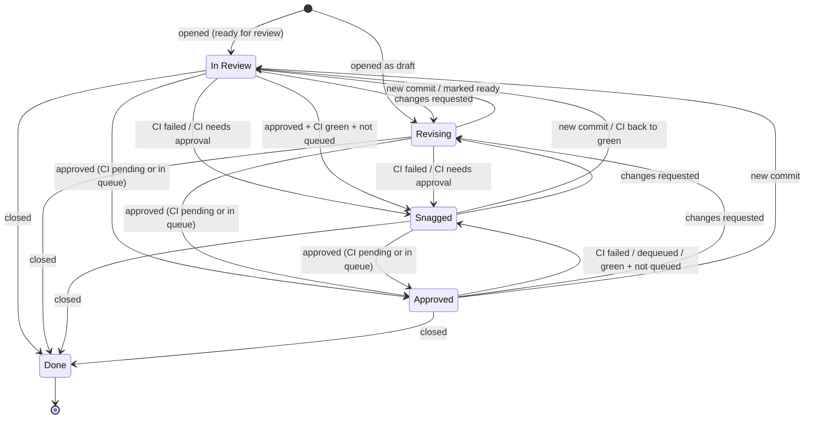
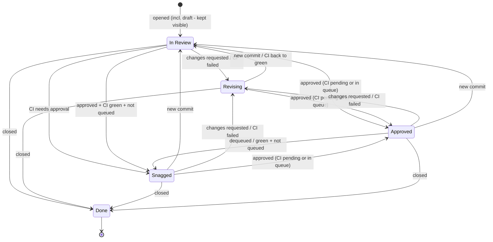

# The Slang PR Tracking board (for assignees)

This page is for **maintainers and PR assignees** — the people who get pull
requests routed to them on the shared
[Slang PR Tracking](https://github.com/orgs/shader-slang/projects/13) project
board. It explains what the board's fields mean, what each `Status` tells you,
and when a PR actually needs your attention. (If you're just opening a PR, you
don't need this — see [CONTRIBUTING.md](../../CONTRIBUTING.md).)

You never set the board fields by hand: they are maintained automatically from
PR activity (open/close, pushes, reviews, CI results, merge-queue changes). Your
job is to **read the state and act when it asks you to**.

## How a PR lands on your plate: the `Source` field

Every PR carries a **`Source`** — one of:

- **Internal** — opened by someone with write access to the repo. The **author
  drives it**; they're the assignee. No oversight is added.
- **Community** — opened by an outside contributor. A maintainer (you) is
  assigned to shepherd it and arrange review.
- **Bot** — opened by an automated coworker. A maintainer is assigned to
  shepherd it to ready-for-review and merge.

Being the assignee on a **Community** or **Bot** PR means you're responsible for
moving it forward (or finding the right reviewer).

## What each `Status` means for you

| Status | What it means | Do you act? |
|---|---|---|
| **In Review** | The default for an open PR: awaiting review, CI still running, or a fresh commit not yet reviewed. (A **Bot draft** sits here too, so you can see and shepherd it.) | **Yes** — review it, or make sure a real reviewer is requested. |
| **Revising** | The author is working: a **human draft**, or a reviewer requested changes. (A **Bot** PR's failed CI also lands here — the bot fixes itself.) | **No** — it's on the author/bot until it moves. |
| **Snagged** | Needs a human's attention: a human PR's **CI failed**, **CI is awaiting your approval to run** (fork PRs from new contributors), or the PR is **approved + green but not in the merge queue** (it fell out, or needs someone to enqueue/merge it). | **Yes** — approve the CI run, help fix CI, or enqueue/merge. |
| **Approved** | Not a draft, already has an approving review, and is waiting only on CI or the merge queue. | **No** — automated; nothing to do. |
| **Done** | The PR is closed (merged or otherwise). Terminal. | No. |

In short: **`In Review` and `Snagged` are the two columns that want you.**
`Revising`/`Approved` are waiting on someone/something else, and `Done` is finished.

## How the state is decided (priority)

When several conditions are true at once, the first matching rule wins:

1. A reviewer's **changes-request** (made on the current commit) → **Revising**.
2. **Draft** → **In Review** (Bot) / **Revising** (human).
3. CI **needs approval** → **Snagged**; CI **failed** → **Revising** (Bot) /
   **Snagged** (human).
4. **Approved**: **Snagged** if CI is green and it's not in the merge queue,
   otherwise **Approved**.
5. Otherwise → **In Review**.

Two things worth knowing:

- A review only counts while it's on the **current** commit. A new push
  supersedes earlier feedback, so the PR returns to **In Review** until it's
  re-reviewed.
- The **only** difference between the Bot and human flows is what a **CI failure**
  does (Bot → `Revising`, human → `Snagged`); everything else is identical.

## State diagrams

### Community / Internal (human) PRs

### Bot PRs

## Source of truth

These diagrams are an illustration. The authoritative rules live in the
`computeTarget` function in
[`.github/workflows/pr-board-sync.yml`](../../.github/workflows/pr-board-sync.yml),
which sets the board `Status` from PR events. If a diagram here ever disagrees
with that function, the function is correct — please fix the diagram.
