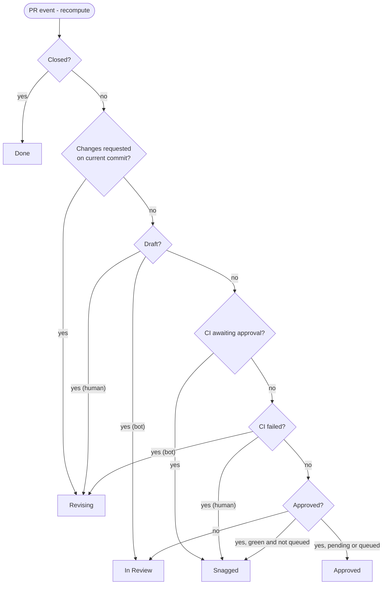

# The Slang PR Tracking board (for assignees)

This page is for **maintainers and PR assignees** — the people who get pull
requests routed to them on the shared
[Slang PR Tracking](https://github.com/orgs/shader-slang/projects/13) project
board. It explains what the board's fields mean, what each `Status` tells you,
and when a PR actually needs your attention. (If you're just opening a PR, you
don't need this — see [CONTRIBUTING.md](../../CONTRIBUTING.md).)

> The board is a `shader-slang` org project, so it is only visible to **org
> members (committers)**. Outside contributors can't see it — that's expected;
> their PRs are still tracked on it by the committers who shepherd them.

You never set **Status** by hand: it is maintained automatically from PR
activity (open/close, pushes, reviews, CI results, merge-queue changes). Your
job is to **read the state and act when it asks you to**. **Source** is also
set by automation on first sight, but you may override it when it is wrong
(see below).

## How a PR lands on your plate: the `Source` field

Automation sets each PR's **`Source`**, then picks a default assignee (and
sometimes a reviewer). Treat that as a starting point — change it if it's wrong.

**How Source is chosen**

- **Internal** — the author is on `shader-slang/source-internal` (or a nested
  team under it), or on a `source-internal-*` team whose description lists this
  repo in `Scope: [...]` (for example `Scope: [slangpy, slang-rhi]`). The author
  is assigned and no reviewer is auto-requested; they should find one themselves.
- **Community** — a human author who isn't Internal. A shepherd is chosen from
  `pr-owners`, asked to review (unless they *are* the author), and a short
  comment is posted on the PR. If someone else looks like a better reviewer
  from recent commits on the changed files, the comment names them — without
  `@`-mentioning or auto-requesting them.
- **Bot** — same shepherd / review / comment behavior as Community, but the
  allowlist is `bot-pr-owners` instead of `pr-owners`.

**How the Community/Bot shepherd is chosen:** linked-issue assignee on the
owners team, else whoever on that team has the strongest recent commit signal
on the PR's files, else the maintainer fallback.

If the team rosters can't be read, Source and assignee stay blank and the
nightly sweep retries. Internal membership is org-wide (with optional per-repo
scoped teams), so Source can still be wrong for a given repo — fix it on the
board and reassign if needed.

If you are the assignee, either drive the PR or hand it off. Internal authors
still need a reviewer: pick someone who has touched the same files recently, or
ask in the team channel.

## What each `Status` means for you

| Status | Meaning | Act? |
| --- | --- | --- |
| **In Review** | Waiting on review (or a fresh commit not yet re-reviewed). Bot drafts sit here too so you can shepherd them. | **Yes** — review, or make sure someone is. |
| **Revising** | Author (or bot) is still working: human draft, changes requested, or a Bot PR with failed CI. | **No** |
| **Snagged** | Needs a human: CI failed on a human PR, CI needs approval to run, or approved+green but not in the merge queue. | **Yes** — fix CI, approve the run, or enqueue/merge. |
| **Approved** | Has an approving review; waiting on CI or the merge queue. | **No** |
| **Done** | Closed (merged or not). Terminal. | **No** |

**`In Review` and `Snagged` are the columns that want you.** The rest are waiting on someone/something else, or finished.

## How the state is decided (priority)

Status is recomputed from current PR signals on every event (not walked along edges). First match wins:

1. Changes requested on the **current** commit → **Revising**
2. Draft → **In Review** (Bot) / **Revising** (human)
3. CI needs approval → **Snagged**; CI failed → **Revising** (Bot) / **Snagged** (human)
4. Approved → **Snagged** if green and not in the merge queue, else **Approved**
5. Otherwise → **In Review**

A new push clears earlier review opinions, so the PR goes back to **In Review** until it is reviewed again. Bot vs human differs for **drafts** and **CI failure**; everything else is the same.

## The decision, as a flowchart

```mermaid
flowchart TD
  ev([PR event - recompute]) --> closed{"Closed?"}
  closed -->|yes| done["Done"]
  closed -->|no| cr{"Changes requested<br/>on current commit?"}
  cr -->|yes| rev["Revising"]
  cr -->|no| draft{"Draft?"}
  draft -->|"yes (human)"| rev
  draft -->|"yes (bot)"| inrev["In Review"]
  draft -->|no| ciappr{"CI awaiting approval?"}
  ciappr -->|yes| snag["Snagged"]
  ciappr -->|no| cifail{"CI failed?"}
  cifail -->|"yes (bot)"| rev
  cifail -->|"yes (human)"| snag
  cifail -->|no| appr{"Approved?"}
  appr -->|"yes, green and not queued"| snag
  appr -->|"yes, pending or queued"| approved["Approved"]
  appr -->|no| inrev
```

## Source of truth

This flowchart is an illustration. The authoritative rules live in the
`computeTarget` function in
[`.github/workflows/pr-board-sync.yml`](../../.github/workflows/pr-board-sync.yml),
which sets the board `Status` from PR events. If the diagram here ever disagrees
with that function, the function is correct — please fix the diagram.
