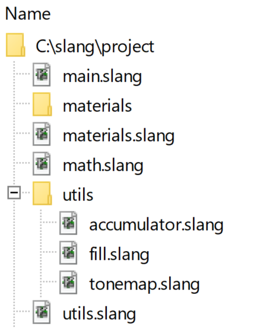

Modules and Access Control
===========================

While the preprocessor `#include` is still supported, Slang provides a _module_ system for software engineering benefits such as clean expression of subcomponent boundaries and dependencies, hiding implementation details, and providing a path towards true separate compilation.


## Defining a Module

A module in Slang comprises one or more files. A module must have one and only one primary file that is used as the source-of-truth to uniquely identify the module. The primary file must start with a `module` declaration. For example, the following code defines a module named `scene`:

```
// scene.slang

module scene;

// ...
```

A module can contain more than one file. The additional files are pulled into the module with the `__include` syntax:

```
// scene.slang

module scene;

__include "scene-helpers";

```
```
// scene-helpers.slang

implementing scene;
// ...
```

The files being included into a module must start with `implementing <module-name>` declaration.

Note that the `__include` syntax here has a different meaning than the preprocessor `#include`. `__include` has the following semantics:
1. The preprocessor state at which a file inclusion does not apply to the file being included, and the preprocessor state after parsing the included file will not be visible to the outer "includer" file. For example, `#define`s before a `__include` is not visible to the included file, and `#define`s in the included file is not visible to the file that includes it.
2. A file will be included into the current module exactly once, no matter how many times a `__include` of that file is encountered.
3. Circular `__include`s are allowed, given (2).
4. All files that become part of a module via `__include` can access all other entities defined in the same module, regardless the order of `__include`s.

This means that the following code is valid:

```
// a.slang
implementing m;
void f_a() {}

// b.slang
implementing "m"; // alternate syntax.
__include a; // pulls in `a` to module `m`.
void f_b() { f_a(); }

// c.slang
implementing "m.slang"; // alternate syntax.

void f_c()
{
    // OK, `c.slang` is part of module `m` because it is `__include`'d by
    // `m.slang`.
    f_a(); f_b();
}

// m.slang
module m;
__include m; // OK, a file including itself is allowed and has no effect.
__include "b"; // Pulls in file b (alternate syntax), and transitively pulls in file a.
__include "c.slang"; // Pulls in file c, specifying the full file name.
void test() { f_a(); f_b(); f_c(); }
```

Note that both `module`, `implementing` and `__include` support two flavors of syntax to refer to a module or a file: either via 
normal identifier tokens or via string literals. For example, the following flavors are equivalent and will resolve to the same file:
```
__include dir.file_name; // `file_name` is translated to "file-name".
__include "dir/file-name.slang";
__include "dir/file-name";
```

Also note that a file is considered a part of a module only if the file can be discovered
via transitive `__include`s from the primary module file. It is possible to have a dangling
file with the `implementing` declaration that is not `__include`'d by any other files in
the module. Such dangling files will not be considered as part of the module and will not
be compiled. The `implementing` declaration is for the purpose of verification and language server code assisting, and does not carry any other semantics that affect compilation.

> #### Note ####
> When using the identifier token syntax, Slang will translate any underscores(`_`) to hyphens("-") to obtain the file name.

## Importing a Module

At the global scope of a Slang file, you can use the `import` keyword to import another module by name:

```hlsl
// MyShader.slang

import YourLibrary;
```

This `import` declaration will cause the compiler to look for a module named `YourLibrary` and make its declarations visible in the current scope. Similar to `__include`, `import` also supports both the identifier-token and the file-name string syntax.

You can only `import` a primary source file of a module. For example, given:
```
// m.slang
module m;
__include helper;

// helper.slang
implementing m;
// ...
```
It is only valid for the user code to `import m`. Attempting to `import helper` will result a compile-time error. 

Multiple `import`s of the same module from different input files will only cause the module to be loaded once (there is no need for "include guards" or `#pragma once`).
Note that preprocessor definitions in the current file will not affect the compilation of `import`ed code, and the preprocessor definitions in the imported code is not visible to the current file.

## Access Control

Slang supports access control modifiers: `public`, `internal` and `private`. The module boundary plays an important role in access control.

`public` symbols are accessible everywhere: from within the different types, different files or different modules.

`private` symbols are only visible to other symbols in the same type. The following example shows the scope of `private` visibility:
```csharp
struct MyType
{
    private int member;

    int f() { member = 5; } // OK.

    struct ChildType
    {
        int g(MyType t)
        {
            return t.member; // OK.
        }
    }
}

void outerFunc(MyType t)
{
    t.member = 2; // Error, `member` is not visible here.
}
```

`internal` symbols are visible throughout the same module, regardless if it is referenced from the same type or same file. But they are not visible to other modules. The following example shows the scope of `internal` visibility:

```csharp
// a.slang
module a;
__include b;
public struct PS
{
    internal int internalMember;
    public int publicMember;
}
internal void f() { f_b(); } // OK, f_b defined in the same module.

// b.slang
implementing a;
internal void f_b(); // Defines f_b in module `a`.
public void publicFunc();

// m.slang
module m;
import a;
void main()
{
    f(); // Error, f is not visible here.
    publicFunc(); // OK.
    PS p; // OK.
    p.internalMember = 1; // Error, internalMember is not visible.
    p.publicMember = 1; // OK.
}
```

`internal` is the default visibility if no other access modifiers are specified, an exception is for `interface` members, where the default visibility is the visibility of the interface.

### Additional Validation Rules

The Slang compiler enforces the following rules regarding access control:
- A more visible entity should not expose less visible entities through its signature. For example, a `public` function cannot have a return type that is `internal`.
- A member of a `struct`, `interface` and other aggregate types cannot have a higher visibility than its parent.
- If a `struct` type has visibility `Vs`, and one of its member has visibility `Vm`, and the member is used to satisfy an interface requirement that has visibility `Vr`, then `Vm` must not be lower (less visible) than `min(Vs, Vr)`.
- Type definitions themselves cannot be `private`, for example, `private struct S {}` is not valid code.
- `interface` requirements cannot be `private`.

## Organizing File Structure of Modules

Slang does not seek to impose any specific organization of modules. However, there are some conventions that have emerged as being useful.

### Module Organization Suggestions

- The top-level directory contains modules that would be `import`ed by user code.
- The implementation details of the modules are placed in files at lower levels of the tree.

This has the benefit that it is easy for a user to distinguish the public API from the implementation details.

### Module Organization Example



### Module Organization Example

The above diagram shows a module organization example.

Top-level module files such as `utils.slang` are those that are directly `import`ed by user code. The implementation details of the module are placed in the lower levels of the tree, organized into similarly named subdirectories for clarity.

Modules like `utils.slang` needn't contain anything more than a module declaration and a list of included files, with optional `import` statement(s) to pull in any external dependencies, e.g.

```
module utils;
import slangpy;

__include "utils/accumlator.slang";
__include "utils/tonemap.slang";
__include "utils/fill.slang";
```

Here, all the public symbols defined in `accumlator.slang`, `tonemap.slang`, and `fill.slang` are visible to the user of the `utils` module, and these constituent helper files do not need to clutter the top-level file hierarchy.

## Legacy Modules

Slang used to not have support for access control, and all symbols were treated as having `public` visibility. To provide compatibility with existing code, the Slang compiler will detect if the module is written in the legacy language, and treat all symbols as `public` if so.

A module is determined to be written in legacy language if all the following conditions are met:
- The module is lacking `module` declaration at the beginning.
- There is no use of `__include`.
- There is no use of any visibility modifiers -- `public`, `private` or `internal`.

The user is advised that this legacy mode is for compatibility only. This mode may be deprecated in the future, and it is strongly recommended that new code should not rely on this compiler behavior.
