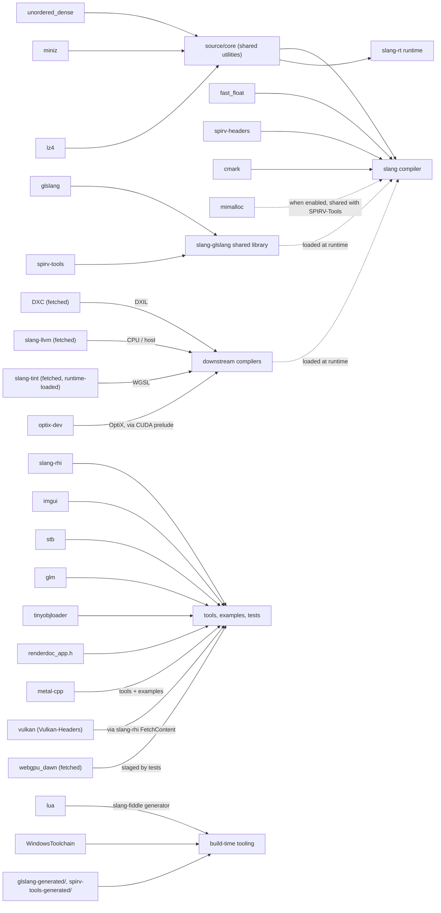

# `external/` — third-party dependencies

This directory holds the third-party code Slang depends on, together with the
build plumbing that wires each dependency into the CMake build. This file
documents **what each dependency is for**, **which CMake option enables,
disables, or configures it**, **its license**, and **which build output it
feeds**.

The authoritative source of truth is always the build files themselves —
[`external/CMakeLists.txt`](CMakeLists.txt), the top-level
[`CMakeLists.txt`](../CMakeLists.txt), [`tools/CMakeLists.txt`](../tools/CMakeLists.txt),
and [`.gitmodules`](../.gitmodules). This document is a curated overview kept
deliberately high-level so it does not drift as individual option lines move.

## Kinds of content in this directory

Not everything under `external/` is a git submodule. There are four distinct
kinds of content, and it helps to know which is which:

- **Git submodules (18)** — fetched by `git submodule update --init --recursive`:
  `glslang`, `spirv-tools`, `spirv-headers`, `vulkan` (Vulkan-Headers),
  `slang-rhi`, `glm`, `imgui`, `tinyobjloader`, `lua`, `metal-cpp`, `miniz`,
  `lz4`, `unordered_dense`, `fast_float`, `cmark`, `mimalloc`, `optix-dev`,
  `WindowsToolchain`.
- **Vendored headers (checked in, not submodules)** — small header sets copied
  directly into the tree: `dxc/` (`dxcapi.h`, `WinAdapter.h`), `stb/`, `spirv/`
  (`spirv.h`), `slang-tint-headers/`, `glext.h`, `wglext.h`, `renderdoc_app.h`.
- **Pre-generated and committed** — `glslang-generated/` and
  `spirv-tools-generated/`. These are checked in, but they are _not_ produced by
  the Slang build; they are generated out-of-band by the maintainer scripts
  [`extras/update-spirv-tools.sh`](../extras/update-spirv-tools.sh) and
  [`bump-glslang.sh`](bump-glslang.sh) (CI has a freshness check) and committed
  so a normal build does not have to regenerate them. Their own in-tree READMEs
  describe the refresh procedure.
- **Fetched as prebuilt binaries (some with a source-build fallback)** —
  obtained by CMake at configure time rather than kept in the tree:
  `slang-tint`, `webgpu_dawn`, `slang-llvm`, and DXC. DXC is a prebuilt download
  on most configurations, but it is built from source when
  `SLANG_DXC_BUILD_FROM_SOURCE=ON`, on macOS by default, and as a Linux fallback
  when the prebuilt binary needs a newer GLIBC than the host provides (see
  [`../cmake/FetchDXC.cmake`](../cmake/FetchDXC.cmake)). The helper scripts
  `build-llvm.sh` / `build-llvm.ps1` and `bump-glslang.sh` live alongside them.

## Dependency reference

| Dependency                                         | Purpose                                                                                                                                                                     | Enable / configure option(s) (default)                                                                                                                                    |
| -------------------------------------------------- | --------------------------------------------------------------------------------------------------------------------------------------------------------------------------- | ------------------------------------------------------------------------------------------------------------------------------------------------------------------------- |
| `glslang`                                          | GLSL front-end and the SPIRV / SPIRV-Tools-opt / SPIRV-Tools-link libraries, consumed through the `slang-glslang` wrapper.                                                  | `SLANG_ENABLE_SLANG_GLSLANG` (ON); system build via `SLANG_USE_SYSTEM_GLSLANG` (OFF)                                                                                      |
| `spirv-tools`                                      | SPIR-V validator / optimizer / linker. Built as part of the glslang path.                                                                                                   | Built when `SLANG_ENABLE_SLANG_GLSLANG` is ON; `SLANG_USE_SYSTEM_SPIRV_TOOLS` (OFF); `SLANG_ENABLE_SPIRV_TOOLS_MIMALLOC` (platform default)                               |
| `spirv-headers`                                    | SPIR-V specification headers and grammar JSON used by the compiler core and code generation.                                                                                | `SLANG_USE_SYSTEM_SPIRV_HEADERS` (OFF)                                                                                                                                    |
| `vulkan` (Vulkan-Headers)                          | Vulkan API headers. Also reused by `slang-rhi`'s own FetchContent request.                                                                                                  | `SLANG_USE_SYSTEM_VULKAN_HEADERS` (OFF)                                                                                                                                   |
| `slang-rhi`                                        | Render-hardware-interface layer used by `gfx`, tests, and examples.                                                                                                         | `SLANG_ENABLE_SLANG_RHI` (ON)                                                                                                                                             |
| `glm`                                              | Math library for tools and examples.                                                                                                                                        | Consumed by `tools/`; `SLANG_OVERRIDE_GLM_PATH` (OFF)                                                                                                                     |
| `imgui`                                            | Immediate-mode GUI for the graphics examples.                                                                                                                               | Built when `SLANG_ENABLE_GFX`, or `SLANG_ENABLE_SLANG_RHI` together with `SLANG_ENABLE_TESTS`/`SLANG_ENABLE_EXAMPLES`; `SLANG_OVERRIDE_IMGUI_PATH` (OFF)                  |
| `tinyobjloader`                                    | Wavefront `.obj` loader for examples.                                                                                                                                       | Consumed by `tools/`; `SLANG_OVERRIDE_TINYOBJLOADER_PATH` (OFF)                                                                                                           |
| `lua`                                              | Scripting language embedded by the `slang-fiddle` code generator (build tooling).                                                                                           | `SLANG_OVERRIDE_LUA_PATH` (OFF)                                                                                                                                           |
| `metal-cpp`                                        | Metal C++ bindings for the Metal backend (macOS). Header-only `INTERFACE` target, always available.                                                                         | — (no option; header-only)                                                                                                                                                |
| `miniz`                                            | zlib-compatible (de)compression used by the core and runtime.                                                                                                               | `SLANG_USE_SYSTEM_MINIZ` (OFF)                                                                                                                                            |
| `lz4`                                              | LZ4 (de)compression used by the core and runtime.                                                                                                                           | `SLANG_USE_SYSTEM_LZ4` (OFF)                                                                                                                                              |
| `unordered_dense`                                  | Fast hash-map/set container used across the core and runtime.                                                                                                               | `SLANG_USE_SYSTEM_UNORDERED_DENSE` (OFF)                                                                                                                                  |
| `fast_float`                                       | Fast, correct floating-point parsing for the compiler core. Header-only `INTERFACE` target.                                                                                 | `SLANG_OVERRIDE_FAST_FLOAT_PATH` (OFF)                                                                                                                                    |
| `cmark`                                            | CommonMark / GitHub-Flavored-Markdown parser (swiftlang fork) used by Slang's Markdown/documentation handling.                                                              | Always built; `SLANG_OVERRIDE_CMARK_PATH` (OFF)                                                                                                                           |
| `mimalloc`                                         | Microsoft allocator. One checkout is shared between Slang and SPIRV-Tools.                                                                                                  | `SLANG_ENABLE_MIMALLOC` (platform-dependent default) and `SLANG_ENABLE_SPIRV_TOOLS_MIMALLOC`; `SLANG_OVERRIDE_MIMALLOC_PATH` (OFF)                                        |
| `optix-dev`                                        | NVIDIA OptiX SDK headers for ray-tracing on CUDA.                                                                                                                           | `SLANG_ENABLE_OPTIX` (AUTO — requires `SLANG_ENABLE_CUDA`)                                                                                                                |
| `WindowsToolchain`                                 | CMake toolchain helper files for Windows. Build tooling only, not a linked library.                                                                                         | — (build tooling)                                                                                                                                                         |
| DXC _(prebuilt binary or source + `dxc/` headers)_ | DirectX Shader Compiler for DXIL code generation. `dxc/` holds the API headers; the compiler is a prebuilt download on most configurations and built from source in others. | `SLANG_ENABLE_DXIL` (ON); `SLANG_DXC_BUILD_FROM_SOURCE` and `SLANG_DXC_BINARY_URL` control how DXC is obtained (see [`../cmake/FetchDXC.cmake`](../cmake/FetchDXC.cmake)) |
| `slang-tint` / `webgpu_dawn` _(fetched binaries)_  | WGSL / WebGPU support.                                                                                                                                                      | `SLANG_EXCLUDE_TINT` (OFF), `SLANG_EXCLUDE_DAWN` (ON off-Windows, OFF on Windows)                                                                                         |
| `slang-llvm` / LLVM _(fetched or system)_          | LLVM-based host/CPU code generation.                                                                                                                                        | `SLANG_SLANG_LLVM_FLAVOR` (`FETCH_BINARY_IF_POSSIBLE`)                                                                                                                    |

Vendored headers not in the table above are used directly by their consumers
and have no dedicated option: `stb/` (image I/O for examples), `spirv/`
(`spirv.h`), `slang-tint-headers/`, `glext.h` / `wglext.h` (OpenGL extension
headers), and `renderdoc_app.h` (the RenderDoc in-application API).

## Licenses

The summary below is a convenience, not a substitute for the authoritative
license text. Most dependencies carry a `LICENSE` / `COPYING` file in their
subdirectory, but a few keep the terms elsewhere: `lua` states its license in
the copyright notice at the end of `lua/lua.h`, and the vendored `dxc/` and
`stb/` headers carry their license banner at the top of the source files. Each
entry below was read from that authoritative location at the pinned revision.

| Dependency         | License                                                                        |
| ------------------ | ------------------------------------------------------------------------------ |
| `glslang`          | Mixed: BSD-3-Clause, BSD-2-Clause, MIT, Apache-2.0 (see `glslang/LICENSE.txt`) |
| `spirv-tools`      | Apache-2.0                                                                     |
| `spirv-headers`    | MIT (Khronos)                                                                  |
| `vulkan`           | Apache-2.0 (a few files are also MIT)                                          |
| `slang-rhi`        | Apache-2.0 WITH LLVM-exception                                                 |
| `glm`              | MIT (or the "Happy Bunny" modified-MIT license), user's choice                 |
| `imgui`            | MIT                                                                            |
| `tinyobjloader`    | MIT                                                                            |
| `lua`              | MIT                                                                            |
| `metal-cpp`        | Apache-2.0                                                                     |
| `miniz`            | MIT                                                                            |
| `lz4`              | BSD-2-Clause for `lib/` (what Slang links); other directories GPL-2.0-or-later |
| `unordered_dense`  | MIT                                                                            |
| `fast_float`       | Apache-2.0 / MIT / BSL-1.0 (tri-license, user's choice)                        |
| `cmark`            | BSD-2-Clause (bundles some MIT and CC-BY-SA components)                        |
| `mimalloc`         | MIT                                                                            |
| `optix-dev`        | NVIDIA proprietary SDK license (see `optix-dev/LICENSE.txt`)                   |
| `WindowsToolchain` | MIT                                                                            |
| `dxc/` headers     | University of Illinois/NCSA Open Source License (the LLVM/DXC license)         |
| `stb/`             | Public domain (dual-licensed MIT at the user's option)                         |
| `spirv/`           | MIT (Khronos)                                                                  |

The remaining fetched binaries carry their own upstream project's license: DXC
under the NCSA license (as above), and `slang-tint` / `webgpu_dawn` / `slang-llvm`
under their respective upstream terms (they are not checked into this tree).

## Which dependency feeds which output

Each dependency, grouped by the artifact it ends up in:


```mermaid
flowchart LR
    unordered_dense & miniz & lz4 --> corelib["source/core (shared utilities)"]
    corelib --> slang["slang compiler"]
    corelib --> slangrt["slang-rt runtime"]
    fast_float & spirv_headers["spirv-headers"] & cmark --> slang
    mimalloc -.->|when enabled, shared with SPIRV-Tools| slang

    glslang & spirv_tools["spirv-tools"] --> glslang_lib["slang-glslang shared library"]
    glslang_lib -.->|loaded at runtime| slang

    dxc["DXC (fetched)"] -->|DXIL| downstream["downstream compilers"]
    slang_llvm["slang-llvm (fetched)"] -->|CPU / host| downstream
    slang_tint["slang-tint (fetched, runtime-loaded)"] -->|WGSL| downstream
    optix_dev["optix-dev"] -->|OptiX, via CUDA prelude| downstream
    downstream -.->|loaded at runtime| slang

    slang_rhi["slang-rhi"] & imgui & stb & glm & tinyobjloader & renderdoc["renderdoc_app.h"] --> tools["tools, examples, tests"]
    metal_cpp["metal-cpp"] -->|tools + examples| tools
    vulkan["vulkan (Vulkan-Headers)"] -->|via slang-rhi FetchContent| tools
    webgpu_dawn["webgpu_dawn (fetched)"] -->|staged by tests| tools

    lua -->|slang-fiddle generator| build_tooling["build-time tooling"]
    WindowsToolchain --> build_tooling
    generated["glslang-generated/, spirv-tools-generated/"] --> build_tooling
```

A few edges carry caveats the diagram abbreviates: the `slang-glslang` shared
library is loaded at runtime by `source/compiler-core` (by name, via
`loadSharedLibrary`), not linked into the compiler; `mimalloc` is one checkout
shared between Slang and SPIRV-Tools; `slang-tint` is likewise loaded at runtime
by `source/compiler-core` (via `slang-tint-headers/`); `slang-rhi` fetches its
own Metal C++ archive separately from the vendored `metal-cpp`; and the
`*-generated/` directories are committed inputs compiled into the glslang /
SPIRV-Tools build rather than build products.

## Build-wide option families

Several dependencies are controlled by the same families of options rather than
a bespoke switch:

- **`SLANG_ENABLE_*`** — turn a feature and its dependency on or off, e.g.
  `SLANG_ENABLE_SLANG_GLSLANG`, `SLANG_ENABLE_SLANG_RHI`, `SLANG_ENABLE_DXIL`,
  and `SLANG_ENABLE_OPTIX`. Some are plain booleans; the CUDA/OptiX/NVAPI family
  defaults to `AUTO` (enabled when the corresponding SDK is found).
- **`SLANG_SLANG_LLVM_FLAVOR`** — how the LLVM-backed `slang-llvm` library is
  obtained: `FETCH_BINARY`, `FETCH_BINARY_IF_POSSIBLE` (default),
  `USE_SYSTEM_LLVM`, or `DISABLE`. A custom download location can be given with
  `SLANG_SLANG_LLVM_BINARY_URL`.

Two further families, **`SLANG_USE_SYSTEM_*`** and **`SLANG_OVERRIDE_*_PATH`**,
appear per-dependency in the reference table above (which lists the dependencies
that expose them and their defaults). Their usage is covered in the next
section.

## Using system-provided dependencies

Most of the submodule-backed dependencies above can instead be taken from a copy
you supply, through one of two option families: `SLANG_USE_SYSTEM_*` builds
against a package you have installed; `SLANG_OVERRIDE_*_PATH` builds from a
source checkout you point at. Both default **OFF**; the option lines are in the
top-level [`CMakeLists.txt`](../CMakeLists.txt) and the wiring is in
[`external/CMakeLists.txt`](CMakeLists.txt) and
[`tools/CMakeLists.txt`](../tools/CMakeLists.txt), which stay the authoritative
source of truth.

> These options are marked _advanced_, so they are hidden in the default
> `ccmake` / `cmake-gui` view (toggle "advanced" to see them). They are also
> declared with CMake's `option()`, i.e. a boolean type, but the
> `SLANG_OVERRIDE_*_PATH` ones take a path string — pass a path and the `OFF`
> default simply means "not set".

### `SLANG_USE_SYSTEM_*` — use an installed package

Setting one `ON` makes the build call `find_package` for that dependency instead
of adding the bundled submodule. Defined for `MINIZ`, `LZ4`, `VULKAN_HEADERS`,
`SPIRV_HEADERS`, `UNORDERED_DENSE`, `SPIRV_TOOLS`, and `GLSLANG`. Point CMake at
the install the usual way — `-D<Pkg>_ROOT=…`, `-D<Pkg>_DIR=…`, or
`-DCMAKE_PREFIX_PATH=…`. **The `find_package` name is case-sensitive and does not
track the option suffix** (e.g. `VulkanHeaders`, `SPIRV-Headers`), so use the
name from the table.

```bash
# Build glslang and SPIRV-Tools from system installs instead of the submodules.
cmake --preset default \
  -DSLANG_USE_SYSTEM_SPIRV_TOOLS=ON \
  -DSLANG_USE_SYSTEM_GLSLANG=ON \
  -DCMAKE_PREFIX_PATH="/opt/spirv-tools;/opt/glslang"
```

| Option (all default OFF)           | `find_package` name | Notes                                                                                    |
| ---------------------------------- | ------------------- | ---------------------------------------------------------------------------------------- |
| `SLANG_USE_SYSTEM_MINIZ`           | `miniz`             | Aliases `miniz::miniz` → the expected `miniz` target.                                    |
| `SLANG_USE_SYSTEM_LZ4`             | `lz4`               | Aliases `LZ4::lz4` → the expected `lz4_static` target.                                   |
| `SLANG_USE_SYSTEM_VULKAN_HEADERS`  | `VulkanHeaders`     | Provides the `Vulkan::Headers` target; also reused by `slang-rhi`'s own request.         |
| `SLANG_USE_SYSTEM_SPIRV_HEADERS`   | `SPIRV-Headers`     | Uses `SPIRV-Headers::SPIRV-Headers`. Wins over `SLANG_OVERRIDE_SPIRV_HEADERS_PATH`.      |
| `SLANG_USE_SYSTEM_UNORDERED_DENSE` | `unordered_dense`   | Config-mode only, and the only one not `REQUIRED` — see the failure note below.          |
| `SLANG_USE_SYSTEM_SPIRV_TOOLS`     | `SPIRV-Tools`       | Used on the glslang path (`SLANG_ENABLE_SLANG_GLSLANG=ON`).                              |
| `SLANG_USE_SYSTEM_GLSLANG`         | `glslang`           | Aliases `glslang::glslang` → the expected `glslang` target; needs SPIRV-Tools available. |

`unordered_dense` is looked up in config mode specifically; the other six use the
basic `find_package` signature, which tries module mode first and falls back to
config mode. In practice the tree ships no `Find*.cmake` for any of them, so all
seven are satisfied by a package's installed `…Config.cmake`. Point `-D<Pkg>_DIR=`
at the directory containing that config file; `-D<Pkg>_ROOT=`/`CMAKE_PREFIX_PATH`
point at the install prefix.

> **Slang requests no version.** None of these `find_package` calls pass a
> version constraint, so Slang accepts whatever the package config reports (the
> config itself may still perform its own checks). This matters most for
> `glslang`, `SPIRV-Tools`, and `SPIRV-Headers`, which Slang pins to specific
> commits — a mismatched system copy can configure and then fail or misbehave
> later. Prefer the bundled submodule unless your copy matches the pinned
> revision.

> **How a missing package fails.** Six of the seven use `find_package(… REQUIRED)`,
> so a failed lookup stops configuration immediately with a clear message.
> `UNORDERED_DENSE` is the exception: it is looked up `CONFIG QUIET`, so a failed
> lookup is _silent_ and the bundled copy is still skipped — the failure only
> surfaces later, as a CMake generation error about the unresolved target
> `unordered_dense::unordered_dense`. If you enable it, make sure the package is
> actually discoverable.

### `SLANG_OVERRIDE_*_PATH` — build from a source checkout

Setting one to a path builds that dependency from your own tree instead of the
submodule. Defined for `LZ4`, `MINIZ`, `UNORDERED_DENSE`, `VULKAN_HEADERS`,
`SPIRV_HEADERS`, `SPIRV_TOOLS`, `GLSLANG`, `GLM`, `IMGUI`, `SLANG_RHI`,
`TINYOBJLOADER`, `LUA`, `MIMALLOC`, `CMARK`, and `FAST_FLOAT`.

An override assumes the matching `SLANG_USE_SYSTEM_*` is OFF; when a dependency
exposes both knobs the system-package path generally takes precedence (for
`SPIRV_HEADERS` this is explicit — the build warns and ignores the override).

**The path points to a directory _containing_ a subdirectory named after the
dependency, not to the dependency directory itself.** For example
`SLANG_OVERRIDE_GLSLANG_PATH=/work/deps` expects the source under
`/work/deps/glslang/`:

```bash
cmake --preset default -DSLANG_OVERRIDE_GLSLANG_PATH=/work/deps
#   expects /work/deps/glslang/CMakeLists.txt
```

Most overrides are consumed via `add_subdirectory`, so the directory must hold a
buildable checkout: `LZ4`, `MINIZ`, `UNORDERED_DENSE`, `VULKAN_HEADERS`,
`SPIRV_HEADERS`, `SPIRV_TOOLS`, `GLSLANG`, `SLANG_RHI`, `MIMALLOC`, `CMARK`. The
rest supply only an include directory: `IMGUI`, `LUA`, `FAST_FLOAT` (and `GLM`,
`TINYOBJLOADER` — but see the caveat below). "Include-directory-only" here means
the build just adds the path to an include search list — the source is still
compiled where relevant (`LUA`'s C source, for instance, is `#include`d into a
C++ translation unit and compiled as part of it).

Per-dependency gotchas worth knowing before you set one:

- **LZ4 has a nested layout:** its CMake project lives under `build/cmake/`, so
  the override resolves to `<path>/lz4/build/cmake/`.
- **FAST_FLOAT is under `include/`:** the override resolves to
  `<path>/fast_float/include/`.
- **`MIMALLOC` and `FAST_FLOAT` fail loudly on a bad path.** `FAST_FLOAT` stops
  at configure time with a `FATAL_ERROR` if `<path>/fast_float/include/` is
  missing. `MIMALLOC` does the same for `<path>/mimalloc/CMakeLists.txt`, but only
  when mimalloc is actually being built (`SLANG_ENABLE_MIMALLOC` /
  `SLANG_ENABLE_SPIRV_TOOLS_MIMALLOC`); a bad override with mimalloc unused is not
  checked. (That same check also fires when the bundled submodule is simply
  uninitialized.)
- **`SPIRV_HEADERS` override is ignored when `SLANG_USE_SYSTEM_SPIRV_HEADERS=ON`**
  (the build warns and the system package wins). Pick one knob, not both.
- **`GLM` and `TINYOBJLOADER` overrides currently take no effect.** Their only
  consumers are `tools/` targets, and there the override does not replace the
  bundled include root — the bundled `external/` path is still searched first, so
  the bundled copy wins. Use the submodule for these until that is fixed.

## Submodule pin policy

A few submodules carry non-default settings in [`.gitmodules`](../.gitmodules):

- `spirv-tools` sets `slang-skip-pin-check = true`. Slang routinely pins to a
  SPIRV-Tools fix that is upstreamed as a PR but not yet merged to the tracked
  branch, so the branch-reachability check is skipped (the SHA is still verified
  to be fetchable from the official Khronos URL).
- `lua`, `cmark`, and `fast_float` set a `branch =` override, naming the
  upstream ref the pin-check verifies the pinned commit against (a branch or a
  tag) instead of the remote's default branch. `lua` tracks the `v5.4`
  maintenance branch (its pin is not on the default `master`); `cmark` tracks
  its `gfm` branch (which is that repo's default); and `fast_float` pins the
  `v8.2.7` release **tag** (it exists only as a tag, with no same-named branch).
- `miniz` sets `ignore = untracked` so build-generated files in that checkout
  do not show up as local modifications.
