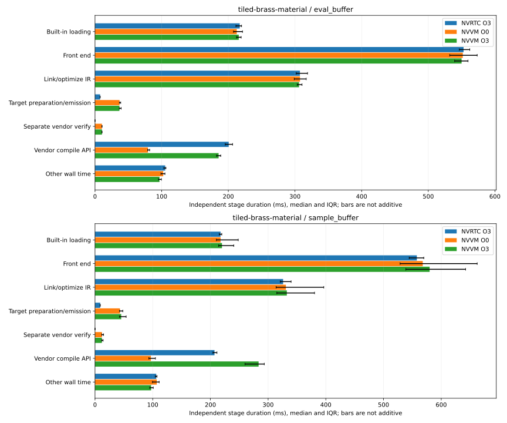

# NVVM Monday package: what limits material compilation and code quality

The direct backend works across the accepted corpus and compiles the material near NVRTC's time,
but does not yet establish an overall speed or code-quality advantage. We now know where time goes
and have concrete explanations for the material's extra local storage and arithmetic. No new
compiler optimization was promoted in this follow-up.

Start with [the six-slide outline](PRESENTATION.md). Use the [original263 package](../2026-09-26/README.md)
for accepted baseline compile/quality measurements and this package for research264's stage/resource
explanation. [Package metadata](package.json) identifies both evidence sets; the original is preserved.

## Compile-time result and attribution

Original263 O3 material medians are 1362.76/1390.16ms through NVRTC versus 1355.04/1460.18ms through
NVVM (evaluation/sampling): evaluation near parity; sampling 5.04% slower. The separate instrumented264
run measured 1399.09/1429.46ms versus 1404.23/1566.61ms. Both rounds agree on slower NVVM sampling;
evaluation crosses parity. The changed absolute times and sampling gap are **not** a paired regression
measurement. Keep the two sessions separate; no samples were discarded or retried.

| O3 observation, evaluation / sampling                           |           NVRTC |    Direct NVVM |
| --------------------------------------------------------------- | --------------: | -------------: |
| Vendor compile API median, ms                                   |  200.65 /207.07 | 185.44 /283.50 |
| Vendor compile, median fraction of wall                         |  14.35% /14.57% | 13.28% /17.65% |
| Shared builtin/front-end/Slang IR work, median fraction of wall |  77.51% /77.43% | 76.37% /72.44% |
| Target preparation and emission, median ms                      |      7.68 /9.03 |   36.62 /45.41 |
| Separate vendor verification, median ms                         | no exposed call |   10.43 /11.88 |

The majority of time is shared Slang work, not the vendor compile call. Bypassing CUDA-source
compilation therefore removes only part of total cost. NVVM's evaluation vendor call is faster,
but other direct-backend work consumes that advantage. Sampling spends more in the vendor call
itself, in both rounds. The API is opaque: this is not a measurement of pure optimizer time.

The serializer verifies and renders text twice, once to query size and once to write. The second
call costs 7.96/9.20 ms (0.57%/0.62% of wall), including necessary copying. A one-shot output API is a
reasonable general improvement, but its saving is not measured and it is a small Monday opportunity.

All percentages/residuals are calculated per sample, then summarized. Independent stage medians
need not sum to the wall median. The chart is deliberately unstacked. NVRTC's absent separate
verification call does not mean it performs no verification. [Full tables](attribution/stage-attribution.md)
and [structured stages](attribution/stage-attribution.json) retain IQRs and both rounds;
[all measured phases/resources](attribution/summary.json) retain the other observations.

## Why stack and registers differ

O3 entry resources are unchanged from263: NVRTC 48/63 registers and 592/624 stack bytes; NVVM 67/86
registers and 784 bytes. All four material modules have zero spills and no remaining calls.

Evaluation retains the entire local material graph. Its layout reconstructs as follows, with offsets
corroborated by final PTX:

| Field group             | CUDA offset / bytes | NVVM offset / bytes |
| ----------------------- | ------------------: | ------------------: |
| Texture handles         |                0 /8 |                0 /8 |
| SurfaceInteraction      |               8 /96 |             16 /128 |
| Hints and sampler       |              104 /8 |              144 /8 |
| Two float4x4 transforms |            112 /128 |            160 /128 |
| Two float3x3 transforms |             240 /72 |             288 /96 |
| Counters                |              312 /8 |              384 /8 |
| Material stack data     |            320 /240 |            400 /336 |
| Surface shader          |             560 /24 |             736 /48 |
| Rounded graph size      |             **592** |             **784** |

CUDA local float3 occupies 12 bytes with alignment 4; ordinary NVVM LLVM vector storage allocates
16 bytes. That explains evaluation's 192 extra stack bytes. The additional 32 NVRTC sampling bytes
remain unattributed. This is internal layout, not a demonstrated external-buffer ABI bug.

NVVM also reloads fields initialized to zero absorption and false retroreflection. It retains six
exponential instructions per material entry where NVRTC retains none, plus extra selections and
other arithmetic. That is concrete extra work and more live values; **the exact 19/23-register
penalty is not causally assigned**. PTX instruction counts and stack sizes do not establish GPU speed.

## What the general probe establishes

The grouped probe loses constants on both compilers, so it is not yet a reproducer of the material's
backend asymmetry. A source-level version with separate array/payload storage removes the constant
exponential path on both. NVVM's constant-case resources change 21→18 registers and 80→32 stack bytes.
The runtime-dependent nonzero control retains exponential work; both variants pass the independent
29,29,33,33 oracle on NVRTC O3/NVVM O0/O3. The final checked-in variants pass 6/6 on accepted262.

This is evidence for a general aggregate optimization investigation, **not a shipped compiler win**.
The material's canonical graph crosses helper boundaries; no safe one-line producer/metadata fix was
found. Investigate inlining, aggregate splitting and field-aware constant propagation before broadly
changing local storage layout. [Reproduction instructions and sources](../../experiments/material-attribution/README.md)
retain the experiment; [research264](../../report.slice-264-material-attribution.md) records the trace.

## Correctness, quality and reproducibility

Accepted262 remains authoritative: 1713 runtime cells, 1674 correct, 39 unresolved, 18 resolved histories.
It includes explicit serial closure of one NVRTC PCH deletion failure; concurrent PCH reliability is
still open. Material runtime lacks application binding/texture/LUT/input/output contracts.
The original [12-shader quality subset](../2026-09-26/quality/summary.md) has 1 lower / 10 equal / 1 higher
NVVM O3 register counts, 3 smaller / 9 equal executable text sizes, and zero spills in 24 O3 entries.
These results are inherited unchanged, not rerun as part of this report-only refresh. SASS remains
unavailable because the selected toolkit lacks cuobjdump.

Research264 qualifies 42 material/quality pairs and 139 relevant units; all 132 repeated PTX outputs
and 66 cubins match263 exactly. Temporary instrumentation is reversed, and all 27 accepted build/cache
identities are restored. The patch, measured instrumented identities and separate preserved build
are retained for reproducibility. This does not create a new full compiler correctness baseline.

The new `nvvm-results.py report --stage-attribution` regenerates these stages and figures from
qualified raw material records; it rejects absent/inconsistent scopes and impossible containment.
[RESULTS](../../RESULTS.md) gives refresh commands; [HANDOFF](../../HANDOFF.md) explains a fresh session.
The finite follow-up is complete. The general development loop is **stopped** for discussion.
