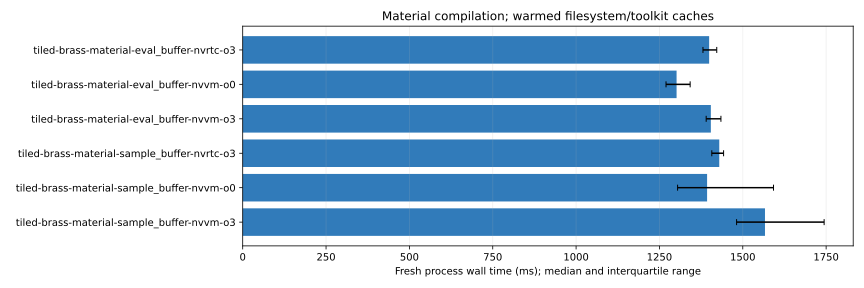

# NVVM material observations

Revision: `f9532f06ecab550ba21bc077a030c8c53a8a124d`.

All times are milliseconds. Wall medians include fresh process/session overhead; assembly is separate. Nested compiler phase timers must not be added.

| Cell | Wall median (IQR) | Assembly median | PTX bytes | Cubin bytes |
| --- | ---: | ---: | ---: | ---: |
| tiled-brass-material-eval_buffer-nvrtc-o3 | 1399.09 (1380.57–1421.91) | 174.72 | 72360 | 70944 |
| tiled-brass-material-eval_buffer-nvvm-o0 | 1301.42 (1269.76–1342.14) | 708.67 | 733879 | 243768 |
| tiled-brass-material-eval_buffer-nvvm-o3 | 1404.23 (1390.21–1434.43) | 214.13 | 82632 | 71336 |
| tiled-brass-material-sample_buffer-nvrtc-o3 | 1429.46 (1407.07–1442.42) | 256.95 | 103321 | 92088 |
| tiled-brass-material-sample_buffer-nvvm-o0 | 1392.96 (1304.46–1592.18) | 897.74 | 906830 | 301624 |
| tiled-brass-material-sample_buffer-nvvm-o3 | 1566.61 (1481.42–1744.00) | 299.23 | 117109 | 94008 |

| Cell | SemanticChecking median ms | compileInner median ms |
| --- | ---: | ---: |
| tiled-brass-material-eval_buffer-nvrtc-o3 | 393.42499999999995 | 1087.8249999999998 |
| tiled-brass-material-eval_buffer-nvvm-o0 | 391.065 | 997.815 |
| tiled-brass-material-eval_buffer-nvvm-o3 | 390.355 | 1095.13 |
| tiled-brass-material-sample_buffer-nvrtc-o3 | 398.75 | 1112.78 |
| tiled-brass-material-sample_buffer-nvvm-o0 | 394.355 | 1083.74 |
| tiled-brass-material-sample_buffer-nvvm-o3 | 414.435 | 1254.805 |

Fresh process/session with warmed filesystem and toolkit caches, including NVRTC PCH when enabled. Compile/assembly observations; no kernel-speed inference. PTX bytes include text/symbols; cubin bytes include metadata; SASS counts and executable text sizes cover the whole module.

Full phase, resource, SASS and executable-section observations: [summary.json](summary.json).
