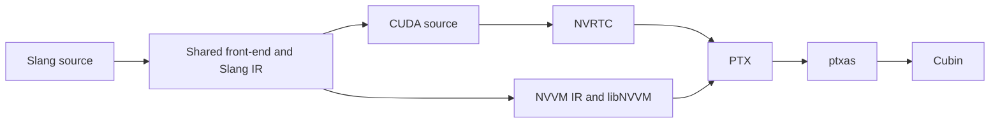

# Six-slide presentation outline

## 1. Direct NVVM backend, integrated with current Slang

The branch now includes master `6eb89786c`. Shared Slang front-end and IR feed either CUDA/NVRTC or the
direct NVVM path. Both produce PTX that the same `ptxas` assembles. Provider ABI42, LLVM14 and CUDA12.9.2
identify this experiment; do not generalize to every GPU/toolkit version.

## 2. Correctness anchor and scope

1713 registered runtime cells;1674 accepted correct,39 unresolved. Mention the explicit serial closure
of one NVRTC PCH infrastructure incident; parallel reliability remains open. Unit/semantic suites and
all 6 material compile/assembly support cells pass. Material rendering/output correctness has no
application contract yet. Source: accepted262 and README's correctness section.

## 3. Material compilation: near parity, not an overall win

Show [wall-time.svg](material/wall-time.svg). The 7,113-line material compiles in about 1.36s for evaluation
and 1.46s for sampling with NVVM O3. NVRTC is 1.36s/1.39s. Evaluation is near parity; sampling takes 5% longer.
Use the two rounds, 18 measured samples/cell and IQR to explain confidence in the observed pattern.
Assembly is separate and slower with NVVM on this workload. Keep O0 visible as a different tradeoff.

## 4. Where to investigate compile time next

Named phase medians from [material JSON](material/summary.json): semantic checking is about 380–389ms,
front-end execution about 533–548ms, and built-in-module loading about 207–208ms. These timers are
nested; never add or stack them. Sampling `generateOutput` is 630.15ms with NVVM O3 versus 542.89ms
with NVRTC O3. That identifies a profiling area, not a proven cause or promised speedup.
The fixed-order shared-session appendix illustrates initialization exposure, not a fair isolated
backend ranking. Do not headline its first-versus-later request differences.

## 5. Generated code: comparable in the small, mixed tradeoffs

Show [entry-registers.svg](quality/entry-registers.svg). Ten of 12 fixtures have equal O3 register
counts; one improves and one worsens. Three have smaller executable text, with tradeoffs shown in
README. Helper-copy transport is a useful concrete example (12→11 registers,32→8 stack bytes).
Material O3 uses more NVVM registers/stack. No GPU runtime speedup is measured; SASS is unavailable.

## 6. Next work, with a reproducible baseline

The package can be refreshed with maintained commands after future accepted changes. Priorities to
discuss: concurrent NVRTC PCH ownership; remaining column-major correctness failures; application
contracts for material runtime; profiling the sampling output stage; fixture-driven lowering/code-size
improvements. Keep implementation slices bounded. Broad compiler reorganization is not justified by
these measurements alone. The current authorized sequence is complete and the development loop stops.

Appendix: [full tables](README.md), [shared process costs](shared-session.md),
[protocol and refresh commands](../../RESULTS.md), [new-session handoff](../../HANDOFF.md).
