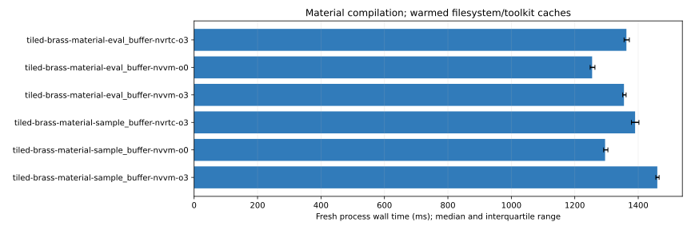

# NVVM material observations

Revision: `201cea6c96e09345700b77f2837404249bdd2deb`.

All times are milliseconds. Wall medians include fresh process/session overhead; assembly is separate. Nested compiler phase timers must not be added.

| Cell | Wall median (IQR) | Assembly median | PTX bytes | Cubin bytes |
| --- | ---: | ---: | ---: | ---: |
| tiled-brass-material-eval_buffer-nvrtc-o3 | 1362.76 (1355.38–1372.03) | 174.09 | 72360 | 70944 |
| tiled-brass-material-eval_buffer-nvvm-o0 | 1254.70 (1248.45–1263.57) | 705.19 | 733879 | 243768 |
| tiled-brass-material-eval_buffer-nvvm-o3 | 1355.04 (1351.06–1361.79) | 210.81 | 82632 | 71336 |
| tiled-brass-material-sample_buffer-nvrtc-o3 | 1390.16 (1378.52–1402.24) | 254.31 | 103321 | 92088 |
| tiled-brass-material-sample_buffer-nvvm-o0 | 1295.55 (1290.98–1304.41) | 880.22 | 906830 | 301624 |
| tiled-brass-material-sample_buffer-nvvm-o3 | 1460.18 (1455.50–1465.83) | 295.17 | 117109 | 94008 |

| Cell | SemanticChecking median ms | compileInner median ms |
| --- | ---: | ---: |
| tiled-brass-material-eval_buffer-nvrtc-o3 | 388.72 | 1061.685 |
| tiled-brass-material-eval_buffer-nvvm-o0 | 379.08000000000004 | 959.08 |
| tiled-brass-material-eval_buffer-nvvm-o3 | 380.14 | 1061.72 |
| tiled-brass-material-sample_buffer-nvrtc-o3 | 388.9 | 1088.15 |
| tiled-brass-material-sample_buffer-nvvm-o0 | 381.285 | 1000.725 |
| tiled-brass-material-sample_buffer-nvvm-o3 | 381.21500000000003 | 1166.125 |

Fresh process/session with warmed filesystem and toolkit caches, including NVRTC PCH when enabled. Compile/assembly observations; no kernel-speed inference. PTX bytes include text/symbols; cubin bytes include metadata; SASS counts and executable text sizes cover the whole module.

Full phase, resource, SASS and executable-section observations: [summary.json](summary.json).
