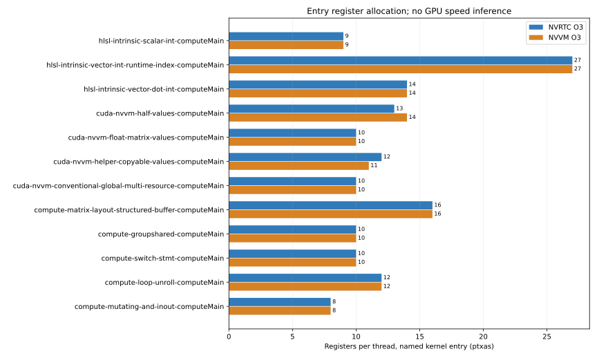

# NVVM quality observations

Revision: `201cea6c96e09345700b77f2837404249bdd2deb`.

Quality latencies are single observations, not a speed benchmark.

| Entry | Registers | Stack bytes | Spill store/load bytes | Module SASS instructions | Executable text bytes |
| --- | ---: | ---: | ---: | ---: | ---: |
| hlsl-intrinsic-scalar-int-computeMain-nvrtc-o3 | 9 | 0 | 0/0 | unavailable | 640 |
| hlsl-intrinsic-scalar-int-computeMain-nvvm-o0 | 13 | 0 | 0/0 | unavailable | 1280 |
| hlsl-intrinsic-scalar-int-computeMain-nvvm-o3 | 9 | 0 | 0/0 | unavailable | 640 |
| hlsl-intrinsic-vector-int-runtime-index-computeMain-nvrtc-o3 | 27 | 0 | 0/0 | unavailable | 2560 |
| hlsl-intrinsic-vector-int-runtime-index-computeMain-nvvm-o0 | 32 | 128 | 0/0 | unavailable | 5376 |
| hlsl-intrinsic-vector-int-runtime-index-computeMain-nvvm-o3 | 27 | 80 | 0/0 | unavailable | 2048 |
| hlsl-intrinsic-vector-dot-int-computeMain-nvrtc-o3 | 14 | 0 | 0/0 | unavailable | 640 |
| hlsl-intrinsic-vector-dot-int-computeMain-nvvm-o0 | 12 | 0 | 0/0 | unavailable | 1152 |
| hlsl-intrinsic-vector-dot-int-computeMain-nvvm-o3 | 14 | 0 | 0/0 | unavailable | 640 |
| cuda-nvvm-half-values-computeMain-nvrtc-o3 | 13 | 8 | 0/0 | unavailable | 896 |
| cuda-nvvm-half-values-computeMain-nvvm-o0 | 14 | 0 | 0/0 | unavailable | 1024 |
| cuda-nvvm-half-values-computeMain-nvvm-o3 | 14 | 0 | 0/0 | unavailable | 768 |
| cuda-nvvm-float-matrix-values-computeMain-nvrtc-o3 | 10 | 0 | 0/0 | unavailable | 384 |
| cuda-nvvm-float-matrix-values-computeMain-nvvm-o0 | 8 | 0 | 0/0 | unavailable | 384 |
| cuda-nvvm-float-matrix-values-computeMain-nvvm-o3 | 10 | 0 | 0/0 | unavailable | 384 |
| cuda-nvvm-helper-copyable-values-computeMain-nvrtc-o3 | 12 | 32 | 0/0 | unavailable | 768 |
| cuda-nvvm-helper-copyable-values-computeMain-nvvm-o0 | 18 | 32 | 0/0 | unavailable | 768 |
| cuda-nvvm-helper-copyable-values-computeMain-nvvm-o3 | 11 | 8 | 0/0 | unavailable | 640 |
| cuda-nvvm-conventional-global-multi-resource-computeMain-nvrtc-o3 | 10 | 0 | 0/0 | unavailable | 384 |
| cuda-nvvm-conventional-global-multi-resource-computeMain-nvvm-o0 | 10 | 0 | 0/0 | unavailable | 512 |
| cuda-nvvm-conventional-global-multi-resource-computeMain-nvvm-o3 | 10 | 0 | 0/0 | unavailable | 384 |
| compute-matrix-layout-structured-buffer-computeMain-nvrtc-o3 | 16 | 0 | 0/0 | unavailable | 896 |
| compute-matrix-layout-structured-buffer-computeMain-nvvm-o0 | 18 | 0 | 0/0 | unavailable | 1920 |
| compute-matrix-layout-structured-buffer-computeMain-nvvm-o3 | 16 | 0 | 0/0 | unavailable | 896 |
| compute-groupshared-computeMain-nvrtc-o3 | 10 | 0 | 0/0 | unavailable | 384 |
| compute-groupshared-computeMain-nvvm-o0 | 9 | 0 | 0/0 | unavailable | 512 |
| compute-groupshared-computeMain-nvvm-o3 | 10 | 0 | 0/0 | unavailable | 384 |
| compute-switch-stmt-computeMain-nvrtc-o3 | 10 | 0 | 0/0 | unavailable | 640 |
| compute-switch-stmt-computeMain-nvvm-o0 | 8 | 0 | 0/0 | unavailable | 768 |
| compute-switch-stmt-computeMain-nvvm-o3 | 10 | 0 | 0/0 | unavailable | 640 |
| compute-loop-unroll-computeMain-nvrtc-o3 | 12 | 0 | 0/0 | unavailable | 384 |
| compute-loop-unroll-computeMain-nvvm-o0 | 11 | 0 | 0/0 | unavailable | 512 |
| compute-loop-unroll-computeMain-nvvm-o3 | 12 | 0 | 0/0 | unavailable | 384 |
| compute-mutating-and-inout-computeMain-nvrtc-o3 | 8 | 0 | 0/0 | unavailable | 384 |
| compute-mutating-and-inout-computeMain-nvvm-o0 | 20 | 8 | 0/0 | unavailable | 1280 |
| compute-mutating-and-inout-computeMain-nvvm-o3 | 8 | 0 | 0/0 | unavailable | 384 |

Fresh process/session with warmed filesystem and toolkit caches, including NVRTC PCH when enabled. Compile/assembly observations; no kernel-speed inference. PTX bytes include text/symbols; cubin bytes include metadata; SASS counts and executable text sizes cover the whole module.

Full phase, resource, SASS and executable-section observations: [summary.json](summary.json).
