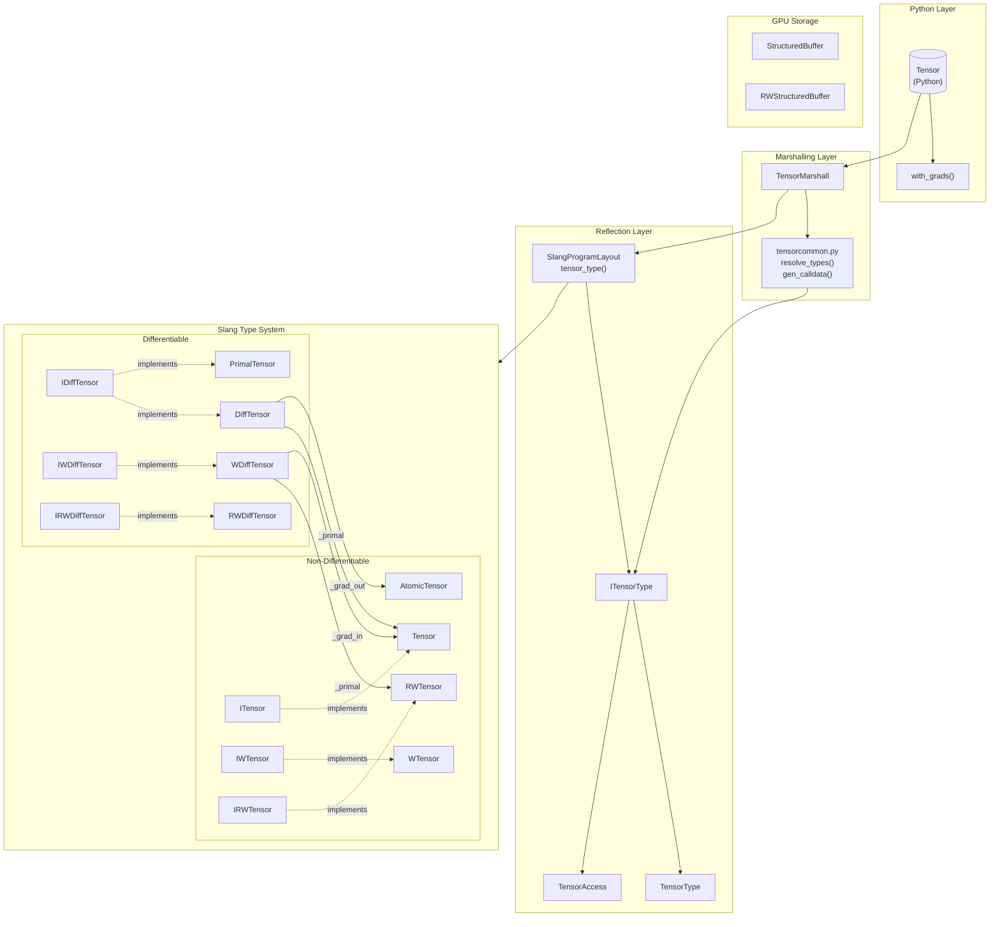
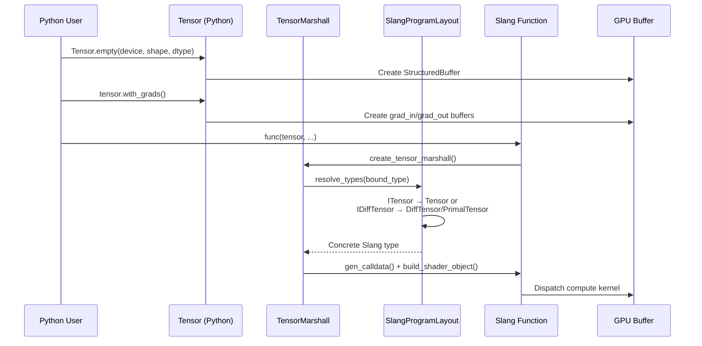
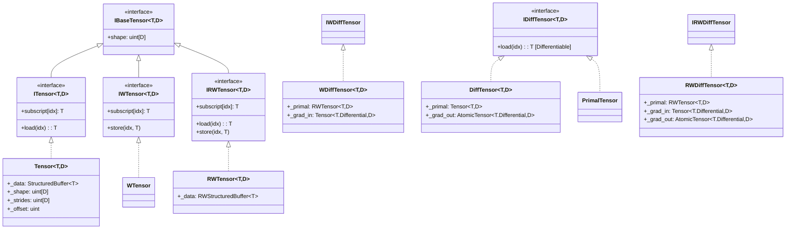
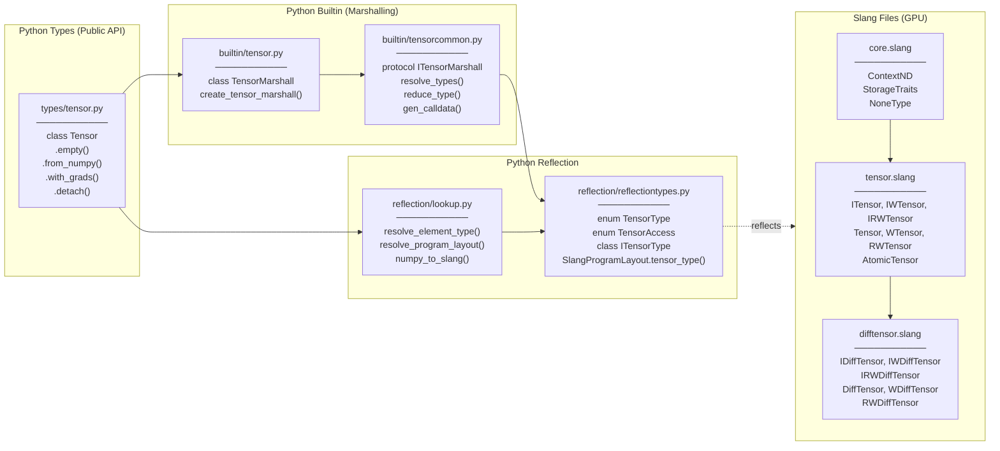
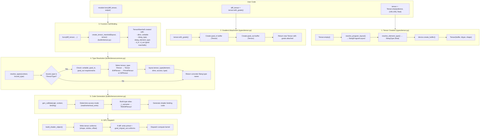
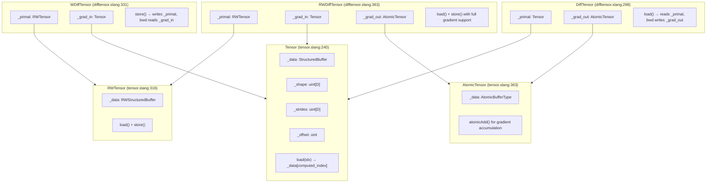

# Tensor Refactor Branch Changes

**Branch:** `dev/ccummings/tensor-refactor-benachmarks`
**Base:** `origin/main` (common ancestor: `13d00fa2`)
**Commits:** 39 commits
**Scope:** +9,684 / -5,504 lines across 122 files

## Overview

This branch implements a **major Tensor API refactor** that overhauls how tensor types work in SlangPy. The primary goals are:

1. Unify buffer types under a cleaner Tensor abstraction
2. Provide proper differentiation support with explicit tensor types
3. Simplify the API by deprecating NDBuffer
4. Add interface types for generic programming

---

## High-Level Architecture



### Data Flow: Python Tensor to GPU



### Tensor Type Hierarchy



---

## Key Files to Review

Start with these files to understand the refactor (in recommended reading order):

### 1. Core Concepts (Start Here)

| File | Purpose | Key Things to Look For |
|------|---------|------------------------|
| `docs/tensorupdate.rst` | Migration guide | Overview of all breaking changes |
| `docs/src/tensors/slang.rst` | Slang API docs | New tensor type system explained |

### 2. Slang Implementation (GPU-Side)

| File | Purpose | Key Things to Look For |
|------|---------|------------------------|
| `slangpy/slang/tensor.slang` | Base tensor types | `ITensor`, `IWTensor`, `IRWTensor` interfaces; `Tensor`, `WTensor`, `RWTensor`, `AtomicTensor` structs; `load()`/`store()` implementations |
| `slangpy/slang/difftensor.slang` | Differentiable tensors | `IDiffTensor`, `IWDiffTensor`, `IRWDiffTensor` interfaces; `DiffTensor`, `WDiffTensor`, `RWDiffTensor` structs; `_primal`, `_grad_in`, `_grad_out` fields; backward derivative macros |
| `slangpy/slang/core.slang` | Core utilities | `ContextND`, `StorageTraits`, type conversion interfaces |

### 3. Python Implementation (Host-Side)

| File | Purpose | Key Things to Look For |
|------|---------|------------------------|
| `slangpy/types/tensor.py` | Python Tensor class | `with_grads()`, `detach()`, `from_numpy()`, `empty()` methods |
| `slangpy/builtin/tensor.py` | Tensor marshalling | `TensorMarshall` class, `create_tensor_marshall()`, gradient handling |
| `slangpy/builtin/tensorcommon.py` | Shared marshalling | `ITensorMarshall` protocol, `resolve_types()`, `gen_calldata()` - core type resolution logic |

### 4. Reflection System

| File | Purpose | Key Things to Look For |
|------|---------|------------------------|
| `slangpy/reflection/reflectiontypes.py` | Type reflection | `TensorType` enum, `TensorAccess` enum, `ITensorType` class (line ~868-1012), `SlangProgramLayout.tensor_type()` |
| `slangpy/reflection/lookup.py` | Type utilities | `resolve_element_type()`, `resolve_program_layout()` |

### 5. Tests (Understanding Usage)

| File | Purpose | Key Things to Look For |
|------|---------|------------------------|
| `slangpy/tests/slangpy_tests/test_tensor.py` | Tensor tests | How to use new tensor types in practice |
| `slangpy/tests/slangpy_tests/test_tensor.slang` | Slang test code | Examples of all tensor type variants (`ITensor`, `IDiffTensor`, `Tensor`, `DiffTensor`, etc.) |

### 6. Benchmarks

| File | Purpose | Key Things to Look For |
|------|---------|------------------------|
| `slangpy/benchmarks/test_benchmark_argcounts.py` | Performance tests | Comparison with PyTorch and slang-torch |

### Quick Reference: File Locations by Topic

```
Understanding the new type system:
├── docs/tensorupdate.rst              # Start here - migration overview
├── docs/src/tensors/slang.rst         # Slang types explained
└── docs/src/tensors/differentiable.rst # Differentiable usage

Slang implementation:
├── slangpy/slang/tensor.slang         # Non-diff tensors (~480 lines)
├── slangpy/slang/difftensor.slang     # Diff tensors (~424 lines)
└── slangpy/slang/core.slang           # Core utilities

Python implementation:
├── slangpy/types/tensor.py            # Public Tensor API (~295 lines)
├── slangpy/builtin/tensor.py          # Tensor marshalling (~187 lines)
└── slangpy/builtin/tensorcommon.py    # Shared logic (~317 lines)

Type resolution:
├── slangpy/reflection/reflectiontypes.py  # ITensorType class
└── slangpy/builtin/tensorcommon.py        # resolve_types() logic
```

---

## How Files and Types Relate

### File Dependency Graph



### How Types Flow Through the System



### Slang Type Composition



### Key Methods Exposed by Each File

#### `slangpy/slang/tensor.slang`

```
Interfaces (for function parameters):
├── ITensor<T, D>        → load(), subscript[] (get only)
├── IWTensor<T, D>       → store(), subscript[] (set only)
└── IRWTensor<T, D>      → load(), store(), subscript[] (get+set)

Concrete Types (for variables, gradient buffers):
├── Tensor<T, D>         → implements ITensor
│   ├── _data: StructuredBuffer<T>
│   ├── _shape, _strides, _offset
│   ├── load(idx), load(int[D]), load(vector<int,D>)
│   ├── read_buffer(linear_idx)
│   └── __slangpy_load() (for SlangPy marshalling)
│
├── WTensor<T, D>        → implements IWTensor
│   └── store(), write_buffer(), __slangpy_store()
│
├── RWTensor<T, D>       → implements IRWTensor
│   └── load() + store()
│
└── AtomicTensor<T, D>   → implements IRWTensor + atomic ops
    └── add(idx, value) for gradient accumulation
```

#### `slangpy/slang/difftensor.slang`

```
Interfaces (for function parameters):
├── IDiffTensor<T, D>    → [Differentiable] load(), subscript[]
├── IWDiffTensor<T, D>   → [Differentiable] store(), subscript[]
└── IRWDiffTensor<T, D>  → [Differentiable] load() + store()

Concrete Types:
├── DiffTensor<T, D>     → implements IDiffTensor
│   ├── _primal: Tensor<T, D>
│   ├── _grad_out: AtomicTensor<T.Differential, D>
│   ├── load() with [BackwardDerivative(_load_bwd)]
│   └── _load_bwd() → _grad_out.add(idx, grad)
│
├── WDiffTensor<T, D>    → implements IWDiffTensor
│   ├── _primal: RWTensor<T, D>
│   ├── _grad_in: Tensor<T.Differential, D>
│   ├── store() with [BackwardDerivative(_store_bwd)]
│   └── _store_bwd() → grad = _grad_in.load(idx)
│
└── RWDiffTensor<T, D>   → implements IRWDiffTensor
    ├── _primal: RWTensor<T, D>
    ├── _grad_in: Tensor<T.Differential, D>
    ├── _grad_out: AtomicTensor<T.Differential, D>
    └── Both load_bwd and store_bwd
```

#### `slangpy/types/tensor.py`

```python
class Tensor(NativeTensor):
    # Construction
    @staticmethod empty(device, shape, dtype, ...) -> Tensor
    @staticmethod zeros(device, shape, dtype, ...) -> Tensor
    @staticmethod from_numpy(device, ndarray, ...) -> Tensor
    @staticmethod empty_like(other) -> Tensor
    @staticmethod zeros_like(other) -> Tensor

    # Gradient management
    def with_grads(grad_in, grad_out, zero=True) -> Tensor
    def detach() -> Tensor

    # Views
    def broadcast_to(shape) -> Tensor
    def view(shape, strides, offset) -> Tensor

    # Data transfer
    def to_numpy() -> np.ndarray
    def to_torch() -> torch.Tensor
    def clear(command_encoder=None)
```

#### `slangpy/builtin/tensor.py`

```python
class TensorMarshall(NativeTensorMarshall):
    def __init__(layout, element_type, dims, writable, d_in, d_out)

    # Properties
    @property has_derivative -> bool    # d_in or d_out present
    @property is_writable -> bool

    # Type resolution (delegates to tensorcommon)
    def resolve_types(context, bound_type) -> list[SlangType]
    def reduce_type(context, dimensions) -> SlangType
    def resolve_dimensionality(context, binding, vector_target_type) -> int

    # Code generation
    def gen_calldata(cgb, context, binding)
    def build_shader_object(context, data) -> ShaderObject

# Factory function registered in PYTHON_TYPES
def create_tensor_marshall(layout, value) -> TensorMarshall
```

#### `slangpy/builtin/tensorcommon.py`

```python
class ITensorMarshall(Protocol):
    """Common interface for tensor-like marshalls"""
    @property dims: int
    @property writable: bool
    @property slang_element_type: SlangType
    @property slang_type: SlangType
    @property layout: SlangProgramLayout
    @property d_in: Optional[ITensorMarshall]
    @property d_out: Optional[ITensorMarshall]

# Core type resolution logic
def resolve_types(self, context, bound_type) -> list[SlangType]:
    """
    Maps Python tensor to compatible Slang types.
    Handles: ITensorType, InterfaceType, UnknownType,
             StructuredBuffer, pointers, vectors, matrices, arrays
    """

def gen_calldata(self, cgb, context, binding):
    """
    Generates type alias for shader code:
    _t_varname -> "RWDiffTensor<float, 2>"
    """
```

#### `slangpy/reflection/reflectiontypes.py` (additions)

```python
class TensorType(Enum):
    tensor = 0        # Tensor, WTensor, RWTensor
    itensor = 1       # ITensor, IWTensor, IRWTensor
    difftensor = 2    # DiffTensor, WDiffTensor, RWDiffTensor
    idifftensor = 3   # IDiffTensor, IWDiffTensor, IRWDiffTensor
    primaltensor = 4  # PrimalTensor, WPrimalTensor, RWPrimalTensor
    atomic = 5        # AtomicTensor

class TensorAccess(Enum):
    read = 0
    write = 1
    read_write = 2

class ITensorType(SlangType):
    """Reflection type for all tensor types"""
    @property access: TensorAccess
    @property readable: bool
    @property writable: bool
    @property difftensor: bool
    @property dims: int
    @property tensor_type: TensorType

    @staticmethod
    def build_tensor_name(element_type, dims, access, tensor_type) -> str:
        """Builds 'RWDiffTensor<float, 2>' from components"""

class SlangProgramLayout:
    def tensor_type(element_type, dims, access, tensor_type) -> SlangType:
        """Creates/finds tensor type in program layout"""
```

---

## Breaking Changes

### Python API

| Before | After |
|--------|-------|
| `NDBuffer(device, dtype, shape=...)` | `Tensor.empty(device, shape=..., dtype=...)` |
| `NDBuffer.from_numpy(...)` | `Tensor.from_numpy(...)` |
| `NDBuffer` type | `Tensor` type (fully deprecated) |

- **`NDBuffer` is fully deprecated** - `Tensor` is now the sole N-dimensional container type
- `Tensor` supports both differentiable and non-differentiable data via the same API
- Gradient tensors are attached via `tensor.with_grads(grad_in, grad_out)`

### Slang API

| Before | After | Notes |
|--------|-------|-------|
| `NDBuffer<T, D>` | `Tensor<T, D>` / `ITensor<T, D>` | Non-differentiable |
| `RWNDBuffer<T, D>` | `RWTensor<T, D>` / `IRWTensor<T, D>` | Non-differentiable |
| `Tensor<T, D>` (old) | `IDiffTensor<T, D>` | For function parameters |
| `RWTensor<T, D>` (old) | `IRWDiffTensor<T, D>` | For function parameters |
| `GradInTensor<T, D>` | `IWDiffTensor<T, D>` | Write-only with input grads |
| `GradOutTensor<T, D>` | `IDiffTensor<T, D>` | Read-only with output grads |
| `GradInOutTensor<T, D>` | `IRWDiffTensor<T, D>` | Read-write with both grads |
| `.get(idx)` / `.getv(idx)` | `.load(idx)` | Element access |
| `.set(idx, val)` / `.setv(idx, val)` | `.store(idx, val)` | Element write |

---

## New Slang Tensor Type System

### Non-Differentiable Tensors (Concrete Types)

| Type | Access | Description |
|------|--------|-------------|
| `Tensor<T, D>` | Read | Read-only tensor |
| `WTensor<T, D>` | Write | Write-only tensor |
| `RWTensor<T, D>` | Read-Write | Read-write tensor |
| `AtomicTensor<T, D>` | Read-Write | With atomic operations (requires `T : IAtomicAddable`) |

### Differentiable Tensors (Concrete Types)

| Type | Access | Gradient Buffers |
|------|--------|------------------|
| `DiffTensor<T, D>` | Read | Primal (read) + Grad Out (atomic write) |
| `WDiffTensor<T, D>` | Write | Primal (write) + Grad In (read) |
| `RWDiffTensor<T, D>` | Read-Write | Primal (r/w) + Grad In (read) + Grad Out (atomic write) |

### Primal Tensors (Concrete Types)

These store only primal values without separate gradient buffers, used internally when passing non-differentiable tensors to `IDiffTensor` interfaces:

| Type | Access |
|------|--------|
| `PrimalTensor<T, D>` | Read |
| `WPrimalTensor<T, D>` | Write |
| `RWPrimalTensor<T, D>` | Read-Write |

### Interface Types (Recommended for Function Parameters)

| Interface | Access | Use Case |
|-----------|--------|----------|
| `ITensor<T, D>` | Read | Non-differentiable input |
| `IWTensor<T, D>` | Write | Non-differentiable output |
| `IRWTensor<T, D>` | Read-Write | Non-differentiable in/out |
| `IDiffTensor<T, D>` | Read | Differentiable input |
| `IWDiffTensor<T, D>` | Write | Differentiable output |
| `IRWDiffTensor<T, D>` | Read-Write | Differentiable in/out |

**Best Practice:** Use interface types for function parameters - they allow SlangPy to select the optimal concrete type based on the Python tensor's properties.

---

## Implementation Details

### New Files

#### Slang Implementation
- `slangpy/slang/tensor.slang` - Base tensor types (`Tensor`, `WTensor`, `RWTensor`, `AtomicTensor`) and interfaces (`ITensor`, `IWTensor`, `IRWTensor`)
- `slangpy/slang/difftensor.slang` - Differentiable tensor types and interfaces (`DiffTensor`, `WDiffTensor`, `RWDiffTensor`, `IDiffTensor`, etc.)
- `slangpy/slang/atomics.slang` - Atomic operation support for gradient accumulation

#### Python Implementation
- `slangpy/builtin/tensorcommon.py` - Shared tensor marshalling protocol (`ITensorMarshall`) and common operations for type resolution
- `slangpy/reflection/lookup.py` - Type lookup utilities for tensor creation

#### Code Generation
- `tools/generate_tensors.py` - Code generator for tensor type boilerplate (load/store methods for various dimensions)

#### Documentation
- `docs/src/tensors/python.rst` - Python Tensor API documentation
- `docs/src/tensors/slang.rst` - Slang tensor types documentation
- `docs/src/tensors/differentiable.rst` - Differentiable tensor usage guide
- `docs/tensorupdate.rst` - Migration guide for existing users

#### Benchmarks
- `slangpy/benchmarks/test_benchmark_argcounts.py` - Benchmarks comparing SlangPy tensor performance vs PyTorch and slang-torch
- `slangpy/benchmarks/test_benchmark_tensor_slangtorch.slang` - Slang-torch benchmark shaders

### Modified Files

#### Core Python Types
- `slangpy/types/tensor.py` - `Tensor` class with gradient support (`with_grads()`, `detach()`)
- `slangpy/types/buffer.py` - `NDBuffer` class (deprecated but maintained for compatibility)
- `slangpy/builtin/tensor.py` - `TensorMarshall` for Tensor type binding
- `slangpy/builtin/ndbuffer.py` - `NDBufferMarshall` updated to use new tensor types internally

#### Reflection System
- `slangpy/reflection/reflectiontypes.py`:
  - Added `TensorType` enum (`tensor`, `itensor`, `difftensor`, `idifftensor`, `primaltensor`, `atomic`)
  - Added `TensorAccess` enum (`read`, `write`, `read_write`)
  - Added `ITensorType` class for tensor type reflection with `build_tensor_name()` static method
  - Extended `SlangProgramLayout.tensor_type()` for programmatic tensor type construction

#### Bindings
- `slangpy/bindings/boundvariable.py` - Updated for tensor type resolution
- `slangpy/core/callsignature.py` - Call mode awareness for primal vs differential passes

#### C++ Extension
- `src/slangpy_ext/utils/slangpytensor.cpp` - Native tensor support with gradient buffers
- `src/slangpy_ext/utils/slangpybuffer.cpp` - Buffer handling updates
- `src/slangpy_ext/utils/slangpystridedbufferview.cpp` - Strided view support

### Deleted Files
- `slangpy/experimental/diffbuffer.py` - Superseded by differentiable tensor types

---

## Tensor Type Resolution Logic

When SlangPy binds a Python `Tensor` to a Slang function parameter, it follows this resolution logic:

1. **Interface → Concrete Type Mapping:**
   - `ITensor` → `Tensor` (non-diff) or `PrimalTensor` (diff context)
   - `IDiffTensor` → `PrimalTensor` (primal pass) or `DiffTensor` (backward/forward diff pass)
   - Other interface types map to their corresponding concrete types

2. **Gradient Requirement Checking:**
   - If parameter expects `grad_in` but tensor has none → TypeError
   - If parameter expects `grad_out` but tensor has none → TypeError

3. **Access Mode Validation:**
   - Read-only tensor cannot bind to writable parameter
   - Element types must match exactly

---

## Key API Examples

### Python: Creating Tensors with Gradients

```python
import slangpy as spy

device = spy.get_device()
tensor = spy.Tensor.empty(device, shape=(1024, 1024), dtype=float)

# Attach gradients for differentiation
diff_tensor = tensor.with_grads(
    grad_in=spy.Tensor.empty_like(tensor),   # For backward pass input
    grad_out=spy.Tensor.empty_like(tensor),  # For backward pass output
    zero=True  # Initialize to zeros
)

# Detach gradients
primal_tensor = diff_tensor.detach()
```

### Slang: Using Interface Types

```slang
import slangpy;

// Recommended: Use interface types for maximum flexibility
void process(int2 idx, IDiffTensor<float, 2> input, IRWDiffTensor<float, 2> output)
{
    float value = input[idx];
    output[idx] = value * 2.0;
}

// Also valid: Concrete types when you need gradient buffer access
void custom_backward(int2 idx, DiffTensor<float, 2> input, WDiffTensor<float, 2> output)
{
    // Can access gradient buffers directly
    float grad = input._grad_out[idx];
    output._grad_in[idx] = grad * 2.0;
}
```

### Slang: Element Access Methods

```slang
// Subscript operator (recommended)
float val = tensor[i, j];        // Using variadic indices
float val = tensor[int2(j, i)];  // Using vector index
float val = tensor[{i, j}];      // Using array index

// Load/store methods
float val = tensor.load(i, j);
float val = tensor.load(int2(j, i));
float val = tensor.load({i, j});

tensor.store(i, j, value);
tensor.store(int2(j, i), value);
tensor.store({i, j}, value);
```

---

## Infrastructure Changes

### External Dependencies
- Updated Slang version to 2025.24
- Updated slang-rhi submodule
- Updated samples submodule

### Build System
- Removed deprecated CMake presets
- Updated `setup.py` for new tensor file structure
- Updated `tools/ci.py` for better test control

### Testing
- All tensor tests updated to use new type names
- Added comprehensive tests for all tensor type variants
- Added interface type tests (`ITensor`, `IDiffTensor`, etc.)
- Added primal tensor tests
- Benchmarks added for performance validation

---

## Migration Guide Summary

1. **Python:** Replace `NDBuffer` with `Tensor.empty()` / `Tensor.from_numpy()`
2. **Slang function parameters:** Replace `Tensor`/`RWTensor` with `IDiffTensor`/`IRWDiffTensor`
3. **Slang variables:** Replace `NDBuffer` with `Tensor`, keep differentiable types as `DiffTensor`
4. **Method calls:** Replace `.get()/.set()` with `.load()/.store()`
5. **Gradient access:** Use concrete `DiffTensor` types when direct gradient buffer access is needed

See `docs/tensorupdate.rst` for the complete migration guide with search-and-replace patterns.