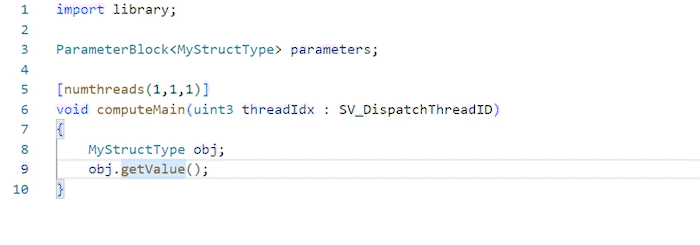

# The Slang Shading Language VSCode Extension

This is the official Visual Studio Code extension for the Slang shading language. Powered by the Slang shader compiler, this extension provides accurate coding assist for both Slang and HLSL.

Both Slang and this extension are open source projects on GitHub. We welcome feedback and contributions. Please report issues or suggest improvements at the [github issue tracker](https://github.com/shader-slang/slang-vscode-extension/issues). If your suggestion involves playground features, please instead report them on the [slang-playground repo](https://github.com/shader-slang/slang-playground/issues).

## Features

This extension provides the following assisting features:

* Enhanced semantic highlighting: user-defined types, variables, parameters, properties and macros will be highlighted.
* Code completion: show context-aware suggestions of variables, functions, types, members, keywords, attributes, HLSL semantics, and `include`/`import` paths.
* Function signature help: view function signatures at call sites.
* Hover information: displays the signature and documentation for the symbol that your mouse is hovering over.
* Go to definition: jumps to the source location that defines the current symbol.
* Document symbol: displays the outline of symbols defined in current document.
* Inlay hint: shows inline hints for parameter names and deduced types.
* Code formatting.
* Diagnostics: displays current compilation errors.

**Note:** the code formatting feature requires `clang-format` to be available on your system. The location of clang-format can be configured in the extension settings.

## Browser support

This extension provides support for browser version of vscode such as vscode.dev and github.dev. However, not all editor features are available.

## Playground Features

This extension also provides features for using shaders:

* A command to build Slang files to different languages
  * SPIR-V
  * HLSL
  * GLSL
  * Metal
  * WGSL
* A command to run Slang Playground projects
* A command to get reflection information for a Slang project
* Documentation via the `Show Playground Documentation` command.

## Configurations

### Predefined preprocessor macros

You can specifiy the set of predefined preprocessor macros that the language server will use via the `slang.predefinedMacros` setting. This will help the language server to provide more accurate result.

### Additional Search Path

By default, the extension will search for all sub directories in the current workspace for an included or imported file. You can specify additional search paths via the `slang.additionalSearchPaths` setting, which will be looked at first. You can also disable the search in workspace directories and make the extension to search only in configured search paths (via `slang.searchInAllWorkspaceDirectories`). The path of the currently opend file will always be used.

### Commit characters for auto completion

Select whether or not to use commit characters to select an auto completion item in addition to pressing the enter key. You can enable commit characters for member completion only or for all types of completion suggestions.

### `clang-format` location and style

The Slang language extension supports auto-formatting with `clang-format`. To use this feature, `clang-format` must be available on your system. By default, the extension will look for `clang-format` in `PATH`. If not found, the extension will try to use the `clang-format` bundled with VSCode C++ extension. If neither options are available, the user must provide the path to `clang-format` via the `slang.format.clangFormatLocation` extension setting.

You can customize the style to use with `clang-format` with the `slang.format.clangFormatStyle` setting.

You may also configure the `slang.format.clangFormatFallbackStyle` setting to specify the style to use when `slang.format.clangFormatStyle` is set to `file` but a `.clang-format` file is not found.

## Demo

Auto completion and signature help:  

Goto definition:  

## For more information

* [Slang public repository](http://github.com/shader-slang/slang)
* [Slang Visual Studio Code Extension repository](https://github.com/shader-slang/slang-vscode-extension)
